# Elementary Computer Science: From Bits and Bytes to the Big Picture

### by Christoph Kirsch

#### Acknowledgements

This book is the result of many years of teaching and working with students and colleagues around the world. I am grateful to my students and faculty in Salzburg who, over the years, helped me with refining and deepening my understanding of computer science. Even earlier my advisor Professor Harald Ganzinger at the Max Planck Institute for Computer Science in Saarbrücken and later, during my postdoc years at UC Berkeley, Professor Tom Henzinger already inspired me to develop a deep sense and passion for principles. I am also particularly grateful to my colleague Professor Raja Sengupta at UC Berkeley who challenged me to the point that made me start developing the Selfie Project which is the foundation of this book. Selfie is educational software for demonstrating the basics of computer science.

The programming language C\* in which selfie is written is a tiny subset of the programming language C developed by Dennis Ritchie. The design of the selfie compiler is inspired by the Oberon compiler of Professor Niklaus Wirth from ETH Zurich. RISC-U, the target language of the selfie compiler, is inspired by the RISC-V community around Professor David Patterson from UC Berkeley. The selfie garbage collector is inspired by the conservative garbage collector of Hans Boehm. The design of the selfie microkernel is inspired by microkernels of Professor Jochen Liedtke from University of Karlsruhe.

#### License

<a rel="license" href="https://creativecommons.org/licenses/by-nc-nd/4.0/"></a><br />This work is licensed under a <a rel="license" href="https://creativecommons.org/licenses/by-nc-nd/4.0/">Creative Commons Attribution-NonCommercial-NoDerivatives 4.0 International License</a>.

## Table of Content

1. Introduction

2. Selfie

   1. Recommended Readings

3. Language

   1. Programming Language C\*
   2. RISC-U Machine Code
   3. EBNF Grammar
   4. Recommended Readings

4. Information

   1. Bits
   2. Numbers
   3. Boolean Algebra
   4. Negative Numbers
   5. Integers
   6. Overflows
   7. Characters
   8. Bytes
   9. Memory
   10. Text
   11. Files
   12. Images
   13. Video
   14. Audio
   15. Code
   16. Apps
   17. Life
   18. Recommended Readings

5. Machine

   1. Model
   2. Processor
   3. Memory
   4. Input/Output
   5. Instructions
   6. Emulation
   7. Performance
   8. Life
   9. Recommended Readings

6. Programming

   1. Literals
   2. Variables
   3. Expressions
   4. Statements
   5. Assignments
   6. Loops
   7. Conditionals
   8. Procedures
   9. Libraries
   10. Apps
   11. Life
   12. Recommended Readings

7. Computing

   1. Compiler
   2. Interpreter
   3. Virtual Machine
   4. Virtual Memory
   5. Virtual Time
   6. Virtual Machine Monitor
   7. Computing as Utility
   8. Cloud Computing
   9. Life
   10. Recommended Readings

8. Glossary

## Introduction

Computer science is a mystery to so many and yet more and more people use computers every day in one form or another. There are increasingly many people with all kinds of backgrounds other than computer science that may even code every day in one way or another. At schools, colleges, universities, and companies around the world there is hardly anyone left who is not confronted with the machine and its code. But even for people just using the machine in their hands, on their desks, and in the cloud there is often that unsatisfactory experience of not understanding what is really going on. This book will empower you to turn your smartphone, tablet, and laptop into what they are supposed to be: the most fascinating and powerful tools ever created rather than the seemingly unavoidable nightmare of so many people, amateurs and professionals alike.

We would like to emphasize that the book is not about how to use any particular device such as a smartphone or an office app such as Word or Excel. There are plenty of books about that. Also, the book is not just about developing code. The goal here is more ambitious than that and you will be challenged accordingly. The idea is to explain the absolute basics of computer science in order to develop a fundamental understanding of what software is and how it works in general on any hardware. Developing code is just one part of that. In fact, understanding the basics enables you to learn *any* programming language you like, not just the one we use here, ultimately allowing you to make informed decisions about computers and solve whatever computer problem comes along. The key challenge in doing so is to have you understand that everything can in principle be automated by a computer but only by breaking down the solution of a problem into the tiniest steps that a mindless machine can follow. Laying out even the most obvious parts of a solution is in fact what computer scientists do. Seeing that will make you sharpen your mind considerably and even change the way you think.

Think of this book as an introduction to *elementary computer science* similar to *elementary arithmetic* taught in primary and secondary school. The vision is to have you look at what you know about numbers, geometry, and algebra from the perspective of a mindless machine. If you know how to add two numbers, how to measure the distance between two points, and what a variable and an equation is, you have all what it takes to understand how a computer works and what software is. Developing a curriculum of elementary computer science suitable for upper secondary school and above is nevertheless still work in progress and this book is just one attempt to do so. It will take a lot more time to make elementary computer science as developed and properly taught as elementary arithmetic but it will eventually happen.

While a book about elementary computer science may sound appealing it actually requires commitment to understand the material even though we tried very hard to simplify everything as much as possible. The reason is that computers and software are so expressive that it is unlikely that any other computational machine in the future will be more expressive. Anything that can be computed can be computed now, provided you have enough time, space (as in memory), and energy. That power comes with a level of complexity that is unavoidable but a lot of fun to explore. Computer science is challenging like other natural sciences. In order to study and understand it you cannot just look at software or hardware and get it. No, its true nature is too complex for that. You need tools to see what is going on, like a microscope, except that here the microscope is a particular way to think!

This book is based on the [Selfie Project](https://selfie.cs.uni-salzburg.at), an educational software system that has grown out of many years of teaching undergraduate and graduate classes in computer science. The key observation is that understanding computer science and software in particular can only be achieved by understanding how software translates all the way down to the machine and then does whatever we want it to do. Selfie shows how this works which may sound difficult but can actually be done in a systematic and well-founded fashion with a strong focus on basic principles. Understanding selfie gives you the microscope you need to understand elementary computer science.

Selfie is *self-referential* software that translates software including *itself* to code that can be *run* or, as computer scientists say, *executed* by a computer. Selfie can even mimic the very computer that can execute the code of selfie. This means selfie cannot only translate itself but also execute its own translation to translate itself again and so on. By now your mind might be spinning but you at least know why selfie is called selfie.

Why is the *self* so important? Because it shows how meaning is created systematically on a machine. Selfie is software written in some programming language. However, selfie also defines the meaning of that language which implies that selfie defines its own meaning. This is very similar to an English dictionary written in English. The only difference is that selfie defines meaning *formally* in such a way that a machine can run selfie and thus any software written in the language in which selfie is written. Understanding that will completely change what you think of computer science and possibly many other things in life.

After introducing selfie, we provide a preview of the kind of *language* we use later in the book. The bad news is that there are three different, in fact *formal languages* that you need to learn. The good news is that all three are widely used in practice and yet so simple that it is difficult to make them any simpler without loosing essential features or making them irrelevant in the real world. The first language is the *programming language* in which selfie is written. It is a tiny subset of the programming language C. The second language is the *machine language* in which the code that selfie translates to and executes is written. It is a tiny subset of 64-bit RISC-V. The third language is a formal language or *grammar* called EBNF for describing how code is supposed to look like. EBNF is incredibly cool because it can even describe how EBNF itself is supposed to look like. This is a beautiful example of self-referentiality that you can actually understand even without any further background in computer science.

At this point you should be ready to do a bit of groundwork. We begin by emphasizing the fact that everything happening on a computer, phone, or tablet is encoded in bits, and nothing else. The only reason why these machines are so powerful and in fact computationally universal is the enormous amount of bits they can store and the speed and energy efficiency at which they can manipulate these bits using nothing but elementary arithmetic. This insight is key to understanding information technology and therefore emphasized throughout the book. We present examples of how every day *information* such as numbers, characters, text, files, images, video, audio, and even code and apps are all encoded in just bits. We also show how those bits are later decoded back to their original form making them accessible to humans again.

The next topic is a simple yet representative *machine model* of virtually any computing device available today. The model is in fact a simplified version of a fully realistic 64-bit RISC-V machine. We developed the model during the course of teaching undergraduate students for two decades. The goal is to enable you to develop an intuition of how computers work on the level of bits, which may at first be a bit tedious but is nevertheless intellectually straightforward and worth it. Once you get the machine everything else falls into place! And you might even be surprised how fundamentally simple the machine is. Most of the complexity of modern computing devices is due to performance optimizations which we deliberately leave out to keep things accessible. Instead we focus on developing an early intuition on what code and data is, what the difference is, and the fact that both are anyway encoded in just bits. This chapter also includes a simple model of machine memory and exposes you to fundamental properties that have direct counterparts in the real world, as it is often the case with computer science, such as where to store information and how to find it again later.

With the machine model in mind, you will appreciate the fact that developing software directly on the machine is possible but too cumbersome and errorprone. It is therefore time to study the notion of high-level *programming languages*. Similar to the machine model, we introduce our simple yet realistic programming language that we also developed during years of teaching. The idea is to walk you through each element of the language, explain what its purpose is and what it means intuitively, and then show how it translates to machine code. The challenge is to maintain two different perspectives in your mind simultaneously: the human perspective, that is, your understanding of what a language element means, and the machine's perspective, that is, what the machine actually makes of each element. Here we depart from the mainstream in programming language education which typically ignores the machine's perspective, assuming that it is unnecessary and anyway too difficult and time-consuming. While this may be true for full-fledged programming languages, we leverage the simplicity of our language and take you even further by demonstrating how the translation itself is implemented in our language. Formalizing the process of translation shows you, probably for the first time, what is actually going on when reading and understanding a non-trivial formalism. Here there are plenty of opportunities to point out fundamental questions such as how long and how much memory and energy it takes to solve a problem and whether a problem can be solved at all. The latter, for example, explains why computers sometime become unresponsive for unpredictable amounts of time driving their users mad.

Even the most convenient high-level programming languages are by far not enough to enable software developers build the most complex systems ever created by humans. Like all engineers they need *tools* to do it. Software development tools are interesting because their design explains a lot about what software is. In fact, the tools define the *semantics* of a programming language, that is, what a program written in a programming language actually means. Thus exposing you to the design of the tools is key to showing how meaning is given to code, at least in principle. There are fascinating analogies in the real world such as the self-referential paradox that an English dictionary defines the meaning of English using English. The same is true with software development tools. They are usually written in the programming language to which they give meaning. The difference to English though is that there is no apparent paradox here. Showing how that works is our goal. You will then start asking questions about computers you would have never been able to ask before. We envision the outcome to be new insights into what is possible and what is not, enabling you to develop more confidence when it comes to assessing new technologies such as artificial intelligence and self-driving cars.

One of the key breakthroughs of recent years is that computation has become a utility just like electricity and water. Cloud computing and, in the near future, edge computing creates enormous potential, just like the reliable availability of power and water. There is no need anymore to operate your own machines other than client machines such as your smartphone. As long as you have a network connection, any form of computational platform is available to you. The key enabling technology is *virtualization* which is a concept whose understanding is elusive even to many computer science students. However, we developed a way to teach virtualization in simple terms accessible to anyone based on a combination of our machine model, programming language, and tool set. The idea is to demonstrate how software can create any computational platform, including the one it runs on, very efficiently. This is another form of self-referentiality that is fundamental in computer science. Seeing that enables you to grasp the full extent of the universality of computing.

This book presents material adequate for senior high-school and freshman/sophomore college students and may be used as textbook by teachers and professors with a background in computer science. The prerequisites for following the material are an understanding of elementary arithmetic (addition, subtraction, multiplication, and division of whole numbers), elementary geometry (one- and two-dimensional shapes), and elementary algebra (variables, algebraic equations). The prerequisites are anyway revisited in the book.

> To boldly go where no one has gone before!

Before we begin, let me tell you how I stayed motivated when writing this book which was probably as hard for me as it is for you to read it all the way to the end. I picked some ideal that I wanted to be. Like many teenage boys I wanted to be an astronaut when I was young. Who do you want to be? Take your pick. When you are done reading all the way to the end, just exchange your pick with the ideal of a person that actually finished this book. Making it through the selfie, language, and information chapters is going to be increasingly challenging but still relatively easy compared to what comes after that. It is like doing the groundwork necessary to become, say, a candidate for astronaut training. The machine chapter after that is what probably happens when you start your training. It is not what you expected and it is brutal. In your mind, you will curse your coach. All those technical details that do not seem to get you anywhere. Why do I have to do this anyway? But then you graduate and they put you on a moon rocket. This is the programming chapter. I hope you are smiling by now. A good sense of humor is the only way. The programming chapter is not easy to read but is less painful than the machine chapter and a lot more rewarding yet you cannot understand it without making it through the machine chapter first. When you are done with the programming chapter you made it to the moon. This is the reward! Then just rest and reflect on what you have achieved. But then the good news comes in and they put you on another rocket to the stars. This is the computing chapter. Reading and actually understanding that chapter is what you have been waiting for all your life but could not get there without first going to the moon. It takes you to a level that you could not possibly have imagined. It will give you *your very own ideas* that no one else had before. To boldly go where no one has gone before!

## Selfie

Why is computer science a topic that polarizes so many people? There are the few that understand and then there is the rest that appear to have no choice but to rely on trial and error and the emotions that come with it when dealing with powerful but still mindless computers and smartphones without understanding what is really going on. The experience that many school children have with elementary mathematics is similar except that simply giving up on it is often perceived as having less of a negative impact later in life, even though this is probably not true.

Computer science, just like mathematics, relies on *formal* languages. There is always this secret language that only the wizards speak, and there is this Kafkaesque gatekeeper that never lets you in. Probably the worst is that the wizards keep telling you that it is actually very easy to understand the secret language, and that once you do, the gatekeeper will let you in but never really does. Well, this is exactly what we do now, with one little difference, of course. We tell you how to make the gatekeeper fall asleep and leave the gate open for you to sneak in.

The trick is to slow yourself down! So much so that it is almost painful taking such tiny steps when learning something so big. The key issue why computer science, and in fact even elementary mathematics, is elusive to so many is that formal languages such as computer code or mathematical formulae are fundamentally different from other, less rigorous forms of expression such as *natural* languages like English or German. Formal languages have *formal* syntax and in particular *formal* semantics. There is no such thing as *casual* code or formulae. In short, they are designed and engineered where, as immediate consequence, everything matters, even the tiniest detail!

The key advantage of a formal language is that its syntax or *notation* and in particular its semantics or *meaning* can be constructed systematically, like a car or a house or even a skyscraper, and then serve as reliable and undisputed but also unforgiving communication tool between people, and between people and machines. The disadvantage is that understanding a formal language not only requires understanding its meaning but actually understanding how its meaning is constructed. This is the reason why learning how to code is not enough to understand computer science. Similarly, learning how to calculate is not enough to understand mathematics.

The ultimate way of learning how meaning is constructed is to learn how to *prove* statements *formally* where both, statements and proofs, are written in a formal language. I still remember how scared I was in school when our math teacher asked us to prove something, and not just play a bit with arithmetic or geometry. Later, in college, that scary ghost of proving something showed up again when our professor asked us to prove the correctness of a program which, despite its small size, turned out to be incredibly hard and tedious.

These days are mostly gone. Math teachers and computer science professors have realized that there are alternatives to the ultimate way that are pedagogically more successful, at least at an introductory level. The idea is to identify the absolute basics in the construction of formal languages and then show how to put them together to construct increasingly complex structure that ultimately becomes the construction of the language itself. It is like taking lots of Lego bricks and then putting them together until a Lego brick factory comes out that is not only made of Lego bricks but can also produce Lego bricks and even other Lego brick factories.

The challenge is to keep students motivated and not fall asleep before the gatekeeper does. Missing just one step may for some already be too much to compensate for later. As math tutor in school I quickly realized that many students struggling with math had sometimes not understood just one tiny detail and then got lost at some point much later. For example, many struggling students had not understood the algebraic concept of a variable as a placeholder, not just for values, but, more importantly, for whole expressions, and therefore checked out by the time we got into calculus, if not earlier. Once I managed to make some of them understand variables, they almost fainted when realizing that even calculus is in fact not such a big deal, as the wizards say.

Teaching computer science has similar issues with one important difference. It is by far a much younger field than mathematics while being subject to a much higher demand for wizardry. Nobody really knows what the absolute basics of computer science even are and what the best way of putting them together actually is. Our approach is to present the basics we believe are essential in bottom-up fashion with a strong systems focus. This means that we first explain what bits and bytes are and then move on to show how increasingly complex systems can be constructed from just that all the way to mobile computing on smartphones and even servers in the cloud.

For this purpose we have developed a software system called selfie that integrates the absolute basics into a minimalist yet still realistic and representative package for demonstrating how software and its meaning is constructed on a mindless machine. In this book, we use selfie in at least three different ways:

1. For you to measure your level of understanding. If you understand the design and implementation of selfie you understand everything we believe is necessary to understand the absolute basics of computer science.

2. For you to improve your level of understanding. By reading this book you start asking questions whose answers you can confirm by interacting with selfie on your computer.

3. For us to make sure there is nothing important missing. Selfie is self-referential on multiple levels which means that if there was something important missing, selfie would probably not work as intended.

In order to interact with selfie effectively and, more importantly, with joy, we ask you to do something that is already quite scary for many students, even though it is similar to using a chat app, just not for chatting with people but with a machine. In short, you need to learn how to use a *terminal* app. Most laptops have a terminal app pre-installed already but even if yours does not, you do not have to install one but just use a terminal in your web browser, which is in fact the easiest way to get access. The homepage of selfie tells you all about how to get started, just go to:

[https://github.com/cksystemsteaching/selfie](https://github.com/cksystemsteaching/selfie)

Once you have a terminal with selfie up and running in a directory called, say, `selfie`, type in the terminal (also called *console*):

```bash
cd selfie
```

The next command is optional. It checks out the version of selfie we used when writing the book:

```bash
git checkout elementary-computer-science
```

Without that command you simply use the latest version of selfie where the output may differ from what you see here.

Then type:

```bash
make
```

and finally:

```bash
./selfie
```

Selfie responds with what is called its *synopsis*. Just that synopsis is already written in a formal language called a *regular expression* that specifies exactly how you can invoke selfie:

```bash
synopsis: ./selfie { -c { source } | -o binary | ( -s | -S ) assembly | -l binary } [ ( -m | -d | -r | -y ) 0-4096 ... ]
```

The synopsis may look quite cryptic already but there is nothing to worry about. As the wizards say, it is surprisingly easy to make sense of it. Important for us is that invoking selfie in a terminal not only allows us to control the system but also to do that slowly, not to annoy you, but to be able to eventually understand everything it does. Try:

```bash
./selfie -c selfie.c
```

or equivalently:

```bash
make self
```

Selfie responds with even more cryptic information but you may safely ignore that for now. What matters here is to realize what just happened. It is something that is still fascinating to me, even after four decades of working with computers. We just instructed selfie (using the `-c` *option* or *console argument*) to translate or *self-compile* the *source code* `selfie.c` in which selfie is written to *machine code* and thereby construct the meaning of its *own* source code. It is like that Lego brick factory that just built another Lego brick factory that looks exactly like the original and can do exactly the same including what the original factory just did.

An important feature of selfie is that you actually have a chance to understand all of it, unlike most modern software systems that are based on the same basic principles but drown you in seemingly prohibitive complexity. Sure, even selfie may appear complex and you can verify that by taking a look at `selfie.c` on the selfie homepage or in your terminal by typing:

```bash
more selfie.c
```

Hit the spacebar to scroll down. Hitting q for quit gets you out. Hard to believe, but all you see there will become clear by reading this book, and, most importantly, that is all there is you need to worry about. Selfie is *self-contained*. There is no need to look at any other code to understand it. By the way, the best way to read, and eventually write code is to use an advanced text editor. We recommend to use the *Atom* text editor, which is free, or the *Sublime Text* editor, which is not free. Selfie and this book was written on Sublime Text. Now, let us try something really cool:

```bash
./selfie -c selfie.c -m 2 -c selfie.c
```

or simply:

```bash
make self-self
```

This takes a few minutes to complete depending on how fast your machine is but just wait for it. Now selfie self-compiled and then ran the resulting machine code (using the `-m` option) to self-compile again. It self-self-compiled. In other words, the Lego brick factory built another Lego brick factory that looks like the original and then opened that factory to build yet another Lego brick factory that again looks like the original. There are more examples mentioned in the README on the selfie homepage that you may want to try out on your machine.

Why is all this more than just a strange game played by computer science wizards? The reason is that the programming language in which the source code of selfie is written is *Turing-complete*, that is, it is *computationally universal* in the sense that any existing computer program but also any program that may ever be written in the future can also be written in that language. It may be cumbersome to do that but in principle this is possible. In other words, if you understand that language and in particular how its meaning is constructed you know what any computer can do now and in the future but also what computers cannot do, no matter how fancy they might become, even though there are always ways to circumvent the impossible by doing something good enough for its purpose.

The machine and its code is universal just like organic life and its DNA. This is also the reason why understanding computer science, just like life science, takes effort. You are about to learn something that is here to stay forever. What are a few months reading and understanding this book compared to that? Here is something that may help you in the process. Students who finally understood selfie often tell me how happy they were when they finally saw how everything fits together. For some it was a life changing experience that made them even change their major to computer science!

> Take a Selfie!

Let us personalize your copy of selfie! Load the source code `selfie.c` into your editor and scroll all the way down to the end of the file. Then, right before the line `exit_code = selfie(0);` insert the following code but with my name replaced by yours:

```c
printf("%s: This is Christoph Kirsch's Selfie!\n", selfie_name);
```

From now on, selfie prints your name before doing anything else. Try it:

```bash
make self
```

You may also want to run the *autograder* that comes with selfie (requires Python 3 installed on your machine):

```bash
./grader/self.py
```

Students of my classes use it for self-grading to determine their grades on programming assignments with selfie before submitting any solutions. The assignments are described in the `assignments` directory of the selfie repository. Code and documentation of the autograder is in the `grader` directory. See also the selfie homepage for more information.

Try running the autograder on your code to see which grade you would get in class:

```bash
./grader/self.py print-your-name
```

If you see grade 2, you are good. Throughout the book, we point out exercises based on the assignments that the autograder supports.

### Recommended Readings

At the end of each chapter there is a section with literature recommendations for exploring the topic of the chapter further. Here are our first two recommendations.

> The Art of Computer Programming by Donald E. Knuth

This book is seminal work in multiple volumes that provides comprehensive coverage of many aspects of computer science. It is the de-facto standard encyclopedia of computer science. You may want to consider this book for starting your own computer science library, and use it as invaluable reference.

> Gödel, Escher, Bach by Douglas Hofstadter

This book is mostly non-technical but still seminal work on fundamental concepts in mathematics and computer science. It uses formal languages and self-reference to explore how meaning is created through seemingly meaningless building blocks. You may want to consider this book to be the second book in your computer science library, and read it during your free time.

## Language

Gödel, Escher, Bach told me a lesson that I still remember after reading the book thirty years ago: the importance of language and the joy that comes with it! And by language I mean *formal* language, not *natural* language like English or German. Understanding the nature of information requires formal language. Once you understand a few of those formal languages you will see their enormous power.

> Formal languages have formal semantics

That power is rooted in a key property: formal languages have *formal* semantics. Their meaning is mathematically precise which enables us to communicate, not just with mindless machines to make them do smart things without understanding anything, but also with each other, understanding everything with mathematical rigor. In fact, once you learn how to express your ideas in formal languages, which includes programming languages but not only, you will change the way you think.

> C\*

We introduce three different formal languages in this book. All three are simple versions of languages used in practice in all kinds of software projects and millions of lines of code. The first language is called C\*, pronounced "C Star". C\* is a tiny subset of the programming language C which is still among the most widely used programming languages in the world. C\* has been developed by us for educational purposes and is the programming language in which selfie is written. Even if you have never written code, C\* is easy to understand. You will learn it here.

> RISC-U

The second language is called RISC-U, pronounced "Risk You". RISC-U is a tiny subset of the machine language RISC-V, pronounced "Risk Five". RISC-V like all machine languages comes in two flavors, *assembly* and *binary*. Assembly code is a textual and thus human-readable form of binary code which can actually be executed by a real processor. Again, RISC-U is so simple that you can easily understand it, even without any prior knowledge in computer science.

> EBNF

The third language is called EBNF which stands for *Extended Backus-Naur Form*. EBNF is a formal language or *grammar* for describing the *syntax* of formal languages. EBNF can even describe its own syntax which is the simplest form of self-referentiality we see in this book. We use EBNF to define (parts of) the syntax of C\*, RISC-U assembly, and, well, even (all of) EBNF. That gives you the first glimpse of self-referentiality in a formal language.

In the following, we introduce a few code examples written in C\*, and then show you how some of that code translates to actual RISC-U assembly and even RISC-U binary code. We then show you how EBNF is used to define some of the C\* and RISC-U assembly syntax and finally the EBNF syntax itself.

Most importantly, take your time! We go through almost every detail and motivate everything. In my experience, few people are used to that and have a hard time slowing down to the extent we do that here. However, learning and truly understanding formal languages requires patience and focus. The good news is that you do not have to do that with all formal languages you may need to learn throughout your career. But doing it once, as opposed to never, makes all the difference!

### Programming Language C\*

C\* is a tiny subset of the programming language C. In a nutshell, for readers familiar with basic programming language terminology, C\* features global variable declarations with optional initialization as well as procedures with parameters and local variables. C\* has five statements (assignment, while loop, if-then-else, procedure call, and return) and standard arithmetic (`+`, `-`, `*`, `/`, `%`) and comparison (`==`, `!=`, `<`, `>`, `<=`, `>=`) operators over variables and procedure calls as well as integer, character, and string literals. C\* includes the unary `*` operator for dereferencing pointers hence the name but excludes data types other than `uint64_t` and `uint64_t*` (`int` is bootstrapped to `uint64_t`), bitwise and Boolean operators, and many other features. The C\* grammar is LL(1) with 7 keywords and 22 symbols. Whitespace as well as single-line (`//`) and multi-line (`/*` to `*/`) comments are ignored. For more information see:

[https://github.com/cksystemsteaching/selfie/blob/main/grammar.md](https://github.com/cksystemsteaching/selfie/blob/main/grammar.md)

The following example is C\* code that implements a simple *numerical function* in a *procedure* called `double` for calculating the doubled value of a given *whole number* or *integer* represented by a *formal parameter* `n`:

```c
int double(int n) {
  return n + n;
}
```

As intended by the designers of the programming language C, and in fact many other programming languages including C\*, the code can be read like a sentence in English: *define* a procedure `double` with a formal parameter `n` as follows. Given an integer value for `n`, return the value to which the *arithmetic expression* `n + n` evaluates. The line `return n + n;` is called a `return` *statement*. However, the difference between C and English is that C code is more succinct and, more importantly, its meaning is precisely defined, as opposed to the meaning of a sentence in English.

First of all, the code needs to be written according to strict syntactic rules. We need to say `int` and `return`, also called *keywords*, exactly as is, and even the parentheses, the braces, and the semicolon need to be where they are. But the code also contains information about how large the value of `n` as well as its doubled value as returned by `double` can ever be. This is done using the `int` keyword which specifies the *range* or *type* of the involved values.

> The range of numerical values on a computer is always finite!

Most importantly, the `double` procedure you see here is not a mathematical function on arbitrarily large numerical values. It is code that instructs a machine to compute the doubled value of whole numbers within a given finite range. This is a big difference!

When I started coding as teenager, I was confronted with lots of these numerical functions written in code. It took me some time to understand why I had to study those, instead of writing code that makes my computer immediately do something more interesting like a game I can talk about with normal people like my parents. If you feel like that, bear with me. We will get there.

The reason why we first look at numerical functions written in code is because such code has an immediate connection to something we all know and understand, at least intuitively: elementary arithmetic! That helps understanding the true meaning of code early on.

So, let us try and use selfie to run the `double` procedure on some actual number, say, `42` also called an *integer literal*. Here is the C\* *program* to do that:

```c
int double(int n) {
  return n + n;
}

int main() {
  return double(42);
}
```

We have prepared that code in a text file called `double.c` in the `examples` folder of the selfie system. So, just type in your terminal:

```bash
./selfie -c examples/double.c -m 1
```

Selfie responds with quite a bit of text but just look for `double.c exiting with exit code 84`. That's it! The above code instructs selfie to return the result of `double(42)` which is obviously `84`. The way this works is simple. Each program must contain a procedure called `main` to actually do anything useful. That procedure is always the first to run and everything follows from there. When `main` returns, program execution is finished and whatever `main` returns is shown as *exit code*.

> Procedures may have formal parameters and be called with actual parameters

There are a number of important concepts here. There are *procedure definitions* such as `int double(int n) { ... }` introducing a procedure called `double` with a formal parameter `n` of type `int` and a so-called *return type* `int` to the left of `double` which specifies the type of values the procedure returns. Formal parameters and return type as in `int double(int n)` form what is called the *procedure signature*. The actual code of the procedure is in between curly braces and is called *procedure body*. Similarly, there is a procedure definition for `main` as well. And there are *procedure calls* such as `double(42)` in the `main` procedure invoking the procedure `double` on an *actual parameter* `42`.

> Procedures are defined exactly once but may be used in procedure calls many times

Procedure definitions must be uniquely identified, say, by name, as in C\*, but can then be used in procedure calls as many times as you like from anywhere in the code. Makes sense? Okay, then let us try to change the definition or in fact implementation of `double`:

```c
int double(int n) {
  return 2 * n;
}
```

This version of `double` computes the same value as the previous version of `double`, just using multiplication rather than addition, that is, `2` times `n` or simply `2 * n` rather than `n + n`. We can obviously implement other procedures as well such as a procedure that computes the square value of an integer `n`:

```c
int square(int n) {
  return n * n;
}
```

In addition to `+` and `*`, C\* also supports the other two *operators* of elementary arithmetic for subtraction and division, denoted `-` and `/`, respectively, as well as remainder, denoted `%`, and parentheses for *grouping* arithmetic expressions to overrule the *precedence* of `*`, `/`, and `%` over `+` and `-`, as well as the *associativity* of `-`, `/`, and `%`. Remember, in elementary arithmetic `1 + 2 * 3` is equal to `1 + (2 * 3)`, not `(1 + 2) * 3`, because `*` has higher precedence than `+`, and `1 - 2 + 3` is equal to `(1 - 2) + 3`, not `1 - (2 + 3)`, because `-` and `+` are *left-associative*. So, we may say something like this:

```c
int fancy(int n) {
  return n * (n + 1) - n / 2 + 42;
}
```

In C\* and many other programming languages, such arithmetic expressions are standard and widely used in practice. You may want to try a few others and see how selfie responds. Below we show you the exact rules, written in EBNF, for constructing arithmetic expressions.

Let us now experiment with something that goes beyond arithmetic expressions. How about a procedure that returns the larger of two given values? Here is a procedure called `max` that does exactly that:

```c
int max(int n, int m) {
  if (n < m)
  	return m;
  else
  	return n;
}
```

Again, the code can be read like a sentence in English: define a procedure `max` with two formal parameters `n` and `m` as follows. Given integer values for `n` and `m`, return the value of `m` if the value of `n` is less than the value of `m`. Otherwise, return the value of `n`. This is a *conditional statement*, which in C\* is called an `if` *statement*. The *comparison* or *relational expression* `n < m` is called an `if` *condition* which can evaluate either to *true* or to *false*. The statement `return m` is part of the `if` *body* of the `if` statement while the statement `return n` is part of the `else` *body* of the `if` statement.

> Conditional: if this is true do that else do that

Conditional statements are a powerful concept for controlling program execution. They allow us to make a choice on anything we are interested in and we can use any number of them to form a whole sequence of choices. However, any such sequence must be finite because programs are finite artifacts. But what if we would like our program to do something where, at the time of writing the program, we do not know how much work is involved and in particular how many choices need to be made when running the program? The concept that allows us to do that is called a *loop statement* which is even more powerful than a conditional statement. Here is an example written in C\* featuring a `while` *loop* over a *variable* `c`:

```c
int count(int n) {
  int c;

  c = 0;

  while (c < n)
    c = c + 1;

  return c;
}
```

Again, the code can be read like an English sentence: define a procedure `count` with a formal parameter `n` as follows. First, *declare* a variable `c` and then *initialize* the value of `c` to `0`. After that, given an integer value for `n`, if the value of `c` is less than the value of `n`, increment the value of `c` by `1`, and keep doing that until the value of `c` is not less than the value of `n` anymore. When this happens, return the value of `c`.

> Loop: as long as this is true keep doing that

The comparison `c < n` is called a `while` *condition* or *loop condition*. If the condition evaluates to true, the `while` *body* or *loop body*, here `c = c + 1`, is executed once and then the condition is evaluated again, and so on. If the condition evaluates to false, the loop body is not executed, effectively terminating the loop, and instead the statement after the loop, here `return c`, is executed.

> Loops subsume conditionals

Interestingly, loops are strictly more expressive than conditionals. In other words, a program containing conditionals can always be rewritten into a program without conditionals just using loops instead. Those loops will be a bit strange because they will only loop at most once to mimic conditionals properly. The other way around is of course not possible. Loops can in general not be replaced by conditionals. So, why do we have conditionals? Well, just making choices without looping is a common sight in programs and deserves a dedicated language element to make the code more readable but also more efficient. Figuring out that a loop always operates like a conditional is not easy for a machine and even impossible in general.

> Assignment is not equality!

Before we take another look at the `while` loop, let us focus on the statement `c = c + 1` which is called an *assignment*. Here, most importantly, `=` does not denote *equality* in a mathematical sense. Instead, here and in many other circumstances in computer science, especially code, `=` denotes an assignment of a value to a variable. With `c = c + 1` we do not assert equality between `c` and `c + 1`. Instead, we denote the process of assigning to the variable `c` occurring in the *left-hand side* (LHS) of the assignment operator `=` the value to which the arithmetic expression `c + 1` occurring in the *right-hand side* (RHS) of `=` evaluates *before* the assignment is actually done.

In fact, *after* the assignment is done, evaluating `c + 1` again would result in a different value than the value of `c`! This is because `c` also occurs in the expression `c + 1`. But even if it does not, as in the `c = 0` assignment for example, where the value of `c` is actually equal to `0` *after* the assignment is done, an assignment is still a different statement than asserting equality because `c` may very well have a different value than `0` *before* the assignment is done. The difference is sometimes emphasized by using `:=` to denote an assignment instead of just `=`. Unfortunately, however, `=` is standard notation for assignments in many programming languages which is why we stick to using `=`. Equality, on the other hand, is denoted by `==` in many programming languages, so we use `==` to assert or just check equality from now on. In C\*, besides `==`, `<`, and `>`, there are also `!=` for checking *inequality*, `<=` for checking *less-than-or-equal-to*, and `>=` for checking *greater-than-or-equal-to*.

> Imperative programming: do that and then do that

The presence of assignments in a programming language indicates that the language supports a *programming paradigm* called *imperative programming* in which a computer is told what to do in a sequence of statements, especially assignments, that are in a *before-and-after* relationship. Doing so in procedures is a form of imperative programming called *procedural programming*. The `count` procedure is our first example of an imperative and even procedural program.

> Iteration: do that again and again

Moreover, `count` makes a computer solve a problem *iteratively* in a loop which takes more or less time to finish depending on the input of the program. To some extent this is also possible just using conditional statements. However, loops are a different story. They can even loop forever which means that programs with loops may not *terminate* and, as a result, not respond anymore like apps on your smartphone sometimes do.

Thus showing that a program computes the desired result generally requires showing that it computes the result in *finitely* many iterations. That can actually become quite tricky even with proper training. In our case here, however, it is easy to see that `count` does indeed always terminate since the value of `c` is incremented in each iteration of the `while` loop and thus always *eventually*, that is, in finitely many iterations, makes the loop condition `c < n` evaluate to false terminating the loop.

> C\* is computationally universal, also called Turing-complete

Interestingly, the elements of C\* you have seen so far are enough to do anything any other programming language can do. We say that C\* is *computationally universal* or *Turing-complete*. If you take a program written in any other programming language, we can always rewrite it into a program written in C\* that computes exactly the same as the original. It may be cumbersome to do that but it is always possible. Hard to believe but true!

Let us analyze what `count` really does. The procedure effectively returns, well, the value of `n`, after "counting" from `0` to `n`. In other words, `count(n)` implements the *identity* function, at least for `n == 0` and for all *positive* values of `n`, that is, all numbers greater than `0`. Let us ignore *negative* values of `n`, that is, numbers less than `0`, for now. In that case, we could also implement `count` as follows:

```c
int count(int n) {
  return n;
}
```

So, what is the difference between the two versions of `count`? Well, in terms of functionality there is no difference as long as we ignore negative values of `n`. However, there is a significant difference in *algorithmic complexity* and thus *performance*, that is, the time it takes `count` to finish.

> Algorithmic complexity: how fast runs a program in principle for all inputs?
>
> Performance: how fast runs a program on a given machine for a given input?

The first version of `count` with the `while` loop can actually become quite slow for large values of `n` whereas the second version always takes the same amount of time independently of the value of `n`. We say that the first version runs in *linear time* in the value of `n`, since it takes as many loop iterations to complete as the value of `n`, while the second version runs in *constant time*. In short, their algorithmic complexity is linear and constant, respectively.

Their performance may nevertheless be similar for small values of `n` because computers can go through a few loop iterations very fast. However, the second version will certainly be noticeably faster than the first version for large values of `n`. Algorithmic complexity is essentially the performance of a program or in fact the *algorithm* implemented by a program as a (unitless) function of the size of the input to the program. It tells you about a performance trend but not actual performance which can only be measured by running the program on some machine and input. We get back to algorithmic complexity and performance in subsequent chapters.

While avoiding linear time here is easy using the second version, it may be more difficult to do so in other circumstances. Here is a code example that runs in linear time in the value of `n` and is not so easy to make faster while producing the same result. It computes the *factorial* of a positive integer `n` iteratively in a loop:

```c
int factorial(int n) {
  int f;

  f = 1;

  while (n > 1) {
    f = f * n;

    n = n - 1;
  }

  return f;
}
```

Remember, the factorial of a positive integer `n` is the product of all positive values less than or equal to `n`, that is, the factorial of `n` is equal to `n * (n - 1) * ... * 2 * 1` for all `n > 0`. For example, the factorial of `4` is equal to `4 * 3 * 2 * 1` which is obviously `24`. The factorial of `1` and even the factorial of `0` are both equal to `1`, the latter by convention.

The above code reads in English as follows: define a procedure `factorial` with a formal parameter `n` as follows. First, declare a variable `f` and then initialize the value of `f` to `1`. Then, given an integer value for `n`, if the value of `n` is greater than `1`, multiply the value of `f` by the value of `n` and then decrement the value of `n` by `1`, and keep doing that until the value of `n` is not greater than `1` anymore. When this happens, return the value of `f`. So, the code actually computes `1 * n * (n - 1) * ... * 2` which is obviously equal to `n * (n - 1) * ... * 2 * 1` due to the *associativity* of multiplication or, in fact here, just because of the special case that `1` is the multiplicative identity. Also, `factorial` always terminates since the value of `n` is decremented in each iteration of the `while` loop and thus always eventually makes the loop condition `n > 1` evaluate to false terminating the loop. In fact, `factorial` therefore does, as promised, run in linear time in the value of `n`. Note that the code also works for `n == 0`.

Now, there is one more thing that is truly remarkable. Instead of computing the factorial iteratively in a loop, we may also compute it *recursively* using code that looks quite different and yet computes exactly the same result as the iterative version:

```c
int factorial(int n) {
  if (n > 1)
  	return n * factorial(n - 1);
  else
  	return 1;
}
```

This time the code is even in English a lot shorter: define a procedure `factorial` with a formal parameter `n` as follows. Given an integer value for `n`, if the value of `n` is greater than `1`, return the value of `n` multiplied by the value of `factorial(n - 1)`. Otherwise, return `1`. This is brilliant! The code is not only more compact but also does not even require any additional language elements. In fact, it requires less, in particular no assignments.

> Functional programming: just tell me what to do but not how

Procedural programming without imperative programming, that is, programming procedures without assignments, follows a programming paradigm called *functional programming* since procedures without assignments resemble mathematical functions. Indeed, the above code almost looks like the mathematical definition of factorials and actually appears not to say how to compute factorials.

> Recursion: solve a problem by assuming there is a partial solution

But what is the catch? Well, the code uses *recursion* which is a concept that takes time and effort to understand. We explain it here but also revisit it again later. Recursion is a method for solving a problem using solutions to smaller instances of the problem through *self-reference*.

In our example, the `factorial` procedure, given an integer value for `n`, calls *itself* on the value of `n - 1` which is obviously smaller than the value of `n`. This may sound strange but it still works because the *definition* of a procedure such as `int factorial(int n) { ... }` (with a formal parameter `int n`) and the *use* of a procedure such as `factorial(n - 1)` (with an actual parameter `n - 1`) are two entirely different concepts that take effect at different times. Code is defined *before* it is executed whereas code is only used *when* it is executed.

Nevertheless, similar to the iterative version of `factorial`, we still need to argue that this version of `factorial` also computes the factorial of a positive integer `n` in finitely many steps. For simplicity, let us do that just for a given integer value of `n`, say, `4` by looking at the execution of the code as follows:

```c
factorial(4) == 4 * factorial(3) == 4 * (3 * factorial(2)) == 4 * (3 * (2 * factorial(1))) == 4 * (3 * (2 * 1))
```

where `4 * (3 * (2 * 1))` is obviously equal to `4 * 3 * 2 * 1`, again due to the associativity of multiplication.

In general, we need to use *structural induction* to argue that the *inductive step* `factorial(n) == n * factorial(n - 1)` for all `n > 1` as asserted by the `if` or *termination* condition `n > 1` together with the *base case* `factorial(1) == 1` does indeed compute the factorial of a positive integer `n`. It is actually not very difficult to apply structural induction, even if you have never heard of it, but it is also not very interesting here, so we leave it at that.

The key intuition for showing termination of a recursive procedure such as `factorial` is that the procedure recurses on instances of the problem whose size is *monotonically* decreasing (here `n - 1`), similar to the iterative version of `factorial`, and that there exists a *smallest* instance that is thus always eventually reached (here value `1`). Note that the code again works for `n == 0` as well.

So, the iterative and recursive versions of `factorial` compute the same function. What about algorithmic complexity and performance? As it turns out, the recursive version also runs in linear time in the value of `n`, just like the iterative version. In fact, given an integer value for `n`, the iterative version performs exactly as many loop iterations as the recursive version calls itself recursively.

> Space complexity: how much memory needs a program to run?

There is a difference though which is the *space complexity* of the two versions, that is, the amount of memory needed to run the code. The iterative version only requires *constant space*, that is, a constant amount of memory, independent of the input, namely to store the values of `n` and `f`. The recursive version, however, requires *linear space* in the value of `n` because during recursion it needs to remember all values of `n` from the original value of `n` down to `2`.

The values are stored in memory automatically because each time a procedure such as `factorial` is called its actual parameters are stored in memory where the procedure can pick them up and work on them. But this also means that, if a procedure calls itself and after that still has something to do before it returns, its current actual parameters (here the value of `n`) remain in memory while the new actual parameters (here the value of `n - 1`) are stored in memory as well, and so on. Our example with `4 * (3 * (2 * 1))` shows that. Before we can multiply `4` by `(3 * (2 * 1))` we need to remember `4` in memory and multiply `3` by `(2 * 1)` first. However, we can only do that after storing `3` in memory and multiplying `2` by `1` first. This is a serious drawback of the recursive version, especially for large values of `n`.

> Tail recursion: recurse to iterate

The good news, however, is that in some cases we can change the recursive version such that it only requires constant space while still using a special form of recursion called *tail recursion*. Consider the following code which computes exactly the same function as the iterative and recursive versions but only requires constant space to run:

```c
int tail_recursive(int f, int n) {
  if (n > 1)
  	return tail_recursive(f * n, n - 1);
  else
  	return f;
}

int factorial(int n) {
  return tail_recursive(1, n);
}
```

A recursive procedure is *tail-recursive* if every procedure call done by the procedure is tail-recursive. A procedure call is *tail-recursive* if it is the *last* operation done before returning hence the name. The statement `return tail_recursive(f * n, n - 1);` does exactly that. It is a tail-recursive procedure call by the procedure `tail_recursive` to itself. In contrast, the procedure call `factorial(n - 1)` in the statement `return n * factorial(n - 1);` of the recursive version of `factorial` is not tail-recursive because, before returning, `n` still needs to be multiplied by the value returned by `factorial(n - 1)` which requires remembering the value of `n` in each call to `factorial`. Let us have a look at the execution of the code, again for `n == 4`:

```c
factorial(4) == tail_recursive(1, 4) == tail_recursive(1 * 4, 3) == tail_recursive(4 * 3, 2) == tail_recursive(12 * 2, 1) == 24
```

That looks quite similar to what the iterative version does! It computes `1 * 4 * 3 * 2`, just like the iterative version, instead of `4 * (3 * (2 * 1))`, as done by the recursive version. Tail recursion combines the advantages of iteration (memory usage) and recursion (functional correctness) but not all problems can be solved using tail recursion, namely those that intrinsically require non-constant space. However, in that case even iteration requires non-constant space.

Before moving on, we take another look at iteration versus recursion. The following code is yet another implementation of factorial revealing that iteration and tail-recursion is essentially the same thing. It involves the use of a *global variable* `f`, in contrast to a *local variable* `f`, as in the iterative version. The text to the right of any double slashes `//` is called a *comment* and just meant to help us understand the code and the point we are trying to make. Comments are completely ignored by the machine. For the machine, it is as if they are not there:

```c
int f; // global variable (!)

void tail_recursive(int n) {
  if (n > 1) {             // while (n > 1) {
  	f = f * n;             //   f = f * n;
                           //
  	tail_recursive(n - 1); //   n = n - 1;
  }                        // }
}

int factorial(int n) {
  f = 1;

  tail_recursive(n); // while (n > 1) { f = f * n; n = n - 1; }

  return f;
}
```

So, first of all, what is the difference between a global and a local variable? It is the *scope* of the variable, that is, where in the code the variable can be used and where not, and it is the *memory* for the value of the variable, that is, where in memory and in particular how often the value is stored.

> A global variable can be used in all procedures

A global variable is declared outside of any procedure body, can be used in all procedures, and its value is stored in memory only once. In short, it can be used everywhere and it only has one value. In the above code, `f` in `tail_recursive` and `factorial` refers to the same global variable `f`. Thus, instead of returning values, `tail_recursive` may operate directly on `f` and thus communicate with other procedures such as `factorial` implicitly through `f`. In fact, the return type of `tail_recursive` is not `int` but `void` which means that `tail_recursive` neither returns any value explicitly nor can be called in a `return` statement.

> A local variable can only be used in the procedure in which it is declared

In contrast, a local variable can only be used in the procedure in which it is declared such as the local variable `f` in the iterative version of `factorial`. Moreover, the value of a local variable of a given procedure is stored in memory for each call to the procedure. This is exactly like formal and actual parameters!

Remember, the recursive version of `factorial` stores the value of `n` for each call to `factorial` to be able to multiply it by the result of the next call to `factorial`. Local variables are therefore just a special case of formal parameters. We could live without local variables and just use formal parameters. However, using local variables is more concise than using formal parameters for storing information that is only relevant within a procedure.

> Tail recursion is iteration by recursion

Interestingly, the above code looks almost like the code of the iterative version! That is because tail recursion is like iteration, just by different means. Tail recursion uses a procedure with an `if` statement and a termination condition, here `n > 1`, rather than a `while` loop with the same loop condition. The loop itself is constructed by the tail-recursive procedure call, here `tail_recursive(n - 1);`.

So, you might ask why all this matters. Well, there is an important lesson to be learned here. When it comes to programming there are lots of different ways of writing code that in the end may do exactly the same thing. First of all, there are lots of different programming languages. But even if you stick to just one language, there are still lots of different choices to be made such as iteration versus recursion and global versus local variables. To make matters worse, these concepts may be called something else in other programming languages. However, their fundamental nature is always the same. An important goal of this book is to enable you to make informed decisions no matter which programming environment and language you actually use.

> Pointers: from numbers to data

There is one more thing in C\* you have not seen yet. It is called *pointers*. They actually gave C\* its name because pointers in C are declared and *dereferenced* using the asterisk symbol `*`. They are the only means in C\* to construct any kind of *data structure* beyond mere integers. In other words, what you have seen of C\* so far only allows us to implement numerical functions, at least when using C\* as intended. Nevertheless, we would like to write code that handles not just numbers but any kind of information, of course. Pointers allow us to do that. For example, the expression `*n` does not evaluate to the value of `n` but instead evaluates to the value stored in memory where the value of `n` points to. However, understanding pointers in detail requires a bit more background on how digital memory works. We therefore come back to the topic in subsequent chapters.

By now, you have seen all features of C\* except pointers. We have shown you what C\* code looks like and what it means. But programming in C\*, or any other programming language, requires practice and curiosity. Try to verify your understanding of the language by writing small programs in C\*, similar to our code examples, and running them through selfie. Try to predict what your code does and then use selfie to see if it actually does that. If not, try to find out why by modifying your code.

Before moving on, let us have a look at the output of selfie when compiling itself to machine code:

```bash
./selfie -c selfie.c
```

The first few lines of output give you an idea of the size of the system in terms of the C\* language constructs we just introduced:

```
./selfie: this is the selfie system from selfie.cs.uni-salzburg.at with
./selfie: 64-bit unsigned integers and 64-bit pointers hosted on macOS
./selfie: selfie compiling selfie.c to 64-bit RISC-U with 64-bit starc
./selfie: 346447 characters read in 11954 lines and 1699 comments
./selfie: with 206502(59.60%) characters in 48118 actual symbols
./selfie: 480 global variables, 631 procedures, 469 string literals
./selfie: 2893 calls, 1340 assignments, 91 while, 894 if, 583 return
...
```

What you see here is a *profile* of the compiled source code, reported by the selfie compiler called `starc`. For example, there are 480 global variables and 631 procedures in the source code of selfie. Some concepts we have not yet seen such as symbols and string literals are introduced in the programming chapter. The rest of the output provides insight into the machine code that selfie generated for itself:

```
...
./selfie: 189136 bytes generated with 43440 instructions and 15376 bytes of data
./selfie: init:    lui: 2621(6.03%), addi: 14581(33.56%)
./selfie: memory:  ld: 7648(17.60%), sd: 7211(16.59%)
./selfie: compute: add: 3551(8.17%), sub: 721(1.65%), mul: 495(1.13%)
./selfie: compute: divu: 88(0.20%), remu: 31(0.07%)
./selfie: compare: sltu: 701(1.61%)
./selfie: control: beq: 989(2.27%), jal: 4164(9.58%), jalr: 631(1.45%)
./selfie: system:  ecall: 8(0.01%)
```

For example, the system generated 3,551 `add` instructions which is 8.17% of all 43,440 generated instructions. In the following, let us take a closer look using the `double.c` example.

### RISC-U Machine Code

Source code such as the above code examples is nice and, most importantly, readable by humans but that code is actually not what is running on a computer. To a machine, source code is just text like any other, a mere sequence of characters with no meaning. So, how do we run that code on a computer or, in other words, how does that code gets its meaning?

> The meaning of code is created through translation and interpretation

Essentially, there are only two different techniques: *translation* and *interpretation*. In analogy to natural languages, translation refers to the process of translating source code from one language to another. If source and target languages are programming and machine languages, respectively, we speak of *compilation* rather than translation. For example, C\* source code is compiled to RISC-U machine code by a *compiler* such as the selfie compiler.

> Translation is optional, interpretation is not

Interpretation refers to the process of executing source and even machine code in small steps according to rules precisely defined at the level of individual statements or even parts of a statement, down to individual *machine instructions* in case of machine code. While translation is optional and only needed for improving performance, interpretation is always needed for running any code, even if we were just writing machine code. Fundamentally, a computer or in fact the *processor* of a computer is an *interpreter* of machine code in hardware. In other words, running code always involves at least one interpreter which is the processor, independently of whether the original code is source or machine code. For many programming languages, however, there do exist interpreters written in software. A prominent example is Python! If you are interested in Python, you may want to check out the autograder of the selfie system which is written in Python.

So, how do we run a program written in C\*? Let us have a closer look at the above example of running the `double` procedure stored in a file called `double.c`:

```c
1 int double(int n) {
2   return n + n;
3 }
4
5 int main() {
6   return double(42);
7 }
```

using selfie as follows:

```bash
./selfie -c examples/double.c -m 1
```

This time we show *line numbers* 1 to 7 of the code as a way to refer to individual lines.

Selfie follows a workflow that is standard for programming languages such as C. It first compiles a program written in C\* to RISC-U machine code, as instructed by the `-c` option. We could then take the machine code and run it on a RISC-U processor. Such processors exist but you are unlikely to have access to a computer with such a processor. Therefore, selfie also features an interpreter of RISC-U machine code which is invoked by the `-m 1` option. In other words, `./selfie -c examples/double.c -m 1` instructs selfie to compile the source code in `double.c` to RISC-U machine code and then execute it right away using its builtin RISC-U interpreter.

Okay, that is all very nice and cool but how can we see what is actually going on? There are essentially two ways. We can ask selfie to generate a human-readable RISC-U assembly file called `double.s` that contains the compiled code of `double.c`, or we can have selfie execute the compiled code and output in our terminal every single machine instruction that it actually executes. Let us try generating the assembly file first using the selfie *disassembler*:

```bash
./selfie -c examples/double.c -S double.s
```

Make sure to use an uppercase `S` in the `-S` option. The lowercase version `-s` also works but generates less information. By the way, the term disassembler may be confusing at first but it is correct. An *assembler* does the opposite direction, that is, it assembles machine code from assembly code.

The relevant part of `double.s` looks as follows, with some code omitted (`...`) and some comments (`//`) and formatting (`---`) added by us:

```asm
...
---
0x140(~2): 0xFF810113: addi sp,sp,-8     // int double(int n) {
0x144(~2): 0x00113023: sd ra,0(sp)
0x148(~2): 0xFF810113: addi sp,sp,-8
0x14C(~2): 0x00813023: sd s0,0(sp)
0x150(~2): 0x00010413: addi s0,sp,0
---
0x154(~2): 0x01043283: ld t0,16(s0)      // return n + n;
0x158(~2): 0x01043303: ld t1,16(s0)
0x15C(~2): 0x006282B3: add t0,t0,t1
0x160(~2): 0x00028513: addi a0,t0,0
0x164(~2): 0x0040006F: jal zero,1[0x168]
---
0x168(~3): 0x00040113: addi sp,s0,0      // }
0x16C(~3): 0x00013403: ld s0,0(sp)
0x170(~3): 0x00810113: addi sp,sp,8
0x174(~3): 0x00013083: ld ra,0(sp)
0x178(~3): 0x01010113: addi sp,sp,16
0x17C(~3): 0x00008067: jalr zero,0(ra)
---
0x180(~6): 0xFF810113: addi sp,sp,-8     // int main() {
0x184(~6): 0x00113023: sd ra,0(sp)
0x188(~6): 0xFF810113: addi sp,sp,-8
0x18C(~6): 0x00813023: sd s0,0(sp)
0x190(~6): 0x00010413: addi s0,sp,0
---
0x194(~6): 0x02A00293: addi t0,zero,42   // return double(42);
0x198(~6): 0xFF810113: addi sp,sp,-8
0x19C(~6): 0x00513023: sd t0,0(sp)
0x1A0(~6): 0xFA1FF0EF: jal ra,-24[0x140]
0x1A4(~6): 0x00050293: addi t0,a0,0
0x1A8(~6): 0x00000513: addi a0,zero,0
0x1AC(~6): 0x00028513: addi a0,t0,0
0x1B0(~6): 0x0040006F: jal zero,1[0x1B4]
---
0x1B4(~7): 0x00040113: addi sp,s0,0      // }
0x1B8(~7): 0x00013403: ld s0,0(sp)
0x1BC(~7): 0x00810113: addi sp,sp,8
0x1C0(~7): 0x00013083: ld ra,0(sp)
0x1C4(~7): 0x00810113: addi sp,sp,8
0x1C8(~7): 0x00008067: jalr zero,0(ra)
---
...
```

Assembly code might look scary or at least cryptic to you but once you get the idea it is surprisingly simple. Each line that begins with `0x` corresponds to a single machine instruction. The number that follows `0x` such as `140`, for example, is a *memory address* which is similar to a line number in source code. For readability, we highlight blocks of machine instructions using `---`.

> Every C\* statement translates to a block of RISC-U machine instructions

The key observation here is that there is an immediate correspondence between lines of code in `double.c` and blocks of machine instructions in `double.s`. For example, the statement `return n + n;` in line 2 of `double.c` corresponds to the block of machine instructions from `0x154` to `0x164`. In other words, the block of machine instructions shows you how the statement is actually implemented for real!

> RISC-U machine code gives C\* code meaning!

There exists such a correspondence for all C\* code which makes reading machine code compiled by selfie easier. Readers familiar with machine code may notice that the compiled code shown here is inefficient. For example, the machine instruction at `0x164` is redundant and could be removed. However, selfie generates unoptimized code on purpose to keep things simple and maintain the immediate correspondence between C\* and its selfie-compiled machine code. We nevertheless get back to that point in subsequent chapters.

Instead of explaining all of the assembly code we see here, let us focus on just one instruction to get the basic idea. RISC-U is formally introduced and explained in the machine chapter. The following instruction implements the addition operator `+` in the statement `return n + n;` in line 2 of `double.c`:

```asm
0x15C(~2): 0x006282B3: add t0,t0,t1
```

We go through that line from right to left: `add t0,t0,t1` is the machine instruction in human-readable assembly code, `0x006282B3` is the binary code of the instruction as seen by the processor, and `0x15C(~2)` refers to the address `0x15C` in memory where the instruction is stored and the approximate line number `2` of the source code from which the instruction was compiled. In general, the line numbers are only approximate because generating accurate line numbers would make the selfie compiler more complicated.

> A machine instruction says what to do **and** which instruction is next

So, what does `add t0,t0,t1` do? It instructs the processor to add the values stored in its *registers* `t0` and `t1`, then store the result in `t0`, and finally move on to the next instruction at address `0x160`. In other words, `add t0,t0,t1` is similar to an assignment `t0 = t0 + t1` but involving registers, not variables.

> Registers are the fastest and most valuable memory of a computer

Registers is where most of the work is done. There are usually only a few registers but those are the fastest and most valuable memory in a computer. For example, `t0` and `t1` are 2 out of a total of just 32 registers of a RISC-U processor. In our example, if the values of `t0` and `t1` are both the value of `n` right before executing the instruction, then the value of `t0` is obviously the value of `n + n` right after executing the instruction. So, that is actually what is going on here and exactly what we need before returning to the `main` procedure!

But you are right! We could have done the same thing using `add t0,t0,t0` and not even involve `t1` at all. But, again, this would be optimized code which is not easy to generate by a system designed for simplicity. So, we leave it at that for now. It is an exciting topic to study though and there is still a lot of research going on about how to do this best. After all, we want our code to be as fast and use as few instructions as possible.

What about `0x15C` and `0x006282B3`? Well, both are *hexadecimal numbers* using *hexadecimal notation*, as indicated by the *prefix* `0x`. The only difference between hexadecimal and decimal notation is that hexadecimal notation supports 16 rather than 10 different characters per digit, that is, `0` to `9` as well as `A` to `F` where `A` stands for the decimal value 10, `B` for 11, `C` for 12, `D` for 13, `E` for 14, and `F` for 15. Note that hexa is derived from the Greek word for six and decimal from Latin for tenth. The etymologically correct term for hexadecimal is *senidenary* but anyway not used in practice.

Each digit of a hexadecimal number represents 16-times rather than 10-times more value than the digit to its immediate right. Thus `0x15C`, for example, stands for the decimal value 348 because (**1** * 16 + **5**) * 16 + **12** is equal to 348 where **12** is represented by `C`. We say that hexadecimal notation uses *base* 16 whereas decimal notation uses base 10, that is, `0x15C` is just a shortcut for (**1** * 16 + **5**) * 16 + **12** and 348 is in fact a shortcut for (**3** * 10 + **4**) * 10 + **8**.

> Everything in a computer is encoded in bits!

Why do we use hexadecimal rather than decimal notation? There are essentially two reasons, both rooted in the need to talk about *binary numbers* a lot. Everything in a computer is encoded in *bits* including memory addresses and machine code. The hexadecimal number `0x15C`, for example, represents the following sequence of bits which effectively constitutes a binary number:

```
0001 0101 1100
```

Binary notation uses base 2 since it supports just 2 characters per digit or in fact bit, that is, `0` and `1`. The beauty of hexadecimal numbers is that each hexadecimal digit corresponds to exactly 4 bits called *nibble* hence our spacing! Here, `0001` stands for the `1` in `0x15C`, `0101` for the `5`, and `1100` for the `C`. In analogy to hexadecimal and decimal notation, each digit or bit of a binary number represents 2-times more value than the bit to its immediate right. Thus `1100`, for example, is a shortcut for ((**1** * 2 + **1**) * 2 + **0**) * 2 + **0** which evaluates to 12 represented by `C`.

> Hexadecimal numbers need exactly 4-times fewer digits than binary numbers

In sum, *conversion* between hexadecimal and binary numbers is easy, which is one of the reasons as to why hexadecimal notation is so popular in computer science. Another reason is that hexadecimal notation is significantly more *compact* than binary notation, exactly 4-times more compact to be precise. Mathematically speaking, hexadecimal is popular because base 16 is a power of base 2 (convertibility), namely, 2 to the power of factor 4 (compactness).

In contrast, using decimal notation to represent binary numbers is cumbersome because base 10 is not a power of base 2. When dealing with computers, binary encoding is the reason why we are often confronted with powers of 2 such as 2, 4, 8, 16, 32, 64, 128, 256, 512, and so on, in contrast to powers of 10 such as 10, 100, 1000, et cetera. The information chapter has more on that!

Before we move on, let us have a quick look at the binary code `0x006282B3` of the above machine instruction spelled out in a sequence of bits:

```
0000 0000 0110 0010 1000 0010 1011 0011
```

What you see here is what the processor sees when executing `add t0,t0,t1`. It sees just these bits and nothing else. If you change a single bit, the machine will do something else. Why are machine instructions encoded like that? Time and space! We need to *encode* machine instructions in as few bits as possible to save space (memory) and the processor needs to *decode* those bits again as fast as possible to save time. There is more on that in the machine chapter.

Let us now instruct selfie to show us the compiled code during actual execution using the `-d 1` option which invokes the system's *debugger*:

```bash
./selfie -c examples/double.c -d 1
```

A debugger is a software tool for finding flaws in software called *bugs*. Lots of information will fly by in your terminal. Here is an interesting snippet that involves the `add t0,t0,t1` instruction:

```asm
...
pc==0x10154(~2): ld t0,16(s0): s0==0xFFFFFF98,mem[0xFFFFFFA8]==42 |- t0==42(0x2A) -> t0==42(0x2A)==mem[0xFFFFFFA8]
pc==0x10158(~2): ld t1,16(s0): s0==0xFFFFFF98,mem[0xFFFFFFA8]==42 |- t1==0(0x0) -> t1==42(0x2A)==mem[0xFFFFFFA8]
pc==0x1015C(~2): add t0,t0,t1: t0==42(0x2A),t1==42(0x2A) |- t0==42(0x2A) -> t0==84(0x54)
pc==0x10160(~2): addi a0,t0,0: t0==84(0x54) |- a0==0(0x0) -> a0==84(0x54)
...
```

We focus on this part in particular:

```asm
... add t0,t0,t1: t0==42(0x2A),t1==42(0x2A) |- t0==42(0x2A) -> t0==84(0x54)
```

When executing a machine instruction such as `add t0,t0,t1`, selfie reports, to the left of the symbol `|-`, the *machine state* on which the instruction depends before executing it, and, to the right of the symbol `->`, how the state changed after executing the instruction. Here, the state on which the instruction depends are the values of registers `t0` and `t1` which are both `42` in decimal and `0x2A` in hexadecimal. After executing the instruction the machine state has changed with the value of `t0` set to `84` in decimal and `0x54` in hexadecimal, which is the result of adding the values of `t0` and `t1`. In between `|-` and `->`, selfie reports, before executing the instruction, the machine state that the instruction actually changes, which is obviously the value of `t0`.

> A computer changes from one machine state to another by executing one machine instruction after another

It may be hard to believe but all a computer does is execute one machine instruction after another in a seemingly endless chain of instructions. Using the above output of selfie we can even reconstruct every single step the machine has taken and how its state has evolved over time.

> A computer is in exactly one machine state at any given time

What is very important here is to realize that a computer can only be in one machine state at any given time. That state is essentially all bits the machine can store in all of its memory including its registers. By executing one instruction that state changes but only by very few bits. Yet all you see your laptop and smartphone does is the result of executing one instruction after another.

> Computers can do magical things just because they can store billions of bits and can execute billions of instructions per second with very little energy

So, where does the magic come from? Simple. It is just about being able to store lots of bits and change them very fast and very efficiently. But that point of view makes us feel like we have reached the bottom of a very deep ocean, right? Well, we could go even deeper and look at how the electronic circuits of a computer actually work. However, computer scientists generally look up from the level of bits rather than further down, and we do that too.

Notice that we have come down here all the way from C\* code. Going back up would takes us from the level of machine code in binary and hexadecimal notation to assembly code and finally back to C\* code. Each level is an *abstraction* of the levels below and an attempt to stay focused by ignoring irrelevant details. For example, variables in C\* allow us to focus on numerical calculations rather than having to figure out where to store variable values in memory and which registers to use in calculations. Instead, we use compilers such as the selfie compiler to deal with such details.

> High-level programming languages versus low-level machine code

In computer science, people speak of *high-level* programming languages such as C\* and *low-level* machine code such as RISC-U where high level means more abstract and low level means less abstract. This may be confused with a *high-level* understanding of something complicated where high means deep, but not so here! For example, variables and statements in C\* are high-level concepts not because they are particularly deep ideas but because they are more abstract concepts than registers and machine instructions in RISC-U.

> Abstraction is how computer scientists deal with complexity

Abstraction is a key concept in computer science and many other fields for dealing with complexity. The abstractions we see here have been developed over many years and are widely accepted among computer scientists and developers. There is, however, disagreement in how to teach and learn about them. For example, some believe it is sufficient to learn how to program simply by programming, similar to learning a new language by just speaking it. We call that the top-down approach. Others believe learning how to program requires understanding the mathematical and technical foundation of programming languages. We refer to that as the bottom-up approach.

The truth probably lies, as so often, somewhere in the middle, and also depends on what your goals are. In this chapter we apply the top-down approach, on purpose, of course. However, in the rest of the book we follow the bottom-up approach but from a systems perspective. This means that we begin with the absolute basics and then show you how things can be put together to form something bigger than the mere sum of its individual parts. The reason is that we would like you to know, well, how to program, but far beyond that to understand the basic principles of computer science and how those combine to true magic. Programming skills and other skills beyond just programming derive from that, not the other way around.

In the following, we give you an example by introducing a formal language whose purpose is not to develop code but instead describe the *syntactic* structure of other formal languages, in particular programming languages and even assembly. We speak of EBNF, of course. This is computer science beyond just programming!

Actually, we already saw EBNF before. Let us quickly go back to self-compiling selfie but this time also running selfie right after self-compilation:

```bash
./selfie -c selfie.c -m 1
```

The output of the selfie compiler is the same as before. The interesting part is the output of selfie after that when running itself:

```
./selfie: selfie executing 64-bit RISC-U binary selfie.c with 1MB physical memory on 64-bit mipster
./selfie: >>>>>>>>>>>>>>>>>>>>>>>>>>>>>>>>>>>>>>>>>>>>>>>>>>>>>>>>>>>>>>>>>>>>>>>>>>>>>>>>
synopsis: selfie.c { -c { source } | -o binary | ( -s | -S ) assembly | -l binary } [ ( -m | -d | -r | -y ) 0-4096 ... ]
./selfie: <<<<<<<<<<<<<<<<<<<<<<<<<<<<<<<<<<<<<<<<<<<<<<<<<<<<<<<<<<<<<<<<<<<<<<<<<<<<<<<<
./selfie: selfie.c exiting with exit code 0
./selfie: selfie terminating 64-bit RISC-U binary selfie.c with exit code 0
```

Selfie responds with its synopsis which is written in EBNF! But have a look at the rest of the output first before we talk about EBNF:

```
...
./selfie: --------------------------------------------------------------------------------
./selfie: summary: 60251 executed instructions [22.32% nops]
./selfie:          0.46KB peak stack size
./selfie:          0.00MB allocated in 5 mallocs
./selfie:          0.00MB(100.00% of 0.00MB) actually accessed
./selfie:          0.19MB(19.92% of 1MB) mapped memory
./selfie: --------------------------------------------------------------------------------
./selfie: init:    lui: 283(0.46%)[0.00%], addi: 23559(39.10%)[19.10%]
./selfie: memory:  ld: 14014(23.25%)[14.10%], sd: 8788(14.58%)[46.38%]
./selfie: compute: add: 1726(2.86%)[5.90%], sub: 670(1.11%)[19.10%], mul: 1524(2.52%)[9.58%]
./selfie: compute: divu: 662(1.09%)[7.70%], remu: 670(1.11%)[14.92%]
./selfie: compare: sltu: 989(1.64%)[25.37%]
./selfie: control: beq: 1258(2.08%)[62.32%], jal: 4044(6.71%)[33.06%], jalr: 1933(3.20%)[0.00%]
./selfie: system:  ecall: 131(0.21%)
...
```

Selfie reports how many instructions it executed just to print its synopsis: 60,251 instructions! The system also provides another *profile* but this time of the executed instructions, not the generated instructions. For example, the `add` instruction was executed 1,726 times which is 2.86% of all executed instructions. There is even more detailed information after that which we skip here. The machine chapter has more on that.

### EBNF Grammar

Inventing and then using formal languages comes with a number of fundamental challenges related to their *syntax* and their *semantics*. However, before we can even talk about their semantics, that is, their actual meaning we need to say what exactly a *sentence* in a formal language is in terms of its syntax regardless of its meaning. This is a *specification* problem. Moreover, reliably checking whether some possibly long sequence of characters is a sentence in a formal language requires constructing software that is able to do that for us. For example, whenever we write a program we would like to use a computer to check as fast as possible if the program is in fact, say, a C\* program never mind its actual meaning. This is an *implementation* problem.

> Syntax is a prerequisite for semantics

Specifying the syntax of a formal language and efficiently checking whether some sequence of characters is a sentence according to that syntax are prerequisites of constructing semantics. This may all sound very complicated but computer scientists have figured out an elegant and efficient way for dealing with syntax. Here it is!

Let us begin with something simple. How do we specify what, say, the syntax of a decimal number is? It is easy in English: a decimal number is a sequence of decimal digits with at least one digit. But how do we say that formally? There are formal languages called grammars that have been designed exactly for this purpose. We use Extended Backus-Naur Form (EBNF) which was originally proposed by computer scientists John Warner Backus and Peter Naur, and later extended with repetition and optionality operators by Niklaus Wirth.

In EBNF, a decimal number, or in fact the *language of decimal numbers* is defined by the following grammar:

```ebnf
decimal_number = digit { digit } .

digit = "0" | "1" | "2" | "3" | "4" | "5" | "6" | "7" | "8" | "9" .
```

Similar to C\* code, EBNF reads like a sentence in English: a decimal number is a digit followed by any number of digits, as indicated by the *repetition* operator `{ }`, which includes zero repetitions, and a digit is either `0` or `1` or `2` or `3` or `4` or `5` or `6` or `7` or `8` or `9`, as indicated by the *choice* operator `|`. That was easy, right? Well, there is a tiny mistake in there. Can you spot it?

The above grammar actually says that even a sequence of just `0`s is a decimal number, for example, `00000`. We call that a *bug*, just like a bug in software. Well, we do not want bugs in our grammar, but leave it up to you to fix, that is, *debug* it as an exercise. Hint: you need to define what a `non_zero_digit` is and then use that in the right place. No worries if you cannot figure it out here, we solve the puzzle below.

> A non-terminal is like a variable, a terminal is like a value

Here is a bit of terminology and background. Each line in EBNF is called a *production* where the left-hand side (LHS) of the production operator `=` is called a *non-terminal* such as `digit`, for example, which is similar to a variable. Their counterpart is a *terminal* in double quotes such as `"0"`, for example, which is similar to a value. Anything between two double quotes is meant to be part of the *vocabulary* of the language defined by the grammar while non-terminals can be named anything as long as there is not more than one production per non-terminal.

> A production is similar to an assignment in C\*

The right-hand side (RHS) of `=` is an EBNF *expression* of non-terminals, terminals, and EBNF operators such as `{ }` and `|`, followed by a dot `.` at the end. EBNF productions and expressions are similar to assignments and arithmetic expressions in C\*, which we point out below. There is also two more EBNF operators that we introduce below along with the exact structure of EBNF expressions, using EBNF, of course.

So, how about defining what a hexadecimal number is? Here is the EBNF for that:

```ebnf
hexadecimal_number = "0x" hexadecimal_digit { hexadecimal_digit } .

hexadecimal_digit = digit | "A" | "B" | "C" | "D" | "E" | "F" .
```

Not so hard either, right? There is one thing that the grammars for decimal and hexadecimal numbers have in common. They can both be reduced to a single EBNF production by something we call *substitution*. Here, we just take the second production and substitute it into the RHS of the first production in all places where the non-terminal in the LHS of the second production occurs. The result for the grammar of decimal numbers, for example, is:

```ebnf
decimal_number = "0" | "1" | "2" | "3" | "4" | "5" | "6" | "7" | "8" | "9" { "0" | "1" | "2" | "3" | "4" | "5" | "6" | "7" | "8" | "9" } .
```

The important point is that we got rid of all non-terminals in the RHS of the production for decimal numbers. But why would we do that? It is harder to read for sure and introduces a lot of *redundancy*. Well, on the other hand, it is now easy to fix the `00000` bug using parentheses in the right place (which is also where your `non_zero_digit` non-terminal should be):

```ebnf
decimal_number = "0" | ( "1" | "2" | "3" | "4" | "5" | "6" | "7" | "8" | "9" ) { "0" | "1" | "2" | "3" | "4" | "5" | "6" | "7" | "8" | "9" } .
```

But this is still not the reason. We try squeezing everything into a single EBNF production without any non-terminals in its RHS because, if we succeed, we know that we are dealing with a particularly interesting subset of grammars called *regular grammars* or *regular expressions* which define *regular languages* such as the language of decimal and hexadecimal numbers.

> A regular expression is an EBNF production without any non-terminals in its RHS

Our definition of regular expressions is just one out of many possible definitions that are nevertheless all equivalent. Regular expressions are interesting because they are easy to implement using an abstract *model of computation* called *finite state machine* (FSM) which is even simpler than that of a processor but still capable of doing useful work.

> Specification by regular expression, implementation by finite state machine

For any regular expression there exists an FSM that can be implemented in C\*, for example, to check efficiently whether a given sequence of characters is indeed a sentence in the language defined by the regular expression. In other words, there is an FSM to check if a sequence of characters is a decimal number or not, for example. The key idea is to match those characters with terminals in the regular expression which is exactly what an FSM can do, not more but also not less. The programming chapter has more on that.

There are, however, grammars that cannot be expressed in a single EBNF production and are therefore not regular. Those are called *context-free*. The language of arithmetic expressions in C\* is an example of a context-free language that can only be defined by a context-free grammar, that is, by more than one EBNF production. For simplicity, we show you here a context-free grammar in EBNF that defines C\* assignments involving just a subset of all possible arithmetic C\* expressions which nevertheless still require a context-free grammar:

```ebnf
assignment = variable "=" expression .

expression = term { ( "+" | "-" ) term } .
term       = factor { ( "*" | "/" ) factor } .
factor     = variable | value | "(" expression ")" .

variable = letter { letter | digit | "_" } .
value    = decimal_number | hexadecimal_number .

letter = "a" | ... | "z" | "A" | ... | "Z" .
```

Let us first look at the productions for `letter`, and then `value` and `variable`. The production for `letter` is obviously intended to define the (regular) language of lowercase and uppercase letters. The dots `...` are not EBNF, they are just there to save space.

> A variable name always begins with a letter, a value always with a digit

A `value` is either a decimal or a hexadecimal number. A `variable` or better a `variable` name is a bit more interesting. It is supposed to start with a letter which may be followed by any number of letters, digits, and underscores `_`, including none at all which would make it a single-letter name such as `x`, for example. By the way, there is a good reason why we want variable names to start with a letter. It allows us to know upon seeing the first character in a sequence of characters whether we are dealing with a variable or a value. This makes reading code easier for the machine, and maybe even for us.

The language of variables and values are both regular. You may want to follow up on that and check their regularity by transforming their productions into productions with no non-terminals in their RHSs! They get quite long but it is possible.

So, how does a language look like that is not regular? The language of arithmetic expressions is an example, and as a consequence of that, the language of assignments as well since an `assignment` is obviously a `variable` followed by the assignment operator `=` followed by an `expression`.

Let us go through the EBNF of an `expression` step by step. An `expression` is a `term` possibly followed by any number of either an addition operator `+` or a subtraction operator `-` followed by another `term`. In turn, a `term` is a `factor` possibly followed by any number of either a multiplication operator `*` or a division operator `/` followed by another `factor`. Finally, a `factor` is either a `variable` or a `value` or, and this is where it gets interesting, a left parenthesis `(` followed by, well, an `expression` followed by a right parenthesis `)`.

> Recursion in EBNF enables arbitrarily nested structures

The occurrence of `expression` in the RHS of the production for `factor` is recursion in EBNF! The recursion prevents us from being able to substitute the productions for `expression`, `term`, and `factor` into a single EBNF production, effectively making the language of expressions context-free. If we were to remove the recursion the language of expressions would be regular. We nevertheless need to use recursion here because arithmetic expressions may contain arbitrarily *nested subexpressions* and not just terms of factors. Recall the above procedure `fancy` which involves the subexpression `(n + 1)`:

```c
int fancy(int n) {
  return n * (n + 1) - n / 2 + 42;
}
```

The subexpression `(n + 1)` in `n * (n + 1) - n / 2 + 42` may in fact be any arithmetic expression which is only possible because of recursion in the EBNF of expressions. Without recursion we can only say something like `n * n + 1 - n / 2 + 42`, for example, which is *semantically* equivalent to `(n * n) + 1 - (n / 2) + 42` since multiplication and division operators have precedence over addition and subtraction operators. This is even more apparent when looking at the *structure* of `n * n + 1 - n / 2 + 42` in its *derivation tree*, here using a text-based form of pictures called ASCII art:

```
             _____________
             |       |   |
expression: "+"     "-" "+"
            / \       \   \
term:     "*"  \     "/"   \
          / \   \    / \    \
factor:  n   n   1  n   2    42
```

The derivation tree shows how `n * n + 1 - n / 2 + 42` relates to the grammar. By the way, trees in computer science are generally shown upside down with the root at the top and the leaves at the bottom. With the derivation tree it is easy to calculate the value of the expression. Given a value for `n`, say, `4`, start at the leaves by replacing `n` by `4` and then propagate the values of the subexpressions upwards to the root. The result is `57`.

> Grammars define syntax but may also have an effect on semantics

What if for some reason we would like to give addition and subtraction precedence over multiplication and division? Easy. Just exchange `"+"` and `"*"` as well as `"-"` and `"/"` in the EBNF of expressions. In other words, grammars may have an effect on semantics, not just syntax!

Fortunately, recursion in EBNF even allows us to control the structure of expressions to overrule the precedence and associativity of arithmetic operators using parenthesis as grouping operators, for example. The derivation tree of `n * (n + 1) - n / 2 + 42` reveals its structural difference to `n * n + 1 - n / 2 + 42` right away:

```
             ___________
             |         |
expression: "-"       "+"
            / \____     \
term:     "*"      "/"   \
          / \      / \    \
factor:  n "( )"  n   2    42
             |
expression: "+"
            / \
term:      /   \
          /     \
factor:  n       1
```

To calculate the value of the expression, again with `4` as value for `n`, start at the leaves by replacing `n` by `4` and then propagate the values of the subexpressions upwards to the root. This time the result is `60`.

There is, however, a subtle issue here. EBNF can express precedence but not associativity which controls the grouping of operators that have the same precedence such as `+` and `-`. So far, we silently assumed that expressions are grouped from left to right, not from right to left, which does make sense, however, because `-` in particular is left-associative, not *right-associative*. For example, `n * n + 1 - n / 2 + 42` is grouped as in `(n * n + 1 - n / 2) + 42`, not `n * n + 1 - (n / 2 + 42)`.

> Specification by context-free grammar, implementation by pushdown automaton

Before moving on, we would like to answer an important question: is there a model of computation similar to finite state machines that can implement context-free grammars? The answer is yes. Any context-free grammar can be implemented by a *pushdown automaton* (PDA) which is a model of computation that can do just a bit more than a finite state machine but is still simpler than that of a processor.

> A pushdown automaton is a finite state machine with a stack

More precisely, a PDA is a finite state machine plus a *stack*. Similar to regular expressions and finite state machines, there is a PDA to check if a sequence of characters is an arithmetic expression or not, for example. Again, the key idea is to match those characters with terminals in the grammar. However, a PDA also needs to make sure that there are as many right parentheses as there are left parentheses, for example. For this purpose, it pushes each left parenthesis down onto its stack and pops one off the stack with each right parenthesis. When it is done, an empty stack indicates success. This is a limited form of counting which is fundamental in recognizing nested structure. Again, the programming chapter has more on that.

There is one thing that is important to realize here. All we do with these grammars and machines is formalizing the process of reading that we as humans do without even noticing what is happening. By going through this exercise of formalization we not only enable us to build software that can do this for us incredibly fast and efficiently but also sharpen our own understanding of notation and its meaning. Here is the final step demonstrating that. How about defining the syntax of EBNF using EBNF? The following EBNF does exactly that:

```ebnf
EBNF = { production } .

production = non_terminal "=" expression "." .

expression = term { "|" term } .
term       = factor { " " factor } .
factor     = non_terminal | terminal |
             "{" expression "}" | "[" expression "]" | "(" expression ")" .

non_terminal = variable .
terminal     = """ { character } """ .

character = letter | digit | ... .
```

By now, you should be able to read the EBNF just like sentences in English. There are a few aspects we should point out. Here, by `expression` we mean an EBNF expression, not an arithmetic expression. However, syntactically they are quite similar which is why we use the same terminology. Even EBNF productions and assignments are almost identical, syntactically! There are also two EBNF operators of which you have seen only one but probably without noticing. An EBNF term is a sequence of factors which are connected by the (invisible) *sequential composition* operator `" "` between them that has in fact precedence over the choice operator `|`, just like `*` over `+`, for example. And there is the *optionality* operator `[ ]` that we have not used yet. Anything in between those brackets may appear in a sentence but does not have to. The synopsis of selfie uses those. To see the synopsis again, this time without self-compilation, just type in your terminal:

```bash
./selfie
```

which responds with:

```
synopsis: ./selfie { -c { source } | -o binary | ( -s | -S ) assembly | -l binary } [ ( -m | -d | -r | -y ) 0-4096 ... ]
```

Not using the optional part `[ ( -m | -d | -r | -y ) 0-4096 ... ]` simply allows us to invoke selfie as compiler without running any code as we did before. EBNF is a beautiful way of saying just that and lots of other things. Try for yourself to invoke selfie with different options by just following the rules of its synopsis! You may even want to check out the source code in `selfie.c` that implements the finite state machine for recognizing the synopsis. It is in the procedure called `selfie` at the end of the file.

The final question about EBNF that often comes up in class is why context-free grammars are called context-free. The answer is simple. Any non-terminal `N` in the RHS of an EBNF production `P` may be replaced by the RHS of the production `D` that defines the non-terminal, independently of the context in which `N` appears in `P`. This is because the LHS of a production must be a non-terminal, nothing else. We went through that exercise before when checking whether an EBNF is regular or not by trying to substitute all non-terminals occurring in any RHS with their definitions. As you can see here, this is not possible with the EBNF of EBNF because `expression` also occurs in the RHS of a production just like with arithmetic expressions which means that the EBNF of EBNF is context-free but not regular. Are there grammars that are not context-free? Yes, of course. Just surround the non-terminal in the LHS of a production with terminals. That would make your grammar *context-sensitive*. However, context-free grammars are all we need here, so we stick to that.

The purpose of this chapter was to give you an idea of what it means to express your thoughts in formal languages rather than just English. Formalization is key in computer science and many other scientific fields. It may appear very cumbersome to do that at first but you probably already see the power of formalization.

We introduced the programming language C\* which allows you to develop code. The language is simple enough to understand its meaning completely down to every single detail. Then we introduced the machine language RISC-U which gives you an idea of how a computer actually works and executes code. We also showed you how C\* translates to RISC-U. This is important for understanding the true meaning of C\*. Finally, we introduced EBNF, a formal grammar for specifying the syntax of programming languages and other formal languages including itself. While EBNF is not executable on a computer, unlike C\* and RISC-U code, it can be implemented in C\* based on finite state machines and pushdown automata. The programming chapter shows how this works. Seeing a formal language like EBNF is nevertheless important for understanding that computer science is not just about programming but also about modeling complex structure such as the syntax of programming languages. There are lots of other formal languages in computer science intended for modeling rather than programming. EBNF is just one example.

With C\*, RISC-U, and EBNF introduced here by example, we are ready to take on the rest of the book in which we take a bottom-up approach from bits and bytes all the way to computing in the cloud. In particular, we fill you in on all the important details missing in this chapter that are necessary to see the big picture eventually. Here are also our recommendations for textbooks that provide the technical background of this chapter.

### Recommended Readings

> The C Programming Language by Brian W. Kernighan and Dennis M. Ritchie

This book is seminal work introducing the programming language C. It is a must have for anyone not just interested in C but also more modern programming languages whose design has likely been influenced by C.

> Computer Architecture: A Quantitative Approach by John L. Hennessy and David A. Patterson

This is seminal work on computer architecture that belongs in any computer science library. Make sure to get the latest edition that features the machine model ([RISC-V](https://riscv.org)) we introduce in the machine chapter and use throughout the book.

> Foundations of Computer Science by Alfred V. Aho and Jeffrey D. Ullman

This book is also seminal work and the de-facto standard introduction to the theory of computer science. EBNF is mentioned in this book in its original Backus-Naur Form (BNF). You may want to have this book in your computer science library as well.

## Information

Computer science is about the automation of everything. Think of something you would like to do but then not do it yourself but have a machine do it for you. Whether this is always possible is still being debated but not our concern here. Well, I believe that it is always possible but many people and thus companies often underestimate the enormous complexity involved in seemingly simple tasks such as driving a car. The issue is that whatever problem you are trying to solve you first need to *encode* the *information* involved in solving the problem in such a way that a machine can handle it. And then you need to tell the machine every single step of how to *manipulate* that information which is tedious even for extremely simple tasks. Finally, you need to *decode* the result back into something a human can experience.

> Everything on a computer is encoded in bits

Let us take a look at an example. Suppose we would like a machine add two decimal numbers, say, 85 and 7. However, a computer cannot even handle 85 and 7. It can only handle *bits*, 0s and 1s. So, the first step is to encode 85 and 7 in bits. In fact, we encode them as *binary numbers*. How do they look like? Well, 85 is 1010101 in binary, and 7 is 111. Then we need to tell the machine how to add the two numbers, but not as 85 and 7, but rather in their binary form 1010101 and 111. Finally, the result will be a number but of course encoded in binary. We therefore need to take those bits and decode them back to a more human-readable form which is hopefully 92. The cool thing is that you already know how to do all that since you know decimal numbers.

> Interpretation: the meaning of bits can be anything you want it to be

Why is it important to know how binary numbers work? Because binary numbers are used to represent virtually all other types of information: text, files, images, video, audio, even code and apps. Everything a computer does is essentially adding, subtracting, multiplying, dividing, and comparing binary numbers. To do that the machine uses *Boolean algebra*, that is, Boolean logic on bits, which may sound scary but is incredibly simple and easy to understand. So, we begin with bits, then binary numbers, and then Boolean algebra. After that we focus on negative numbers which are a bit tricky but fun to explore and necessary for running code. The way they are handled is very cool. In fact, it turns out that it is just up to our *interpretation* of what a binary number such as 1010101 actually means. It may of course encode the positive number 85, if we interpret the bits as something called an *unsigned integer* which can only be either a positive number or 0. But, it may also encode the negative number -43, if we interpret the bits as *signed integer* which can be either a positive or a negative number, or 0. We continue exploring that line of thought by showing how characters are encoded in bits. Here, it turns out that 1010101 may in fact also encode the uppercase letter 'U'.

Based on what we know about binary encodings of numbers and characters, we then show how those can be composed to encode larger structures such as text, files, images, video, audio, and even code and apps. The challenge there is to handle very large numbers of bits and define precisely what each bit stands for, that is again, how we interpret each bit. The key lesson to be learned is that 1010101 or any other, possibly much longer sequence of bits may encode whatever we want it to encode. However, some encodings are better than others for very good reasons. After all, the machine only works with bits and eventually needs to convert them back to human-readable form. We learn about all that as well.

Before we go into the details, try the following on your machine to see what selfie has to say about what 85 and thus 1010101 may actually be:

```bash
make selfie.h
```

and then:

```bash
./selfie -c selfie.h examples/encoding.c -m 1
```

The output of selfie shows that 85 is in fact 1010101 in binary which in turn may also stand for the uppercase letter 'U' and even other things we learn about below:

```
85 in decimal:     85
85 in ASCII:       'U'
85 in hexadecimal: 0x55
85 in octal:       0o125
85 in binary:      0b1010101
```

You may also want to take a look at the program `examples/encoding.c` that made selfie produce this output either on the selfie homepage, in your text editor, or in your terminal by typing:

```bash
more examples/encoding.c
```

The examples code is written in such a way that you should be able to understand it, at least intuitively. Lines that begin with `//` are comments ignored by the machine but still there to help you. If you feel adventurous go ahead, use your text editor, and change `examples/encoding.c` a bit. For example, replace 85 with different numbers and then run selfie again using the above command.

### Bits

A *binary digit* or *bit* is a unit of information, abbreviated by the lower-case letter *b*, that can distinguish exactly two different things. In fact, we say that a bit can be in exactly one out of two different *states*. It can be either 0 or 1, on or off, true or false, or whatever we want to call it. The only thing that is relevant about a bit is that it is always in exactly one out of two states. And the only thing a computer can do is storing bits and changing bits from one state to the other and back, that is, from 0 to 1 and from 1 to 0.

How can then a bit be used to do anything useful beyond that? Well, by taking more than one bit, of course. Let us take two bits. Now, we can suddenly be in *four* different states denoted by, say:

00, 01, 10, and 11,

which could be used to encode the decimal numbers:

0, 1, 2, and 3,

but not more. By the way, computer scientists always start counting with zero, not one, to avoid wasting the state in which all bits are zero. What if we take three bits? It is then *eight* different states, that is:

000, 001, 010, 011, 100, 101, 110, and 111,

which allow us to encode, say, the decimal numbers:

0, 1, 2, 3, 4, 5, 6, and 7.

By now, we can already anticipate how this continues. With each additional bit, the number of different states that we can be in *doubles*! This is huge. It is called *exponential* growth.

Let us look a bit closer at how many states a growing number of bits can be in. One bit can be in two states, two bits can be in four states, and so on. So, it is:

2, 4, 8, 16, 32, 64, 128, 256, 512, 1024 states,

and so on. This is like the tables up to ten (bits) but of a computer scientist! You may have actually seen these numbers before but maybe never knew where they came from. Try continuing the series yourself with more bits! 2048, 4096,... You will quickly run out of room.

> Your smartphone can be in a lot more states than there are particles in the known universe

Imagine, your smartphone can probably store a few billion bits. How many states is that? Far more than there are particles in the known universe! Just in your pocket! This also means that the bits in your phone can be in so many different states that your phone would have long turned to dust before being able to try out all possible states these bits can be in. Conversely, it is unlikely that the bits in your phone will ever be in a state they have been in before since some bits are usually used to keep track of time and other environmental factors such as battery health which keep changing over time.

> Computation is flipping bits

So, what is it that your smartphone or any other computer does? Well, it really just stores an enormous amount of bits that are in a given state, which means each of those bits is either 0 or 1. And then the machine identifies at least one of those bits and then changes it from 0 to 1 if the bit was 0, and from 1 to 0 if the bit was 1. We call that change a *bit flip*. After that flip, the computation is either finished or the machine identifies another bit, or even the same bit as before, and flips that bit, and so on. Such a sequence of bit flips is what we call *computation*.

> Software instructs a computer which bits to flip and when

Everything you see the machine does, play a song, play a movie, call someone, send a text, and so on is done by just storing and flipping bits, and nothing else. In particular, the machine has no concept of what those bits mean, really no idea! It is us humans who are supposed to know what they mean and the rest of the chapter is about that. Okay, but how does the machine know which bits to flip? Well, it is software that *instructs* the machine to do that. Where is that software? Well, it is also encoded in the bits stored by the machine. And it is again us humans who are supposed to know what they mean. The machine chapter is about that.

The key lesson to be learned here is to accept the fact that computers just store and flip bits. In a computer there is no text, no audio, no video, not even code, just bits. The only reason computers are so cool is because they can store incredibly many bits, billions and billions of bits, and they can flip these bits incredibly fast and efficiently, that is, they can flip billions of bits per second with very little power consumption. But still there are so many different states billions of bits can be in that a computer can never explore all possible states. This gives us room for unlimited innovation.

### Numbers

Let us go back to the example of adding the two decimal numbers 85 and 7. Do you remember how to do that by hand? Of course, you do! We go from right to left, digit by digit. First, take the two rightmost digits 5 and 7 and add them. The result is obviously 12. The 2 in 1**2** is already the rightmost digit of the sum of 85 and 7 which is obviously 9**2**. The more interesting phenomenon here is that the result of adding 5 and 7 needs an extra digit, that is, the 1 in **1**2. We need to acknowledge that by *carrying* that extra digit to the left and, in our example here, add it to 8 which results in 9, of course. And that 9 is the digit to the left of 2 in the sum of 85 and 7. Done!

The reason why we go through this is because a computer does the exact same thing, just with binary numbers. But that only works if we encode our decimal numbers properly in binary. Out of the many different ways of encoding numbers in binary there is only one way that makes addition in binary work the same way it works in decimal. To understand how to do that we need to remind ourselves how decimal notation actually works.

Take 85, for example. The decimal number 85 represents the value:

**8**\*10+**5**.

With an even bigger decimal number, say, 285 you should see how this works in general. It represents the value:

(**2**\*10+**8**)\*10+**5**.

Decimal notation is positional. That means that the value of a digit, say, of 8 in 2**8**5 depends on its position relative to the digits to its right, and it depends on the number of symbols available per digit which is of course 10 with decimal notation, that is, the 10 different symbols:

0, 1, 2, 3, 4, 5, 6, 7, 8, and 9.

The number of symbols available per digit is called *base*. So, decimal notation uses base 10.

The only difference between decimal and binary notation is the number of symbols available per digit, that is, the base. With binary notation there are of course just two symbols, say, 0 and 1. Thus the base of binary notation is 2. Calculating the value of a binary number works accordingly. For example, the binary number 111 represents the decimal number 7 because:

(**1**\*2+**1**)\*2+**1** = 7.

The binary number 1010101 represents 85 because:

(((((**1**\*2+**0**)\*2+**1**)\*2+**0**)\*2+**1**)\*2+**0**)\*2+**1** = 85.

Take a piece of paper and a pen (not a computer!) and convert a few other binary numbers to decimal for yourself!

The other direction is also easy, just do the exact opposite. Take 85, for example, divide it by 2 and write down the *quotient* 42 and the *remainder* 1 which becomes the rightmost digit (bit) in 101010**1**. Continue the process until the quotient becomes _0_:

85 =
42\*2+**1** =
(21\*2+**0**)\*2+**1** =
((10\*2+**1**)\*2+**0**)\*2+**1** =
(((5\*2+**0**)\*2+**1**)\*2+**0**)\*2+**1** =
((((2\*2+**1**)\*2+**0**)\*2+**1**)\*2+**0**)\*2+**1** =
(((((1\*2+**0**)\*2+**1**)\*2+**0**)\*2+**1**)\*2+**0**)\*2+**1** =
((((((_0_\*2+**1**)\*2+**0**)\*2+**1**)\*2+**0**)\*2+**1**)\*2+**0**)\*2+**1**

The last line shows when the quotient becomes _0_ while the line before the last line corresponds exactly to the line above:

(((((**1**\*2+**0**)\*2+**1**)\*2+**0**)\*2+**1**)\*2+**0**)\*2+**1** = 85.

Again, try to convert a few other decimal numbers to binary!

The other thing about binary is that counting is just as easy as in decimal. Remember the sequence of 3-bit states from above:

000, 001, 010, 011, 100, 101, 110, and 111?

That sequence corresponds to the binary encoding of the decimal numbers:

0, 1, 2, 3, 4, 5, 6, and 7.

Try to count with four bits!

Notice that the value of a digit increases as it appears further to the left of other digits. In fact, with binary notation it increases by a factor of 2 for each digit to the right of it. Similarly, with decimal notation it increases by a factor of 10, that is, by an *order of magnitude*. This is genius. The idea is called *hindu-arabic* notation. And the thing that is arabic about it is that the value of digits depends on what is written to the right of their position rather than all other writing in Western culture where content develops from left to right.

The other thing that is cool about that notation is that it is so compact, in fact, exponentially more compact than *unary* notation using base 1, so just one symbol, say, the bar | symbol. Take 85, for example, in unary:

|||||||||||||||||||||||||||||||||||||||||||||||||||||||||||||||||||||||||||||||||||||

Have you verified the number of bars? Decimal notation needs just two digits to encode the 85 bars! Binary needs seven digits, or bits. Why do we then use binary rather than decimal in computers? Well, because decimal only requires about three times fewer digits than binary, no matter which number, which is negligible compared to the exponential savings compared to unary. Also, constructing a machine that can distinguish ten rather than just two states per digit is much harder. So, we are good. The only reason why people sometimes use unary is because addition including counting is fast. Just add bars to the right. But we see below that binary addition is still fast enough.

Okay, but writing numbers down in binary by hand is still about three times more work than in decimal. We understand that but there is a solution that is even better than decimal. It is called hexadecimal notation using base 16, so sixteen different symbols per digit. In hexadecimal we use:

the digits 0, 1, 2, 3, 4, 5, 6, 7, 8, 9, and:

the letters A, B, C, D, E, and F.

The letter A represents the value 10, B 11, C 12, D 13, E 14, and F 15.

Since base 16 is a power of base 2, that is, 2 to the power of 4 actually with 16=2\*2\*2\*2, denoted by 2^4^, each hexadecimal digit encodes exactly four bits which makes it much more convenient to convert between binary and hexadecimal rather than binary and decimal. And, we save four (!) times the number of digits with hexadecimal notation compared to binary notation. Try 85, that is, 1010101 in hexadecimal. It is 55. In fact, to avoid confusion, we say 0x55 where the prefix *0x* indicates that the following number is in hexadecimal rather than decimal notation. Let us verify that 0x55 is indeed 85 by calculating:

**5**\*16+**5** = 85.

What is, say, 0xFF in binary and in decimal? It is 11111111 and 255, respectively. Try to verify that!

There is one more notation that is popular among software engineers and computer scientists and we would like to mention that here. It is octal notation using base 8, so eight different symbols:

0, 1, 2, 3, 4, 5, 6, and 7.

The reason why it is popular is because base 8 is also a power of 2 with 8=2^3^. Thus each octal digit encodes exactly three bits. Take 1010101, for example, which is 125 in octal notation because:

(**1**\*8+**2**)\*8+**5** = 85.

In order to avoid confusion, we may use the prefix *0o* with octal numbers, that is, 0o125, for example, and the prefix *0b* with binary numbers, that is, 0b1010101, for example.

In sum, we have seen unary, binary, octal, decimal, and hexadecimal notation that all work exactly the same, except for unary, just using different bases and thus a different number of symbols per digit. Did you know that before? Probably not. But, if you knew decimal notation already, and you likely did, then you already understood the other notations as well just without being aware of that and without being used to them. Just try to convert a few more numbers now to practice!

Let us again go back to the example of adding 85 and 7. By now, we know their binary encoding, that is, 1010101 and 111. We are thus ready to perform binary addition, just like a computer, by doing exactly what a human does with decimal addition. Take the rightmost digits (bits) of the two *addends*:

101010**1** and 11**1**,

also called the *least-significant bits* (LSBs), and add them. They are both 1. Adding 1 and 1 in binary is of course 10 which is 2 in decimal. This means that the LSB of the sum of 1010101 and 111 is the 0 in 1**0**. But we need to carry the 1 in **1**0, also called the *carry bit*, to the left now and add it to the second LSBs 0 and 1 in:

10101**0**1 and 1**1**1.

So, we are actually adding three bits now, 0 and 1 plus the carry bit 1. The result is of course 10. The 0 in 1**0** is now the second LSB of the sum and the 1 in **1**0 is the new carry bit. Now, we need to add that carry bit to the third LSBs 1 and 1 in:

1010**1**01 and **1**11.

This means we are adding 1 and 1 plus the carry bit 1. The result is of course 11 which is 3 in decimal. Not that hard, right? So, the 1 in 1**1** is now the third LSB of the sum and the 1 in **1**1 is the new carry bit. From now on the process continues with no further surprises until we reach the leftmost or *most-significant bits* (MSBs). Here is a summary but try to complete it yourself on a piece of paper:

```
 1010101 = 85
+0000111 =  7
—————————————
 1011100 = 92
```

So, who would have thought that binary notation and addition works exactly the same as decimal notation and addition? The only difference is the base and thus the number of symbols available per digit. Now, just one more thought about this. Notice that binary and decimal addition takes as many steps as there are digits in the addend with the most digits. This is why manual counting in anything but unary is less convenient. However, since any positional notation with base higher than 1 is exponentially more compact than unary, addition is effectively still fast because the *value* of the involved numbers can get very large even with relatively few digits. Also, there are ways to improve on the number of steps necessary to perform binary addition which we nevertheless ignore here.

Okay, but why do we make you go through all this? It is not just because binary addition is one of the most important operations computers including your smartphone perform, in fact, billions of times per second. It is also to show you something that is even more basic than binary addition. It is called Boolean algebra, the fundamental building block of all modern computing devices.

### Boolean Algebra

Let us take an even closer look at how binary addition works. Adding two bits requires another two bits for storing the result: one bit for the sum, which is the LSB of the result, and one bit for the carry bit, which is the MSB of the result. Here is an overview of all possible combinations:

```
0+0 = b00 = 0
0+1 = b01 = 1
1+0 = b01 = 1
1+1 = b10 = 2
```

There are at least two interesting observations we can make here. Firstly, the carry bit is only 1 for 1+1, that is, if both addends are 1. This corresponds to a logical *AND* operator! Secondly, the sum bit is only 1 for either 0+1 or else 1+0, that is, if either the first addend is 1, or else the second addend is 1. This is logical *EXCLUSIVE-OR* or *XOR*! There is also logical *OR* but that is 1 if either or both of the two addends or *operands* are 1. So, not the right choice here but still important for other things as we see below.

Boolean algebra can only talk about 0s and 1s, and is called Boolean logic if 0 and 1 represent false and true, respectively. In addition to 0 and 1, Boolean algebra features logical operators such as the above AND, OR, and XOR. They are referred to as binary operators because they have two operands, not because they operate on bits! There is also one unary operator called logical *NEGATION* or *NOT* which obviously just flips the bit of its single operand:

```
NOT 0 = 1
NOT 1 = 0
```

This is called a *truth table*, which is a bit more interesting for the above binary operators:

```
0 AND 0 = 0
0 AND 1 = 0
1 AND 0 = 0
1 AND 1 = 1

0 OR 0 = 0
0 OR 1 = 1
1 OR 0 = 1
1 OR 1 = 1

0 XOR 0 = 0
0 XOR 1 = 1
1 XOR 0 = 1
1 XOR 1 = 0
```

There are of course more binary operators possible. How many? In total, there are 16, that is, 2^4^ different binary operators in Boolean algebra, simply because their two operands can be in 4 different states requiring 4 results per operator. However, just AND and NOT, for example, can be combined in Boolean *formulae* to mimic all other possible operators such as OR, for example, where X and Y are one bit each:

```
X OR Y = NOT ((NOT X) AND (NOT Y))
```

And vice versa:

```
X AND Y = NOT ((NOT X) OR (NOT Y))
```

These formulae are known as De Morgan’s Laws, something I remember from my first semester more than thirty years ago. However, what is important here is that all these operators can be implemented by *logic gates* which are then put together to form an *electronic circuit* and ultimately a *processor* or *central processing unit* abbreviated *CPU*. The key insight is to see the connection between Boolean logic and *digital* electronics. The two different states of each bit, 0 and 1, that is, the two different logical statements, false and true, are simply represented by two different *discrete* electronic signals such as low and high voltage, respectively. That's it!

An AND operator, for example, can be constructed by two *transistors* connected in a sequence that transmits high voltage only if the input to both transistors is high voltage. A transistor is essentially just a switch and the fundamental building block of digital devices. Its miniaturization began in the late 1950s and has started the computer revolution.

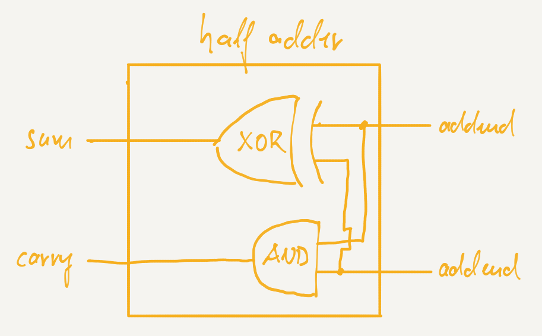

The AND and XOR operators can then be arranged as logic gates to construct a so-called *half adder* in an electronic circuit which performs binary addition of two addend bits as described above.

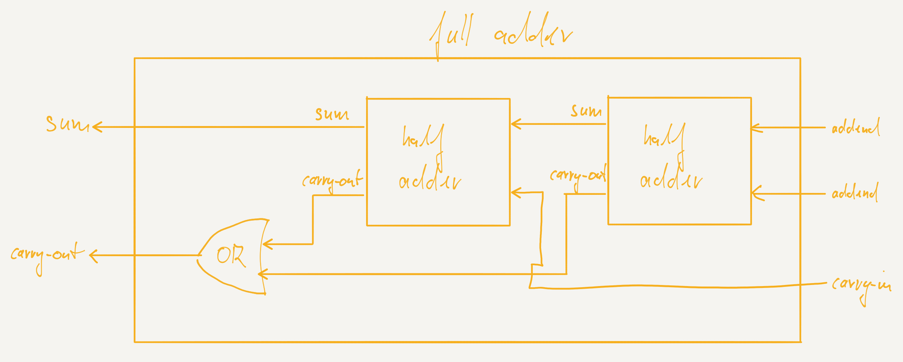

We can then take two half adders and an OR operator as logic gate to construct a *full adder* which performs binary addition of three bits: two addend bits, like a half adder, plus a carry bit, also called *carry-in*. A full adder computes, like a half adder, a sum bit and a carry bit, also called *carry-out*, which is 1 if either or both of the carry bits of the two half adders are 1. A full adder requires, depending on technology, several dozen transistors.


Finally, we can take 7 full adders, one for each bit in the example of the previous section, and connect them in a chain of full adders to form a 7-bit adder where the carry-out of each full adder is fed to the carry-in of the more-significant full adder to the left of it, resembling what we do when adding two binary numbers by hand. In an actual electronic circuit, the exact same thing happens by having the involved bits travel as low and high voltage through the circuit. Now, imagine that a modern computer typically features 32-bit and even 64-bit adders which in turn require around one- to two-thousand transistors, respectively. Only the dramatic miniaturization of transistors made that possible.

Everything a computer does is essentially based on the connection of Boolean logic and digital electronics. If you are interested in the topic look for books on computer architecture of which we mention one at the end of the chapter. It is an incredibly exciting, highly active field that is the foundation of the computer revolution.

> Boolean logic abstracts from hardware and thus allows us to ignore physics

You may ask yourself why we do not go further into the details of digital electronics here. The reason is because we can, thanks to Boolean logic, and thereby save a lot of time and effort. Boolean logic provides an *abstraction* from digital electronics that allows us to ignore physics! This is almost magic.

Computer scientists love abstractions and this is our first example out of many that follow below. The key to understanding many abstractions in computer science is to keep in mind that everything in a computer is encoded in bits which in turn are handled by electronic circuits. Boolean logic allows us to focus at least on the bits. However, even that level of detail is often too cumbersome to deal with directly, which is why we go even further and introduce binary arithmetic and so on. So, always ask yourself how we can manage those bits on a level of abstraction that is closer to what we want to do.

Next, we show you how negative numbers are handled, that is, how binary subtraction works. Binary multiplication and division is also important but we leave that out here. In principle, both work the way you learned in school with decimal numbers but we do not need to remember exactly how to follow the material here.

### Negative Numbers

Why are negative numbers and binary subtraction so important to know about? There is a pedagogical and a technical reason. Seeing how negative numbers are encoded in bits is surprisingly simple as well as educational since it can be done in such a way that binary addition, subtraction, and even multiplication works without any modifications. Only division and thus remainder require attention because they work differently depending on whether the involved bits are supposed to encode positive or negative numbers. Also, subtraction allows us to find out if two numbers are equal or not, simply by subtracting one from the other and comparing the result with zero.

> Counting down to zero is all a computer needs

In fact, what may be surprising about subtraction is that a hypothetical computer that can only subtract numbers, compare the result with zero, and depending on the outcome can choose to perform different subtractions and comparisons subsequently and so on, can do anything any other computer in the world can do. Such a machine is called a *one instruction set computer* (OISC). It may be slower than other machines but it can still mimic everything any other machine can do, in particular addition, multiplication, division, and whatever else computers can do.

But even on a realistic computer, subtraction is fundamentally important. This is something I did not know when I first started coding. After all, there are lots of things we would like a computer do for us which seem to have nothing to do with subtracting numbers. However, the issue is that a computer needs subtraction and thus negative numbers to be universal, that is, to be able to run *any* program, whatever it does. In other words, even if programs do not perform subtraction, the machine needs subtraction anyway to run them. We revisit that issue in the machine chapter.

So, subtraction is special. Suppose we would like to subtract 7 from 85. To do that we first convert the *subtrahend* 7 into its negative *complement* (without using the sign symbol) and then add that complement to the *minuend* 85. In other words, we mimic subtraction by using addition on the minuend (85) and the negative complement of the subtrahend (7). We first show how to do that with decimal numbers and then move on to do the same with binary numbers which explains, at least in principle, how a computer does subtraction.

The negative complement or *radix complement* of a number depends on the *radix* or base of the notation in which the number is written down. The radix complement of a decimal number is thus the *tens complement* of that number. To calculate the tens complement we first need to decide the maximum number of digits we support in any of the involved numbers. For the example here, we need at least 2 digits (because of 85). The tens complement of 7 (with a maximum of 2 digits) is:

```c
100 - 7 = 93
```

So, 93 represents -7 here.

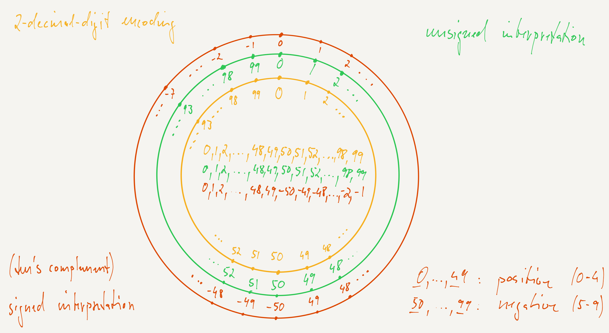

In fact, instead of encoding 0 and the first 99 positive numbers from 1 to 99 in the decimal numbers 0 to 99, we only encode 0 and the first 49 positive numbers from 1 to 49 in 0 to 49, and the first 50 negative numbers from -1 to -50 in 99 to 50. Oddly, this encoding supports 49 positive numbers and 50 negative numbers, that is, exactly one more negative number which is -50, encoded by, well, 50.

If we were to support 3 digits the tens complement of 7 would be:

```c
1000 - 7 = 993
```

and so on. The only issue is that calculating the tens complement is not much easier than subtraction itself. But, calculating the *diminished radix complement* is! The diminished tens complement or *nines complement* of 7 with a maximum of 2 digits is:

```c
99 - 7 = 92
```

If a given number fits the number of supported digits, the diminished radix complement of that number can easily be calculated by subtracting *digit by digit*! Since here we support 2 digits but `7` is only 1 digit, we extend `7` to `07` and then subtract `07` from `99` digit by digit:

```c
9 - 0 = 9
```

and

```c
9 - 7 = 2
```

However, we need the radix complement, not the diminished radix complement. The difference though is only an increment by 1. So, calculating the radix complement is done by first calculating the diminished radix complement and then increment the result by 1.

```c
99 - 07 + 1 = 92 + 1 = 93
```

The full story is now as follows:

```c
85 - 7 = 85 + (100 - 7) - 100 = 85 + (100 - 1 - 7 + 1) - 100 = 85 + (99 - 7 + 1) - 100
```

The two subtractions, 99 - 7, that is, 99 - 07 as well as 85 + (...) - 100 are both easy to do, just subtract digit by digit:

```c
85 + (99 - 07 + 1) - 100 = 85 + (92 + 1) - 100 = 85 + 93 - 100 = 178 - 100 = 78
```

Who would have thought that subtraction can in fact be reduced to digit-by-digit subtraction and addition? Of course, going through the above calculation may still appear to be more complicated to you than just calculating `85 - 7` in one step. However, the difference is that each individual step of the above calculation is easier than subtracting two arbitrary numbers in one step. That becomes more evident with bigger numbers. Just try calculating:

```c
2345 - 432
```

in one step versus using tens complement via nines complement. For the latter we need 4 digits here to calculate the result:

```c
2345 + (10000 - 432) - 10000 = 2345 + (10000 - 1 - 432 + 1) - 10000 = 2345 + (9999 - 432 + 1) - 10000
```

Again, the two subtractions, 9999 - 432, that is, 9999 - 0432 as well as 2345 + (...) - 10000 are both easy to do digit by digit:

```c
2345 + (9999 - 0432 + 1) - 10000 = 2345 + (9567 + 1) - 10000 = 2345 + 9568 - 10000 = 11913 - 10000 = 1913
```

Let us go back to the previous example. Now, we are ready to do the exact same thing with binary numbers and their *twos* and *ones complement*. In binary, `85 - 7` is:

```
 1010101 = 85
-0000111 =  7
```

Let us say we support seven bits which is why we use `0000111` rather than just `111`. Like the above calculation in decimal, we proceed by inserting the twos rather than the tens complement into the calculation as follows:

```
  1010101 = 85
+10000000
- 0000111 =  7
-10000000
```

Since calculating `10000000 - 0000111` is again still difficult, we replace the twos complement with the ones complement and an increment by 1:

```
  1010101 = 85
+10000000
- 0000001 =  1
- 0000111 =  7
+ 0000001 =  1
-10000000
```

Calculating the ones complement `1111111 - 0000111` is easy:

```
  1010101 = 85
+ 1111111
- 0000111 =  7
+ 0000001 =  1
-10000000
```

Just flip the seven bits of the subtrahend `0000111` *bit by bit*:

```
  1010101 = 85
+ 1111000 = ones complement of 7
+ 0000001 =  1
-10000000
```

And then increment the ones complement `1111000` by 1 to obtain the twos complement `1111001`:

```
  1010101 = 85
+ 1111001 = twos complement of 7
-10000000
```

Now add the minuend `1010101` and the twos complement of the subtrahend `1111001`:

```
  1010101 = 85
+ 1111001 = twos complement of 7
——————————————
 11001110 = 85 + two’s complement of 7
```

And finally get rid of the MSB to correct for introducing the twos complement:

```
 11001110 = 85 + two’s complement of 7
-10000000
——————————————
  1001110 = 78
```

Practice this with different numbers as well!

There is also a program for printing negative numbers with selfie, try:

```bash
./selfie -c selfie.h examples/negative.c -m 1
```

The relevant part of the output is:

```
-7 in decimal:     -7 (as signed 64-bit integer)
-7 in decimal:     18446744073709551609 (as unsigned integer)
-7 in hexadecimal: 0xFFFFFFFFFFFFFFF9
-7 in octal:       0o1777777777777777777771
-7 in binary:      0b1111111111111111111111111111111111111111111111111111111111111001
```

The only difference to the above representation is that, instead of 7 bits, selfie uses 64 bits to encode positive and negative numbers. Thus -7 encoded in 64 rather than 7 bits is just like `1111001` but with 57 additional more-significant bits set to 1. Why -7 in decimal is such a huge number as unsigned integer is explained next. Before that, modify `examples/negative.c` and then run it again to see the encoding of different numbers!

Before going just a bit further into the details, there is one more interesting notation, in addition to unary, binary, octal, decimal, and hexadecimal, that we would like to mention first. It is *ternary* notation with base 3. A digit in a ternary number is called a *trit* which can either be denoted by 0, 1, and 2 but also by -1, 0, and +1. There were in fact attempts to build ternary computers a long time ago. The reason is that positive as well as negative numbers can be encoded naturally in ternary notation, and that ternary arithmetic may in theory be faster than binary arithmetic. However, distinguishing three rather than two states in electronic circuits adds complexity to the design making it hard for ternary computers to compete. So, for now we are stuck with binary.

### Integers

You may have noticed that depending on the involved numbers subtraction using radix complement appears to produce incorrect or at least strange results, independently of the base. Take, `85 - 86`, for example, in binary using seven bits:

```
 1010101 = 85
-1010110 = 86
```

As before, calculate the ones complement of the subtrahend 86 first:

```
  1010101 = 85
+ 0101001 = ones complement of 86
+ 0000001 =  1
-10000000
```

and then the twos complement:

```
  1010101 = 85
+ 0101010 = twos complement of 86
-10000000
```

Finally, add the minuend `1010101` and the twos complement of the subtrahend `0101010`:

```
  1010101 = 85
+ 0101010 = twos complement of 86
——————————————
  1111111 = 85 + twos complement of 86
```

and correct for introducing the twos complement:

```
  1111111 = 85 + twos complement of 86
-10000000
——————————————
 -0000001 = -1
```

The result appears to be correct but either requires the sign symbol to represent it or skip the last step and simply assume that `1111111` represents -1. Well, the latter is what is done. After all, the twos complement of `1111111` (with seven bits) is 1. However, we need to be clear about the consequences. Using radix complement to encode negative numbers effectively cuts the number of *absolute* values that a given number of digits can distinguish in half.

Seven bits, for example, can distinguish 128 different values. Thus binary encoding in seven bits but without twos complement supports representing 0 through 127. With twos complement it is the same number of different values but shifted by 64, that is, it supports representing -64 through 63 including 0. Adding more bits, fortunately, still doubles the number of different values that can be represented, no matter if we use twos complement or not.

But why does the above example work if seven bits only fit -64 through 63? Both, 85 and 86 are clearly outside that range. It works but only for the actual subtraction operation. In other words, the encoding of 85 and 86 in seven bits is correct but only if we *interpret* their binary encoding as *unsigned* from 0 to 127. If, on the other hand, we interpret it as *signed* from -64 to 63 using twos complement for negative numbers, their encoding in seven bits is incorrect since:

```
1010101 = 85 in unsigned interpretation
```

but:

```
1010101 = -43 in signed interpretation
```

because:

```
 0101010 = ones complement of 1010101
+0000001 = 1
————————————
 0101011 = twos complement of 1010101
```

where `0101011` is binary for 43.

Similarly, 86 encoded in seven bits is -42 in signed interpretation. However, `-43 - -42` is of course still -1 which explains why the above subtraction actually works.

How do we recognize binary numbers to represent positive or negative numbers? Well, the key lesson to be learned here is that we cannot! They are just bits. But, we can still interpret them, as unsigned or signed, for example, and there is a simple rule here. Assuming we use twos complement to encode negative numbers and have agreed to support a given number of bits, say, seven bits, their MSB indicates right away if they encode a positive or a negative number. If the MSB is 1, the number is negative and otherwise positive. Just check again the above signed interpretation of **1**010101 which is obviously negative. In signed interpretation, the MSB is also called *sign bit*.

To make the above example of `85 - 86` work in signed interpretation even for the individual binary encoding of 85 and 86, we simply use one more bit extending the supported range from -64 through 63 to -128 through 127. Notice that the actual computation does not change a bit, literally, except that the signed interpretation of the involved numbers is now as intended:

```
 01010101 = 85
-01010110 = 86
```

becomes:

```
  01010101 = 85
+ 10101001 = ones complement of 86
+        1
-100000000
```

and then:

```
  01010101 = 85
+ 10101010 = twos complement of 86
-100000000
```

Then add:

```
  01010101 = 85
+ 10101010 = twos complement of 86
———————————————
  11111111 = 85 + twos complement of 86
```

and finally correct the result:

```
  11111111 = 85 + twos complement of 86
-100000000
———————————————
 -00000001 = -1
```

Let us take a step back here and reflect on what we have seen. Numbers for most of us are a concept we first heard about in primary school in the context of elementary arithmetic. Back then we learned how to add, subtract, multiply, divide, and compare numbers, not just to know how to do that but also to develop an intuition on what numbers are and what properties they have. However, one thing that probably never occurred to us was that the amount of numbers available to us could be limited and that there would be a cost involved in working with them. In short, we believed there are infinitely many and arithmetic is free for all. In computer science, this is different!

> Everything on a computer is finite

Everything on a computer is finite simply because there are only finitely many bits the machine can store. There may be an awful lot of bits but still. Also, flipping bits costs time and energy. It is not free. All this means that everything a computer does costs time and energy and is still always finite including numbers encoded in bits. Things may get very, very large but still.

> Time, space, and energy!

In short, software engineers and computer scientists worry about time, space, and energy. How long does it take to add two numbers? How many bits do I need to encode the involved numbers? How much power does it take, that is, when does my battery run out of power or when do I need a stronger power plant? When we are talking about billions and billions of additions and billions and billions of bits this all becomes highly relevant fast.

What is important for us here is to understand that kind of mindset. Computer science is not mathematics. Let us take the example of numbers, in fact, *whole numbers*. We have seen how to encode positive and even negative numbers in bits. But no matter how many bits we use, those encodings can in the end only represent finitely many numbers. Also, addition on anything but unary takes as many steps as the number of digits we decided to use. Yet anything but unary saves exponentially many digits that we need to encode a given number. This is called the *time-space trade-off* in computer science which occurs in a lot of other circumstances as well. It refers to the phenomenon that minimizing the number of bits to encode something often leads to more steps a computer needs to take to do something useful with the encoding, and vice versa.

When it comes to numbers, most computer scientists have agreed to distinguish the terms *whole numbers* and *integers*. Whole numbers refer to the concept of whole numbers in a mathematical sense. Integers, on the other hand, refer to the finite representation of whole numbers on a computer. For us here, whole numbers is math, integers is computer science.

Furthermore, most computer scientists have agreed to use *unsigned integers* to represent whole numbers from 0 to 2^n-1^ using binary encoding where n is the number of bits in the encoding. The *upper bound* 2^n-1^ is so important, it even has an acronym as name. It is called UINT_MAX which stands for unsigned integer maximum. For seven bits, for example, UINT_MAX is 127. What is it for eight bits? Well, it is 255. If you want to be clear about the number of bits, say, eight bits, you may say UINT8_MAX rather than just UINT_MAX. Modern machines work with even larger versions, for example, UINT16_MAX which is 65,535, UINT32_MAX which is 4,294,967,295, and even UINT64_MAX which is a whopping 18,446,744,073,709,551,615.

There is also agreement to use *signed integers* to represent whole numbers from -2^n-1^ to 2^n-1^-1 in binary encoding with twos complement for negative numbers. Here, the upper bound 2^n-1^-1 is called INT_MAX which stands for (signed) integer maximum. The *lower bound* -2^n-1^ is called INT_MIN which obviously stands for (signed) integer minimum. So, again for seven bits, INT_MAX is 63 and INT_MIN is -64. Just to get a feel for it, INT64_MAX, for example, is 9,223,372,036,854,775,807 and INT64_MIN is -9,223,372,036,854,775,808. Try to calculate INT16_MAX, INT16_MIN, INT32_MAX, and INT32_MIN yourself!

You may also use selfie to see what it has to say about those bounds, try:

```bash
./selfie -c selfie.h examples/bounds.c -m 1
```

The relevant part of the output is:

```
UINT64_MAX in decimal:     18446744073709551615
UINT64_MAX in decimal:     -1 (as signed 64-bit integer)
UINT64_MAX in hexadecimal: 0xFFFFFFFFFFFFFFFF
UINT64_MAX in octal:       0o1777777777777777777777
UINT64_MAX in binary:      0b1111111111111111111111111111111111111111111111111111111111111111
0 in decimal:              0
0 in hexadecimal:          0x0
0 in octal:                0o0
0 in binary:               0b0000000000000000000000000000000000000000000000000000000000000000
INT64_MAX in decimal:      9223372036854775807
INT64_MAX in hexadecimal:  0x7FFFFFFFFFFFFFFF
INT64_MAX in octal:        0o777777777777777777777
INT64_MAX in binary:       0b0111111111111111111111111111111111111111111111111111111111111111
INT64_MIN in decimal:      -9223372036854775808
INT64_MIN in decimal:      9223372036854775808 (as unsigned integer)
INT64_MIN in hexadecimal:  0x8000000000000000
INT64_MIN in octal:        0o1000000000000000000000
INT64_MIN in binary:       0b1000000000000000000000000000000000000000000000000000000000000000
```

There is one more thing before we move on. Notice that the same binary numbers may sometimes be seen as greater than others and sometimes less! Take our favorite binary numbers 1010101 and 111, for example. 1010101 is clearly greater than 111, right? Well, it depends on our interpretation of 1010101 and 111. If 1010101 and 111 are interpreted as unsigned integers, the answer is yes. But if they are interpreted as signed 7-bit integers, the answer is no! In that case, 1010101 stands for -43 while 111 still stands for 7. This means there is unsigned and signed comparison of binary numbers. Addition, subtraction, and even multiplication, however, work the same way independently of unsigned and signed interpretation. Only division and thus remainder are, similar to comparison, dependent on interpretation but the details are not important here.

The thing that matters most is that, when it comes to numbers, unsigned and signed integers are all we need to know about to understand the rest of the book! There are plenty of applications of unsigned and signed integers in encoding, storing, processing, and decoding information such as images, video, and audio, just to the name the most popular, which we discuss below.

### Overflows

Unsigned and signed integers are all we need here but there is something about them that we need to be very careful with. They *overflow*! It may be possible, for example, that a large number in an addition suddenly becomes 0 if we stick to a given number of bits to encode them, say, seven bits:

```
 1111111 = 127 in unsigned interpretation
+0000001 =   1
——————————————
 0000000 =   0
```

So, with unsigned integers encoded in seven bits, 127 + 1 is not 128 but 0! This is because 128 in binary is 10000000 which requires eight bits. Since we decided to use just seven bits, the carry bit into the eighth bit is dropped, always, no matter if the carry bit is 0 or 1. If it is 0, the result is as expected. But if it is 1, the result *wrapped-around* UINT_MAX to fit into the supported range of seven bits. This is true even in the most extreme case:

```
 1111111 = 127 in unsigned interpretation
+1111111 = 127 in unsigned interpretation
——————————————
 1111110 = 126 in unsigned interpretation
```

which makes sense if we consider that with seven bits:

```
127+127 = 127+(1+126) = (127+1)+126 = 0+126 = 126
```

To even more surprise, the same situation looks perfectly fine with signed integers:

```
 1111111 = -1 in signed interpretation
+0000001 =  1
—————————————
 0000000 =  0
```

and:

```
 1111111 = -1 in signed interpretation
+1111111 = -1 in signed interpretation
—————————————
 1111110 = -2 in signed interpretation
```

However, there are overflows with signed integers as well, which wrap-around INT_MAX, for example, even without a carry bit of 1 into the eighth bit:

```
 0111111 =  63
+0000001 =   1
——————————————
 1000000 = -64 in signed interpretation
```

and:

```
 0111111 =  63
+0111111 =  63
——————————————
 1111110 =  -2 in signed interpretation
```

This kind of makes sense because with seven bits:

```c
63+63=63+(1+62)=(63+1)+62=-64+62=-2
```

But there are also overflows which wrap-around INT_MIN with a carry bit of 1 into the eighth bit:

```
 1000000 = -64 in signed interpretation
+1111111 =  -1 in signed interpretation
——————————————
 0111111 =  63
```

and:

```
 1000000 = -64 in signed interpretation
+1000000 = -64 in signed interpretation
——————————————
 0000000 =   0
```

Both again make kind of sense given that with seven bits we have that `-64 = 63 + 1`.

Selfie also has to say something about overflows, of course, just for 64-bit integers:

```bash
./selfie -c selfie.h examples/overflows.c -m 1
```

The relevant part of the output is:

```
UINT64_MAX+1 in decimal:     0
UINT64_MAX+1 in hexadecimal: 0x0
UINT64_MAX+1 in octal:       0o0
UINT64_MAX+1 in binary:      0b0000000000000000000000000000000000000000000000000000000000000000
0-1 in decimal:              -1 (as signed 64-bit integer)
0-1 in decimal:              18446744073709551615 (as unsigned integer)
0-1 in hexadecimal:          0xFFFFFFFFFFFFFFFF
0-1 in octal:                0o1777777777777777777777
0-1 in binary:               0b1111111111111111111111111111111111111111111111111111111111111111
INT64_MAX+1 in decimal:      -9223372036854775808 (as signed 64-bit integer)
INT64_MAX+1 in decimal:      9223372036854775808 (as unsigned integer)
INT64_MAX+1 in hexadecimal:  0x8000000000000000
INT64_MAX+1 in octal:        0o1000000000000000000000
INT64_MAX+1 in binary:       0b1000000000000000000000000000000000000000000000000000000000000000
INT64_MIN-1 in decimal:      9223372036854775807 (as signed 64-bit integer)
INT64_MIN-1 in decimal:      9223372036854775807 (as unsigned integer)
INT64_MIN-1 in hexadecimal:  0x7FFFFFFFFFFFFFFF
INT64_MIN-1 in octal:        0o777777777777777777777
INT64_MIN-1 in binary:       0b0111111111111111111111111111111111111111111111111111111111111111
```

Unintended integer overflows are a major source of errors in software. Think of the Millennium Bug which is probably the most talked about integer overflow bug in the history of computing! And even worse, that bug will in fact repeat itself in 2038! There are real world examples where integer overflows have caused enormous amounts of damage, financially but also in potential threats to life, if not loss of life.

> Integers are not whole numbers!

Essentially, unintended integer overflows are encoding errors where the programmer either did not reserve enough bits to represent the involved quantities or, dually, the involved quantities exceeded the state space. Unsigned and signed integers on a computer are not whole numbers! They are just an attempt to encode some of them, sometimes many of them, but never all. For us the important lesson to learn here is that everything on a computer is always bounded and thus just an approximation of the real world. The approximation may be arbitrarily close since we can always throw in more bits but it nevertheless remains an approximation, no matter what.

### Characters

Let us change subject to something as important as the encoding of numbers. How is text like the one you are reading right now encoded in bits? To understand that we need to break the problem into two smaller problems? Firstly, we need to figure out how individual characters are encoded in bits. After that, we look into how text, that is, sequences of characters are put together as bits, which requires some background in how computers organize and store bits. But first characters!

We mentioned before that the seven bits 1010101 may not only encode the decimal numbers 85 and -43 but also the uppercase letter U. How so? The answer is incredibly simple. People in the 1960s sat down and simply agreed to using 1010101 as the encoding of U. They also agreed how to map all other seven-bit sequences to the rest of the English alphabet, decimal digits, and quite a few other characters as well. That agreement is known as the *American Standard Code for Information Interchange*, also called *ASCII*. The standard maps each of the 128 seven-bit sequences to a unique character in a table known as the ASCII table.

Why is ASCII so important? ASCII facilitates bit-encoded communication among people around the world. All information sent across the Internet is encoded in bits, just like all information stored on any digital device. Out of all that information, more than 90% of all web pages, for example, that are being served today are encoded in ASCII. If a person presses a key on the keyboard of a phone, a tablet, or a computer the character of that key is encoded into its corresponding seven-bit ASCII code and then stored as such. Eventually, that character may be delivered as ASCII code to another person somewhere across the world and then eventually decoded into its symbolic representation for that person to see on a screen. As long as both, sender and receiver, use the same encoding, such as ASCII, bit-encoded communication is possible.

There is an important observation to make here. Whatever characters you see on the keyboard and the screen of your phone, for example, they are all just drawn for your convenience in human-readable form. For the machine, they are, in most cases, just ASCII codes. This means there is software on your phone and in fact any digital device that, given an ASCII code, makes the machine draw the corresponding human-readable form on the screen. The machine would still function perfectly without a keyboard and a screen, of course. It is only us who need keyboards to type and screens to see ASCII.

| 7-bit ASCII Code | ASCII Character | Printable |
| ---------------- | --------------- | --------- |
| `0000000`        | NULL            | no        |
| \|               | \|              | \|        |
| `0001010`        | linefeed (LF)   | no        |
| \|               | \|              | \|        |
| `0011111`        | US              | no        |
| `0100000`        | SPACE           | yes       |
| \|               | \|              | \|        |
| `0110000`        | 0               | yes       |
| `0110001`        | 1               | yes       |
| ...              | ...             | ...       |
| `0111001`        | 9               | yes       |
| \|               | \|              | \|        |
| `0111111`        | ?               | yes       |
| `1000000`        | @               | yes       |
| `1000001`        | A               | yes       |
| `1000010`        | B               | yes       |
| ...              | ...             | ...       |
| `1010101`        | U               | yes       |
| ...              | ...             | ...       |
| `1011010`        | Z               | yes       |
| \|               | \|              | \|        |
| `1011111`        | _               | yes       |
| `1100000`        | \`              | yes       |
| `1100001`        | a               | yes       |
| `1100010`        | b               | yes       |
| ...              | ...             | ...       |
| `1110101`        | u               | yes       |
| ...              | ...             | ...       |
| `1111010`        | z               | yes       |
| \|               | \|              | \|        |
| `1111111`        | DEL             | no        |

This brings us to an idea about ASCII that is worth mentioning here. ASCII distinguishes *printable characters* from *control characters*. The seven-bit binary numbers `0000000` to `0011111` encode most of these control characters. Decimal digits and some other characters are encoded from `0100000` to `0111111`, uppercase letters including U and some more characters are encoded from `1000000` to `1011111`, and lowercase letters and again some more characters are encoded from `1100000` to `1111111`, see the above table. Look up ASCII tables on the web to see the full details!

Notice that there went quite a bit of thought into the design of ASCII. For example, the decimal digits 0 to 9 are encoded from `0110000` to `0111001` which correspond to the numerical values `0000` to `1001` of the digits 0 to 9 if you ignore the three MSBs `011`. Uppercase and lowercase letters are encoded from `1000001` to `1011010` and from `1100001` to `1111010`, respectively. Changing a letter from upper to lower case or vice versa therefore just requires flipping the second MSB!

But back to ASCII control characters. Let us pick a control character that you are familiar with but probably not aware of in this form. It is called *linefeed* or *LF* which is encoded by `0001010`. When printing characters on the screen, your phone usually does that from left to right. However, whenever it detects `0001010`, instead of printing anything, it simply moves on to the next ASCII code and continues printing characters, again from left to right but from now on beginning at the left edge of the screen right below the characters it printed before it detected `0001010`. In other words, it performs a linefeed. So, whatever you see on the screen, printable characters but also simple formatting such as linefeeds, is internally still just a sequence of ASCII codes, that is, just bits.

There is one more, particularly interesting control character called the *NULL character* which is, unsurprisingly, encoded by `0000000`. NULL does something very important. It marks the end of a sequence of characters. In the section below on how text is encoded we see NULL again.

In addition to the encoding of most web pages on the Internet, there is another major application of ASCII that we would like to mention which is *email*. All your email is encoded in ASCII. This was fine before people wanted to email pictures and PDFs as attachments to their email. The solution that people came up with is to encode all content of your email including all attachments, yes, in ASCII! Some email clients allow you to see that by viewing email in *raw* format. You can then see that even your pictures and PDFs are encoded in, unsurprisingly, rather long sequences of ASCII characters. The standard that defines how to encode attachments in ASCII is called *Multipurpose Internet Mail Extensions* abbreviated *MIME*. This is an example of a two-layered encoding of information. MIME encodes attachments in a sequence of ASCII characters which in turn are encoded in a sequence of ASCII codes since everything in the end needs to be just bits.

ASCII is great but what about Greek letters, Chinese letters, and so on, but also accents and, of course, all those Emojis? ASCII only supports a total of 128 different characters because that is what fits into seven bits. You have probably encountered that limitation if you use languages other than English. Well, there is a newer standard for encoding characters called *8-bit Unicode Transformation Format* abbreviated *UTF-8*. One important difference to ASCII is that UTF-8 uses eight rather than seven bits to encode characters. In fact, UTF-8 uses multiples of eight-bit binary numbers for encoding a lot more than just 128 characters. However, UTF-8 is *backwards-compatible* to ASCII by setting the eighth most-significant bit, which is unused in ASCII, to 0 to distinguish ASCII from encodings that use more than the seven bits of ASCII. These days most text including most ASCII is encoded in UTF-8, even the source code in `selfie.c`. If you are interested how this works in detail follow up about ASCII and UTF-8 on the web!

To see ASCII and UTF-8 at work, you can also try:

```bash
hexdump -C selfie.c | more
```

If `hexdump` is not available on your machine, you can use a so-called *hex editor* instead. Both, the Atom and Sublime Text editors feature plugins for that. The output on your screen should not only show the ASCII characters in `selfie.c` but also, in hexadecimal, the actual bits encoding these characters:

```
00000000  2f 2a 0a 43 6f 70 79 72  69 67 68 74 20 28 63 29  |/*.Copyright (c)|
00000010  20 74 68 65 20 53 65 6c  66 69 65 20 50 72 6f 6a  | the Selfie Proj|
00000020  65 63 74 20 61 75 74 68  6f 72 73 2e 20 41 6c 6c  |ect authors. All|
00000030  20 72 69 67 68 74 73 20  72 65 73 65 72 76 65 64  | rights reserved|
00000040  2e 0a 50 6c 65 61 73 65  20 73 65 65 20 74 68 65  |..Please see the|
00000050  20 41 55 54 48 4f 52 53  20 66 69 6c 65 20 66 6f  | AUTHORS file fo|
00000060  72 20 64 65 74 61 69 6c  73 2e 20 55 73 65 20 6f  |r details. Use o|
00000070  66 20 74 68 69 73 20 73  6f 75 72 63 65 20 63 6f  |f this source co|
...
```

Notice, for example, the very first ASCII character '/' in `selfie.c`. That character is UTF-8-encoded by `00101111` in binary, which is here denoted by `2f` in hexadecimal. In other words, `selfie.c` is really just a long sequence of bits (around 2.7 million) where every eighth bit is set to 0 (because of ASCII) and the number of bits in that sequence is a multiple of eight (because of UTF-8). The fact that UTF-8 works with multiples of eight bits is not by accident and related to something that has become the de-facto standard for packaging bits in the world of computing. And that is our next topic.

### Bytes

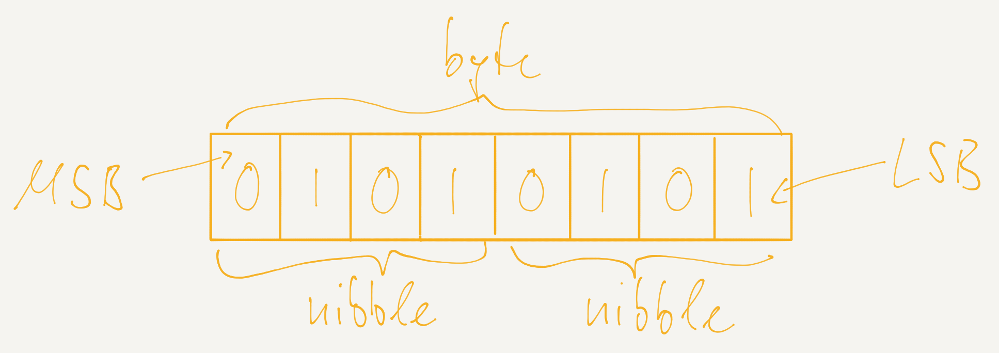

A *byte* is a unit of information, abbreviated by the upper-case letter *B*, that consists of eight bits and can therefore distinguish exactly 256 different things. Why eight bits? This was far from obvious in the early days of computing. Fundamentally, what we need is to package bits into something larger because processing bits individually is just too cumbersome and too slow in particular. So, one idea is to use seven bits since they fit ASCII characters. However, seven is not a power of two but eight is! Eight bits are two times four bits which allows us to use exactly two digits in hexadecimal notation such as 0x55, for example, to denote a byte. In this case, each of the two digits is called a *nibble*.

So, eight bits is what people eventually ended up agreeing on as the definition of a byte. However, these days machines typically process bits and perform integer arithmetic with them at the granularity of multiple bytes, usually four and even eight bytes, that is, 32 and 64 bits, respectively. To do that, computer architects need to run 32 and even 64 wires from one part of a circuit to another! Hard to believe but true. This is a good example of how *parallelism* speeds up computation. Communicating and processing 64 bits at once in parallel is obviously 64 times faster than just 1 bit. However, each individual bit still needs a certain amount of time to travel as low and high voltage from one part of a circuit to another since nothing is faster than the speed of light. You may say we are bean counting but, no, that fact is also relevant and even a limiting factor in today's machines.

The machine model we use in this book and in selfie is based on a 64-bit machine. This means that our machine can handle 64-bit integer arithmetic, that is, unsigned integer values from 0 to UINT64_MAX, or equivalently signed integer values from INT64_MIN to INT64_MAX. Not bad at all. We see below how that works and puts us into the same space as state-of-the-art machines.

One more thing before moving on. ASCII characters are seven bits, not eight. However, the ASCII subset of UTF-8 uses eight bits per character, so exactly one byte per character with the MSB of each byte set to 0. That is what we do here and in selfie in particular as well. We use ASCII characters but as the ASCII subset of UTF-8! This is beautiful because everything, integers and characters, fit into the notion of a byte or multiples of a byte. In order to understand how text, that is, sequences of characters, and other types of data larger than integers and characters are encoded we need to have a look at how digital memory works.

### Memory

Digital memory is fascinating because it is an extremely simple concept while being extremely powerful at the same time. Moreover, all digital memory works, at least on the level relevant to us, the exact same way whether it is main memory, an SSD, a USB stick, or even a harddrive. Think of it as a long road with warehouses lined up along the road. Each warehouse provides the same amount of *storage*, not for actual goods, of course, but for information, say, for one byte! Also, each warehouse has a unique *address*, which is in fact an unsigned integer, so that we can easily find each warehouse. The first warehouse on that road has house number 0. The next warehouse has house number 1. The warehouse after that has house number 2 and so on. Since we never skip any numbers, the house number of the last warehouse tells us how much storage capacity our memory has. It is the house number of the last warehouse plus one many bytes since we start counting at 0. Digital memory where each warehouse stores exactly one byte is called *byte-addressed* which is the model we use throughout the book.

Why do we and, in fact, everyone else use byte-addressed memory? Well, it took quite some time to come to that agreement in the computer science community. An important reason is that ASCII characters stored in byte-addressed memory have unique addresses since every ASCII character fits into exactly one byte (with the MSB set to 0). Another reason is that at some point in the past many machines would access memory at the level of individual bytes. These days are mostly over but we are still using byte-addressed memory. What actually happens today when memory is accessed depends on the technology. Usually, if a machine needs to access one byte stored in memory, a whole bunch in the immediate neighborhood of that byte is transferred as well. This can be just a few but also dozens, hundreds, and even thousands of bytes, which is fine because in most scenarios, if the machine needs access to one byte, it is likely to need access to the bytes around that byte as well. Think of 64-bit integers, for example, which require eight bytes each, but there are also even larger structures such as text, for example. The speed at which memory access happens also varies, often by orders of magnitude, depending on the technology. However, the granularity and the speed of memory access is not important for us right now, so we simply assume in this chapter that bytes are accessed individually and ignore speed altogether.


Digital memory always provides two things: *storage* and an *address space*! And it is important to distinguish the two because there can be address spaces without storage but no storage without an address space. How else would you find anything? Also, the size of storage and address spaces are measured quite differently. The amount of storage is obviously measured in number of bytes. Sounds simple but there is quite a bit of potential confusion here. First of all, when we speak of storage we mean something that can store information. Whether that storage is *volatile* or *non-volatile* is of no concern to us. *Volatile memory* such as main memory looses all information when power is cut whereas *non-volatile memory* such a USB stick does not. However, the terms memory and volatile memory as well as the terms storage and non-volatile memory are often used synonymously but not here. So, please keep that in mind.

> Digital memory comes with storage and an address space

The other source of potential confusion is that memory sizes may be reported using base 2 and base 10 prefixes. For example, 1 kilobyte may be 1000 bytes or 1024 bytes. With kilobytes the difference is not a big deal but it becomes one when we move to larger prefixes such as mega, giga, tera, and so on. That is why the computer science community not too long ago *officially* decided to use base 10 exclusively with kilobyte, megabyte, gigabyte, terabyte and so on, and introduced the new prefixes kibi, mebi, gibi, tebi and so on to use base 2. But most likely you have never heard of kibibytes before and that is the problem. People often still use kilobytes et cetera ambiguously with base 2 and base 10. However, there is a simple rule of thumb that says that volatile memory is usually measured in base 2 and non-volatile memory in base 10. Since our focus here is not so much on volatility of memory, we stick to the old-fashioned way and just use base 2 with prefixes of bytes, and say so, if not.

Below is a summary of the relevant prefixes. We include kilobits et cetera for later but point out that those are usually not used to measure memory sizes but the speed at which bit-encoded information is processed. We hear more about that below. Base 10 is standard for prefixes of bits. Thus there also exist kibibits et cetera which we nevertheless omit:

| Unit | Prefix |
| ---- | ------ |
| byte (B) | 1 [kilobyte](https://en.wikipedia.org/wiki/Kilobyte "Kilobyte") (kB) = 1000B = 10^3^B, 1 megabyte (MB) = 10^6^B, 1 gigabyte (GB) = 10^9^B, 1 terabyte (TB) = 10^12^B, ... |
| byte (B) | 1 [kibibyte](https://en.wikipedia.org/wiki/Kibibyte "Kibibyte") (KB,KiB) = 1024B = 2^10^B, 1 mebibyte (MB,MiB) = 2^20^B, 1 gibibyte (GB,GiB) = 2^30^B, 1 tebibyte (TB,TiB) = 2^40^B, ... |
| bit (b)  | 1 [kilobit](https://en.wikipedia.org/wiki/Kilobit "Kilobit") (kb) = 1000b = 10^3^b, 1 megabit (mb) = 10^6^b, 1 gigabit (gb) = 10^9^b, 1 terabit (tb) = 10^12^b, ... |

So, by now we know how storage is measured but how about address spaces? Why not simply do the same? After all, there are as many addresses as there are bytes in byte-addressed memory. The reason why they are measured differently is because address spaces do not cost anything. They are free whereas storage is not. However, addresses are not free since addresses need to be encoded and stored! The size of an address space is thus measured in the number of bits necessary to encode the highest address in binary.


Suppose we use eight bits, that is, one byte to encode an address in binary. In that case we speak of an 8-bit address space. Since one byte can encode the unsigned integers 0 to 255, an 8-bit address space can address 256 bytes of storage in byte-addressed memory. This is not much but there is still something absolutely awesome about that. Each byte can encode the 8-bit address of any other byte in 256 bytes of memory including its own address. For example, we could store, say, 85 as `01010101` at address 0 and, say, 7 as `00000111` at address 85, and, say, 0 as `00000000` at address 7, encoding a cycle from address 0 via address 85 to address 7 and then back to address 0. In this case, `01010101`, `00000111`, and `00000000` are interpreted as *pointers* which can be used to encode any kind of arbitrarily complex graph structure.

> Pointers allow us to encode any structure we like

So, in addition to encoding unsigned and signed integers as well as characters in bits, we can encode pointers as memory addresses in unsigned integers. Who would have thought that unsigned integers can not only be used to represent quantities but also structural elements such as pointers, thanks to digital memory? However, properly using pointers and digital memory in general is a major topic in computer science and an important, non-trivial part of any type of coding effort. You might think that 8-bit address spaces are not a big deal, which is true, but today's reality are typically 32-bit and even 64-bit address spaces that feature billions of addresses, even on your smartphone!

Selfie simulates a 32-bit main memory address space and up to 4GB of main memory storage. Try self-compilation as before in the selfie chapter:

```bash
./selfie -c selfie.c -m 3 -c selfie.c
```

Here, the relevant part of the output should be similar to this:

```
...
./selfie: selfie executing 64-bit RISC-U binary selfie.c with 3MB physical memory on 64-bit mipster
...
./selfie: selfie.c exiting with exit code 0
...
./selfie: summary: 389332147 executed instructions [21.84% nops]
./selfie:          2.64KB peak stack size
./selfie:          3.23MB allocated in 23888 mallocs
./selfie:          2.15MB(66.54% of 3.23MB) actually accessed
./selfie:          2.35MB(78.38% of 3MB) mapped memory
...
```

We configured selfie (using the `-m` option) with 3MB of main memory storage (physical memory) and then self-compiled selfie. In total, selfie *allocated* addresses for 3.23MB of main memory but ended up *accessing* only 2.15MB, that is, using only 66.54% of the 3.23MB in storage. Moreover, selfie needed an additional 0.20MB of storage for its code, that is, in sum 2.35MB of (mapped) memory which is 78.38% of the 3MB available storage (physical memory). In order to run, selfie also allocates memory for a stack that grows and shrinks during execution. Nevertheless, the stack usually requires relatively little memory in the range of a few kilobytes, not megabytes, in this case no more than 2.64KB at its peak. That memory is part of the 2.35MB of (mapped) memory.

Let us take a closer look at how digital memory can in principle be used to store any type of information. The key question is where to do that in memory, in particular with information that does not fit into a single byte. There are essentially two different ways of answering that question which can also be combined. Suppose we need to store, say, eight bytes. We can either store each of the eight bytes somewhere in memory, not necessarily next to each other, that is, *non-contiguously*, or we store the eight bytes somewhere in memory but all next to each other, that is, in a *contiguous* block of memory.

> Contiguous or non-contiguous memory?

Both ways have advantages and disadvantages. Non-contiguous storing of information is great because it gives us freedom in where to store information. However, we still need to remember where each of the eight bytes is stored which may require pointers which in turn may need to be stored as well. Contiguous storing of information is also great because we only need to remember where the first of the eight bytes is stored. However, finding enough space that fits eight bytes in a row may be hard. Think of memory where every other byte is already taken. In that case, half of memory is still available but we still cannot store eight bytes in a row. This phenomenon is called *fragmentation*. You may have heard of the problem in the context of harddrives that need to be defragmented, for example. However, any type of digital memory has that problem if information is stored contiguously. We get back to the issue in more detail in the machine and programming chapters.


There is nevertheless one advantage of contiguous storing of information that makes it worth the effort. Given the address of the first of the eight bytes in memory, say, 85 we can calculate the address of, say, the eighth byte by adding 7 to 85. In other words, we use addition of two unsigned integers or in fact a pointer (85) and an unsigned integer (7) to calculate the address of the eighth byte (92). Why is this so cool? Because it is fast! Actually it is very fast, especially compared to finding individual bytes in memory through pointers. But it is also cool because it is an application of integer addition that comes at a surprise. Addition in digital devices is probably more used for calculating memory addresses than for calculating the sum of whatever quantities. Addition therefore facilitates computation in general rather than just numerical calculations.

Contiguous storing of information has yet another advantage which we mentioned before and is the reason why integers that require more than one byte are stored contiguously. It is the fact that most machines today transfer not just one byte when accessing memory but usually a whole bunch that are stored next to each other. 32-bit and in particular 64-bit integers benefit from that. There is only one detail that we need to worry about, namely, in which order we store the bytes of, say, a 64-bit integer. Do we store its eight bytes in memory beginning with the byte that contains the LSB first or with the byte that contains the MSB first? LSB first is called *little-endian* and MSB first *big-endian*. Either way is fine as long as we decide which way. We go with little-endian.

In any case, information that may require much more than just a few bytes to encode and where the number of bytes may also vary, like text, for example, is something that needs a bit more attention next.

### Text

Text including some simple formatting such as linefeeds can be represented by a sequence of ASCII characters which, as we know by now, are encoded in bytes. And text may be text in the traditional sense such as what you read here but also source code such as `selfie.c`. But how is text stored in digital memory? There are essentially three ways of doing that contiguously in memory and all three are different depending on how they encode where the end of the text is. Finding a contiguous memory block that fits the text is a problem that all three have. To encode where the end of the text is, we can count the number of characters and store that in an unsigned integer at, say, the beginning of the text in memory. Alternatively, we can also store a pointer to the last character, that is, we store the memory address of the last character in an unsigned integer. Lastly, we can do something different, namely, mark the end of the text using a special character. As mentioned before, this is done using the ASCII character NULL, which is just `00000000` in binary, and a good choice since that character is never used for actual text. We say that such text is *NULL-terminated*.

Whichever of the three ways of storing text contiguously in memory we use, all three share the problem of finding enough contiguous space in memory. This is not a big deal for short text but for longer text it is, especially if some time later we decide to insert a new character in the middle of the text somewhere. In that case, all characters to the right of the new character need to be shifted in memory by one character to make room for the new character, if there is still room. If not, all text needs to be copied somewhere else where there is enough contiguous space for one more character! By the way, if we used paper to write down that text we had the exact same problem. How can the work involved in shifting and copying lots of characters at least be somewhat reduced?


Easy. We cut the text into smaller, more convenient chunks, say, into paragraphs which we then store individually, still contiguously, but as a whole separately, that is, non-contiguously in any order somewhere in memory. In order to maintain the original order of the paragraphs, we need to remember where they are in memory. This is done by pointers, one for each paragraph pointing to where it begins in memory. We then collect all pointers and store them contiguously in the original order of the paragraphs they point to. Done. Inserting a new character now affects only the involved paragraph but not the whole text. This is our first example of how to combine contiguous and non-contiguous storing of information for trading off the advantages and disadvantages of both techniques.


Before taking the next step towards how files are stored and organized, which is surprisingly easy with what we know now, we would like to clarify some important terminology. Computer scientists often call a sequence of characters a *string*, not text, especially if the string is relatively short. In writing and in particular in source code, strings are usually enclosed in double quotes such as "science", for example. In that case, "science" is called a *string literal*, that is, it is literally a string.

Strings can be used to encode all kinds of information, not just text. But what is more important here is that strings are stored contiguously in memory and NULL-terminated, that is, with a NULL character at the end. In other words, whenever we are dealing with a string, we only need to know the address of where it begins in memory. That's all. The same is true for 32-bit and 64-bit integers, by the way. Arbitrary text, on the other hand, may be stored contiguously, non-contiguously, or using a combination of both techniques, as described above, which is in principle similar to how files are stored, as explained next.

### Files

What is a *file*? From the perspective of a computer it is, unsurprisingly, a sequence of bits or in fact a sequence of bytes, any bytes and any number of bytes, even zero bytes, plus one more thing. Can you guess what that is? It is the *name* of a file, which is a string of characters, in our case, ASCII characters, making it just another sequence of bytes, but, unlike the file itself, stored contiguously and NULL-terminated. That's it! Sure, there are other things like the day and time a file was created and modified but that kind of information is not so important here. Whenever we talk about a file we mean a possibly empty sequence of bytes. And then there is the *filename* which is a string of ASCII characters. There may be restrictions on the maximum length of the file and its name but we ignore those here.

The distinction of file and filename is important and there is a simple analogy between files and memory. A file is like storage and a filename is like an address. In fact, the choice of possible filenames creates what we call a *namespace*, similar to an address space. The difference between names and addresses is that names are strings and therefore human-readable whereas addresses are pointers which may be 32-bit or even 64-bit unsigned integers that are inconvenient or even impossible to remember. In other words, a filename is an abstraction of a memory address.

An important difference between names and addresses is that names are *portable*, at least to some extent, whereas addresses are not. A filename allows us to refer to a file without knowing the address of where exactly the file is stored in memory. This means that we can take the file and move it somewhere else where it has a different address but still the same name. If the filename is unique among all files lying around in one place the name is actually as good as an address. If there is another file with the same name we need to rename one of the two files to be able to keep them in the same place.

The other thing about filenames is that they often suggest what the *format* of a file is, that is, what the file actually encodes. This is usually done through an *extension* of the filename which is typically a dot followed by a sequence of one to four characters at the end of the name. The `.c` extension of `selfie.c` is an example. The are also the infamous `.doc`, `.xsl`, `.ppt`, and `.exe` extensions which are probably among the most well-known examples. The problem with an extension is that it may not match the actual format of a file. It only suggests a possible format, that is, a possible interpretation of the sequence of bytes stored in a file but not more than that. After all, both file and filename are just sequences of bytes. For example, either someone changed the extension, even though most operating systems warn you about that, or the file itself got corrupted by someone using buggy software. Ever received a `.doc` file that your machine could not handle?

Here is a word of advice. The simpler and more widely used a format is the less likely it is that a file in that format cannot be *opened*, that is, decoded, processed, and encoded again. This is because the software that opens a file in such a format is simpler and more robust as well and therefore less likely to be buggy. So, the more critical the information is that you would like to keep in a file the simpler and more widely used the format of that file should be. I am writing this book in a text file that can be opened by almost anything! Sure, if you are dealing with sensitive information the situation is a lot more complicated than that. But in that case you should be even more motivated to keep reading.


The next question we need to deal with has a surprisingly simple answer that you may know but have not looked at this way. How is the name of a file and its address in memory associated with each other? The answer is by a *folder* or, equivalently, a *directory*! In fact, a folder is, from the perspective of the machine, just another file which contains, for each file "in" the folder, the name of the file as well as the address of the file in memory plus *meta* information such as the length of the file and the day and time it was created and modified, for example.


Since for the machine a folder is just a file, we can immediately create an elaborate, arbitrarily deep hierarchy of folders. Just put one folder into another, making the former a *subfolder* of the latter, and so on. Computer scientists call the structure created by folders and subfolders a *tree* which makes sense when you look at it upside down. Consequently, the folder that contains everything is called *root* while the files and empty folders are called *leaves*. The names of the folders on a *branch* or *path* from the root folder to any other folder or file constitute what is called a *pathname* with the names separated by a character that does not occur in names such as the slash `/` symbol. The special pathname "/" denotes the root directory. The name of a given folder or file plus its pathname uniquely identify it in the whole tree because there can never be two entries in any folder with the same name.

Let us take a look at how selfie is organized. In the following, we assume that selfie is installed in the *home* folder of your machine. If not, you will need to replace the '\~' character in the next command with the path to your selfie installation. To get started, make sure that your terminal and in fact the *shell* you are using is currently in the selfie folder by typing:

```bash
cd ~/selfie
```

Then try:

```bash
pwd
```

This command shows the path to the current folder, that is, the selfie folder which in my case is:

```
/Users/ck/selfie
```

Now, try:

```bash
ls -la
```

This command shows the content of the selfie folder. It does that by listing everything in the file that represents the selfie folder. Try to explore the tree of selfie files and folders by typing, for example:

```bash
cd examples
```

followed again by `pwd` and then `ls -la`. Each subfolder contains a `README.md` file written in *markdown* that explains the content of the folder. Try:

```bash
more README.md
```

In order to get one level up in the tree, try:

```bash
cd ..
```

which should take you back to the selfie folder.

Most people that use computers every day are probably familiar with files and folders. However, organizing the ever increasing amount of information this way has its limits. For example, there are often files that make sense to be in more than one folder which is not possible in that scheme. Computer scientists have therefore invented additional concepts such as *links* and *tags*. But even with those, we may end up spending a lot of time organizing information for the sole purpose of being able to find a small fraction of that again later. Instead, we could use the machine to do that for us. The idea is to use *indexing*. Just maintain a simple, relatively flat tree of folders and have the machine *index* the content of all your files. An index allows your machine to find among all your files the ones that contain a search phrase provided by you. Computer scientists have invented incredibly fast techniques to do that, not just for your files but the whole Internet, of course. In the end, this is about developing a different attitude towards machines which should work for us and not us for them. We point out more opportunities for doing that below.

How are files stored in memory? Well, just like what we said about text. Files may be stored in memory contiguously, non-contiguously, or using a combination of both techniques. How exactly files are stored is determined by the *filesystem* of your operating system. And it may be done differently depending on whether we are talking about volatile memory such as main memory or non-volatile memory such as an SSD or a harddrive. There are lots of other characteristics that are relevant too such as performance, integrity, and security, just to name a few. The details are beyond what we would like to do here. Just consider that filesystems are probably among the most complex artifacts ever created. How else are we able to handle terabytes of storage these days without any user intervention such as the need for defragmentation in the old days of computing? But no matter how complex they are, for us it is enough to know folders and files, filenames and pathnames, and the fundamental tradeoff between contiguous and non-contiguous storing of information in digital memory.

A file is a named sequence of bytes, any bytes. Text is an unnamed sequence of bytes but, in our case, each byte encodes an ASCII character, that is, the MSB of each byte is set to 0. A file may therefore contain text but also any other kind of information encoded in bytes making files named containers of arbitrary information. A file through its name gives us a handle on that information. Next, we show prominent examples of digital information that may be encoded and stored in digital memory (with an address) and in files (with a name).

### Images

By now you can probably guess what a digital *image* is? It is a sequence of bytes, right! But seriously, if we do not care about performance, that is, the amount of bytes we need to encode an image, a *bitmap* does the job perfectly. A bitmap is a rectangular grid of pixels, just like your computer screen. The color of each pixel is encoded in, say, one byte which represents an unsigned integer. Each pixel can thus have 256 different colors including black and white. This is called *color depth*. If you want more, just increase the number of bytes per pixel. Three bytes is standard today enabling more than sixteen million different colors per pixel. If you want more resolution, just increase the number of pixels in your bitmap. For example, 4K resolution is 4,096 times 2,160 pixels which is more than eight million pixels requiring, at three bytes per pixel, a bitmap of around 25.3MB. To get to the unit of MB, just calculate 4096\*2160\*3 and divide that by 1MB which is 2^20^B.

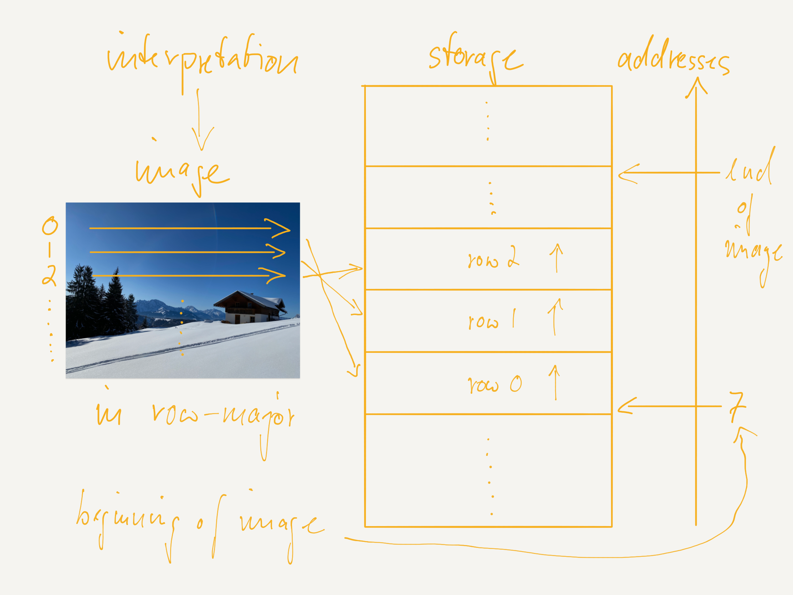

Bitmaps are stored contiguously in memory, usually in *row-major*, that is, horizontal line by horizontal line starting in the top left corner. Another choice for storing a two-dimensional structure (bitmap) in a one-dimensional medium (byte-addressed memory) is *column-major*, that is, vertical line by vertical line. To show an image stored as a bitmap in memory on screen, your machine takes one byte after the other from the bitmap in memory and sets the color of the corresponding pixel on the screen accordingly. Since there are usually millions of pixels, modern machines include special hardware, which does that so fast that the process is invisible to the human eye. Conversely, if you take a picture with your phone or in fact any digital camera, the camera sensor produces a bitmap and stores that in memory, also using special hardware.

Storing the bitmap of an image, essentially as is, in a file with some meta information such as resolution, color depth, and so on, is easy. There are quite a few so-called *raw* file formats for images that allow you to do that. But what if, say, 25.3MB for an image in 4K resolution is too much? We could use *compression*, of course, and the according file formats such as `.jpg`, for example. Compression aims at reducing the number of bits necessary for encoding an image or any other type of information. In fact, compression is another beautiful example of the time-space tradeoff mentioned before. The smaller we want the file that stores an image to be, the more the bits encoding the image need to be compressed. No matter what, there is work involved in doing that, both in encoding and in decoding the image, whether we use *lossless* compression, meaning that decoding the compressed image results in the original image, pixel by pixel, or *lossy* compression where the compressed image just looks more or less the same as the original image.

Lossless compression identifies *redundancy* in a sequence of bits in order to find a hopefully shorter sequence of bits that can be expanded or *decompressed* back into the original sequence of bits. Here, redundancy is the repeated, that is, *redundant* occurrence of the same sequence of bits in a longer sequence of bits that we would like to compress. For example, if a sequence of a thousand 0s occurs repeatedly, it may be worthwhile replacing all such occurrences with a shorter sequence of bits that is supposed to represent the sequence of a thousand 0s. As long as we know that, we can easily decompress the compressed sequence back to the original.

Lossy compression identifies *relevance* in a sequence of bits to eliminate *irrelevant* bits which again results in a hopefully shorter sequence of bits that can, however, only be decompressed back into something that resembles more or less the original depending on the definition of relevance. With images, for example, resolution and color depth may be reduced in some areas of an image where full details are not necessary. Lossy compression has the potential to reduce the number of bits even more than lossless compression since irrelevant bits are discarded entirely rather than replaced with fewer bits and there may be more irrelevant than redundant bits.

Both, lossless and lossy compression work best for a particular type of information such as images, for example, because redundancy and relevance vary for different types of information. Compression designed for images does therefore not work well for music, for example. Also, compressing something that has already been compressed is unlikely to decrease further in size. In fact, it may even increase in size!

Either way, compressed images likely require fewer bytes than the original images. But, it takes time to save space for storing images through compression (even though sending compressed images to someone is faster because there is less to transfer). Just imagine that every time you take a picture and then show it on a screen, your machine needs to encode and decode it, including compression and decompression, which is usually the default setting. But luckily, there is special hardware for that as well.

So, what are other effective ways of reducing the *size* of an image, that is, the number of bytes necessary to encode it? Compression is great but reducing resolution and color depth also works since that reduces the amount of original data directly. Keep that in mind if a lower resolution and color depth is fine for your purposes. For example, going from 4K to HD, which is still 1,920 times 1,080 pixels in resolution, reduces the size of the 4K bitmap from 25.3MB to 5.9MB, still without any compression. The lesson to be learned here is to look for the *factors* that influence the result to an extent that is relevant for your purpose. A prerequisite for that is to understand the difference in *orders of magnitude* from kilobytes to megabytes and gigabytes, for example. Many people ignore that and end up trying to send very large images around or put them up on websites that load slowly or not at all because of that. Machines can only do so much about that.

One more thing before we continue with something that needs even more bytes than images, a lot more. We all seem to have the problem of photo libraries that are ever increasing in size with new pictures coming in almost daily, just like all the other files that we are accumulating at work and at home all the time. With that premise, organizing your photo library into neat albums and deleting bad pictures seems like futile business. We therefore recommend, similar to organizing your files, to not do that yourself but leave it to the machine to organize your photo library. Just take your pictures and do not worry about the rest! Similar to office files containing textual information, image files can also be *indexed* and then found later when searching for pictures showing, say, beaches or mountains. Unfortunately, indexing image files does still not work as well as indexing office files but computer scientists are getting there. By the way, the same applies to files containing video, of course, which is our next topic.

### Video

Yes, even digital *video* is just a sequence of bytes, typically a rather long sequence of bytes. On a higher level of abstraction, video is a sequence of images that are shown in rapid succession on a screen. The problem with digital video in the early days of computing was the prohibitive amount of bytes necessary to encode it while *efficient* and *effective* compression techniques were not yet available. Here, effective means that the amount of bytes is reduced to the extent that it can be managed while quality is preserved, and efficient means that encoding and decoding can still be done in *real time* so that video can be recorded and shown.

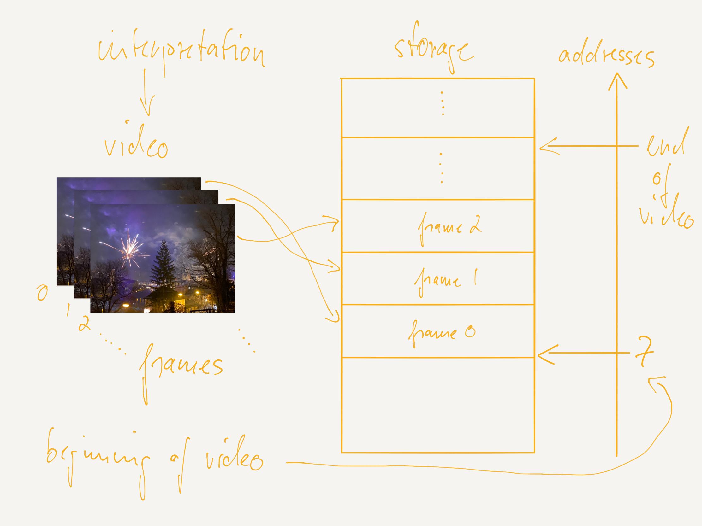

The key difference between video and *still* images is that video is *streaming media*. In other words, video needs to be encoded and decoded in real time at the rate at which the individual images of a video, also called *frames*, are produced. Therefore, while the size of text, images, video, and files in general is measured in number of bytes, there is another quantity that is relevant with video. It is the *frame rate* of the video measured in frames per second (fps) and in particular its *bit rate* which is measured in bits per second (bps), that is, the number of bits per second that need to be processed to handle the video in real time. The usual prefixes of bps such as kilo, mega, and giga are in base 10 which is generally the case for any *data rates* including bytes per second:

| Unit                   | Prefix |
| ---------------------- | ------ |
[ bits per second (bps)  | 1 [kilobit per second](https://en.wikipedia.org/wiki/Data_rate_units "Data Rate Units") (kbps) = 1000bps = 10^3^bps, 1 megabit per second (mbps) = 10^6^bps, 1 gigabit per second (gbps) = 10^9^bps, 1 terabit per second (tbps) = 10^12^bps, ... |
[ bytes per second (B/s) | 1 [kilobyte per second](https://en.wikipedia.org/wiki/Data_rate_units "Data Rate Units") = 1000B/s = 10^3^B/s, 1 megabyte per second (MB/s) = 10^6^B/s, 1 gigabyte per second (GB/s) = 10^9^B/s, 1 terabyte per second (TB/s) = 10^12^B/s, ... |

Suppose we need to handle a 1-hour uncompressed video in 4K resolution with a 24-bit color depth and a frame rate of 30fps. What is the size and what is the bit rate of that video? Easy. One hour is 60\*60 seconds and the number of bytes per frame is 4096\*2160\*3. At 30fps we therefore need to store 60\*60\*30\*4096\*2160\*3 bytes which is around 2.6TB! To get to the unit of TB, just divide the number of bytes by 1TB which is 2^40^B. For calculating the bit rate, we need the number of bits per frame which is 4096\*2160\*24. Again, at 30fps, we thus need to handle 4096\*2160\*24\*30 bits per second which is around 5.9gbps! This is in fact the rate at which bits need to be handled when showing them as pixels on your 4K screen.

State-of-the-art video compression can bring down size and bit rate by up to two orders of magnitude with negligible loss in quality. The key idea is to avoid encoding pixels repeatedly that do not change from one frame to the next. Netflix 4K, for example, could take us from 2.6TB to around 9GB and from 5.9gbps to 20mbps which is a rate that typical *broadband* Internet connections can handle. Just look up the *bandwidth* of your connection, which is also measured in bits per second, and see if it is at least as much as the bit rate of the video you are trying to stream. Video compression is one of the key enabling factors of the streaming movie and video conferencing industry. However, keep in mind that when decoding the video on your machine, the original bit rate of 5.9gbps appears again and needs to be handled to show the video on your 4K screen. The only way to reduce that is by decreasing the resolution, color depth, or frame rate of the video.

In recent years, video compression has become so effective and efficient that even video calls are now a common sight everywhere. As opposed to still images, however, streaming media such as video introduces the need for encoding and decoding information in real time, or at least in so-called *soft real time*, where some, slightly delayed processing may go unnoticed. The advantage of the enormous amount of information involved in video is that some loss of information such as a few delayed or missing bits is fine, simply because the human eye can absorb all that information but the human brain cannot process all of it. With the other type of streaming media, which we discuss next, the story is different though. Here, the bit rate is much lower than with video and the human brain appears to be able to keep up, making the human ear extremely sensitive to loss of information.

### Audio

As usual, digital *audio* is yet another sequence of bytes, usually by far not as many as video of the same length but still enough to worry about. In particular, audio is streaming media, just like video, and requires encoding and decoding in real time. The difference to video is that we are not dealing with a sequence of images that are shown in rapid succession on a screen but with a sequence of *samples* that are played in rapid succession on a speaker. A sample is a binary number with a given number of bits called *bit depth*, analogous to color depth, that represents, say, a signed integer which encodes the amplitude of the audio signal at the time of taking the sample. Think of the amplitude as the distance of a microphone's or speaker's membrane, or in fact your eardrums or vocal cords, from their resting position at the time of taking the sample. This is a beautiful application of signed integers!


So, how often do we have to take a sample? In other words, the question is what an adequate *sampling rate* is, in analogy to the frame rate of video. Well, it depends on the highest frequency we would like to capture. Humans can typically hear frequencies between around 20Hz and 20kHz where Hz stands for cycles per second and is an abbreviation of *Hertz*, the name of a famous physicist. The prefixes kilo, mega, and giga in Hz are in base 10:

| Unit              | Prefix |
| ----------------- | ------ |
| cycles per second ([Hertz,Hz](https://en.wikipedia.org/wiki/Hertz "Hertz"))                   | 1 kilohertz (kHz) = 1000Hz = 10^3^Hz, 1 megahertz (MHz) = 10^6^Hz, 1 gigahertz (GHz) = 10^9^Hz, ... |

According to the famous *Nyquist-Shannon sampling theorem*, we need to sample at twice the rate of the highest frequency we would like to capture in order to be able to reconstruct that frequency and all lower frequencies from our samples without any loss of information. So, it is 40kHz then. Well, for legacy reasons, the slightly higher frequency of 44.1kHz was chosen for Audio CDs, for example, and subsequently for audio formats such as MP3 as well.

Together with the bit depth used for Audio CDs, for example, which is 16 bits encoding a 16-bit signed integer, we can now calculate the *bit rate* at which audio from CDs is encoded and decoded, again in analogy to the bit rate of video. Just calculate 44.1kHz, that is, 44,100Hz times 16B times 2 (because of stereo!) which is 1,411,200 bits per second or around 1.4mbps. This is quite high but remember the bit rate of 5.9gbps necessary for 4K video! Well, there are audio formats that provide even higher quality than CDs, of course, with higher sampling rates and bit depth of even 24 bits. But those still do not reach the typical bit rates of video.

State-of-the-art music compression is not as effective as video compression but still capable of bringing down size and bit rate of music files by one order of magnitude with negligible loss of quality. MP3 is probably still the most popular format using lossy compression but there many other, newer formats using lossy as well as lossless compression. The key idea with lossy music compression is to avoid encoding sound that is inaudible by humans in the presence of other sound. MP3, for example, can be used to reduce the bit rate of Audio CDs from 1.4mbps to, say, 256kbps and still sound close to the original. Going below 128kbps is great for saving space and bandwidth but typically introduces audible degradation in sound quality.

Managing an ever expanding music library, similar to a photo library or just files containing documents, has become a problem for many people in recent years. Even if you just stream your music, you still need to distinguish music you like from music you do not like. There is software that helps doing that but still with lots of room for improvement. Personally, I have given up on trying to organize my pictures, videos, music, and movies and instead rely on software that hopefully becomes smarter over time in doing that for me. I still organize my files in a flat hierarchy of folders but otherwise rely on indexing.

So far, we have seen at different levels of detail how integers, characters, strings, text, files, images, video, and audio are encoded in just bits, possibly compressed, stored in memory, possibly decompressed again, and eventually decoded back into their original or near original form. The one thing that all these different types of information have in common, other than being encoded in bits, is that they are all *data*. However, there is something that is also encoded in bits but entirely different from data. We are talking about *code*. Understanding the difference between code and data, and what code really is, is our next goal or, in fact, our goal in the rest of the book.

### Code

Everything done by a computer is encoded in bits including code. We heard that before but we anyway emphasize this again because it takes repetition and time to realize what that really means. Whatever we want a computer do needs to be broken down into the tiniest steps (code) of bit manipulation (data). Doing that makes people realize how complex even seemingly simple tasks often are.

Code exists in very different forms such as *source code* like `selfie.c` or actual *machine code*. The latter is a sequence of bytes that *instructs* a computer to perform computation with data by manipulating the bits encoding the data whereas the former is just text that still needs to be translated to machine code before it can instruct the machine to do anything. Machine code is for machines, source code is for humans. The machine chapter explains what machine code is and the programming chapter explains what source code is. For now, we focus on machine code and explain how it works intuitively.


Machine code or just code is a sequence of *machine instructions* where each instruction is encoded in four bytes, at least in our case here. There are machines that use different encodings but our choice is quite common and as good as any other for our purpose. Four bytes are 32 bits. This means we could distinguish 2^32^ different instructions in four bytes, that is, around four billion different instructions. This is way too many! A computer usually distinguishes a few dozen to a few hundred and sometimes even a few thousand instructions but not more than that. Out of the 32 bits encoding an instruction only a few bits are therefore used to encode which instruction it actually is. The remaining bits encode the *parameters* and *arguments* of an instruction which are typically addresses or just integers. For example, there is usually an instruction that makes the machine load two integers from memory, add them, and store the result back in memory. We saw that before. There are of course similar instructions for integer subtraction, multiplication, division, and remainder. The other thing these instructions do, and all instruction have that in common, is that they tell the machine where the next instruction in memory is. And that's it! Really!

To get another glimpse of what machine code looks like, try the selfie disassembler on selfie:

```bash
./selfie -c selfie.c -S selfie.s
```

and then:

```bash
more selfie.s
```

The output should be similar to this:

```
0x0(~1): 0x0003F2B7: lui t0,0x3F
0x4(~1): 0xC1028293: addi t0,t0,-1008
0x8(~1): 0x00028193: addi gp,t0,0
0xC(~1): 0x00000513: addi a0,zero,0
0x10(~1): 0x0D600893: addi a7,zero,214
0x14(~1): 0x00000073: ecall
0x18(~1): 0x00750513: addi a0,a0,7
0x1C(~1): 0x00800293: addi t0,zero,8
0x20(~1): 0x025572B3: remu t0,a0,t0
0x24(~1): 0x40550533: sub a0,a0,t0
0x28(~1): 0x0D600893: addi a7,zero,214
0x2C(~1): 0x00000073: ecall
0x30(~1): 0xFEA1BC23: sd a0,-8(gp)
0x34(~1): 0x00000513: addi a0,zero,0
0x38(~1): 0x00013283: ld t0,0(sp)
0x3C(~1): 0xFF810113: addi sp,sp,-8
0x40(~1): 0x00513023: sd t0,0(sp)
0x44(~1): 0x01010293: addi t0,sp,16
0x48(~1): 0x00513423: sd t0,8(sp)
0x4C(~1): 0x5C42A0EF: jal ra,43377[0x2A610]
...
```

What you see here is the machine code that selfie generates when translating its own source code. It is around 43,500 instructions, so no need to look at it all. The first column is the address of each instruction in memory. The second column is the actual machine code in hexadecimal with 32 bits per instruction. The third column is the machine code in a more human-readable form called *assembly*. The machine only needs the second column to execute the code.

> Fetch, decode, execute is all a computer does, all day long

So, when you turn on a computer, the only thing the machine does is *fetch* an instruction, that is, 32 bits from memory, *decode* the instruction, that is, figure out which instruction it is and what the parameters and arguments are, and finally *execute* the instruction, that is, perform what the instruction tells the machine to do. When the machine is done, it fetches the next instruction, as told by the current instruction, decodes it, executes it, and so on. That's all there is until you cut power. Everything you see on your screen and you hear on your speakers and so on is the result of the machine doing that at probably a few billion instructions per second. The only reason why computers have become so important is because they can execute these instructions so fast with little power consumption and have lots of memory to do so. However, each individual instruction executed by a computer is incredibly simple. Machine instructions are so simple that anyone can understand what they do.

The challenge is of course how to put them together to make the machine do anything interesting. This is usually not done at the level of machine code but in source code which is then translated to machine code, not by hand, but by a computer executing *software tools* like selfie that instruct the machine how to translate source code. The programming chapter explains how this works. The topic is fascinating because it shows how the meaning of source code can be created through translation to simple machine code which is easier to understand properly than source code.

Machine code is stored in files as a sequence of bytes, just like text, images, video, audio, and so on. The big difference is that machine code is *executable*, that is, it can instruct a machine to do something. The well-known file extension `.exe` indicates that on Windows machines. Selfie generates machine code (without the human-readable assembly) using option `-o` and file extension `.m` as follows:

```bash
./selfie -c selfie.c -o selfie.m
```

You can take a look at `selfie.m` using a hex editor or by typing:

```bash
hexdump -C selfie.m
```

However, keep in mind that not all machine code can be executed by all computers, at least not directly. Machine code encodes instructions that a given machine can decode and execute. Your phone, for example, is unlikely to be able to execute machine code for your laptop, and vice versa. The story for source code is different though since it may be translated to different types of machine code, for your laptop as well as your phone. The same app on your laptop and your phone may therefore contain different machine code that may nevertheless still come from the same source code. This brings us to the question of what apps really are.

### Apps

An *application* or just *app* is a collection of files of which some are executable code while others are usually data files such as text, images, video, and audio depending on the type of app. For example, a social networking app contains code that *implements* chat functionality and data that the code uses to construct the visual appearance of the app on your screen. The type and format of the app files highly depend on the type of machine on which the app executes or *runs*. An app for Android phones does not run on iPhones and vice versa. However, it may still come from the same source code and the same data files. In many cases, there is much more data than code in apps, especially with games, even though the code is of course the most complex artifact among all app files and key to correct behavior of the app.

### Life

Everything on a digital device is encoded in bits. As consequence, whatever we want such a machine do for us needs to be encoded in bits. We began by looking at how numbers are encoded in bits. It turned out that using binary notation is not all that different from decimal notation. Even arithmetic with binary numbers works essentially the same way as arithmetic with decimal numbers. Fortunately, for other types of information such as text, images, video, audio, and even code and apps, there is a lot of help these days in encoding and decoding them properly.

There are keyboards that encode the keys you type into bits that represent ASCII characters that form text when put together. There are digital cameras and smartphones that encode the pictures, videos, and audio recordings you take in bits. There are screens that decode text, images, and videos from bits into pixels for you to enjoy. There are speakers that decode audio from bits into sound. And then there are software tools that translate the source code you write for an app into machine code encoded in bits that your machine then decodes and executes, together with the data files in your app.

Can any information be encoded in bits? Well, binary encoding is *universal* in the sense that any finite amount of information can be encoded in a finite amount of bits. What about life in general? What can we learn about life from the fact that everything finite can be encoded in bits? Can we encode the DNA of a person in binary? Yes, of course! Mathematically speaking, the only difference between DNA and binary is that DNA is a base-4 encoding whereas binary is a base-2 encoding. So, DNA is more compact than binary by a factor of 2 but that's all. In other words, a DNA sequence of length `n` can encode `4^n^` different DNAs but we only need `2 * n` bits to be able to do the same thing in binary.

Alright, so the blueprints of life can be encoded in bits. Now, let us conduct a thought experiment also called a Gedankenexperiment. Can we write a program that instructs a computer to go through all possible states the machine can be in? In other words, can we make a computer that can store `n` bits *enumerate* all `2^n^` states the machine can be in? Yes, of course! Such a program is actually quite easy to write. Just view all of the machine's memory as storage for a single integer that is incremented by that program. The only problem is that it will take the computer a very long time to complete the execution of the program. In fact, as mentioned before, the computer will long have turned to dust before even getting close to completion.

However, suppose we had a computer that could run for a very long time. What would happen? Well, once in a while, and we are talking an enormous amount of time, the machine would come across a state that encodes, according to today's encoding schemes, say, Leonardo da Vinci's Mona Lisa or Ludwig van Beethoven's Fifth Symphony or, well, the human genome. And that would happen without any intelligence whatsoever, I mean other than incrementing an integer. However, the computer would not be able to *select* such states as *good* states over all the other *bad* states, at least not without additional software which would be a lot more complex than merely incrementing an integer, and may or may not be ever invented.

This is where life and in particular evolution comes in. Evolution is the process of enumerating DNA sequences through alteration called *mutation* and then selecting DNA sequences for further mutation based on criteria such as their reproductive success. Interestingly, evolution can be modeled as a computer executing a program that enumerates and selects integers. The only difference is that evolution is a physical process bound by the laws of physics whereas executing a program is a virtual process bound by the laws of Boolean logic and elementary arithmetic, at least as long as the machine executing the program is not faulty.

The simplicity of that model is striking! But how can this ever work? Well, just like computing it is ultimately a matter of time, space, and energy. We need lots of time, or conversely mutate very fast and select effectively. We need lots of space for mutating and selecting in parallel, or conversely use space very efficiently, that is, be super tiny. And we need lots of energy, or conversely be very energy efficient. In other words, quantities matter! A few more zeroes in a number can make all the difference, in life and in computing. So, let us take a look at a real machine and see what it actually takes to compute.

### Recommended Readings

> Ones and Zeros: Understanding Boolean Algebra, Digital Circuits, and the Logic of Sets by John R. Gregg

We have only scratched the surface of how Boolean Algebra and digital circuits are connected. This book helps you gain a deeper understanding of that.

> Information Theory: A Tutorial Introduction by James V. Stone

This is a book that takes the topic of this chapter a lot further. If you are interested in the fundamentals of information and are not afraid of mathematical formulae, add it to your computer science library and reading list.

## Machine

The machine and its code is a mystery to many even though the basic principles governing its design are surprisingly simple and accessible to everyone. But simplicity is not the only reason why we dedicate a whole chapter to the topic. Knowing how a computer does its magic through mere yet extremely fast manipulation of enormous amounts of bits is the key to understanding virtually everything else in computer science, in particular the motivation of why things are done in certain ways and not others, hence the name of the field!

For many years, there has been a trend towards ignoring the machine when teaching people how to code. After all, high-level programming languages are designed to abstract from the low-level details of the machine. However, not knowing what they abstract from has made coding the most casual engineering discipline among all fields of engineering. The result is not just low code quality almost everywhere but also high tolerance for that among users and decision makers. Electrical, mechanical, and civil engineers would never get away with what software engineers are allowed to do. This is surprising given that learning about the machine and how it connects to everything else takes a fraction of the time it takes to learn a high-level programming language!

> Von Neumann versus Harvard

Digital devices that contain a CPU, and these are essentially all devices from a simple microcontroller in a washing machine to a large server in a data center, are instances of a so-called *von Neumann machine* or *von Neumann architecture* named after *John von Neumann* who described the model in 1945. The idea is to store all information, code and data, encoded in bits in the same memory, next to each other, that is, in the same address space and then connect a CPU to that memory with a *memory bus* that transports the bits, usually more than one at a time, between CPU and memory. Literally think of the memory bus as a bus transporting a group of bits from a specific memory address to the CPU and back. However, the memory bus is infamous for being called the *von Neumann bottleneck* since everything, code and data, needs to be transported on that bus when the machine is running.


An alternative model to a von Neumann machine that addresses the von Neumann bottleneck is the *Harvard architecture* which features separate memories for code and for data connected to the CPU via separate memory buses. The advantage of the Harvard architecture over a von Neumann machine is that it can fetch code and data simultaneously since there are at least two memory buses. There is special-purpose hardware such as *graphics processing units* or *GPUs* that benefit from this feature and are in fact Harvard machines. However, these days even a von Neumann machine performs similar to a Harvard architecture by using separate *memory caches* for code and data from which the CPU can fetch code and data simultaneously as long as the information is in the caches. We nevertheless skip the details here but recommend following up with books on computer architecture if you are interested.

The key advantage of a von Neumann machine over a Harvard architecture is that it provides a common address space for code and data. This removes the problem of provisioning the size of memory for code and data in hardware. With a von Neumann machine we may simply store as much code and data in any ratio until memory is full. But there is also the issue of addressing code and data in memory. Remember that data may be interpreted as pointers to other data, and even code. Also, code needs to address, not just other code in order to instruct the machine where the next instruction is, but also data. In a common address space for code and data all that can be done using the same format for addresses. In other words, domestic mail is just simpler than international.

We begin this chapter with a model of the machine we use throughout the book. After that we present details of the processor and memory, and then explain how machine input and output works in principle. Next is a detailed introduction to the instructions of our machine. At this point, it is time to show how the machine is actually implemented in selfie. The remaining two sections give you an idea of how to measure and evaluate the performance of machine code.

### Model

The *machine model* we use in selfie is a minimalist 64-bit *RISC-V* machine which is fundamentally a von Neumann machine. 64-bit means that CPU and memory bus operate in chunks of 64 bits called *machine words* or just *words*. Well, a 64-bit machine word is actually a *double word* to distinguish it from a *word* which is usually only 32 bits. We nevertheless just use the term *word* and quantify its *size* in bits or bytes if it is unclear from the context.

RISC-V stands for the fifth generation of an *instruction set architecture* or *ISA* of a *reduced instruction set computer* or *RISC*. An ISA provides just the right information needed to program a machine at the level of machine code but not how to build one. It is essentially a list of machine instructions and a description of what they do including how the processor interacts with memory and the outside world at the level of bits. In contrast to RISC, there is also the notion of a *complex instruction set computer* or *CISC* of which the most commonly used ISA is the family of *x86* processors introduced by Intel in 1978.

> RISC versus CISC

RISC machines typically feature a few dozen instructions whereas CISC machines may implement hundreds and even thousands of instructions. But most RISC instructions are also different from CISC instructions. They are usually simpler and more general. A RISC instruction typically involves one, maybe two machine words, in contrast to most CISC instructions that are often more complex and specialized. Therefore, it usually takes multiple RISC instructions to do what a single CISC instruction does but executing a single RISC instruction is typically faster than executing a CISC instruction.

RISC was introduced in the 1980s as an alternative to CISC. Due to its simpler, more general ISA, RISC has given rise to smaller, less power-hungry processors than CISC and thus has helped shifting the focus away from hardware to software. There is generally more freedom in producing efficient RISC code than CISC code yet at the expense of increased code size since more instructions are usually needed with RISC than with CISC. By now, virtually all smartphones and watches as well as tablets, and most computers embedded in devices other than computers such as washing machines and cars, are RISC machines while laptops, desktops, and servers are still mostly CISC machines. But even that is changing with the latest generation of Apple laptops and desktops that are powered by *ARM* processors which are RISC machines.

In the end, there are pros and cons to both, RISC and CISC, and there are also hybrids of both, but we avoid that discussion here. For us, the simplicity of RISC and the fact that RISC represents, in number of sold CPUs, by far the largest market are important reasons for using the model of a RISC machine here. However, while there are many different RISC processors, we chose the RISC-V ISA as inspiration for our model since its specification is an open standard and therefore publicly available. Even though an ISA does not tell you how to build a machine, you could build your own RISC-V processor anyway, given the right skills and sufficient resources, without having to pay any licensing fees! And people have already started doing just that.

### Processor

The ISA we use in selfie is called *RISC-U* where *U* stands for *unsigned*. The RISC-U ISA is a strict and, in fact, tiny subset of the 64-bit RISC-V ISA. This means that machine code that runs on a RISC-U machine also runs on a 64-bit RISC-V machine but not necessarily vice versa. RISC-U features 14 instructions out of the 40 RISC-V base instructions. All instructions are encoded in 32 bits each. The arithmetic RISC-U instructions only provide unsigned integer arithmetic hence the name RISC-U.

> All arithmetic and logical calculations happen in registers

Before taking a closer look at individual RISC-U instructions, we first need to understand the *register model* of the machine. The RISC-U ISA features 32 general-purpose 64-bit registers and one 64-bit *program counter*, just like the 64-bit RISC-V ISA. A *register* is CPU-internal storage for exactly one machine word. RISC-U registers are addressed from 0 to 31 which is a 5-bit *address space* since 2^5^ is 32. In other words, 5 bits are enough to identify any of the 32 registers. All arithmetic and logical calculations are done in these registers by a circuit called the *Arithmetic Logic Unit* or *ALU*. A full adder, which we explained in the information chapter, is an example of an important ALU component. Note that register 0, also called `zero`, is special. It always contains the 64-bit integer value 0, even after trying to store a non-zero value in that register. The purpose of that register is to initialize other registers. We show how that works below.

> The program counter determines which bits are interpreted as code

The *program counter* of a CPU, and they all have one, is like a register but with an important, dedicated purpose. It stores exactly one machine word which is interpreted as a pointer to memory, that is, a memory address where the next instruction to be fetched, decoded, and executed is stored in memory. For the machine, the program counter, also denoted `pc`, is therefore the only way of knowing where code rather than data is stored in memory. Any hacker trying to break into a computer ultimately attempts to control the program counter to have the machine run code that it would otherwise not run.

> All day long: fetch, decode, execute

So, what exactly does a processor do? We briefly mentioned that in the information chapter but would like to go back to that here. The only thing a processor does is *fetch* a machine word (here 32 bits) from memory at the address where the program counter points to, *decode* the machine word to figure out which instruction it actually is and what its parameters and arguments are, and finally *execute* the instruction. For this purpose, the processor maintains a hidden *instruction register* denoted `ir` that stores the currently executed instruction. Most importantly, all instructions have in common that they make the processor set the `pc` to another memory address when done. Then the processor fetches the next instruction into `ir`, as told by the current instruction, decodes it, executes it, and so on, until power is cut.

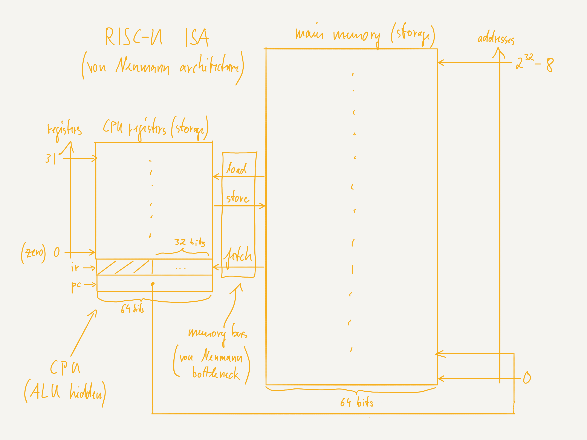

In addition to the program counter, some instructions make the processor change either the value of one of the 32 general-purpose 64-bit registers or the value of a 64-bit machine word in memory. This means that a RISC-U processor, upon executing any instruction, changes no more than 128 bits: 64 bits of the program counter and possibly another 64 bits in a register or a machine word in memory. That's all!

> Computation is a seemingly endless sequence of state transitions

Let us take a step back and reflect on what we have here. The *state* of a processor are the bits stored in its registers and program counter. How many do we have in a RISC-U processor? Easy. 32\*64+1\*64=2112 bits. The *state space* of the processor is therefore 2^2112^ different states. How many is that? Well, there are around 2^267^ particles in the known universe. In other words, our little RISC-U processor, which, in a similar flavor, likely powers your smartphone, can already be in a lot more states than that. And we are not even counting memory. So, all a RISC-U processor does is exploring its state space from one state to another by executing one instruction after another where each instruction makes the processor flip up to 128 bits in what is called a *state transition*. The number of bits involved in a state transition might be different for other types of processors but the principle is always the same. From the perspective of a processor, *computation* is a (possibly unbounded) sequence of state transitions where each transition is triggered by the execution of one machine instruction which usually affects a very small number of bits. Turns out your smartphone is not so smart after all. But the people who program it probably are.

Before we move on to explaining memory, we should briefly mention what a *multicore* machine is, which is probably something you have heard of and is in your pocket right now. Our RISC-U processor is a single core machine. However, making it, say, a dual core machine is simple. Just duplicate registers and program counter but not memory. In other words, each core has its own registers and program counter but shares memory with all other cores. Why is this cool? Because a multicore machine can execute the same or different code as many times in parallel as there are cores, at least in principle. Remember the von Neumann bottleneck? Since memory and in particular the memory bus is shared among all cores, the bottleneck becomes even more of an issue and may slow down all cores. Modern machines address the issue in fascinating and sophisticated ways but the fundamental problem is here to stay.

### Memory

The *memory model* of the RISC-U ISA in selfie is based on byte-addressed memory, as introduced in the information chapter. More specifically, a RISC-U machine has a 32-bit *main memory address space* with up to 4GB of byte-addressed *main memory storage* where all memory access is 64-bit *word-aligned* except when instructions are fetched which is done 32-bit *word-aligned*. This means that whenever the CPU accesses memory (load or store) it can only do so at memory addresses that are multiples of 8 bytes (64 bits) unless the CPU fetches an instruction which is done at memory addresses that are multiples of 4 bytes (32 bits). That makes sense because each instruction occupies exactly 32 bits in memory.

Let us count how many bits a RISC-U machine can store. There are the 2112 bits of the registers and program counter plus 4\*2^30^\*8=34,359,738,368 bits of main memory which are 34,359,740,480 bits in total. This means that there are 2^34359740480^ different states in which a RISC-U machine can be which is an absolutely mind-blowing number, especially considering that your smartphone is likely to be quite similar to a RISC-U machine.

> A computer is a deterministic machine, just freeze it and write down all stored bits

We nevertheless do not intend to just impress you with large numbers but rather would like to emphasize that a computer such as a RISC-U machine is fully *deterministic*. Whenever we take such a machine, freeze its current state, write down all its bits, and then copy all of the bits to another machine of the same kind that machine will be indistinguishable from the original machine. Freezing and writing down the state of a machine is called *snapshotting* and copying the state to another machine is called *migration* which are both very powerful concepts explained in the computing chapter.

The state space of a RISC-U machine or any other modern computer is so large that it will never be able to explore all states and it is unlikely that the machine will ever be in the same state twice. The latter is true because some of the bits in main memory may in fact be flipped regularly from outside of the machine to facilitate input to the machine such as the current day and time. And that is our next topic of interest.

### Input/Output

So far, the model of our RISC-U ISA is *closed* in the sense that there is no mechanism to input information from and output information to the *environment* of the machine. There are all these bits stored in the machine but we cannot change them and cannot see them either. No *input/output* abbreviated *I/O* puts us in a catch-22 situation. How can a machine run whatever code we like if there is no code in the machine, in particular no code that can instruct the machine to get the code we like into the machine?

There are actually two problems here. Firstly, whenever a computer is turned on all its registers, program counter, and main memory are usually *zeroed*, that is, all its bits are 0. In particular, there is no code in main memory, and no data as well, nothing. Secondly, even if there was code in main memory, we could only have the machine run that code and nothing else as long as their is no way to get other code and data into the machine.

The first problem is a *bootstrapping* problem, the second is just lack of I/O. The bootstrapping problem is solved as follows. When a machine is turned on, its CPU is connected not just to zeroed main memory but also to some small non-volatile memory that contains code known as *firmware* often called *BIOS* which stands for *Basic Input/Output System*. Initially, the program counter points to the first firmware instruction, and not to anything in main memory, and all code is fetched from firmware rather than main memory. Thus the CPU executes firmware when turned on!

The initial purpose of firmware is instructing the machine how to get code from some external source into main memory which is called *booting* the machine. The code is typically operating system (OS) code while the external source may be a solid state drive (SSD) or harddrive or even a network connection. Firmware also contains other code that may be executed later after booting when the machine is up and running code from main memory but this is not important here. Booting the machine ends with a special instruction in firmware that makes the CPU switch the program counter from firmware to main memory and point to the first instruction of the code that was just put there during booting.

From then on, the machine executes code from main memory until it is turned off or restarted. Right after booting the machine, the code in memory is typically the *bootloader* of an operating system which instructs the machine to get even more code and also data from some external source into main memory. However, the boot process of the machine is complete by the time the CPU switches from firmware to main memory. Whatever happens after that is up to the code in main memory. The bootloader of an operating system, for example, begins the *boot process* of the operating system by instructing the machine to get the remaining OS code into main memory. When the bootloader is done, the OS code takes over and instructs the machine to further initialize registers and memory as needed. When done, the boot process is complete and the machine is ready to run your apps.

> Booting a computer is almost impossible but not quite

Why is all this called bootstrapping or booting? Well, many boots have bootstraps that help pulling the boots on. Bootstrapping goes one step further and refers to the impossible task of pulling the boots on and then continue pulling oneself up by one's bootstraps. Bootstrapping or booting a machine is a similar, seemingly impossible task where the machine pulls itself up by its bootstraps, that is, by its firmware. The difference to pulling oneself up is that booting a machine actually works.

> Memory-mapped versus port-mapped I/O

Let us now look at how I/O is done, in particular how code and data gets into main memory but also how data gets out. There are essentially two techniques which are both part of the ISA of a machine. The first technique is *memory-mapped* I/O and the second is *port-mapped* I/O through special *I/O instructions*. We discuss both here but emphasize that we deliberately chose not to include them in the RISC-U ISA. Instead we use a standard abstraction that simplifies I/O in our model and explain that in the next section.

Nevertheless, it is quite educational to understand how a machine does I/O in principle, so here we go. First of all, what is the challenge? Think about two people talking to each other. In fact, let us do what computer scientists like to do in a situation like this. We imagine Alice from the 1865 novel Alice in Wonderland by Lewis Carroll talking to the White Rabbit which is one of the animal characters in the novel.

So, suppose Alice says something to the White Rabbit. Until the moment in time when the sound of her voice reaches the rabbit‘s ears, the White Rabbit does not know that she says anything, given that he cannot see her speaking, of course. If he could see her, we could anyway tell the same story just using vision rather than hearing. Now, when the sound hits the rabbit‘s ears, it does so at a certain bit rate at which the bits need to be stored and processed in the rabbit's brain.

Remember the information chapter, in particular how audio is encoded? Yes, of course, you do. Alright, but there is a difference between hearing and actually listening as we all know. Alice needs to get the rabbit‘s attention which takes time since the rabbit does not yet know that she started saying something. In the world of machines the duration of that time is called *latency*.

Here is the issue with latency. If the bits arrive, say, at a rate of 1000 bits per second (1kbps) and the latency is 1 second (the rabbit is really distracted), then at least 1000 bits (1kb) need to be stored, or we say *buffered*, in the rabbit's brain before processing begins to avoid losing any information. However, if the rabbit's brain can then process the bits at a rate of at least 1kbps, no more than 1kb need to be buffered at any time. In fact, after buffering the first 1kb in the order in which the bits arrived, the buffered bits, starting with the bit that arrived first, may be overwritten with the next 1kb. In this case, the storage for the 1kb is called a *cyclic buffer*.

Given the rates at which bits arrive and are processed and the latency until processing begins, it is easy to determine the size of the cyclic buffer needed to avoid any loss of information. And that is exactly what hardware engineers do when provisioning cyclic buffers for the *I/O devices* of a computer such as an audio device connected to a microphone for hearing what Alice has to say. The only difference to the above example is that the involved bit rates are usually much higher and that the latency is much shorter, in the range of milliseconds, or even microseconds, and sometimes even nanoseconds:

| Unit       | Prefix |
| ---------- | ------ |
| second (s) | 1 [millisecond](https://en.wikipedia.org/wiki/Millisecond "Millisecond") (ms) = 0.001s = 10^-3^s, 1 microsecond (us) = 0.000001s = 10^-6^s, 1 nanosecond (ns) = 0.000000001s = 10^-9^s, ... |

On a more abstract level, the I/O challenge is that Alice and the White Rabbit are two separate entities, just like you and your computer, that would like to communicate but are on their own, independent timelines, that is, operate at their own, individual speed (bit rates) and have no way of anticipating communication (latency). Even if we have both agree on a time when to communicate and use synchronized clocks, and there are systems that do that, the problem remains, just on a smaller timescale, because of clock drift. It is a fundamental issue that is yet another fascinating research topic in computer science but clearly beyond what we intend to do here.

So, how does I/O on a machine work now? Digital devices usually have quite a few I/O devices such as keyboards and screens, microphones and speakers, SSDs or harddrives, and wired and wireless network connectors. Think of each I/O device as a processor similar to the CPU of your machine. Naturally, each I/O device must be connected to the machine somehow and there are essentially two different ways in use today. Machines with *memory-mapped I/O* have their I/O devices connected to main memory, either through the same memory bus as the CPU or through their own memory bus. Machines with *port-mapped I/O* have their I/O devices connected to *ports* which form an address space separate from main memory. There are also variants such as machines with an x86 processor that do both.

Either way, each I/O device is assigned to a range of addresses in main memory or a range of ports where communication happens, as specified in the ISA of a machine. For example, a memory-mapped audio device connected to a microphone stores the bits that encode the audio signal from the microphone in main memory at the specified addresses from which the CPU can then retrieve the bits. This means that memory at such addresses cannot be used for storage which used to be an issue in the old days of computing when main memory was scarce. Port-mapped I/O avoids that problem. However, port-mapped I/O requires special I/O instructions that are able to address ports rather than addresses in main memory.

How does the audio device get the attention of the CPU which is generally distracted by executing code that has nothing to do with audio? After all, the bits stored by the audio device will soon be overwritten by the device and thus lost forever, unless the CPU retrieves them before they are overwritten and then stores and processes them somewhere else. There are essentially two ways to do this.

> Polling: Are we there yet, are we there yet? Interrupts: We are there!

First, there is *polling*, that is, the CPU asking the audio device, rather than the other way around, if there is new information by executing instructions at regular time intervals that inspect the memory addresses or ports shared with the audio device. For this purpose, there is usually a specific memory address or port among the shared memory addresses or ports at which the audio device sets a bit called a *control line* when there is new data available at the remaining shared memory addresses or ports which are called *data lines*. Thus the CPU regularly *polls* the control line and, if there is new data, retrieves it from the data lines. When the CPU is done it may set the bit of another control line to acknowledge receipt of the data with the audio device which in turn may then send more data. With polling, the length of the time interval determines the *worst-case* latency since it may take at most one time interval for the CPU to find out that there is new data. The disadvantage of polling is that the CPU may poll many times before there is any new data rather than doing other more useful work. Polling is like the White Rabbit asking again and again: Did anyone say anything? Did anyone say anything? Did anyone say anything? Sounds impractical but polling, because of its simplicity, is not so bad, at least for high-latency I/O.

Second, there are *interrupts*, that is, the audio device interrupting the CPU in whatever code it is executing right now and make it execute code that retrieves new data. How does that work? Well, the only mechanism available for controlling which code the CPU executes is the program counter. So, interrupting the CPU means that its program counter is set to a different memory address where code is that instructs the CPU to retrieve new data. That code is called an *interrupt handler* which also needs to keep track of the memory address at which the CPU was interrupted so that it can set the program counter back to that address when done. Interrupts are like Alice being able to tell the White Rabbit to suspend whatever he is doing at any time and listen immediately to her and, when she is done speaking, have the White Rabbit resume whatever he was doing before. Interrupts obviously support low-latency I/O and avoid wasting time on polling. However, interrupt handling can be extremely complex. Imagine that all code running on a machine may be interrupted at any time including the interrupt handlers themselves. Yes, you heard that right. An interrupt handler may be interrupted, even by itself. Interrupt handlers that can tolerate that are called *re-entrant*.

While a CPU or better one core of a CPU can only execute one instruction after another, polling and interrupts allow the machine to deal with lots of different I/O and still also compute something, as long as the CPU is fast enough and there is enough memory for buffering. In general, for each I/O device of a machine, there is a *device driver* which is code that instructs the CPU how to poll the device or handle the interrupts from the device but also how to perform the actual data transfer. A device driver highly depends on the ISA of the machine and is *concurrent code* if its execution may be *interleaved* through interrupts with the execution of other code. A device driver may therefore be extremely complex, especially if the I/O device is also complex. We do not go further into the details here but revisit the topic of concurrent code in the computing chapter.

Before moving on, we would like to mention two more representative examples of I/O. First of all, what if the audio device is *bidirectional*, meaning it can also take bits from shared memory addresses or ports and decode them back into an audio signal that goes to, say, a speaker? In principle, communication from CPU to I/O device works the same as the other way around. Data lines may even be bidirectional, that is, may be overwritten from either side, whereas control lines are often just unidirectional. And there are lots of other bidirectional I/O devices such as SSDs and harddrives as well as wired and wireless network connectors, of course. Bidirectional communication is great because it allows the CPU and I/O devices to engage in complex *communication protocols* for booting the machine, for example. In this case, the firmware instructs the CPU to instruct the SSD to retrieve OS code and then share that with the CPU for storing the code in main memory. Voila! Who would have thought that turning on your smartphone triggers a mission (almost) impossible?

Our last but not least I/O example is that of a clock device which allows a CPU to keep track of time. Very important! Polling time as well as *timer interrupts* are possible. The latter are particularly useful. Suppose we would like to *time-share* the CPU by having it execute some code for a certain amount of time and then execute some other code and so on. This is easy. Most machines have a clock device exactly for this purpose. Before executing some code, we may have the CPU execute code that sets a timer interrupt by instructing the clock device to interrupt the CPU after a given time elapsed. It is like setting an alarm. Then, we also need a timer interrupt handler that makes the CPU set a timer interrupt again before moving on to execute other code. Unsurprisingly, polling other I/O devices is usually implemented like that.

The lesson learned here is important. The fact that our machine can only execute one instruction after another puts us in a difficult spot when it comes to dealing with the outside world of the machine. Usually, many things out there happen in *parallel* at the same time while our machine is purely *sequential*. Even with multiple cores the situation does not change because in the end communication is always between at least two independent parties. At the end of the following section, we nevertheless demonstrate how I/O is done in selfie on a more abstract level that avoids most of the above complexity but is still good enough for our purpose.

### Instructions

Let us take a look at the exact state of a RISC-U machine again but now using a bit more terminology. A RISC-U machine has a 64-bit program counter denoted `pc`, 32 general-purpose 64-bit registers numbered `0` to `31` and denoted `zero`, `ra`, `sp`, `gp`, `tp`, `t0`-`t2`, `s0`-`s1`, `a0`-`a7`, `s2`-`s11`, `t3`-`t6`, and 4GB of byte-addressed memory. Register `zero` always contains the value 0. Any attempts to update the value in `zero` are ignored.

The RISC-U ISA features 14 instructions: `lui` and `addi` for initializing registers, `ld` and `sd` for accessing memory, `add`, `sub`, `mul`, `divu`, and `remu` for arithmetic operations, `sltu` for comparing integers, `beq`, `jal`, and `jalr` for controlling the `pc`, and `ecall` for input/output, memory management, and other systems functionality. See also the file `riscu.md` in the selfie repository for an overview of the RISC-U ISA.

RISC-U instructions are encoded in 32 bits (4 bytes) each and stored next to each other in memory such that there are two instructions per 64-bit double word. Memory, however, can only be accessed by `ld` and `sd` at 64-bit double-word granularity. The `d` in `ld` and `sd` stands for double word.

Let us take another look at what selfie tells us about those 14 instructions when self-compiling. First, try:

```bash
./selfie -c selfie.c
```

The relevant part of the output should be similar to this:

```
...
./selfie: 189136 bytes generated with 43440 instructions and 15376 bytes of data
./selfie: init:    lui: 2621(6.03%), addi: 14581(33.56%)
./selfie: memory:  ld: 7648(17.60%), sd: 7211(16.59%)
./selfie: compute: add: 3551(8.17%), sub: 721(1.65%), mul: 495(1.13%)
./selfie: compute: divu: 88(0.20%), remu: 31(0.07%)
./selfie: compare: sltu: 701(1.61%)
./selfie: control: beq: 989(2.27%), jal: 4164(9.58%), jalr: 631(1.45%)
./selfie: system:  ecall: 8(0.01%)
```

Selfie reports that it generated 43,440 RISC-U machine instructions as well as 15,376 bytes of data needed to run the code. Moreover, as mentioned before, selfie outputs how many instructions of each type it generated. The `addi` instruction is with 33.56% the most common instruction while the `ecall` instruction is with 0.01% the least common.

In order to explain all RISC-U machine instructions we use as running example the assembly code generated for the procedure `count` introduced in the language chapter. Here is the source code again, this time with a `main` procedure that invokes `count` to count from `0` to `10000` and then return `10000`:

```c
int count(int n) {
  int c;

  c = 0;

  while (c < n)
    c = c + 1;

  return c;
}

int main() {
  return count(10000);
}
```

You can find the source code in a text file called `count.c` in the `examples` folder of the selfie system. The human-readable assembly code for the program is obtained as before using the selfie disassembler:

```bash
./selfie -c examples/count.c -S count.s
```

where selfie stores the assembly code in a text file called `count.s` and responds with the following profile of the compiled source code and the generated instructions:

```
./selfie: this is the selfie system from selfie.cs.uni-salzburg.at with
./selfie: 64-bit unsigned integers and 64-bit pointers hosted on macOS
./selfie: selfie compiling examples/count.c to 64-bit RISC-U with 64-bit starc
./selfie: 123 characters read in 14 lines and 0 comments
./selfie: with 79(64.23%) characters in 42 actual symbols
./selfie: 0 global variables, 2 procedures, 0 string literals
./selfie: 2 calls, 2 assignments, 1 while, 0 if, 2 return
./selfie: symbol table search time was 3 iterations on average and 61 in total
./selfie: 512 bytes generated with 126 instructions and 8 bytes of data
./selfie: init:    lui: 2(1.58%), addi: 57(45.23%)
./selfie: memory:  ld: 23(18.25%), sd: 12(9.52%)
./selfie: compute: add: 2(1.58%), sub: 2(1.58%), mul: 0(0.00%)
./selfie: compute: divu: 0(0.00%), remu: 2(1.58%)
./selfie: compare: sltu: 1(0.79%)
./selfie: control: beq: 5(3.96%), jal: 5(3.96%), jalr: 7(5.55%)
./selfie: system:  ecall: 8(6.34%)
./selfie: 4584 characters of assembly with 126 64-bit RISC-U instructions and 8 bytes of data written into count.s
```

The only instructions missing are the `mul` and `divu` instructions. However, they are similar to the `add` and `sub` instructions, and the `remu` instruction, respectively. We explain the details below.

Selfie generates `126` instructions for the program of which we show only those instructions that are actually executed when running the code. The instructions not shown are code for I/O and memory management which is not used here. The assembly code in `count.s` begins with the following instructions which initialize the machine before running the actual code for `main` and `count`, and then wrap up when done:

```asm
0x0(~1): 0x000112B7: lui t0,0x11
0x4(~1): 0x00828293: addi t0,t0,8
0x8(~1): 0x00028193: addi gp,t0,0      // initialize gp register
---
0xC(~1): 0x00000513: addi a0,zero,0
0x10(~1): 0x0D600893: addi a7,zero,214
0x14(~1): 0x00000073: ecall
0x18(~1): 0x00750513: addi a0,a0,7
0x1C(~1): 0x00800293: addi t0,zero,8
0x20(~1): 0x025572B3: remu t0,a0,t0
0x24(~1): 0x40550533: sub a0,a0,t0
0x28(~1): 0x0D600893: addi a7,zero,214
0x2C(~1): 0x00000073: ecall
0x30(~1): 0xFEA1BC23: sd a0,-8(gp)     // initialize heap
0x34(~1): 0x00000513: addi a0,zero,0
---
0x38(~1): 0x00013283: ld t0,0(sp)
0x3C(~1): 0xFF810113: addi sp,sp,-8
0x40(~1): 0x00513023: sd t0,0(sp)
0x44(~1): 0x01010293: addi t0,sp,16
0x48(~1): 0x00513423: sd t0,8(sp)      // initialize stack
---
0x4C(~1): 0x15C000EF: jal ra,87[0x1A8] // call main procedure
---
0x50(~1): 0xFF810113: addi sp,sp,-8    // main returns here
0x54(~1): 0x00A13023: sd a0,0(sp)
0x58(~1): 0x00013503: ld a0,0(sp)      // load exit code
0x5C(~1): 0x00810113: addi sp,sp,8
0x60(~1): 0x05D00893: addi a7,zero,93
0x64(~1): 0x00000073: ecall            // exit
...
```

It may be hard to believe but after reading this chapter you will be able to understand all of this code! Why are we doing this to you? Well, understanding the machine gives you a truly solid foundation on which your knowledge of computer science can rest for a long time. Virtually everything in computer science ultimately depends on the nature of the machines we use.

For now, let us focus on the `jal` instruction from the above code:

```asm
0x4C(~1): 0x15C000EF: jal ra,87[0x1A8] // call main procedure
```

As stated in the comments, after initializing various aspects of the machine, this instruction calls the `main` procedure by making the processor *jump* to the code that implements `main` at address `0x1A8`. The `j` in `jal` stands for jump! When `main` is done, the processor returns to the instruction that follows the `jal` instruction and eventually exits the program. Here is the code that implements `main`:

```asm
0x1A8(~13): 0xFF810113: addi sp,sp,-8     // int main() {
0x1AC(~13): 0x00113023: sd ra,0(sp)
0x1B0(~13): 0xFF810113: addi sp,sp,-8
0x1B4(~13): 0x00813023: sd s0,0(sp)
0x1B8(~13): 0x00010413: addi s0,sp,0
---
0x1BC(~13): 0x000022B7: lui t0,0x2        // return count(10000);
0x1C0(~13): 0x71028293: addi t0,t0,1808
0x1C4(~13): 0xFF810113: addi sp,sp,-8
0x1C8(~13): 0x00513023: sd t0,0(sp)
0x1CC(~13): 0xF75FF0EF: jal ra,-35[0x140] // call count procedure
0x1D0(~13): 0x00050293: addi t0,a0,0      // count returns here
0x1D4(~13): 0x00000513: addi a0,zero,0
0x1D8(~13): 0x00028513: addi a0,t0,0
0x1DC(~13): 0x0040006F: jal zero,1[0x1E0]
---
0x1E0(~14): 0x00040113: addi sp,s0,0      // }
0x1E4(~14): 0x00013403: ld s0,0(sp)
0x1E8(~14): 0x00810113: addi sp,sp,8
0x1EC(~14): 0x00013083: ld ra,0(sp)
0x1F0(~14): 0x00810113: addi sp,sp,8
0x1F4(~14): 0x00008067: jalr zero,0(ra)   // return to exit
```

The very last instruction of `main`:

```asm
0x1F4(~14): 0x00008067: jalr zero,0(ra)   // return to exit
```

makes the processor return to the instruction that follows the `jal ra,87[0x1A8]` instruction. The `r` in `jalr` stands for return! Similarly, the `jal` instruction in the code for `main`:

```asm
0x1CC(~13): 0xF75FF0EF: jal ra,-35[0x140] // call count procedure
```

calls the code for `count` at address `0x140` which is right here:

```asm
...
0x140(~4): 0xFF810113: addi sp,sp,-8      // int count(int n) {
0x144(~4): 0x00113023: sd ra,0(sp)
0x148(~4): 0xFF810113: addi sp,sp,-8
0x14C(~4): 0x00813023: sd s0,0(sp)
0x150(~4): 0x00010413: addi s0,sp,0
---
0x154(~4): 0xFF810113: addi sp,sp,-8      // int c;
---
0x158(~4): 0x00000293: addi t0,zero,0     // c = 0;
0x15C(~4): 0xFE543C23: sd t0,-8(s0)
---
0x160(~6): 0xFF843283: ld t0,-8(s0)       // while (c < n)
0x164(~6): 0x01043303: ld t1,16(s0)
0x168(~6): 0x0062B2B3: sltu t0,t0,t1
0x16C(~6): 0x00028C63: beq t0,zero,6[0x184]
---
0x170(~7): 0xFF843283: ld t0,-8(s0)       //   c = c + 1;
0x174(~7): 0x00100313: addi t1,zero,1
0x178(~7): 0x006282B3: add t0,t0,t1
0x17C(~7): 0xFE543C23: sd t0,-8(s0)
---
0x180(~9): 0xFE1FF06F: jal zero,-8[0x160] // end of while loop
---
0x184(~9): 0xFF843283: ld t0,-8(s0)       // return c;
0x188(~9): 0x00028513: addi a0,t0,0
0x18C(~9): 0x0040006F: jal zero,1[0x190]
---
0x190(~10): 0x00040113: addi sp,s0,0      // }
0x194(~10): 0x00013403: ld s0,0(sp)
0x198(~10): 0x00810113: addi sp,sp,8
0x19C(~10): 0x00013083: ld ra,0(sp)
0x1A0(~10): 0x01010113: addi sp,sp,16
0x1A4(~10): 0x00008067: jalr zero,0(ra)   // return to main
```

And again, the very last instruction of `count`:

```asm
0x1A4(~10): 0x00008067: jalr zero,0(ra)   // return to main
```

makes the processor return to the instruction that follows the `jal ra,-35[0x140]` instruction in `main`.

Notice that in `count.s` the code for `count` actually appears before the code for `main`. You can even see that by just looking at the code addresses. This is because `count` appears before `main` in the source code, and the selfie compiler just generates code from top to bottom, independently of how the code is executed later.

Let us execute the program and see what happens:

```bash
./selfie -c examples/count.c -m 1
```

Here is the relevant output:

```
...
./selfie: selfie executing 64-bit RISC-U binary examples/count.c with 1MB physical memory on 64-bit mipster
...
./selfie: examples/count.c exiting with exit code 10000
./selfie: selfie terminating 64-bit RISC-U binary examples/count.c with exit code 10000
...
./selfie: summary: 90067 executed instructions [22.22% nops]
...
./selfie: init:    lui: 2(0.00%)[0.00%], addi: 10033(11.13%)[0.03%]
./selfie: memory:  ld: 30009(33.31%)[33.33%], sd: 10010(11.11%)[0.01%]
./selfie: compute: add: 10000(11.10%)[0.00%], sub: 1(0.00%)[0.00%], mul: 0(0.00%)[0.00%]
./selfie: compute: divu: 0(0.00%)[0.00%], remu: 1(0.00%)[0.00%]
./selfie: compare: sltu: 10001(11.10%)[0.00%]
./selfie: control: beq: 10001(11.10%)[99.99%], jal: 10004(11.10%)[0.01%], jalr: 2(0.00%)[0.00%]
./selfie: system:  ecall: 3(0.00%)
./selfie: profile: total,max(ratio%)@address(line#),2ndmax,3rdmax
./selfie: calls:   2,1(50.00%)@0x140(~4),1(50.00%)@0x1A8(~13),0(0.00%)
./selfie: loops:   10000,10000(100.00%)@0x160(~6),0(0.00%),0(0.00%)
./selfie: loads:   30009,10001(33.32%)@0x160(~6),10001(33.32%)@0x164(~6),10000(33.32%)@0x170(~7)
./selfie: stores:  10010,10000(99.90%)@0x17C(~7),1(0.00%)@0x30(~1),1(0.00%)@0x40(~1)
...
```

The program does return `10000` as exit code but the fact that it counts from `0` to `10000` is only visible by looking at the number of executed instructions. There are only `126` instructions that implement the program but `90067` executed instructions. Dividing `90067` by `10000` equals around `9` which means that it takes around `9` instructions for an increment by `1`. Which instructions are those? Easy. It is the `9` instructions from address `0x160` to `0x180` which implement the `while` loop at lines `6` and `7` in `count.c`.

You can even see the exact breakdown of how many instructions of each kind were executed and the number of loop iterations that were taken including approximate source code line numbers. The execution profile also shows the *hotspots*: the loop with the most, second-most, and third-most iterations (max, 2ndmax, 3rdmax), and similarly procedure calls as well as memory loads and stores.

One more thing before we explain each RISC-U machine instruction in detail: there is a special instruction that we have not seen yet denoted `nop` in assembly where `nop` stands for *no operation*. We nevertheless do not count it as another instruction of the RISC-U ISA because it is just a special case of an `addi` instruction. The only thing a `nop` makes the CPU do is go to the next instruction without doing anything else. In other words, it just wastes time, space, and energy. Yet `nop` instructions have a purpose, also in selfie, namely for *padding* memory where code is stored.

Also, in the above profile, selfie reports in brackets `[]` the percentage of how many times an executed instruction *behaved* like a `nop` instruction without necessarily *being* a `nop` instruction. We call that a *dynamic* `nop`. For example, out of the `90067` executed instructions 22.22% were dynamic `nops` just wasting time, space, and energy. Getting rid of those is an advanced topic in computer science called *code optimization* which we skip here. We nevertheless provide more examples below.

#### Initialization

The first two RISC-U instructions we introduce are the `lui` and `addi` instructions which allow us to initialize CPU registers. There are also use cases other than initialization which we mention below as well.

We begin with the `addi` instruction where `addi` stands for *add immediate*. It instructs the CPU to add an *immediate* value, here a signed 12-bit integer value, to the 64-bit value in a register and store the result in another register (or even the same register). Here is an `addi` instruction from the running example:

```asm
0x44(~1): 0x01010293: addi t0,sp,16
```

where `0x44` is the address of the instruction (ignore the `(~1)`), `0x01010293` is the 32-bit *binary code* of the instruction, and `addi t0,sp,16` is the human-readable version of the instruction in *assembly code*. In other words, `0x01010293` and `addi t0,sp,16` mean exactly the same thing, just encoded differently. For the machine, `0x01010293` is all it needs while for us `addi t0,sp,16` is a lot more convenient to read. Binary code is for machines, assembly code is for humans.

The instruction `addi t0,sp,16` makes the CPU add the *immediate* value `16` to the value stored in register `sp` and then store the result in register `t0`. We denote that behavior by the assignment `t0 = sp + 16` where, as mentioned before, `=` does not assert equality, but instead denotes an assignment of the value to which the expression `sp + 16` evaluates to register `t0`.

Alright, but why is the value `16` called immediate value? This is because the value is encoded in the binary code of the instruction itself. You can spot the `16`, which in hexadecimal is `0x10` or here `0x010`, right there in `0x01010293`, that is, the `16` is encoded in the 12 MSBs of `0x01010293` as signed 12-bit integer. Can we spot `t0` and `sp` as well? Sure, they are just a bit more difficult to find. Register `sp` is register number `2` and register `t0` is register number `5` among the 32 general-purpose registers of the CPU. Then, take a look at the binary code, not just in hexadecimal but, well, in binary notation:

```
0x    0    1    0    1    0    2    9    3
0b 0000 0001 0000 0001 0000 0010 1001 0011
```

After regrouping the bits (and the hexadecimal digits) you can spot both register numbers `2` and `5` which are encoded in 5 bits each because 5 bits are enough to address all 32, that is, 2^5^ general-purpose registers:

```
           0x10     2         5    0x13
0b 000000010000 00010 000 00101 0010011
```

There is also the *opcode* `0x13` of the `addi` instruction encoded in the 7 LSBs `0010011`. The opcode enables the CPU to identify the instruction during decoding and then find the parameters encoded in the remaining bits. Which bits encode what exactly depends on the instruction and is determined by its *format*. The `addi` instruction is encoded according to the so-called *I-Format*. You can find the exact definition of the I-Format and the other formats introduced below in `selfie.c`. For the I-Format, just look for:

```
// RISC-V I Format
// ----------------------------------------------------------------
// |           12           |  5  |  3   |        5        |  7   |
// +------------------------+-----+------+-----------------+------+
// |    immediate[11:0]     | rs1 |funct3|       rd        |opcode|
// +------------------------+-----+------+-----------------+------+
// |31                    20|19 15|14  12|11              7|6    0|
// ----------------------------------------------------------------
```

In addition to the `opcode`, there is also the `funct3` portion of the I-Format which we nevertheless ignore here. The rest, that is, `rd`, `rs1`, and `immediate` are the parameters of the instruction where `rs` stands for *register source* and `rd` for *register destination*. Both are placeholders for any of the 32 general-purpose registers of the CPU while `immediate` obviously represents the immediate value. In our example `addi t0,sp,16`, the `immediate` value is `16`, the register source `rs1` is the `sp` register `2`, and the register destination `rd` is the `t0` register `5`.

Notice that the `immediate` value `16` is data encoded in code whereas the `rs1` and `rd` values `2` and `5` are addresses of registers. The use of immediate values in arithmetic instructions such as `addi` is referred to as *immediate addressing* while the use of registers in arithmetic instructions is referred to as *register addressing*. There are more such *addressing modes* in other instructions which we introduce below.

The procedures `encode_i_format` and `decode_i_format` in the source code of selfie encode and decode instructions in I-Format, respectively. There are similar procedures for other formats introduced below as well. Note that the source code of selfie mostly uses the keyword `uint64_t` instead of the keyword `int`. In C\* both keywords mean the same thing: unsigned integer 64-bit type! However, the keyword `int` actually means something different in standard C which may be confusing to readers who know C. So, here `int` is just like `uint64_t`.

Let us go back to the example. You might ask yourself how `addi t0,sp,16` is initialization of a register. Well, it is not since `sp` may contain any value. But there is a trick we can use. Take a look at this instruction taken from the running example:

```asm
0x1C(~1): 0x00800293: addi t0,zero,8
```

Since `zero == 0` is always true, the instruction effectively makes the CPU perform `t0 = 8`. How about initializing registers with negative numbers? That is possible too, for example, using `addi t0,zero,-8`. Negative numbers such as `-8` are encoded in two's complement. So, where is the catch? Well, we can only use immediate values with `addi` that fit into 12 bits including the sign bit. In other words, the immediate value can only be a signed integer value between -2^11^ and 2^11^-1. Now you know why you had to go through the information chapter and two's complement in particular. In any case, we show below how `addi` can be combined with the `lui` instruction to get larger integer values into registers.

There is one important detail that we should mention here. How does the CPU add a signed 12-bit integer to a 64-bit integer in a register, even if that register just contains 0? Prior to addition, the CPU *sign-extends* the 12-bit immediate value `imm` from 12 to 64 bits. If the sign bit, that is, bit 11 of `imm` is 0, then all bits from 12 to 63 are *reset*, that is, set to 0. If the sign bit is 1, then all bits from 12 to 63 are *set*, that is, set to 1. Thus the sign-extended version of `imm` is a signed 64-bit integer that encodes exactly the same value as `imm` encodes in 12 bits. That's it!

The actual addition of the 64-bit integer in a register and the sign-extended version of `imm` is then done exactly like we described it in the information chapter. Overflows beyond the MSB, that is, bit 63 are ignored. So, the `+` in `sp + 16` in the example above denotes 64-bit integer addition with *wrap-around semantics*. For example, if `sp` contains UINT64_MAX, then `sp + 16` evaluates to `15` because `UINT64_MAX + 1` is 0. Strange but true. That phenomenon has lead to many issues with code including costly bugs and is therefore important to keep in mind.

Let us explore two more important use cases of `addi`, other than just initializing registers with immediate values, taken from the running example:

```asm
0x8(~1): 0x00028193: addi gp,t0,0      // initialize gp register
```

obviously makes the CPU *copy* the value in register `t0` to register `gp` while:

```asm
0x3C(~1): 0xFF810113: addi sp,sp,-8
```

makes the CPU *decrement* register `sp` by 8. Making the CPU *increment* a register is of course also possible using positive immediate values. Copying, incrementing, and decrementing registers is often needed and done using `addi` but it could also be done by other instructions. Initialization, however, requires `addi` and register `zero` which is why `addi` is introduced in the initialization section.

Here is the specification of the `addi` instruction taken from the official RISC-V ISA:

`addi rd,rs1,imm`: `rd = rs1 + imm; pc = pc + 4` with `-2^11^ <= imm < 2^11^`

Let us go through that line step by step. First of all, the string "addi" is actually a *mnemonic* (the first "m" is not pronounced) which obviously helps us recognize which instruction we are dealing with. It corresponds to the opcode in the binary encoding of the instruction. Next to the `addi` mnemonic are the parameters of the instruction. As mentioned before, the first two parameters, `rd` and `rs1`, are placeholders for any of the 32 general-purpose registers of the CPU such as `zero`, `sp`, `gp`, and `t0` in the above examples. The third parameter `imm` is obviously the immediate value.

Most importantly, everything to the left of the colon is *syntax*, that is, just notation while everything to the right of the colon is *semantics*, that is, the actual meaning of the instruction. As we already saw in the above examples, the CPU performs the assignment `rd = rs1 + imm` with two registers `rd` and `rs1` and an immediate value `imm` between -2^11^ and 2^11^-1. After that, as indicated by the semicolon, the CPU increments the program counter `pc` by 4 (bytes) to prepare executing the next instruction at address `pc + 4` right after the current instruction which is at address `pc`. The `pc` is incremented by 4 (bytes) because it refers to byte-addressed memory and each instruction is encoded in 32 bits, that is, 4 bytes.

The execution of an instruction such as `addi` changes the state of the machine to a new state. Let us go back to the copying example to see how:

```asm
0x8(~1): 0x00028193: addi gp,t0,0      // initialize gp register
```

When executed, the instruction makes the CPU copy the value in register `t0` to register `gp`. To see that in action try:

```bash
./selfie -c examples/count.c -d 1 | more
```

Using the `-d` option, selfie executes the self-compiled code, similar to the `-m` option, but additionally outputs every instruction it executes. As mentioned before, the 'd' stands for *debugger* which is a software tool for finding bugs in code. Look for the following line at the beginning of the debugger's output:

```asm
pc==0x10008(~1): addi gp,t0,0: t0==69640(0x11008) |- gp==0x0 -> gp==0x11008
```

Again, let us go through that line step by step. First of all, the `pc` is `0x10008` which means that the instruction is actually stored at address `0x10008` in main memory, not at `0x8`. The reason for that is purely technical and can be ignored here. The bootloader simply puts the code into main memory starting at address `0x10000`, not at `0x0`. So, when executing code just add `0x10000` to all addresses of instructions.

Then, there is the executed instruction `addi gp,t0,0`. The interesting part, however, is `t0==69640(0x11008) |- gp==0x0 -> gp==0x11008` where `==` means equality, not assignment. Everything to the left of the `|-` symbol is the part of the state on which the `addi` instruction depends before executing the instruction. Here, it obviously depends on the value of `t0` which happens to be `69640` in decimal notation and `0x11008` in hexadecimal notation. Everything between `|-` and `->` is the part of the state that changes when executing the instruction. This is obviously the value in register `gp` which happens to be `0x0` before executing the instruction. Finally, everything to the right of `->` is again the part of the state that changes but only after executing the instruction. With `gp` now equal to `0x11008`, the value in `t0` has obviously been copied to `gp`.

Let us reflect on what is going on here. When the CPU executes an instruction, a *state transition* takes place and information *flows* between registers and possibly memory. In fact, the semantics `rd = rs1 + imm; pc = pc + 4` of the `addi` instruction formalizes that flow of information. The `rd = rs1 + imm` part before the semicolon, that is, the flow of information from `t0` to `gp` in our example and explicitly shown in `t0==69640(0x11008) |- gp==0x0 -> gp==0x11008`, is called *data flow*. The `pc = pc + 4` part after the semicolon, which is implicit in the line printed by the selfie debugger, is called *control flow*. In fact, here it is *sequential* control flow, that is, control flow from one instruction to the next instruction in memory.

> All instructions entail control flow, many but not all also entail data flow

All instructions obviously entail control flow but not necessarily data flow. Those that do not are called control-flow instructions of which we see examples below. The beauty of RISC-U instructions is that, when executed, they make the CPU change at most two 64-bit machine words: the `pc` and at most one 64-bit register or one 64-bit machine word in main memory. That's all!

One more thing before we move on: consider the instruction `addi zero,zero,0` which obviously has no effect on the machine state other than instructing the CPU to increase the `pc` by `4` to go to the next instruction. In fact, `addi zero,zero,0` is the `nop` instruction of RISC-V, that is, the mnemonic `nop` is just an abbreviation of `addi zero,zero,0` in assembly. Selfie uses `nop` instructions for padding memory where code is stored.

Alright, in order to see how immediate values that do not fit into 12 bits can be used to initialize a register, we introduce the `lui` instruction where `lui` stands for *load upper immediate*. It instructs the CPU to load an *immediate* value, here a signed 20-bit integer value, into the *upper* part of a 64-bit register and reset the *lower* part. Here, the lower part are bits 0 to 11 and the upper part are bits 12 to 63 where bit 0 is the LSB and bit 63 is the MSB. Remember, computer scientists usually count from 0, not 1, and bits, like decimal digits, from right to left. Since we are now able to read RISC-V ISA specifications of instructions, here is what the specification of the `lui` instruction looks like:

`lui rd,imm`: `rd = imm * 2^12^; pc = pc + 4` with `-2^19^ <= imm < 2^19^`

Similar to the `addi` instruction, the 20-bit immediate value `imm` is sign-extended to 64 bits before doing anything else. Then, the CPU performs `rd = imm * 2^12^` before moving on to the next instruction. The multiplication operation by 2^12^ effectively *shifts* the bits of the sign-extended immediate value by 12 bits to the left, that is, from bit 0 to bit 12, to make room for the signed 12-bit immediate value of a subsequent `addi` instruction. We see that in just a moment.

In computer science *bitwise shifting* is a standard operation. Left-shifting adds 0s at the right end of a binary number, also called *logical left shift*. With right-shifting, there is the choice of adding 0s or 1s at the left end. Just adding 0s at the left end is called *logical right shift*. Adding 1s, if the MSB, that is, the sign bit is 1, and otherwise adding 0s, is called *arithmetic right shift* because it preserves the sign of the shifted binary number. In any case, we only need logical left and logical right shift but not arithmetic right shift.

> Multiplication and division by powers of 2 mimics logical bitwise left and right shifting, respectively

Interestingly, multiplying and dividing binary numbers with powers of 2, such as the above 2^12^, mimics exactly bitwise left and right shifting, respectively. By the way, left and right shifting also works with decimal numbers, but using powers of 10 rather than 2, of course. In order to keep our notation as simple as possible, we nevertheless avoid using dedicated bitwise shifting instructions and operators even though they exist and are more efficient than their arithmetic counterparts. RISC-V, for example, features `sll` and `srl` instructions for logical bitwise left and right shifting, respectively. Also, most programming languages feature bitwise left and right shifting operators, usually denoted `<<` and `>>`, respectively, just to mention those here.

Before moving on to other instructions, here is an example of how `lui` and `addi` instructions work together. In this case, the goal is to initialize register `gp` via register `t0` with the hexadecimal value `0x11008` which is encoded in 20 bits including a sign bit set to 0, so 8 bits more than `addi` can handle alone. We therefore split `0x11008` into the 8 MSBs `0x11` and the 12 LSBs `0x008` (which is obviously 8 in decimal) and then do what the first three instructions in the running example do:

```asm
0x0(~1): 0x000112B7: lui t0,0x11
0x4(~1): 0x00828293: addi t0,t0,8
0x8(~1): 0x00028193: addi gp,t0,0      // initialize gp register
```

Observe that `0x11` is encoded in 20 bits as immediate value `0x00011` in the binary code `0x000112B7` of the `lui t0,0x11` instruction. Also, `0x008` is encoded as immediate value in the binary code `0x00828293` of the `addi t0,t0,8` instruction. The `addi gp,t0,0` we already saw before. But back to the binary code of the `lui` instruction:

```
0x    0    0    0    1    1    2    B    7
0b 0000 0000 0000 0001 0001 0010 1011 0111
```

After regrouping the bits (and the hexadecimal digits) you can spot register `t0`, that is, register number `5`:

```
                   0x11     5    0x37
0b 00000000000000010001 00101 0110111
```

as well as the opcode `0x37` of the `lui` instruction encoded in the 7 LSBs `0110111`. The `lui` instruction is encoded according to the so-called *U-Format* which is obviously different than the I-Format of the `addi` instruction:

```
// RISC-V U Format
// ----------------------------------------------------------------
// |                  20                 |        5        |  7   |
// +-------------------------------------+-----------------+------+
// |           immediate[19:0]           |       rd        |opcode|
// +-------------------------------------+-----------------+------+
// |31                                 12|11              7|6    0|
// ----------------------------------------------------------------
```

The U-Format encodes two parameters, a 20-bit `immediate` value and an `rd`register whereas the I-Format encodes three parameters, a 12-bit `immediate` value, and `rs1` and `rd` registers. Nevertheless `rd` and `opcode` are encoded by the same bits as in the I-Format. What we find fascinating is how each RISC-V instruction is squeezed into 32 bits. There went a lot of thought into how to do that so that hardware can decode and execute binary code fast!

Alright, back to executing the `lui` followed by the two `addi` instructions which results in the following three state transitions, taken from the debugger's output:

```asm
pc==0x10000(~1): lui t0,0x11: |- t0==0x0 -> t0==0x11000
pc==0x10004(~1): addi t0,t0,8: t0==69632(0x11000) |- t0==69632(0x11000) -> t0==69640(0x11008)
pc==0x10008(~1): addi gp,t0,0: t0==69640(0x11008) |- gp==0x0 -> gp==0x11008
```

Notice that the `lui` instruction does not depend on the state of the machine. There is nothing printed to the left of the `|-` symbol! After executing the `lui` instruction, register `t0` contains `0x11000` which is the immediate value `0x11` shifted to the left by 12 bits. The following `addi` instruction "inserts" its immediate value `0x008` right into these 12 bits so that `t0` contains `0x11008` when `addi` is done. The second `addi` instruction copies the value in `t0` to `gp`, as desired. We could have done the same with just the `lui` instruction and one `addi` instruction directly on `gp` but that is an optimization we do not want to get into here.

What if we need to initialize 64-bit registers with values that fit into 64 bits but not 32 bits, that is, the 20 bits `lui` can handle plus the 12 bits `addi` can handle? This is of course also possible, it just takes a few more instructions to do that, in particular the arithmetic `add` and `mul` instructions introduced below. We nevertheless do not show here how but encourage you to try once you know how arithmetic instructions work. It is a nice exercise in machine programming.

However, before introducing arithmetic instructions we expand our initialization story from registers to main memory. Since we are now able to initialize registers to any value we like, the next question is how to do the same with main memory, and then use whatever we store in memory for computation.

#### Memory

The next two RISC-U instructions we introduce are the `ld` and `sd` instructions where `ld` stands for *load double word* and `sd` for *store double word*. Loading (or reading) a double word means to copy a 64-bit machine word from memory to one of the 32 general-purpose 64-bit registers. Storing (or writing) a double word refers to the other direction from register to memory.

While identifying a register is easy since there are only 32, identifying a memory address is not that easy, simply because there are so many. How many again? Our machine has a 32-bit main memory address space with up to 4GB of byte-addressed main memory storage. Thus there are 2^32^ memory addresses which means that we need 32 bits to encode an address in that address space.

Well, the `lui` and `addi` instructions come to our rescue here. Just one of each allows us to initialize a register with any 32-bit value we like! We can then interpret the value in that register as memory address. That's exactly what `ld` and `sd` do. In fact, since they only need to identify two registers, similar to the `addi` instruction, there are 12 bits left for an immediate value in their encoding which is interpreted as an offset relative to the address. Thus the addressing mode of `ld` and `sd` is called *register-relative addressing*. Let us take a look at an `sd` instruction from our running example:

```asm
0x30(~1): 0xFEA1BC23: sd a0,-8(gp)     // initialize heap
```

This instruction copies the value in register `a0` to memory at address `gp - 8`. The strange notation `-8(gp)` indicates that the value in register `gp` is interpreted as address plus the offset `-8`. The output of the debugger tells us what exactly is going on:

```asm
pc==0x10030(~1): sd a0,-8(gp): gp==0x11008,a0==73728(0x12000) |- mem[0x11000]==0 -> mem[0x11000]==a0==73728(0x12000)
```

Before executing the instruction, the value in `gp` is `0x11008`, just as we left it there after initializing `gp`, and the value in `a0` is `0x12000`. Moreover, the value in memory at address `gp - 8`, that is, at `0x11000` is `0`, as indicated by `mem[0x11000]==0`. After executing the instruction, the value in memory at `0x11000` is `0x12000`, as indicated by `mem[0x11000]==a0==73728(0x12000)`.

Why do we have the machine do this? Intuitively, all we do here is prepare the machine so that there is a way to find information in memory later when running a program. In short, we need a *memory layout*. Where do we store the values of global variables, local variables, actual parameters, and possibly lots of other things? Here, the `gp` register takes on an important role which is why it is initialized to a value that is never changed after that. Take a look at the following illustration of the memory layout used in selfie and many other systems, at least in principle.


First of all, memory is partitioned into two parts: *statically* allocated memory in the lower part of memory and *dynamically* allocated memory in the higher part of memory. By lower and higher we mean addresses with lower and higher values, respectively. We may also just speak of static and dynamic memory. The boundary between static and dynamic memory is initially marked by the *program break*. While the original boundary never changes, the program break may grow from lower to higher addresses during code execution. We therefore use something else to remember the original boundary: the `gp` register where `gp` stands for *global pointer*. To be exact, `gp` points to the lowest address of dynamic memory. Any address lower than that is part of static memory.

> Compile time versus runtime, static memory versus dynamic memory

What is static and dynamic memory? Static memory is used for storing information whose amount in bytes is known by the programmer at *compile time*, that is, at the time of developing and possibly compiling code which means in particular the time before actually executing any code. Dynamic memory is used for storing information whose amount is unknown by the programmer and instead computed by the program at *runtime*, that is, during code execution. While the maximum amount of dynamic memory is always bounded, its layout or better the use of its addresses for storing information may change during runtime. In contrast, not only the size but also the layout of static memory is fixed at compile time and does not change anymore after that.

> Code, global variables, string literals, and big integers are in static memory

What is stored in static memory? Easy. Code and data. More precisely, there is a *code segment* in the lower part of static memory that contains all the code and there is a *data segment* in the higher part of static memory that contains the values of all global variables (and string literals as well as integer literals called *big integers* that do not fit into 32 bits). Size and layout of both segments are fixed at compile time. The `gp` register marks the end of the data segment. Any data in the data segment is then accessed relative to `gp` with negative offsets and this is exactly what the above `sd` instruction does. Before going further into the details of this instruction we first need to understand the principled layout of dynamic memory.

> Local variables, actual parameters, and everything else are in dynamic memory

So, what is stored in dynamic memory? Well, there is a *stack segment* in the higher part of dynamic memory that contains the values of local variables, actual parameters, and some bookkeeping information. And there is a *heap segment* in the lower part of dynamic memory that contains any information that does not fit into any of the other segments. The end of the stack segment is at the end of dynamic memory, that is, at the end of main memory. So, we only need to remember where the stack segment, or *stack* for short, begins. The `sp` register is used for that where `sp` stands for *stack pointer*. The stack may grow and shrink at runtime which means that the value of `sp` needs to be initialized but is otherwise not fixed. Instead, it is decremented at runtime to grow (!) the stack and incremented to shrink it using `addi` instructions. We already saw an example of how `sp` is decremented using a negative immediate value in the previous section.

> Dynamic memory: the stack at the top, the heap at the bottom

Interestingly, the `sp` register is, besides the program counter `pc`, the only register that is initialized by the bootloader and not the code loaded by the bootloader. In other words, when the machine starts executing any code, `sp`, and `pc`, of course, are already initialized whereas all other registers are not. However, the actual content of the stack still requires some initialization which is performed by the following instruction:

```asm
0x48(~1): 0x00513423: sd t0,8(sp)      // initialize stack
```

And let us take a look at what the debugger says about this instruction when executing it:

```asm
pc==0x10048(~1): sd t0,8(sp): sp==0xFFFFFFC0,t0==4294967248(0xFFFFFFD0) |- mem[0xFFFFFFC8]==1 -> mem[0xFFFFFFC8]==t0==4294967248(0xFFFFFFD0)
```

So, the value of `sp` is `0xFFFFFFC0` which means that `sp` does indeed point to a high address almost at the top of our address space. With offset `8`, the instruction stores the value of `t0`, which is the even higher address `0xFFFFFFD0`, in memory where `sp + 8` points to. What exactly the purpose of that is here is not so important right now. We clarify that later. But if you are curious you can check out the procedure `emit_bootstrapping` in `selfie.c` which generates the initialization code we discuss here.

Now, let us focus on the heap segment, or *heap* for short, and then go back to the instruction `sd a0,-8(gp)` we discussed earlier. The heap is memory for storing information at runtime. Initially, the heap is empty but then may grow in size typically way beyond the other segments. While the heap can only grow but not shrink, the information stored on the heap may become obsolete during code execution. This may happen in any order depending on what the code does during execution hence the name heap. Since the heap can only grow we only need to remember the end of the heap segment which initially is of course equal to the start. The instruction:

```asm
0x30(~1): 0xFEA1BC23: sd a0,-8(gp)     // initialize heap
```

does exactly that. Another look at the output of the debugger tells us what exactly is going on:

```asm
pc==0x10030(~1): sd a0,-8(gp): gp==0x11008,a0==73728(0x12000) |- mem[0x11000]==0 -> mem[0x11000]==a0==73728(0x12000)
```

Apparently, the heap initially ends (and starts) at `0x12000` which we remember in the data segment at `0x11000`. In our example, that is actually the only information stored in the data segment since there are no global variables, string literals, and big integers in `count.c`. In other words, the data segment always contains at least one machine word at the end that stores the address of the end of the heap, instead of using, say, a register for that. In `selfie.c` that machine word is referred to as the (hidden) global variable `_bump` which is always there even if there are no other global variables. The full details of heap management are explained in the programming and computing chapters.

In sum, our memory layout is determined by the `gp` register which marks the end of the data segment, the `sp` register which marks the start of the stack segment, and the machine word referred to as `_bump` which marks the end of the heap segment. The registers `gp` and `sp` are sufficient to find everything in memory while the machine word `_bump` is sufficient to manage the heap.

Before going into the details of the `ld` instruction, we present the official RISC-V ISA specification of the `sd` instruction. Unlike the `addi` and `lui` instructions, `sd` does not require a destination register `rd` but instead two source registers `rs1` and `rs2` where `rs2` contains the value to be stored in memory at address `rs1 + imm`:

`sd rs2,imm(rs1)`: `memory[rs1 + imm] = rs2; pc = pc + 4` with `-2^11^ <= imm < 2^11^`

Similar to `addi`, the 12-bit immediate value `imm` is first sign-extended to 64 bits. Then, the CPU calculates `rs1 + imm` to prepare for storing the value of `rs2`. Finally, the CPU stores that value in memory at address `rs1 + imm` and then moves on to the next instruction.

The `sd` instruction is encoded according to the so-called *S-Format* which is again different than the I-Format of the `addi` and the U-Format of the `lui` instruction. Similar to the I-Format, the S-Format encodes three parameters, a 12-bit immediate value and two registers. Unlike the I-Format, however, the S-Format uses the `rs2` parameter as source register, instead of `rd`:

```
// RISC-V S Format
// ----------------------------------------------------------------
// |        7         |  5  |  5  |  3   |        5        |  7   |
// +------------------+-----+-----+------+-----------------+------+
// |    imm1[11:5]    | rs2 | rs1 |funct3|    imm2[4:0]    |opcode|
// +------------------+-----+-----+------+-----------------+------+
// |31              25|24 20|19 15|14  12|11              7|6    0|
// ----------------------------------------------------------------
```

Interestingly, the immediate value is split into two parts `imm1` and `imm2` of which the `imm2` part containing the 5 LSBs of `imm` is encoded where otherwise `rd` is encoded. The reason for that is to have all parameters other than immediate values always encoded by the same bits in all formats which enables fast decoding of RISC-V instructions in hardware. Difficult to read for us but easy for the machine which matters more in this case!

From now on we do not explicitly decode instructions anymore but feel free to practice yourself. For example, the instruction `sd a0,-8(gp)` is encoded in `0xFEA1BC23`. Decoding it according to the S-Format reveals that the opcode of `sd` is `0x23`. Try to figure out what the register numbers of `a0` and `gp` are and how the offset `-8` is encoded. Hint: `-8` in 12-bit two's complement is `111111111000`.

In order to validate your findings you may want to have another look at the source code in `selfie.c` which formally defines everything we describe here. Look for the definitions of the global variables `REG_A0` and `REG_GP`. The opcode of `sd` is defined by the global variable `OP_STORE`. Even `funct3` which we previously ignored is defined for `sd` by the global variable `F3_SD`. It determines the size of the stored machine word to be a double word. Other choices such as `F3_SW` for storing single words are possible but not relevant here. Instructions in S-Format are encoded and decoded by the procedures `encode_s_format` and `decode_s_format`, respectively.

Let us now take a look at the `ld` instruction for loading a double word from memory into a register. Right before our example program exits with exit code `10000`, after the code of the `main` procedure returned, there is the following `ld` instruction:

```asm
0x58(~1): 0x00013503: ld a0,0(sp)      // load exit code
```

It copies the value at address `sp + 0` from memory, in fact, from the stack to register `a0`. That value is `10000` and the return value of `main` which is now being prepared to become the exit code of the program. The debugger confirms that:

```asm
pc==0x10058(~1): ld a0,0(sp): sp==0xFFFFFFB8,mem[0xFFFFFFB8]==10000 |- a0==10000(0x2710) -> a0==10000(0x2710)==mem[0xFFFFFFB8]
```

Coincidentally, the value of `a0` was already `10000` before executing the instruction which means that the instruction did not change the state of the machine other than increasing the `pc` by `4` to go to the next instruction. This is our first example of a dynamic `nop`. However, if the instruction is executed under different circumstances, that is, if the value of `a0` differs from the value in memory at `sp + 0` before executing it, the instruction does change the machine state.

Let us take a look at another example. This time it is machine code that has a direct correspondence to the source code in `count.c`. The following two `ld` instructions have been generated by the selfie compiler to load the values of `c` and `n` from memory at addresses `s0 - 8` and `s0 + 16` into registers `t0` and `t1`, respectively:

```asm
0x160(~6): 0xFF843283: ld t0,-8(s0)       // while (c < n)
0x164(~6): 0x01043303: ld t1,16(s0)
```

The reason for that is to prepare the machine for comparing the values of `c` and `n`, which are stored in memory, to calculate if `c < n` is true or not. However, the machine can only compare values if they are stored in registers. The actual comparison is done by a subsequent `sltu` instruction which we explain further below. What is interesting here is to understand where the values of `c` and `n` are stored. Well, `c` is a local variable and `n` is a formal parameter that represents an actual parameter. The values of local variables and actual parameters are stored on the stack!

But we obviously do not use the `sp` register to find them. This is strange but there is a good reason for that. Instead of `sp`, we use the `s0` register, also called the *frame pointer*, where the `s` in `s0` stands for `saved`. Every time a procedure such as `count` is called the value of `s0` is saved on the stack and then set to an address that is right between where the values of  local variables and actual parameters of the called procedure are stored on the stack. The values of local variables are stored below that address hence the positive offset `16` in our example. Similarly, the values of actual parameters are stored above that address hence the negative offset `-8`. Apparently, there are two machine words in between at `s0 + 0` and `s0 + 8` which are used for bookkeeping. We explain those later.

The reason why we use a frame pointer instead of a stack pointer is because, unlike the frame pointer, the stack pointer may change when preparing another procedure call. However, doing so may still require finding the values of the local variables and actual parameters of the currently called procedure. The exact details are discussed in the programming chapter.

Here is what the debugger has to say about what happens when executing both `ld` instructions for the first time:

```asm
pc==0x10160(~6): ld t0,-8(s0): s0==0xFFFFFF98,mem[0xFFFFFF90]==0 |- t0==0(0x0) -> t0==0(0x0)==mem[0xFFFFFF90]
pc==0x10164(~6): ld t1,16(s0): s0==0xFFFFFF98,mem[0xFFFFFFA8]==10000 |- t1==0(0x0) -> t1==10000(0x2710)==mem[0xFFFFFFA8]
```

The high value of `s0` indicates that the `s0` register indeed points to the stack. Moreover, the (initial) values of `c` and `n` stored in memory at `s0 - 8` and `s0 + 16` are `0` and `10000`, respectively, which sounds exactly right!

Here is another `ld` instruction that loads the value of `c` into register `t0` to prepare calculating `c + 1` inside the body of the `while` loop in `count.c`:

```asm
0x170(~7): 0xFF843283: ld t0,-8(s0)       //   c = c + 1;
```

The actual calculation of the addition is done by a subsequent `add` instruction which we explain next. Before doing so, we mention the official RISC-V ISA specification of the `ld` instruction:

`ld rd,imm(rs1)`: `rd = memory[rs1 + imm]; pc = pc + 4` with `-2^11^ <= imm < 2^11^`

Similar to the `addi` instruction, `ld` uses a source register `rs1` but interpreted as address and not an integer, and a destination register `rd`. Therefore, `ld` is encoded in the I-Format, just like `addi`, but with opcode `0x3` rather than `0x13`. The exact details are in the source code of selfie.

> Data flows from immediate values to registers, from registers to registers and memory, and from memory back to registers

Before moving on, it is time to reflect on what we have seen so far in this chapter. The two instruction pairs `lui` and `addi` as well as `ld` and `sd` facilitate data flow by allowing us to initialize registers and memory to any value we like, address memory anywhere we want, and copy data from registers to memory, from register to register, and from memory back to registers. Because of the nature of digital memory, in particular of address spaces, addition and subtraction play a crucial role in calculating memory addresses. Another look at the output of selfie when self-compiling gives us a quantitative idea of the importance of these instructions. Try:

```bash
./selfie -c selfie.c -m 3 -c selfie.c
```

The relevant output should be similar to this:

```
...
./selfie: summary: 389358917 executed instructions [21.84% nops]
...
./selfie: init:    lui: 816304(0.20%)[0.00%], addi: 160120965(41.12%)[20.61%]
./selfie: memory:  ld: 87469271(22.46%)[14.05%], sd: 56838289(14.59%)[27.07%]
./selfie: compute: add: 9240671(2.37%)[26.79%], sub: 4374208(1.12%)[9.28%], mul: 9155592(2.35%)[38.57%]
./selfie: compute: divu: 3607169(0.92%)[43.48%], remu: 3698058(0.94%)[53.37%]
./selfie: compare: sltu: 5829837(1.49%)[2.26%]
./selfie: control: beq: 8227413(2.11%)[59.83%], jal: 26583416(6.82%)[35.12%], jalr: 13026077(3.34%)[0.00%]
./selfie: system:  ecall: 371647(0.09%)
...
```

While only 0.20% of all executed instructions were `lui` instructions, around 78% were `addi`, `ld`, and `sd` instructions (41.12% + 22.46% + 14.59%). In other words, three quarters of all executed instructions are just these four instructions. That ratio is likely to be lower if we were to optimize the code generated by the selfie compiler but it still shows their importance. By the way, `lui` was executed less often because the 12-bit immediate values of `addi`, `ld`, and `sd` are often enough to get the job done.

Our next topic are the classical arithmetic instructions that most CPUs feature in one form or another.

#### Arithmetic

RISC-U features five arithmetic instructions for addition (`add`), subtraction (`sub`), multiplication (`mul`), unsigned division (`divu`), and unsigned remainder (`remu`). The arithmetic C\* operators `+`, `-`, `*`, `/`, and `%` are implemented by `add`, `sub`, `mul`, `divu`, and `remu`, respectively. Here is an instance of an `add` instruction from our running example:

```asm
0x170(~7): 0xFF843283: ld t0,-8(s0)       //   c = c + 1;
0x174(~7): 0x00100313: addi t1,zero,1
0x178(~7): 0x006282B3: add t0,t0,t1
0x17C(~7): 0xFE543C23: sd t0,-8(s0)
```

This code implements the assignment `c = c + 1` in the body of the `while` loop in `count.c`. Generated for the occurrence of `c` in the RHS of the assignment, the `ld t0,-8(s0)` instruction loads the value of `c` from memory, in fact the stack, into register `t0`. Similarly, generated for the occurrence of `1`, the `addi t1,zero,1` instruction loads the value `1` into register `t1`. The `add t0,t0,t1` instruction, which can only operate on registers, calculates `t0 + t1` and stores the result in `t0`. If we were to use any of the other arithmetic operators in the assignment, the corresponding arithmetic instruction would be used instead of `add`. Finally, generated for the occurrence of `c` in the LHS of the assignment, the `sd t0,-8(s0)` instruction stores the value of `t0` in memory on the stack where the value of `c` is stored. When executing the four instructions the debugger confirms that:

```asm
pc==0x10170(~7): ld t0,-8(s0): s0==0xFFFFFF98,mem[0xFFFFFF90]==0 |- t0==1(0x1) -> t0==0(0x0)==mem[0xFFFFFF90]
pc==0x10174(~7): addi t1,zero,1: zero==0(0x0) |- t1==10000(0x2710) -> t1==1(0x1)
pc==0x10178(~7): add t0,t0,t1: t0==0(0x0),t1==1(0x1) |- t0==0(0x0) -> t0==1(0x1)
pc==0x1017C(~7): sd t0,-8(s0): s0==0xFFFFFF98,t0==1(0x1) |- mem[0xFFFFFF90]==0 -> mem[0xFFFFFF90]==t0==1(0x1)
```

Here, the value of `c` stored in memory on the stack at address `0xFFFFFF90` is incremented from `0` to `1`. Have you noticed that by now you are already able to read machine code? And not only that! You can even follow its execution down to the level of every single bit involved in that. Awesome!

Here is the official RISC-V ISA specification of the five arithmetic RISC-U instructions:

`add rd,rs1,rs2`: `rd = rs1 + rs2; pc = pc + 4` where `add` stands for *addition*.

`sub rd,rs1,rs2`: `rd = rs1 - rs2; pc = pc + 4` where `sub` stands for *subtraction*.

`mul rd,rs1,rs2`: `rd = rs1 * rs2; pc = pc + 4` where `mul` stands for multiplication.

`divu rd,rs1,rs2`: `rd = rs1 / rs2; pc = pc + 4` where `divu` stands for *division unsigned* since the values of `rs1` and `rs2` are interpreted as unsigned integers.

`remu rd,rs1,rs2`: `rd = rs1 % rs2; pc = pc + 4` where `remu` stands for *remainder unsigned* since, again, the values of `rs1` and `rs2` are interpreted as unsigned integers.

Unlike the instructions we have seen before, these instructions only use register addressing, that is, two source registers `rs1` and `rs2` as well as a destination register `rd` but no immediate value. This calls for yet another encoding called the *R-Format*:

```
// RISC-V R Format
// ----------------------------------------------------------------
// |        7         |  5  |  5  |  3   |        5        |  7   |
// +------------------+-----+-----+------+-----------------+------+
// |      funct7      | rs2 | rs1 |funct3|       rd        |opcode|
// +------------------+-----+-----+------+-----------------+------+
// |31              25|24 20|19 15|14  12|11              7|6    0|
// ----------------------------------------------------------------
```

Interestingly, all five instructions use the same opcode but different `funct3` and `funct7` values. As usual, the details are in the selfie source code.

> Addition, subtraction, and multiplication is the same for unsigned and signed integers

One last thing before we move on. Recall that, unlike addition, subtraction, and multiplication, calculating division and remainder works differently depending on whether the operands are interpreted as signed or unsigned integers. Consider the following example. You probably expect the expression `1 / -1` to evaluate to `-1`, right? It does but only if `/` implements signed integer division. If not, it actually evaluates to `0` because `-1` in two's complement is a very large positive number if interpreted as unsigned integer. In fact, if encoded as 64-bit unsigned integer, `-1` is equal to `UINT64_MAX`. In that case, `1 / -1` is equal to `1 / UINT64_MAX`. Similarly, the expression `1 % -1` evaluates to `0` if `%` implements signed integer remainder, and to `1`, if not. You may also want to check out the file `semantics.md` in the selfie repository for more information.

> Unsigned integer division and remainder is different from signed integer division and remainder

Both C\* and RISC-U only support unsigned integer division and remainder operators and instructions, respectively. However, we sometimes do need signed division which, fortunately, can be implemented using unsigned integer division. If you are curious about how this works, try to figure it out yourself and then check out the procedure `signed_division` in `selfie.c` for confirmation. Hint: it also requires signed integer comparison implemented in the procedure `signed_less_than` which you may want to figure out first. This brings us to the next instruction which is the only RISC-U instruction for comparing integers.

#### Comparison

Even though C\* features six operators `==`, `!=`, `<`, `<=`, `>`, and `>=` for integer comparison, we only need a single RISC-U instruction to implement them all called `sltu` which stands for *set less than unsigned*. Before we explain how this works, let us have a look at the instruction `sltu t0,t0,t1` in our running example of which we have already seen the two `ld` instructions:

```asm
0x160(~6): 0xFF843283: ld t0,-8(s0)       // while (c < n)
0x164(~6): 0x01043303: ld t1,16(s0)
0x168(~6): 0x0062B2B3: sltu t0,t0,t1
0x16C(~6): 0x00028C63: beq t0,zero,6[0x184]
```

After loading the values of `c` and `n` from the stack into registers `t0` and `t1`, respectively, the `sltu t0,t0,t1` instruction makes the CPU compare the values of `t0` and `t1`, and then set the value of `t0` to `1` if the current value of `t0` is strictly less than the current value of `t1` where the current values of `t0` and `t1` are interpreted as unsigned integers. Otherwise, the CPU sets the value of `t0` to `0`. In other words, after executing the instruction a `1` in `t0` indicates that the value of `c` is indeed strictly less than the value of `n`, that is, `c < n` is true. A `0` in `t0` obviously indicates that `c < n` is false meaning that either the value of `c` is greater than or equal to the value of `n`. The following `beq` instruction makes the CPU execute, depending on the value of `t0`, either the instructions that implement the `while` loop body or the instructions that implement the statement `return c;` which follows the `while` loop. The details are right below after we are done with comparison.

However, a quick look at the output of the debugger when executing the four instructions for the first time does not hurt. Here, the value of `c` stored in memory on the stack at address `0xFFFFFF90` is still `0` while the value of `n` stored at `0xFFFFFFA8` is `10000`, meaning `c < n` is true:

```asm
pc==0x10160(~6): ld t0,-8(s0): s0==0xFFFFFF98,mem[0xFFFFFF90]==0 |- t0==0(0x0) -> t0==0(0x0)==mem[0xFFFFFF90]
pc==0x10164(~6): ld t1,16(s0): s0==0xFFFFFF98,mem[0xFFFFFFA8]==10000 |- t1==0(0x0) -> t1==10000(0x2710)==mem[0xFFFFFFA8]
pc==0x10168(~6): sltu t0,t0,t1: t0==0(0x0),t1==10000(0x2710) |- t0==0(0x0) -> t0==1(0x1)
pc==0x1016C(~6): beq t0,zero,6: t0==1(0x1),zero==0(0x0) |- pc==0x1016C -> pc==0x10170
```

The `beq` instruction apparently sets the `pc` to `0x10170` which is the address of the first instruction that implements the `while` loop body. That sounds right! Just recall that the code in memory starts at address `0x10000`, not `0x0`.

Nevertheless, let us complete comparison first. Here is the official RISC-V ISA specification of the `sltu` instruction:

`sltu rd,rs1,rs2`: `if (rs1 < rs2) { rd = 1 } else { rd = 0 } pc = pc + 4` where the values of `rs1` and `rs2` are interpreted as unsigned integers.

Similar to the arithmetic instructions, the `sltu` instruction only uses register addressing with `rs1`, `rs2`, and `rd` parameters and no immediate value and is thus encoded in the R-Format.

Let us take another quick look back at the above profile when self-compiling. Turns out that arithmetic instructions even together with the comparison instruction only amount to 9.32% of all executed instructions. Even control-flow instructions are executed slightly more often, as we see below.

> Unsigned integer comparison is different from signed integer comparison

There are two more things to discuss before moving on. Firstly, integer comparison, just like division and remainder, works differently for unsigned and signed interpretation of integers. We already mentioned an example in the information chapter. Here is another example. At first sight, the comparison `1 < -1` is obviously false but only if the operands are interpreted as signed integers. Otherwise, `1 < -1` is actually equal to `1 < UINT64_MAX` which is obviously true. Thus, as confusing it might be, `1 < -1` is actually true in C\*. However, the example does demonstrate the importance of understanding how information is encoded and operated on, which is why we show it here.

Secondly, `<` and thus `sltu` are enough to implement the six integer comparison operators we mentioned above. For example, when using `sltu` to implement `<`, the comparison `a <= b` is true if the expression `1 - (b < a)` evaluates to `1`, and it is false if `1 - (b < a)` evaluates to `0`. In other words, combining `sltu` with an `addi` instruction for initializing a register with `1` and a `sub` instruction for subtracting from that register the value of `b < a` as calculated by the `sltu` instruction is enough to implement `a <= b`. Try to figure out the other five cases! The `compile_expression` procedure in `selfie.c` shows the details for you to validate your solutions. Yet keep in mind that selfie does all that for educational purposes. Dedicated machine instructions are of course faster and therefore used in production systems.

Our next topic takes us to control flow. We begin with the `beq` instruction which selfie uses to control program execution based on whether comparisons such as the above are true or false.

#### Control

The RISC-U ISA features three control-flow instructions: the *conditional branch* instruction `beq` and the *unconditional jump* instructions `jal` and `jalr`. The difference between a branch and a jump in machine code is simple. A branch gives the CPU two options to proceed depending on a condition: either just go to the next instruction in memory if the condition is false, or else take the  branch if the condition is true, that is, go to some instruction somewhere else in memory. A jump only allows to instruct the CPU to do the latter, that is, go to some instruction somewhere else in memory, unconditionally.

We first focus on the `beq` instruction and then explain the `jal` and `jalr` instructions. Consider the `beq t0,zero,6[0x184]` instruction in our running example, this time in its full context:

```asm
0x160(~6): 0xFF843283: ld t0,-8(s0)       // while (c < n)
0x164(~6): 0x01043303: ld t1,16(s0)
0x168(~6): 0x0062B2B3: sltu t0,t0,t1
0x16C(~6): 0x00028C63: beq t0,zero,6[0x184]
---
0x170(~7): 0xFF843283: ld t0,-8(s0)       //   c = c + 1;
0x174(~7): 0x00100313: addi t1,zero,1
0x178(~7): 0x006282B3: add t0,t0,t1
0x17C(~7): 0xFE543C23: sd t0,-8(s0)
---
0x180(~9): 0xFE1FF06F: jal zero,-8[0x160] // end of while loop
---
0x184(~9): 0xFF843283: ld t0,-8(s0)       // return c;
0x188(~9): 0x00028513: addi a0,t0,0
0x18C(~9): 0x0040006F: jal zero,1[0x190]
```

The mnemonic `beq` stands for *branch on equal* and that is exactly what the `beq t0,zero,6[0x184]` instruction does here: branch to the `6`-th instruction below, by setting the `pc` to the address `0x10184`, if the value of `t0` is equal to the value of `zero`, that is, if the value of `t0` is `0`. Otherwise, go to the instruction that follows the `beq` instruction at `0x10170`. Recall that `c < n` is false, if the value of `t0` is `0`, and true otherwise. So, the `beq` instruction terminates the `while` loop if `c < n` is false by branching to the first instruction that implements the statement that follows the loop which is the `return c;` statement. Otherwise, the `beq` instruction just goes to the first instruction that implements the body of the `while` loop. The output of the debugger shows exactly that, firstly when executing another iteration of the `while` loop:

```asm
pc==0x1016C(~6): beq t0,zero,6: t0==1(0x1),zero==0(0x0) |- pc==0x1016C -> pc==0x10170
```

and secondly when terminating the `while` loop:

```asm
pc==0x1016C(~6): beq t0,zero,6: t0==0(0x0),zero==0(0x0) |- pc==0x1016C -> pc==0x10184
```

Here is the official RISC-V ISA specification of the `beq` instruction which uses an addressing mode we have not seen yet explicitly called *pc-relative* addressing:

`beq rs1,rs2,imm`: `if (rs1 == rs2) { pc = pc + imm } else { pc = pc + 4 }` with `-2^12^ <= imm < 2^12^` and `imm % 2 == 0`

If the two source registers `rs1` and `rs2` contain the same value, the branch is taken by using the immediate value `imm` as pc-relative offset, that is, relative to the address of the `beq` instruction itself. The immediate value, as before, is interpreted as signed integer. A positive immediate value instructs the CPU to branch *forward* in memory while a negative value makes the CPU branch *backward* in memory. In order to maximize the range of branching the `beq` instruction is encoded in a format we have also not seen yet called the *B-Format*:

```
// RISC-V B Format
// ----------------------------------------------------------------
// |        7         |  5  |  5  |  3   |        5        |  7   |
// +------------------+-----+-----+------+-----------------+------+
// |imm1[12]imm2[10:5]| rs2 | rs1 |funct3|imm3[4:1]imm4[11]|opcode|
// +------------------+-----+-----+------+-----------------+------+
// |31              25|24 20|19 15|14  12|11              7|6    0|
// ----------------------------------------------------------------
```

In this format the LSB of the immediate value is assumed to be `0` and thus ignored, extending the interval of immediate values to `-2^12^ <= imm < 2^12^` which is by one bit larger than the interval supported by the I-Format and the S-Format. The above condition `imm % 2 == 0` constrains the immediate values of `beq` instructions to *even* values only, that is, values with a remainder of `0` when divided by `2` or, in other words, values that are divisible by `2`. The strange out-of-order encoding of the immediate value enables fast decoding in hardware.

Note that the immediate value of the `beq t0,zero,6[0x184]` instruction is the even value `24`, not `6`, and certainly not `0x184`. Try to decode the binary code `0x00028C63` of the instruction to see for yourself! The values `6` and `0x184` are relative and absolute addresses, respectively, only shown for our convenience. They stand for branching forward by `6` instructions, that is, by `6 * 4 == 24` bytes, to the instruction at address `0x184`, or in fact `0x10184`. Recall that each instruction is encoded in `4` bytes. Thus a `beq` instruction has a range of branching `1023` instructions forward and `1024` instructions backward since `2^12^/4` is equal to `1024`.

Alright, but how do we complete the `while` loop in our example? Well, the only instruction we have not explained yet is the `jal` instruction that appears after the four instructions that implement the assignment `c = c + 1` in the body of the loop:

```asm
0x180(~9): 0xFE1FF06F: jal zero,-8[0x160] // end of while loop
```

Probably, you can already guess what it does. It instructs the CPU to jump back `8` instructions to the first instruction that implements the condition of the `while` loop at `0x160`. This way the CPU checks the condition again to see if it is still true or not. The output of the debugger confirms that:

```asm
pc==0x10180(~9): jal zero,-8: |- pc==0x10180 -> pc==0x10160
```

You may also want to take a look at the `compile_while` procedure in `selfie.c` which generates for a given `while` loop both the *forward-branching* `beq` instruction (with a positive immediate value) and the *backward-jumping* `jal` instruction (with a negative immediate value). Selfie also generates *forward-jumping* `jal` instructions, that is, for implementing `if` and `return` statements, see the `compile_if` and the `compile_return` procedure, respectively. For example, the `return c;` statement in our running example is implemented by the following three instructions:

```asm
0x184(~9): 0xFF843283: ld t0,-8(s0)       // return c;
0x188(~9): 0x00028513: addi a0,t0,0
0x18C(~9): 0x0040006F: jal zero,1[0x190]
```

with a forward-jumping `jal` instruction that, in this case, is actually redundant and could be removed since it always behaves like a `nop`. However, the code shows something else that is interesting. The value of `c` is obviously supposed to be returned to the caller of the `count` procedure. This is done by convention through register `a0`, that is, by copying the value of `c` from memory to `a0`. The caller can then pick up the returned value in `a0`, see the last four instructions implementing the `return count(10000)` statement, for example:

```asm
0x1D0(~13): 0x00050293: addi t0,a0,0      // count returns here
0x1D4(~13): 0x00000513: addi a0,zero,0
0x1D8(~13): 0x00028513: addi a0,t0,0
0x1DC(~13): 0x0040006F: jal zero,1[0x1E0]
```

If you look carefully, you may notice that the last three instructions are actually redundant and could be removed. Even the first instruction can be removed as well since `t0` is not used anymore after that. However, in general, this is not true and making selfie not generate those instructions is harder than you might think. As we mentioned before, this is an advanced topic that we skip here. Instead let us focus on the fact that a `jal` instruction is actually capable of doing a bit more than just jumping unconditionally.

Check out the official RISC-V ISA specification of a `jal` instruction:

`jal rd,imm`: `rd = pc + 4; pc = pc + imm` with `-2^20^ <= imm < 2^20^` and `imm % 2 == 0`

Before jumping pc-relative by setting the `pc` to `pc + imm`, `jal` actually saves the value of `pc + 4` in a register identified by the `rd` parameter! This is called *linking*. It just did not do that in the above example because we were using the `zero` register which ignores all updates. In fact, `jal` stands for *jump and link*, even though a `jal` actually instructs the CPU to link first and then jump. In any case, we show you an example of that right below. The other important feature of `jal` is that it supports an even larger range of immediate values than the `beq` instruction and therefore requires yet another encoding format called the *J-Format*:

```
// RISC-V J Format
// ----------------------------------------------------------------
// |                  20                 |        5        |  7   |
// +-------------------------------------+-----------------+------+
// |imm1[20]imm2[10:1]imm3[11]imm4[19:12]|       rd        |opcode|
// +-------------------------------------+-----------------+------+
// |31                                 12|11              7|6    0|
// ----------------------------------------------------------------
```

Similar to the immediate value of a `beq` instruction, the immediate value of a `jal` instruction is assumed to be an even value interpreted as signed integer. Here, 20 bits encode a 21-bit immediate value, again by ignoring its LSB. Thus a `jal` instruction has a range of jumping a whopping `262,143` instructions forward and `262,144` instructions backward. Again, the strange out-of-order encoding of the immediate value enables fast decoding in hardware.

So, here is a `jal` instruction from our running example that actually uses a register other than `zero` for linking:

```asm
0x4C(~1): 0x15C000EF: jal ra,87[0x1A8] // call main procedure
```

This instruction links, that is, saves the value of `pc + 4`, which is here `0x1004C + 4` equals to `0x10050`, in the `ra` register and then makes the CPU jump `87` instructions forward to the instruction in memory at address `0x101A8` which is the first instruction that implements the `main` procedure. The debugger confirms that:

```asm
pc==0x1004C(~1): jal ra,87: |- ra==0x0,pc==0x1004C -> pc==0x101A8,ra==0x10050
```

The idea of linking is to save the address of the next instruction in memory at `pc + 4` as *return address* in a register. Here we use the `ra` register where, you guessed right, `ra` stands for *return address*. Eventually, control is supposed to return to that address by setting the `pc` to that address when the code we jump to is done. We already saw above that returning to that address is done by a `jalr` instruction. The following instruction from our running example does exactly that:

```asm
0x1F4(~14): 0x00008067: jalr zero,0(ra)   // return to exit
```

It takes the value of the `ra` register, adds `0` to it, and then sets the `pc` to the result, that is, to `ra + 0`. For confirmation, let us have a look at what the debugger says:

```asm
pc==0x101F4(~14): jalr zero,0(ra): ra==0x10050 |- pc==0x101F4 -> pc==0x10050
```

Looks good! So, in fact, we always use a `jal` instruction involving the `ra` register in conjunction with a `jalr` instruction, again involving the `ra` register, to facilitate calling code that implements a procedure. The call of a procedure is done by `jal` and the eventual return from the procedure is done by `jalr`. More precisely, the very last instruction implementing a procedure is always a `jalr zero,0(ra)` instruction. For example, the last instruction of the `count` procedure is:

```asm
0x1A4(~10): 0x00008067: jalr zero,0(ra)   // return to main
```

There is, however, a catch. What if a procedure calls another procedure before returning such as when `main` calls `count` before returning? In that case, the value of the `ra` register would be overwritten before returning. We therefore need to save its value and then restore it right before returning. Our running example actually shows you how this is done. The implementation of each procedure begins with a block of code called *prologue* and ends with a block of code called *epilogue*. For example, here is the prologue of `main`:

```asm
0x1A8(~13): 0xFF810113: addi sp,sp,-8     // int main() {
0x1AC(~13): 0x00113023: sd ra,0(sp)
0x1B0(~13): 0xFF810113: addi sp,sp,-8
0x1B4(~13): 0x00813023: sd s0,0(sp)
0x1B8(~13): 0x00010413: addi s0,sp,0
```

and the epilogue of `main`:

```asm
0x1E0(~14): 0x00040113: addi sp,s0,0      // }
0x1E4(~14): 0x00013403: ld s0,0(sp)
0x1E8(~14): 0x00810113: addi sp,sp,8
0x1EC(~14): 0x00013083: ld ra,0(sp)
0x1F0(~14): 0x00810113: addi sp,sp,8
0x1F4(~14): 0x00008067: jalr zero,0(ra)   // return to exit
```

The `count` procedure has a similar prologue and epilogue. The prologue saves the value of `ra` as well as the frame pointer in `s0` on the stack using `sd` instructions while the epilogue restores their values from the stack using `ld` instructions. That's all. This technique supports arbitrarily nested procedure calls including recursive calls. The only limitation is the size of the stack. For example, a non-terminating recursion would result in an ever growing stack that would eventually overflow into the heap.

Let us have a quick look at the output of the debugger right before executing the `jalr zero,0(ra)` instruction that makes the CPU return from `main` to the instruction at address `0x10050`:

```asm
pc==0x101EC(~14): ld ra,0(sp): sp==0xFFFFFFB8,mem[0xFFFFFFB8]==0x10050 |- ra==0x101D0 -> ra==0x10050==mem[0xFFFFFFB8]
pc==0x101F0(~14): addi sp,sp,8: sp==0xFFFFFFB8 |- sp==0xFFFFFFB8 -> sp==0xFFFFFFC0
pc==0x101F4(~14): jalr zero,0(ra): ra==0x10050 |- pc==0x101F4 -> pc==0x10050
```

The output shows that the `ld ra,0(sp)` instruction does in fact restore the value of `ra` to `0x10050` overwriting its previous value `0x101D0` which is the by now obsolete return address of the previous call to `count`. This way the `jalr zero,0(ra)` instruction does return to the right address. Beautiful!

Well, a `jalr` instruction can actually do even more than just returning. After all, `jalr` stands for *jump and link return*. So far, we have only seen the jump-return part. Here is the official RISC-V ISA specification:

`jalr rd,imm(rs1)`: `tmp = ((rs1 + imm) / 2) * 2; rd = pc + 4; pc = tmp` with `-2^11^ <= imm < 2^11^`

Indeed, it looks like a `jalr` instruction can also link to `pc + 4` if we use a register other than `zero` as `rd` parameter. Before doing so, since `rd` and `rs1` could actually be the same register, it temporarily saves the result of adding the immediate value to the value of the register identified by the `rs1` parameter. Also, the LSB of the sum is ignored by resetting it through an integer division by `2` without remainder followed by an integer multiplication by `2`. After linking, it jumps to the instruction in memory at the previously saved address. Interestingly, the immediate value is encoded in 12 bits and interpreted as signed integer, similar to an `addi` instruction. A `jalr` instruction is therefore encoded in the I-Format.

Similar to a `jal` instruction, a `jalr` instruction uses pc-relative addressing for linking. However, unlike a `jal` instruction, which also uses pc-relative addressing for jumping, a `jalr` instruction obviously uses register-relative addressing for jumping which allows it to instruct the CPU to jump virtually anywhere if, for example, the range of a `jal` instruction is insufficient. Right before a `jalr` instruction, just insert an instruction for initializing the register identified by the `rs1` parameter of the `jalr` instruction with the absolute (!) address of the instruction you would like the CPU to execute next. We nevertheless do not use `jalr` for that purpose here.

> Relocatable code through pc-relative addressing

In fact, the machine code generated by selfie only uses pc-relative addressing for control flow and there is a good reason for that. It ensures that the code is *relocatable* in memory. Recall that the selfie bootloader puts the code in memory starting at address `0x10000`, not `0x0`. However, the bootloader could actually put the code anywhere else too and the code would run just fine. This is because each instruction identifies the next instruction to execute either pc-relative based on its own actual address in memory (all instructions but `jalr`) or based on an address obtained by pc-relative linking (`jalr`). If the code would use absolute addresses of instructions in control flow, relocating the code would involve *fixing up*, that is, updating all absolute addresses.

Nevertheless, the disadvantage of pc-relative addressing is that the range of branching and jumping is limited by the range of immediate values. This is not a problem in the selfie system but could be a problem in systems and applications that require more code than selfie to implement.

It is again time to reflect on what we have seen here. The instructions `beq` as well as `jal` and `jalr` facilitate control flow by allowing us to set the program counter to any memory address we like. Again, because of the nature of digital memory, in particular of address spaces, addition and subtraction play a crucial role in calculating memory addresses. Another quick look at the above output of selfie when self-compiling reveals that the three control-flow instructions are with 12.2% the second most often executed category of instructions, after initialization and memory instructions which account for around 78% of all executed instructions, and before arithmetic and comparison instructions which make up 9.32% of all executed instructions.

#### System

At this point we have seen all RISC-U instructions but one. I would not say we kept the best but definitely the strangest instruction for last. It is the `ecall` instruction where `ecall` stands for *environment call*. The first source of confusion is the name. An environment call is essentially what most people familiar with machine code would actually call a *system call*. We treat both terms as synonyms but for simplicity use the term system call from now on.

> System call

Logically, a system call is like a procedure call. It allows us to instruct the CPU to jump to some code, execute that code, and finally return when done. The  difference is that the code we `ecall` is not procedure code but system code or better operating system code. Thus calling it a system call makes sense. Calling it an environment call just emphasizes its extrovert purpose rather than its introvert function. The purpose of a system call is usually to interact with the (hardware) environment of the machine such as an I/O device or the (software) environment of the caller such as the code of another application running on the same machine.

Another source of confusion with the `ecall` instruction is that it does not have any parameters which identify registers or represent immediate values. The binary encoding of an `ecall` instruction is simply `0x00000073`. In fact, it is encoded in the I-Format with everything but the opcode set to `0`. So, how do we even specify which code we would like to call? There is apparently no memory address anywhere.

> System call handler

Here is how this works and keep in mind that the CPU can only execute one instruction after another. There is no waiting or doing something else. When the CPU executes an `ecall` instruction it saves at least part of the machine state, in particular the value of the `pc`, similar to a `jal` instruction, and then sets the value of the `pc` to some fixed address specified by the RISC-V standard. Thus the code at that address is executed next. That code is called *system call handler* because it is supposed to handle, well, system calls.

Now, here is the interesting part. The system call handler checks the integer value of register `a7` to find out which system call we would actually like to invoke, and then invokes, on our behalf, the code that implements that system call. In other words, a system call is identified by an integer value, not an address. The mapping from value to address is done by the system call handler. The idea is that the system call handler is privileged code beyond our control that is part of the operating system. The *system call number* in `a7` simply allows us to identify system calls without even knowing where in memory the code is that implements them. The programming and computing chapters have more on that.

> Application Binary Interface (ABI)

Relevant for us here is that system calls are logically like procedure calls, possibly with actual parameters and return value, but in particular with a specific purpose that often requires special hardware support. Selfie implements five system calls which we mention below. Similar to a procedure call, the return value of a system call is stored in register `a0`. However, actual parameters of a system call are not pushed onto the stack but stored in registers `a0` to `a3`. In other words, there cannot be more than four actual parameters. Here is a summary of the *system call convention* or *application binary interface* (ABI) that is a subset of the RISC-V standard and used in selfie:

`ecall`: system call number is in `a7`, actual parameters are in `a0-a3`, return value is in `a0`.

Let us have a look at the code from our running example that terminates execution of the program using the `exit` system call which happens to be identified by system call number `93`:

```asm
0x50(~1): 0xFF810113: addi sp,sp,-8    // main returns here
0x54(~1): 0x00A13023: sd a0,0(sp)
0x58(~1): 0x00013503: ld a0,0(sp)      // load exit code
0x5C(~1): 0x00810113: addi sp,sp,8
0x60(~1): 0x05D00893: addi a7,zero,93
0x64(~1): 0x00000073: ecall            // exit
```

The `exit` system call has one parameter which is the exit code of the program, here provided by the return value of the `main` procedure. The first four instructions are actually redundant since the returned exit code is already in register `a0` but let us not worry about that. Important is that the `addi a7,zero,93` instruction initializes register `a7` with the value `93`. The following `ecall` instruction is thus recognized as the `exit` system call which terminates execution of the program and shuts down the machine.

> Selfie system calls: `exit`, `open`, `read`, `write`, `brk`

But how do we do that? We only have those 14 RISC-U instructions. The answer is that, in a real RISC-V system, there are special instructions for this purpose. However, we decided to avoid introducing those and instead implement the system calls we actually need in selfie as if they were special instructions: `exit`, `open`, `read`, `write`, and `brk`. The `open`, `read`, and `write` system calls are for handling I/O, and the `brk` system call is for allocating memory. Their system call numbers are of course also defined in the selfie code. Again, the programming and computing chapters have more details on system calls.

Well, it is time to celebrate. By now, you have all the information necessary to understand our running example, except for the code at the very beginning that prepares initializing the heap. There are two `ecall` invocations of, in fact, the `brk` system call but never mind those. They become clear later. Now, it is time to look at how our RISC-U machine works in selfie.

### Emulation

RISC-U code including selfie runs on actual RISC-V hardware. If you are interested in seeing how, check out:

[https://github.com/cksystemsteaching/selfie/tree/main/machine](https://github.com/cksystemsteaching/selfie/tree/main/machine)

Well, most of us do not have access to RISC-V hardware, at least not yet. We can nevertheless run RISC-U code using an *emulator* which is software that mimics actual hardware. For example, RISC-U code including selfie runs on the popular emulator [QEMU](https://www.qemu.org). By the way, the difference between *emulation* and *simulation* is important. Emulation *reproduces* exact functionality (but not performance) whereas simulation *approximates* behavior. Both methods are usually slower than the real thing but there are ways to make them faster. For example, an emulator typically uses interpretation, which is slow, but can also use compilation by translating at least parts of the code to machine code that can run directly on the machine without interpretation (in software). QEMU does that. In any case, it is impossible for any code to know if it is running on hardware or an emulator, assuming hardware and emulator are sound, and the code has no way of checking the progress of real time.

> RISC-U emulation with `mipster`

Selfie implements an emulator called `mipster` that just supports RISC-U based on the RISC-U interpreter that we mentioned before. Older versions of selfie emulated *MIPS*, an ISA preceding RISC-V, hence the name. We employ `mipster` throughout the book for a number of reasons. First of all, the design of `mipster` is simple and educational. In fact, right below we use `mipster` code to explain emulation. Then, we use `mipster` to explain algorithmic complexity and performance in more detail than before, ultimately leveraging the fact that `mipster` can execute `mipster`. After EBNF defining EBNF, this is our second example of self-referentiality. Lastly, for simplicity and our convenience, we use `mipster`, rather than actual hardware or other emulators, for executing RISC-U code in all our examples. We already ran `mipster` before using the `-m` option, for example:

```bash
./selfie -c selfie.c -m 1
```

We go through this invocation step by step. Selfie first compiles `selfie.c` to RISC-U code as instructed by the `-c` option. After that, selfie creates, in software, an *instance* or *context* of a RISC-U machine with 1MB of physical memory, as instructed by the `-m 1` option, loads the compiled RISC-U code into the machine's main memory, prepares program counter and stack, as discussed before, and then starts executing the loaded code. When done, selfie prints a profile of what happened during execution, and then exits. The `-d 1` option is similar to the `-m 1` option except that all executed instructions are also printed on the console. Selfie implements compilation in the procedure `selfie_compile` and emulation in the procedure `selfie_run`.

> Machine context for emulation

Selfie maintains what we call a *machine context* for emulating a RISC-U machine. Look for that term in the source code of selfie. A machine context essentially gathers all information about the state of a RISC-U machine, in particular, the values of all registers and the program counter, and the values of all machine words stored in main memory. There is also some concurrency and memory management information that we explain in the computing chapter. The `selfie_run` procedure essentially creates a machine context, then initializes the context by calling the procedure `boot_loader`, and finally executes the context by calling the procedure `mipster`.

> Physical memory of `mipster`

There are a two points that we should mention here before focusing on code execution. By 1MB of physical memory we mean the amount of main memory that is available for storage, not for addressing. A RISC-U machine always has 4GB of main memory address space but usually much less physical memory. However, `mipster` tolerates the executed code to access up to twice the amount of available physical memory, making it easier to invoke `mipster` with just an estimate of how much memory is actually needed. Try, for example, self-compilation of selfie with 2MB rather than 3MB of physical memory:

```bash
./selfie -c selfie.c -m 2 -c selfie.c
```

As mentioned before, selfie reports how much physical memory was actually needed in the last line of the execution profile under mapped memory:

```
...
./selfie: summary: 389358917 executed instructions [21.84% nops]
./selfie:          2.64KB peak stack size
./selfie:          3.23MB allocated in 23888 mallocs
./selfie:          2.15MB(66.54% of 3.23MB) actually accessed
./selfie:          2.35MB(117.59% of 2MB) mapped memory
...
```

In this case, 2.35MB of the available 2MB of physical memory were needed, that is, `mipster` tolerated memory usage of 117.59% above the threshold of 2MB.

> Console arguments of selfie

Another important point we should mention is how console arguments are handled. How does selfie know about the options we use in the terminal? Take a look at the `main` procedure in `selfie.c`:

```c
int main(int argc, char** argv) {
  ...
}
```

There are two formal parameters `argc` and `argv`. Whenever selfie or any other program written in C is invoked, the console arguments are passed to the `main` procedure as actual parameters of `argc` and `argv`. In particular, the value of `argc` is the number of console arguments including the name of the invoked program and the value of `argv` is a pointer to a contiguous piece of memory or *vector* containing pointers to the strings of the console arguments. The `c` in `argc` stands for counter and the `v` in `argv` stands for vector. For example, invoking selfie as above:

```bash
./selfie -c selfie.c -m 2 -c selfie.c
```

results in the following actual parameters for `argc` and `argv`:

```
argc: 7
argv: *
    __|
   |
   V
[  *  ][  *  ][  *  ][  *  ][  *  ][  *  ][  *  ]
  _|      |_     |      |___   |_     |    __|
 |          |    |          |    |   |    |
 V          V    V          V    V   V    V
"./selfie" "-c" "selfie.c" "-m" "2" "-c" "selfie.c"
```

Where is all this information stored in memory? On the stack! The procedure `up_load_arguments` in `selfie.c` shows you how. The details are non-trivial and revisited in the programming and computing chapters.

Interestingly, whenever `mipster` is invoked, say, with `-m 2 -c selfie.c`, the `boot_loader` procedure passes the remaining arguments `-c selfie.c` to the code that `mipster` is about to execute including the filename of the executed code which is here `selfie.c`:

```
argc: 3
argv: *
      |________________________
                               |
                               V
[  *  ][  *  ][  *  ][  *  ][  *  ][  *  ][  *  ]
  _|      |_     |      |___   |_     |    __|
 |          |    |          |    |    |    |
 V          V    V          V    |    V    V
"./selfie" "-c" "selfie.c" "-m"  |   "-c" "selfie.c"
                 ^_______________|
```

In fact, the picture is as follows with all obsolete information removed:

```
argc: 3
argv: *
    __|
   |
   V
[  *  ][  *  ][  *  ]
  _|      |_     |
 |          |    |
 V          V    V
"selfie.c" "-c" "selfie.c"
```

as if we invoked selfie by saying:

```bash
selfie.c -c selfie.c
```

which corresponds to:

```bash
./selfie -c selfie.c
```

with the only difference that `./selfie` is machine code of the computer on which you run selfie whereas the occurrence of `selfie.c` before `-c` in `selfie.c -c selfie.c` represents RISC-U code compiled from `selfie.c` that is then executed by `mipster`.

How about repeating that pattern? Can we do that? Yes, of course, try:

```bash
./selfie -c selfie.c -m 4 -c selfie.c -m 2 -c selfie.c
```

In this case, selfie compiles itself, then runs the compiled code to compile itself, and then runs that code to compile itself again, running a `mipster` on another `mipster`. However, this will take a few hours to complete. We explain why below.

> The core

Let us focus on code execution now. After creating and booting a new machine context in the `selfie_run` procedure, the `mipster` procedure is invoked to execute the code in that context. The details of the `mipster` procedure are not yet important. The only thing that matters here is that `mipster` invokes, via the procedure `mipster_switch`, the RISC-U interpreter implemented by the procedure `run_until_exception`:

```c
void run_until_exception() {
  trap = 0;

  while (trap == 0) {
    fetch();
    decode();
    execute();

    interrupt();
  }

  trap = 0;
}
```

This procedure represents the *core* of a RISC-U processor. It does exactly what a real processor core does. It *fetches* an instruction from memory, *decodes* the instruction into opcode and arguments, and then *executes* the instruction, before fetching the next instruction, and so on, never mind the *interrupt* here. The only way to leave the `while` loop is when an *exception* occurs, as the name of the procedure suggests. Whenever this happens, `mipster` takes over and handles the situation, either to return here eventually, or else terminate.

> Exceptions!

An exception may occur for a number of reasons, for example, when a division by zero or an attempt to access memory at an invalid address happens. An `ecall` instruction also causes an exception which is then handled by `mipster` as well. The exact details of exception handling are discussed in the computing chapter. For now, take a look at the procedures `fetch`, `decode`, and `execute` in the selfie source code to get a better idea of how RISC-U emulation works.

> Semantics of instructions

The 14 RISC-U instructions are implemented by procedures prefixed `do_` which are invoked by the `execute` procedure. Those `do_` procedures define the exact semantics of the instructions. As example, consider the procedure `do_lui` which obviously implements the `lui` instruction:

```c
void do_lui() {
  // load upper immediate

  uint64_t next_rd_value;

  update_register_counters();

  if (rd != REG_ZR) {
    // semantics of lui
    next_rd_value = left_shift(imm, 12);

    if (*(registers + rd) != next_rd_value)
      *(registers + rd) = next_rd_value;
    else
      nopc_lui = nopc_lui + 1;
  } else
    nopc_lui = nopc_lui + 1;

  pc = pc + INSTRUCTIONSIZE;

  ic_lui = ic_lui + 1;
}
```

Most of the code is actually for profiling. Only the lines involving the local variable `next_rd_value` are relevant for the semantics of the instruction. Remember, the `lui` instruction loads the sign-extended immediate value `imm` shifted by 12 bits to the left into register `rd`. The sign extension already happened during decoding. The global variables `ic_lui` and `nopc_lui` count the number of times a `lui` instruction has been executed with and without effect, respectively. There are similar variables prefixed `ic_` and `nopc_` for the other instructions as well. Note that the selfie compiler also uses the variables prefixed `ic_` to count how many instructions of each type it generated.

For all instructions, there are also procedures prefixed `print_` which are used by the selfie debugger and disassembler for printing instructions. Moreover, the selfie debugger also uses procedures postfixed `_before` and `_after` to print the machine state before and after executing an instruction, respectively. Studying those procedures is recommended to deepen your understanding of the semantics of each instruction. There is also an easy way to invoke the debugger on a simple example, just try:

```bash
make debug
```

There is one more thing before we move on. The selfie emulator supports *replay* using the option `-r` instead of `-m`: Try, for example:

```bash
make replay
```

During code execution, rather than printing all executed instructions with the debugger, replay only prints the last, say, 100 executed instructions *before* running into an error such as division by zero. But how is this possible without knowing when such an error occurs? Well, if replay is enabled, `mipster` *records*, during code execution, information about the last 100 executed instructions. Turns out, for this purpose, it is enough to record just the current program counter value and the possibly affected register value or machine word in memory *before* executing an instruction. In particular, `mipster` neither needs to record the rest of the *context* in which an instruction runs, that is, the part of the machine state the instruction just reads from, nor the *effect* of the instruction on the machine state.

> The inverse semantics of instructions

In short, `mipster` only records what an instruction overwrites. Suppose `mipster` encounters a division by zero. In this case, it looks up the most recently updated program counter value to determine which instruction had been executed right before the division. Then, `mipster` re-executes that instruction but this time using its *inverse* semantics which is implemented in procedures prefixed `undo_` rather than `do_`. This puts the machine back into the state right before executing the instruction. After that, `mipster` just applies that routine to the remaining 99 recorded instructions in the reverse order of how they were recorded. When done, `mipster` replays code execution, this time printing each executed instruction like the debugger, until it hits division by zero again.

> A RISC-U machine is deterministic

Replay is always possible because a RISC-U machine is *deterministic*. This means that, for the same input, a RISC-U machine always produces the same output. We implemented replay in selfie and explained it here because of its educational value. Determinism is a strong property and important to know about. However, real computers often show behavior that appears to be non-deterministic such as a software bug that only shows up once in a while. Nevertheless, non-determinism is not the root cause of that, at least as long as the machine is not broken. The root cause is in the software and the input to the machine, whatever it is, ultimately triggers the bugs.

> Again, fetch, decode, execute

It is time to summarize what we have seen so far before focusing a bit on performance, something we have largely ignored until now. A computer is usually equipped with at least one CPU (or processor), some main memory, and some I/O devices. A CPU has a set of registers and a set of instructions, as specified by its instruction set architecture (ISA). All a CPU does, and that includes a RISC-U processor, is fetch, decode, and execute code. Ultimately, it is a circuit that never stops or waits, until power is cut. An emulator does the same thing, just in software. As a consequence, any computer can emulate any other computer. The advantage of emulation is its convenience. It is often easier to use than real hardware, see `mipster`. The only issue with emulation is performance. Emulation is usually slower than real hardware but can be made almost as fast. This takes us to our next topic.

### Performance

Performance is important in computer science! How much time, space (memory), and energy does a program need to run? How do we *measure* that? To which extent does that depend on the machine that executes the program? In other words, can we *predict* performance? We already heard about algorithmic complexity in that context. We discuss all that here in more detail.

> Benchmarking

First of all, we need to clarify whether we are interested in the performance of hardware or software, in *relative* or *absolute* terms of time, space, or energy consumption. For this purpose, computer scientists design *benchmarks* which define *workloads* that typically consist of collections of programs or tests to measure the performance of hardware and software. *Benchmarking* is the process of running those programs or tests and measuring the resulting resource consumption. We speak of *CPU-bound*, *memory-bound*, and *I/O-bound* workloads if their performance mostly depends on the performance of the CPU, main memory, or I/O devices, respectively. Mixed workloads are possible too.

Whether some hardware or software can be shown to be faster and use less memory and energy than some other hardware or software depends on the benchmark and not just the compared artifacts. Benchmarks are therefore often tailored to certain use cases to increase their *relevance* in a particular application domain, possibly at the expense of relevance in other domains, of course.

> Reproducibility

The other issue with benchmarking is *reproducibility*. For example, even though computers are deterministic machines, running the same program multiple times on the same machine may result in different resource consumption. This is because running a program usually requires running other software such as an operating system which also consumes resources depending on the machine context in which it runs. Therefore, serious benchmarking usually requires repetition to increase *statistical relevance* as well as full disclosure of all hardware and software involved in a benchmark to enable reproducibility.

> Metrics

While reporting execution time and memory consumption in seconds and bytes, respectively, is easy, reporting hardware characteristics such as processor speed and efficiency in *instruction throughput* and *energy efficiency* is harder. A few of the most popular metrics are:

| Performance | Unit |
| ----------- | ---- |
| throughput  | million instructions per second ([MIPS](https://en.wikipedia.org/wiki/Instructions_per_second "MIPS")) |
|             | floating-point operations per second ([FLOPS](https://en.wikipedia.org/wiki/FLOPS "FLOPS")) |
| frequency   | processor cycles per second ([Hertz,Hz](https://en.wikipedia.org/wiki/Hertz "Hertz")) |
| energy      | [joule](https://en.wikipedia.org/wiki/Joule "Joule") |
| power       | joule/second ([watt](https://en.wikipedia.org/wiki/Watt "Watt")) |
| efficiency  | operations/joule, MIPS/watt, FLOPS/watt |

Intuitively, *throughput* refers to an amount of work done per second, whatever that work might be. For example, instruction throughput refers to the number of instructions a processor can execute per second. MIPS is a popular metric for that, and not to be confused with the MIPS ISA. The problem is that different instructions and even the same instruction may take different time to execute, the latter depending on the machine context in which it executes. FLOPS are an attempt to address that issue by focusing on a subset of instructions such as special instructions for floating-point arithmetic.

We could also just state processor speed in terms of the frequency at which the processor circuit is clocked to synchronize its components, say, in billion cycles per second (GHz). Clock frequency used to be a reasonable metric when processors took a fixed amount of cycles to execute an instruction. However, this is not the case anymore with most modern processors. Processor efficiency may be stated in MIPS/watt or FLOPS/watt with similar issues regarding relevance. Energy (consumption/efficiency) is generally even harder to describe accurately than temporal and spatial characteristics because of its dependency on the full details of an electronic circuit.

> Time versus space versus energy

When it comes to performance, [there is no such thing as a free lunch](https://en.wikipedia.org/wiki/There_ain't_no_such_thing_as_a_free_lunch) in computer science, just like in other disciplines. Making something faster usually takes more energy and possibly more memory as well as more code and circuit complexity too. Nowadays, hardware design often begins with a power budget that dictates all other decisions. For mobile devices this means that everything is designed around the battery. Even software design cannot ignore memory and in particular power consumption anymore. The important lesson to learn here is to be cautious with any performance improvements without knowing the price we pay. For example, improvements in processor speed have resulted in increased complexity to an extent that correctness is extremely hard to establish, sometimes causing even safety and security issues in hardware, and not just in software.

> Caches

While we largely stay away from covering performance optimizations in this book, we should still mention that selfie supports the simulation of *Level 1 (L1) instruction and data caches* in `mipster` which are a key component in any modern processor and a beautiful example of a time-space-energy tradeoff. Such caches aim at reducing the effects of the von Neumann bottleneck.

With an L1 instruction cache, every time the CPU fetches an instruction it first searches the cache if it contains the instruction already and, if yes, takes it from there. This is called a *cache hit* which is much faster than accessing main memory. However, if the instruction is not in the cache, it is indeed fetched from main memory and only then transferred to the CPU and stored in the cache for future access. This is called a *cache miss* which is slower than accessing main memory but not by as much as a cache hit is faster. The same applies to data caches which are used by load and store operations.

> Least recently used

L1 caches are usually much smaller than main memory. If the cache is full upon a cache miss, an entry in the cache is identified for *eviction* to make room for caching the new instruction or memory word. Selfie implements the standard eviction policy called *least recently used (LRU)* which chooses the entry in the cache for eviction that has been accessed the furthest into the past, betting the entry will not be used anymore, at least in the near future. In fact, LRU is an attempt to approximate the best possible yet generally unknown choice which is to evict the entry that will be accessed the furthest into the future, or even better never again. In a different context, we come across LRU in the computing chapter again.

> Set associativity

Moreover, most caches have limited *set associativity*, or just *associativity* for short, which restricts where instructions or memory words, depending on their address in memory, can actually be stored in a cache. The higher the associativity is the higher the chances are that there are free or unused entries that can actually accommodate cache misses but also the slower and energy-intensive the search for used entries in the cache is. For small caches, increasing associativity thus improves the chances for cache hits similar to increasing cache size, yet at the expense of increased search cost.

Lastly, caches usually cache, in a *cache block* or *cache line*, not just a single instruction or memory word at a time, but two or even more that are located next to each other in memory. For example, `mipster`'s default cache configuration is a *2-way set associative 16KB L1 instruction cache* and a *3-way set associative 32KB L1 data cache*, both with 16B cache lines. Other choices are possible as well, see the source code of selfie. To see it in action, just use the `-L1` option instead of the `-m` option, or even simpler, try:

```bash
make cache
```

Check out the first appearance of L1 cache profiling data in the output:

```
...
./selfie: L1 caches:     accesses,hits,misses
./selfie: data:          384783061,356471246(92.64%),28311815(7.35%)
./selfie: instruction:   1022432666,925629531(90.53%),96803135(9.46%)
...
```

More than 90% of all accesses are cache hits during self-compilation of selfie in both, the instruction and the data cache.

> Temporal and spatial locality

Sounds like caches really pay off. Why is that? Caches obviously improve performance if there are more cache hits than misses. But why are there so many cache hits? It is because the code we are running shows high *temporal* and *spatial locality* during execution. Temporal locality is a property of code execution where the chances are high of accessing the same instruction or memory word multiple times within a short amount of time. Think about it. Every time code runs through an iteration or recursion this is what happens. Caching with an LRU eviction policy pays off in the presence of temporal locality!

Spatial locality is present if the chances are high of accessing, multiple times within a short amount of time, different instructions or memory words that are located next to each other in memory. We just need to put instructions that are executed within a short amount of time next to each other in memory. The same applies to memory words. The selfie compiler does some of that, just like most compilers do. Larger cache lines pay off in the presence of spatial locality!

> Throughput versus latency

Caches are important for performance but what are the drawbacks? Well, there is definitely increased complexity. In hardware or in software? Both! Since the latter affects us probably more let us focus on that. With caches, performance suddenly depends on where information is stored in memory. Also, a cache can be *hot* or *cold*. A hot cache has already been loaded with information that is currently needed resulting in more cache hits than misses whereas a cold cache contains obsolete information that causes more cache misses than hits before the cache may become hot again.

In the presence of locality, caches increase instruction throughput. However, there is also the latency of a single memory access. With caches, memory access is fast upon cache hits and slow upon cache misses, that is, even slower than without any caches. The notion of being faster or slower is therefore a matter of what we care about: *throughput* or *latency*. Here is an infamous example. What is faster, a fiber-optic cable transmitting data from New York City to San Francisco, or a truck delivering hard drives by driving from coast to coast? Well, if you really care about throughput you may end up using the truck. But a phone call is probably better done via cable unless you do not mind waiting for an answer for a week. How about a phone call to Mars? Interestingly, increasing throughput is often possible through *parallelization*, that is, two trucks or two cables and so on. Latency, however, is usually hard to improve, if not impossible. Also, any improvements in latency may hurt throughput and vice versa. Have you noticed that your Internet service provider usually brags about speed as in throughput but rarely as in latency?

> Lower and upper bounds

When it comes to performance there is one innovation that is incredibly useful to *predict* rather than *measure* performance and thereby minimize its dependency on hardware including any optimizations. It is called *algorithmic complexity*, also called *asymptotic complexity*. We mentioned this concept in the language chapter already. Consider the following performance graph:

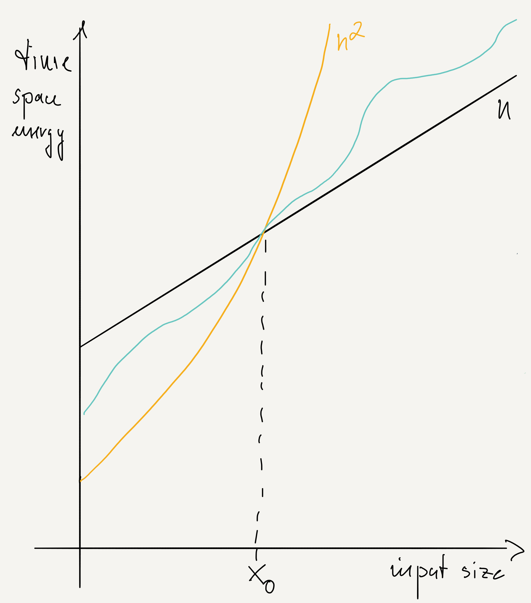

The graph shows the actual performance (y-axis) of a program running on some hardware, and inputs of increasing size (x-axis). Performance may be execution time, memory consumption, or any other metric related to the cost of running the program. Input size may be measured in bytes, for example.

What would it take to predict instead of measuring that performance? Well, we need two ingredients plus some ingenuity for abstraction. But first the idea. What if we could find a *lower* and an *upper bound* at least on the amount of *work*, whatever it is, involved in running a program on input of increasing size? That means we need a metric for measuring amount of work. How about the number of *steps* involved in getting the work done? For example, the above performance graph shows that running the program takes at least as many steps *n* and at most as many steps *n^2^* for all inputs that are at least of size *n > n_0* where *n* is the number of bytes encoding the input. In that case, we also say that the algorithmic complexity of the program is *n square*, and no less than *linear in n*, where *n* is the size of the input. By the way, *n_0* is there because it allows us to ignore the *cost* of running programs on small inputs which may anyway be irrelevant or too hard to predict. In other words, in our performance prediction we care about *asymptotic growth*, that is, by how fast the amount of work involved in running a program increases as we are increasing the amount of information fed into the program to very large inputs!

Once we are able to do all that we can compare programs and, in fact, the algorithms they implement in terms of their algorithmic complexity, that is, predicted performance for all inputs, independently of how they are implemented and run on just some input. This is very important! Consider the following algorithmic complexity graph:


It shows the most important types of algorithmic complexity which help us categorize algorithms. Here, the best is *constant* complexity denoted *O(1)* where performance is independent of input size, and the worst is *exponential* complexity denoted *O(2^n^)* where cost grows exponentially in input size. In between are *logarithmic* complexity denoted *O(log n)*, then *linear* complexity *O(n)*, and finally *square* complexity denoted *O(n^2^)*. The latter two generalize to *polynomial* complexity if the exponent may be any constant greater than zero such as *cubic* complexity denoted *O(n^3^)* and so on. Lots of other choices are possible too, including worse than exponential and in between logarithmic and linear.

Also, logarithmic growth is the inverse of exponential growth. The cost of running an algorithm with exponential complexity at least *doubles* with each increment in input size whereas seeing an increment in the cost of running an algorithm with logarithmic complexity requires at least *doubling* the input size. Exponential growth is very fast, especially on larger inputs. Logarithmic growth is very slow, again, especially on larger inputs. Finally, the *O* above is called *Big O* and stands for *Ordnung*, the German word for order. Big O represents upper bounds on complexity while the Greek letter *Omega* called *Big Omega*, not shown here, represents lower bounds.

> Time and space complexity

Okay, again, what does it take to be able to do all that? The first ingredient is an assumption on what exactly a *step of work* is. We need to find a *constant* relationship between step and time, or step and space, or even step and energy. Algorithmic complexity typically refers to *time complexity* by associating a single step of work with a single machine instruction assuming that executing a machine instruction takes constant time. Thus understanding algorithmic complexity requires understanding some machine model, just like the one we introduced here. Also, algorithmic complexity may refer to *space complexity* by associating a single step of work with a constant amount of memory, say, one byte. Understanding that requires understanding a memory model, again, just like the one we introduced here.

> Big-O notation

The second ingredient is the Big-O and Big-Omega notation. For example, *O(n)* actually represents *all* functions that *asymptotically* grow slower than or equal to *any* linear function *n* times some constant factor *k*, and not just *n*. In other words, as mentioned above, Big-O notation serves as upper bound on complexity. Symmetrically, Big-Omega notation represents all functions that *asymptotically* grow faster than or equal to the given function times some constant factor *k*, and therefore serves as lower bound. There is also *Big-Theta* notation using the Greek letter *Theta* which represents the complexity of algorithms whose upper and lower bounds are known to be the same.

> Constant factors

However, keep in mind that the constant factors *k* in Big-O and Big-Omega notation may very well play an important role in actual performance, at least on smaller inputs. Consider the following performance graph:

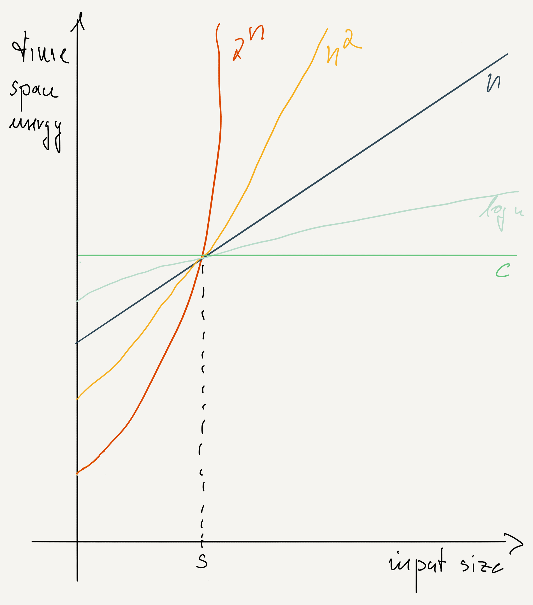

Suddenly, the world seems to be upside down. Up to input sizes of *s_0*, the program with exponential complexity is in fact the fastest program while the program with constant complexity is the slowest, with all others in between. The lesson to be learned here is that if there are algorithms with different algorithmic complexity that solve the same problem, the algorithm with the best complexity may not always be the best choice. That also depends on the workload, that is, the input size that the program will be running on in practice. Nevertheless, algorithmic complexity is an important tool for abstracting code into a simple formula that captures a key property. In the programming and computing chapters we hear more about how to come up with the algorithmic complexity of an algorithm.

> Two ways to make things faster, really faster

Algorithmic complexity holds the key to make things faster, and by that we mean fundamentally faster, not just by a constant factor but in terms of, well, algorithmic complexity. There are only two ways which may be combined as well. Firstly, we may be able to improve algorithms in such a way that they get better upper and lower bounds, sometimes at the expense of space complexity or vice versa but not necessarily. A lot of computer scientists are doing just that. Secondly, we may be able to invent new hardware that can perform in a single step a non-constant amount of work of our old hardware. While this may not be possible in general for all types of algorithms, it may still be possible for some, potentially enabling entirely new applications. Quantum computers are a promising example of that.

> Virtualization

While less ambitious, improving constant factors in hardware and software performance is still very important and may also be extremely difficult. Depending on the improvement, even new applications are possible as well. Try the following in your terminal:

```bash
./selfie -c selfie.c -o selfie.m
```

followed by:

```bash
./selfie -l selfie.m -m 2 -l selfie.m -m 1
```

or, equivalently, just try:

```bash
make emu
```

This *self-executes* `mipster` by running a `mipster` instance, say, *U* on another `mipster` instance, say, *H*, just to run selfie on *U* without console arguments making selfie print its synopsis. After self-compilation, *self-execution* is the second type of self-referentiality in selfie. Here, we first instruct selfie to *load* its own RISC-U code in `selfie.m` using the `-l selfie.m` option and then start *H* using the `-m 2` option to execute `selfie.m`. Next, we have `selfie.m` running on *H* load itself and then start *U* on *H* using the `-m 1` option to execute itself. Finally, `selfie.m` on *U* prints the synopsis of selfie. The relevant output is:

```
...
synopsis: selfie.m { -c { source } | -o binary | ( -s | -S ) assembly | -l binary } [ ( -m | -d | -r | -y ) 0-4096 ... ]
...
selfie.m: selfie terminating 64-bit RISC-U binary selfie.m with exit code 0
...
selfie.m: summary: 60251 executed instructions [22.32% nops]
selfie.m:          0.46KB peak stack size
selfie.m:          0.00MB allocated in 5 mallocs
selfie.m:          0.00MB(100.00% of 0.00MB) actually accessed
selfie.m:          0.20MB(20.31% of 1MB) mapped memory
...
./selfie: selfie terminating 64-bit RISC-U binary selfie.m with exit code 0
...
./selfie: summary: 166934931 executed instructions [17.81% nops]
./selfie:          0.90KB peak stack size
./selfie:          2.91MB allocated in 26 mallocs
./selfie:          2.10MB(72.25% of 2.91MB) actually accessed
./selfie:          2.30MB(115.24% of 2MB) mapped memory
...
```

Selfie running on `mipster` instance *U* took 60,251 RISC-U instructions and 0.20MB memory to print its synopsis. We have seen those numbers before. But then check this out. Mipster instance *H* took 166,934,931 RISC-U instructions and 2.30MB memory to run *U*. This means that, on average, *H* executed around 2,771 instructions just so that *U* executes a single instruction. In other words, `mipster` takes, at least on this workload, on average around 2,771 RISC-U instructions to implement a single RISC-U instruction, and an additional 2.10MB of memory for the whole run. Have you noticed how slow the synopsis is actually printed on your console? That is because execution is slowed down by a factor of 2,771.

What if we stack even more `mipster` instances onto each other just to see what happens? On my laptop, I ran three `mipster` instances, calling the third `mipster` instance *S*, assuming that *S* runs in between `mipster` instances *H* and *U*, and allocating 4MB rather than 2MB of physical memory to *H*:

```bash
./selfie -l selfie.m -m 4 -l selfie.m -m 2 -l selfie.m -m 1
```

This took a few hours to complete, as opposed to a few seconds for just the two `mipster` instances with `make emu`. In fact, this time, `mipster` instance *H* executed 380,176,379,307 RISC-U instructions to run both *S* and *U*. Looks like with each `mipster` instance the number of executed instructions increases by three orders of magnitude, here from thousands to millions to billions of instructions. This is a beautiful example of exponential growth, in this case in the number of `mipster` instances, and even if we optimized `mipster` such that executing a single instruction would take only two instructions there would be exponential growth.

But how is this relevant in practice? Well, there is a reason why we called the three `mipster` instances *H*, *S*, and *U*. Suppose *H* represents *hardware*, an actual RISC-U processor, and *U* represents a *user* program. Yet we do not want *U* running directly on hardware but need an *operating system* *S* in between *H* and *U* so that we can eventually run more user programs than just *U*, all sharing *H*. However, we certainly do not want the execution of a user program to slow down by three orders of magnitude. Turns out it is possible to push the overhead even below a factor of two! Just try the following:

```bash
./selfie -l selfie.m -m 2 -l selfie.m -y 1 -l selfie.m -m 1
```

or, equivalently:

```bash
make os
```

The relevant output is:

```
...
synopsis: selfie.m { -c { source } | -o binary | ( -s | -S ) assembly | -l binary } [ ( -m | -d | -r | -y ) 0-4096 ... ]
...
selfie.m: selfie terminating 64-bit RISC-U binary selfie.m with exit code 0
...
selfie.m: summary: 60251 executed instructions [22.32% nops]
selfie.m:          0.46KB peak stack size
selfie.m:          0.00MB allocated in 5 mallocs
selfie.m:          0.00MB(100.00% of 0.00MB) actually accessed
selfie.m:          0.20MB(20.31% of 1MB) mapped memory
...
selfie.m: selfie terminating 64-bit RISC-U binary selfie.m with exit code 0
...
./selfie: selfie terminating 64-bit RISC-U binary selfie.m with exit code 0
...
./selfie: summary: 212522027 executed instructions [18.52% nops]
./selfie:          0.90KB peak stack size
./selfie:          4.91MB allocated in 28 mallocs
./selfie:          2.89MB(58.82% of 4.91MB) actually accessed
./selfie:          3.10MB(155.27% of 2MB) mapped memory
...
```

Now we are back from billions to millions of instructions. This time *H* took only 212,522,027 RISC-U instructions to run both *S* and *U*, compared to 166,934,931 RISC-U instructions to run just *U*. This is a factor of around 1.27 instructions for each instruction of *U*, even though *S* runs in between *H* and *U*. How is this possible?

The key observation is that *S* is RISC-U code that executes RISC-U code, that is, the RISC-U code of *U* in this case. But if *H* can execute the RISC-U code of *S*, it can also execute the RISC-U code of *U*, effectively bypassing *S*. The option `-y 1` in the above invocation of selfie does exactly that. Instead of launching a `mipster` instance, it creates a `hypster` instance for *S* which, similar to a `mipster` instance, executes *U*, yet not by interpretation but by instructing *H* to execute *U* on its behalf, through something called a *context switch*. The factor 1.28 overhead comes from context switching and may become even less if *U* were to run longer amortizing bootstrapping cost even more.

We say that `hypster` *hosts* the execution of RISC-U code in a *virtual machine* which is, for the executed code, indistinguishable from the real machine except for performance. Hypster is inspired by the notion of a *hypervisor* hence the name. Virtualization makes hardware *soft* while maintaining most of its performance. Suddenly, we can have as many virtual machines as there is time, space, and energy, even if we only have one real machine. Virtualization is a fascinating concept but it takes time and effort to understand it. We come back to it in the last chapter.

### Life

The machine and its code is a concept that has amazed me for a long time. In principle, a computer and its machine language are simple artifacts. It only took us one chapter to introduce them even in quite some detail using a realistic yet representative model. While the model is simple it is still as expressive as any other machine model. RISC-U is *universal* or *Turing-complete*, it can do anything any other computer can do. We only need instructions for initializing and accessing registers and memory, for performing elementary arithmetic, and for controlling program flow. Everything a computer does can be expressed in such terms. Extending RISC-U with other RISC-V instructions for better performance is not difficult and the subject of exercises in the next chapter.

However, my true fascination comes from something else and that is related to life. While the process of developing code can be extremely slow and tedious and even nerve wrecking sometimes, especially when writing machine code, the execution of code is not because that is done by a machine, not me. That moment when running some new code that does something I cannot or do not want to do by hand is like magic. It is as if the code comes alive. Coding is really about automating something important in life that I have to do but cannot or do not want to do so that I can do something I want to do, like coding. An important side effect of coding is that I am creating a well-defined description of how to automate something that others can read, use, extend, and improve.

And this is where the next chapter comes in. Coding in machine code is tedious and errorprone and thus does not *scale* in complexity. If you would like the machine do something complex we need to raise the level of abstraction and then use tools, rather than our "hands", as in any other engineering discipline, that help us construct large amounts of machine code that actually work. For this purpose, computer scientists invented high-level programming languages. The next chapter is about that.

### Recommended Readings

> Computer Architecture: A Quantitative Approach by John L. Hennessy and David A. Patterson

We already mentioned this book but since it fits here as well we recommend it again. This is seminal work on computer architecture that belongs in any computer science library. Make sure to get the latest edition that features the machine model ([RISC-V](https://riscv.org)) behind our RISC-U model.

> Introduction to Algorithms by Thomas H. Cormen, Charles E. Leiserson, Ronald L. Rivest, and Clifford Stein

This is the default choice when it comes to algorithms and data structures. If algorithmic complexity is something that captured your imagination follow up with this book.

## Programming

Almost all code today is written in high-level programming languages. There are many languages to choose from and, for better or worse, there are new languages being developed all the time. Also, modern languages usually come with a whole ecosystem of libraries and tools that play an important role in addition to the language itself. Libraries are collections of code, often written by experts, for others to use. Tools are compilers, interpreters, debuggers, and so on. Selfie includes simple but realistic versions of a code library and tools that you can actually understand in full detail.

While programming languages might differ in their ecosystems, they typically share some basic language concepts that we introduce and focus on here. We do that in a subset of the programming language C called C\* which we specifically designed for this purpose. C\* ignores many of the more recently introduced innovations in programming languages. However, there are plenty of books available on the latest in programming languages, see the recommended readings at the end of this chapter.

Programming languages are typically designed at least for an *application area* and possibly also a *class of hardware*. We say a language X is good for application Y on machine Z. How so? When asking students about the motivation to use a particular programming language, I often hear that it makes coding "easier" for them. While this sounds reasonable the statement remains vague and hard to measure. But there is something deeper that helps us with our ultimate goal of enabling you to learn any programming language you like, not just one. We show you the absolute basics of programming languages but also, most importantly, how to think about programming languages: what they are, how they work, and why they exist!

> Programming languages are formalisms, not languages, actually

A programming language is a formalism with syntax and semantics that are either formally defined explicitly, or implicitly defined through an implementation. The design of a programming language enables precise communication among humans as well as communication of humans with machines while an implementation facilitates actual deployment. Thus the design should be such that the language is easy to read and understand while an implementation should be correct and efficient. Design is subjective, implementation is objective. While we do explain certain design choices, our focus is on implementation. Why is that?

Suppose we would like to build a suspension bridge. What we essentially need, other than people and expertise, are two things: the components of the bridge (libraries) and cranes and trucks to put them together (tools). Ignoring the work that went into making the components, the bulk of the work is to prepare the ground and the components so that we can apply our tools to put everything in place. There is no way to do that without tools. High-level programming is like that. It prepares the ground (algorithms) and the components (libraries) so that our tools can be applied to put everything together in an implementation (machine code). This is the big picture to keep in mind.

High-level programming languages enable *scalability* of coding through libraries and tools, just like cranes and trucks enable us to build enormous structures such as a suspension bridge. The challenge of learning a programming language is thus not just learning the language but also what libraries and tools do and how to use them properly. In fact, it is usually easy to implement something in a language of which you only know a fraction of all its features as long as you know how to use its libraries and tools whereas the converse is not true! We therefore introduce basic concepts of programming languages not just by explaining their design but in particular by showing how they facilitate an actual implementation on the machine we introduced in the previous chapter.

> Problem versus Solution

While there have been many different ways to introduce people to programming, our approach is new and arguably quite different from all of them and thus risky but worth a shot simply because people have different backgrounds and there may be quite a few that can benefit from that. We introduce you to programming by introducing basic language elements, starting with the simplest and slowly making our way up to the more complex. At the same time we show you how each element is actually implemented in selfie using real code written in the language we introduce here. In short, you learn programming by example where each example illustrates how the meaning of a particular language element is actually created on the machine. Since we do that starting with the simplest elements and then moving towards the more complex, the code examples also increase in complexity, covering increasingly complex models of computation and algorithms, which show you how precisely defined problems are solved on a computer.

> First try to define the problem, and only then try to solve it, fail, refine the problem, try to solve it again, and so on until you succeed

This takes us to the two key challenges in programming education. The first is obvious: how to express your solution to a problem in a programming language. The second much less so: how to specify and understand the actual problem you are trying to solve. Only then you are able to check if your program is actually a proper solution. Students often rush to programming a solution to a problem before even understanding the problem. What happens then is that they typically go through multiple non-solutions that make them realize what the problem actually is. The underlying issue is that inexperienced people often tend to favor solutions rather than focus on the problem first. Focusing on solutions feels safer than not even knowing what the problem is that one should solve. Google, for example, gives you answers to a question you might have. But what if you do not even know what to ask? Google may be able to assist but ultimately even Google cannot solve that problem for you. The key role of a teacher is to ask the right questions so that the students have something meaningful to work on. Good teachers define interesting problems, bad teachers do not. Besides learning how to solve problems, the ultimate goal beyond that is to teach students how to ask the right questions themselves. This takes time and a lot of work. My advice is to focus on the questions you truly care about. The closer you get to your own actual interests the better and more unique the questions you will ask but, again, getting there is far from easy.

> Motivation is subjective, problems are objective

Another common mistake that many students and even some more experienced people make during presentations and in writing is that they talk about their solutions before the audience even understands what the problem is that they are trying to solve. Bad presentations usually go wrong already at the beginning when people mistake motivation for problem. Motivation to do something based on perceived importance is not a problem definition. Just say what you think the problem is you are trying to solve and leave the decision as to whether it is an interesting and important problem to the audience. You may help the audience make that decision but ultimately no one knows the future. Keep that in mind as we are going through the material. The advantage of our teaching approach here is that the problems for which we are trying to program solutions are well-defined and representative but have of course been solved quite some time ago and established as highly relevant in practice.

> Syntax versus Semantics

The first problem we focus on is how to make the machine read source code. Seeing that makes you realize how you actually read code as a human. The machine just mimics that albeit in a much more systematic mechanized fashion. Code written in a high-level programming language is just a sequence of characters usually encoded in UTF-8. We read from left to right and so does the machine. The challenge is to recognize as soon as possible into reading when we have seen something potentially meaningful such as an integer literal, an identifier, or even a whole procedure, or else something meaningless, that is, a sequence of characters that is not part of our language. In that case, we speak of a syntax error and reject the sequence as something that is not code in our language. In more abstract terms, the problem is thus to detect efficiently whether a given sequence of characters is in our language or not. In formal languages this is called a membership problem.

> Scanning and parsing handle syntax

The common solution is to read a sequence of characters on two different levels: firstly, on the level of individual *symbols* made up from sequences of characters such as integer literals and identifiers, and secondly, on the level of a sequence of symbols that ultimately constitutes a program. The first level is called *scanning*, the second *parsing*. A *scanner* detects symbols in a sequence of characters which are then handed over as a sequence of symbols to a *parser* which detects the program structure in that sequence. Scanning and parsing could be combined into one process but that complicates matters without much gain. In fact, keeping scanning and parsing separate simplifies later changes to character encodings other than UTF-8 and even different characters altogether. Think of using emojis in your programming language rather than characters. That just requires changing the scanner but not the parser.

> Code generation handles semantics

On a more abstract level, scanning and parsing is concerned with the *syntax* of a program but not its *semantics*. Well, syntactic structure does have an impact on semantics. Just think of using or not using parentheses in an arithmetic expression. So, the more accurate statement is that scanning is pure syntax while parsing already connects syntax with semantics but the full semantics of a program still needs to be established during or after parsing. In a compiler this is done by generating machine code that implements the semantics of a program based on its syntactic structure. Here another advice upfront is in order. Understanding and implementing semantics is usually orders of magnitude more complex than just handling syntax and quite a different problem to solve altogether. This is not a surprise when you think about it. Notation is usually vastly simpler to figure out than actually understanding what it means. I remember being scared of learning ancient Greek in high school. Yes, I am that old. To my surprise learning the Greek alphabet only took me a few days, followed by three years of misery learning how to read the Iliad in the original Greek. Later as computer science student, I also remember introductory compiler classes that spent a lot of time on syntax only to run out of time when it came to semantics. We do not want to repeat that mistake here. In fact, we introduce syntax and semantics of individual programming elements always in combination to see the full picture as early as possible.

Thus the second problem we focus on is how to make the compiler generate machine code. Here the parser of the selfie compiler does something remarkable. It generates machine code as soon as there is enough information to do so and as long as the already parsed sequence of symbols is syntactically correct. In other words, the parser does not parse the entire sequence first and then generates code. Instead, it really generates code as soon as possible, much like a simultaneous translator translating text from one language to another on the fly in real time. A compiler with a parser that does that is called a *single-pass* compiler. The advantage is that the compiler does not even need to store the whole program in memory which was important when computer memory was scarce. The disadvantage is that the program context that the compiler may consider at any time is limited preventing the compiler from performing advanced code optimization. Modern production compilers are therefore *multi-pass* compilers that first parse the whole program and represent its full syntactic structure in memory in something called a *syntax tree*. Then the compiler takes multiple passes over the syntax tree to analyze and optimize it before generating code. The selfie compiler does not do that for obvious reasons. We need to keep things simple.

> Compiler versus Interpreter

Scanner and parser of a compiler are referred to as the *frontend* of the compiler while the code generator is called the *backend*. Keeping both separate facilitates exchanging frontends and backends to support compilation of different combinations of source and machine languages in the same system. Modern production compilers do that by internally generating a source- and machine-independent *intermediate representation* (IR) first and only then generating actual machine code from the IR. Again, the selfie compiler does not do that but instead generates code from within its parser. Its tight coupling of frontend and backend makes supporting new combinations of source and machine languages difficult but we do not intend to do that with selfie anyway.

Code generation involves encoding machine instructions in the format that the target processor expects when decoding the instructions before executing them. A processor can be seen as interpreter of machine code with a frontend that scans the code generated by the backend of a compiler. We took the opportunity to demonstrate that by implementing encoding and decoding of machine instructions in selfie next to each other. In other words, the very backend of the selfie compiler is implemented next to the very frontend of `mipster`, the selfie emulator that implements a RISC-U processor for executing the code generated by the selfie compiler.

There is one important question that we should consider before moving on. Why do we compile source code to machine code and then have a processor interpret the generated code? We could also design and implement source code interpreters avoiding compilers altogether, right? The answer is yes, we could do that and it has in fact been done for many programming languages such as Python, for example. In essence, both compilation and interpretation have numerous advantages and disadvantages. First of all, a source code interpreter requires a scanner and parser just like a compiler. The real difference is in the immediate execution of source code instead of generating machine code. A drawback of source code interpretation is that it is usually slower than compiling the code first and then executing the generated code instead. However, modern source code interpreters often have compilers built in that internally generate machine code on demand instead of interpreting source code. The javascript interpreter in your web browser does that enabling advanced web applications such as gmail. Awesome, right? Well, for our purposes here, it is important to cover both compilation and interpretation as the two fundamental techniques for creating the semantics of programming and machine languages. We nevertheless only discuss compilation of source code here and interpretation of machine code, as already done in the machine chapter.

### Literals

Literals in programming languages are arguably the most basic programming element. They represent a value that remains the same, that is, *constant* throughout the execution of the program. C\* features three kinds of literals: integer literals in decimal notation such as `85`, character literals such `'H'`, and string literals such as `"Hello World!"`. They are called literals because the programmer really means them to be as they appear in the program, literally. In contrast, variable names, for example, are just names such as `x` or `y` or `i_am_a_variable`. Which name you pick is not important as long as you use the name consistently in all places where you would like to talk about that particular variable. So, `x` and `'x'` are very different things. By `x` you mean the variable `x` whereas by `'x'` you literally mean the character `x`.

In the following, we first focus on three different problems whose solutions enable us to have a machine distinguish, say, integer literals in decimal notation from anything that is not and even compute the numerical value they represent:

1. How do we define the sequences of characters that denote integer literals in decimal notation? This is a *specification* problem.
2. How do we model scanning, that is, the process of checking whether an arbitrary sequence of characters denotes an integer literal in decimal notation? This is a *modeling* problem.
3. How do we design and implement an algorithm that efficiently checks whether an arbitrary sequence of characters denotes an integer literal in decimal notation and, if it does, computes the numerical value represented by that sequence? This is an *implementation* problem.

#### Integer Literals

Next, we show how to solve each problem using integer literals as example. Later, when it comes to handling character and string literals, and all other programming elements thereafter, the theme repeats again and again, just less explicit: specification first, modeling second, implementation last.

#### Specification

We begin with the specification problem. We already saw before how to define all sequences of characters that denote integer literals in decimal notation using EBNF, that is, a *regular expression* in EBNF:

```ebnf
integer = digit { digit } .

digit = "0" | "1" | "2" | "3" | "4" | "5" | "6" | "7" | "8" | "9" .
```

That's it! Just recall that a regular expression is a grammar that can be denoted by a single EBNF production. Sure, there are two productions in our example, but you can easily substitute the two occurrences of the non-terminal `digit` in the first rule with the RHS of the second rule:

```ebnf
integer = ( "0"|"1"|"2"|"3"|"4"|"5"|"6"|"7"|"8"|"9" ) { "0"|"1"|"2"|"3"|"4"|"5"|"6"|"7"|"8"|"9" } .
```

Note that the parenthesis `(` and `)` around the first digit are necessary since the EBNF operator `|` for choice has lower precedence than the (invisible) EBNF operator for sequential composition.

#### Modeling

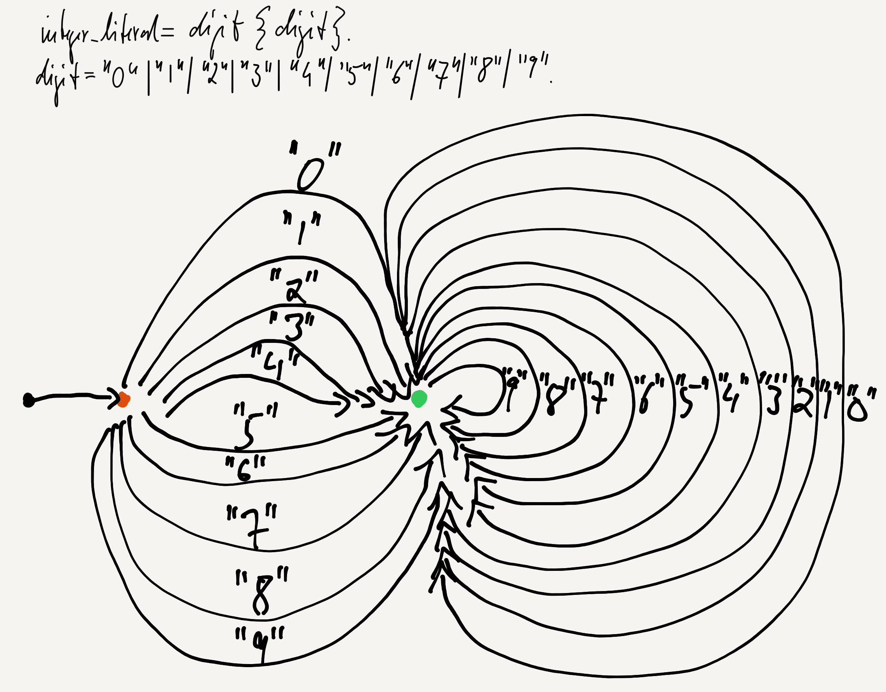

> Finite State Machines!

Next is the modeling problem. Modeling the process of checking whether a sequence of characters is in the language of a regular expression is traditionally done using a *finite state machine* (FSM) as shown in the above figure. We could also use mathematical notation to describe the FSM but prefer the quite common visual representation since it really shows nicely what is going on.

Here, the FSM has just two states: the red state is the *start state* and the green state is an *accepting state* of the FSM. Every FSM has exactly one start state and at least one or more accepting states. The start state could also be accepting but does not have to be. Then, there may also be any finite (!) number of states depicted in blue that are neither start nor accepting state, not here though in this example, simply because we do not need those here, but we do need them later. The important restriction is that any FSM only has a finite number of states in total hence the name.

The other important ingredient of an FSM are *state transitions* depicted by *labelled* arrows from one state to another. Here, the labels are the terminal symbols in our regular expression which all represent just a single character each. Depending on the application we could also use other types of labels. When it comes to parsing, we use terminal symbols that represent C\* symbols as labels, for example.

> Running a finite state machine

How do we run that FSM? Initially, the FSM is in the red start state. Moreover, assume that we are given an arbitrary sequence of characters that the FSM reads or in fact scans from left to right, one character at a time upon taking a state transition. For example, assume that we are given the following sequence of characters:

```
85
```

In this case, the FSM reads the character `8` first and transitions to the green accepting state across the state transition labelled `"8"`. Then, the FSM reads the character `5` and transitions from the green accepting state back to that state across the state transition labelled `"5"`. But now what? Well, there is a third invisible *control* character at the end of every sequence called `end of file` or `EOF` that indicates the actual end of the sequence. The FSM does indeed read that character after the character `5` but then what? Now, this is important. In this case, the FSM is in the green accepting state but there is no state transition labelled `"EOF"`. Whenever this happens, that is, the FSM reads a character but is in a state that does not have a state transition with that character as label, the FSM is done and terminates. What remains to be done by us is to check whether the FSM is in an accepting state or not at this point. If yes, the sequence of characters read so far is said to be *accepted* or, more precisely, the sequence is said to be in the language accepted by the FSM. If the FSM is not in an accepting state, then the sequence of characters read so far is not accepted. For example, suppose we are given the following sequence of characters:

```
;85
```

In this case, the FSM reads the character `;` first but is unable to transition from the red start state because there is no state transition labelled `";"`. Thus the FSM terminates and remains in the *non-accepting* red start state. The sequence of characters `;85` is therefore not accepted by the FSM which is of course what we intended the FSM to do. We could now use some other FSM to see if it accepts `;85` or not. In other words, the character `;` and all other characters to the right of `;` may still be read by another FSM because `;` has not yet enabled a state transition. How about the following sequence?

```
85;
```

In this case, the prefix `85` of `85;` is indeed accepted by our FSM while the character `;` only made the FSM terminate. Thus `;` and the control character `EOF` still remain available for reading by some other FSM.

> Regular expressions equal finite state machines, except in size...

Time to reflect on what we have seen so far. First of all, regular expressions and finite state machines are excellent concepts for specifying and modeling regular languages such as the language of decimal numbers but also the language of identifiers as we see further below. There is one property that stands out: regular expressions and finite state machines are equivalent in their expressive power! This means that we can turn any regular expression into a finite state machine that accepts the same language as the regular expression specifies, and vice versa, we can turn any finite state machine into a regular expression that specifies the same language as the machine accepts. Both ways, the conversion can be done systematically in the sense that there are algorithms, even implemented in some widely used software development tools, to do that for us.

> ... possibly even exponentially different in size

However, there are regular expressions that can only be described by finite state machines that are exponentially larger than the regular expressions, and again vice versa. But, when converting a regular expression into a finite state machine, the exponential blowup in size can be avoided if the finite state machine may be *non-deterministic*. Interestingly, not the other way around though. There are even *deterministic* FSM that can only be converted into regular expressions that are exponentially larger than the machines.

> Non-deterministic finite automata!

A non-deterministic FSM or *non-deterministic finite automaton* (NFA) may contain one or more states where each of these states has more than one state transition with the same label but transitioning to different states, giving the machine a non-deterministic choice of which state transition to follow. A *deterministic finite automaton* (DFA), on the other hand, is a deterministic FSM where all state transitions of each state of the FSM have different labels. Well, good news for us, the regular expressions we need here all translate into deterministic FSMs that are asymptotically of the same size as the regular expressions. This is not by accident but actually intended: we want our FSMs to be small and deterministic so that for every accepted sequence of characters there is exactly one deterministic sequence of state transitions to accept it, not two or maybe even more. The reason is that the sequence of state transitions an FSM takes when reading a sequence of characters may have an impact on the semantics of the sequence of characters. This is not a problem here but it is a problem in other parts of the C\* grammar as we show below.

Computer science professors including me nevertheless love to keep talking about this kind of theoretical material. As students we were asked to prove the equivalence in expressive power of regular expressions and finite state machines, and study the conversion algorithms and their algorithmic complexity. For some this was horror, especially since quite often little to no motivation was given in the "good" old days. Well, those days are over. You already saw plenty of motivation right here and will see how powerful things get below. If you are interested in following up consider the recommended readings. It will definitely sharpen your mind even further.

Before proceeding to the third problem of how to design and implement an algorithm for our regular expression and FSM, we still need to fix a bug in the regular expression for integer literals that we saw earlier in the language chapter. Recall that the language of the regular expression above includes not just the sequence of a single digit `0` but also any sequence of characters that begins with any number of digits `0` such as `000` or `007`, for example. But it is easy to fix that:

```ebnf
integer = "0" | non_zero_digit { digit } .

non_zero_digit = "1" | "2" | "3" | "4" | "5" | "6" | "7" | "8" | "9" .

digit = "0" | non_zero_digit .
```

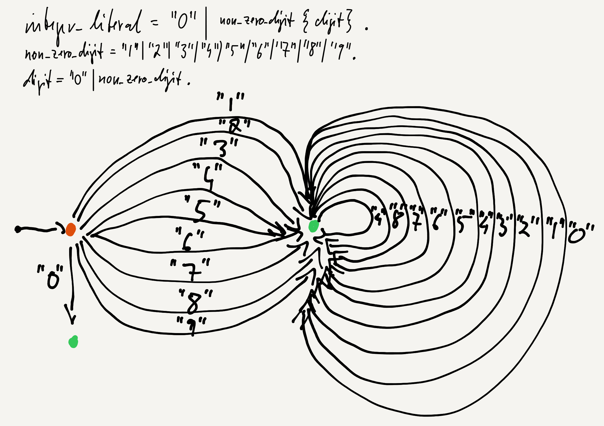

The finite state machine that matches the correct regular expression is shown above. Here, we only need to divert the state transition labelled `"0"` to a new accepting state that does not have any further state transitions. The rest stays the same. We have nevertheless not included the fix in the C\* grammar to keep it as an introductory exercise for students.

#### Implementation

Let us move on to the third problem of designing and implementing an algorithm for efficiently scanning integer literals in decimal notation and computing the numerical value they represent. You probably notice already that the amount of detail involved in the specification, modeling, and implementation problems not only increases inversely proportional to the level of abstraction but also seemingly exponential. Little detail in specification, more detail in modeling, and a lot of detail in implementation. Just take a look at what follows next. Abstraction really does help in managing complexity.

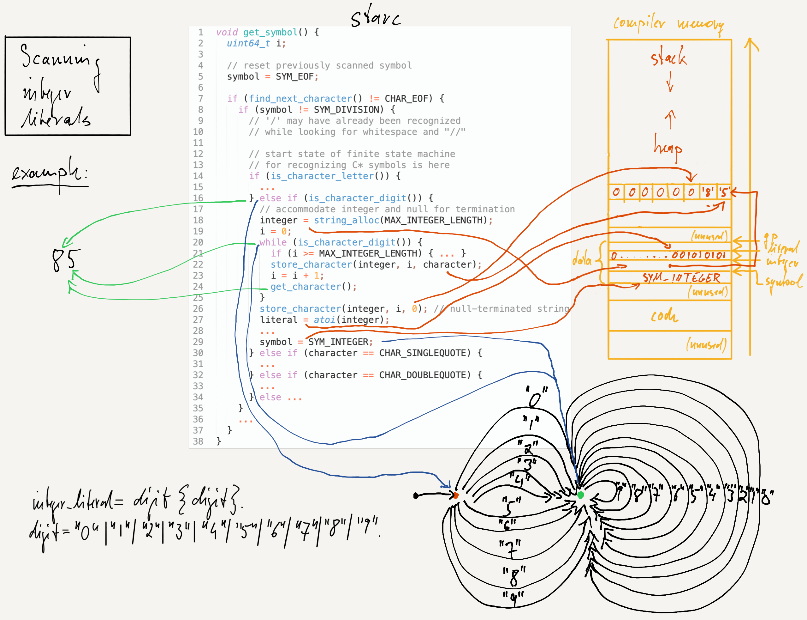

The solution to the implementation problem can be found in selfie in a procedure called `get_symbol`. That procedure does in fact implement the whole scanner of the selfie compiler. The above figure only shows the part of the procedure that scans integer literals. As example, we again use the sequence of characters `85` as input to the code shown on the left. The code itself is shown in the middle. Moreover, the state of main memory after the code finished accepting `85` is shown to the right. For reference, the (correct) regular expression and (correct) finite state machine are also there.

One more thing: there is also a shorter version of the code shown on the left that only implements the FSM without the code for computing numerical values. This version just handles syntax but not semantics. We get to that further below.

> Variables: the what?

First up, there are four global variables involved in the code called `character`, `symbol`, `integer`, and `literal`. The state of main memory in the above figure shows the values of these variables except for `character` which contains the ASCII code of the character that has most recently been read. This variable is the input to the algorithm while the other three variables are the output. The global variable `symbol` indicates which symbol has most recently been scanned. As we see below, `symbol` is read by the parser to check which symbol the scanner has most recently accepted. In other words, `symbol` is to the parser what `character` is to the scanner. If the algorithm accepts the scanned sequence of characters as an integer literal, the algorithm sets the value of `symbol` in its last statement to the value of another global variable called `SYM_INTEGER` which is defined elsewhere. For lack of constants in C\*, we use a *code convention* here where all-capitalized variables are treated as constants by never changing their value after initialization. As always you can search the selfie source code for code not shown here. Finally, the global variable `integer` is a pointer to the sequence of characters that has most recently been accepted as integer literal while the global variable `literal` contains the actual numerical value represented by the sequence of characters `integer` points to. There is also a local variable called `i` for *index* that we use to keep track of where in memory to store the most recently read `character`.

Time for reflection. Have you noticed that we have already introduced the algorithm just by talking about the variables involved in the algorithm but not the code? Well, we have talked about *what* the algorithm does but not *how*. The what is an abstraction of the how. Talking about the variables and ultimately the data involved in an algorithm explains what it does without saying how, which in turn helps in understanding it. Moreover, it also helps when developing code. Try to think about the data an algorithm needs to work with and then figure out how to represent that data in variables, before you even get to implementing the code of the algorithm. This may be an iterative process where you realize during coding that you need more or other variables, so you do that, and then go back to coding, and so on.

We should mention that there are other programming languages than C and C\* that follow the paradigm of *functional programming* which allows programmers to develop even the actual code in a *functional* rather than *imperative* manner such that the code also appears to talk about the what rather than the how. You may want to look into that as well. In computer science, there are people who sometimes even passionately believe in one paradigm over the other. The truth as so often is likely to lie somewhere in between. An interesting modern and advanced programming language that aims at leveraging the best of imperative and functional programming is Rust. We use that language in research projects inspired by selfie. Ultimately, however, all source code needs to be either compiled or interpreted to execute on a machine. Seeing how this works is key to developing not only correct but also efficient code.

> Code: the how!

Let us take a look at the code shown in the above figure. It first checks if the value of `character` is a letter. In that case, the scanner would be looking for an identifier. We deal with that case below. If not, the code checks if the value of `character` is a digit. Say, per our example the value of `character` is equal to `8` as indicated by the green line, so yes. The `if` statement, or rather the `if` condition evaluating to true, takes us to the red start state of our FSM as indicated by the blue line. The following `if` statement checks if the value of `character` is equal to `'0'`. If yes, we are done.

Computing the numerical value of `'0'` is trivial in this case. It is just `0` as in `literal = 0`. Notice the difference between `'0'` and `0`. The former is the ASCII code of `0` which happens to be the decimal value `48`, not the decimal value `0`. This is our first and most basic example of the difference of syntax and semantics! The character `'0'` is syntax, the value `0` is semantics, that is, the value `0` is what the character `'0'` actually means.

Let us focus for a moment on the version of the code shown on the left that implements the FSM without computing numerical values. Hard to believe but that version is all it takes to do that. We simply removed all code shown in the middle of the figure that deals with computing numerical values. The difference in code size demonstrates the difference in difficulty when dealing with syntax versus semantics. Handling syntax is usually vastly simpler than handling semantics.

Notice that the `if (character == '0')` statement implements the `|` operator in the EBNF production `integer = "0" | non_zero_digit { digit }`, and the transition to the first accepting state that has no further transitions in the FSM versus the transitions to the second accepting state with transitions to itself. The `while` loop implements the `{ }` operator in the production, and all transitions to the second accepting state in the FSM. The loop simply scans characters until it reads a character that is not a digit. You are right, the correspondence between code, regular expression, and FSM is striking. Well, it is even systematic to the extent that it can be automated in development tools that convert one representation to another, as we mentioned before.

> Preconditions, postconditions, and invariants!

The important item here are the calls to `get_character` which is a procedure that reads the next character and stores it in `character`, to prepare for examining the next character, in the current invocation of the scanner (the call in the loop body), and even in subsequent invocations of the scanner (the call in the `if` body and the final call in the loop body whenever the loop terminates). Thereby, the scanner maintains something very important, a property known as *invariant*: `character` always contains the character that is to be scanned next. In other words, upon examining `character` and even upon invoking the scanner, we assume the invariant holds as a *precondition*. This even means that upon invoking the scanner for the first time, we actually have to call `get_character` once before that to make that assumption true. Try finding that call in the selfie code!

Notice that the invariant is temporarily violated while the scanner is examining `character` because then `character` contains the currently scanned character rather than the next character to scan, until the scanner calls `get_character` again, reestablishing the invariant. In other words, after examining `character`, the scanner needs to make sure that the invariant holds again as a *postcondition* by calling `get_character`, even before terminating to prepare for the next invocation of the scanner. This may look like nitpicking but reasoning in terms of invariants as well as pre- and postconditions helps tremendeously when developing code in imperative programming languages.

Every time you would like to write down a statement in, say, C\* think of which property of the program state needs to hold before executing the statement so that executing the statement works as intended. This is the precondition. And then think of which property of the program state holds after executing the statement, assuming the precondition is true. This is the postcondition which becomes the precondition for the next statement and so on. Invariants apply to iterative and recursive code, that is, to loops, as we already saw, and recursive procedures, which here are the parser procedures that keep calling the scanner, as we see further below. In short, an invariant is a property that is both pre- and postcondition of a loop or recursive procedure. When reasoning about loops and recursive procedures, the key question is what exactly the invariants of those loops and recursive procedures are, which is usually harder to do than just figuring out pre- and postconditions of sequential code.

> Finite state machines: regularly forgetful!

Before going back to the full version of the code, let us have another look at finite state machines. Why are they so cool? The first time I saw an FSM, probably in my first semester as computer science student, I really asked myself why the professor was paying so much attention to that topic. I could not figure it out. To me finite state machines looked like a rather limited model of computation that could not do much. Years later, being a professor myself, I discovered their value for me. Sure, finite state machines are efficient in terms of algorithmic complexity. An FSM checks whether a given sequence of characters is in the language specified by a regular expression in linear time in the length of the sequence. Each state transition makes immediate progress by consuming exactly one item from the given sequence. But that is not all.

The property that convinced me is how code that implements an FSM deals with memory. The short answer is: it really does not do anything about memory! Imagine, an FSM can handle any sequence of characters no matter how long it is, and still never run out of memory. Why is that? Well, an FSM can only be in finitely many states, say, it has *n* states and can therefore only be in *n* states. According to what is known as the *pigeonhole principle*, the FSM is always bound to end up in a state that it was in before after taking at most *n* state transitions. Whenever the FSM transitions to a state it was in before, the FSM forgets what happened in between. It simply does not know how it got there. I say that finite state machines are *regularly forgetful*. Some may see that as weakness but engineers like me see that as strength.

An FSM manages memory automatically, simply by taking state transitions. Its only memory are its states, and those are remembered in the code simply by being at a particular statement during execution. There is no need to allocate and deallocate any other memory. This is great because allocating and deallocating memory is not easy at all as we see below. In short, finite state machines are a method for automatic memory management.

So, what about the weakness of finite state machines? Well, an FSM can only deal with regular languages. But what does that really mean? Let me give you an example. An FSM cannot count in the sense that it cannot check if an arbitrary sequence of characters contains, for example, exactly as many opening parentheses `(` as closing parentheses `)`. This implies that an FSM cannot check whether the sequence is, say, a proper arithmetic expression containing parentheses. But we do need that capability to parse C\* yet not in the scanner, only in the parser. We explain below what exactly we need and why to obtain that capability. Hint: a stack!

> What exactly is not regular? Try pumping lemmas!

A fundamental question in computer science is whether a formal language can be characterized by a regular expression, that is, whether it is regular and can thus be recognized by an FSM. But how do we prove that some languages are *not* regular? This does not seem to be that easy. Computer scientists use what is known as a *pumping lemma*, for regular languages, and even context-free languages. Intuitively, a pumping lemma shows how to apply the pigeonhole principle to a formal language by saying that, if a given sequence of characters of some minimal length is in the language, then there are also an infinite number of longer versions of that sequence in the language in which some parts have been duplicated or *pumped* any number of times, which corresponds to an FSM revisiting, after taking finitely many state transitions, the same state again and again. As students, professors tortured us with those pumping lemmas until we finally understood them. Consider doing the same by following up with the recommended readings. It is worth it!

> How not to be forgetful but still be regular

Let us go back to the `if (character == '0')` statement in the full version of the code. In our example, the value of `character` is equal to `'8'` which takes us to the `else` body. We now discuss the code that deals with computing the numerical value of an integer literal. To do so the scanner, unlike the FSM it implements, does actually not forget the characters that form an integer literal but instead stores them on the heap to prepare computing the numerical value they represent.

The first statement calls the procedure `string_alloc` to allocate 20+1 bytes of zeroed memory on the heap, that is, memory that is initialized to zero, to accommodate a string of up to 20 characters plus its null termination (`MAX_INTEGER_LENGTH` is initialized to `20`). That string can represent even the largest unsigned integer literal selfie can handle, which is 2^64^-1 or 18446744073709551615 in decimal, a number with 20 digits. Interestingly, this limitation neither shows up in the regular expression nor the FSM. Both impose no bound on the length of accepted sequences of characters.

Well, we could implement support of integer literals whose length in decimal notation would only be bounded by the available memory of the machine. In fact, there are programming languages and in particular libraries that do that but it is unnecessarily complex to do that here. So, the reality is that an implementation, ours included, is often just an approximation of an idealistic specification and model.

The procedure `string_alloc` returns a pointer into the heap where there is guaranteed storage for at least 20+1 bytes. In fact, the amount of storage is always rounded up to machine word size (8 bytes on 64-bit machines, 4 bytes on 32-bit machines), so to 24 bytes here. The pointer is stored in the global variable `integer`. The above figure shows the resulting memory layout on the right.

Next, the local variable `i` is initialized to `0`. As mentioned before, we use `i` to keep track of where in memory to store the next character. Then there is the `while` loop that scans characters as long as they are digits. In our example, the value of `character` is `'8'` upon entering the loop body for the first time. The following nested `if` statements check if we have reached the limit of 20 digits. If not, we are good and store the value of `character` in memory where the value of `integer` plus the value of `i` points to, using the `store_character` procedure. Doing that properly is not so easy here because we can only store a whole machine word at a time, not individual characters, that is, bytes. Check out the code of `store_character` to see how it is done. This is advanced code which you may have to revisit as you gain more experience.

The two last statements in the loop body increment the value of `i` by `1` and get the next character to prepare for scanning it in the next iteration of the loop. As soon as the loop condition evaluates to false, however, meaning the value of `character` is not a digit, the loop terminates. In our example, this happens when both `'8'` and `'5'` have been scanned. The situation in memory is now that `'8'` is stored in memory where the value of `integer` points to, followed by `'5'` where the value of `integer` plus `1` points to. The only thing left to do so that `integer` refers to a proper string is to terminate it by storing the value `0`, not `'0'`, in memory at the value of `integer` plus `2` right after where `'5'` is stored. This is done by the call to the `store_character` procedure right after the loop body. At this point the value of `i` is indeed `2`. Please confirm that for yourself. But wait, you may still argue that the memory has been zeroed, that is, initialized to zero, so terminating the string is not necessary. True! We do it anyway just to be nice.

The only remaining job is to compute the numerical value represented by the string `integer` refers to. Before we look at the code, consider a nice little exercise that we can do together: determine the actual value of the 64-bit machine word in memory that contains both characters in that order. Remember, the machine has no concept of `'8'` and `'5'`, only of bits. So, the word in memory is:

`0 0 0 0 0 0 '5' '8'`

Let us determine its hexadecimal value first. For this purpose, we need to find out the ASCII code of both characters. According to the ASCII table `'8'` is `56` in decimal and thus `0x38` in hexadecimal, and `'5'` is `53` in decimal and thus `0x35` in hexadecimal. By the way, the ASCII encoding is done in such a way that you can determine the ASCII code of decimal digits just by remembering the ASCII code of `'0'` which is `48`. The ASCII code of any decimal digit `'d'` with `0 <= d <= 9` is then `'d' - '0'` which is `'d' - 48`. We use that trick below to compute numerical values of integer literals. Here, the machine word in hexadecimal with spacing for better readability is thus:

`0x00 00 00 00 00 00 35 38`

or `0x3538` for short which, written down in binary in 64 bits, is:

`0b00000000 00000000 00000000 00000000 00000000 00000000 00110101 00111000`

These bits are what is actually stored in the machine! Let us take a look at what these bits mean when interpreted as decimal number. Just calculate the decimal value of `0x3538` which is:

`13624`

So, the decimal number `13624` encodes the string `"85"`. Who would have thought? Why not just use `13624` then? Good question! We could interpret `13624` as representing the decimal value `85`. In this case, syntax and semantics of integer literals would be the same. Well, there are two drawbacks doing that related to time and space. Remember the information chapter? First of all, we would need more space, that is, more bits to encode integer literals, only by a constant factor, but this could still be a problem in practice. Yet the even more important drawback would be that we could not apply standard integer arithmetic in calculations but would need to do something more complicated and likely lose time in doing so. Therefore, computing numerical values of integer literals is worth it, especially since we only need to do it once when compiling code. Before we get to that though we still need to do one more round over the code we have seen so far.

> Error handling: printing errors, sure, but then to exit or not to exit?

Let us go back to the nested `if` statements that check if we have reached the limit of 20 digits. If yes, we need to deal with the situation. First up, we should report the error. This is done using the procedure `syntax_error_message` which in turn uses a procedure that is *builtin* into C and its dialects called `printf` which stands for *print formatted*. We explain that procedure as needed but leave it at that for now. There is another global variable here called `integer_is_signed` that we have ignored so far. It indicates whether a dash `-` has been scanned right before the integer literal. After reporting the error we do something rather lazy. We simply give up and exit, terminating compilation altogether, so not just the scanner but also the parser, and in fact the whole compiler around it. The `exit` procedure is another builtin procedure that you can call anywhere you like to exit *explicitly* with its sole parameter being returned as the *exit code* that we mentioned before, instead of tediously returning to the `main` procedure and exiting there *implicitly* without calling `exit`. In fact, the `exit` procedure provides a convenient way to prototype code whenever you do not want to deal with a problem but rather focus on something else first and only later come back and code a solution. In scanning and parsing, this is possible with virtually no limit to your imagination on what can be done. However, in the interest of simplicity we decided not to do that here. We do, however, continue parsing in other circumstances performing proper *error handling*, as shown later.

> Corner cases are hard

So, when exactly is the limit of scanning 20 digits reached? It is reached when the value of `i` is `20`, not `21`, since we started counting from `0`, not `1`, hence the comparison operator `>=`, not `>`. We could also just use `==` since the value of `i` is only increased in increments of `1` by the `i = i + 1` assignment. Using `>=` is just more robust in case we later change the code to increments other than `1`. Picking the wrong comparison operator is a common mistake. Picking the right one is often not easy because it involves considering not just all good cases (the value of `i` is between `0` and `19`) but also the bad *corner cases* such as here the condition when exactly the limit is reached (the value of `i` is `20`, not `21`). The check is important because otherwise the scanner could store characters in memory that is not guaranteed to be *safe* since we only allocated memory for 20 digits, not 21 digits. Memory beyond what we allocated could be used for other purposes. Sure, here the system actually allocated 24 bytes but we cannot rely on that. Systems other than selfie may only allocate exactly what we asked for.

> Unsafe memory access

*Unsafe* memory access often results in bugs that are extremely hard to find. It happens when you allocated either too little memory, accessed memory outside of the area of allocation, or even inside of the area if you deallocated it prematurely, as we see below. The programming language C and its dialects including C\* are infamous for this problem. Millions of lines of code have been and are still being developed in these languages where unsafe memory access has contributed to bugs that resulted in high cost and even critical failures. So, why not making that impossible in your programming language? Well, computer scientists did that. A prominent example is the programming language *Java* which is referred to as a *safe* programming language in which unsafe memory access is indeed impossible. What is the catch? Performance and access to hardware. Guaranteeing memory safety is very complex and usually comes at a cost in temporal and spatial performance, and makes it more difficult or even impossible to have access to advanced hardware features. C and its dialects are *systems languages* that provide programmers with great freedom to do almost anything at the expense of memory safety. There are also more recent developments in programming languages such as the programming language *Rust* where computer scientists try to maintain the performance of C and its dialects while giving programmers the choice of safe and unsafe memory access.

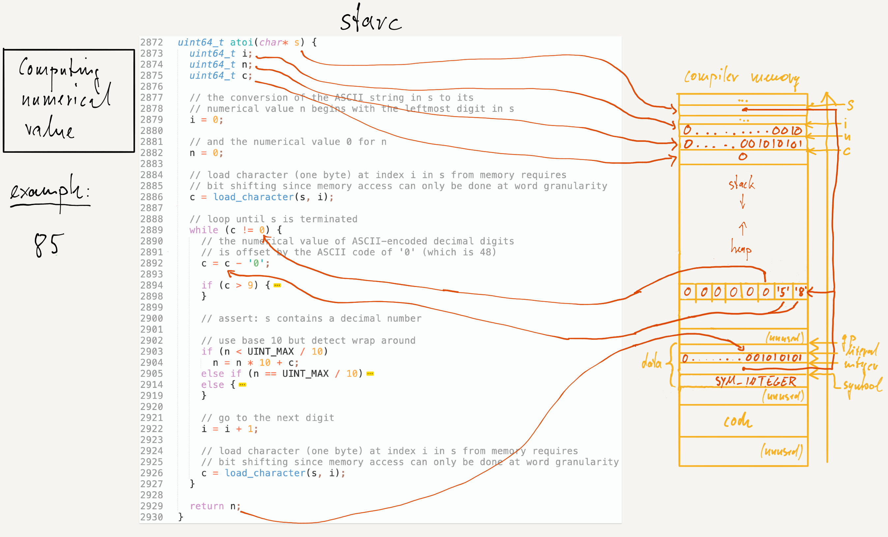

The final step of scanning integer literals is to compute their numerical value. The above figure shows the code in the middle, its input and output on the left, here `85` and `1010101`, respectively, and the state of memory when done on the right. Given a string of digits `s`, the rather famous procedure `atoi` computes the numerical value `n` that `s` represents. The name `atoi` stands for *ASCII to integer*. There is also a procedure called `itoa` that does the opposite for printing integer values, see the selfie source code for its implementation. In essence, `atoi` encodes `s` into `n`, and `itoa` decodes `n` back to `s`.

The scanner calls `atoi` on `integer` to compute the numerical value that the string to which the value of `integer` points to represents. The numerical value is then stored in the global variable `literal`. Communicating the string to `atoi` works by storing the value of `integer` on the stack. This is interesting because it avoids copying the string. The memory layout shown on the right of the above figure shows that. From then on, `atoi` refers to the string using the formal parameter `s`, not `integer`. Also, `atoi` allocates memory on the stack for storing its local variables `i`, `n`, and `c`. The variable `i` is again used as index, here into the string where the value of `s` points to. The variable `n`, as mentioned before, is used for storing the numerical value. The variable `c` stores the character from `s` at index `i` that is to be processed next. That character is loaded from memory using the `load_character` procedure which is the counterpart to the procedure `store_character` used in the scanner.

The `while` loop iterates over `s` until its termination. In each iteration, the value of `c` is *normalized* by `c = c - '0'` from ASCII code to the numerical value it actually represents. This is the semantics of individual digits! Ignoring all checks for validity and overflows, the most important statement of `atoi` is the assignment `n = n * 10 + c` which implements the semantics of hindu-arabic notation of decimal numbers, hence the factor `10`. If we were computing numerical values of binary numbers, for example, that factor would be `2`. The mathematical principle that `atoi` implements is called a *recurrence relation*. With our example of scanning `85` it works by computing the numerical value of `85` in sequence from the leftmost to the rightmost digit:

```c
n = 0
n = 0 * 10 + 8 = 8
n = 8 * 10 + 5 = 85
```

Since `85` is `1010101` in binary, `1010101` is the value being stored for `n` in memory, and eventually for `literal`, after `atoi` returned to the scanner. There is also code, not shown here, for handling unsigned integer overflows to make sure that `0 <= n <= UINT64_MAX` holds. Additionally, the scanner also checks signed integer overflows to make sure that `INT64_MIN <= -n <= 0` holds if a dash `-` has been scanned right before the integer literal.

> Scanning hexadecimal numbers!

It is time for your first exercise. Design and implement support of integer literals in hexadecimal notation in selfie. First, think about how to extend the C\* grammar and then modify the `grammar.md` file in the selfie repository accordingly. Do not forget to include the prefix `0x` for hexadecimal numbers. Then, think about how to extend the above FSM for decimal numbers to hexadecimal numbers. After that, make a plan on how to extend the code in `get_symbol` and `atoi`, and then implement your solution in `selfie.c`. To see if it works, run:

```bash
./grader/self.py hex-literal
```

When you are done with the exercise, we are ready to look into scanning character and string literals. Doing that provides an opportunity to look even closer at how to manage memory. This is important.

#### Memory Management

Looking back at how we implemented scanning of integer literals and computing their numerical value, there is one important thing that we could have done differently. We could have combined scanning characters and computing values into one procedure, thereby removing the need for allocating memory to store the scanned sequence of characters. That would be a pure implementation of a finite state machine.

> Separation of concerns

Why did we not do that? There are two reasons. Firstly, it enables *separation of concerns* by allowing us to keep scanning characters and computing values separate in the code. Secondly, it provides an efficient way for dealing with *big integers* that require more than 32 bits. Those cannot easily be loaded into CPU registers and are therefore better stored as is in the data segment of memory. Still having access to the scanned sequence of characters after scanning provides a convenient way to do that. We show how when it comes to parsing and emitting code for literals.

> Memory management is a real challenge

Why should we be concerned about allocating memory? Not remembering something that you do not need to remember to solve a problem makes everything simpler! The issue though is not so much about remembering something but actually how and in particular when to forget about it. Doing that requires knowing when you do not need the information anymore which in turn requires knowing the future. So, if you do not need to remember something you better do not. Conversely, if you believe you need to remember something you better have good reasons to do so.

Here is an example. Suppose you keep buying things that you store in your place. At some point, you need to make that decision of whether to throw something out or not, the latest when you run out of space. The additional issue is that the more you have the longer it takes to find the things you do not need anymore. As you accummulate more stuff you even have to revisit things you looked at before because your needs might have changed in the meantime. The same applies to computer memory.

> Static memory allocation

Here are ways to deal with that. On first sight the seemingly simplest way to allocate memory is to allocate a fixed amount of memory once and then just use that. This is called *static memory allocation*, as mentioned in the machine chapter, where *static* means at *compile time*. The advantage is that you do not need to worry about deallocating memory which happens automatically when the program terminates. The disadvantage is that the amount of statically allocated memory is fixed. This may be fine for some applications but certainly not for all. As soon as the amount of memory needed depends on the size of program input, we have a problem. For example, in a compiler you do not know how many integer literals are actually in the compiled code. However, there may still be parts of the processed information whose amount does not depend on the input. For those parts static memory allocation may be a good choice. Nevertheless, when prototyping code it is sometimes easier to allocate memory statically for everything just to see how to make things work, and only later change to more advanced *dynamic memory allocation* at *runtime*. Whenever the protoype has insufficient memory for an input, the code may simply report an error and quit.

#### Character Literals

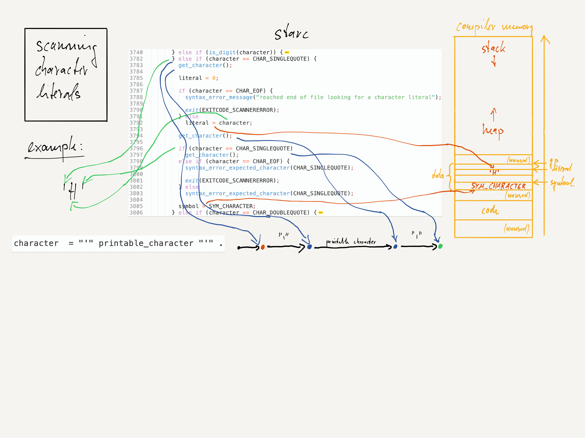

Our means to perform static memory allocation is global variables. We have already seen that in the code for scanning integer literals. We use the same method for scanning character literals as shown in the above figure. Here we only need the three global variables `character`, `literal`, and `symbol`. As before the value of `character` is not shown in the state of main memory but it is there of course. Static memory allocation for scanning character literals is clearly sufficient because the length of the sequence of characters that form a character literal is fixed and the numerical value represented by a character literal is just a single byte with UTF-8 encoding.

According to its EBNF rule, a character literal begins with a single quote `'` followed by a single printable character followed by another single quote:

```ebnf
character = "'" printable_character "'" .
```

Thus, whenever the scanner detects a single quote, then it must be followed by a single printable character followed by a single quote, see the finite state machine in the above figure. Otherwise, there is a syntax error in the scanned sequence of characters.

Computing the numerical value of a character literal is trivial. In fact, the procedure `get_character` has already done that for us and stored it in the global variable `character`. So, the only thing left to do is to take that value and store it in the global variable `literal` and indicate that we just scanned a character literal by storing the value of the global variable `SYM_CHARACTER` in the global variable `symbol`. Done!

> Dynamic memory allocation

We have also seen already how to perform dynamic memory allocation, and deallocation in fact, by using parameters and local variables of procedures such as the procedure `atoi` above. Every time `atoi` is called, memory is allocated on the stack dynamically, that is, at runtime during code execution, for storing the values of its formal parameter and local variables. In contrast to static memory allocation, there is, however, an important challenge with dynamic memory allocation which is when exactly to deallocate memory again, not to run out of memory eventually. With parameters and local variables this is done automatically for us, simply upon returning from a procedure call. This is great and the reason why stack allocation is the most widely used dynamic memory allocation technique.

But stack allocation comes with an important limitation. Deallocation of memory for parameters and local variables is done exactly in reverse order of allocating memory for them. That is why a stack is the correct implementation of that behavior. But what if we need to store information that we need elsewhere in the code outside of the procedure body where the memory is allocated? Well, we can take the information and pass it around as actual parameters and return values of the involved procedures. That style of programming is called *functional programming* as we mentioned before. There is, however, an alternative which have already seen with scanning integer literals and revisit here in more detail.

#### String Literals

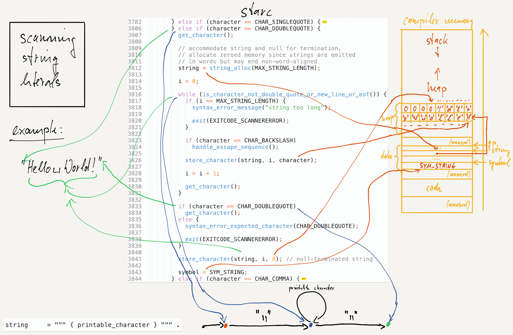

Scanning string literals is an example of how to address the problem of maintaining information that is needed elsewhere in the code, as shown in the above figure. Here we need the three global variables `character`, `string`, and `symbol`. As before the value of `character` is not shown in the state of main memory.

According to its EBNF rule, a string literal begins with a double quote `"` followed by any number of printable characters, including zero printable characters, followed by another double quote:

```ebnf
string = """ { printable_character } """ .
```

Thus, whenever the scanner detects a double quote, then it must be followed by any number of printable characters followed by a double quote, see the finite state machine in the above figure. Otherwise, there is a syntax error in the scanned sequence of characters.

The (non-numerical) value of a string literal is the scanned string itself as is, without any further calculations. However, the scanned string needs to be stored in memory and later added to the generated code. As before with scanning integer literals, we allocate memory on the heap for storing the string using the procedure `string_alloc`. This time we allocate 128+1 bytes (`MAX_STRING_LENGTH` is initialized to `128`) implying that string literals cannot be longer than 128 characters.

In contrast to scanning integer literals, string literals really need to be kept around as is until code generation and we show how this is done below. We do the same with integer literals but that is a choice we made for handling big integers which could also be handled differently. Again, for now, the only thing left to do, after storing the scanned string and refering to it in the global variable `string`, is to indicate that we just scanned a string literal by storing the value of the global variable `SYM_STRING` in the global variable `symbol`.

> A question of life and death

Memory allocation is actually just a means to manage a more fundamental problem that we hinted on before, and that problem must be solved by the programmer and cannot be solved by the machine, no matter how advanced your programming environment is. The issue is to determine the lifetime of information, when it is live and when it is dead. In particular, we need to determine when a value, and thus the memory address where, or the register or variable in which the value is stored, is *live*, that is, when the value is still needed in some computation, and when the value is *dead*, that is, when the value is not needed anymore in any computation, we sometimes say when it *expires*, no matter what happens next. Morbide terminology but that is what computer scientists call it.

Liveness is safe to be overapproximated, death is not. In particular, assuming a value is live even though it is dead is safe, just the other way around is not. Storage for a live value that is assumed to be dead may be reused for other values which may eventually lead to unsafe memory accesses. Yet assuming a dead value to be live is safe but consumes storage of which we may run out of eventually. Thus more memory is good for safety and even performance but only if we know what we are doing. The more memory we have the safer we can be. However, since memory is always finite we eventually need to sit down and figure out what information is still live and what is dead. But then, the more memory we have the more information we might keep around and have to look at which costs performance. This all depends of course also on the application and thus the overall problem we are trying to solve.

> Data management: short-term versus long-term information

Look at the code for scanning integer, character, and string literals. For example, the parameter and local variables of the procedure `atoi` are used for *short-term* information that expires as soon as the procedure returns. In contrast, scanned integer and string literals are *long-term* information stored on the heap and referred to using global variables `integer` and `string`, respectively. We need the scanned integer and string literals possibly until all code has been emitted because only then we may be able include them as part of the code. In other words, we need the information until the whole program has been scanned and parsed which is a moment in time we do not know while scanning integer and string literals. Moreover, code is emitted, at least in our implementation, in a different part of the implementation than the scanner, making integer and string literals global information. However, local and global variables as well as stack and heap are not synonymous with short-term and long-term information, respectively. The situation is, unfortunately, more complicated and ultimately a weakness of programming languages such as C.

> Code management: local versus global information

Whether information is *local* or *global* information, that is, only needed locally in some limited part of the code or globally in different parts of the code, depends not just on the nature of the involved information but also on the structure of the code. If we make the program state *explicit*, as parameter to all involved procedures akin to pure functional programming, for example, then all information becomes local, readily accessible in all places where it is needed. If we make the program state *implicit*, in global variables using pure imperative programming, then all information becomes global, again readily accessible in all places where it is needed, but this time without passing it around procedures. Both choices have pros and cons in correctness and performance but the best choice is, as often, likely to be somewhere in the middle using a mixture of both. Ideally, the programming language should make the right choice easy once the programmer understands the lifetime of the involved information, and as a consequence, free the programmer from the underlying problem of memory management. However, the ideal of future programming languages that allow programmers to develop correct and efficient code without understanding static and in particular dynamic memory management is still a long way off which is another good motivation to dive into that topic next.

> Memory management: used versus free memory

The problem addressed by memory management is to keep track of *used* and *free* memory. More precisely, memory management needs to partition the set of all memory addresses into two sets, the set of used addresses and the set of free addresses, and to maintain the invariant that all values stored at free memory addresses are dead. Moreover, the more values stored at used memory addresses are live the more efficient memory storage is being utilized. Nevertheless, dead values stored at used memory addresses do not necessarily constitute a problem as long as free memory addresses are still available. They may, however, become a problem if free memory addresses are required to occur *contiguously* in blocks of *different* size such as memory for integer and string literals. For example, if all even memory addresses are used and all odd memory addresses are free, then half of memory is free but there are anyway no contiguous memory blocks greater than size one available. This phenomenon is called *memory fragmentation*.

> Memory allocation, deallocation, access, and defragmentation

Memory management generally involves performing four different tasks:

1. memory allocation: find free memory and return it marked as used
2. memory deallocation: mark used memory as free
3. memory access: load and store values in used memory
4. memory defragmentation: find free memory blocks and merge them

The challenge is to allocate, deallocate, access, and defragment memory as fast as possible, ideally in time independent of the amount of used and free memory, and with minimal memory fragmentation. Moreover, allocating certain free memory may be better than other free memory because memory access may be faster or slower depending on where the access happens in memory due to complex hierarchical memory hardware. Memory managment is subject to fundamental time-space tradeoffs implying that there is no best solution which has motivated computer scientists including us to work on memory management algorithms for decades.

The good news is that you do not need to know those algorithms to become a programmer or to understand selfie. However, it does help to know what exactly makes memory management hard, how to avoid that part, and then just work with the simplest possible solution. We nevertheless get back to memory management in the computing chapter to see some of the more involved solutions.

> What makes memory management hard?

One way to make memory management simple and even optimally efficient in terms of time and space, that is, as fast as possible with minimal memory fragmentation, is by only allocating and using memory blocks of the same size. That's it! It is like turning memory into a checkerboard where any free spot will do. Hard to believe but all modern operating systems, most likely including the one running on your smart phone, tablet, and laptop, exploit that property very effectively, as also explained in the computing chapter.

> Memory blocks of different size

However, what if we would like to allocate memory blocks of different size? In general, we may even have to do that, if the size needed changes during program execution while the maximum size ever needed is unknown. But, the good news is that memory management, even of memory blocks of different size, is still simple, and again even optimally efficient, if memory is always deallocated in exactly the reverse order in which it was allocated. Awesome! That reminds us of stack allocation, of course, which is indeed as fast as it gets with minimal memory fragmentation.

> Deallocation in arbitrary order

Alright, but what if we would like to deallocate memory in some other order? There are many applications where memory dies in an order different from the reverse order in which it was allocated. We could of course delay deallocation until it can be done in reverse order but that would result in a situation that resembles memory fragmentation, or in fact something even worse where memory known as dead but still marked as used is unavailable even for allocations that fit. The bad news is that efficient support of deallocation in arbitrary order, including out of reverse order of allocation, is hard. Yet the good news is that we can avoid part of the problem, simply by not deallocating memory at all, trading space for time and safety, and code complexity!

> Nobody needs to free memory!

You heard that right. Nobody needs to free memory, if you have enough memory, that is, if you have enough memory addresses and storage, and on modern systems you often do! Even selfie gives you around 4 billion addresses. Memory storage is a different story, of course, but actually storing a lot of data in memory and later loading it again to do something meaningful is not so easy. A rule of thumb is that, if your code always terminates and only allocates memory in reasonable proportion to the size of reasonably sized input, there is no need to worry about deallocating memory. The selfie compiler is a good example. Even compiling itself takes selfie less than 4 million (not billion) memory addresses, and out of those 4 million addresses less than 3 million refer to potentially live memory storage. As soon as selfie, or whatever code you developed, terminates, the operating system on your machine reclaims all of the used memory anyway.

A common mistake among many programmers is to free memory unnecessarily at the risk of introducing bugs that are often hard to find. Memory must eventually be freed, of course, but only if memory usage exceeds memory storage, which will happen, even when only little memory is live at any given time, with code that keeps allocating and using new memory, either very fast or without ever terminating. However, as mentioned before, worry about freeing memory when your code actually runs out of memory, which may never happen, keeping your time well spent on other issues.

> Code, data, stack, and heap management

Let us revisit the four segments in memory for storing code and data, now with a focus on memory management:

1. code segment: located below all other segments at low addresses in memory; segment size and content are determined at compile time including memory allocation; content is machine instructions implementing the compiled program; at runtime, size and content are fixed, in particular there is no memory deallocation (static memory).

2. data segment: located right above the code segment and below the heap segment; again, segment size and (initial) content are determined at compile time including memory allocation; content is the (initial) values of global variables and the (fixed) values of big integer, character, and string literals in the compiled program; at runtime, segment size and content representing literals are fixed; content representing global variables may change; there is no memory deallocation (static memory).

3. stack segment: located above all other segments at high addresses in memory; segment size and content may change at runtime and are determined by the code executing in the code segment, including memory allocation and deallocation; content is the (actual) values of parameters and local variables of procedures in the compiled program; at runtime, segment size may grow towards lower addresses upon memory allocation and shrink towards higher addresses upon memory deallocation but only in reverse order of memory allocation (dynamic stack allocator); all content may change.

4. heap segment: located right above the data segment and, initially with a large gap, below the stack segment; segment size and content may change at runtime and are determined by the code executing in the code segment, including memory allocation and deallocation; content is anything that does not fit the other segments; at runtime, segment size may grow towards higher addresses upon memory allocation but never shrink (dynamic heap allocator); all content may change; in selfie, there is no memory deallocation but, in general, there is, see below.

In sum, allocating memory requires in the code segment, well, code, and in the data segment, global variables and literals. Allocating and deallocating memory in the stack segment is done by calling procedures and eventually returning from procedure calls, respectively. Lastly, allocating and deallocating memory in the heap segment is done by calling special procedures which we explain next.

> `malloc`: dynamic memory allocation on the heap

The previously mentioned procedure `string_alloc` allocates a contiguous block of zeroed memory on the heap for storing a sequence of characters such as an integer or string literal. Ultimately, however, heap allocation is done using the infamous procedure `malloc` which stands for *memory allocate* on the heap at runtime. That procedure is available in virtually all dialects of C including C\* and so important that it is even built into the language. C compilers including the selfie compiler attach code that implements the procedure to any compiled code that uses it. Programming languages other than C likely feature builtin procedures similar to `malloc` such as Java, for example, where its counterpart is called `new`.

Why infamous? Well, dynamic memory allocation, as we have seen before, comes with two challenges: first, you need to decide which type of memory allocation to use, stack allocation through procedures with parameters and local variables, or heap allocation through `malloc`, and second, if you decide to use `malloc`, you need to figure out when to free memory using another builtin procedure called `free` to avoid running out of memory eventually, that is, memory addresses, just to be precise.

Stack allocation simplifies the problem of deciding when to free memory because it happens implicitly when returning from a procedure call. However, dynamic memory allocation on the stack through procedures is essentially functional programming which requires a background that many inexperienced programmers lack. So, `malloc` it often is, even if there exist more elegant implementations not using `malloc`. But then there is the second challenge.

> `free`: dynamic memory deallocation on the heap

Freeing memory is hard on two different levels which we mentioned before but summarize here again. It is the when and the how. Firstly, it is difficult to know when memory can be freed, that is, when values in memory die. Knowing that involves knowing the future. Also, freeing too early may result in unsafe memory access while freeing too late may result in out-of-memory errors. Secondly, freeing memory of different size and in arbitrary order may result in fragmented memory that resembles a swiss cheese. Finding free space in there that fits is difficult and thus may get slow and even futile.

The procedure `free` is the counterpart to `malloc` and also built into virtually all dialects of C, just not C\*, because sometimes lack of something has significant educational value too. Firstly, it frees students from `free`. Secondly, it provides an opportunity for students to design and implement their own `free`. But, most importantly, it creates awareness among students what memory management actually is. Nevertheless, there is an implementation of `free` in selfie that is not explicitly accessible but it is there.

> Garbage collection!

The implementation of `free` is part of a *conservative garbage collector* in selfie which we explain in the computing chapter. For now, we only mention that garbage collectors free memory that is guaranteed to contain dead values, so there is no need to use `free` explicitly. But, even then, programmers are still required to help the garbage collectors with that, by showing in the code which values are dead. Without any help, garbage collectors may not be able to free memory either, simply trading space for safety. The fundamental problem of knowing the future is here to stay, despite the common but incorrect belief that garbage collectors solve the problem of memory management. Garbage-collected systems help to avoid unsafe memory access but may still run out of memory, just like systems that are not garbage-collected and, even worse, may spend a lot more time doing so.

> Bump pointer allocator

Before concluding our introduction to basic memory management, we would like to explain how the arguably simplest form of memory allocator on the heap actually works. It is called a *bump pointer allocator* which can hardly be any simpler. A bump pointer allocator maintains, well, a `bump` pointer that refers to a memory address where the next free block of memory is located. Upon allocating a contiguous block of `bytes` in memory, the allocator increments or *bumps up* its `bump` pointer by `bytes` many bytes, to prepare for the next allocation, and then returns the original `bump` pointer. Here is *pseudo code* that implements the idea:

```c
// pseudo code, does not compile!
uint64_t bump = START_OF_HEAP;

uint64_t* malloc(uint64_t bytes) {
  // bump pointer allocator
  bump = bump + bytes;

  return bump - bytes;
}
```

Selfie implements the procedure `malloc` with a bump pointer allocator. However, the code in selfie is a bit more involved than the above pseudo code but based on the same principle. There are two important observations we can make here. Firstly, a bump pointer allocator is fast, it even allocates memory in constant time, just like a stack allocator. Secondly, a bump pointer allocator makes the heap grow towards higher memory addresses while a stack allocator makes the stack grow towards lower memory addresses. In other words, heap and stack grow towards each other. What happens when they meet? Bad luck. It means that we are out of memory addresses. In this case, selfie and other systems report an error and terminate code execution.

While a stack allocator deallocates memory in reverse order of allocation, a bump pointer allocator does not do that. It can only bump up, not down. In order to prevent it from eventually bumping into the stack, allocated memory below the bump pointer needs to be marked as free and then reused. The computing chapter has more on that. As mentioned before, selfie does not support freeing memory explicitly.

Enough of memory management for now. Our primary goal here is to understand how integer, character, and string literals are handled. So far, we have seen how their syntactic structure is specified, how detecting them in a sequence of characters is modeled, and finally how that, together with the computation of the values they represent, is implemented in C\*. Before showing how literals are parsed as C\* symbols in a sequence of arbitrary C\* symbols, it is time to mention how the remaining C\* symbols are handled.

#### Scanner

In addition to integer, character, and string literals, C\* features 22 symbols in total:

`integer`, `character`, `string`, `identifier`, `,`, `;`, `(`, `)`, `{`, `}`, `+`, `-`, `*`, `/`, `%`, `=`, `==`, `!=`, `<`, `>`, `<=`, `>=`, `...`

The `identifier` symbol represents names of variables and procedures. We see how they are handled in detail below. The remaining symbols are either 1-character or 2-character symbols. The important observation to make here is that even the entire language of C\* symbols is regular, that is, there is a single EBNF rule that specifies it. As previously mentioned, checking if the language is indeed regular only requires gathering all symbols in an EBNF rule:

```ebnf
cstar_symbols = integer | character | string | identifier | "," | ";" | "(" | ")" | "{" | "}" |
                "+" | "-" | "*" | "/" | "%" | "=" | "==" | "!=" | "<" | ">" | "<=" | ">=" | "..." .
```

and then substitute all non-terminal symbols in its right-hand side with their definition until only terminal symbols remain. If that process terminates, then the language is indeed regular. Try it! The resulting rule gets quite big but it is finite.

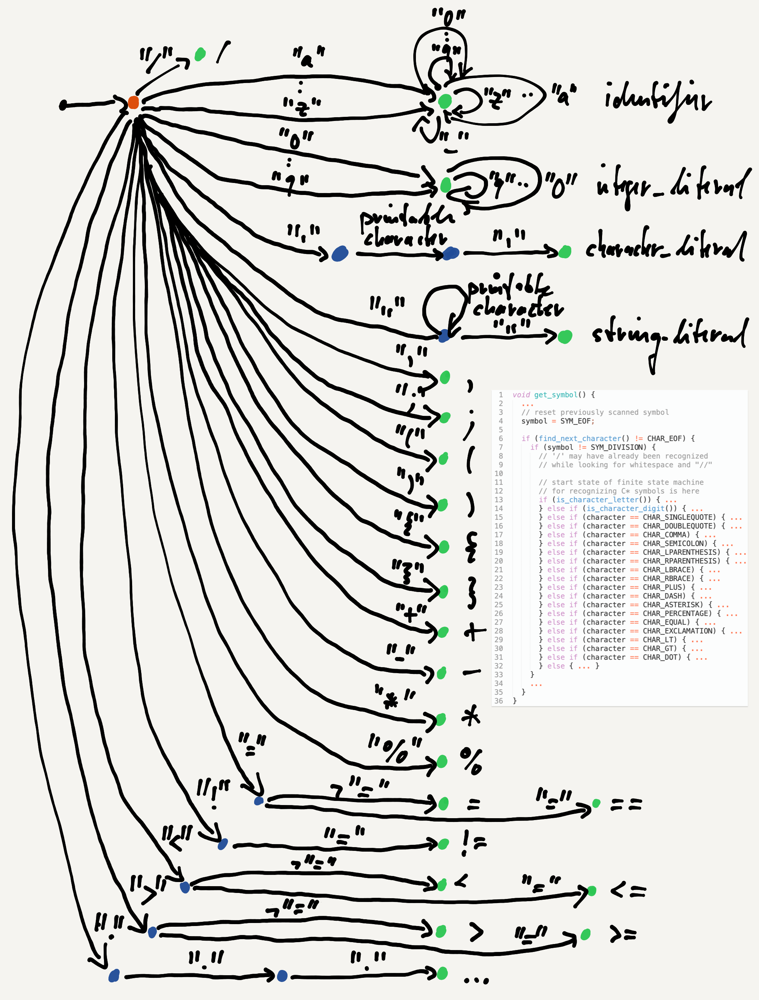

The scanner for all of C\* is depicted in the above figure, in particular the full finite state machine and a sketch of its implementation in the `get_symbol` procedure. The finite state machines for integer, character, and string literals along with the finite state machine for identifiers are part of that.

> Look ahead!

There is another important observation to make here. Most C\* symbols begin with  unique characters. For example, an integer literal begins with a digit, and no other symbol does. A character literal begins with a single quote, and again no other symbol does. This goes on. Only string literals begin with a double quote while only identifiers begin with a letter. The only exceptions are the assignment symbol `=` and the equality symbol `==`, and the inequality symbols `<` and `<=` as well as `>` and `>=`. But even those can all be distinguished upon a so-called *lookahead* of 1 character. Just by looking at the next character, the decision which symbol has been scanned can be made. We say that C\* symbols can be scanned with a lookahead of at most 1.

This is not a coincidence. C\* symbols and the symbols of many other programming languages have been specificially designed so that most of them can be scanned with no lookahead at all and the rest with a lookahead of 1. For example, identifiers may not begin with a digit to distinguish them from integer literals already upon seeing the first character. This makes scanning simple and fast, not just for the machine but, interestingly, also for humans reading the code. We see below that even the entire syntactic structure of C\* programs can be parsed with a lookahead of at most 1.

> Whitespace

One more thing before moving on to parsing literals. C\* is a programming language in which *whitespace* such as, well, the *space* character but also *carriage return*, *line feed*, and *tabulator*, has no impact on semantics, unlike Python, for example, where indentation does matter. C\* also supports single-line comments using `//` and multi-line comments using `/*` and `*/`. In other words, the C\* scanner ignores all characters to the right of `//`, in a single line, and in between `/*` and `*/`, even across multiple lines. The implementation is not trivial, see the procedure `find_next_character` in the selfie code for all the details.

To demonstrate that whitespace and comments are fully ignored by the C\* scanner, we have prepared a *Hello World!* program in C\* that prints `Hello World!` onto the console:

```c
// global variable for pointing to the "Hello World!    " string
uint64_t* foo;

// main procedure for printing "Hello World!    " on the console
uint64_t* main() {
  // point to the "Hello World!    " string
  foo = "Hello World!    ";

  /* strings are actually stored in chunks of 8 characters in memory,
     that is, here as "Hello Wo", and "rld!    " which allows us to
     print them conveniently in chunks of 8 characters at a time */

  // as long as there are characters print them
  while (*foo != 0) {
    // 1 means that we print to the console
    // foo points to a chunk of 8 characters
    // 8 means that we print 8 characters
    write(1, foo, 8);

    // go to the next chunk of 8 characters
    foo = foo + 1;
  }
}
```

Hello World! programs are often used as introductory examples in programming education. We have also prepared a *minified* version which is much shorter and looks very different but is semantically equivalent to the original. The only difference is that all whitespace and all comments have been removed:

```c
uint64_t*foo;uint64_t*main(){foo="Hello World!    ";while(*foo!=0){write(1,foo,8);foo=foo+1;}}
```

Minification is typically used to decrease the size of source code that is sent across the Internet for the purpose of code execution rather than for reading by humans. For example, Javascript programs are often sent to browsers as minified code. To see that both versions are indeed semantically equivalent, try:

```bash
make whitespace
```

In fact, even the machine code and the assembly code generated for both versions are identical. The *profile* of the compiled source code shows that the only difference between the two versions are the number of characters in the code: 737 characters in 23 lines and 9 comments for the original and 94 characters in 1 line and 0 comments for the minified version. Only 94 characters, that is, 12.75% of the 737 characters are used in 39 actual symbols whereas 100% of the 94 characters in the minified version are used in the same symbols. One could decrease the size of the minified version even further by renaming the variable `foo` to a 1-letter identifier such as `f`. Try that! It will not change the semantics either.

#### Parser

Computer scientists often speak of *parsing* code when they actually mean reading it. Calling it parsing rather than reading does make sense because code is written in a formal language, not a natural language, whose syntax is precisely defined and can therefore be "read" by a machine.

A *parser*, just like a scanner, is software that instructs a machine to check if a sequence of characters, or in fact a sequence of symbols obtained by a scanner, is in the language defined by a formal grammar. The difference between parser and scanner is that a parser typically handles grammars that are not regular. Remember pumping lemmas? Those are used to prove that a formal language is, for example, not regular. The situation is actually even more involved than that. There is a whole hierarchy of formal languages in which regular languages are arguably the simplest.

> Hierarchy of formal languages

Context-free languages such as C\* are already quite a few steps higher up in that hierarchy. There is more hierarchical structure to context-free languages though. C\*, just like many other programming languages, is *LL(1)* which is arguably the simplest kind of context-free language, right above regular languages.

> LL(1) languages

The first L in LL(1) stands for reading a given sequence of symbols from *left* to right. The second L stands for *leftmost* derivation and the 1 stands for lookahead of 1. This means that an LL(1) language can be parsed with a look ahead of 1 by checking the right-hand sides of the grammar rules that define the language from *left* to right against a given sequence of symbols which, as mentioned before, is read from *left* to right. We see below how that works.

> LR(1) languages

There are context-free languages that are not LL(1). For example, there are LR(1) languages that can be parsed, again with a lookahead of 1, but only by checking the right-hand sides of the grammar rules from *right* to left. LR(1) languages may be syntactically more complex than LL(1) languages but that also means that parsing LR(1) languages is typically more involved than parsing LL(1) languages. Some computer scientists love the topic of formal languages and we could go on about it for quite some time. However, for a basic understanding of the topic, it is fine to focus on LL(1) languages like C\* and leave more advanced details to the recommended readings.

> Recursive-descent parsers

The key advantage of LL(1) languages is that they can be parsed efficiently with a *recursive-descent* parser which is arguably not only the simplest but also the most beautiful form of parser. Implementing a recursive-descent parser for an LL(1) language is so easy that it can be done by hand with joy whereas the same is generally not true for languages that are not LL(1). Most parsers today, including their scanners, are automatically generated by development tools called *parser generators* which take a formal grammar and then generate the source code of a scanner and parser for the language defined by that grammar.

> Parser generators

Parser generators are fine for parsing formal languages with complex grammars. But it may often be worthwhile simplifying the syntax of a language until it becomes LL(1) and then handcraft a recursive-descent parser instead. In fact, doing that seems to be a regular routine of properly trained software engineers, as I was told by colleagues from industry. Have you implemented a parser today? Sure!

> C\* grammar

In the implementation of the C\* scanner we have already seen that the EBNF operator `|` for choice and `{ }` for repetition are implemented by an `if` statement and a `while` loop, respectively. The grammar of C\* symbols does not use the EBNF operator `[ ]` for optionality but the C\* grammar does. Its implementation is done by an `if` statement as we see below. In fact, here is the full C\* grammar:

```ebnf
cstar      = { variable [ initialize ] ";" | procedure } .

variable   = type identifier .

type       = "uint64_t" [ "*" ] .

initialize = "=" [ cast ] [ "-" ] value .

cast       = "(" type ")" .

value      = integer | character .

statement  = assignment ";" | if | while | call ";" | return ";" .

assignment = ( [ "*" ] identifier | "*" "(" expression ")" ) "=" expression .

expression = arithmetic [ ( "==" | "!=" | "<" | ">" | "<=" | ">=" ) arithmetic ] .

arithmetic = term { ( "+" | "-" ) term } .

term       = factor { ( "*" | "/" | "%" ) factor } .

factor     = [ cast ] [ "-" ] [ "*" ]
             ( "sizeof" "(" type ")" | literal | identifier | call | "(" expression ")" ) .

literal    = value | string .

if         = "if" "(" expression ")"
               ( statement | "{" { statement } "}" )
             [ "else"
               ( statement | "{" { statement } "}" ) ] .

while      = "while" "(" expression ")"
               ( statement | "{" { statement } "}" ) .

procedure  = ( type | "void" ) identifier "(" [ variable { "," variable } [ "," "..." ] ] ")"
             ( ";" | "{" { variable ";" } { statement } "}" ) .

call       = identifier "(" [ expression { "," expression } ] ")" .

return     = "return" [ expression ] .
```

The rest of the chapter is essentially about that grammar, how the language it defines is parsed, and how code is generated during parsing. The key difference between the grammar of C\* symbols and the C\* grammar, that is, the grammar of C\* programs, is that the latter consists of multiple EBNF rules that cannot be substituted into a single EBNF rule. The C\* grammar is indeed not regular and thus requires a pushdown automaton, that is, a finite state machine with a stack, to recognize sentences that are syntactically valid.

The non-terminal symbol `cstar` in the left-hand side of the first rule is called the *start symbol*. This is where the derivation of syntactically correct C\* programs begins. But how do we deal with multiple EBNF rules in the implementation of a parser? Simple! We just introduce, not just one scanner procedure such as `get_symbol`, but multiple parser procedures named `compile_X`, one for each rule where `X` is the non-terminal in the left-hand side of the rule. For example, for the first rule, we introduce the procedure `compile_cstar` and then implement the right-hand side of the rule in the procedure. For each occurrence of a non-terminal symbol `X` we simply call the procedure `compile_X`. The result is a recursive-descent parser that implements a pushdown automaton and is invoked by calling `compile_cstar`. See for yourself by looking up those procedures in the selfie source code.

Recursive-descent parsers use recursion to descent *top down* into the grammar beginning with the EBNF rule containing the start symbol. Recursion terminates whenever a terminal symbol is encountered. Parsers for languages other than LL(1) often work *bottom up* which is a technique that allows parsing syntactically more complex languages such as LR(1) and others.

Enough of parsing in principle. Let us dive into parsing actual C\* literals. To do that we need to find the definition and use of literals in the C\* grammar. A `literal` is a `value` or a `string`:

```ebnf
literal = value | string .
```

We have seen the definition of `string` before. So a `value` is:

```ebnf
value = integer | character .
```

Here you have it. A `literal` is indeed either an `integer`, a `character`, or a `string` literal. The respective parsing procedures are `compile_literal` and `compile_value`.

A careful check reveals that literals are only used in one place in the C\* grammar:

```ebnf
factor = [ cast ] [ "-" ] [ "*" ]
         ( "sizeof" "(" type ")" | literal | identifier | call | "(" expression ")" ) .
```

The procedure for parsing a `factor` is `compile_factor`. See how beautiful this is?

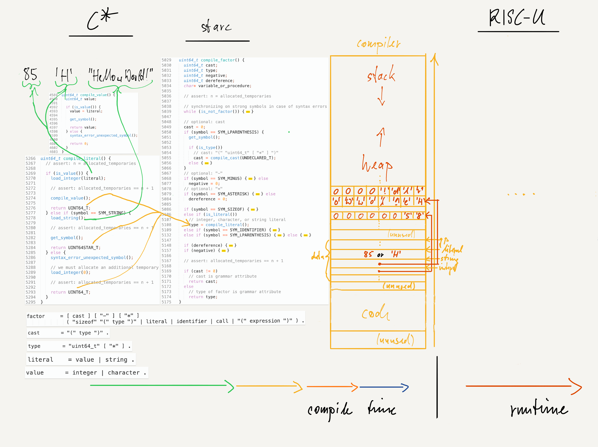

The above figure shows the syntactic specification of C\* literals in EBNF as well as the implementation of parsing those literals in C\*. It also shows the machine state after parsing our running example of the integer literal `85`, the character literal `'H'`, and the string literal `"Hello World!"`.

> Again, compile time versus runtime

There is an important new element in the figure compared to the figures on scanning C\* literals. We explicitly distinguish the two *timelines* that we discussed before:

1. *Compile time* refers to the time of compiling source code.
2. *Runtime* refers to the time of executing compiled machine code.

Compile time includes the time when source code is not just compiled but developed. Runtime is really just the time when compiled machine code is executed. Anything to the left of the vertical black bar happens at compile time, that is, compilation of C\* code to RISC-U machine code by the selfie compiler. Anything to the right happens at runtime. In the figures below the right part is populated with the initial machine state for executing the compiled RISC-U machine code.

Keeping the two timelines strictly separate from each other in your mind is important but not always easy. Some students struggle with this. One reason might be that compile time is also runtime but for the compiled machine code of the compiler, not the machine code compiled by the compiler. Read that again! We therefore try to distinguish both timelines as much as possible.

> Syntax error handling

Consider the procedure `compile_factor`. The first `while` loop does something fascinating. It handles syntax errors in the sequence of symbols. An important part of compiler design is to parse the entire program even in the presence of syntax errors. Instead of terminating compilation during parsing, a compiler is supposed to report a syntax error but then continue compiling to the end of the program, even if the generated code may then not make much sense. Designing good syntax error handling is nevertheless more of an art rather than a science.

> Weak and strong symbols

The problem is that upon the occurrence of a syntax error, we need to make assumptions on the chances of finding a spot in the sequence of symbols that is syntactically correct. A simple approach is to partition the set of symbols into *weak* and *strong* symbols. A weak symbol is a symbol that programmers tend to forget such as a right parenthesis or a semicolon. A strong symbol is the opposite of a weak symbol such as a left parenthesis or a `while` keyword. Whenever a weak symbol is missing, the compiler reports that but then simply assumes it was there and continues parsing. But what if a symbol is missing that is needed to decide how to proceed? In that case, the compiler keeps scanning symbols, reporting each as syntax error, until it finds a strong symbol and then resumes parsing. The first `while` loop in `compile_factor` does exactly that. It looks for a symbol that a `factor` starts with, considering those as strong. There are other procedures in the parser that do something similar using `while` loops, we point them out below. Yet note that if the parsed sequence of symbols is syntactically correct those `while` loops are never entered.

> Optionality in EBNF

The first three elements of a `factor` are optional. There may or may not be a `cast`, a dash `-`, and an asterisk `*` at the start of a `factor`. Parsing of optional elements is handled by `if` statements that do not use their `else` body for parsing such as the three `if (symbol == ...)` statements following the first `while` loop in `compile_factor`. Note that a `cast` starts with a left parenthesis `(`. The effect on semantics of these optional elements is handled after parsing the rest of a `factor`. We discuss how that is done when it comes to parsing expressions.

> Typing and casting

The semantics of casting, however, we can handle here since it does not involve code generation but it does require a little yet relevant excursion to typing. C\* features two different *data types* denoted `uint64_t` and `uint64_t*`. As mentioned before, the former stands for *unsigned integer 64-bit type` and the latter for pointer to `uint64_t`.

In C\*, variables and procedure arguments as well as literals and expressions are all *typed*, that is, have a type which can only be one of the two C\* data types. Casting allows changing types, here from one type to the other type, without applying any operations on any involved values. That's all. For example, integer literals such as `85` are of type `uint64_t` in C\* which we can nevertheless change to `uint64_t*` through casting:

```
(uint64_t*) 85
```

Another example are string literals such as `"Hello World!" which are of type `uint64_t*` in C\* which we could change to `uint64_t` through casting:

```
(uint64_t) "Hello World!"
```

Interestingly, integer literals such as `85` are of type `int` in standard C, not `uint64_t` as in C\*, which means that strictly speaking C\* is not quite a subset of C. Moreover, character literals such as `'H'` also are of type `uint64_t` in C\*, unlike in standard C, where they are of type `char`, similar to string literals which are of type *array* of `char` in standard C. Supporting `int` and `char` in C\*, and even array of `char`, is possible but not without adding significant complexity to selfie. The difference between C\* and C in terms of literal typing does have an effect on semantics which we explain when dealing with arithmetic expressions.

> Data types

Alright, but what is a data type anyway? A *data type* essentially specifies, often just by name, two properties of data: the *size* of data in number of bits and the *layout* and *interpretation* of those bits in memory. Sometimes size and layout may be variable, but not in C\*. Values of type `uint64_t` and `uint64_t*` even have the same fixed size of 64 bits in C\*, they just differ in interpretation. This means that casting one type to the other in C\* can be done without loss of information, it only changes what those 64 bits are supposed to mean. Just casting would already become a lot more complex if C\* featured data types of different size such as `int` and `char` which both involve fewer than 64 bits.

> Abstract semantics

Data types are arguably the most successful innovation in programming languages for reducing the number of bugs in software. Conceptually, data types are situated somewhere between syntax and semantics of programming languages, and compile time and runtime. Data types provide the meaning of data or, more precisely, an abstract meaning of data, often just by name, without actually implementing the concrete meaning. Code is still needed to do that.

> Type error

Data types induce a notion of *type error*, similar to a syntax error, but indicating a possible lack of meaning rather than a purely syntactic issue. The advantage is that code can be efficiently checked for type errors even at compile time, that is, for certain kinds of errors in meaning even before executing the code. For example, the selfie compiler reports an error when trying to perform addition of two operands that are both of type `uint64_t*`, assuming that adding a pointer to another pointer is meaningless.

> Type polymorphism through overloading

What about using data types not just *analytically* for finding semantical errors but also *constructively* for producing code with the same syntax as before but more complex semantics? This is indeed possible through what computer scientists call *type polymorphism*. The idea is to alter the semantics of code so that the semantics of, say, arithmetic operators depends on the type of the involved operands. In C and C\*, adding an integer to another integer has a different semantics than adding an integer to a pointer which is in fact meaningful and not reported as type error. In other words, the addition operator `+` has different meaning depending on the type of its operands. This is called *overloading* which avoids introducing different syntax for different semantics depending on operand types. More on that below. For now, just be careful when reading code. It may not mean what you think it means and type polymorphism may be one of the reasons. Unfortunately, as we mentioned before, computer scientists use notation such as the `+` symbol that has well-established semantics in mathematics with different semantics in programming languages and other formal languages.

> Grammar attributes

Let us go back to the code of the `compile_factor` procedure. Also, consider the code of the procedure `compile_literal` as well, which is called by `compile_factor` upon parsing C\* literals. The interaction between the two procedures shows how we handle type information. The challenge is to communicate the type of a symbol such as the type of a `literal` to other procedures involved in parsing. We do that by turning the type into a *grammar attribute* which is then passed around as return value of the procedures of the recursive-descent parser.

For example, `compute_literal` determines the type of integer and character literals to be `UINT64_T` which is a global variable initialized to a value that uniquely identifies the type `uint64_t`. Similarly, `compute_literal` determines the type of string literals to be `UINT64STAR_T` which is another global variable initialized to a different value than `UINT64_T` that uniquely identifies the type `uint64_t*`. The type is then returned to `compile_factor` as grammar attribute which in turn may cast it to another type or just keep it as is and return it to its caller as grammar attribute and so on. We ignore the code for handling syntax errors in `compile_literal` and do not show the code of the procedure `compile_cast` either. It is simple code that obviously parses `cast` and then returns the type to which the `cast` casts as grammar attribute. For more details see the source code of selfie.

We do, however, show the code of the procedure `compile_value` which parses integer and character literals and is thus also quite simple but demonstrates a different use case for grammar attributes. This procedure does not return a type but instead returns the value represented by the parsed literal as stored in the global variable `literal`. Values as grammar attributes can be used to perform simple code optimizations such as *constant folding*. We explain how that works in principle below.

#### Code Generation

We made it all the way to the last step of implementing literals. Code generation produces an implementation of high-level programming language constructs in machine code, including constructs as simple as literals. But what is really the meaning of literals? The challenge, besides implementing semantics through code generation, is to figure out what semantics we actually want. We need to be absolutely certain about that. This is relatively easy with literals but not so much with other constructs. It took computer scientists years to figure out and agree on which semantics basic programming language constructs should have.

Integer and character literals are easy to figure out. An integer literal as well as a character literal through its ASCII code both represent a numerical value. Yet a string literal is already more complex. It represents, as its value, a pointer to the memory address where the string actually starts in main memory plus the actual string itself as stored in main memory.

Sounds like we also need to know how the target machine works and what machine code can do for us. Recall that all computation happens on the CPU in registers. Code and data is all stored in main memory. Data is loaded into CPU registers from memory, then manipulated in CPU registers, and finally stored from CPU registers back into memory. Since all data manipulation happens in registers, we need to generate code for literals that loads their values into registers. In sum, there are three distinct problems we need to solve to make all of this work.

> Code allocation and storage

Firstly, we need to store generated code. As long as we do not aim at generating optimized code, this is easy to do using *straight code generation*, with one notable exception, see below. Straight code generation means that we generate machine instructions during parsing as soon as possible and store the generated instructions sequentially one after another in memory. For this purpose, the selfie compiler allocates a large block of memory on the heap referred to by a global variable called `code_binary`. The content of `code_binary` may eventually be copied to an executable binary file or directly loaded into the code segment of a RISC-U machine for execution. The size of `code_binary` is fixed. If there is not enough space during compilation, the compiler simply reports an error and quits. We could avoid that behavior with more complicated code in the compiler but opted for simplicity instead.

Another global variable called `code_size` keeps track of the number of bytes generated for code. Initially, the value of `code_size` is `0` and then incremented by `4` bytes for each generated machine instruction, similar to a bump pointer allocator, but at compile time! Recall that each RISC-U instruction is encoded in exactly 4 bytes. The only challenge with straight code generation is when code is generated but some information about that code only becomes available later. In this case, we need to remember that code and do a *fixup* later. More details are below when it comes to generating code for control-flow statements.

> Data allocation and storage

Secondly, we need to store the values of string literals and big integers as well as the values of global variables in memory. Similar to `code_binary`, the selfie compiler allocates a large block of memory referred to by a global variable called `data_binary`. Again, the content of `data_binary` may be copied to an executable or loaded into the data segment for execution, and the size of `data_binary` is fixed as well. Thus, again, if there is not enough space, the compiler reports an error and quits. There is also a global variable called `data_size` which keeps track of the number of bytes generated for data. Initially, the value of `data_size` is `0` and then incremented by `8` bytes for each generated machine word, again similar to a bump pointer allocator, but at compile time!

Unlike code, however, recall that data in the data segment in main memory is referenced relative to the global-pointer register `gp` which points to the end of the data segment, not the start. This means that during parsing, data must be stored in reverse order in `data_binary` using the negative (!) current value of `data_size` as offset relative to the value of `gp`. For example, the first machine word that makes it into `data_binary` has, in the data segment in main memory, offset `-8` relative to the value of `gp`, the second `-16`, and so on. Thus string literals, big integers, and global variables are actually a means for implicit static memory allocation in the data segment using an effectively reverse bump pointer allocator that allocates memory from high to low addresses at compile time, similar to a stack allocator at runtime.

> Register allocation

Thirdly, we need to choose CPU registers for performing any kind of calculation, also known as the *register allocation problem*, and then keep track of which register is currently being used for which value. Out of the 32 available CPU registers of our RISC-U machine, we only use 7 so-called temporary registers for calculations named `t0` to `t6`. Recall that the `t` stands for *temporary*. There are numerous algorithms for solving the register allocation problem. In fact, compiler books typically feature a whole chapter on this topic. It is an important problem because CPU registers are arguably the most important resource of a computer. At any given time during code execution, we want those registers to hold live data, meaning that the values stored in those registers are all still needed.

As you might guess, we ignore that in selfie and instead opt for simplicity, arguably the simplest way of allocating and deallocating registers. We use a stack allocator, but again at compile time! There are two procedures: `talloc` allocates a new register, starting with `t0` and then going up to `t6`, and `tfree` deallocates the register most recently allocated by `talloc`. Does this always work? Do registers really become free in exactly the reverse order in which they were allocated? With code compiled by the selfie compiler from C\* programs they do! Yet this is not true in general but not our concern here.

Then there are are two more procedures: `current_temporary` returns the register most recently allocated by `talloc` and `previous_temporary` returns the register second most recently allocated by `talloc`. Knowing the two most recently allocated registers is sufficient to generate code in all situations encountered by the selfie compiler. Beautiful!

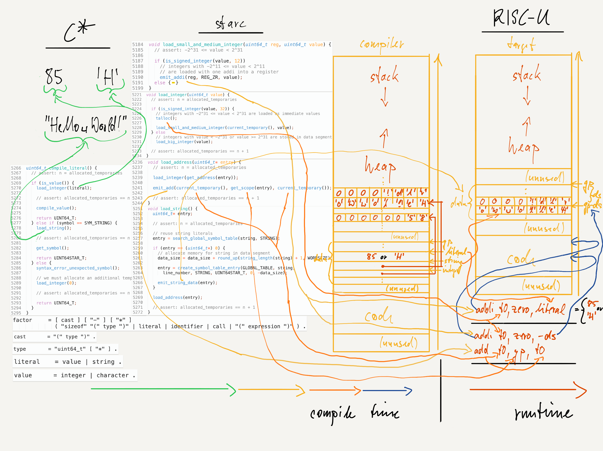

We are finally ready to get to the last step in dealing with literals. The above figure shows the source code involved in generating machine code for literals. The relevant procedures are `load_integer` which emits code into `code_binary` that loads the value of an integer or character literal into a register, and `load_string` which first emits a string literal into `data_binary` and then emits code into `code_binary` that loads the address of that string literal in memory into a register.

> Emitting code and data

Code generated by the selfie compiler is emitted into `code_binary` by procedures named `emit_X`, one for each RISC-U machine instruction where `X` is the mnemonic of the instruction such as `addi` which is emitted by the procedure `emit_addi`. In turn, each `emit_X` procedure invokes a procedure for encoding the instruction according to its format such as the procedure `encode_i_format` for the I-Format. Data generated by the selfie compiler is emitted into `data_binary` by the procedure `emit_data_word`. A beautiful unique feature of `selfie.c` is that encoding of instructions, which is part of the backend of the selfie compiler, is implemented right next to decoding of instructions, which is part of the frontend of the selfie emulator that executes the code generated by the selfie compiler. Enjoy!

Well, let us get back to generating code, first for integer and character literals. Since integer values in C\* can be up to 64 bits, there are actually three different cases to consider: small 12-bit values, medium 32-bit values, and big 64-bit values. We only look at the simplest case of loading 12-bit values here. For the other cases, refer to the source code of selfie. It is an interesting excercise in reading non-trivial code. Handling medium 32-bit values involves generating more than one machine instruction and handling big 64-bit values is similar to handling string literals. The case of 12-bit values is simple because those values can be loaded into a register with a single `addi` instruction. For this purpose, `load_integer` allocates a register and then invokes the procedure `load_small_and_medium_integer` which in turn emits the actual `addi` instruction using the procedure `current_temporary` to obtain the just allocated register, as shown in the above figure. That's all.

> Assertions against register leaks

There is one more thing though. Notice the comments at the beginning and end of `load_integer`. They express an *assertion* on the number of currently allocated temporary registers. When invoking `load_integer` we assume that `n` temporary registers have already been allocated. Before returning from `load_integer` that number obviously goes to `n+1`. The reason why we use such assertions is to keep track of currently allocated temporary registers, and in particular when to deallocate them, avoiding a register leak which would make the compiler run out of registers eventually. Some programming languages support such assertions explicitly, not just in comments, enabling compilers to enforce them. If you come across assertions, feel encouraged to use them!

Loading string literals is more involved than loading integer and character literals. The relevant code here is the procedure calls `emit_string_data(entry)` and `load_address(entry)` in the procedure `load_string`, ignoring the other code for now. The variable `entry` refers to information about the string literal, in particular the address of the string literal in memory as offset relative to the global pointer `gp`. Details are discussed below in the context of handling variables. The procedure `emit_string_data` emits the actual string literal into `data_binary` using the procedure `emit_data_word`. The procedure `load_address` emits code that loads the address of the string literal in memory into a temporary register. It does so in two steps, by first emitting code that loads the offset relative to `gp` into a temporary register, using the procedure `load_integer`, and then emitting a single `add` instruction that adds to the value of the temporary register the value of `gp`, as shown in the above figure. That's it.

> Still to do: symbol tables and fixup chains

Hard to believe but we are done handling literals and now have time to reflect. Literals are the arguably simplest concept in programming languages and yet it took introducing a lot of material to understand how their syntax and semantics is actually specified and implemented. In particular, it took regular expressions, finite state machines, scanning, context-free grammars, recursive-descent parsing, memory management, the notion of compile time and runtime as well as code, data, and register allocation, and code generation. The good news is that there is only one problem left and two implementation techniques for solving it to handle all other concepts in C\*. We are talking about *symbolic references* and how to resolve them into *direct references*. The issue is that handling literals can be done on the spot when parsing them but not so with other programming elements such as variables and procedures. The name of a variable or procedure refers *symbolically* to data or code, respectively. At the level of the machine, however, not names but memory addresses refer *directly* to data or code. We therefore need to resolve symbolic references to direct references and do so using *symbol tables* and *fixup chains*. The former are introduced next for handling variables, the latter when we get to handling conditional and loop statements.

### Variables

Handling the syntax and semantics of literals as the arguably simplest concept of programming languages took an amount of work that was even surprising to us. On the flip side, by now we have seen almost everything necessary to handle the remaining concepts, except for symbol tables and fixup chains. Yet the lesson even we learned when writing this up is that a simple concept such as literals is already quite powerful and therefore requires a lot of machinery. Being able to write down numbers, characters, and even strings as is in a high-level programming language, not worrying about how they are encoded and handled by a computer, is an early achievement of computer science. Still, knowing how they are encoded and handled makes a big difference when programming. Sure, you can drive a car with manual transmission without knowing how a clutch works but you cannot become a good driver and certainly not a race driver until you do know!

The arguably second simplest concept, after literals, that can also be seen as an immediate generalization of literals, is variables which are therefore our next topic. A *variable* in a programming language such as C\* and many others essentially represents exactly one value at any given time during program execution, out of a choice of finitely many values. In C\*, that value is a 64-bit integer, meaning there is a choice of 2^64^ different integers, either interpreted as unsigned integer or pointer. The value of a variable can be defined by an *expression* of which literals are a special case, as we see below. The value represented by a variable is stored somewhere in memory, here in exactly one 64-bit machine word, which in turn is identified by a memory address. Thus a variable can also be seen as an abstraction of a memory address, essentially by giving that memory address a name. That name is provided syntactically by an *identifier*.

> Variables are memory

Most importantly, variables in programming language are similar to variables in mathematical formulae and in fact inspired by those but they are not the same, often causing confusion! A variable in a mathematical formula serves as placeholder for essentially anything we want it to be, even something infinitely large. A variable in a programming language can never be more than an abstraction of finite memory, or in other words, an approximation of a variable in a mathematical formula. There are formalisms in computer science with variables as in mathematical formulae but those are typically meant for specification, modeling, and analysis, not programming.

Back to variables in programming languages, how do we handle their syntax and semantics? We first focus on their syntactical representation with identifiers, and only then figure out their semantics through memory allocation and code generation.

#### Identifiers

As with literals, we go through specification, modeling, and implementation of the syntax of identifiers first. The EBNF of identifiers is:

```ebnf
identifier = letter { letter | digit | "_" } .
```

where a *letter* is, as we saw before with the syntax of EBNF itself:

```ebnf
letter = "a" | ... | "z" | "A" | ... | "Z" .
```

We already saw what a digit is before when handling integer literals. An identifier obviously must begin with a letter followed by any number of letters, digits, and underscores `"_"`. The reason as to why identifiers must begin with a letter is simple. It allows the scanner to distinguish identifiers from integer literals upon seeing the first character! Very nice.

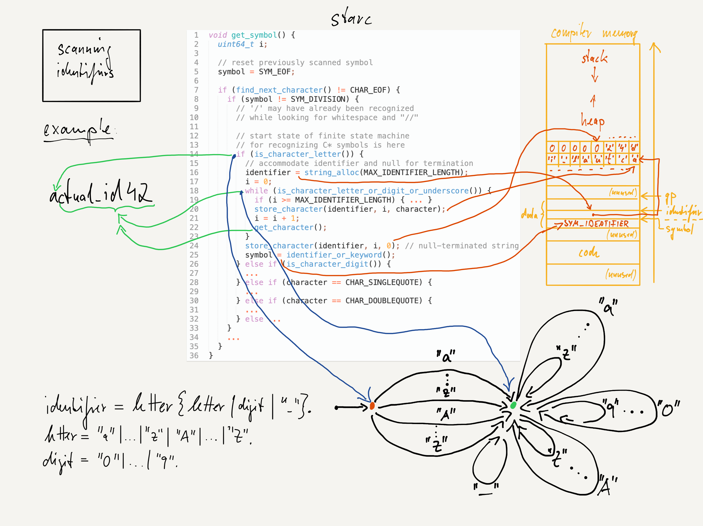

The finite state machine for recognizing identifiers and the implementation of the FSM in selfie is shown in the above figure. The code is part of the procedure `get_symbol` which we have seen before. As example, we use the sequence of characters `actual_id42` which is obviously a syntactically valid identifier. Similar to integer and string literals, there is a limitation in the length of identifiers given by the global variable `MAX_IDENTIFIER_LENGTH` which is set to 64 in selfie. That is plenty given that identifiers are names of variables in C\*. The same applies to procedure names which are the only other use of identifiers in C\*. Have a quick look at the C\* grammar to confirm that. Handling the syntax of identifiers is straightforward after seeing how the syntax of literals is handled.

There is one problem with identifiers, however. C\* features the following seven *keywords*:

`uint64_t`, `void`, `sizeof`, `if`, `else`, `while`, and `return`

These keywords are syntactically identifiers but obviously serve a very different purpose. Therefore, the scanner needs to distinguish identifiers from keywords. Instead of modeling that in a finite state machine, we just implemented a procedure `identifier_or_keyword` that compares a potential identifier with the strings for all seven keywords. If it finds a match, the potential identifier is actually a keyword and returned as such, see the code of `identifier_or_keyword` for the details.

> Declaration, definition, use

Identifiers appear in a number of places in the C\* grammar. Some occurrences identify variables, the rest procedures. Another important distinction that applies to both variables and procedures is that identifiers always appear, explicitly in syntax or implicitly in semantics, in the following three different roles:

1. a *declaration* which introduces an identifier either as variable or as procedure. In particular, the occurrence of `identifier` in the rule for `cstar` via the rule for `variable` declares a global variable. The occurrence of `identifier` in the rule for `procedure` via the rule for `variable` declares a local variable or formal parameter of a procedure. The occurrence of `identifier` in the rule for `procedure` declares a procedure.

2. a *definition* which specifies either the value of a variable or the code of a procedure. In particular, the occurrence of `initialize` in the rule for `cstar` defines the initial value of a global variable. The occurrence of `identifier` in the rule for `assignment` (without the optional occurrence of `*`) defines the current value of a global variable or a local variable or formal parameter of a procedure. The occurrence of `expression` in the rule for `call` defines the value of a formal parameter upon a procedure call. The occurrence of `statement` in the rule for `procedure` defines the implementation of a procedure.

3. a *use* which either obtains the value of a variable or invokes a procedure. In particular, the occurrence of `identifier` in the rule for `factor` obtains the current value of a global variable or a local variable or formal parameter of a procedure. The occurrence of `identifier` in the rule for `call` invokes the code of a procedure.

The following C\* program features all of the above:

```c
uint64_t x = 42;

uint64_t p(uint64_t y);

uint64_t p(uint64_t y) {
  uint64_t z;

  z = x;

  if (y < z)
    return p(y + 1);
  else
    return y;
}
```

Try to spot each case for yourself! For example, the assignment `z = x;` defines the value of `z` using the value of `x` which is the simplest form of an expression other than a literal. The procedure call `p(y + 1)` uses the value of the expression `y + 1` to define the value of the formal parameter `y`. It also uses the code of the procedure `p` by invoking `p`, and so on.

> Implicit declaration and definition

Declarations and definitions may be implicit without any syntactical elements. In particular, initialization of global variables is optional. If there is none for a given variable, the value of that variable is set to `0`. Local variables cannot be initialized in C\*. Their initial value is *undefined*. Make sure to set their initial value in assignments before using them. This is a source of errors that production compilers point out but not the selfie compiler. Think about how to extend language and compiler accordingly!

> Forward declaration

Procedures may be declared but do not have to. The definition of a procedure is also an implicit declaration. An explicit *procedure declaration* is only necessary if the declared procedure is used in procedure calls before it is defined. In that case, the declaration is called a *forward declaration*. Some of the procedures implementing the recursive-descent parser in the selfie compiler are an example of that since they use each other. Production compilers enforce forward declarations to check that procedures are used with properly typed actual arguments. The selfie compiler does not do that either, so watch out. This is another opportunity for students to enhance the compiler accordingly.

> Lookahead for variables versus procedures

Let us point out the challenges in parsing identifiers before going into the details of how to do that. There are two scenarios that require attention: are we dealing with a variable or a procedure in declarations and definitions, and similarly, in uses. For example, when parsing `uint64_t x = 42;` in the above code, the fact that `x` denotes a variable and not a procedure only becomes apparent through a lookahead of 1 to the next symbol. Since the next symbol is `=` and not `(`, the `x` is recognized as an identifier that denotes a variable. Similarly, upon parsing the procedure call `p(y + 1)`, the fact that `p` denotes a procedure and not a variable only becomes apparent, again, through a lookahead of 1 to the next symbol. Since the next symbol is `(` and not something else, `p` is recognized as an identifier that is supposed to denote a procedure. The selfie compiler then checks if `p` has indeed been previously declared or defined to denote a procedure.

Next, we look into parsing global variable declarations, followed by parsing uses of global and local variables as well as formal parameters. Variable and formal parameter definition in assignments is discussed in the section on assignments. Local variable and formal parameter declarations as well as formal parameter definitions in procedure calls are handled when we discuss procedures. One more thing: the keywords `uint64_t` and `void` serve as strong symbols in syntax error handling when parsing global variable and procedure declarations because both symbols are rarely forgotten by programmers. See the use of the procedure `is_neither_type_nor_void` in the selfie source code for the details.

#### Global Variable Declaration

A global variable declaration introduces a global variable by name through an identifier and defines the type of the variable, that is, how the value represented by the variable is interpreted, here as unsigned integer or pointer. The relevant part of the C\* grammar is:

```ebnf
cstar      = { variable [ initialize ] ";" | procedure } .

variable   = type identifier .

...

initialize = "=" [ cast ] [ "-" ] value .
```

We have already seen the definition of `type`, `cast`, and `value`. The definition of `procedure` is not relevant here. The optional initial value of a global variable can only be a possibly negative integer or character literal, possibly casted to a pointer. Similar to big integers and string literals, we need to allocate memory in the data segment for storing the value of a global variable. However, there is no code generation involved in global variable declarations and thus also no register allocation. Code is only generated when using variables in expressions and defining them in assignments.

There is, however, a remaining challenge that takes some effort to solve. A global variable declaration is de facto static memory allocation in the data segment, preparing for the eventual and possibly repeated definition and use of the declared variable in possibly many places throughout the parsed program. Whenever parsing definition and use of a variable, the memory address of where its value is stored and how it is interpreted must be known. In other words, as mentioned before, whenever encountering a symbolic reference to a variable in source code, we need to be able to resolve it into a direct reference in machine code.

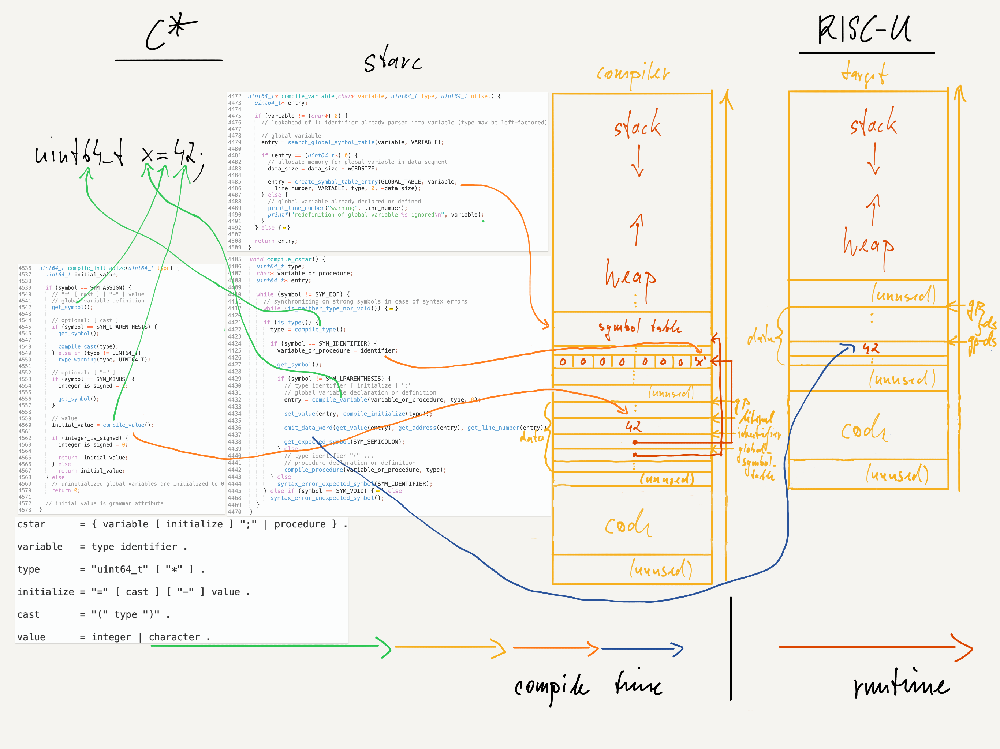

The above figure shows what is involved in parsing global variable declarations with optional definition of initial values. As example, we use `uint64_t x = 42;` to declare and define a global variable `x` with its value interpreted as unsigned 64-bit integer and set to the initial value `42`. The syntax of global variable declarations and definitions is specified in the rule for the start symbol `cstar` of the C\* grammar. Hence the procedure `compile_cstar` is in charge of parsing global variable declarations and definitions. It also parses procedure declarations and definitions which we ignore here. The procedure `compile_type` parses the type keyword `uint64_t` followed by an optional `*`. Upon parsing the identifier that is being declared here, the distinction between variable and procedure declaration is not yet known. A lookahead of 1 is still necessary, as mentioned before.

If the next symbol is not a left parenthesis `(`, we know that a variable is supposed to be declared, not a procedure. The procedure `compile_variable` takes the parsed identifier, here `x`, and then checks if the parser has seen a global variable, or even a procedure declaration for `x` before. In that case, a syntax error is reported and the currently parsed declaration is ignored. The names of global variables and procedures must be unique. The parser remembers the names of all global variables, and in fact procedures and other information, in a *symbol table*, which can be thought of as a *database* for symbols. We explain how that works below.

If `x` has not been declared yet, a 64-bit machine word is allocated in the data segment for storing the value represented by `x` at runtime, similar to the memory allocated for big integers and string literals. Then, a new entry in the symbol table is created, remembering `x` along with additional information such as the source code line number of the declaration, the fact that `x` denotes a variable called its *class*, its type, its initial value which is for now assumed to be `0`, and its offset relative to the global pointer in the data segment.

Finally, the procedure `compile_initialize` parses the optional definition of an initial value, here `42`. The value itself is parsed by the procedure `compile_value`. When done, the value `42` is returned to `compile_cstar` which in turn sets the initial value of `x` to `42` in the symbol table entry for `x`. At this point, the parser is ready to emit the value `42` into `data_binary` using the procedure `emit_data_word`, similar to what is done for big integers and string literals. Recall the procedure `emit_string_data`. That procedure uses `emit_data_word` as well.

In fact, have a quick look at the procedure `load_string` again. Turns out that string literals, and even big integers, are remembered in the same symbol table as variables and procedures. However, the same string literal, or big integer, is perfectly fine to appear in different places in the parsed source code, so there is no syntax error message if they do. Why do we then remember them? Well, read the code carefully. If a string literal is already in the symbol table, we simply do not allocate memory for it anymore, but just reuse the address of the same string literal we parsed before. The same applies to big integers. Reusing the memory for string literals saves more than 2KB in the data segment when self-compiling selfie. Not much but the implementation is so simple, we just could not resist doing that little optimization.

Let us point out that global variable declarations and definitions do not result in any code generation, only data generation. Code is only generated when variables are actually used, and defined in assignments.

#### Variable Use

Using a variable, or a formal parameter for that matter, that is, using its current value in a calculation, to be more precise, is only possible in exactly one spot in the C\* grammar, namely where the symbol `identifier` occurs in the rule for `factor`:

```ebnf
factor = [ cast ] [ "-" ] [ "*" ]
         ( "sizeof" "(" type ")" | literal | identifier | call | "(" expression ")" ) .

...

call   = identifier "(" [ expression { "," expression } ] ")" .
```

In other words, we need to take another look at the procedure `compile_factor` for parsing a `factor`. The relevant part of the grammar also shows that there is a lookahead of 1 necessary to be sure that we are dealing with a global or local variable or a formal parameter, and not a procedure call.

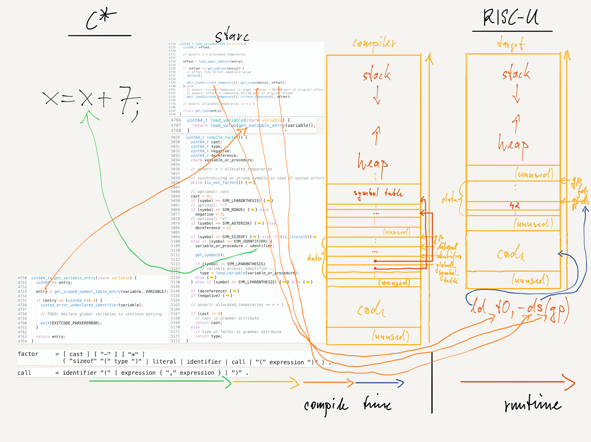

The above figure shows how variable use is parsed and how code is generated for that. As example, we use an assignment `x = x + 7;` where only the second occurrence of `x` is relevant since it denotes the use of `x`. The first occurrence of `x` defines the value of `x` which is relevant later when we get to assignments.

Once the parser has figured out through a lookhead of 1 that the parsed identifier does in fact denote the use of a variable or formal parameter, not a procedure call, the procedure `load_variable` is invoked. That procedure first invokes the procedure `get_variable_entry` to see if the parsed identifier denotes a variable or formal parameter that has actually been declared before. To do so, something almost magical happens. Well, we probably exaggerate but still there is something very powerful about what is done next.

> Scope: global versus local

Remember our discussion of global versus local variables and formal parameters? The key difference is their *scope* and *memory*, that is, where in source code they can be used and where in memory their values are stored. In our example, we have actually not specified whether `x` denotes a global or local variable or even a formal parameter. In fact, `x` could denote both a global variable and a local variable or formal parameter in which case its role as local variable or formal parameter takes priority over its role as global variable. So, how do we figure out what is going on?

> Symbol table: global versus local

There are different choices but one choice in particular is arguably the simplest. We use two symbol tables rather than one: a *global symbol table* and a *local symbol table*. The global symbol table is where we gather information about global variables, big integers, string literals, and procedures. The local symbol table is where we gather information about local variables and formal parameters of a procedure. Whenever we are trying to find information about an identifier that is supposed to denote a variable or formal parameter, we first check the local symbol table, and only refer to the global symbol table if the local symbol table did not return anything. This is exactly what the procedure `get_scoped_symbol_table_entry` does.

If there is no entry in neither the local nor the global symbol table, meaning the identifier has not been declared yet, the compiler reports a syntax error and terminates. That behavior is a bit lazy and could be improved since the use of a variable can be seen as an implicit declaration. In other words, the compiler could do what it does for an explicit declaration anyway. Only determining the type of a variable may be more involved, requiring an analysis of the context in which it is used. Production compilers do all that and programming languages other than C and its derivates allow and even encourage the use of undeclared variables. Mostly for simplicity, we do not do any of that in the selfie compiler.

While the global symbol table persists during parsing, a local symbol table does not, simply because it is only needed when parsing a given procedure declaration or definition. Upon moving on to parsing the next procedure, a new, empty local symbol table is created. This means that the global symbol table may get rather large, in fact asymptotically as large as the source code, while a local symbol table may only get as large as the largest procedure in the code. Keep that in mind as we look into the details of symbol tables. We get back to local symbol tables when we explain how procedures are handled by the compiler.

> Using is loading, defining is storing

Alright, once the parser has found an entry, here for `x`, in one of the two symbol tables, it is time to generate code for loading the current value of `x` into a register by invoking the procedure `load_value`. Besides allocating a temporary register, the challenge is to determine the address of where the value is stored in memory. Ultimately, the address is composed of a register, that is, either the `gp` register for global variables or the `s0` register for local variables and formal parameters, as provided by the procedure `get_scope`, and the offset relative to that register, as provided by the procedure `get_address`. This is only a slight misnomer since `get_address` does indeed return an actual address for entries that represent procedures. Either way, offsets may or may not fit into 12 bits. If they do not, code generation is a bit more involved, see the source code for the details. If the offset does fit, only a single load instruction is generated, as shown in the above figure for the case of `x` being a global variable. When we get to assignments, we see that the only difference between using the current value of a variable versus defining it, as in `x = x + 7;`, is that a store instruction is generated, instead of a load instruction but with the exact same parameters as the load instruction. We finally made it to our last big topic before looking into expressions.

#### Symbol Table

A symbol table is our first example of a non-trivial data structure where there is a lot to learn. An interesting observation is that compiling most aspects of programming languages does not even require symbol tables. Only when it comes to handling a context larger than, say, a line of code, up to even the whole program, finite state machines, even with stacks, reach their limits. We need something that remembers what we have seen, possibly in any order, so that we can use it properly later.

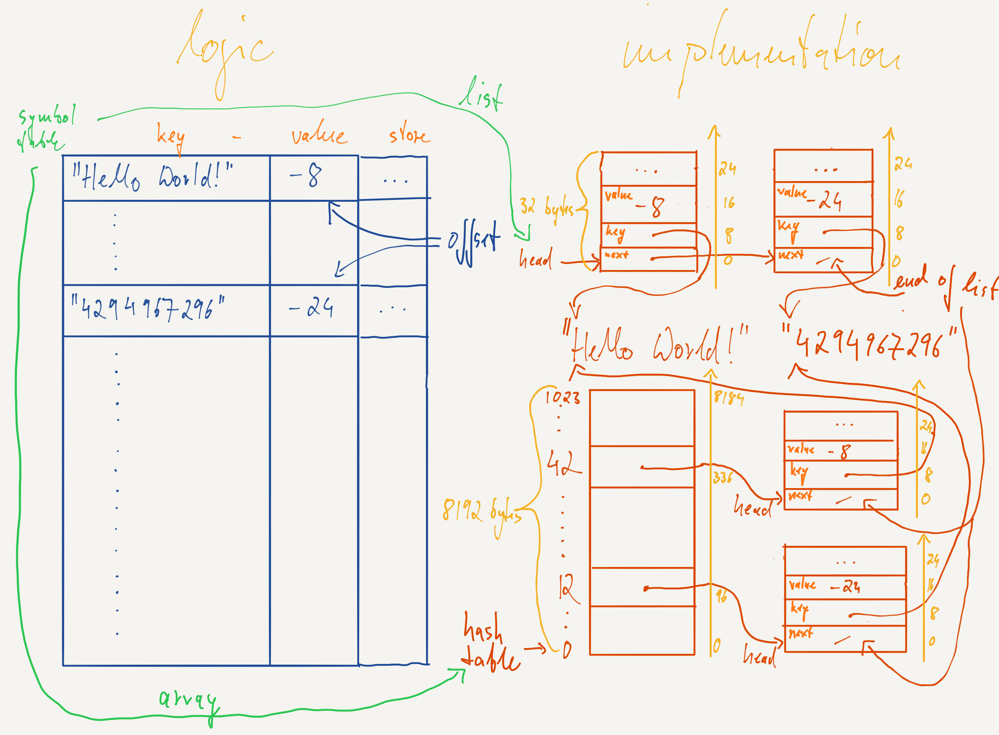

The idea of a symbol table is to keep track of symbols that have grammar attributes that are relevant elsewhere in the code such as their class and type as well the address in memory where the value they might represent is stored, and even the line number where they occurred in source code. A symbol table is a *database*, or more specifically, a *key-value store* that maps a "key", here a symbol, to a unique "value", here the attributes of the symbol. Whenever the parser encounters a symbol with attributes it may store the symbol with its attributes in the symbol table. Later, the parser may search the symbol table to find out about the attributes of a given symbol. The above figure shows an example of a symbol table with entries for an identifier `x` and a string literal `"Hello World!"`. Their "keys" are the strings `"x"` and `"Hello World!"`, respectively. Their "values" are the offsets relative to either the `gp` or `s0` register of where their actual values are stored in the data segment at runtime. We also store other attributes and mention some of them below.

> Data structures and algorithms

The important insight here goes far beyond symbol tables which are our first example of a *data structure* for encoding *composite* information beyond strings and *scalar* information such as integers, characters, and pointers. The key to understanding data structures is to distinguish explicitly their functional *logic*, typically in some informal form of *specification*, from their algorithmic *implementation*, or in short the what from the how. Abstract models of computation such as finite state machines could be used in formal specifications of data structures but are often either not sufficiently expressive or difficult to use. Every data structure has a functional purpose but may be implemented in different ways which dictate its temporal and spatial performance, and algorithmic complexity. The above figure shows the logic of a symbol table and two different ways of achieving the same logic using two different implementations with different algorithmic complexity. Lots of other choices are possible too, we only show the two choices that are actually implemented in selfie.

> Application programming interface

When it comes to designing data structures, and in fact many other things, as we saw before, logic is first and implementation is second. We first need to be clear on what functional logic we actually want from a data structure and then write it down as a list of procedures that form the *application programming interface* or *API* of the data structure. A symbol table, for example, comes with only two functions implemented by a procedure for inserting data into the symbol table and a procedure for retrieving data from the symbol table. In selfie, they are called `create_symbol_table_entry` and `search_symbol_table`, respectively. The former obviously creates a new entry in the symbol table, given a symbol and its attributes. The latter searches the symbol table, given a symbol, and returns its attributes, if there is an entry for the symbol in the symbol table. Otherwise, it returns a *null pointer* which is, as the name suggests, the value `0` interpreted as pointer.

Unfortunately, there are also some subtle issues here that make things a bit more complicated. For example, what happens if we create an entry for a symbol that already has an entry in the symbol table? Logically, we do not want multiple entries for the same symbol and we could easily avoid those in an implementation by always searching the symbol table for a given symbol before creating an entry for that symbol. However, always searching the symbol table may be slow and often not even necessary, in case we know that a given symbol cannot have an entry yet. Also, there may be situations where we need to know if there was an entry or not before creating one. The lesson to be learned here is that all those subtleties can and should already be considered before even worrying about any implementation. In our experience, however, many people, including us, often rush to an implementation without getting the logic right first. The result is an unpleasant back and forth between logic and implementation until things work out properly.

> Lists versus arrays: to point or not to point?

Hard to believe, but there are only two fundamentally different choices to be made when it comes to implementing data structures. It all comes down to their layout in memory and how to navigate that layout. This is a prime example of how the properties of digital memory technology dictate programming. We may either use pointers to create composite *list*-like structures in memory *explicitly* or contiguous blocks of memory that represent composite *array*-like structures *implicitly*, or in fact any combination of both. This even applies to modern high-level programming languages that do not feature pointers explicitly. Under the hood, they all use pointers anyway making you a better programmer if you know what they are, and possibly a not-so-good programmer if you do not.

A *list* is essentially a pointer, called *head pointer* or just *head*, that points to a sequence of contiguous memory blocks, called *list elements*, that may be allocated in memory in any order but are linked by pointers in exactly one list order. Lists can easily grow and shrink in length during runtime by manipulating the pointers that form the list. In contrast, an *array* is a pointer to a fixed sequence of machine words, here called *array elements*, that are typically stored in a single contiguous memory block whose size is also fixed when allocated.

The above figure shows our list and array implementations of a symbol table in selfie. The list implementation maintains a *singly-linked list* of *symbol table entries* where each entry is represented by a 64B array of 8 64-bit machine words. The array implementation is an 8KB array of 1024 64-bit machine words where each machine word is interpreted as a head pointer to a list-based symbol table. The 8KB array implements a *hashtable*, here over list-based symbol tables, to speed up search while maintaining speed of insertion. Logically, however, the hashtable is seen as a single symbol table albeit made up from 1024 smaller symbol tables. It is a truly fascinating example of data structure magic that we explain in a moment.

> Fields of data

While the 1024 machine words of the 8KB array are all interpreted the same, the 8 machine words of the 64B arrays are not. We therefore do not call the 8 machine words array elements but *fields*. The first field is interpreted as a pointer to the *next* list element in the list, also called *next pointer*. The end of the list is marked by a null pointer as next pointer. The second field is interpreted as a pointer to the "key" of the symbol table entry, here the string identifying the symbol. The address of the 2-nd field in memory is, counting from 0, 1 times 8 bytes above where the list element is located in memory, as shown in the above figure. The 7-th (!) field is interpreted as a signed integer that represents part of the "value" of the symbol table entry, here its address in the data segment as offset relative to either the `gp` or `s0` register. The address of the 7-th field in memory is, again counting from 0, 6 times 8 bytes or 48 bytes above where the list element is located in memory. There is also a field not shown here for storing which of the two registers is used, so exactly the information we need to remember. The other fields contain attributes not relevant here.

> Indexing

The key advantage of fields, and array elements in general, is that given an integer `i` into the array called an *index*, it only takes constant time to compute the address of the `i`-th element in memory just involving elementary arithmetic, which is possible if arrays are represented by contiguous blocks of memory, and they mostly are, including in selfie. Another example is the 13-th array element in the hashtable which is, again counting from 0, 12 times 8 bytes or 96 bytes above where the hashtable is located in memory, as shown in the above figure. Similarly, the 43-rd element is 42 times 8 bytes or 336 bytes above the beginning of the hashtable. The address calculation uses what is called *pointer arithmetic*. We see below how that works in details. In contrast to arrays, finding the `i`-th element in a list takes linear time in the value of `i` since we need to traverse the list to find the element. If this is done often, even for small values of `i`, using an array will be much faster. However, there is, as always, a price to pay for using arrays which is memory fragmentation. If we use lots of arrays of different size and keep allocating and deallocating them, memory fragmentation may become an issue and eventually result in performance degradation when trying to decrease memory fragmentation.

> Structs by convention

Readers familiar with the programming language C might be puzzled by our choice of terminology here. So let us try to clear things up. First of all, C features arrays but C\* does not. In fact, unlike C\*, C also features what is known as *structs*. The problem is that we use both, implicitly as concept, but do so by convention using pointers without supporting arrays and structs explicitly in C\*. This keeps selfie simple, and, very importantly, gives students the opportunity to implement explicit support of arrays and structs in homework assignments. We point those out below.

Essentially, structs are here similar to arrays but with fields that all have the same size, one machine word each, and which may be interpreted differently, as integer or as pointer. In order to keep the code organized and readable, we use *getters* and *setters* by convention to access individual fields. For example, given a list element, the procedure `get_next_entry` returns the next pointer to the next list element in the list-based implementation of our symbol table. Similarly, the procedure `set_next_entry` sets its next pointer to the next list element. There are also getters and setters for all other fields such as the procedures `get_scope` and `get_address` that we saw before, and for other data structures altogether. For example, `get_address` is implemented by a single return statement `return *(entry + 6);` which returns the 7-th field of a symbol table `entry`. However, the `+` operator performs pointer arithmetic in this case meaning that it actually adds not just 6 to the value of `entry`, which is interpreted as pointer, but 6 times 8 or 48 which, as we mentioned before, is exactly the number of bytes above the machine word where `entry` points to in memory, and thus where the 7-th field is located in memory. Pointer arithmetic appears to be strange but does make sense as soon as we get to it in more detail and clear up the mystery. For now, see the selfie source code for the details on other getters and setters.

> The algorithm of a data structure

So, how does insertion of new list elements and finding them later in a list work? Insertion is easy. Just allocate memory on the heap for a new list element, populate its fields with data, in particular set the first field to the *head* of the list, which is a pointer to the currently first element of the list. The head pointer may also be a null pointer if the list is empty. Finally, update the head pointer to point to the new list element. In other words, insert the new element at the beginning of the list. Finding a list element is easy too. Given a symbol you are looking for, just go through the list from beginning to end and compare the "key" of the symbol with the "key" of each list element. If you find a match, return the pointer to the matching list element. If not, return a null pointer. How long does insertion and search take, asymptotically? Well, insertion takes constant time because it always takes the same amount of work no matter how long the list is. Search, however, takes linear time in the length of the list, in the worst case, which matters if we are interested in asymptotic complexity.

Is this a problem? It could be, if the list gets really long. In selfie, we actually use different symbol tables for different purposes. Some remain short such as local symbol tables, others not such as the global symbol table. For the latter, we decided to speed up search, in practice, not asymptotically, at least not in general, without making insertion asymptotically slower. In general, this is not easy to do. Usually, speeding up parts of an API, especially asymptotically, comes at the cost of making other parts of the API asymptotically slower. Also, doing so often requires more memory, even asymptotically, making it yet another instance of a time-space tradeoff. Computer scientists working on data structures and algorithms know all too well about that. It is a fundamental, seemingly endless intellectual challenge. Countless textbooks and entire careers have been devoted to that topic, see our recommended readings.

How can we make searching a list faster? Well, we can break up the list into smaller lists in such a way that we only need to search a few or ideally just one of the smaller lists. There are different ways to do that and we could go on about them until the end of time. Instead, we only present the arguably simplest way using a hashtable. The concept of a hashtable exploits the fundamental advantage of arrays over lists: the constant access time through indexes! Instead of maintaining a single list of symbol table entries, we use, say, 1024 lists which are all empty in the beginning, just like the single list. Where do we store the 1024 head pointers? Well, in a hashtable which is here, again, an 8KB array of 1024 64-bit machine words that are interpreted as pointers, initially set to `0`.

> Hashing

Now, for insertion we need to figure out in which list we actually insert a given symbol and its attributes. This is where *hashing* comes in. The problem is that we can only identify a list among the 1024 lists by its index in the array or, well, hashtable. So, how do we get from a symbol to an index? We *hash* the symbol, that is, we design and implement a function that maps symbols to indexes.

> Hash collisions

There are endless ways to do that which can nevertheless all be assessed by essentially two characteristics: how long does it take to compute the hash and how likely is it that two different symbols hash to the same index? The latter is called a *hash collision*. If computing the hash takes too long, that is, essentially more than constant time, the advantage of using a hashtable may disappear, or even turn into a disadvantage. If many different symbols hash to the same index, then they all end up in the same list, which means that, again, the advantage may become a disadvantage. In short, a good hash can be computed fast in constant time and has a high chance of preventing hash collisions. The size of hashtables plays an important role too. The bigger it is the higher the chances are of preventing hash collisions, at the expense of increased memory consumption, of course. What about searching for a given symbol? Easy. We hash the symbol to its index and then only search the list with that index. Done.

> Practice!

Good hashing does improve temporal performance but not asymptotic complexity. Here, insertion and search still take constant and linear time, respectively. Why did we pick 1024 lists as size of our hashtable in selfie? We did that by running experiments with different sizes. It turned out that during self-compilation less than 1024 lists increased hash collisions while more than 1024 lists did not decrease hash collisions significantly anymore. After compilation, selfie even reports the number of symbol table lookups as well as the number of iterations taken on average per lookup. Self-compilation takes around 20 thousand symbol table lookups which in turn take 2 iterations on average per lookup, that is, a total of around 40 thousand iterations in all lookups combined, as opposed to more than 500 iterations on average per lookup and a total of around 10 million (!) iterations in all lookups combined without using a hashtable. Try that yourself. Just set the global variable `HASH_TABLE_SIZE` in the selfie source code to 1 instead of 1024, effectively turning the hashtable into a single list. Last time we checked, the speedup of self-compilation through our hashtable was more than 60%! That is why we did this, and to teach students the magic of hashing, of course.

> How to hash

Again, there are a lot of ways to compute a hash, we only implemented a simple, constant-time version of hashing a symbol to an index in the procedure `hash` in selfie. On a high level of abstraction, the challenge is to map sequences of bits to typically shorter sequences of bits that are all of the same fixed length in such a way that two different sequences of bits are likely to map to two different sequences of bits of that fixed length. We say likely because it is impossible to guarantee that in general. Hashing generally removes information. In our case, the procedure `hash` maps a string representing an identifier, string literal, or big integer, to an integer that must be an index into our hashtable, meaning that its value can only be between 0 and 1023 since indexes start at 0, not 1. In other words, `hash` maps strings to a 10-bit integer.

The length of those strings is bounded in selfie by whatever bounds we imposed on the length of identifiers, string literals, and big integers. A simple solution would be to iterate over the characters of those strings but that would result in a linear-time algorithm. Instead, we only consider the first 8 characters and, since they all fit into the first machine word representing a string, we effectively consider only a single machine word. This means that any two strings whose first 8 characters are the same, that is, have the same 8-character *prefix*, map to the same integer value. In our case, that is alright. Just check how many pairs of global variable and procedure names have that property in the selfie source code. Not that many, if any. Check the implementation of `hash`, which fits into a single line of code, for the details. The key operation is to divide the value of a simple calculation over the first machine word by 1024 and then use the remainder, which is obviously between 0 and 1023, as index.

> When to hash

Hashtables can be used to speed up search for all kinds of applications, not just symbol tables. Developing a sense for when to use hashtables is not easy though. A common mistake is that developers use them and other more advanced data structures even though using a simple data structure despite its inferior performance is often just fine. A singly-linked list for local symbol tables is an example of that. A good strategy is to implement any desired logic first with the simplest possible data structure, just to get it right in terms of functional correctness. Only later, if performance becomes an issue, it may be worth taking the risk and look into more complex data structures. Complexity should always be justified.

### Expressions

Literals and variables are the most basic form of arithmetic and relational expressions which in turn allow us to formulate arithmetic and relational calculations over literals and variables. Expressions in C\* are therefore the next best candidate to look into. Before we get to the actual grammar of expressions in C\*, let us take a look at a strict subset of the C\* grammar that defines *elementary expressions* which only involve arithmetic operators, literals, and variables:

```ebnf
expression = term { ( "+" | "-" ) term } .

term       = factor { ( "*" | "/" | "%" ) factor } .

factor     = literal | identifier | "(" expression ")" .
```

An example of an elementary expression is `x + 7` which we saw before when parsing literals. Three more examples that help in the discussion below are the elementary expressions `x + 7 * y`, `x - 7 + y`, and `x + 7 - y`.

> Precedence

The expression `x + 7 * y` demonstrates the notion of *precedence* of operators which we discussed before in the context of arithmetic expressions as well as grammar expressions. For example, the expression `x + 7 * y` is grouped as in `x + (7 * y)`, in particular in contrast to `(x + 7) * y`. In other words, the operator `*` has precedence over the operator `+`. More generally, the operators `*`, `/`, and `%` have precedence over the operators `+` and `-`. Recall that operator precedence is already expressed syntactically in the structure of the grammar where the operators with lower precedence appear in grammar rules that use the grammar rules involving the operators with higher precedence, and not the other way around. That structure is maintained in the part of the recursive-descent parser that handles expressions.

> Associativity

But what if some operators have the same precedence such as `+` and `-` as well as `*`, `/`, and `%`? In that case, *associativity* of operators determines grouping. For example, the expression `x - 7 + y` is grouped as in `(x - 7) + y`, again in particular in contrast to `x - (7 + y)`. This is because the `-` operator is *left-associative* in C\*, in fact along with the other arithmetic and even relational operators in C\*, which means that expressions are grouped from left to right across operators of the same precedence. Associativity, however, cannot be expressed in EBNF. It only shows up in the parser that handles those operators, as we see below.

Are there also *right-associative* operators in C\*? Yes, we discuss them as soon as we are done here. Making the `-` operator left-associative makes sense because subtraction is left-associative in elementary arithmetic, along with division and remainder. But what about operators that are actually *associative* in elementary arithmetic such as `+` and `*`? After all, expressions with addition and multiplication can be grouped in any order without an effect on the outcome, at least in elementary arithmetic. Why do we make even them left-associative in C\*, and in fact many other programming languages? Well, mixing associativity of operators with the same precedence may result in grouping conflicts. For example, how would you group the expression `x + 7 - y` if `+` was right-associative? Is it `(x + 7) - y` or `x + (7 - y)`? The former respects left-associativity of `-` but not the right-associativity of `+`, and the latter vice versa. So, left-associativity for `+` and `*` it is.

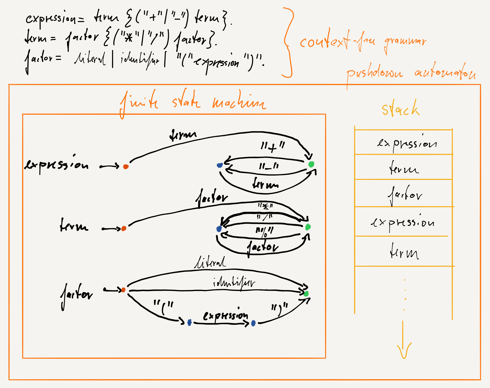

The above figure shows the pushdown automaton that handles the grammar of elementary expressions. Recall that a pushdown automaton is a finite state machine with a stack. The implementation of that pushdown automaton in a recursive-descent parser implicitly maintains the stack of the automaton using the call stack for procedures. In selfie, those procedures would be the parser procedures named `compile_X` that handle the grammar rules defining non-terminals `X`. For example, similar to the non-terminal `factor` implemented by the procedure `compile_factor`, the non-terminals `expression` and `term` would be implemented by procedures called `compile_expression` and `compile_term`, respectively. The interesting case where these procedures actually form a recursion is the occurrence of the grammar expression `"(" expression ")"` in the right-hand side of the grammar rule that defines the non-terminal `factor`. The procedure `compile_factor` does indeed call the procedure `compile_expression` recursively to handle that part of the rule.

The full C\* grammar of expressions extends the grammar of elementary expressions with the full grammar rule for the non-terminal `factor` and a new grammar rule for comparison operators, which have lower precedence than all other operators, replacing the grammar rule for elementary `expression` which still appears but now defines the non-terminal `arithmetic` instead:

```ebnf
expression = arithmetic [ ( "==" | "!=" | "<" | ">" | "<=" | ">=" ) arithmetic ] .

arithmetic = term { ( "+" | "-" ) term } .

term       = factor { ( "*" | "/" | "%" ) factor } .

factor     = [ cast ] [ "-" ] [ "*" ]
             ( "sizeof" "(" type ")" | literal | identifier | call | "(" expression ")" ) .
```

The arithmetic and comparison operators used in the first three rules are all *binary* operators in the sense that they have two operands. In contrast, the `cast`, minus, and dereference operators used in the rule for `factor` are *unary* operators with only one operand. Notably, the keyword `sizeof` also denotes a unary operator, not a procedure, which, in C\*, can only be applied to a `type`! In C\*, the unary operators have highest precedence among all operators in expressions and, notably, are all *right-associative*. For example, the expression `*x + 7` is grouped as in `(*x) + 7`, not `*(x + 7)`.

> Ambiguity and determinism

Precedence and associativity groups expressions in ways which, ideally, are as close as possible to what we already know as something that works well such as elementary arithmetic. More importantly, however, is to group any expression in exactly one way, not two, or even more, removing all *ambiguity* from syntax because unambiguous syntactical structure is a prerequisite for *determinism* in semantics. In other words, what we really want is that any expression actually means exactly one thing and one thing only, again not two, or even more. In fact, we also want that from whole programs, not just expressions.

Just imagine for a moment that the semantics of source code would be *non-deterministic*, that is, the code could have more than one meaning. In that case, its actual meaning during execution would depend on the compiler, the libraries, and the machine you use for compilation and execution. If you later decide to deploy the same source code in a different setting you could see different behavior. In short, establishing correctness would be even harder because you would have to develop the code with all its possible meanings in mind.

Still, are there programming languages with non-deterministic semantics? Yes, C, for example, and the reason is performance. The potential presence of non-determinism in the context of programming languages gives compilers more freedom in optimizing code. Also, removing all sources of non-determinism from a programming language is not easy. Everything, even the smallest detail, has to be defined. We tried our best to remove the non-determinism in C from the semantics of C\* but at least the procedures for input and output and memory allocation in selfie may still be non-deterministic.

> Order of evaluation and side effects

Are precedence and associativity enough to make the semantics of expressions deterministic? For elementary expressions, the answer is yes! However, for C\* expressions, the answer is no! While precedence and associativity determine syntactical structure, they do not determine *order of evaluation* of individual parts of expressions. For example, the order of evaluation in an expression such as `x + y` is obviously not relevant, that is, the value of `x` could be determined before or after the value of `y` without an effect on the outcome. In fact, any order of evaluation in elementary expressions is fine. However, in C\* expressions, there are cases in which the order of evaluation could matter, namely, in the presence of procedure calls.

For example, evaluating `x` before or after calling a procedure `p` in an expression `x + p()` could make a difference. How is that possible you might ask? Well, `p` can have *side effects* on the program state beyond just computing a return value. For example, `p` could have a side effect,  if `x` is a global variable, by changing the value of `x`. In that case, the order of evaluation in `x + p()` would obviously matter. How do we solve that problem? Well, the selfie compiler generates code that always evaluates left operands before right operands, and each operand exactly once. Still, if procedure calls were not allowed in expressions, we could in principle generate code that evaluates operands in any order without effecting the outcome.

> Undefined behavior

How do designers of languages such as C and its derivates solve the problem? The answer might surprise you. Essentially, they call potential sources of non-determinism *undefined behavior* and leave it to the programmer to avoid that by following a list of complex rules that define those potential sources of undefined behavior. Yet their presence in code can in general not be detected by compilers. The aim is to increase the potential for code optimization and thus performance, for example by exploring different orders of evaluation through reordering of machine instructions. This is another example of a fundamental tradeoff, this time between performance and determinism. In the computing chapter, we get back to that tradeoff in a different but related context.

An important lesson to learn here is that the semantics of code can be a lot more involved than one might think. Formalisms such as programming languages, even simple ones like C\*, are very powerful tools. There is no such things as casual programming, only casual expectations. If correctness of code does not matter too much, fine, but if it does, proper education is the only way, and a lot more fun than not knowing what is actually going on. So, keep going.

In the following, we explain code generation, first for arithmetic operators, since it is the simplest case, then for comparison operators, which is a bit more involved, and finally for the unary minus and dereference operators. Casting does not involve code generation as mentioned before.

#### Arithmetic Operators

Compiling arithmetic operators is surprisingly simple as long as there are machine instructions that match the semantics of those operators. In case of C\* and RISC-U they do. To some extent this is also true for comparison operators but only when considering all of RISC-V, not just RISC-U. We therefore look into compiling comparison operators after we are done with arithmetic operators. Among the arithmetic operators of C\*, the operators for multiplication, division, and remainder are even a bit easier to handle than the operators for addition and subtraction since the latter have different semantics depending on the type of their operands. So, for now, let us take the expression `x * 7` as example, instead of `x + 7`.

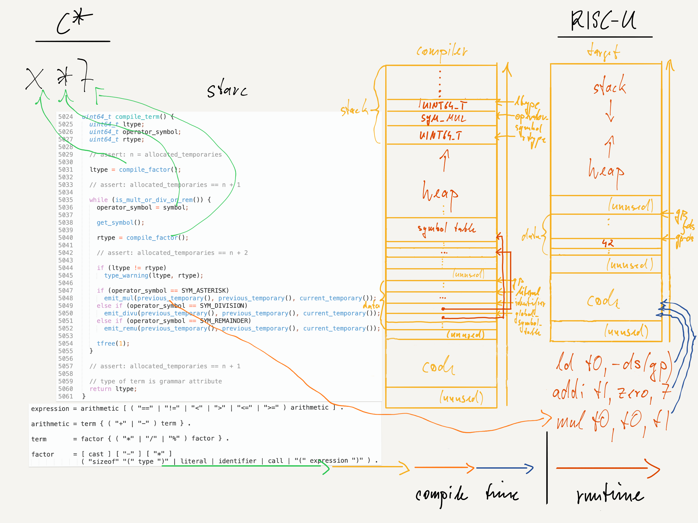

The above figure shows how the procedure `compile_term` implements the grammar rule that defines the non-terminal `term`, including emitting code. As before, the first occurrence of the non-terminal `factor` is handled by a call to the procedure `compile_factor`, followed by a `while` loop that iterates of any number of occurrences of the `*`, `/`, or `%` symbols, and another occurrence of `factor`, which again is handled by a call to `compile_factor`. Besides checking and remembering the type of each factor in local variables `ltype` and `rtype` on the call stack, where `ltype` eventually becomes the type of the parsed term and is return as grammar attribute, the code also remembers the currently parsed operator symbol in a local variable called `operator_symbol`, also on the call stack. This is important. If we just continued parsing without remembering the operator symbol, we would not know what the operator is anymore after parsing the following factor.

> From infix to postfix

What effectively happens here is that the code turns *infix* operators into *postfix* operators which requires remembering the infix operator symbol. The binary operator `*`, as well as all other binary operators in C\*, is infix because it occurs in between its two operands, here `x` and `7`. However, the generated machine instruction that implements `x * 7` is postfix because it first loads both the value of `x` into register `t0` using the machine instruction `ld t0,-ds(gp)` and the value `7` into register `t1` using `addi t1,zero,7`. Only then, with both operands in registers, the machine instruction `mul t0,t0,t1` generated here implements the operator `*`. For the operators `/` and `%`, code generation works the same way but using the `divu` and `remu` instructions, respectively. That's it!

> Running out of registers

Well, not quite. Notice the call to the procedure `tfree`. This is important too. The most recently allocated register, here register `t1`, is actually not needed anymore as soon as the calculation is done, at runtime! This means we actually have to deallocate it and thus make it reusable for other purposes, at compile time! Otherwise, we would sooner or later run out of registers. Speaking of which, can we actually run out of registers at compile time? Yes, of course. Try to design an expression for which the selfie compiler does indeed run out of registers. Hint: grouping nested subexpressions does the trick. For example, the expression `x * (x * (x * 7))` requires a total of four temporary registers and thus still compiles. Extend the expression until the selfie compiler fails.

Could we enhance the compiler to handle any syntactically valid expression? Yes, of course. One way to do that is to use memory as temporary space for saving register values. However, doing so results in machine code that stores and later loads those values again which may be slow. Moreover, there is significant complexity involved in doing this correctly in the compiler. As usual, we have avoided that complexity and instead report an error and terminate. Yet modern production compilers do address the problem more thoroughly.

> Efficient use of registers

There is another related problem which is the efficiency of using registers. The register allocator in the selfie compiler is a stack allocator which means that temporary registers are used unevenly. In fact, register `t0` is used the most, followed by register `t1`, and so on. You can actually see that by looking at the output of self-compilation of selfie. Try:

```bash
make self-self
```

The relevant output is at the very end:

```
./selfie: t0 register:   460293569,230243247,230050322[1.00]
./selfie: t1 register:   184970699,92509323,92461376[1.00]
./selfie: t2 register:   39760688,19880344,19880344[1.00]
./selfie: t3 register:   932838,466419,466419[1.00]
./selfie: t4 register:   102700,51350,51350[1.00]
./selfie: t5 register:   82160,41080,41080[1.00]
./selfie: t6 register:   20540,10270,10270[1.00]
./selfie: temps total:   686163194,343202033,342961161[1.00]
```

For example, register `t0` is accessed around 460 million times, roughly half by reading its value and the other half by writing its value, that is, by a ratio of reads and writes by around 1. Register `t1` is already accessed a lot less, and so on. However, the ratio of reads and writes is about the same for all. Stack allocation for register allocation is clearly visible in these numbers. However, the actual problem is the ratio of reads and writes. It would be better if there were more reads than writes per register because that would mean that registers would be used as actual memory, preventing unnecessary slower main memory access. We could achieve that by using a more involved algorithm for register allocation.

> Constant folding

Before moving on there is yet another opportunity here to talk about code optimization. What if we compile an expression with constant operands such as `42 * 7`, for example? The selfie compiler would still generate code for that even though it could easily figure out to which value the expression evaluates, and then just use that value, instead of generating code for the whole expression. Doing so is called *constant folding* which is arguably the most basic form of code optimization, and implemented in virtually all production compilers. In other words, if spelling out `42 * 7` in your code, instead of just saying `294`, makes the code more readable, keep it and do not worry about performance. Your compiler takes care of that, and many other apparent inefficiencies.

The other reason we mention constant folding is because it beautifully shows the tradeoff between compile time and runtime. The more time we spend at compile time trying to compute as much as possible just once before generating code, the more time we may save at runtime recomputing values again and again that could have been computed just once before. While constant folding is relatively easy to do and an interesting exercise for students, other code optimization techniques can be a lot more involved but nevertheless explore the same tradeoff.

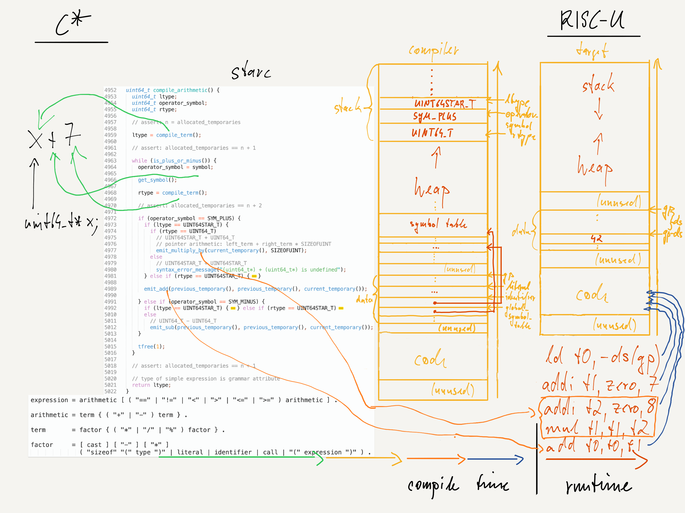

Compiling arithmetic expressions with operators for addition and subtraction works the same way as compiling terms with operators for multiplication, division, and remainder. Code generation just uses the `add` and `sub` instructions for the operators `+` and `-`, respectively. The above figure shows how the procedure `compile_arithmetic` implements the grammar rule that defines the non-terminal `arithmetic`, including emitting code.

> Type polymorphism through overloading, again

An interesting twist, however, is that both `+` and `-` are *overloaded* operators in C\*, and many other programming languages, with *type polymorphism*, as mentioned before. Their semantics depends on the type of their operands. Fortunately, there are only two types in C\* for unsigned integers and pointers to unsigned integers denoted `uint64_t` and `uint64_t*`, respectively, leaving us with four combinations for each operator. In the following, we focus on addition. Subtraction is handled similarly but not exactly the same as addition. Refer to the source code of selfie for the details.

The simplest combination of types is if both operands are of type unsigned integer. In that case, generating a single `add` instruction, or `sub` instruction, is sufficient. Another simple case is if both operands are of type pointer to unsigned integer. That case is actually an error with addition, but not with subtraction, and reported as such yet without terminating compilation.

> Pointer arithmetic

The two remaining cases are symmetric with addition, so we only focus on the case where the left operand is of type pointer to unsigned integer and the right operand is of type unsigned integer. Our example in the above figure is the expression `x + 7`. Turning the example into the case we are interested in here is easy, just declare the variable `x` to be of type `uint64_t*`. What happens then is that the semantics of the `+` operator changes from integer arithmetic to *pointer arithmetic*. For the sake of an example, suppose that the value of `x` is `42` which is not even a valid memory address in our machine model since `42` is not a multiple of `8`, the size of a machine word in bytes. But never mind, it works either way. Clearly, you would think that `x + 7` evaluates to `49` in that case which is true but only if `x` is of type `uint64_t`. If `x` is of type `uint64_t*`, however, `x + 7` evaluates to `98`. How does that make any sense?

The expression `x + 7` evaluates to `98` in that case because `42 + 7 * 8` evaluates to `98` where the factor `8` is the size of `uint64_t` in bytes. The idea of pointer arithmetic is to provide a simple way of computing memory addresses in order to access array elements and fields in memory, as we mentioned before. With `x + 7` and `x` being of type `uint64_t*`, we intend to compute the address that is `7` unsigned integers, not bytes, above where `x` points to in memory, simply because `x` is a pointer to unsigned integers. If `x` was a pointer to a type of different size in memory then we would use that size as factor in bytes, instead of `8`. There are plenty of examples in the source code of selfie where we use pointer arithmetic. Check out all those getters and setters we mentioned before. They all use pointer arithmetic.

Generating code that implements pointer arithmetic is not hard. The procedure `emit_multiply_by` emits an `addi` instruction to load the factor, here `8`, into an unused register, here `t2`, followed by a `mul` instruction that multiplies the value of the right operand, here `7`, with the value of register `t2`. After that, the following `add` instruction is the same as the `add` instruction that implements integer arithmetic.

The take away message here is that pure operator syntax does not necessarily determine semantics which can depend on other aspects such as the types of operands, or even more contextual information. People with little programming experience are often not familiar with that and therefore struggle to produce correct code. It is of course possible to introduce a different symbol for, say, pointer arithmetic to make the distinction syntactically explicit. In fact, this has been done, even in programming languages such as C. For example, `x` could be declared as array of, say, 10 unsigned integers using `uint64_t x[10];` instead of declaring `x` as pointer to unsigned integers. Then, the expression `x[7]` would be semantically equivalent to `*(x + 7)` where the leading `*` operator dereferences the memory address calculated by `x + 7`. The details of that are explained below.

> Syntactic sugar

The `[]` operator is considered *syntactic sugar* which makes the code look "sweeter" to humans, that is, closer to what is intended, namely, access of array elements rather than pointer arithmetic which is only a means to get there. However, support of syntactic sugar is not strictly necessary. C\* does not support arrays explicitly in syntax but there is an exercise on implementing array support in C\*. However, doing the exercise requires additional knowledge in how procedures work, so we wait with the exercise until we get to procedures. However, there is an opportunity to do another, very enlightning exercise which helps you deepen your understanding of the material presented so far.

> Bitwise shift operators

C\* only features arithmetic and comparison operators. However, most programming languages also provide *bitwise* operators for manipulating individual bits of data. We discuss bitwise *shift* operators here and bitwise *logical* operators further below. The need for bitwise operators arises because modern computers, for the sake of increased throughput, only allow transferring data at the level of whole bytes or even just words, as in our machine model, but not bits. Also, while bitwise operations can be mimicked using integer arithmetic, native hardware support is obviously much faster and source code using bitwise operators explicitly is certainly more readable. The lack of support in selfie requires us to implement bitwise operators some other way. We choose to do that in library procedures such as `left_shift` and `right_shift` which demonstrate how to mimic bitwise shifting using integer multiplication and division, respectively, see the source code for the details.

Explicit support of bitwise operators in C\* takes us to our first, more advanced exercise that involves code generation and therefore comes in two increasingly challenging parts. The first part called `bitwise-shift-compilation` focuses on handling their syntax. Only the second part called `bitwise-shift-execution` involves actual code generation. Try:

```bash
./grader/self.py bitwise-shift-compilation
```

This exercise involves implementing scanner and parser support of the bitwise *shift* operators `<<` and `>>` which perform logical bitwise left and right shifting, respectively. Interestingly, you do not even need to know what bitwise shifting is to complete the entire exercise. For the first part, you just need to find out what the precedence of these operators in standard C is relative to the already supported operators in C\*. The next step is to enhance the C\* grammar accordingly, followed by the actual implementation in the scanner and parser of selfie.

The second part of the exercise involves not only implementing code generation for these operators in the selfie compiler but also implementing support of the RISC-V machine instructions `sll` and `srl` for logical bitwise left and right shifting, respectively, in the selfie emulator. Try:

```bash
./grader/self.py bitwise-shift-execution
```

The interesting twist of this exercise is that you can and should use the `<<` and `>>` operators in your implementation of the `sll` and `srl` instructions, respectively. In other words, use what you implement to implement it! This is selfie at its best. Recall that the RISC-U instructions are implemented by procedures with the prefix `do_`, look for `do_add`, for example. That procedure ultimately uses the `+` operator to implement the `add` instruction in the selfie emulator while the `+` operator is compiled to an `add` instruction by the selfie compiler.

Do exactly the same in this exercise, and it will work! There is no need to use the procedures `left_shift` and `right_shift` to do that. The reason why this works is because the semantics of the `<<` and `>>` operators in C is exactly the same as the semantics of the `sll` and `srl` instructions in RISC-V. The same is true for the `+` operator and the `add` instruction, and similarly for the other arithmetic operators. Fully understanding how this results in a functioning system is the ultimate goal of this chapter, so keep going.

#### Comparison Operators

C\* features operators for comparing unsigned integer values, see the grammar rule that defines the non-terminal `expression`. The syntax of relational expressions is defined in that rule because all involved comparison operators have lower precedence than any of the arithmetic operators in C\*. For example, the expression `x - 1 < 7` is semantically equivalent to the expression `(x - 1) < 7`, not the expression `x - (1 < 7)`.


The above figure shows how the procedure `compile_expression` works for the operators `==` and `<`, not showing the code for the other comparison operators. Refer to the source code for those. The occurrence of a comparison operator in an expression is optional and thus implemented by a conditional statement that checks if a comparison operator is present or not. In terms of semantics, the first thing we should note is that all comparison operators must evaluate to either `0` or `1`, nothing else, indicating that the comparison evaluated to false or true, respectively.

Before we get to the example in the figure, the expression `x == 7`, consider as example the expression `x < 7` instead. Code generation for the `<` operator is straightforward because the `sltu` instruction in RISC-U matches the semantics of the `<` operator exactly. Recall that `sltu` stores `1` in its destination register, here `t0`, if the value in the first source register, again here `t0`, is strictly less than the value in the second source register, here `t1`, using the unsigned interpretation of those values. Otherwise, `sltu` stores `0` in its destination register. So, for the `<` operator we just generate a single `sltu` instruction, deallocate the second source register, and are done.

Support of the `>` operator is symmetric. Only the other four comparison operators are more involved. We use the `==` operator in the expression `x == 7` as example. How do we make sure that the destination register, here `t0`, only contains `1` if the value of `x` is equal to `7`, and otherwise `0`? Well, `x == 7` is true if and only if `7 - x < 1` is true, assuming, and that is important, unsigned interpretation of the values. In that case, no value other than `0` can be less than `1`, and `7 - x` can obviously only evaluate to `0` if `x` is equal to `7`. So, we first generate code that implements `7 - x` using a `sub` instruction, followed by an `addi` instruction for loading `1`, and finally followed by an `sltu` instruction for the comparison, just like before. That's it! Check the implementation of the other comparison operators. We use similar reasoning there. It's fun.

#### Unary Operators

Besides binary operators, expressions in C\* also feature unary operators for casting, changing the sign of integer values using the unary `-` operator, dereferencing of pointers using the unary `*` operator, and obtaining the size of a type in bytes using the unary `sizeof` operator. All four operators appear, with the first three operators as options, in the C\* grammar rule that defines the non-terminal `factor`, which we saw before, and is implemented in the procedure `compile_factor`, which we also discussed before.

> From prefix to postfix

All four unary operators in C\* are *prefix* operators which means that they appear before, not after, their operand. As with the binary infix operators in C\*, compilation of unary prefix operators requires remembering them until their operand is compiled. Only then, they can take effect through casting or code generation of postfix instructions. With the unary operators appearing as options, this is done in reverse order of their relative occurrence since they are right-associative. So, dereferencing is done before changing signs which is done before casting.

> Unary `sizeof` operator

Compiling the `sizeof` operator is simpler than the others. In C\*, `sizeof` can only be applied to types of which there is only `uint64_t` and `uint64_t*`. In both cases, `sizeof` is supposed to evaluate to the value `8` because storing values of either type requires exactly `8` bytes in memory. Generating a single `addi` instruction that loads `8` into a temporary register does the job.

> Cast

We mentioned the semantics of casting before. Handling the syntax of a `cast` is not difficult but it does involve a lookahead of 1 to distinguish it from grouping an `expression` using left and right parenthesis. See the code of the procedure `compile_factor` shown before to spot the lookahead, or the source code of selfie for the full details. While `cast` appears first in the grammar rule and is thus parsed first in `compile_factor`, its effect only takes place after the rest of the rule is parsed right before `compile_factor` returns the resulting and possibly casted type as grammar attribute.

> Unary minus operator

Next is the optional unary minus operator, denoted `-` just like its binary twin, which is parsed right after the optional `cast`. Again, its effect only takes place after the rest of the entire grammar rule for `factor` is parsed. How do we implement it? Well, the unary `-` operator in expressions such as `-x` is just syntactic sugar for `0 - x`. So, we generate a single `sub` instruction for subtracting the value of `x` from `0` using the `zero` register. Knowing how this is done enables us to go for another exercise.

> Bitwise logical operators

In addition to bitwise shift operators, there are also bitwise *logical* operators in C which give rise to an exercise that involves implementing support of bitwise *AND* denoted `&`, bitwise *OR* denoted `|`, and bitwise *NOT* denoted `~`. The `~` operator is unary and right-associative with the same precedence as the other unary operators in C\*. Try:

```bash
./grader/self.py bitwise-and-or-not
```

As before, determine the precedence of the binary operators in C, which is not the same in this case, enhance the C\* grammar, and only then implement support of them in selfie. You also need to implement support of three more RISC-V machine instructions called `and`, `or`, and `xori`. The `xori` instruction performs bitwise *exclusive-or* or *XOR* on the value of a register with an immediate value. Generate that instruction to implement support of the `~` operator. There are two challenges involved in the exercise beyond what you saw before in related exercises. Firstly, when generating the `xori` instruction you need to figure out which immediate value to use. Hint: the immediate value is always the same. Secondly, while the implementation of the `and` and `or` instructions is straightforward using the `&` and `|` operators, respectively, the implementation of the `xori` instruction is more involved since there is no operator for *XOR* in C\*. However, XOR can be implemented using a combination of the `&`, `|`, and `~` operators. You just need to figure out which combination is correct which does involve understanding what XOR is. You could also implement support of the `^` operator in C for XOR and the `xor` machine instruction in RISC-V and then use the `^` operator in the implementation of the `xori` instruction but that is more work.

Besides support of bitwise logical operators, there is also an exercise on the support of *Boolean* logical operators available in C for constructing logical conditions. The exercise involves implementing support of logical *conjunction* denoted `&&`, logical *disjunction* denoted `||`, and logical *negation* denoted `!`. Similar to the bitwise `~` operator, the `!` operator is unary and right-associative with the same precedence as the other unary operators in C\*. Try:

```bash
./grader/self.py logical-and-or-not
```

Again, determine the precedence of the binary operators in C, which is also not the same in this case, enhance the C\* grammar, and only then implement support of them in selfie. There is, however, no need to implement support of additional instructions. Instead, the challenge is to figure out how to implement operator semantics using the existing machine instructions. Hint: use combinations of `sltu`, `and`, `or`, and `xori` instructions. Combinations of `sltu`, `mul`, `add`, and `sub` instructions also work if you would like your solution to be independent of the previous exercise. All three logical operators must evaluate to either `0` or `1`. In particular, the `&&` operator evaluates to `1` only if both operands evaluate to values that are not `0`. The `||` operator evaluates to `1` only if either one or both operands evaluate to values that are not `0`. The `!` operator evaluates to `1` if the operand evaluates to `0`. In all other cases, all operators evaluate to `0`.

> Lazy evaluation

There is, however, one more thing. The semantics of logical operators in C is actually more involved than the above. The right operands of the `&&` and `||` operators are evaluated *lazily* which means that they are only evaluated if the value to which the left operand evaluates is not sufficient to determine the overall result. For example, an expression `X && Y` evaluates to `0` if the left operand `X` evaluates to `0`, regardless of the value to which the right operand `Y` evaluates. In that case, `Y` is not supposed to be evaluated at all, which is called *lazy evaluation*. Similarly, an expression `X || Y` evaluates to `1` if `X` evaluates to a value that is not `0`, again regardless of the value to which `Y` evaluates. The situation gets quite tricky if logical operators are used in sequence or even nested, which is no problem with *eager evaluation*, as in the above exercise. The solution is to use control flow, in addition to data flow, to implement the semantics of logical operators. We get to an exercise about that in the context of conditionals.

> Dereference operator

The name C\* is inspired by the dereference operator in C denoted by the unary and right-associative `*` operator. That operator is arguably the most important operator in C\* since it provides the only way to access dynamically allocated memory outside of the memory allocated for global variables in the data segment and local variables and formal parameters in the stack segment. Moreover, the dereference operator combined with pointer arithmetic turns all operators for accessing composite information in memory through data types such as arrays and structs into syntactic sugar. Earlier versions of C\* still featured some of these operators until we realized that we could do completely without them and thereby reduce language and compiler complexity significantly. Instead, we turned support of arrays and structs into the subject of homework assignments and exercises. It may be hard to believe but the design of C\* was one of the great challenges in the early days of selfie and took several years going through many iterations to complete.

Compiling the dereference operator is relatively easy because its semantics is close to the semantics of the machine but that is also the source of its biggest drawback. Using the dereference operator properly in C\* and even more so in C is not easy at all. The dereference operator is even infamous for causing many bugs that could be avoided by using arrays and structs, for example. Many programming languages other than C and its derivates therefore do not feature a dereference operator. However, we argue that seeing the dereferencing operator in action is actually a prerequisite to being able to appreciate its absence.

> Dereference semantics

There are at least two problems with dereferencing pointers. Firstly, the dereference operator is only intended to access memory in the heap segment, at least in C\*. However, you can use it to access memory anywhere you like. Just provide a value in an expression and the dereference operator will interpret it as an address and return the value stored at that address, regardless of whether that access is safe or not. For example, the expression `*x` does not evaluate to the value of `x` but instead to the value stored in memory at the address equal to the value of `x`. In other words, `*x` interprets the value of `x` as pointer and dereferences it to obtain the value stored in memory where `x` points to. You can even apply the dereference operator to any expression you like such as in the expression `*(x + 7)`, for example. If `x` is declared as pointer to unsigned integer, `*(x + 7)` evaluates to the value stored in memory 7 unsigned integers above where `x` points to. That takes us to the second problem. If you do not understand pointer arithmetic, as here in `x + 7`, you are likely to struggle in producing correct code in C\*. Many students have that problem.

The problem gets even worse considering that the dereference operator can also be used in the left-hand side of assignments. For example, the assignment `*x = *x + 1` does not increment the value of `x` but instead increments the value in memory where `x` points to. In other words, the `*` operator in `*x` that occurs in the left-hand side of the assignment dereferences `x` but not for the purpose of loading the value in memory where `x` points to but instead for storing a new value there, namely, the value to which the expression `*x + 1` in the right-hand side of the assignment evaluates to. We can easily make that example even more interesting. For example, the assignment `*x = *(x + 1)` does not increment anything but instead copies the value stored in memory 1 unsigned integer above where `x` points to to memory where `x` points to whereas the expression `*(x + 1) = *x` does the opposite.

We discuss compiling the dereference operator as it occurs in expressions here and only explain its use in the left-hand side of assignments right below. Similar to the other two unary operators in C\*, the dereference operator is parsed and remembered as such until after parsing its operand is done in the procedure `compile_factor`. Only then, code is generated for it before code is generated for the unary `-` operator if that operator is present too. The code that implements dereferencing is simple, a single `ld` instruction will do. Suppose the value of the operand is stored in register `t0`. In that case, we generate `ld t0,0(t0)` which loads the machine word stored in memory at address `t0 + 0` into `t0`. That's all. The generated instruction is ultimate proof of what dereferencing really is. Any value can be turned into an address in memory through dereferencing for accessing the value stored there. This is very powerful but power comes with responsibility. This concludes our treatment of expressions in C\*.

> What you see is not what you get

Before moving on, it is time to reflect on what we have seen so far. Expressions in programming languages such as C\* and many other languages have been inspired by elementary arithmetic and mathematical logic, and indeed look very much like expressions used in mathematics. Yet while their syntax is similar and in many cases identical, their semantics is only related but still far from identical. Code generation has told us that once and for all. Integer overflows and wrap-around semantics are probably the most important differences here. Using essentially the same notation in programming languages as in mathematics is an unfortunate choice that was made a long time ago and is now very hard to undo. The reasons are rooted in the origins of computer science in mathematics and therefore certainly understandable but still unfortunate. If programming languages would use their own unique symbols in expressions different from the symbols used in mathematical formulae, the semantical difference would be easier to recognize and acknowledge by everyone. Computer science students would probably have an easier time understanding that all those discrete math and linear algebra classes they have to endure are only there to teach them the foundation of programming language and machine semantics, assuming, of course, that all classes use the notation properly. Even people in general would question the meaning of what they see if they could not relate it immediately yet falsely to something they know. The key lesson for us here is to question the meaning of what you see and educate yourself until you truly know what the actual meaning is.

### Statements

C\* features five *statements* for assignment, conditionals, loops, procedure calls, and returning from procedure calls. We go through them in that order. While covering literals, variables, and expressions required introducing a lot of material, there is not much left we have to introduce. Resolving symbolic references in control flow through fixup chains is essentially the only technique we have not introduced yet. In other words, the worst is over. Superficially, that is somewhat surprising since expressions only occupy a relatively small part of the C\* grammar. However, their semantics is rather dense and complex, or conversely, their syntax is quite compact, even beautiful. Well, the syntax of expressions has been derived from mathematical notation which took centuries to develop whereas the syntax of statements in imperative programming languages is a recent achievement. More modern programming languages than C do in fact show that there is a lot of room for improvement over the syntax of statements in C. Using that modern syntax correctly is, however, not easy, just like writing an expression that is actually correct. In short, with statements in C\* we go from the established to the new, from solid mathematics to work-in-progress computer science.

The syntax of a `statement` in C\* is simple but does involve a lookahead of 1 during parsing to distinguish an `assignment` that begins with an `identifier` from a procedure `call` that always begins with an `identifier`:

```ebnf
statement = assignment ";" | if | while | call ";" | return ";" .
```

The procedure `compile_statement` compiles `statement` after looking for strong symbols that statements begin with such as the keywords `if`, `while`, and `return`, and others, see the procedure `is_not_statement` for the full list. There is an important invariant that `compile_statement` maintains: no temporary registers are allocated before and after compiling any statement! In other words, when compiling a statement all temporary registers are available. However, maintaining the invariant requires of course to deallocate all allocated registers eventually before returning from compiling any statement. We do not show the code of `compile_statement` here since it is straightforward, again see the source code for the details. The first kind of statement we look into is assignments which is the natural choice to talk about after expressions.

### Assignments

The notion of assignment of a value to a variable, or more generally to a memory location, is the key distinguishing feature of imperative programming. The semantics of assignment ultimately requires introducing the notion of program or machine state *before* and *after* executing an assignment. Similar to expressions, we first focus on a strict subset of the C\* grammar that defines *variable assignments* which only enable assignment of values to variables:

```ebnf
assignment = identifier "=" expression .
```

An example of a variable assignment is `x = x + 7`. In terms of syntax, the assignment operator `=` is obviously a binary operator with lower precedence than any other operator in expressions yet the only binary operator in C\* that is right-associative. In other words, `x = x + 7` is grouped as in `x = (x + 7)`, and certainly not as in `(x = x) + 7`. As mentioned before, the left and right operands of `=` are called the left- and right-hand sides of an assignment, respectively.

In terms of semantics, variable assignment first calculates the value to which the `expression` in the right-hand side evaluates, before assigning the value to the variable named by `identifier` in the left-hand side, and only then, after obtaining the value, actually assigns it to the variable, overwriting whatever value was assigned to the variable before the assignment. While the involved values are only known at runtime, their type is already known at compile time and can therefore be checked for compatibility. The type of the right-hand side, or more precisely the value to which the right-hand side evaluates, should be the same as or at least compatible with the type of the left-hand side, or more precisely the type of the overwritten value.

> lvalues and rvalues

An assignment turns the value to which an expression evaluates, called *rvalue*, into a value with a name or memory address, depending on program or machine perspective, called *lvalue*. An rvalue is temporary because next time the same expression may evaluate to a different value, as the expression `x + 7` in our example actually does. An lvalue, however, may persist as part of the program or machine state. Also, an lvalue has an address in memory whereas an rvalue does not. In fact, when generating code for an assignment, the challenge is to calculate the address of that lvalue. In other words, evaluating the left-hand side of an assignment is not about obtaining a value but an address, which in our example is the address of where the value of `x` is stored in memory. How that works we have seen before in the context of compiling variables and formal parameter occurring in expressions. Now, we need to do exactly the same thing but generating an `sd` instruction, instead of an `ld` instruction, for the final step of an assignment.

This takes us to the issue of order of evaluation which is rather sensitive, similar to expressions. Since the addresses of variables and formal parameters in memory are not affected by assignments, the order of evaluating left- and right-hand sides of variable assignments has no effect on the outcome. For simplicity, we therefore decided generating the code that computes the address of the lvalue in an assignment before generating the code that computes the rvalue, followed by generating a single `sd` instruction that completes the actual assignment.

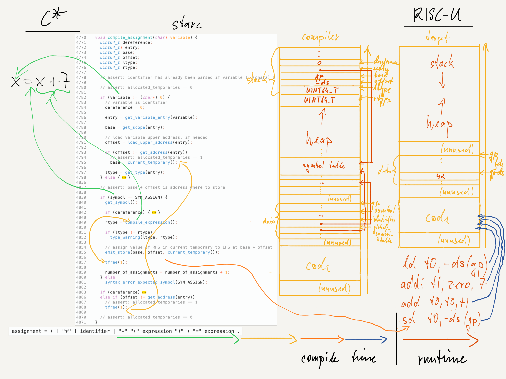

The above figure shows how variable assignments are compiled in the procedure `compile_assignment` using our example `x = x + 7`. The code that handles the full C\* grammar of assignments is not shown. Because of the lookahead for distinguishing variable assignments from procedure calls, `compile_assignment` is invoked with the variable in the left-hand side of the assignment, here `x`, already parsed. In this case, the address of the value of the variable in memory at runtime is determined by searching the global and local symbol tables for the variable, similar to occurrences of variables in expressions. In particular, we determine if the address is calculated relative to the `gp` or `s0` register using `get_scope` and remember that in a local variable called `base`, and we determine the involved offset using `get_address` and remember that in a local variable called `offset`.

Interestingly, there is no code generation necessary if `offset` is a 12-bit signed integer since it fits as immediate value of an `sd` instruction in that case. Otherwise, the procedure `load_upper_address` generates code that adds the uppper, as in more significant, portion of `offset` that does not fit in 12 bits to the `base` register and saves the result in a temporary register which then becomes the `base` register, instead of `gp` or `s0`. The upper portion is then removed from `offset`. The rest is straightforward. After parsing the assignment operator `=`, the expression in the right-hand side of the assignment, here `x + 7`, is compiled by the procedure `compile_expression` returning the type of the value to which the expression evaluates to allowing us to check it against the type of the variable the value is assigned to, here `x`. After that, a single `sd` instruction is generated that stores the value in memory where the `base` register plus `offset` refers to. Before `compile_assignment` returns, the temporary register holding the value of the expression and the `base` register, if temporary, are deallocated, establishing the invariant that no temporary registers are allocated before and after any assignment, assuming that `compile_expression` returns with exactly one more temporary register allocated than before invoking it.

There is one more detail related to profiling source code. The number of compiled assignments is recorded in a global variable called `number_of_assignments` during compilation and reported by the selfie compiler when done. For example, the selfie source code contains more than a thousand assignments. By convention, we name most variables that represent counters with a prefix "number_of_". There are numerous such variables for counting all kinds of things. Search the source code to find them!

The full C\* grammar of assignments introduces the dereference operator applied to variables and even full expressions, in particular involving pointer arithmetic, into the left-hand side of assignments:

```ebnf
assignment = ( [ "*" ] identifier | "*" "(" expression ")" ) "=" expression .
```

An example of a *dereferencing* assignment we saw before that uses the dereference operator in the left-hand side is `*x = *x + 7`. The full semantics of the dereference operator depends on where it is used. If used at the very beginning of the left-hand side of an assignment, the dereference operator returns an lvalue, that is, the value that its operand evaluates to interpreted as an address in memory, not the value that is stored in memory at that address! Otherwise, if used anywhere else, including the grouped expression in the left-hand side of an assignment, the dereference operator has the semantics as in any expression. In other words, it returns an rvalue, that is, the actual value stored in memory where its operand points to, or more precisely, where the value that its operand evaluates to, interpreted as an address, refers to. In our example, `*x` in the left-hand side of the assignment returns the value that `x` evaluates to, interpreted as an address, whereas `*x` in the right-hand side returns, as we explained before, the value stored in memory where `x` points to.

> Order of evaluation

Interestingly, compiling dereferencing assignments is easier than compiling variable assignments. We only need to generate code that loads the value of a variable, simply by reusing the procedure `load_variable` or, more generally, evaluates an expression, by reusing the procedure `compile_expression`, see the source code for the details. However, doing so before generating code that evaluates the expression in the right-hand side of an assignment may result in different semantics than generating the code in the opposite order. For example, just like the expression `x + p()` we mentioned before where `x` is a global variable of type unsigned integer whose value a procedure `p` modifies, an assignment `*x = p()` where `x` is of type pointer to unsigned integer has different semantics depending on whether `x` is evaluated before or after calling `p`. Either way, the selfie compiler always generates the code for evaluating the left-hand side of an assignment before the code for evaluating the right-hand side.

> Data flow and control flow

Assignments essentially facilitate *data flow* as opposed to *control flow*. Both, control and data flow is something we have already seen in the context of machine code. In source code, specifically in assignments, data flows from variables and even memory locations to the same and other variables and memory locations during program execution. In contrast, conditional and loop statements determine how control over which statement executes next flows through the statements of programs during program execution. Loop statements are our next topic. They are syntactically simpler and yet semantically more general than conditional statements. In the context of loop statements, there is an opportunity for an exercise that involves implementing support of *for* loops in selfie. After that, we focus on conditional statements and finally on procedures, in particular procedure calls and return statements. The latter two facilitate both, data and control flow, by passing values from one procedure to another and invoking each others' code, respectively. Strictly speaking, procedure calls in expressions therefore also facilitate control flow in assignments, not just data flow. Yet most operators used in expressions are data-flow operators, except for logical operators which are the subject of another, quite challenging exercise in the context of conditional statements.

### Loops

Assignments and loops are sufficient to make programming languages *universal* or *Turing-complete*. No other statements are necessary. Any code written in any programming language can be rewritten to use assignments and loops only, and nothing else. It may not be very convenient to do that but it is always possible. Conditional statements in particular can always be replaced by loop statements but not the other way around. However, the use case for conditional statements is so common that virtually all programming languages feature conditional statements. Similarly, procedures are not strictly necessary, recursion in particular can always be replaced by iteration in loops, but also the other way around, iteration can always be replaced by recursion in procedures. Either way, the use cases for loops and procedures are so common as well that most languages feature both in one form or another. Nevertheless, when done with loops we are already Turing-complete!

The C\* grammar of `while` loops is straightforward and so is parsing them:

```ebnf
while = "while" "(" expression ")"
          ( statement | "{" { statement } "}" ) .
```

The condition of a `while` loop can be any C\* expression and the body can either be a single C\* statement or a possibly empty sequence of C\* statements surrounded by curly braces. The procedure `compile_while` implements compiling of `while` loops, invoking the procedures `compile_expression` and `compile_statement` to compile loop condition and loop body, respectively. The intuitive semantics of a `while` loop is that, if the loop condition evaluates to `0`, which represents the condition being false, the loop is terminated, and the next statement that follows the loop is executed. Otherwise, if the condition evaluates to any value but `0`, which represents the condition being true, the loop body is executed once. After that, the loop condition is evaluated again, and so on. Note that a loop `while (0) ...` never executes and a loop `while (1) ...` never terminates, unless there is a `return` statement in the loop body. During debugging, C programmers sometimes use `0` as loop condition to turn loops off. As a more meaningful example, consider the following `while` loop with a single assignment as loop body:

```c
while (x < 7)
  x = x + 7;
```

In short, the `while` loop increases the value of `x` in increments of `7` until the value of `x` is not less than `7` anymore. If the value of `x` is already not less than `7` when reaching the `while` loop, the loop body is not even executed once. The example reuses the expression `x < 7` and the assignment `x = x + 7` that appeared as examples before in order to raise an important point.

> From composability to compositionality

According to the C\* grammar, any expression may appear as loop condition and any statement and even any sequence of statements may appear as loop body in a `while` loop. In short, the grammar defines what we can use to *compose* a `while` loop, and what not. More generally, a grammar determines *composability* of individual syntactic elements of a formal language. However, the fact that we can compose something does not mean that all compositions are meaningful. What we actually often want is *compositionality* of which composability is only a prerequisite. We need to be able to compose a complex system from individual components that are all simpler than the system but what we also need is that the components do not change their meaning depending on how they are composed into a system. Only then, we can decompose reasoning about system correctness to reasoning about component correctness, effectively reducing system complexity to component complexity. We say that a composition of individual components is *compositional* if the meaning of the individual components in isolation is the same as their meaning within the composition.

Not all composable elements of C\* are also compositional. For example, a procedure that accesses a global variable, with or without side effect on that variable, may have a different meaning depending on the value of that variable, that is, the context in which it is invoked. But even procedures not accessing any global variables can still be non-compositional. For example, a procedure can still access a memory location, again with or without side effect on that location, by dereferencing a pointer provided as an actual parameter to the procedure. Functional programming is an attempt to increase compositionality by avoiding access to global state information, which is why we sometimes mimic functional programming in the selfie code. On the flip side, sharing global state information in imperative programming can sometimes help reduce code size, which is why we also do that in some places in the selfie code but at the risk of introducing bugs. The challenge is to find the right balance of functional and imperative programming. More modern programming languages such as Rust, for example, enable addressing that challenge explicitly in the language and thus allow compilers to help.

> Compositional parsing and code generation

The reason why we raise the issue here is because we would like to reuse in the procedure `compile_while` the code for compiling expressions and statements including code generation. In short, we would like to make not just parsing but also code generation compositional. In hindsight, we could have raised that issue already earlier when dealing with expressions and assignments where we implicitly assume that the involved compiler procedures are compositional. However, we waited until here because the issue is even more pronounced at the level of whole statements and entire sequences of statements. In general, we prefer compiler procedures used in more than one place to be compositional which includes the code they generate. For example, the code generated for the expression `x < 7` and the assignment `x = x + 7` in isolation, as shown earlier, should ideally also work if the expression and assignment appear in a `while` loop.

The key to making that work are the temporary registers used in code generation. After compiling an expression with the procedure `compile_expression`, we need to be sure that the value to which the expression evaluates at runtime is stored in the register returned by the procedure `current_temporary`. Only then, we can be sure where to find that value. In the procedure `compile_assignment`, we already exploited that property when identifying the register that holds the value to which the right-hand side of an assignment evaluates. In contrast, after compiling a statement with the procedure `compile_statement`, we need to be sure that no temporary registers are allocated, which is an invariant on temporary registers we mentioned earlier already that needs to hold in between any two statements. Our choice of how we use temporary registers is arguably the simplest way that enables compositional code generation. Other, more efficient choices are possible but too complex for our purpose.


The above figure shows the code of the procedure `compile_while` for compiling `while` loops with a single-statement loop body. Our example of a `while` loop is shown on the left and the code generated for the example is shown on the right. In order to focus on the generated code, we omit the details on the compile-time and runtime machine states. Notice that the code generated for the expression `x < 7` and the assignment `x = x + 7` appears exactly as before when we compiled both in isolation. Well, there is a tiny but irrelevant notational difference. We use the actual value `-16` as offset for loading and storing the value of `x`, as generated by the selfie compiler for a program in which `x` is the only global variable.

As you can see in the code of `compile_while` and the generated code, there are only two instructions generated for a `while` loop. There is a conditional branch instruction, here `beq t0,zero,6`, right after the code that evaluates the loop condition and an unconditional jump instruction, here `jal zero,-8`, at the very end after the code that implements the loop body. These two instructions implement the exact semantics of a `while` loop. That's all there is.

> Conditional forward branch and unconditional backward jump

In particular, after executing the code that evaluates the loop condition, the `t0` register, as returned by the procedure `current_temporary`, contains the value to which the loop condition evaluates. The following `beq` instruction checks if the value of `t0` is equal to `0` using the `zero` register that always contains the value `0`. If yes, meaning the loop condition evaluated to false, `beq t0,zero,6` instructs the machine to *forward branch*, here by `6` instructions, to the first instruction after the unconditional jump instruction, effectively terminating the loop. If no, meaning the loop condition evaluated to true, `beq t0,zero,6` instructs the machine to execute the next instruction, here the second occurrence of the `ld t0,-16(gp)` instruction that follows the `beq` instruction, effectively entering the loop body. The `jal zero,-8` instruction at the very end instructs the machine to *backward jump*, here by `8` instructions hence the negative offset `-8`, to the first instruction of the code that evaluates the loop condition, here the first occurrence of the `ld t0,-16(gp)` instruction, effectively looping around to evaluate the loop condition again.

The selfie compiler only generates backward jumps with negative offsets in two scenarios: `while` loops and some procedure calls. On machine level, the former obviously indicates repetition through iteration. The latter occurs if the code of the caller is stored at a higher address in memory than the address of the code of the callee, only indicating potential repetition through recursion. However, forward jumps with positive offsets generated for procedure calls do that to. The difference between jumps generated for `while` loops and procedure calls is that the latter use a register other than the `zero` register for the purpose of saving their return address. We get to that in the context of procedures.

> Fixup

Arguably the only true challenge involved in compiling `while` loops is to handle the forward branch of the conditional branch instruction. The problem is that by the time we generate that instruction we do not yet know where to branch to, simply because we do not know how many instructions will be generated for the loop body. Only when we are done generating code for the whole loop, we know where to branch to, here `6` instructions forward. How do we solve that problem? Well, we generate the `beq` instruction, here as `beq t0,zero,0`, with a preliminary offset of `0` indicating that the offset still requires work. Also, we remember the address of the `beq` instruction in a local variable called `branch_forward_to_end`. Later, once we know the actual offset, we go back to the `beq` instruction and replace the offset `0` with the actual offset. This is called a *fixup*. Luckily, the backward jump of the unconditional jump instruction does not involve a fixup because by the time we generate that instruction we already know where to jump to, namely, to the first instruction of the code that evaluates the loop condition. However, we do have to remember the address of that first instruction, of course, which is done in a local variable called `jump_back_to_while`. The need for fixups appears again in compiling conditional statements, and, in more complex scenarios, in compiling procedure calls and return statements.

In order to deepen your understanding of `while` loops, let us take a look at another exercise, this time about implementing support of `for` loops, which are standard in C and many other programming languages. Use the autograder as follows to check your solution:

```bash
./grader/self.py for-loop
```

A `for` loop is meant to provide language support for expressing a pattern of loops that is quite common in code. Consider the following example:

```c
for (x = 0; x < 7; x = x + 7)
  y = x + 1;
```

Compared to a `while` loop, a `for` loop allows us to initialize a variable, here `x`, called an *iterator*, using an assignment, here `x = 0`, that is only executed once before entering the loop. Then, there is a loop condition, here `x < 7`, that is checked *before* each iteration of the loop, just like in a `while` loop. Finally, there is another assignment, here `x = x + 7`, that is executed *after* each iteration, *before* checking the loop condition again. Thus the above example is a more compact version of the following `while` loop:

```c
x = 0;

while (x < 7) {
   y = x + 1;

   x = x + 7;
}
```

Implementing support of `for` loops in selfie requires carefully generating a number of unconditional jumps to get the semantics right. Before you begin coding, design an EBNF rule that defines the syntax of `for` loops, which can be simpler than the official syntax in C as long as it allows you to write `for` loops as in the above example. Modify the `grammar.md` file in the selfie repository accordingly. Then, take a copy of the procedure `compile_while` and modify it until it deserves to be called `compile_for`. Finally, integrate that procedure properly into the rest of the selfie parser. This is a fun exercise, not too hard, not too easy. When you are done, replace some `while` loops in the selfie code with `for` loops and check if self-compilation still works.

### Conditionals

Conditional statements represent important use cases in programming, even though they are technically redundant if loop statements are available. For example, there are around ten times more `if` statements than `while` loops in the selfie code. Just self-compile selfie and check the compiler profile to see that. The syntax of `if` statements is a bit more involved than the syntax of `while` loops because of the optional `else` body but parsing them is still easy:

```ebnf
if = "if" "(" expression ")"
       ( statement | "{" { statement } "}" )
     [ "else"
       ( statement | "{" { statement } "}" ) ] .
```

Without the `else` body, the syntax of `if` statements is exactly the same as the syntax of `while` loops except for the keyword. In particular, the condition of an `if` statement can also be any C\* expression and the `if` body, as well as the `else` body, can also either be a single C\* statement or a possibly empty sequence of C\* statements surrounded by curly braces. The procedure `compile_if` implements compiling of `if` statements, invoking the procedures `compile_expression` and `compile_statement` to compile `if` condition as well as `if` body and `else` body, respectively. The intuitive semantics of an `if` statement is that, if the `if` condition evaluates to `0`, which represents the condition being false, the `if` body is skipped, and the next statement that follows the `if` body is executed, which is the first statement of the `else` body, if present, or else the first statement that follows the entire `if` statement. Otherwise, if the condition evaluates to any value but `0`, which represents the condition being true, the `if` body is executed once. After that, the `else` body is skipped, if present, and the first statement that follows the entire `if` statement is executed. Similar to `while` loops, an `if` statement `if (0) ... else ...` always executes the `else` body and an `if` statement `if (1) ... else ...` always executes the `if` body. You can use that feature for debugging your code. Consider the following `if` statement with a single assignment as `if` body and another single assignment as `else` body:

```c
if (x < 7)
  x = x + 7;
else
  x = x - 7;
```

In short, the `if` statement increments the value of `x` by `7` if the value of `x` is less than `7`. Otherwise, it decrements the value of `x` by `7`. Again, the example reuses the expression `x < 7` and the assignment `x = x + 7` that appeared as examples before. Compositional parsing and code generation is just as important here as it is with `while` loops.

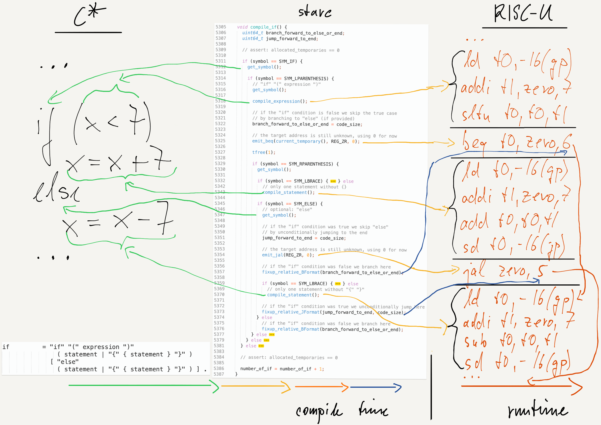

The above figure shows the code of the procedure `compile_if` for compiling `if` statements with a single-statement `if` body and a single-statement `else` body. Our example of an `if` statement is shown on the left and the code generated for the example is shown on the right. In order to focus on the generated code, we again omit the details on the compile-time and runtime machine states. Also, the code generated for the expression `x < 7` and the assignment `x = x + 7` appears exactly as before when we compiled both in isolation. We again use the actual value `-16` as offset for loading and storing the value of `x`, as generated by the selfie compiler for a program in which `x` is the only global variable.

As you can see in the code of `compile_if` and the generated code, there are only two instructions generated for an `if` statement with an `else` body. There is a conditional branch instruction, here `beq t0,zero,6`, right after the code that evaluates the `if` condition and an unconditional jump instruction, here `jal zero,6`, right after the code that implements the `if` body. These two instructions implement the exact semantics of an `if` statement with an `else` body. Without an `else` body, the unconditional jump instruction is unnecessary and therefore not generated.

> Conditional forward branch and unconditional forward jump

Similar to `while` loops, after executing the code that evaluates the `if` condition, the `t0` register, as returned by the procedure `current_temporary`, contains the value to which the `if` condition evaluates. The following `beq` instruction checks if the value of `t0` is equal to `0` using the `zero` register that always contains the value `0`. If yes, meaning the `if` condition evaluated to false, `beq t0,zero,6` instructs the machine to forward branch, here by `6` instructions, to the first instruction after the unconditional jump instruction, effectively skipping the `if` body to execute the `else` body instead. If no, meaning the `if` condition evaluated to true, `beq t0,zero,6` instructs the machine to execute the next instruction, here the second occurrence of the `ld t0,-16(gp)` instruction that follows the `beq` instruction, effectively entering the `if` body. Unlike with `while` loops, the `jal zero,6` instruction at the end of the code that implements the `if` body instructs the machine to *forward jump*, here by `6` instructions, to the first instruction after the code that implements the `else` body, effectively skipping the `else` body. In particular, there are no backward jumps here.

> Fixup, again

Similar to `while` loops, the only true challenge involved in compiling `if` statements is to fixup the forward branch of the conditional branch instruction and the forward jump of the unconditional jump instruction. For the purpose of those fixups, the addresses of the conditional branch instruction and the unconditional jump instruction are stored in a local variable called `branch_forward_to_else_or_end` and a local variable called `jump_forward_to_end`, respectively. That's it.

> Lazy evaluation, again

With our understanding of how to compile `if` statements, we are ready to do another exercise that we mentioned before which is the support of *lazy evaluation* of Boolean logical operators. The exercise involves extending your solution of the exercise about Boolean logical operators without lazy evaluation. Here, the autograder is invoked as follows:

```bash
./grader/self.py lazy-evaluation
```

Recall that the right operands of the `&&` and `||` operators are supposed to be evaluated *lazily* which means that they are only evaluated if the value to which the left operand evaluates is not sufficient to determine the overall result. For example, in an expression `X && Y`, the right operand `Y` is not supposed to be evaluated if the left operand `X` evaluates to `0`, exploiting the fact that `X && Y` must evaluate to `0` in that case regardless of the value to which `Y` would evaluate. Similarly, in an expression `X || Y`, `Y` is not supposed to be evaluated if `X` evaluates to a value that is not `0`, exploiting the fact that `X || Y` must evaluate to `1` in that case, again, regardless of the value to which `Y` would evaluate.

You might ask what the use cases are for lazy evaluation of logical operators. Here is an example of a quite common use case where `x` is declared as pointer to unsigned integer:

```c
if (x != (uint64_t*) 0 && *x < 7)
  ...
```

This code dereferences `x` to check if the value in memory to which `x` points is less than `7` but only if `x` is not a null pointer, that is, if `x` points to something rather than nothing. Pointing to memory address `0` is almost always considered pointing to nothing. Sure, we could do the same as lazy evaluation but using two `if` statements instead:

```c
if (x != (uint64_t*) 0)
  if (*x < 7)
    ...
```

Using `if` statements rather than lazy evaluation of logical operators is in fact always possible but it does in general result in code duplication in `if` conditions as well as `if` and `else` bodies which is something to avoid. Maintaining duplicated code is often more work and more likely to result in bugs. Try for yourself. Write down a more involved `if` condition using logical operators and then code the same using nested `if` statements instead that mimic the behavior of lazy evaluation. Things get out of hand quite quickly. In fact, the situation gets quite tricky if logical operators are used in sequence or even nested. For example, in an expression `X && Y && Z` that uses two `&&` operators in sequence, `Y` and `Z` are not supposed to be evaluated if `X` evaluates to `0`. Similarly, in an expression `X || Y || Z`, `Y` and `Z` are not supposed to be evaluated if `X` evaluates to a value that is not `0`. Even more tricky is nested use of logical operators. For example, in an expression `X && Y || Z && U`, `Y` is not supposed to be evaluated, if `X` evaluates to `0`, but then `Z` still is whereas `U` is not, if `Z` evaluates to `0`, all because `&&` has higher precedence than `||`. Thus in an expression `X || Y && Z || U`, `Y`, `Z`, and `U` are not supposed to be evaluated, if `X` evaluates to a value other than `0`. Practice your understanding by listing all remaining scenarios.

So, how do you solve the exercise? Well, if the previous exercises were not challenging enough, this one probably is. But only until you realize how to think properly using abstraction. Lazy evaluation can be handled in each of the parser procedures for `&&` and `||` individually. You only need to generate conditional branch instructions that forward branch to implement lazy evaluation. Since they forward branch they require fixup but that we already know how to do. The only real issue arises in the presence of sequenced logical operators whereas support of nested logical operators comes for free. With sequenced logical operators there could be any number of conditional branch instructions that still require fixup. There are essentially two solutions to that. Either you represent all instructions that still require fixup in a list explicitly called a *fixup chain*, which is something we actually do for procedure calls and return statements. However, here you can also use recursion by having the parser procedures for `&&` and `||` call themselves recursively and thereby use their local variables on the call stack implicitly as list, instead of an explicit list. The only drawback of that approach is that the conditional branch instructions generated for `if` statements and `while` loops become redundant and are thus inefficient. Delayed code generation that manages two fixup chains for `&&` and `||` simultaneously can solve that problem but never mind, unless you really enjoy the challenge.

-------------------------------------------------------------------------------

work in progress

-------------------------------------------------------------------------------

### Procedures

Most programming languages feature a notion of procedures, one way or another, maybe not called procedures but functions or methods, but still. The idea of procedures and their great success in programming languages in particular can be explained from two, quite different perspectives: procedures as effective programming abstraction and, less common, as efficient implementation technology. Procedures are a great, widely used programming abstraction which facilitates tool-supported structured programming that promotes efficient code reuse and dynamic memory management in constant time. The fact that procedures can be implemented very efficiently is ultimately the reason why procedures survived the test of time.

A procedure gives code a name that allows reusing that code in different contexts from within other code through procedure calls which simultaneously feature and require stack allocation through dynamic allocation and deallocation of the involved memory on a call stack. There is a potential problem, however, which is, as so often, correctness. Reusing the same code correctly in different contexts is powerful but also hard to get right. A procedure not only provides a piece of code for structured reuse through procedure calls by name but also an *interface* through some form of specification such as its *signature* which facilitates checking at least type compatibility of reuse in different contexts. Type checking of procedure calls, that is, checking type compatibility of actual parameters with formal parameters, similar to checking type compatibility of operands in expressions as well as right-hand sides of assignments with their left-hand sides, has become the arguably most successful form of program analysis.

Here is the C\* grammar for procedure declarations and definitions as well as procedure calls and return statements:

```ebnf
procedure = ( type | "void" ) identifier "(" [ variable { "," variable } [ "," "..." ] ] ")"
            ( ";" | "{" { variable ";" } { statement } "}" ) .

call      = identifier "(" [ expression { "," expression } ] ")" .

return    = "return" [ expression ] .
```

```c
uint64_t f = 1;
uint64_t n = 4;

void factorial() {
  while (n > 1) {
    f = f * n;

    n = n - 1;
  }
}

uint64_t main() {
  factorial();

  return f;
}
```

```asm
0x140(~5) - 0x150(~5): // prologue removed

0x154(~5): ld t0,-24(gp)
0x158(~5): addi t1,zero,1
0x15C(~5): sltu t0,t1,t0
0x160(~5): beq t0,zero,10[0x188]
0x164(~6): ld t0,-16(gp)
0x168(~6): ld t1,-24(gp)
0x16C(~6): mul t0,t0,t1
0x170(~6): sd t0,-16(gp)
0x174(~8): ld t0,-24(gp)
0x178(~8): addi t1,zero,1
0x17C(~8): sub t0,t0,t1
0x180(~8): sd t0,-24(gp)
0x184(~10): jal zero,-12[0x154]

0x188(~10) - 0x198(~10): // epilogue removed

0x19C(~10): jalr zero,0(ra)
```

```asm
0x1A0(~13): addi sp,sp,-8
0x1A4(~13): sd ra,0(sp)

0x1A8(~13): addi sp,sp,-8
0x1AC(~13): sd s0,0(sp)
0x1B0(~13): addi s0,sp,0

0x1B4(~13): jal ra,-29[0x140]

0x1B8(~13): addi a0,zero,0
0x1BC(~15): ld t0,-16(gp)

0x1C0(~15): addi a0,t0,0
0x1C4(~15): jal zero,1[0x1C8]

0x1C8(~16): addi sp,s0,0
0x1CC(~16): ld s0,0(sp)
0x1D0(~16): addi sp,sp,8

0x1D4(~16): ld ra,0(sp)
0x1D8(~16): addi sp,sp,8

0x1DC(~16): jalr zero,0(ra)
```

```c
void factorial() {
  if (n > 1) {
    f = f * n;

    n = n - 1;

    factorial();
  }
}
```

```asm
0x140(~5): addi sp,sp,-8
0x144(~5): sd ra,0(sp)

0x148(~5): addi sp,sp,-8
0x14C(~5): sd s0,0(sp)
0x150(~5): addi s0,sp,0

0x154(~5): ld t0,-24(gp)
0x158(~5): addi t1,zero,1
0x15C(~5): sltu t0,t1,t0
0x160(~5): beq t0,zero,11[0x18C]
0x164(~6): ld t0,-16(gp)
0x168(~6): ld t1,-24(gp)
0x16C(~6): mul t0,t0,t1
0x170(~6): sd t0,-16(gp)
0x174(~8): ld t0,-24(gp)
0x178(~8): addi t1,zero,1
0x17C(~8): sub t0,t0,t1
0x180(~8): sd t0,-24(gp)
0x184(~10): jal ra,-17[0x140]

0x188(~10): addi a0,zero,0

0x18C(~12): addi sp,s0,0
0x190(~12): ld s0,0(sp)
0x194(~12): addi sp,sp,8

0x198(~12): ld ra,0(sp)
0x19C(~12): addi sp,sp,8

0x1A0(~12): jalr zero,0(ra)
```

```asm
0x1A4(~15): addi sp,sp,-8
0x1A8(~15): sd ra,0(sp)

0x1AC(~15): addi sp,sp,-8
0x1B0(~15): sd s0,0(sp)
0x1B4(~15): addi s0,sp,0


0x1B8(~15): jal ra,-30[0x140]


0x1BC(~15): addi a0,zero,0
0x1C0(~17): ld t0,-16(gp)

0x1C4(~17): addi a0,t0,0
0x1C8(~17): jal zero,1[0x1CC]

0x1CC(~18): addi sp,s0,0
0x1D0(~18): ld s0,0(sp)
0x1D4(~18): addi sp,sp,8

0x1D8(~18): ld ra,0(sp)
0x1DC(~18): addi sp,sp,8

0x1E0(~18): jalr zero,0(ra)
```

```c
uint64_t f = 1;

void factorial(uint64_t n) {
  if (n > 1) {
    f = f * n;

    factorial(n - 1);
  }
}

uint64_t main() {
  factorial(4);

  return f;
}
```

```asm
0x140(~4): addi sp,sp,-8
0x144(~4): sd ra,0(sp)
0x148(~4): addi sp,sp,-8
0x14C(~4): sd s0,0(sp)
0x150(~4): addi s0,sp,0

0x154(~4): ld t0,16(s0)
0x158(~4): addi t1,zero,1
0x15C(~4): sltu t0,t1,t0
0x160(~4): beq t0,zero,12[0x190]
0x164(~5): ld t0,-16(gp)
0x168(~5): ld t1,16(s0)
0x16C(~5): mul t0,t0,t1
0x170(~5): sd t0,-16(gp)
0x174(~7): ld t0,16(s0)
0x178(~7): addi t1,zero,1
0x17C(~7): sub t0,t0,t1

0x180(~7): addi sp,sp,-8
0x184(~7): sd t0,0(sp)

0x188(~7): jal ra,-18[0x140]

0x18C(~7): addi a0,zero,0

0x190(~9): addi sp,s0,0
0x194(~9): ld s0,0(sp)
0x198(~9): addi sp,sp,8
0x19C(~9): ld ra,0(sp)
0x1A0(~9): addi sp,sp,16

0x1A4(~9): jalr zero,0(ra)
```

```asm
0x1A8(~12): addi sp,sp,-8
0x1AC(~12): sd ra,0(sp)
0x1B0(~12): addi sp,sp,-8
0x1B4(~12): sd s0,0(sp)
0x1B8(~12): addi s0,sp,0

0x1BC(~12): addi t0,zero,4

0x1C0(~12): addi sp,sp,-8
0x1C4(~12): sd t0,0(sp)

0x1C8(~12): jal ra,-34[0x140]

0x1CC(~12): addi a0,zero,0

0x1D0(~14): ld t0,-16(gp)
0x1D4(~14): addi a0,t0,0

0x1D8(~14): jal zero,1[0x1DC]

0x1DC(~15): addi sp,s0,0
0x1E0(~15): ld s0,0(sp)
0x1E4(~15): addi sp,sp,8
0x1E8(~15): ld ra,0(sp)
0x1EC(~15): addi sp,sp,8

0x1F0(~15): jalr zero,0(ra)
```

```c
uint64_t factorial(uint64_t n) {
  if (n > 1)
    return n * factorial(n - 1);
  else
    return 1;
}

uint64_t main() {
  return factorial(4);
}
```

```asm
0x140(~2): addi sp,sp,-8
0x144(~2): sd ra,0(sp)
0x148(~2): addi sp,sp,-8
0x14C(~2): sd s0,0(sp)
0x150(~2): addi s0,sp,0

0x154(~2): ld t0,16(s0)
0x158(~2): addi t1,zero,1
0x15C(~2): sltu t0,t1,t0
0x160(~2): beq t0,zero,18[0x1A8]
0x164(~3): ld t0,16(s0)

0x168(~3): addi sp,sp,-8
0x16C(~3): sd t0,0(sp)

0x170(~3): ld t0,16(s0)
0x174(~3): addi t1,zero,1
0x178(~3): sub t0,t0,t1

0x17C(~3): addi sp,sp,-8
0x180(~3): sd t0,0(sp)

0x184(~3): jal ra,-17[0x140]

0x188(~3): ld t0,0(sp)
0x18C(~3): addi sp,sp,8

0x190(~3): addi t1,a0,0

0x194(~3): addi a0,zero,0

0x198(~3): mul t0,t0,t1

0x19C(~3): addi a0,t0,0
0x1A0(~3): jal zero,5[0x1B4]

0x1A4(~5): jal zero,4[0x1B4]

0x1A8(~5): addi t0,zero,1
0x1AC(~5): addi a0,t0,0
0x1B0(~5): jal zero,1[0x1B4]

0x1B4(~6): addi sp,s0,0
0x1B8(~6): ld s0,0(sp)
0x1BC(~6): addi sp,sp,8
0x1C0(~6): ld ra,0(sp)
0x1C4(~6): addi sp,sp,16

0x1C8(~6): jalr zero,0(ra)

0x1CC(~9): addi sp,sp,-8
0x1D0(~9): sd ra,0(sp)
0x1D4(~9): addi sp,sp,-8
0x1D8(~9): sd s0,0(sp)
0x1DC(~9): addi s0,sp,0

0x1E0(~9): addi t0,zero,4
0x1E4(~9): addi sp,sp,-8
0x1E8(~9): sd t0,0(sp)

0x1EC(~9): jal ra,-43[0x140]

0x1F0(~9): addi t0,a0,0
0x1F4(~9): addi a0,zero,0
0x1F8(~9): addi a0,t0,0
0x1FC(~9): jal zero,1[0x200]

0x200(~10): addi sp,s0,0
0x204(~10): ld s0,0(sp)
0x208(~10): addi sp,sp,8
0x20C(~10): ld ra,0(sp)
0x210(~10): addi sp,sp,8

0x214(~10): jalr zero,0(ra)
```

control flow: recursion, iteration
data flow: stack allocator

temporary register invariant

variadic functions

> Arrays

We are finally prepared for advanced exercises in the design and implementation of arrays in selfie, and, further below, structs as well. C\* is a *structured programming language* yet structured only as in structured control flow through procedures and statements such as possibly recursive procedure calls and nested `while` loops. However, C\* is not structured as in data flow. There are no structured data types in C\*, on purpose. The following exercises show what it takes to change that with support of arrays and structs. For the first array exercise, use the autograder as follows:

```bash
./grader/self.py array
```

In C, an *array* is essentially a pointer to a contiguous block of memory that is evenly partitioned into *array elements* all of the same type that are accessed via an integer value called an *index*. Array declarations and array access both involve the bracket operator `[]` which is, as confusing it might be, used for these two very different purposes. Consider the following example:

```c
uint64_t a[2];

void initialize_a() {
  a[0] = 42;
  a[1] = a[0];
}
```

The line `uint64_t a[2]` declares a global variable `a` of type `array` with `2` array elements of type `uint64_t`. The lines `a[0] = 42;` and `a[1] = a[0];` access the `2` array elements `a[0]` and `a[1]` with index `0` and `1` to initialize them both with the value `42`. Here is another example, this time declaring a local variable `b` of type `array`, again with `2` array elements of type `uint64_t`:

```c
void initialize_b() {
  uint64_t b[2];

  b[0] = 42;
  b[1] = b[0];
}
```

The only difference between the two examples is that the declaration of `a` results in static memory allocation in the data segment while the declaration of `b` results in dynamic memory allocation on the call stack.

Here is what you need to do. As usual, extend the C\* grammar first. While an index into an array can be any expression, the size of an array can only be an integer literal. Then, extend symbol table entries with type information on arrays, in particular the element type, here `uint64_t`, and the array size, here `2`. In this context, a word of caution is in order: do not forget to increase the amount of memory allocated for a symbol table entry when extending it, see the procedure `allocate_symbol_table_entry`. Next, make sure that sufficient memory is allocated for arrays, here a contiguous block of `2` machine words, statically in the data segment for global variables such as `a`, and dynamically on the call stack for local variables such as `b` through proper code generation. Hint: the latter requires modifying procedure prologues! Finally, generate code for array access which involves computing addresses of array elements in memory. Hint: `a[1]` is equivalent to `*(a + 1)`. However, before doing so, there is one more thing to figure out, which appears to be the key challenge with this exercise and ultimately points to a larger, quite important issue. Consider the following example:

```c
void initialize_x(uint64_t x[2]) {
  x[0] = 42;
  x[1] = x[0];
}

void initialize_b() {
  uint64_t b[2];

  initialize_x(b);
}
```

The code does essentially the same as the code in the previous example with local variable `b` but using different means. The key challenge is to understand what `b` in the procedure call `initialize_x(b)` actually means. The answer is that `b` evaluates to the address of `b[0]` in memory, that is, `b` evaluates to a pointer that refers to the beginning of the array `b` in memory. In particular, `b` does not evaluate, as some might think, to something that represents the entire array `b` as is. This means that the call `initialize_x(b)` only passes a pointer to the array `b` as actual parameter to the procedure `initialize_x`, and not a copy of the entire array. As a consequence, code generation for accessing elements of arrays provided by formal parameters is similar to code generation for dereferencing pointers, and thus different from code generation for accessing elements of arrays provided by global and local variables. Hint: `a` in `a[1]` and `b` in `b[1]` are the addresses of the beginning of the arrays `a` and `b` in memory, respectively, whereas `x` in `x[1]` is the value of `x`.

> Call-by-value versus call-by-reference

Ultimately, the larger issue is that procedure calls in C, and even in Java, contrary to common belief, are *call-by-value* only. In particular, there is no support of *call-by-reference* in C, and in Java. Call-by-value means that the values of actual parameters are passed in procedure calls as copies. We also say they are *pass-by-value*. Any changes to those copies by the callee have no effect on the originals with the caller. Instead, call-by-reference or, more general, *pass-by-reference* means that the addresses of the variables in memory storing those values are passed, not the values, enabling side effects on values and even on variables beyond the scope of the callee. However, pass-by-reference can be simulated in C but only by passing pointers. In fact, pass-by-value of arrays in C is effectively similar to pass-by-reference in the sense that only a pointer to the beginning of an array in memory is passed by-value simply because there is no way in C to refer to an entire array as is, that is, as value! However, this might be a good thing because arrays can be quite large. It is nevertheless a common mistake by inexperienced developers using languages other than C to pass large data structures unnecessarily by-value often causing massive temporal and spatial overhead. Speaking of which, C also supports multidimensional arrays. The next exercise is about those:

```bash
./grader/self.py array-multidimensional
```

Once you figured out support of onedimensional arrays, extending that to multidimensional arrays is actually not so difficult. The calculation of the size of multidimensional arrays is straightforward which leaves us with code generation for multidimensional array access. Consider the following example:

```c
uint64_t d[2][2];

void initialize_d() {
  uint64_t* p;

  d[0][0] = 42;
  d[0][1] = d[0][0];
  d[1][0] = d[0][1];
  d[1][1] = d[1][0];

  p = (uint64_t*) d;

  *d[1] = 7;
}
```

The code declares a global variable `d` as twodimensional array and provides a procedure that first initializes the array elements of `d`. The procedure also declares a local variable `p` as pointer to unsigned integers, the element type of the array `d`, and initializes `p` to point to the beginning of `d` in memory. The last line `*d[1] = 7;` is the interesting part. Where in the twodimensional array will the value `7` end up? The answer is in `d[1][0]`, of course, because `*d[7]` is equivalent to `*(d[1] + 0)` which in turn is equivalent to `d[1][0]`. However, where exactly is the value of `d[1][0]` and thus `7` in memory? The answer is at address `p + 2`, not `p + 1`, which could be an option too, if it was not for an important design decision in C.

> Row-major versus column-major order

Multidimensional arrays in C are stored in memory in *row-major* order, in contrast to *column-major* order as in Fortran, for example. With row-major order, the consecutive array elements of a row are stored next to each other in memory. For example, the elements of the array `d` are stored in memory in the order `d[0][0]`, `d[0][1]`, `d[1][0]`, and `d[1][1]`, hence the value `7` at `p + 2`. With column-major order, the consecutive array elements of a column are stored next to each other in memory, that is, the elements of `d` would be stored in memory in the order `d[0][0]`, `d[1][0]`, `d[0][1]`, and `d[1][1]`, hence the value `7` potentially at `p + 1`. So, with row-major order in C, it is row-major in C\* as well.

> Structs

The two final exercises in this chapter are on some limited support of structs as they appear in C. The first exercise focuses on parsing struct declarations and constructing proper representations in the symbol table. Invoke the autograder as follows:

```bash
./grader/self.py struct-declaration
```

In C, a *struct* essentially represents a contiguous block of memory that is partitioned into *struct fields*, each of a possibly different type and size, that are accessed via a unique *field name*. A struct declaration begins with the keyword `struct` followed by an identifier that provides a unique name for the struct. A new feature that we have not seen before is that struct declarations are *type declarations*, unlike variable or procedure declarations. The name of a struct therefore identifies a type, not a variable or a procedure. Consider the following example:

```c
struct list_node {
  struct list_node* next_node;
  uint64_t payload;
};
```

The code declares a new type called `list_node` which is a struct with two fields. The field `next_node` is of type pointer to a `list_node`. The field `payload` is of type `uint64_t`. Yes, this is a type that describes the nodes of a singly-linked list. A proper implementation of symbol table entries in C would use such a struct.

Conversely, parsing a struct declaration only results in a new symbol table entry that represents the struct as type. For this purpose, you need to extend symbol table entries accordingly. In particular, the actual field structure only needs to be represented to facilitate code generation for field access. Hint: you may reuse symbol table entries as representation of fields.

Most importantly, type declarations and hence struct declarations do not result in any code generation, and also not in any memory allocation! This only happens when declaring a variable of type `struct`. However, to keep things simple, the exercise only involves support of fields, variables, formal parameters, and return types of procedures as pointers to structs, and not also structs as is, which are actually supported as such in C! This means that you only need to support pass-by-value of structs through pointers to structs, similar to arrays. The downside is that memory for structs can then only be allocated on the heap, not in the data segment and not on the call stack. Another simplification is that support of fields as arrays is also not necessary in this exercise. Consider the following example:

```c
struct list_node* my_list;
```

```c
struct list_node* allocate_list_node() {
  return malloc(sizeof(struct list_node));
}
```

The code declares a global variable `my_list` of type pointer to `list_node`, and defines a procedure `allocate_list_node` whose return type is pointer to `list_node` as well. Using the properly enhanced `sizeof` operator, the procedure allocates memory on the heap using `malloc` that fits a single `list_node`, or better a single *instance* of a `list_node`, and then returns a pointer to that instance in memory.

The final exercise in this chapter is on generating code for accessing struct fields. Invoke the autograder as follows:

```bash
./grader/self.py struct-execution
```

In C, struct fields are accessed by two different operators: the arrow operator `->`, applied to a pointer to a struct, and the dot operator `.`, applied to a struct as is. Since we skipped support of structs as is, you only need to worry about support of the arrow operator. Consider the following example:

```c
void initialize_list_node(struct list_node* node) {
  node->next_node = (struct list_node*) 0;
  node->payload = 42;
}
```

The code defines a procedure `initialize_list_node` which, given a pointer to an instance of a `list_node`, initializes the `next_node` field with a null pointer and the `payload` field with the value `42`. Code generation for field access through the `->` operator is simpler than for array access through the `[]` operators. The reason is that the offset of a field in memory relative to the beginning of a struct is determined at compile time, in fact while parsing the declaration of the struct. By convention in C, the offset of a given field is the sum of the sizes of the fields in memory that appear before the given field in the struct. Just keep track of those offsets in the symbol table entries reused for fields.

> Field access versus array access

At runtime, field access is generally faster than array access, unless the index identifying an array element is a constant. In that case, the offset of the array element in memory relative to the beginning of an array is also determined at compile time, similar to the offsets of fields. Modern production compilers utilize constant folding to increase the chances of identifying array indexes as constant.

> Structs versus classes

Students often ask me what the counterparts of structs and struct fields are in programming languages other than C. With Java and Python, for example, a *class* without any *methods* and *static variables* corresponds to a struct in C, and an *instance variable* of such a class corresponds to a struct field in C. Ignoring scoping of methods and variables, there is also an analogy in C for methods and static variables in Java and Python. A method corresponds to a procedure in C, and a static variable corresponds to a global variable in C. Here is the surprise: once I mention those analogies, students which typically have a background in Java or Python but not C often understand, for the first time, what Java and Python classes actually are, confirming my suspicion that programming education, after all these years, still cannot ignore programming language implementation.

> Object-oriented programming

The discussion usually continues with questions about *object-oriented programming*, as in Java or Python, and many other languages. Again, in my experience, students often have only a vague understanding of object-oriented programming, even though or maybe exactly because the first programming language they encountered usually supported object-oriented programming. Even I remember my first encounter with an object-oriented programming language, Smalltalk, and how little I understood what objects really were and how to use them properly, despite my prior experience with C and Pascal and other programming languages which were all not object-oriented.

> Compile-time polymorphism through overloading

Object-oriented programming essentially makes type polymorphism programmable. Recall that type polymorphism already appears in C with arithmetic operators that are overloaded for integer and pointer arithmetic. An arithmetic operator such as the `+` operator has different semantics depending on the type of its operands. The question is how we can do something similar with procedures. Well, we could allow sharing the same procedure name in multiple procedure definitions where each definition features a unique procedure signature. In other words, a procedure name would still be unique but only in combination with a procedure signature. This would allow overloading of procedures which is *compile-time polymorphism* because which procedure definition is used in a procedure call can be determined at compile time through a technique called *static binding*. Alright, done. Object-oriented programming languages support that. However, this is not what object-oriented programming really is.

> Runtime polymorphism through overriding

The principled idea is actually even simpler, but not the implementation. In addition to variables and procedures, object-oriented programming also types *values*, then called *objects*, and then allows *overriding* procedures depending on the type of values, or objects, involved as actual parameters in procedure calls. However, combining value types with variable and procedure types requires some form of *type compatibility*. This is usually done through a programmable *type hierarchy* such as abstract classes and interfaces in Java. Overriding of procedures is *runtime polymorpism* because which procedure definition is used in a procedure call can only be determined at runtime through a technique called *dynamic* or *late binding*.

> Abstraction versus implementation

In the end, the whole thing is about making code more compact, reusable, maintainable, and so on, simply by allowing the same name mean different things depending on a more or less elaborate context. Is it worth it? Well, there are plenty of use cases. But the hype involved in ever more advanced programming languages is considerable. In the old days, all that fuzz about classes and objects and sending messages from one object to another, and more recently about the fanciest features in the latest programming languages points to a much bigger problem. In hindsight, I cannot believe how much time I wasted in the early days of object-oriented programming because I did not understand what it was but felt I had to apply it everywhere I could. Even today, it is difficult to convince students to be more careful in their choice of programming languages. I blame programming language education which usually focuses on the abstractions provided by a programming language and how to use those but not how those abstractions are actually implemented. I understand that going through an actual implementation is tedious and ultimately seems not to scale. However, developing ever more advanced programming language features without figuring out how to teach them properly is like burning fossil fuel. It is cheap and fun now, and expensive and terrible later. Sure, teaching a programming language through an actual implementation or at least some part of an implementation may seem like diminishing the value of its abstractions but I believe, in the long run, the opposite is true. The real challenge is not just to develop better programming languages but also to figure out how to teach those languages properly, including which parts of an implementation should be exposed. Eventually turning programming into a proper engineering discipline may require just that.

### Libraries

A programming language is usually not standalone but part of an ecosystem of libraries and tools for developing code in that language. In this context, a *runtime library* or just a *library* is code, typically developed by experts, which provides functionality that developers often need but are unable or do not want to develop themselves. In fact, the choice of programming language or even programming languages used in a project is often driven by the libraries and tools available for those languages rather than just the features of each individual language.

> To library or not to library

Libraries are great as long as they are designed and implemented properly, and you know how to use them correctly and what the performance implications are. Some basic functionality such as  performing input and output is often only available in libraries as there are typically no language constructs for that. Thus modern code development is typically more about knowing how to use the libraries of a programming language than knowing all the features of the language. With selfie, however, we took the exact opposite approach and decided not to use any libraries at all, even though there is an enormous amount of very popular and well-developed libraries for C. Instead, we wrote the library code needed for selfie ourselves and added it to the beginning of the source code of selfie to make selfie a truly self-contained system. For people familiar with C, this means that there are no `#include` statements in the code and in turn that C\* does not support `#include` statements either. However, the selfie compiler can compile and *link* code in multiple files into a single executable. We explain below how that works and go through some of the library code we wrote as well.

> Builtin procedures versus library procedures

Not using any library code is so unusual that, back in the day, I did not even know that a standard C compiler generates executable code for a C program that can interact with me in a terminal yet without including any library code for performing input and output at all. Instead, I happened to be using, unknowingly, *builtin procedures*, named exactly the same as typical *library procedures* for performing input and output, that were nevertheless sufficient for our purposes. Turns out that C compilers, in the absence of library code, generate code at least for builtin procedures, and then add that code to the code generated for the compiled program. The selfie compiler mimics that behavior with eight builtin procedures featured in C\*. Out of these procedures, the following five builtin procedures are strictly needed for bootstrapping selfie:

1. `exit`: program execution and return an exit code
2. `read`: a given number of bytes from a file into a buffer in memory
3. `write`: a given number of bytes from a buffer in memory to a file
4. `open`: a file for `read` and `write` access
5. `malloc`: a given number of bytes contiguously on the heap

The `exit` procedure may be called from anywhere in the code of a program to terminate program execution immediately. However, strictly speaking, explicit support of `exit` is not necessary since returning from the `main` procedure terminates program execution implicitly anyway. Yet always returning to `main` for program termination may be quite inconvenient. Moreover, lifting implicit support of program termination, which is needed, to explicit support in `exit` is easy.

The `read` and `write` procedures enable reading from and writing to files, respectively, including reading from *standard input*, that is, the keyboard and writing to *standard output*, that is, the console. Reading from and writing to files requires opening them using the `open` procedure. All three procedures are needed to perform input and output. In standard C, there is also a builtin procedure called `close` for closing files which is nevertheless not strictly needed in selfie since most programs we run with selfie do not open more than a few files and open files are all closed implicitly upon program termination.

The `malloc` procedure allocates contiguous blocks of memory on the heap at runtime. Its counterpart in standard C is a procedure called `free` for freeing memory allocated with `malloc`. Similar to the `close` procedure, the `free` procedure is not strictly needed in selfie since most programs we run with selfie always terminate and do not allocate more than a few megabytes of memory. Also, memory allocated with `malloc` is all freed implicitly upon program termination. However, selfie does support freeing memory implicitly during program executing using a conservative garbage collector. More on that below.

> Nobody needs to free or close anything

We mentioned that before but repeat it here again: nobody needs to `free` any memory and, similarly, `close` any files unless you run out of resources. You can open a lot of files and allocate a lot of memory on modern computers before your code stops working. In our experience, it is only worth paying attention to returning resources if your code is supposed to run for indefinite amounts of time and continuously claims new resources to do so. Otherwise, modern operating systems take care of the problem by reclaiming resources whenever programs terminate.

> Printing

Out of the eight builtin procedures featured in C\*, the remaining three builtin procedures are not strictly necessary for bootstrapping selfie but still quite useful for printing data:

1. `printf`: a formatted string to the console
2. `sprintf`: a formatted string to a buffer in memory
3. `dprintf`: a formatted string to a file

All three procedures are variadic, as mentioned before, which helps making the source code of selfie significantly more readable. Earlier versions of the code only supported printing data through non-variadic procedures which was quite a bit more cumbersome. However, support of variadic procedures and `printf` derivatives in particular is non-trivial.

Before going into the details, take a look at the very beginning of the source code right after the long introductory comment section. The first thing you see are procedure declarations of all eight builtin procedures featuring their *signatures* in detail. These eight declarations are the only ones in all of selfie that do not have any matching procedure definitions, at least not by name. In other words, the builtin procedures are declared but not explicitly defined, yet used all over the place.

> Bootstrapping selfie

In order to understand how that works, we need to distinguish the compilers involved in bootstrapping selfie. First of all, there is the *bootstrapping compiler*, typically either `gcc` or `clang`, which is the compiler that compiles the source code of selfie into an executable that runs on your machine. That compiler is invoked the first time you run `make` in a terminal:

```bash
make
```

which effectively runs the following command:

```bash
cc -Wall -Wextra -O3 -D'uint64_t=unsigned long' selfie.c -o selfie
```

The leading `cc` stands for `c compiler` and is typically an alias for either `gcc` or `clang`. After a number of compiler options, there is the name of the file that contains the source code of selfie, `selfie.c`, followed by `-o selfie`, which together instruct the compiler to compile `selfie.c` into an executable file called `selfie` that runs on your machine as follows:

```bash
./selfie
```

That executable contains the *bootstrapped compiler* which is here the selfie compiler in a form that is executable on your machine.

> Self-compilation

At this point, you can use `selfie` to compile any C\* code you like, including the source code of selfie simply because selfie is written in C\*. To see that, ask `selfie` to *self-compile* by running:

```bash
make self
```

which effectively runs:

```bash
./selfie -c selfie.c
```

The `-c` option instructs `selfie` to compile the file, or in fact, files that follow the `-c` option, here just `selfie.c`. In other words, the `-c` option invokes the selfie compiler, also called `starc`, which is of course part of `selfie` but not the only part, see below.

> Chicken and egg problem

You may wonder if `gcc` can do the same. The answer is yes. Modern production compilers are typically written in the language they compile and therefore self-compiling, and so is `gcc`. In my classes, I encourage my students to self-compile a production compiler like `gcc` just once to see what it takes to do that. Besides taking quite a bit of time because of the enormous complexity of modern production compilers, there is one problem though. How do we obtain an executable of a bootstrapping compiler to bootstrap itself? Today this is easy because executables of compilers such as `gcc` are available for most machine architectures. But how did people do that in the early days of compilers when no executables of compilers existed? Well, they had to implement the compiler at least two times, the bootstrapping compiler in machine code and at least one bootstrapped compiler in source code. The bootstrapped compiler can initially be implemented in a small subset of the compiled language to simplify the bootstrapping compiler in machine code which only needs to compile that subset. If the bootstrapped compiler compiles the entire language we are done. If not, it should at least compile a superset of the subset in which it is written. We can then implement a second bootstrapped compiler in that superset and bootstrap it but now using the first bootstrapped compiler as bootstrapping compiler, and so on, until we obtain an executable of a bootstrapped compiler that compiles the entire language. A fun observation is that the bootstrapping of many compilers used today may go back to the first bootstrapping compilers written in machine code a long time ago. So, who was first, the chicken or the egg? With compilers I would say it was the egg but probably more than one.

> Cross-compilation

The key difference between the bootstrapping compiler, say, `gcc` and the bootstrapped compiler, here `starc` is that by default `gcc` generates code for the machine on which `gcc` runs whereas `starc` generates RISC-U machine code. On my machine, for example, `gcc` generates ARM machine code which means that, in this case, the executable `selfie`, which includes `starc`, is machine code that runs on an ARM processor. Therefore, `starc` is in this case a *cross-compiler*, that is, a compiler that generates code for a machine architecture that is different from the machine architecture on which the compiler runs. In particular, a cross-compiler generates code that does not run on the processor on which the cross-compiler runs. Cross-compilers typically target machines that are not meant for code development such as smartphones and *embedded systems* in general such as computers in cars and planes. The fact that `starc` is a cross-compiler on my machine and probably yours as well is, however, not intended but a mere consequence of `starc` generating RISC-U machine code for simplicity and educational purposes. Generating ARM machine code, for example, would be significantly more involved.

> Emulation

How do we run code generated by a cross-compiler like `starc`? After all, we are unlikely to have access to an actual RISC-V machine that can execute RISC-U machine code. Remember that RISC-U is a strict subset of RISC-V. Well, `selfie` not only implements `starc` but also an *emulator* of a RISC-U machine called `mipster` that can execute any RISC-U machine code such as the code generated by `starc` for `selfie.c`:

```bash
./selfie -c selfie.c -m 1
```

The `-m 1` option instructs `selfie` to create an instance of a RISC-U machine with 1MB of memory, then load the RISC-U machine code generated by `starc` for `selfie.c` into that memory, and finally execute the generated code. Note that the code generated for `selfie.c` is only kept in memory but not output into an executable file. However, `selfie` can output an executable file and even a semantically equivalent assembly file as follows:

```bash
./selfie -c selfie.c -o selfie.m -S selfie.s
```

The `-o` option instructs `selfie` to output the generated code into an executable file, here `selfie.m`. Similarly, the `-S` option instructs `selfie` to output the generated code in textual form into an assembly file, here `selfie.s`. Instead of `-S`, we could also use `-s` which results in a slightly less verbose version of the assembly file.

> ELF format

Selfie outputs RISC-U machine code in *ELF format*, that is, `selfie.m` is indeed an *ELF file*. ELF stands for *executable and linkable format* which is a common standard for executable files. For example, executables generated by selfie run on actual RISC-V machines with Linux. Moreover, selfie can also load executables generated by `starc` and then execute them:

```bash
./selfie -l selfie.m -m 1
```

The `-l` option instructs `selfie` to load an executable file, here `selfie.m` into memory. However, as we saw before, selfie does not need to output generated code into an executable file to execute that code. Instead:

```bash
./selfie -c selfie.c -m 1
```

generates code for `selfie.c` in memory and then executes that code right away, similar to:

```bash
./selfie -c selfie.c -o selfie.m
./selfie -l selfie.m -m 1
```

but without writing the generated code into an executable file.

So, can we actually have selfie not only compile itself using the bootstrapped version but also using the RISC-U machine code generated by selfie for itself? Yes, of course:

```bash
./selfie -c selfie.c -m 2 -c selfie.c
```

The right occurrence of the `-c` option instructs the RISC-U machine code generated by `starc` for `selfie.c`, as instructed by the left occurrence of the `-c` option, to compile `selfie.c` again!

> Fixed point of self-compilation

Self-compilation raises an important question: is the code generated by `starc` for `selfie.c` the same regardless of whether we run `starc` using our bootstrapped ARM executable or using the RISC-U executable generated by the ARM executable? The answer is yes and we call that the *fixed point of self-compilation*. Simply try:

```bash
make self-self
```

which effectively runs:

```bash
./selfie -c selfie.c -o selfie0.m -s selfie0.s -m 2 -c selfie.c -o selfie1.m -s selfie1.s
```

We can then check if the code generated by the ARM executable, as machine code in `selfie0.m` and even as assembly in `selfie0.s`, is equivalent to the code generated by the RISC-U executable, as in `selfie1.m` and `selfie1.s`:

```bash
diff -q selfie0.m selfie1.m
diff -q selfie0.s selfie1.s
```

validating that we have indeed reached the fixed point of self-compilation! How awesome is that?

> Boot level

We could actually continue doing this but because of the fixed point nothing changes anymore except that things get very slow. Be prepared to wait for hours to see this finish:

```bash
./selfie -c selfie.c -m 4 -c selfie.c -m 2 -c selfie.c
```

However, there is need for a bit more terminology. The leftmost invocation of `starc` runs on *boot level* 0. More generally, we say that the executable compiled from `selfie.c` by the bootstrapping compiler runs on boot level 0, here the ARM executable generated by `gcc`. The middle invocation of `starc` runs on boot level 1, that is, the executable compiled from `selfie.c` by the bootstrapped compiler, here the RISC-U executable generated by `starc`. You guessed right, the rightmost invocation of `starc` runs on boot level 2, and so on.

> Selfie as a system

Before getting back to how builtin procedures work, let us take a birdseye view on how selfie works as a system. Go all the way down to the end of the source code of selfie in `selfie.c` where the `main` procedure is defined. The first thing that selfie does is initialize its program state properly which includes determining the system on which selfie runs such as whether the system is a Linux, Mac, or Windows system and whether it is a 64-bit or 32-bit system. Check out the code if you are interested in the rather tricky details.

After initialization, selfie invokes the procedure `selfie` which implements a simple parser of the console arguments in a finite state machine since the language of console arguments is regular as defined by the synopsis of selfie. For the `-c`, `-o`, `-s`, `-l`, and `-m` options, selfie invokes the procedures `selfie_compile`, `selfie_output`, `selfie_disassemble`, `selfie_load`, and `selfie_run`, respectively. For details on how the other options are implemented, see the source code.

The procedure `selfie_run` ultimately invokes the procedure `mipster` given the `-m` option. What these two procedures do takes center stage in the computing chapter. The procedures `selfie_output` and `selfie_load` complement each other in the sense that the former *encodes* machine code generated by `starc` into an ELF executable file while the latter *decodes* ELF executable files back into machine code that `mipster` can execute. In particular, the former uses the procedure `encode_elf_header` while the latter uses the procedure `decode_elf_header`, at least indirectly through the procedure `validate_elf_header`. The overall structure of the ELF executable files is: first an ELF header that contains meta information such as code and data segment sizes, followed by the code segment, followed by the data segment. Check the source code for the details which are fascinating as both 64-bit and 32-bit ELF executables are supported.

The procedure `selfie_disassemble` corresponds to `selfie_output` except that it outputs the machine code generated by `starc` into an assembly file. To do so, it reuses the RISC-U interpreter in debugging mode to decode and output the machine instructions in assembly format one after the other. Again, the details are in the source code.

> Bootstrapping builtin procedures

Lastly, the procedure `selfie_compile` implements `starc`. We go through the code step by step, finally explaining how bootstrapping selfie and builtin procedures in particular works. Before doing so, consider what the bootstrapping compiler, say, `gcc` does for builtin procedures. When compiling `selfie.c` with `gcc`, the eight builtin procedures declared at the beginning of `selfie.c` but not explicitly defined anywhere make `gcc` generate machine code for them. This works because we use the names of procedures in the declarations that `gcc` considers builtin if no definition is available. Fortunately, `gcc` even tolerates slightly different signatures for builtin procedures, probably as long as they cast into the expected signatures. Note that the declarations are only needed on boot level 0 for `gcc`, not `starc`, to compile `selfie.c` properly without reporting errors. Try for yourself: remove them and run `make`, then put them back and run `make` again, then remove them but then only run `./selfie -c selfie.c`.

So, what does `starc` do? Well, `starc` mimics for boot level 1 and above what `gcc` does for boot level 0 as follows. Even before compiling any source code, the procedure `selfie_compile` first generates placeholder `nop` instructions using the procedure `emit_program_entry`. Those `nop` instructions are eventually overwritten, once the information needed for that is available after compilation, using the procedure `emit_bootstrapping` which generates machine code that initializes the global pointer `gp` and the hidden global variable `_bump` used by `malloc`, finishes setting up the call stack, and finally jumps to the first instruction that implements the `main` procedure in the compiled code. Right after generating the placeholder `nop` instructions, `selfie_compile` generates machine code for the five strictly needed builtin procedures `exit`, `read`, `write`, `open`, and `malloc` by invoking the procedures `emit_exit`, `emit_read`, `emit_write`, `emit_open`, and `emit_malloc`, respectively. There is also a call to the procedure `emit_switch` which is explained in the computing chapter. Thus any executable generated by `starc` contains the code generated by these procedures at the beginning of the executable regardless of the compiled source code. The three builtin procedures for printing data are handled during compilation as explained below. Note that the code for `exit` is generated right after the jump to the `main` procedure in the compiled code before the code for all other builtin procedures. The reason is that `main` may return without `exit` ever being called explicitly. In that case, `main` returns right into the code for `exit` calling `exit` implicitly after all to terminate program execution properly.

> System call wrappers

The five strictly needed builtin procedures work just like the code generated for any procedure that appears in the compiled source code in the sense that they may access actual parameters stored on the call stack and even return a return value. The difference, however, is that they all invoke a *system call* using the `ecall` machine instruction that actually implements their functionality in the operating system that manages program execution. We therefore say that they function as *system call wrappers* which make system calls appear to the caller as procedures. System call wrappers must adhere to the way procedures as well as system calls are managed by the compiler and the operating system in its *application binary interface* (ABI), respectively. Note that system call functionality is implemented in the selfie emulator for simplicity.

Similar to the encoding of machine instructions in the backend of the compiler and their decoding in the frontend of the emulator, we have implemented system call wrapping in the backend of the compiler and system call unwrapping in the frontend of the emulator next to each other. For example, the procedure `emit_exit` generates an `ecall` which is implemented by the procedure `implement_exit` that immediately follows `emit_exit` in the source code of selfie. The other system call wrappers are implemented similarly, see the source code for the details. The code generated by `emit_exit` is explained in the machine chapter. The details of the implementation of system calls are explained in the computing chapter.

> Printing, again

The three builtin procedures `printf`, `sprintf`, and `dprintf` for printing data are implemented, not by emitting code directly, but through compilation of the procedures `non_0_boot_level_printf`, `non_0_boot_level_sprintf`, and `non_0_boot_level_dprintf`, respectively, simply because of the complexity of their implementation. Therefore, unlike the builtin procedures implemented by system call wrappers, they are not available in code compiled from other sources than selfie. Also, they do not eventually invoke system calls for printing but instead either call, on boot level 0, the builtin procedure `printf` as implemented by `gcc`, or else call, on boot level 1 and above, the `write` builtin procedure to do so.

Since `printf`, `sprintf`, and `dprintf` are known to `gcc`, we need to use different names to implement them in selfie preventing `gcc` from reporting syntax errors. However, `starc` still needs to generate code identified as `printf`, `sprintf`, and `dprintf`. Fortunately, this is easy to do by removing the prefix `non_0_boot_level_` from their names before creating entries in the symbol table, see the procedure `bootstrap_non_0_boot_level_procedures`.

> Macros

The actual implementation of `printf` and its derivates is non-trivial, mostly because it involves yet another parser, this time for handling the format string in `printf`, and in particular the fact that there can be a varying number of actual parameters in procedure calls to `printf`. To see what you can do with `printf` check the numerous uses of `printf` in the source code of selfie. For the handling of varying numbers of actual parameters, the selfie compiler mimics the notion of *macros* in C, namely, the `va_start`, `va_arg`, and `va_end` macros to stay close to the original implementation in C. In the source code of selfie, look for the `var_start`, `var_arg`, and `var_end` procedures which are slightly renamed, boot-level-0 dummy versions of the original macros that avoid conflicts during bootstrapping and are ignored on boot level 1 and above. During compilation with `starc`, the procedure `compile_call` looks for these names and then generates specialized code using the procedures `macro_var_start`, `macro_var_arg`, and `macro_var_end` instead. The implementation has originally been done by some of my students who pushed the envelope of what we can do in selfie. Awesome work!

> Header

Let us go back to the source code of selfie in `selfie.c`. After the declarations of the builtin procedures, there are essentially two large sections. The first section which we call the *header* of selfie contains mostly declarations in around 2500 lines of code (LOC) or 2.5KLOC for short. The only procedure definitions in the header involve procedures for initialization and resetting program state, and auxiliary procedures such as getters and setters. The second section is what we call the code section of selfie which is all the remaining code. The code section only contains procedure definitions of all the procedures declared in the header. The purpose of the header is to give you an overview of what selfie actually implements. Also, the procedure declarations in the header solve the problem of forward references in procedures that call procedures that are not yet defined. The two sections are further divided, roughly, into subsections that declare and define, respectively, first the selfie library, called `libcstar`, then `starc`, followed by `mipster` and `hypster`, and finally the code around `main`. If selfie was written in standard C and supported `#include` statements, we would probably move the header in `selfie.c` to a proper *header file* `selfie.h` and then include `selfie.h` in `selfie.c` using an `#include` statement at the beginning of `selfie.c`. The result would be essentially the same as having all code in a single file. So, what is the purpose of a header file anyway?

> Linking separate compilation

Well, strictly speaking there is no need for header files and there are programming languages such as Java, for example, that do without. However, as software projects grow in size and the use of libraries in particular is involved, there is need for *separate* compilation of source code distributed across multiple files. Even if your software project still fits in a single file but you still would like to use library code written by others, then that library code is obviously developed and compiled in files *separately* from your code. Yet, in order to use library code or, more generally, any code distributed across multiple files, all that code must eventually be *linked* into an executable by a *linker* regardless of whether this happens at compile time or runtime. In short, separate compilation is a prerequisite for scalability in software development but then requires some form of coordination called linking.

> Separate versus independent compilation

Separate compilation is compiling code that uses undefined but declared elements such as global variables and procedures defined elsewhere, say, in a library. In C, those elements are declared in header files that are included during separate compilation for checking type compatibility which does not require access to their definitions. If those elements could even be undeclared, we would speak of *independent* compilation, which is a legacy form of compilation that, unlike separate compilation, does not check, for lack of information, type compatibility.

> Incremental compilation

A key advantage of separate and independent compilation is that any changes in source code only require recompiling the files that changed. Incremental compilation is an attempt to reduce the amount of work involved in recompilation further from file level to the minimal context around a change in source code. Thus separate and independent compilation is incremental but only at file level. True incremental compilers can often recompile changes in code virtually instantaneously which significantly helps reducing compilation time in complex software projects.

> Symbolic versus direct references

In general, separate and independent compilation results in machine code that still contains *symbolic references* and not just *direct references*. A symbolic reference is essentially a reference to a variable or procedure by name, as it appears in source code. A direct reference is essentially an address in memory where the value of a variable is stored or the code of a procedure begins. Machine code that still contains symbolic references can obviously only be executed after those references have been resolved into direct references, which is generally done by a linker. Machine instructions that still require fixup are an example which in some cases can already be handled by a compiler, as we saw before.

> Object versus executable files

The information which machine instructions still contain symbolic references is, well, in the symbol table. Separate compilation gives rise to the idea of generating *object* files instead of *executable* files. An object file is machine code that may still contain symbolic references, unlike executable files that do not. In order to be able to resolve symbolic references, object files do, however, carry some form of the symbol table that was created during compilation. The ELF format we mentioned before provides the necessary standard for that and thus supports object files in addition to executable files.

> Static versus dynamic linking

However, the terminology is a bit misleading. An object file may very well be executable as long as no machine instruction with a symbolic reference is reached during execution. Even then, such a machine instruction may, on demand, be *dynamically* linked at runtime, given a proper runtime system that supports *dynamic* linking such as Java runtimes. Note that dynamic linking also involves, before linking any code, *dynamic* loading of code at runtime, namely, the code that was undefined when the object file was compiled. Most code generated for programs written in C and its derivates, however, is *statically* linked at compile time into an executable file prior to execution. Modern production compilers such as `gcc` and `clang` include a linker for this purpose. The advantage of static linking is that there is no runtime overhead for dynamic loading and linking whereas the advantage of dynamic linking is that code may only be loaded and linked if it is actually needed during execution, making the negation of the advantage of each technique the disadvantage of the other.

> Garbage collection

Separate compilation combined with subsequent linking, static or dynamic, has enabled software projects to scale to enormous size and complexity. However, managing large amounts of code during development and later in deployment is not the only challenge. The arguably even bigger challenge is to manage memory used by that code during execution. If large amounts of code have been developed, separately without any knowledge of each other, and then distributed in large libraries and other forms of repositories, then that code eventually comes together when deployed to run in shared memory. Managing memory in code that has been developed separately is already not easy to do yet even more difficult when such code is put to work in a large system. This is where garbage collectors come in, with programming languages such as Java or Python. By providing safe reuse of memory, garbage collectors have become another key component enabling scalability of software projects and in particular the use of vast amounts of increasingly complex libraries. So, on the side of tools and runtimes, it is separate compilation, linking, and garbage collection!

> Selfie as a library

Selfie supports compilation of code in multiple files that resembles separate compilation yet without generating object files. Actually generating object files requires encoding the global symbol table in ELF format which is something we did not do for simplicity and lack of need. The `while` loop in the procedure `selfie_compile` implements selfie's approach to separate compilation, as instructed by the `-c` option, by simply compiling not just one file but any number of files provided as argument to the `-c` option, one after the other, including no file:

```bash
./selfie -c -m 1
```

which only generates code for the five strictly needed builtin procedures bootstrapped to code that nevertheless immediately terminates when run using the `-m 1` option. If the `-c` option is actually provided with multiple files, we simply invoke the procedure `compile_cstar` on one file after another while carrying over the global symbol table from one invocation to the next. We did not plan this feature but only noticed at some point that our design enables it without any additional work. Essentially, you obtain the exact same result if you take all the code distributed across multiple files, put it in one file, and then compile that file instead. However, this is also true if you do the same with production compilers. You can always compile code in multiple files into individual object files and then link them statically, resulting in an executable that you can also obtain by first taking all the code, put it in one file, and then compile just that one file. Yet what object files enable is that both compilation and linking can be done truly separately at different times allowing for incremental compilation at least at file level. The selfie compiler in its current form cannot do that.

The intention of separate compilation as done in selfie is to use selfie as a library in other code. For this purpose, we provide a way to rename the `main` procedure in `selfie.c` to enable other code using all of `selfie.c` as library to implement its own `main` procedure:

```bash
make selfie.h
```

which generates a file called `selfie.h` which contains all of `selfie.c` with its `main` procedure renamed to `selfie_main`. Then, as mentioned before, compile the file `encoding.c` in the `examples` folder using selfie as a library provided in `selfie.h`:

```bash
./selfie -c selfie.h examples/encoding.c -m 1
```

The code in `encoding.c` uses procedures for printing as implemented in selfie. Those procedures are part of the `libcstar` library in selfie. However, the code could use any other procedure, and global variable, defined in `selfie.c` as well. The `libcstar` library in particular offers procedures such as `atoi` and `itoa` and many others that are also provided by standard C libraries such as the widely used `stdlib` library.

Hard to believe but we have indeed reached the point where everything about programming in C\* and the selfie compiler in particular that comes to our mind has been said. It is finally time to reflect again on what we have achieved and then prepare for the final chapter.

### Apps

Are we finally able to develop apps for smartphones, tablets, and laptops, after going through all that material? Well, by now you should definitely be able to figure out how to develop code for apps in whatever programming languages are available for that. However, besides knowing the involved languages, the remaining and still considerable challenge is to figure out how to use their ecosystems, that is, their libraries and development environments. Those can be quite complex and therefore take time to utilize effectively. In any case, if I was young again I would develop apps all the time for no reason other than having fun. Making dumb machines do smart stuff can be extremely rewarding. Try it!

### Life

Programming is the most precise known form of expressing your thoughts about a problem and how to solve it using a mindless machine. Even if you do not intend to develop code for a living or just fun, there is something to it that has a profound effect on the way you think once you know what it is and how to do it. Programming a machine that has no concept of the real world forces you to gain a level of understanding of a problem and its possible solutions that can even exceed what is involved in other complex activities in modern science and engineering. Modern cars, planes, smartphones, computers, vaccines, and so on are all incredibly complex human-made artifacts but they are still no match to the complexity of modern software. Only life itself still exceeds that level of complexity.

While computers and software become faster and more capable, and ever more sophisticated programming languages and tools are being developed all the time, learning how to program or even just understanding what programming is must feel like an almost impossible task. We have tried to address the problem by identifying the absolute basics of programming languages and then focusing only on those basics yet in all detail down to the level of machine code. In particular, we introduced, specified, and implemented literals, variables, expressions, assignments, loops, conditionals, and procedures, using the very same concepts in the self-referential spirit of selfie. While doing so we introduced numerous computer science basics such as regular expressions and finite state machines, scanning and parsing, typing and casting, basic algorithms and data structures, static and dynamic memory management, and lots more.

The challenge is to understand and acknowledge that programming languages are formalisms, not  languages as in English or German, with syntax and semantics driven by mathematical rigor and mechanical precision and efficiency. Seeing and understanding what that means enables you to ask the right questions and find proper answers when learning new programming languages and using new development tools. Being able to navigate notation and meaning as well as terminology and abstraction in high-level source code and even all the way down to low-level machine code is a skill that has always been rare but unnecessarily so. Modern programming education often seems to view implementation details as burden rather than virtue and therefore typically avoids those even though knowing the basics well always eventually outscales knowing everything just a bit.

Programming even in the most modern programming languages may nevertheless often feel like a straitjacket on your creativity. However, new languages and tools that can significantly improve your experience are being developed all the time. We are still only at the beginning of that process. Tools in particular have a long way to go. Developing and running something as complex as software requires using tools, ideally the best possible tools available. The key challenge is to establish functional correctness as well as performance which is increasingly difficult with software growing in size and complexity. The challenge is so hard that even the most valuable companies in the world are unable to provide correct software that always performs as expected, for both technical as well as economical reasons. As consequence, we have all become accustomed to software bugs and performance issues that we would not tolerate in other domains. In the final chapter, we take a look at the fundamentals and show what is involved in scaling software complexity to the capabilities of modern hardware.

### Recommended Readings

> Compilers: Principles, Techniques, and Tools by Alfred V. Aho, Monica S. Lam, Ravi Sethi, and Jeffrey D. Ullman

This book is seminal work on compilers known as the dragon book. As computer science students, we identified with the knight shown on the book cover fighting a dragon that represents the complexity involved in compilers. We have left countless questions about compilers unanswered here but you are likely to find the answers in the dragon book.

> Structure and Interpretation of Computer Programs by Harold Abelson and Gerald J. Sussman with Julie Sussman

This is also seminal work on computer programming that belongs in any computer science library. The book goes far beyond what we introduced here. However, you should be able to get right into it and enjoy it a lot.

## Computing

### Compiler

### Interpreter

### Virtual Machine

### Virtual Memory

### Virtual Time

### Virtual Machine Monitor

### Computing as Utility

### Cloud Computing

### Life

### Recommended Readings

## Glossary