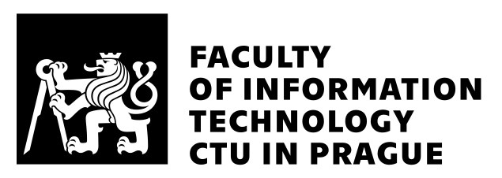

# BT - A Tool for Benchmarking and Analyzing SMT Models from RISC-V machine code

This subproject of Selfie serves as a tool for quickly generating, analyzing and benchmarking SMT models generated from RISC-V machine code. The default model builder is Rotor (another Selfie subproject). BT is designed to be easily modifiable; it provides a framework for defining custom commands for generated models and for incorporating new model builders.

Currently BT is able to accept C and C* source files. It uses `gcc` and `Selfie` respectably to compile into RISC-V, but BT is designed to be easily extensible for other languages able to be compiled into RISC-V.

_This software was developed with the support of the Faculty of Information Technology, Czech Technical University in Prague, fit.cvut.cz_

<p align="right">
  
</p>

## Overview

SMT models generated from programming languages typically have very different characteristics from those created by conventional models (e.g. [SMT-COMP](https://smt-comp.github.io)). BT is built to serve as an analytical tool to find these differences, allowing you to compare typical SMT models with those generated from source code. BT also offers a simpler interface than Rotor for generating multiple models at once. This can mean generating from a single source file using different model types or by processing an entire directory of sources. It gives user the possibillity to generate different model types from a single source file and also generate models from entire directory. See section [bundles](#bundles) for more information.

## Model types
Model types specify different configurations for the model builders (Rotor by default) and compilators (gcc and Selfie). These configurations can define:
- The register structure of the model (e.g., 32-bit or 64-bit),
- The model format language (such as SMT2 or BTOR2), and
- The machine word architecture (e.g., riscv, riscu, etc.).

These configurations are described in [config file](config.yml) and can be altered or added by a user.

For example, a model type like `starc-64bit-riscv-smt2` describes its source language, architecture, and model format. Models are described in a tree-like structure.

### Creating new model types
<a id="config-snippet"></a> This is what the model type can look like in config file. 
```yaml
models:
  starc:
    64bit:
      riscv: 
        btor2:
          command: "{rotor} -c {source_file} - 1 -o {output}"
        smt2: 
          command: "{rotor} -c {source_file}  - 1 -k -smt -nocomments -o {output}"
```
There are important rules that have to be followed for BT to be able to parse these model types.

1. Every path must end with a valid model format (also defined in config file), in the example it is `btor2` and `smt2`. Based on this key, BT will decide what parsers, presenters and model objects to create.
2. Every model format must also be followed by command key that tells BT how to invoke a model builder. (In current version BT assumes that every model builder will only need path to it's binary, a source file and optional output parameter.)
3. If source is compiled, anywhere in the tree structure there needs to exists a `compilation` leaf that specifies compilation command.

---

## Features

- **Configuration:**  
  Easily configure model types and add new ones. You can also define alternative model builders besides Rotor.

- **Modularization:**  
  BT currently supports SMT2 and BTOR2 models (with support for C and C* source files, due to current limitations with Rotor). Its modular design enables developers to add additional model formats and support for new source languages and solvers.

- **Graphing:**  
  Generate graphs focused on analyzing the provided models, making it easier to visualize and interpret generated models (WIP - and later also benchmark results).

- **Bundle Generation:**  
  BT offers a flexible interface for generating models in bundles—easily process whole directories or generate variations from a single source with multiple commands.

## Requirements
- **Python Version:** Python 3.8+
- **Required tools:** `pip`
- **Dependencies:**: See [requirements.txt](requirements.txt)

### Optional Dependencies (based on usage)

- **[Bitwuzla](https://bitwuzla.github.io/)**  
- **[Z3](https://github.com/Z3Prover/z3)**  
- **[gcc-riscv](https://github.com/riscv-collab/riscv-gnu-toolchain)**

All optional dependencies are included in the provided Dockerfile.

To get started quickly, you can build and run the Docker container with:

```bash
docker build -t your_image_name .
docker run -it your_image_name
```

## Installation

The simplest way to start is to run the `setup.sh` script. Script sets up a local virtual environment and installs all dependencies automatically.

```bash
$ git clone git@github.com:cksystemsteaching/selfie.git
$ cd selfie/benchmark
$ ./setup.sh && source venv/bin/activate
```
---
## Usage

BT is designed to be run from the command line. Below are some example invocations.
### Command-Line Options
Run the tool with `--help` for more details. For quick reference, here is the current help output:

```bash
$ python3 bt.py --help
usage: bt.py [-h] [-m MODEL_TYPE] [-s SOURCE] [-l LOAD] [-sl SOLVER] [-t TIMEOUT] [-o OUTPUT] [-v] [-g]

Tool for generating SMT models from RISC-V machine code and benchmarking SMT solvers using these models

options:
  -h, --help            show this help message and exit
  -m MODEL_TYPE, --model-type MODEL_TYPE
                        Specifies model builder options and compilation commands. Available types are defined in the config file (e.g., 'starc-32bit-riscv-smt2', 'gcc-rv32im-btor2'). Use 'all' to process all available models.
  -s SOURCE, --source SOURCE
                        Path to the input source file/directory. Supported formats: ['.c', '.cstar']
  -l LOAD, --load LOAD  Path to the input load file/directory. Supported formats: ['smt2', 'btor2']
  -sl SOLVER, --solver SOLVER
                        Specify which SMT solver to use for benchmarking. Available solvers: ['z3', 'bitwuzla', 'bitwuzla-py']. Note: If not specified, only model generation will be performed.
  -t TIMEOUT, --timeout TIMEOUT
                        Maximum time (in seconds) allowed for solver execution. Default: 600 seconds (10 minutes)
  -o OUTPUT, --output OUTPUT
                        Output path for the generated model - if not provided BT will generate one from source path and model type. Note: Only provide an output directory when loading/sourcing a directory." Default output path from config:
  -v, --verbose         Enable verbose logging.
  -g, --graph           Generate visualization graphs for the analysis. Graphs will be saved in the output directory.
```
### Basic Command-Line Invocation

The general command syntax is:

```bash
python3 bt.py --source <source_file_or_directory> [--model-type <model_type>] [options]
```

For example, to generate two models (one in SMT2 format and one in BTOR2 format), generate graphs, and obtain verbose output—with all output placed in the `./models` directory—you can run:
```bash
python bt.py -s ../examples/symbolic/simple-if-else-1-35.c -m starc-64-bit-riscv -o ./models -g -v
```

### Loading models
BT is also able to load models, this can be useful for analyzing models that are not generated (e.g. SMT-COMP benchmark models) or when user wants to analyze already generated models again.
```bash
python bt.py -l smt_comp_models/ -g
```
 An additional feature is that you can combine this with analyzing and benchmarking source files. The generated graphs will combine all loaded and newly generated models.
 ```bash
 python bt.py -l models/ -s ../examples/symbolic/ -m starc-64-bit-riscv-smt2 -g -v
 ```

### Using defined model types
As mentioned previously model types are defined in a tree-like structure inside a [config file](config.yml). To provide BT with a valid model type you can just follow it's structure in the config file. Each model type is a path from root to the leaf divided by '-'.


To generate a model using model type showcased [_Model types_](#config-snippet), BT can be called like this:
```bash
python bt.py --source {source} -m starc-64bit-riscv-smt2
```
Imporant to note is that although every model type needs to have a `command` key, user does not provide it as part of the argument when invoking BT.

---
## Bundles

### Source Files
The easiest way to process multiple source files is by specifying a whole directory. BT will parse the directory and pass all relevant sources to Rotor. (Note: In the current version, parsing is not recursive.)

**Example:**
```bash
python bt.py -s ../examples/symbolic
```

### Model Types
Within the provided [config file](config.yml), model types are structured hierarchically. Instead of specifying individual model types, you can indicate a branch. BT will then generate models for all leaf nodes of that branch, enabling mass model generation.

**Example:**
To generate models from configuration branch showcased in [_Model types_](#config-snippet), you might run:
```bash
python bt.py -m starc-64bit -s ../examples/symbolic/division-by-zero-3-35.c
```

You can also supply `-m` with a special keyword `all` that will try to generate all model types available in the config file.
---
## Solvers
Two SMT solvers are implemented in BT. [Bitwuzla](https://bitwuzla.github.io/) and [Z3](https://www.microsoft.com/en-us/research/project/z3-3/), both very powerful solvers tested in SMT-COMPs. They were chosen because they implement features that Rotor models use. Array and bit-vector theory and support for incremental solving. Solvers are currently invoked with default arguments. In future development this will be looked into.

>Note: Bitwuzla's Python bindings are also available and can be used as a solver. However, they are still in an experimental phase, as some essential components in Bitwuzla PB have not yet been implemented.

## Graphs
When invoked with `-g/--graph`, BT generates analysis graphs for SMT-LIBv2 models in `./graphs/`.  
*(Other formats like BTOR2 will be supported in future releases.)*