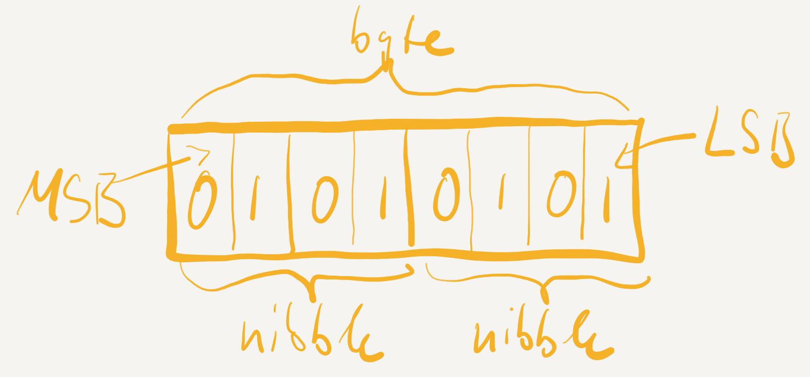
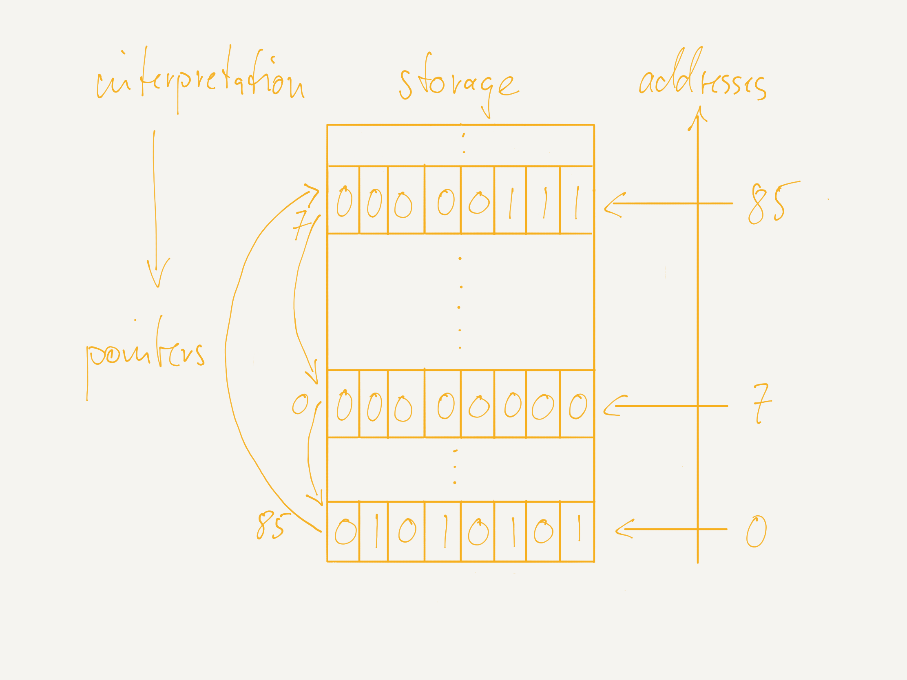
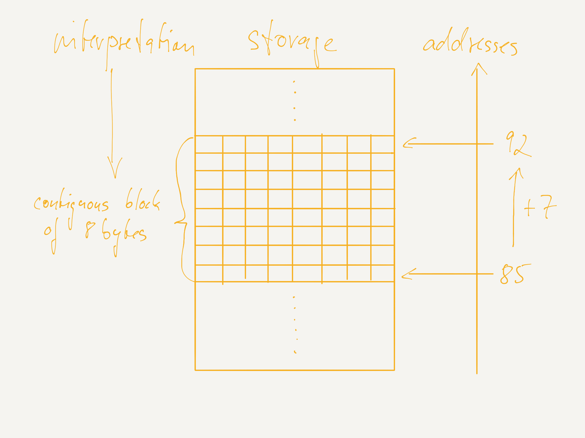
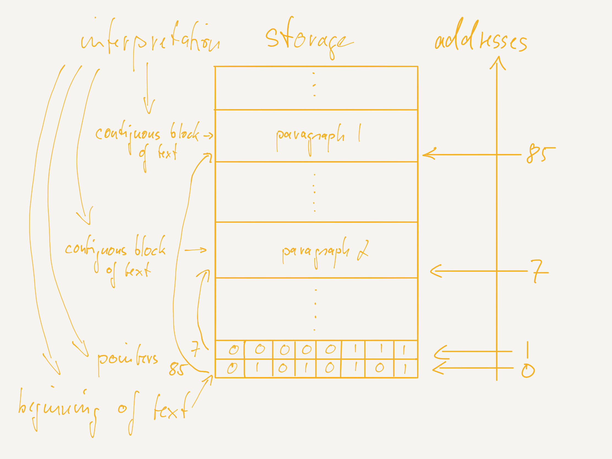
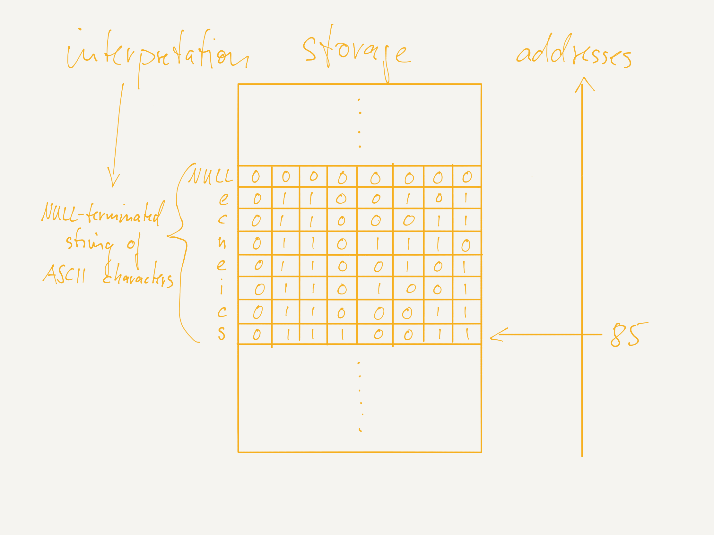
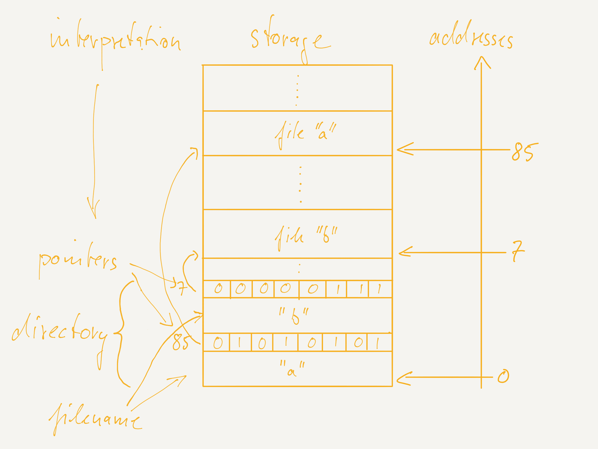
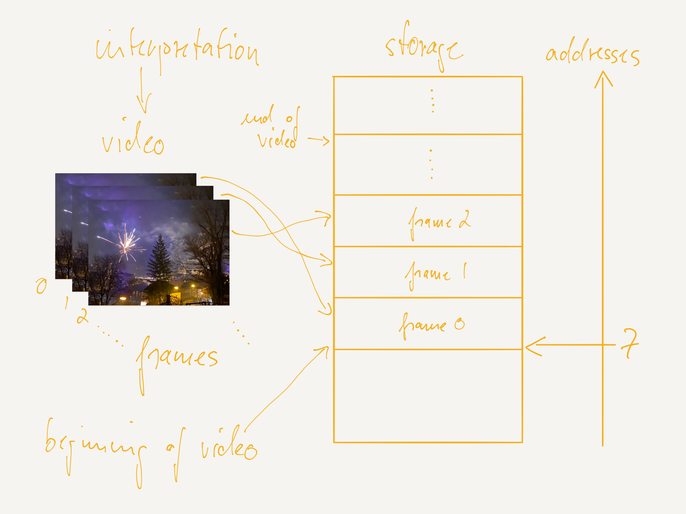
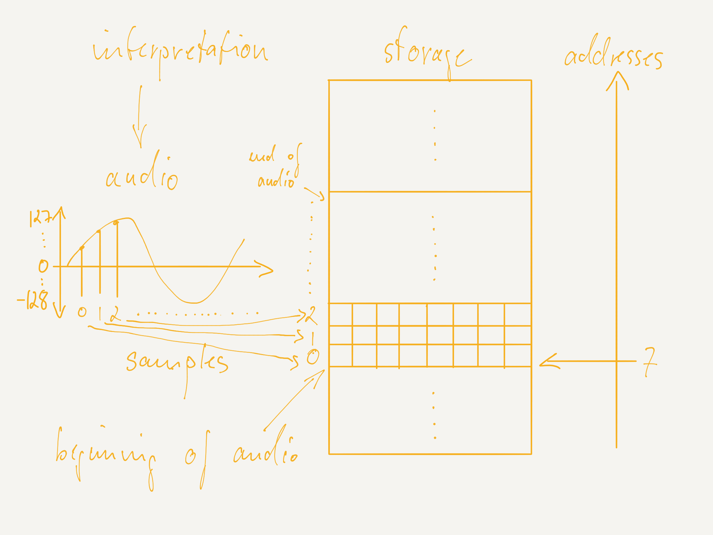

# Elementary Computer Science for All

### by Christoph Kirsch

#### Acknowledgements

This book is the result of many years of teaching and working with students and colleagues around the world. I am grateful to my group of students and faculty in Salzburg who, over the years, helped me with refining and deepening my understanding of computer science. I am also particularly grateful to my colleague Professor Raja Sengupta at UC Berkeley who challenged me to the point that made me start developing the Selfie Project which is the foundation of this book. The design of the Selfie compiler is inspired by the Oberon compiler of Professor Niklaus Wirth from ETH Zurich. The design of the Selfie microkernel is inspired by microkernels of Professor Jochen Liedtke from University of Karlsruhe.

## Introduction

Computer science is a mystery to so many and yet more and more people use computers every day in one form or another. There are increasingly many people with all kinds of backgrounds other than computer science that may even code every day in one way or another. At schools, colleges, universities, and companies around the world there is hardly anyone left who is not confronted with the machine and its code. But even for people just using the machine in their hands, on their desks, and in the cloud there is often that unsatisfactory experience of not understanding what is really going on. This book will empower you to turn your smart phone, tablet, and laptop into what they are supposed to be: the most fascinating and powerful tools ever created rather than the seemingly unavoidable nightmare of so many people, amateurs and professionals alike.

We would like to emphasize that the book is not about how to use any particular device such as a smart phone or an office app such as Word or Excel. There are plenty of books about that. Also, the book is not just about developing code. The goal here is more ambitious than that and you will be challenged accordingly. The idea is to explain the absolute basics of computer science in order to develop a fundamental understanding of what software is and how it works in general on any hardware. Developing code is just one part of that. In fact, understanding the basics enables you to learn *any* programming language you like, not just the one we use here, ultimately allowing you to make informed decisions about computers and solve whatever computer problem comes along. The key challenge in doing so is to have you understand that everything can in principle be automated by a computer but only by breaking down the solution of a problem into the tiniest steps that a mindless machine can follow. Laying out even the most obvious parts of a solution is in fact what computer scientists do. Seeing that will make you sharpen your mind considerably and even change the way you think.

Think of this book as an introduction to *elementary computer science* similar to *elementary arithmetic* taught in primary and secondary school. The vision is to have you look at what you know about numbers, geometry, and algebra from the perspective of a mindless machine. If you know how to add two numbers, how to measure the distance between two points, and what a variable and an equation is, you have all what it takes to understand how a computer works and what software is. Developing a curriculum of elementary computer science suitable for upper secondary school and above is nevertheless still work in progress and this book is just one attempt to do so. It will take a lot more time to make elementary computer science as developed and properly taught as elementary arithmetic but it will eventually happen.

While a book about elementary computer science may sound appealing it actually requires commitment to understand the material even though we tried very hard to simplify everything as much as possible. The reason is that computers and software are so expressive that it is unlikely that any other computational machine in the future will be more expressive. Anything that can be computed can be computed now, provided you have enough time, space (as in memory), and energy. That power comes with a level of complexity that is unavoidable but a lot of fun to explore. However, even just natural numbers, geometrical shapes, and algebraic equations are already very powerful concepts as well.

This book is based on the [Selfie Project](http://selfie.cs.uni-salzburg.at), an educational software system that has grown out of many years of teaching undergraduate and graduate classes in computer science. The key observation is that understanding computer science and software in particular can only be achieved by understanding how software translates all the way down to the machine. Selfie shows how to do that. This may sound difficult but can actually be done in systematic and well-founded fashion with a strong focus on basic principles.

Selfie is software that translates software including *itself* to code that can be executed by a computer. Selfie can even mimic the very computer that can execute the code of selfie. This means selfie cannot only translate itself but also execute its own translation to translate itself again and so on. By now your mind might be spinning but you at least understand why selfie is called selfie.

Why is the *self* so important? Because it shows how meaning is created systematically on a machine. Selfie is software written in some programming language. However, selfie also defines the meaning of that language which implies that selfie defines its own meaning. This is very similar to an English dictionary written in English. The only difference is that selfie defines meaning formally in such a way that a machine can run selfie and thus any software written in the language in which selfie is written. Understanding that will completely change what you think of computer science and possibly many other things in life.

The book begins with a bit of groundwork emphasizing the fact that everything happening on a computer, phone, or tablet is encoded in bits, and nothing else. The only reason why these machines are so powerful and in fact computationally universal is the enormous amount of bits they can store and the speed and energy efficiency at which they can manipulate these bits. This insight is key to understanding information technology and therefore emphasized throughout the book. We begin with examples of how every day *information* such as numbers, characters, text, files, images, video, audio, and even code and apps are all encoded in just bits. We also show how those bits are later decoded back to their original form making them accessible to humans again.

The next topic is a simple yet representative *machine model* of virtually any computing device available today. The model is in fact a subset of an existing, fully realistic machine that we developed during the course of teaching undergraduate students for two decades. The goal is to enable you to develop an intuition of how computers work on the level of bits, which is surprisingly simple to do. Most of the complexity of modern computing devices is due to performance optimizations which we deliberately leave out to keep things accessible. Instead we focus on developing an early intuition on what code and data is, what the difference is, and the fact that both are anyway encoded in just bits. This chapter also includes a simple model of machine memory and exposes you to fundamental properties that have direct counterparts in the real world, as it is often the case with computer science, such as the decision of whether to throw away something (forget) or to keep it (memorize).

With the machine model in mind, you will appreciate the fact that developing software directly on the machine is possible but too cumbersome and errorprone. It is therefore time to introduce the notion of high-level *programming languages*. Similar to the machine model, we introduce a simple yet representative programming language which is, again, a subset of an existing, in fact still widely used programming language called C. The language we use has also been developed during years of teaching. The idea of this chapter is to show how simple programs written in that language are actually run on a computer using the previously introduced machine model. Here there are plenty of opportunities to point out fundamental questions such as how long and how much memory and energy it takes to solve a problem and whether a problem can be solved at all. The latter, for example, explains why computers sometime become unresponsive for unpredictable amounts of time driving their users mad.

Even the most convenient high-level programming languages are by far not enough to enable software developers build the most complex systems ever created by humans. Like all engineers they need *tools* to do it. Software development tools are interesting because their design explains a lot about what software is. In fact, the tools define the *semantics* of a programming language, that is, what a program written in a programming language actually means. This is usually done through language translation. Thus exposing you to the design of the tools is key to showing how meaning is given to code, at least in principle. There are fascinating analogies in the real world such as the self-referential paradox that an English dictionary defines the meaning of English using English. The same is true with software development tools. They are usually written in the programming language to which they give meaning. The difference to English though is that there is no apparent paradox here. Showing how that works is our goal. You will then start asking questions about computers you would have never been able to ask before. We envision the outcome to be new insights into what is possible and what is not, enabling you to develop more confidence when it comes to assessing new technology such as artifical intelligence and self-driving cars.

One of the key breakthroughs of recent years is that computation has become a utility just like electricity and water. Cloud computing and, in the near future, edge computing creates enormous potential, just like the reliable availability of power and water. There is no need anymore to operate your own machines other than client machines such as your smartphone. As long as you have a network connection, any form of computational platform is available to you. The key enabling technology is *virtualization* which is a concept whose understanding is elusive even to many computer science students. However, we developed a way to teach virtualization in simple terms accessible to anyone based on a combination of our machine model, programming language, and tool set. The idea is to demonstrate how software can create any computational platform, including the one it runs on, very efficiently. This is another form of self-referentialy that is fundamental in computer science. Seeing that enables you to grasp the full extent of the universality of computing.

Readers should have a background at the level of upper secondary school or above. The prerequisites for following the material presented here are an understanding of elementary arithmetic (addition, subtraction, multiplication, and division of whole numbers), elementary geometry (one- and two-dimensional shapes), and elementary algebra (variables, algebraic equations). The prerequisites are anyway revisited in the book.

## Information

Computer science is about the automation of everything. Think of something you would like to do but then not do it yourself but have a machine do it for you. Whether this is always possible is still being debated but not our concern here. Well, we believe that it is always possible but many people and thus companies often underestimate the enormous complexity involved in seemingly simple tasks such as driving a car. The issue is that whatever problem you are trying to solve you first need to *encode* the *information* involved in solving the problem in such a way that a machine can handle it. And then you need to tell the machine every single step of how to *manipulate* that information which is tedious even for extremely simple tasks. Finally, you need to *decode* the result back into something a human can experience.

Let us take a look at an example. Suppose we would like a machine add two decimal numbers, say, 85 and 7. However, a computer cannot even handle 85 and 7. It can only handle *bits*, 0s and 1s. So, the first step is to encode 85 and 7 in bits. In fact, we say we encode them as *binary numbers*. How do they look like? Well, 85 is 1010101 in binary, and 7 is 111. Then we need to tell the machine how to add the two numbers, but not as 85 and 7, but rather in their binary form 1010101 and 111. Finally, the result will be a number but of course encoded in binary. We therefore need to take those bits and decode them back to a more human-readable form which is hopefully 92. The cool thing is that you already know how to do all that, if you know decimal numbers. You are just not aware of that!

Why is it important to know how binary numbers work? Because binary numbers are used to represent virtually all other types of information: text, files, images, video, audio, even code and apps. Everything a computer does is essentially adding, subtracting, multiplying, dividing, and comparing binary numbers. To do that the machine uses Boolean Algebra, that is, Boolean Logic on bits, which may sound scary but is incredibly simple and easy to understand. So, we begin with bits, then binary numbers, and then Boolean Algebra. After that we focus on negative numbers which are a bit tricky but fun to explore and necessary for running code. The way they are handled is very cool. In fact, it turns out that it is just up to our interpretation of what a binary number such as 1010101 actually means. It may of course encode the positive number 85, if we interpret the bits as something called an unsigned integer, but it may also encode the negative number -43, if we interpret the bits as signed integer. We continue exploring that line of thought by showing how characters are encoded in bits. Here, it turns out that 1010101 may in fact also encode the uppercase letter U. Based on what we know about binary encodings of numbers and characters, we then show how those can be composed to encode larger structures such as text, files, images, video, audio, and even code and apps.

The key lesson to be learned here is that 1010101 or any other bit sequence may encode whatever we want it to encode. However, some encodings are better than others for very good reasons. After all, the machine needs to work with these bits and eventually convert them back to human-readable form. We learn about all that as well.

### Bits

A *binary digit* or *bit* is a unit of information, abbreviated by the lower-case letter *b*, that can distinguish exactly two different things. In fact, we say that a bit can be in exactly one out of two different *states*. It can be either 0 or 1, on or off, true or false, or whatever we want to call it. The only thing that is relevant about a bit is that it is always in exactly one out of two states. And the only thing a computer can do is storing bits and changing bits from one state to the other and back, that is, from, say, 0 to 1 and from 1 to 0.

How can then a bit be used to do anything useful beyond that? Well, by taking more than one bit, of course. Let us take two bits. Now, we can suddenly be in *four* different states denoted by, say:

00, 01, 10, and 11,

which could be used to encode the decimal numbers:

0, 1, 2, and 3,

but not more. By the way, computer scientists always start counting with zero, not one, to avoid wasting the state in which all bits are zero. What if we take three bits? It is then *eight* different states, that is:

000, 001, 010, 011, 100, 101, 110, and 111,

which allow us to encode, say, the decimal numbers:

0, 1, 2, 3, 4, 5, 6, and 7.

By now, we can already anticipate how this continues. With each additional bit, the number of different states that we can be in *doubles*! This is huge. It is called *exponential* growth.

Let us look a bit closer at how many states a growing number of bits can be in. One bit can be in two states, two bits can be in four states, and so on. So, it is:

2, 4, 8, 16, 32, 64, 128, 256, 512, 1024 states,

and so on. This is like the tables up to ten (bits) but of a computer scientist! You may have actually seen these numbers before but probably never knew where they came from. Try continuing the series yourself with more bits! 2048, 4096,... You will quickly run out of room.

Imagine, your cell phone can probably store a few billion bits. How many states is that? Far more than there are particles in the known universe! Just in your pocket! This also means that the bits in your phone can be in so many different states that your phone would have long turned to dust before being able to try out all possible states these bits can be in. Conversely, it is unlikely that the bits in your phone will ever be in a state they have been in before since some bits are usually used to keep track of time and other environmental factors such as battery health which keep changing over time.

So, what is it that your cell phone or any other computer does? Well, it really just stores an enormous amount of bits that are in a given state, which means each of those bits is either 0 or 1. And then the machine identifies at least one of those bits and then changes it from 0 to 1 if the bit was 0, and from 1 to 0 if the bit was 1. We call that change a *bit flip*. After that flip, the computation is either finished or the machine identifies another bit, or even the same bit as before, and flips that bit, and so on. Such a sequence of bit flips is what we call *computation*.

Everything you see the machine does, play a song, play a movie, call someone, send a text, and so on is done by just storing and flipping bits, and nothing else. In particular, the machine has no concept of what those bits mean, really no idea! It is us humans who are supposed to know what they mean and the rest of the chapter is about that. Ok, but how does the machine know which bits to flip? Well, it is software that *instructs* the machine to do that. Where is that software? Well, it is also encoded in the bits stored by the machine. And it is again us humans who are supposed to know what they mean. The machine chapter which follows this chapter is about that.

The key lesson to be learned here is to accept the fact that computers just store and flip bits. In a computer there is no text, no audio, no video, not even code, just bits. The only reason computers are so cool is because they can store incredibly many bits, billions and billions of bits, and they can flip these bits incredibly fast and efficiently, that is, they can flip billions of bits per second with very little power consumption. But still there are so many different states billions of bits can be in that a computer can never explore all possible states. This gives us room for unlimited innovation.

### Numbers

Let us go back to the example of adding the two decimal numbers 85 and 7. Do you remember how to do that by hand? Of course, you do! We go from right to left, digit by digit. First, take the two rightmost digits 5 and 7 and add them. The result is obviously 12. The 2 in 1**2** is already the rightmost digit of the sum of 85 and 7 which is obviously 9**2**. The more interesting phenomenon here is that the result of adding 5 and 7 needs an extra digit, that is, the 1 in **1**2. We need to acknowledge that by *carrying* that extra digit to the left and, in our example here, add it to 8 which results in 9, of course. And that 9 is the digit to the left of 2 in the sum of 85 and 7. Done!

The reason why we go through this is because a computer does the exact same thing, just with binary numbers. But that only works if we encode our decimal numbers properly in binary. Out of the many different ways of encoding numbers in binary there is only one way that makes addition in binary work the same way it works in decimal. To understand how to do that we need to remind ourselves how decimal notation actually works.

Take 85, for example. The decimal number 85 represents the value:

**8**\*10+**5**.

With an even bigger decimal number, say, 285 you should see how this works in general. It represents the value:

(**2**\*10+**8**)\*10+**5**.

Decimal notation is positional. That means that the value of a digit, say, of 8 in 2**8**5 depends on its position relative to the digits to its right, and it depends on the number of symbols available per digit which is of course 10 with decimal notation, that is, the 10 different symbols:

0, 1, 2, 3, 4, 5, 6, 7, 8, and 9.

The number of symbols available per digit is called *base*. So, decimal notation uses base 10.

The only difference between decimal and binary notation is the number of symbols available per digit, that is, the base. With binary notation there are of course just two symbols, say, 0 and 1. Thus the base of binary notation is 2. Calculating the value of a binary number works accordingly. For example, the binary number 111 represents the decimal number 7 because:

(**1**\*2+**1**)\*2+**1** = 7.

The binary number 1010101 represents 85 because:

(((((**1**\*2+**0**)\*2+**1**)\*2+**0**)\*2+**1**)\*2+**0**)\*2+**1** = 85.

Take a piece of paper and a pen (not a computer!) and convert a few other binary numbers to decimal for yourself!

The other direction is also easy, just do the exact opposite. Take 85, for example, divide it by 2 and write down the quotient 42 and the remainder 1 which becomes the rightmost digit (bit) in 101010**1**. Continue the process until the quotient becomes 0:

85 = 42\*2+**1** = (21\*2+**0**)\*2+**1** = ((10\*2+**1**)\*2+**0**)\*2+**1** = (((5\*2+**0**)\*2+**1**)\*2+**0**)\*2+**1** = ((((2\*2+**1**)\*2+**0**)\*2+**1**)\*2+**0**)\*2+**1** = (((((1\*2+**0**)\*2+**1**)\*2+**0**)\*2+**1**)\*2+**0**)\*2+**1** = ((((((0\*2+**1**)\*2+**0**)\*2+**1**)\*2+**0**)\*2+**1**)\*2+**0**)\*2+**1**

Again, try to convert a few other decimal numbers to binary!

The other thing about binary is that counting is just as easy as in decimal. Remember the sequence of 3-bit states from above:

000, 001, 010, 011, 100, 101, 110, and 111?

That sequence corresponds to the binary encoding of the decimal numbers:

0, 1, 2, 3, 4, 5, 6, and 7.

Try to count with four bits!

Notice that the value of a digit increases as it appears further to the left of other digits. In fact, with binary notation it increases by a factor of 2, that is, by an *order of magnitude*, for each digit to the right of it. Similarly, with decimal notation it increases by a factor of 10. This is genius. The idea is called *hindu-arabic* notation. And the thing that is arabic about it is that the value of digits depends on what is written to the right of their position rather than all other writing in Western culture where content develops from left to right.

The other thing that is cool about that notation is that it is so compact, in fact, exponentially more compact than *unary* notation using base 1, so just one symbol, say, the bar | symbol. Take 85, for example, in unary:

|||||||||||||||||||||||||||||||||||||||||||||||||||||||||||||||||||||||||||||||||||||

Have you verified the number of bars? Decimal notation needs just two digits to encode the 85 bars! Binary needs seven digits, or bits. Why do we then use binary rather than decimal in computers? Well, because decimal only requires about three times fewer digits than binary, no matter which number, which is negligible compared to the exponential savings compared to unary. Also, constructing a machine that can distinguish ten rather than just two states per digit is much harder. So, we are good. The only reason why people sometimes use unary is because addition including counting is fast. Just add bars to the right. But we see below that binary addition is still fast enough.

Ok, but writing numbers down in binary by hand is still about three times more work than in decimal. We understand that but there is a solution that is even better than decimal. It is called hexadecimal notation using base 16, so sixteen different symbols per digit. In hexadecimal we use:

the digits 0, 1, 2, 3, 4, 5, 6, 7, 8, 9, and:

the letters A, B, C, D, E, and F.

The letter A represents the value 10, B 11, C 12, D 13, E 14, and F 15.

Since base 16 is a power of base 2, that is, 2 to the power of 4 actually with 16=2\*2\*2\*2, denoted by 2^4, each hexadecimal digit encodes exactly four bits which makes it much more convenient to convert between binary and hexadecimal rather than binary and decimal. And, we save four (!) times the number of digits with hexadecimal notation compared to binary notation. Try 85, that is, 1010101 in hexadecimal. It is 55. In fact, to avoid confusion, we say 0x55 where the prefix *0x* indicates that the following number is in hexadecimal rather than decimal notation. Let us verify that 0x55 is indeed 85 by calculating:

**5**\*16+**5** = 85.

What is, say, 0xFF in binary and in decimal? It is 11111111 and 255, respectively. Try to verify that!

There is one more notation that is popular among computer scientists and we would like to mention that here. It is octal notation using base 8, so eight different symbols:

0, 1, 2, 3, 4, 5, 6, and 7.

The reason why it is popular is because base 8 is also a power of 2 with 8=2^3. Thus each octal digit encodes exactly three bits. Take 1010101, for example, which is 125 in octal notation because:

(**1**\*8+**2**)\*8+**5** = 85.

In order to avoid confusion, we may use the prefix *0o* with octal numbers, that is, 0o125, for example, and the prefix *b* with binary numbers, that is, b1010101, for example.

In sum, we have seen unary, binary, octal, decimal, and hexadecimal notation that all work exactly the same, except for unary, just using different bases and thus a different number of symbols per digit. Did you know that before? Probably not. But, if you knew decimal notation already, and you likely did, then you already understood the other notations as well just without being aware of that and without being used to them. Just try to convert a few more numbers now to practice!

Let us again go back to the example of adding 85 and 7. By now, we know their binary encoding, that is, 1010101 and 111. We are thus ready to perform binary addition, just like a computer, by doing exactly what a human does with decimal addition. Take the rightmost digits (bits) of the two *addends*:

101010**1** and 11**1**,

also called the *least-significant bits* (LSBs), and add them. They are both 1. Adding 1 and 1 in binary is of course 10 which is 2 in decimal. This means that the LSB of the sum of 1010101 and 111 is the 0 in 1**0**. But we need to carry the 1 in **1**0, also called the *carry bit*, to the left now and add it to the second LSBs 0 and 1 in:

10101**0**1 and 1**1**1.

So, we are actually adding three bits now, 0 and 1 plus the carry bit 1. The result is of course 10. The 0 in 1**0** is now the second LSB of the sum and the 1 in **1**0 is the new carry bit. Now, we need to add that carry bit to the third LSBs 1 and 1 in:

1010**1**01 and **1**11.

This means we are adding 1 and 1 plus the carry bit 1. The result is of course 11 which is 3 in decimal. Not that hard, right? So, the 1 in 1**1** is now the third LSB of the sum and the 1 in **1**1 is the new carry bit. From now on the process continues with no further surprises until we reach the leftmost or *most-significant bits* (MSBs). Here is a summary but try to complete it yourself on a piece of paper:

```
 1010101 = 85
+0000111 =  7
—————————————
 1011100 = 92
```

So, who would have thought that binary notation and addition works exactly the same as decimal notation and addition? The only difference is the base and thus the number of symbols available per digit. Now, just one more thought about this. Notice that binary and decimal addition takes as many steps as there are digits in the addend with the most digits. This is why manual counting in anything but unary is less convenient. However, since any positional notation with base higher than 1 is exponentially more compact than unary, addition is effectively still fast because the *value* of the involved numbers can get very large even with relatively few digits. Also, there are ways to improve on the number of steps necessary to perform binary addition which we nevertheless ignore here.

Ok, but why do we make you go through all this? It is not just because binary addition is one of the most important operations computers including your cell phone perform, in fact, billions of times per second. It is also to show you something that is even more basic than binary addition. It is called Boolean Algebra, the fundamental building block of all modern computing devices.

### Boolean Algebra

Let us take an even closer look at how binary addition works. Adding two bits requires another two bits for storing the result. One bit for the sum, which is the LSB of the result, and one bit for the carry bit, which is the MSB of the result. Here is an overview of all possible combinations:

```
0+0 = b00 = 0
0+1 = b01 = 1
1+0 = b01 = 1
1+1 = b10 = 2
```

There are at least two interesting observations we can make here. Firstly, the carry bit is only 1 if both addends are 1. This corresponds to a logical *AND* operator! Secondly, the sum bit is only 1 if either the first addend is 1, or else the second addend is 1. This is logical *EXCLUSIVE-OR* or *XOR*! There is also logical *OR* but that is 1 if either of the two addends or *operands* is 1 including both. So, not the right choice here but still important for other things.

Boolean Algebra can only talk about 0s and 1s, and is called Boolean Logic if 0 and 1 represent false and true, respectively. In addition to 0 and 1, Boolean Algebra features logical operators such as the above AND, OR, and XOR. They are referred to as binary operators because they have two operands, not because they operate on bits! There is also one unary operator called logical *NEGATION* or *NOT* which obviously just flips the bit of its single operand:

```
NOT 0 = 1
NOT 1 = 0
```

This is called a *truth table*, which is a bit more interesting for the above binary operators:

```
0 AND 0 = 0
0 AND 1 = 0
1 AND 0 = 0
1 AND 1 = 1

0 OR 0 = 0
0 OR 1 = 1
1 OR 0 = 1
1 OR 1 = 1

0 XOR 0 = 0
0 XOR 1 = 1
1 XOR 0 = 1
1 XOR 1 = 0
```

There are of course more binary operators possible. How many? In total, there are 16, that is, 2^4 different binary operators in Boolean Algebra, simply because their two operands can be in 4 different states requiring 4 results per operator. However, just AND and NOT, for example, can be combined in Boolean *formulae* to mimic all other possible operators such as OR, for example, where X and Y are one bit each:

```
X OR Y = NOT ((NOT X) AND (NOT Y))
```

And vice versa:

```
X AND Y = NOT ((NOT X) OR (NOT Y))
```

These formulae are known as De Morgan’s Laws, something I remember from my first semester more than thirty years ago. However, what is important here is that all these operators can be implemented by *logic gates* which are then put together to form an *electronic circuit* and ultimately a *central processing unit* or *CPU*. The key insight is to see the connection between Boolean Logic and *digital* electronics. The two different states of each bit, 0 and 1, that is, the two different logical statements, false and true, are simply represented by two different *discrete* electronic signals such as low and high voltage, respectively. That's it!

The AND and XOR operators, for example, can be arranged as logic gates to form a so-called *half adder* in an electronic circuit which performs binary addition as described above. We can then extend the half adder to a *full adder*, one for each bit of the addends, which incorporates the carry bit of the less-significant full adder to the right of it, computes its own sum and carry bit, and then feeds its carry bit into the more-significant full adder to the left of it, just like what we did above when adding two binary numbers by hand. In an actual electronic circuit, the exact same thing happens by having the involved bits travel as low and high voltage through the circuit. Everything you see a computer does is essentially based on that connection of Boolean Logic and digital electronics. If you are interested in the topic look for books on computer architecture. It is an incredibly exciting, highly active field that is the foundation of the computer revolution.

Next, we show you how negative numbers are handled, that is, how binary subtraction works. Binary multiplication and division is also important but we leave that out here. In principle, both work the way you learned in school with decimal numbers but we do not need to remember exactly how to follow the material here.

### Negative Numbers

Why are negative numbers and binary subtraction so important to know about? There is a pedagogical and a technical reason. Seeing how negative numbers are encoded in bits is surprisingly simple as well as educational since it can be done in such a way that binary addition, subtraction, and even multiplication works without any modifications. Only division requires attention because it works differently depending on whether the involved bits are supposed to encode positive or negative numbers. Also, subtraction allows us to find out if two numbers are equal or not, simply by subtracting one from the other and comparing the result with zero.

In fact, what may be surprising about subtraction is that a hypothetical computer that can only subtract numbers, compare the result with zero, and depending on the outcome can choose to perform different subtractions and comparisons subsequently and so on, can do anything any other computer in the world can do. Such a machine is called a *one instruction set computer* (OISC). It may be slower than other machines but it can still mimic everything any other machine can do, in particular addition, multiplication, division, and whatever else computers can do.

So, subtraction is special. Suppose we would like to subtract 7 from 85. To do that we first convert the subtrahend 7 into its negative *complement* (without using the sign symbol) and then add that complement to the minuend 85. In other words, we mimic subtraction by using addition on the minuend and the negative complement of the subtrahend. We first show how to do that with decimal numbers and then move on to do the same with binary numbers which explains, at least in principle, how a computer does subtraction.

The negative complement or *radix complement* of a number depends on the *radix* or base of the notation in which the number is written down. The radix complement of a decimal number is thus the *tens complement* of that number. To calculate the tens complement we first need to decide the maximum number of digits we support in any of the involved numbers. For the example here, we need at least 2 digits (because of 85). The tens complement of 7 (with a maximum of 2 digits) is:

```
100 - 7 = 93
```

So, 93 represents -7 here. If we were to support 3 digits the tens complement of 7 would be:

```
1000 - 7 = 993
```

and so on. The only issue is that calculating the tens complement is not much easier than subtraction itself. But, calculating the *diminished radix complement* is! The diminished tens complement or *nines complement* of 7 is:

```
99 - 7 = 92
```

If a given number fits the number of supported digits, the diminished radix complement of that number can easily be calculated digit by digit! Here, it is for, well, `99 - 07 = 92`:

```
9 - 0 = 9
```

and

```
9 - 7 = 2
```

However, we need the radix complement, not the diminished radix complement. The difference though is only an increment by 1. So, calculating the radix complement is done by first calculating the diminished radix complement and then increment the result by 1.

```
99 - 7 + 1 = 92 + 1 = 93
```

The full story is now as follows:

```
85 - 7 = 85 + (100 - 7) - 100 = 85 + (100 - 1 - 7 + 1) - 100 = 85 + (99 - 7 + 1) - 100
```

The two subtractions, 99 - 7 and 85 + (...) - 100 are both trivial to do:

```
85 + (99 - 7 + 1) - 100 = 85 + (92 + 1) - 100 = 85 + 93 - 100 = 178 - 100 = 78
```

Who would have thought that subtraction is so easy to do? Now, we are even ready to do the exact same thing with binary numbers and their *twos* and *ones complement*. In binary, `85 - 7` is:

```
 1010101 = 85
-0000111 =  7
```

Let us say we support seven bits which is why we say `0000111` rather than just `111`. Like the above calculation in decimal, we proceed by inserting the twos rather than the tens complement into the calculation as follows:

```
  1010101 = 85
+10000000
- 0000111 =  7
-10000000
```

Since calculating `10000000 - 0000111` is again still difficult, we replace the twos complement with the ones complement and an increment by 1:

```
  1010101 = 85
+10000000
- 0000001 =  1
- 0000111 =  7
+ 0000001 =  1
-10000000
```

Calculating the ones complement `1111111 - 0000111` is easy:

```
  1010101 = 85
+ 1111111
- 0000111 =  7
+ 0000001 =  1
-10000000
```

Just flip the seven bits of the subtrahend `0000111`:

```
  1010101 = 85
+ 1111000 = ones complement of 7
+ 0000001 =  1
-10000000
```

And then increment the ones complement by 1 to obtain the twos complement:

```
  1010101 = 85
+ 1111001 = twos complement of 7
-10000000
```

Now add the minuend and the twos complement of the subtrahend:

```
  1010101 = 85
+ 1111001 = twos complement of 7
——————————————
 11001110 = 85 + two’s complement of 7
```

And finally get rid of the MSB to correct for introducing the twos complement:

```
 11001110 = 85 + two’s complement of 7
-10000000
——————————————
  1001110 = 78
```

Try to practice this with different numbers!

Before going just a bit further into the details, there is one more interesting notation, in addition to unary, binary, octal, decimal, and hexadecimal, that we would like to mention first. It is *ternary* notation with base 3. A digit in a ternary number is called a *trit* which can either be denoted by 0, 1, and 2 but also by -1, 0, and +1. There were in fact attempts to build ternary computers a long time ago. The reason is that positive as well as negative numbers can be encoded naturally in ternary notation, and that ternary arithmetics may in theory be faster than binary arithmetics. However, distinguishing three rather than two states in electronic circuits adds complexity to the design making it hard for ternary computers to compete. So, for now we are stuck with binary.

### Integers

You may have noticed that depending on the involved numbers subtraction using radix complement appears to produce incorrect or at least strange results, independently of the base. Take, `85 - 86`, for example, in binary using seven bits:

```
 1010101 = 85
-1010110 = 86
```

As before, calculate the ones complement of the subtrahend 86 first:

```
  1010101 = 85
+ 0101001 = ones complement of 86
+ 0000001 =  1
-10000000
```

and then the twos complement:

```
  1010101 = 85
+ 0101010 = twos complement of 86
-10000000
```

Finally, add the minuend and the twos complement of the subtrahend:

```
  1010101 = 85
+ 0101010 = twos complement of 86
——————————————
  1111111 = 85 + twos complement of 86
```

and correct for introducing the twos complement:

```
  1111111 = 85 + twos complement of 86
-10000000
——————————————
 -0000001 = -1
```

The result appears to be correct but either requires the sign symbol to represent it or skip the last step and simply assume that `1111111` represents -1. Well, the latter is what is done. After all, the twos complement of `1111111` (with seven bits) is 1. However, we need to be clear about the consequences. Using radix complement to encode negative numbers effectively cuts the number of *absolute* values that a given number of digits can distinguish in half.

Seven bits, for example, can distinguish 128 different values. Thus binary encoding in seven bits but without twos complement supports representing 0 through 127. With twos complement it is the same number of different values but shifted by 64, that is, it supports representing -64 through 63 including 0. Adding more bits, fortunately, still doubles the number of different values that can be represented, no matter if we use twos complement or not.

But why does the above example work if seven bits only fit -64 through 63? Both, 85 and 86 are clearly outside that range. It works but only for the actual subtraction operation. In other words, the encoding of 85 and 86 in seven bits is correct but only if we *interpret* their binary encoding as *unsigned* from 0 to 127. If, on the other hand, we interpret it as *signed* from -64 to 63 using twos complement for negative numbers, their encoding in seven bits is incorrect since:

```
1010101 = 85 in unsigned interpretation
```

but:

```
1010101 = -43 in signed interpretation
```

because:

```
 0101010 = ones complement of 1010101
+0000001 = 1
————————————
 0101011 = twos complement of 1010101
```

where `0101011` is binary for 43.

Similarly, 86 encoded in seven bits is -42 in signed interpretation. However, `-43 - -42` is of course still -1 which explains why the above subtraction actually works.

How do we recognize binary numbers to represent positive or negative numbers? Well, the key lesson to be learned here is that we cannot! They are just bits. But, we can still interpret them, as unsigned or signed, for example, and there is a simple rule here. Assuming we use twos complement to encode negative numbers and have agreed to support a given number of bits, say, seven bits, their MSB indicates right away if they encode a positive or a negative number. In signed interpretation, if the MSB is 1, the number is negative and otherwise positive. Just check again the above signed interpretation of **1**010101 which is obviously negative.

To make the above example of `85 - 86` work in signed interpretation even for the individual binary encoding of 85 and 86, we simply use one more bit extending the supported range from -64 through 63 to -128 through 127. Notice that the actual computation does not change a bit, literally, except that the signed interpretation of the involved numbers is now as intended:

```
 01010101 = 85
-01010110 = 86
```

becomes:

```
  01010101 = 85
+ 10101001 = ones complement of 86
+        1
-100000000
```

and then:

```
  01010101 = 85
+ 10101010 = twos complement of 86
-100000000
```

Then add:

```
  01010101 = 85
+ 10101010 = twos complement of 86
———————————————
  11111111 = 85 + twos complement of 86
```

and finally correct the result:

```
  11111111 = 85 + twos complement of 86
-100000000
———————————————
 -00000001 = -1
```

Let us take a step back here and reflect on what we have seen. Numbers for most of us are a concept we first heard about in school in the context of elementary arithmetics. Back then we learned how to add, subtract, multiply, divide, and compare numbers, not just to know how to do that but also to develop an intuition on what numbers are and what properties they have. However, one thing that probably never occurred to us was that the amount of numbers available to us could be limited and that there would be a cost involved in working with them. In short, we believed there are infinitely many and arithmetic is free for all. In computer science, this is different!

Everything on a computer is finite simply because there are only finitely many bits the machine can store. There may be an awful lot of bits but still. Also, flipping bits costs time and energy. It is not free. All this means that everything a computer does costs time and energy and is still always finite including numbers encoded in bits. Things may get very, very large but still.

In short, computer scientists worry about time, space, and energy. How long does it take to add two numbers? How many bits do I need to encode the involved numbers? How much power does it take, that is, when does my battery run out of power or when do I need a stronger power plant? When we are talking about billions and billions of additions and billions and billions of bits this all becomes highly relevant fast.

What is important for us here is to understand that kind of mindset. Computer science is not mathematics. Let us take the example of numbers, in fact, *whole numbers*. We have seen how to encode positive and even negative numbers in bits. But no matter how many bits we use, those encodings can in the end only represent finitely many numbers. Also, addition on anything but unary takes as many steps as the number of digits we decided to use. Yet anything but unary saves exponentially many digits that we need to encode a given number. This is called the *time-space trade-off* in computer science which occurs in a lot of other circumstances as well. It refers to the phenomenon that minimizing the number of bits to encode something often leads to more steps a computer needs to take to do something useful with the encoding, and vice versa.

When it comes to numbers, most computer scientists have agreed to distinguish the terms *whole numbers* and *integers*. Whole numbers refer to the concept of whole numbers in a mathematical sense. Integers, on the other hand, refer to the finite representation of whole numbers on a computer. For us here, whole numbers is math, integers is computer science.

Furthermore, most computer scientists have agreed to use *unsigned integers* to represent whole numbers from 0 to 2^n-1 using binary encoding where n is the number of bits in the encoding. The *upper bound* 2^n-1 is so important, it even has an acronym as name. It is called UINT_MAX which stands for unsigned integer maximum. For seven bits, for example, UINT_MAX is 127. What is it for eight bits? Well, it is 255. If you want to be clear about the number of bits, say, eight bits, you may say UINT8_MAX rather than just UINT_MAX. Modern machines work with even larger versions, for example, UINT16_MAX which is 65,535, UINT32_MAX which is 4,294,967,295, and even UINT64_MAX which is a whopping 18,446,744,073,709,551,615.

There is also agreement to use *signed integers* to represent whole numbers from -2^n-1^ to 2^n-1^-1 in binary encoding with twos complement for negative numbers. Here, the upper bound 2^n-1^-1 is called INT_MAX which stands for (signed) integer maximum. The *lower bound* -2^n-1^ is called INT_MIN which obviously stands for (signed) integer minimum. So, again for seven bits, INT_MAX is 63 and INT_MIN is -64. Just to get a feel for it, INT64_MAX, for example, is 9,223,372,036,854,775,807 and INT64_MIN is -9,223,372,036,854,775,808. Try to calculate INT16_MAX, INT16_MIN, INT32_MAX, and INT32_MIN yourself!

There is one more thing before we move on. Notice that the same binary numbers may sometimes be greater than others and sometimes less! Take our favorite binary numbers 1010101 and 111, for example. 1010101 is clearly greater than 111, right? Well, it depends on our interpretation of 1010101 and 111. If 1010101 and 111 are interpreted as unsigned integers, the answer is yes. But if they are interpreted as signed integers with seven bits, the answer is no! In that case, 1010101 stands for -43 while 111 still stands for 7. This means there is unsigned and signed comparison of binary numbers. Addition, subtraction, and even multiplication, however, work the same way independently of unsigned and signed interpretation. Only division is, similar to comparison, dependent on interpretation but the details are not important here.

The thing that matters most is that, when it comes to numbers, unsigned and signed integers are all we need to know about to understand the rest of the book! There are plenty of applications of unsigned and signed integers in encoding, storing, processing, and decoding information such as images, video, and audio, just to the name the most popular, which we discuss below.

### Overflows

Unsigned and signed integers are all we need here but there is something about them that we need to be very careful with. They *overflow*! It may be possible, for example, that a large number in an addition suddenly becomes 0 if we stick to a given number of bits to encode them, say, seven bits:

```
 1111111 = 127 in unsigned interpretation
+0000001 =   1
——————————————
 0000000 =   0
```

So, with unsigned integers encoded in seven bits, 127 + 1 is not 128 but 0! This is because 128 in binary is 10000000 which requires eight bits. Since we decided to use just seven bits, the carry bit into the eighth bit is dropped, always, no matter if the carry bit is 0 or 1. If it is 0, the result is as expected. But if it is 1, the result *wrapped-around* UINT_MAX to fit into the supported range of seven bits. This is true even in the most extreme case:

```
 1111111 = 127 in unsigned interpretation
+1111111 = 127 in unsigned interpretation
——————————————
 1111110 = 126 in unsigned interpretation
```

which makes sense if we consider that with seven bits:

```
127+127 = 127+(1+126) = (127+1)+126 = 0+126 = 126
```

To even more surprise, the same situation looks perfectly fine with signed integers:

```
 1111111 = -1 in signed interpretation
+0000001 =  1
—————————————
 0000000 =  0
```

and:

```
 1111111 = -1 in signed interpretation
+1111111 = -1 in signed interpretation
—————————————
 1111110 = -2 in signed interpretation
```

However, there are overflows with signed integers as well, which wrap-around INT_MAX, for example, even without a carry bit of 1 into the eighth bit:

```
 0111111 =  63
+0000001 =   1
——————————————
 1000000 = -64 in signed interpretation
```

and:

```
 0111111 =  63
+0111111 =  63
——————————————
 1111110 =  -2 in signed interpretation
```

This kind of makes sense because with seven bits:

```
63+63=63+(1+62)=(63+1)+62=-64+62=-2
```

But there are also overflows which wrap-around INT_MIN with a carry bit of 1 into the eighth bit:

```
 1000000 = -64 in signed interpretation
+1111111 =  -1 in signed interpretation
——————————————
 0111111 =  63
```

and:

```
 1000000 = -64 in signed interpretation
+1000000 = -64 in signed interpretation
——————————————
 0000000 =   0
```

Both again make kind of sense given that with seven bits we have that `-64 = 63 + 1`.

Unintended integer overflows are a major source of errors in software. Think of the Millennium Bug which is probably the most talked about integer overflow bug in the history of computing! And even worse, that bug will in fact repeat itself in 2038! There are real world examples where integer overflows have caused enormous amounts of damage, financially but also in potential threats to life, if not loss of life.

Essentially, unintended integer overflows are encoding errors where the programmer did not reserve enough bits to represent the involved information or simply misunderstood unsigned and signed integer arithmetic altogether. Unsigned and signed integers on a computer are not whole numbers! They are just an attempt to encode some of them, sometimes many of them, but never all. For us the important lesson to learn here is that everything on a computer is always just an approximation of the real world. The approximation may be arbitrarily close since we can always throw in more bits but it nevertheless remains an approximation, no matter what.

### Characters

Let us change subject to something as important as the encoding of numbers. How is text like the one you are reading right now encoded in bits? To understand that we need to break the problem into two smaller problems? Firstly, we need to figure out how individual characters are encoded in bits. After that, we look into how text, that is, sequences of characters are put together as bits, which requires some background in how computers organize and store bits. But first characters!

We mentioned before that the seven bits 1010101 may not only encode the decimal numbers 85 and -43 but also the uppercase letter U. How so? The answer is incredibly simple. People in the 1960s sat down and simply agreed to using 1010101 as the encoding of U. They also agreed how to map all other seven-bit sequences to the rest of the English alphabet, decimal digits, and quite a few other characters as well. That agreement is known as the *American Standard Code for Information Interchange*, also called *ASCII*. The standard maps each of the 128 seven-bit sequences to a unique character in a table known as the ASCII table.

Why is ASCII so important? ASCII facilitates bit-encoded communication among people around the world. All information sent across the Internet is encoded in bits, just like all information stored on any digital device. Out of all that information, more than 90% of all web pages, for example, that are being served today are encoded in ASCII. If a person presses a key on the keyboard of a phone, a tablet, or a computer the character of that key is encoded into its corresponding seven-bit ASCII code and then stored as such. Eventually, that character may be delivered as ASCII code to another person somewhere across the world and then eventually decoded into its symbolic representation for that person to see on a screen. As long as both, sender and receiver, use the same encoding, such as ASCII, bit-encoded communication is possible.

There is an important observation to make here. Whatever characters you see on the keyboard and the screen of your phone, for example, they are all just drawn for your convenience in human-readable form. For the machine, they are, in most cases, just ASCII codes. This means there is software on your phone and in fact any digital device that, given an ASCII code, makes the machine draw the corresponding human-readable form on the screen. The machine would still function perfectly without a keyboard and a screen, of course. It is only us who need keyboards to type and screens to see ASCII.

| 7-bit ASCII Code | ASCII Character | Printable |
| ---------------- | --------------- | --------- |
| `0000000`        | NULL            | no        |
| \|               | \|              | \|        |
| `0001010`        | linefeed (LF)   | no        |
| \|               | \|              | \|        |
| `0011111`        | US              | no        |
| `0100000`        | SPACE           | yes       |
| \|               | \|              | \|        |
| `0110000`        | 0               | yes       |
| `0110001`        | 1               | yes       |
| ...              | ...             | ...       |
| `0111001`        | 9               | yes       |
| \|               | \|              | \|        |
| `0111111`        | ?               | yes       |
| `1000000`        | @               | yes       |
| `1000001`        | A               | yes       |
| `1000010`        | B               | yes       |
| ...              | ...             | ...       |
| `1010101`        | U               | yes       |
| ...              | ...             | ...       |
| `1011010`        | Z               | yes       |
| \|               | \|              | \|        |
| `1011111`        | _               | yes       |
| `1100000`        | \`              | yes       |
| `1100001`        | a               | yes       |
| `1100010`        | b               | yes       |
| ...              | ...             | ...       |
| `1110101`        | u               | yes       |
| ...              | ...             | ...       |
| `1111010`        | z               | yes       |
| \|               | \|              | \|        |
| `1111111`        | DEL             | no        |

This brings us to an idea about ASCII that is worth mentioning here. ASCII distinguishes *printable characters* from *control characters*. The seven-bit binary numbers `0000000` to `0011111` encode most of these control characters. Decimal digits and some other characters are encoded from `0100000` to `0111111`, uppercase letters including U and some more characters are encoded from `1000000` to `1011111`, and lowercase letters and again some more characters are encoded from `1100000` to `1111111`, see the above table. Look up ASCII tables on the web to see the full details!

Notice that there went quite a bit of thought into the design of ASCII. For example, the decimal digits 0 to 9 are encoded from `0110000` to `0111001` which correspond to the numerical values `0000` to `1001` of the digits 0 to 9 if you ignore the three MSBs `011`. Uppercase and lowercase letters are encoded from `1000001` to `1011010` and from `1100001` to `1111010`, respectively. Changing a letter from upper to lower case or vice versa therefore just requires flipping the second MSB!

But back to ASCII control characters. Let us pick a control character that you are familiar with but probably not aware of in this form. It is called *linefeed* or *LF* which is encoded by `0001010`. When printing characters on the screen, your phone usually does that from left to right. However, whenever it detects `0001010`, instead of printing anything, it simply moves on to the next ASCII code and continues printing characters, again from left to right but from now on beginning at the left edge of the screen right below the characters it printed before it detected `0001010`. In other words, it performs a linefeed. So, whatever you see on the screen, printable characters but also simple formatting such as linefeeds, is internally still just a sequence of ASCII codes, that is, just bits.

There is one more, particularly interesting control character called the *NULL character* which is, unsurprisingly, encoded by `0000000`. NULL does something very important. It marks the end of a sequence of characters. In the section below on how text is encoded we see NULL again.

In addition to the encoding of most web pages on the Internet, there is another major application of ASCII that we would like to mention which is *email*. All your email is encoded in ASCII. This was fine before people wanted to email pictures and PDFs as attachments to their email. The solution that people came up with is to encode all content of your email including all attachments, yes, in ASCII! Some email clients allow you to see that by viewing email in *raw* format. You can then see that even your pictures and PDFs are encoded in, unsurprisingly, rather long sequences of ASCII characters. The standard that defines how to encode attachments in ASCII is called *Multipurpose Internet Mail Extensions* abbreviated *MIME*. This is an example of a two-layered encoding of information. MIME encodes attachments in a sequence of ASCII characters which in turn are encoded in a sequence of ASCII codes since everything in the end needs to be just bits.

ASCII is great but what about Greek letters, Chinese letters, and so on, but also accents and, of course, all those Emojis? ASCII only supports a total of 128 different characters because that is what fits into seven bits. You have probably encountered that limitation if you use languages other than English. Well, there is a newer standard for encoding characters called *8-bit Unicode Transformation Format* abbreviated *UTF-8*. One important difference to ASCII is that UTF-8 uses eight rather than seven bits to encode characters. In fact, UTF-8 uses multiples of eight-bit binary numbers for encoding a lot more than just 128 characters. However, UTF-8 is *backwards-compatible* to ASCII by using the eighth most-significant bit, which is unused in ASCII, to distinguish ASCII from encodings that use more than the seven bits of ASCII. These days most text including most ASCII is encoded in UTF-8. If you are interested how this works in detail follow up about UTF-8 on the web!

The fact that UTF-8 works with multiples of eight bits is not by accident and related to something that has become the de-facto standard for packaging bits in the world of computing. And that is our next topic.

### Bytes



A *byte* is a unit of information, abbreviated by the upper-case letter *B*, that consists of eight bits and can therefore distinguish exactly 256 different things. Why eight bits? This was far from obvious in the early days of computing. Fundamentally, what we need is to package bits into something larger because processing bits individually is just too cumbersome and too slow in particular. So, one idea is to use seven bits since they fit ASCII characters. However, seven is not a power of two but eight is! Eight bits are two times four bits which allows us to use exactly two digits in hexadecimal notation such as 0x55, for example, to denote a byte. In this case, each of the two digits is called a *nibble*.

So, eight bits is what people eventually ended up agreeing on as the definition of a byte. However, these days machines typically process bits and perform integer arithmetics with them at the granularity of multiple bytes, usually four and even eight bytes, that is, 32 and 64 bits, respectively. To do that, computer architects need to run 32 and even 64 wires from one part of a circuit to another! Hard to believe but true. This is a good example of how *parallelism* speeds up computation. Communicating and processing 64 bits at once in parallel is obviously 64 times faster than just 1 bit. However, each individual bit still needs a certain amount of time to travel as low and high voltage from one part of a circuit to another since nothing is faster than the speed of light. You may say we are bean counting but, no, that fact is also relevant and even a limiting facter in today's machines.

The machine model we use in this book is based on a 64-bit machine. This means that our machine can handle 64-bit integer arithmetics, that is, unsigned integer values from 0 to UINT64_MAX, or equivalently signed integer values from INT64_MIN to INT64_MAX. Not bad at all. We see below how that works and puts us into the same space as state-of-the-art machines.

One more thing before moving on. ASCII characters are seven bits, not eight. However, the ASCII subset of UTF-8 uses eight bits per character, so exactly one byte per character with the MSB of each byte set to 0. That is what we do here as well. We use ASCII characters but as the ASCII subset of UTF-8! This is beautiful because everything, integers and characters, fit into the notion of a byte or multiples of a byte. In order to understand how text, that is, sequences of characters, and other types of data larger than integers and characters are encoded we need to have a look at how digital memory works.

### Memory

Digital memory is fascinating because it is an extremely simple concept while being extremely powerful at the same time. Moreover, all digital memory works, at least on the level relevant to us, the exact same way whether it is main memory, an SSD, a USB stick, or even a harddrive. Think of it as a long road with warehouses lined up along the road. Each warehouse provides the same amount of *storage*, not for actual goods, of course, but for information, say, for one byte! Also, each warehouse has a unique *address*, which is in fact an unsigned integer, so that we can easily find each warehouse. The first warehouse on that road has house number 0. The next warehouse has house number 1. The warehouse after that has house number 2 and so on. Since we never skip any numbers, the house number of the last warehouse tells us how much storage capacity our memory has. It is the house number of the last warehouse plus one many bytes since we start counting at 0. Digital memory where each warehouse stores exactly one byte is called *byte-addressed* which is the model we use throughout the book.

Why do we and, in fact, everyone else use byte-addressed memory? Well, it took quite some time to come to that agreement in the computer science community. An important reason is that ASCII characters stored in byte-addressed memory have unique addresses since every ASCII character fits into exactly one byte (with the MSB set to 0). Another reason is that at some point in the past many machines would access memory at the level of individual bytes. These days are mostly over but we are still using byte-addressed memory. What actually happens today when memory is accessed depends on the technology. Usually, if a machine needs to access one byte stored in memory, a whole bunch in the immediate neighborhood of that byte is transferred as well. This can be just a few but also dozens, hundreds, and even thousands of bytes, which is fine because in most scenarios, if the machine needs access to one byte, it is likely to need access to the bytes around that byte as well. Think of 64-bit integers, for example, which require eight bytes each, but there are also even larger structures such as text, for example. The speed at which memory access happens also varies, often by orders of magnitude, depending on the technology. However, the granularity and the speed of memory access is not important for us right now, so we simply assume in this chapter that bytes are accessed individually and ignore speed altogether.


Digital memory always provides two things: *storage* and an *address space*! And it is important to distinguish the two because there can be address spaces without storage but no storage without an address space. How else would you find anything? Also, the size of storage and address spaces are measured quite differently. The amount of storage is obviously measured in number of bytes. Sounds simple but there is quite a bit of potential confusion here. First of all, when we speak of storage we mean something that can store information. Whether that storage is *volatile* or *non-volatile* is of no concern to us. *Volatile memory* such as main memory looses all information when power is cut whereas *non-volatile memory* such a USB stick does not. However, the terms memory and volatile memory as well as the terms storage and non-volatile memory are often used synomously but not here. So, please keep that in mind.

The other source of potential confusion is that memory sizes may be reported using base 2 and base 10 prefixes. For example, 1 kilobyte may be 1000 bytes or 1024 bytes. With kilobytes the difference is not a big deal but it becomes one when we move to larger prefixes such as mega, giga, tera, and so on. That is why the computer science community not too long ago *officially* decided to use base 10 exclusively with kilobyte, megabyte, gigabyte, terabyte and so on, and introduced the new prefixes kibi, mebi, gibi, tebi and so on to use base 2. But most likely you have never heard of kibibytes before and that is the problem. People often still use kilobytes et cetera ambigously with base 2 and base 10. However, there is a simple rule of thumb that says that volatile memory is usually measured in base 2 and non-volatile memory in base 10. Since our focus here is not so much on volatility of memory, we stick to the old-fashioned way and just use base 2 with prefixes of bytes, and say so, if not.

Below is a summary of the relevant prefixes. We include kilobits et cetera for later but point out that those are usually not used to measure memory sizes but the speed at which bit-encoded information is processed. We hear more about that below. Base 10 is standard for prefixes of bits. Thus there also exist kibibits et cetera which we nevertheless omit:

| Unit | Prefix |
| ---- | ------ |
| byte (B) | 1 [kilobyte](https://en.wikipedia.org/wiki/Kilobyte "Kilobyte") (kB) = 1000B = 10^3^B, 1 megabyte (MB) = 10^6^B, 1 gigabyte (GB) = 10^9^B, 1 terabyte (TB) = 10^12^B, ... |
| byte (B) | 1 [kibibyte](https://en.wikipedia.org/wiki/Kibibyte "Kibibyte") (KB,KiB) = 1024B = 2^10^B, 1 mebibyte (MB,MiB) = 2^20^B, 1 gibibyte (GB,GiB) = 2^30^B, 1 tebibyte (TB,TiB) = 2^40^B, ... |
| bit (b)  | 1 [kilobit](https://en.wikipedia.org/wiki/Kilobit "Kilobit") (kb) = 1000b = 10^3^b, 1 megabit (mb) = 10^6^b, 1 gigabit (gb) = 10^9^b, 1 terabit (tb) = 10^12^b , ... |

So, by now we know how storage is measured but how about address spaces? Why not simply do the same? After all, there are as many addresses as there are bytes in byte-addressed memory. The reason why they are measured differently is because address spaces do not cost anything. They are free whereas storage is not. However, addresses are not free since addresses need to be encoded and stored! The size of an address space is thus measured in the number of bits necessary to encode the highest address in binary.



Suppose we use eight bits, that is, one byte to encode an address in binary. In that case we speak of an 8-bit address space. Since one byte can encode the unsigned integers 0 to 255, an 8-bit address space can address 256 bytes of storage in byte-addressed memory. This is not much but there is still something absolutely awesome about that. Each byte can encode the 8-bit address of any other byte in 256 bytes of memory including its own address. For example, we could store, say, 85 as `01010101` at address 0 and, say, 7 as `00000111` at address 85, and, say, 0 as `00000000` at address 7, encoding a cycle from address 0 via address 85 to address 7 and then back to address 0. In this case, `01010101`, `00000111`, and `00000000` are interpreted as *pointers* which can be used to encode any kind of arbitrarily complex graph structure.

So, in addition to encoding unsigned and signed integers as well as characters in bits, we can encode pointers as memory addresses in unsigned integers. Who would have thought that unsigned integers can not only be used to represent quantities but also structural elements such as pointers, thanks to digital memory? However, properly using pointers and digital memory in general is a major topic in computer science and an important, non-trivial part of any type of coding effort. You might think that 8-bit address spaces are not a big deal, which is true, but today's reality are typically 32-bit and even 64-bit address spaces that feature billions of addresses, even on your smart phone!

Let us take a closer look at how digital memory can in principle be used to store any type of information. The key question is where to do that in memory, in particular with information that does not fit into a single byte. There are essentially two different ways of answering that question which can also be combined. Suppose we need to store, say, eight bytes. We can either store each of the eight bytes somewhere in memory, not necessarily next to each other, that is, *non-contiguously*, or we store the eight bytes somewhere in memory but all next to each other, that is, in a *contiguous* block of memory.

Both ways have advantages and disadvantages. Non-contiguous storing of information is great because it gives us freedom in where to store information. However, we still need to remember where each of the eight bytes is stored which may require pointers which in turn may need to be stored as well. Contiguous storing of information is also great because we only need to remember where the first of the eight bytes is stored. However, finding enough space that fits eight bytes in a row may be hard. Think of memory where every other byte is already taken. In that case, half of memory is still available but we still cannot store eight bytes in a row. This phenomenon is called *fragmentation*. You may have heard of the problem in the context of harddrives that need to be defragmented, for example. However, any type of digital memory has that problem if information is stored contiguously. We get back to the issue in more detail in the machine and programming chapters.



There is nevertheless one advantage of contiguous storing of information that makes it worth the effort. Given the address of the first of the eight bytes in memory, say, 85 we can calculate the address of, say, the eighth byte by adding 7 to 85. In other words, we use addition of two unsigned integers or in fact a pointer (85) and an unsigned integer (7) to calculate the address of the eighth byte (92). Why is this so cool? Because it is fast! Actually it is very fast, especially compared to finding individual bytes in memory through pointers. But it is also cool because it is an application of integer addition that comes at a surprise. Addition in digital devices is probably more used for calculating memory addresses than for calculating the sum of whatever quantities. Addition therefore facilitates computation in general rather than just numerical calculations.

Contiguous storing of information has yet another advantage which we mentioned before and is the reason why integers that require more than one byte are stored contiguously. It is the fact that most machines today transfer not just one byte when accessing memory but usually a whole bunch that are stored next to each other. 32-bit and in particular 64-bit integers benefit from that. There is only one detail that we need to worry about, namely, in which order we store the bytes of, say, a 64-bit integer. Do we store its eight bytes in memory beginning with the byte that contains the LSB first or with the byte that contains the MSB first? LSB first is called *little-endian* and MSB first *big-endian*. Either way is fine as long as we decide which way. We go with little-endian.

In any case, information that may require much more than just a few bytes to encode and where the number of bytes may also vary, like text, for example, is something that needs a bit more attention next.

### Text

Text including some simple formatting such as linefeeds can be represented by a sequence of ASCII characters which, as we know by now, are encoded in bytes. But how is text stored in digital memory? There are essentially three ways of doing that contiguously in memory and all three are different depending on how they encode where the end of the text is. Finding a contiguous memory block that fits the text is a problem that all three have. To encode where the end of the text is, we can count the number of characters and store that in an unsigned integer at, say, the beginning of the text in memory. Alternatively, we can also store a pointer to the last character, that is, we store the memory address of the last character in an unsigned integer. Lastly, we can do something different, namely, mark the end of the text using a special character. As mentioned before, this is done using the ASCII character NULL, which is just `00000000` in binary, and a good choice since that character is never used for actual text. We say that such text is *NULL-terminated*.

Whichever of the three ways of storing text contiguously in memory we use, all three share the problem of finding enough contiguous space in memory. This is not a big deal for short text but for longer text it is, especially if some time later we decide to insert a new character in the middle of the text somewhere. In that case, all characters to the right of the new character need to be shifted in memory by one character to make room for the new character, if there is still room. If not, all text needs to be copied somewhere else where there is enough contiguous space for one more character! By the way, if we used paper to write down that text we had the exact same problem. How can the work involved in shifting and copying lots of characters at least be somewhat reduced?



Easy. We cut the text into smaller, more convenient chunks, say, into paragraphs which we then store individually, still contiguously, but as a whole separately, that is, non-contiguously in any order somewhere in memory. In order to maintain the original order of the paragraphs, we need to remember where they are in memory. This is done by pointers, one for each paragraph pointing to where it begins in memory. We then collect all pointers and store them contiguously in the original order of the paragraphs they point to. Done. Inserting a new character now affects only the involved paragraph but not the whole text. This is our first example of how to combine contiguous and non-contiguous storing of information for trading off the advantages and disadvantages of both techniques.



Before taking the next step towards how files are stored and organized, which is surprisingly easy with what we know now, we would like to clarify some important terminology. Computer scientists often call a sequence of characters a *string*, not text, especially if the string is relatively short. One reason is that sequences of characters can be used to encode all kinds of information, not just text. But the more important reason is that strings are stored contiguously in memory and NULL-terminated, that is, with a NULL character at the end. In other words, whenever we are dealing with a string, we only need to know the address of where it begins in memory. That's all. The same is true for 32-bit and 64-bit integers, by the way. Arbitrary text, on the other hand, may be stored contiguously, non-contiguously, or using a combination of both techniques, as described above, which is in principle similar to how files are stored, as explained next.

### Files

What is a *file*? From the perspective of a computer it is, unsurprisingly, a sequence of bits or in fact a sequence of bytes, any bytes and any number of bytes, even zero bytes, plus one more thing. Can you guess what that is? It is the *name* of a file, which is a string of characters, in our case, ASCII characters, making it just another sequence of bytes, but, unlike the file itself, stored contiguously and NULL-terminated. That's it! Sure, there are other things like the day and time a file was created and modified but that kind of information is not so important here. Whenever we talk about a file we mean a possibly empty sequence of bytes. And then there is the *filename* which is a string of ASCII characters. There may be restrictions on the maximum length of the file and its name but we ignore those here.

The distinction of file and filename is important and there is a simple analogy between files and memory. A file is like storage and a filename is like an address. In fact, the choice of possible filenames creates what we call a *namespace*, similar to an address space. The difference between names and addresses is that names are strings and therefore human-readable whereas addresses are pointers which may be 32-bit or even 64-bit unsigned integers that are inconvenient or even impossible to remember. In other words, a filename is an *abstraction* of a memory address.

Computer scientists love abstractions and this is our first example out of many that follow below. The key to understanding abstractions is usually to keep in mind that everything in a computer is encoded in bits but bits are just too cumbersome to deal with directly. So, always ask yourself how we can manage those bits on a level of abstraction that is closer to what we want to do.

Another important difference between names and addresses is that names are *portable*, at least to some extent, whereas addresses are not. A filename allows us to refer to a file without knowing the address of where exactly the file is stored in memory. This means that we can take the file and move it somewhere else where it has a different address but still the same name. If the filename is unique among all files lying around in one place the name is actually as good as an address. If there is another file with the same name we need to rename one of the two files to be able to keep them in the same place.

The other thing about filenames is that they often suggest what the *format* of a file is, that is, what the file actually encodes. This is usually done through an *extension* of the filename which is typically a dot followed by a sequence of one to four characters at the end of the name. The infamous .doc, .xsl, .ppt, and .exe extensions are probably among the most well-known examples. The problem is that an extension may not match the actual format of a file. It only suggests a possible format, that is, a possible interpretation of the sequence of bytes stored in a file but not more than that. After all, both file and filename are just sequences of bytes. For example, either someone changed the extension, even though most operating systems warn you about that, or the file itself got corrupted by someone using buggy software. Ever received a .doc file that your machine could not handle?

Here is a word of advice. The simpler and more widely used a format is the less likely it is that a file in that format cannot be *opened*, that is, decoded, processed, and encoded again. This is because the software that opens a file in such a format is simpler and more robust as well and therefore less likely to be buggy. So, the more critical the information is that you would like to keep in a file the simpler and more widely used the format of that file should be. I am writing this book in a text file that can be opened by almost anything! Sure, if you are dealing with sensitive information the situation is a lot more complicated than that. But in that case you should be even more motivated to keep reading.



The next question we need to deal with has a surprisingly simple answer that you may know but have not looked at this way. How is the name of a file and its address in memory associated with each other? The answer is by a *folder* or, equivalently, a *directory*! In fact, a folder is, from the perspective of the machine, just another file which contains, for each file "in" the folder, the name of the file as well as the address of the file in memory plus *meta* information such as the length of the file and the day and time it was created and modified, for example.


Since for the machine a folder is just a file, we can immediately create an elaborate, arbitrarily deep hierarchy of folders. Just put one folder into another, making the former a *subfolder* of the latter, and so on. Computer scientists call the structure created by folders and subfolders a *tree* which makes sense when you look at it upside down. Consequently, the folder that contains everything is called *root* while the files and empty folders are called *leaves*. The names of the folders on a *branch* or *path* from the root folder to any other folder or file constitute what is called a *pathname* with the names separated by a character that does not occur in names such as the slash `/` symbol. The special pathname "/" denotes the root directory. The name of a given folder or file plus its pathname uniquely identify it in the whole tree because there can never be two entries in any folder with the same name.

Most people that use computers every day are probably familiar with files and folders. However, organizing the ever increasing amount of information this way has its limits. For example, there are often files that make sense to be in more than one folder which is not possible in that scheme. Computer scientists have therefore invented additional concepts such as *links* and *tags*. But even with those, we may end up spending a lot of time organizing information for the sole purpose of being able to find a small fraction of that again later. Instead, we could use the machine to do that for us. The idea is to use *indexing*. Just maintain a simple, relatively flat tree of folders and have the machine *index* the content of all your files. An index allows your machine to find among all your files the ones that contain a search phrase provided by you. Computer scientists have invented incredibly fast techniques to do that, not just for your files but the whole Internet, of course. In the end, this is about developing a different attitude towards machines which should work for us and not us for them. We point out more opportunities for doing that below.

How are files stored in memory? Well, just like what we said about text. Files may be stored in memory contiguously, non-contiguously, or using a combination of both techniques. How exactly files are stored is determined by the *filesystem* of your operating system. And it may be done differently depending on whether we are talking about volatile memory such as main memory or non-volatile memory such as an SSD or a harddrive. There are lots of other characteristics that are relevant too such as performance, integrity, and security, just to name a few. The details are beyond what we would like to do here. Just consider that filesystems are probably among the most complex artifacts ever created. How else are we able to handle terabytes of storage these days without any user intervention such as the need for defragmentation in the old days of computing? But no matter how complex they are, for us it is enough to know folders and files, filenames and pathnames, and the fundamental tradeoff between contiguous and non-contiguous storing of information in digital memory.

A file is a named sequence of bytes, any bytes. Text is an unnamed sequence of bytes but, in our case, each byte encodes an ASCII character, that is, the MSB of each byte is set to 0. A file may therefore contain text but also any other kind of information encoded in bytes making files named containers of arbitrary information. A file through its name gives us a handle on that information. Next, we show prominent examples of digital information that may be encoded and stored in digital memory (with an address) and in files (with a name).

### Images

By now you can probably guess what a digital *image* is? It is a sequence of bytes, right! But seriously, if we do not care about performance, that is, the amount of bytes we need to encode an image, a *bitmap* does the job perfectly. A bitmap is a rectangular grid of pixels, just like your computer screen. The color of each pixel is encoded in, say, one byte which represents an unsigned integer. Each pixel can thus have 256 different colors including black and white. This is called *color depth*. If you want more, just increase the number of bytes per pixel. Three bytes is standard today enabling more than sixteen million different colors per pixel. If you want more resolution, just increase the number of pixels in your bitmap. For example, 4K resolution is 4096 times 2160 pixels which is more than eight million pixels requiring, at three bytes per pixel, a bitmap of around 25.3MB. To get to the unit of MB, just calculate 4096\*2160\*3 and divide that by 1MB which is 2^20^B.


Bitmaps are stored contiguously in memory, usually in *row-major*, that is, horizontal line by horizontal line starting in the top left corner. Another choice for storing a two-dimensional structure (bitmap) in a one-dimensional medium (byte-addressed memory) is *column-major*, that is, vertical line by vertical line. To show an image stored as a bitmap in memory on screen, your machine takes one byte after the other from the bitmap in memory and sets the color of the corresponding pixel on the screen accordingly. Since there are usually millions of pixels, modern machines include special hardware, which does that so fast that the process is invisible to the human eye. Conversely, if you take a picture with your phone or in fact any digital camera, the camera sensor produces a bitmap and stores that in memory, also using special hardware.

Storing the bitmap of an image, essentially as is, in a file with some meta information such as resolution, color depth, and so on, is easy. There are quite a few so-called *raw* file formats for images that allow you to do that. But what if, say, 25.3MB for an image in 4K resolution is too much? We could use *compression*, of course, and the according file formats such as .jpg, for example. Compression aims at reducing the number of bits necessary for encoding an image or any other type of information. In fact, compression is another beautiful example of the time-space tradeoff mentioned before. The smaller we want the file that stores an image to be, the more the bits encoding the image need to be compressed. No matter what, there is work involved in doing that, both in encoding and in decoding the image, whether we use *lossless* compression, meaning that decoding the compressed image results in the original image, pixel by pixel, or *lossy* compression where the compressed image just looks more or less the same as the original image.

Lossless compression identifies *redundancy* in a sequence of bits in order to find a hopefully shorter sequence of bits that can be expanded or *decompressed* back into the original sequence of bits. Here, redundancy is the repeated, that is, *redundant* occurrence of the same sequence of bits in a longer sequence of bits that we would like to compress. For example, if a sequence of a thousand 0s occurs repeatedly, it may be worthwhile replacing all such occurrences with a shorter sequence of bits that is supposed to represent the sequence of a thousand 0s. As long as we know that, we can easily decompress the compressed sequence back to the original.

Lossy compression identifies *relevance* in a sequence of bits to eliminate *irrelevant* bits which again results in a hopefully shorter sequence of bits that can, however, only be decompressed back into something that resembles more or less the original depending on the definition of relevance. With images, for example, resolution and color depth may be reduced in some areas of an image where full details are not necessary. Lossy compression has the potential to reduce the number of bits even more than lossless compression since irrelevant bits are discarded entirely rather than replaced with fewer bits and there may be more irrelevant than redundant bits.

Both, lossless and lossy compression work best for a particular type of information such as images, for example, because redundancy and relevance vary for different types of information. Compression designed for images does therefore not work well for music, for example. Also, compressing something that has already been compressed is unlikely to decrease further in size. In fact, it may even increase in size!

Either way, compressed images likely require fewer bytes than the original images. But, it takes time to save space for storing images through compression (even though sending compressed images to someone is faster because there is less to transfer). Just imagine that every time you take a picture and then show it on a screen, your machine needs to encode and decode it, including compression and decompression, which is usually the default setting. But luckily, there is special hardware for that as well.

So, what are other effective ways of reducing the *size* of an image, that is, the number of bytes necessary to encode it? Compression is great but reducing resolution and color depth also works since that reduces the amount of original data directly. Keep that in mind if a lower resolution and color depth is fine for your purposes. For example, going from 4K to HD, which is still 1920 times 1080 pixels in resolution, reduces the size of the 4K bitmap from 25.3MB to 5.9MB, still without any compression. The lesson to be learned here is to look for the *factors* that influence the result to an extent that is relevant for your purpose. A prerequisite for that is to understand the difference in *orders of magnitude* from kilobytes to megabytes and gigabytes, for example. Many people ignore that and end up trying to send very large images around or put them up on websites that load slowly or not at all because of that. Machines can only do so much about that.

One more thing before we continue with something that needs even more bytes than images, a lot more. We all seem to have the problem of photo libraries that are ever increasing in size with new pictures coming in almost daily, just like all the other files that we are accumulating at work and at home all the time. With that premise, organizing your photo library into neat albums and deleting bad pictures seems like futile business. We therefore recommend, similar to organizing your files, to not do that yourself but leave it to the machine to organize your photo library. Just take your pictures and do not worry about the rest! Similar to office files containing textual information, image files can also be *indexed* and then found later when searching for pictures showing, say, beaches or mountains. Unfortunately, indexing image files does still not work as well as indexing office files but computer scientists are getting there. By the way, the same applies to files containing video, of course, which is our next topic.

### Video

Yes, even digital *video* is just a sequence of bytes, typically a rather long sequence of bytes. On a higher level of abstraction, video is a sequence of images that are shown in rapid succession on a screen. The problem with digital video in the early days of computing was the prohibitive amount of bytes necessary to encode it while *efficient* and *effective* compression techniques were not yet available. Here, effective means that the amount of bytes is reduced to the extent that it can be managed while quality is preserved, and efficient means that encoding and decoding can still be done in *real time* so that video can be recorded and shown.



The key difference between video and *still* images is that video is *streaming media*. In other words, video needs to be encoded and decoded in real time at the rate at which the individual images of a video, also called *frames*, are produced. Therefore, while the size of text, images, video, and files in general is measured in number of bytes, there is another quantity that is relevant with video. It is the *frame rate* of the video measured in frames per second (fps) and in particular its *bit rate* which is measured in bits per second (bps), that is, the number of bits per second that need to be processed to handle the video in real time. The usual prefixes of bps such as kilo, mega, and giga are in base 10.

Suppose we need to handle a 1-hour uncompressed video in 4K resolution with a 24-bit color depth and a frame rate of 30fps. What is the size and what is the bit rate of that video? Easy. One hour is 60\*60 seconds and the number of bytes per frame is 4096\*2160\*3. At 30fps we therefore need to store 60\*60\*30\*4096\*2160\*3 bytes which is around 2.6TB! To get to the unit of TB, just divide the number of bytes by 1TB which is 2^40^B. For calculating the bit rate, we need the number of bits per frame which is 4096\*2160\*24. Again, at 30fps, we thus need to handle 4096\*2160\*24\*30 bits per second which is around 5.9gbps! This is in fact the rate at which bits need to be handled when showing them as pixels on your 4K screen.

State-of-the-art video compression can bring down size and bit rate by up to two orders of magnitude with negligible loss in quality. The key idea is to avoid encoding pixels repeatedly that do not change from one frame to the next. Netflix 4K, for example, could take us from 2.6TB to around 9GB and from 5.9gbps to 20mbps which is a rate that typical *broadband* Internet connections can handle. Just look up the *bandwidth* of your connection, which is also measured in bits per second, and see if it is at least as much as the bit rate of the video you are trying to stream. Video compression is one of the key enabling factors of the streaming movie and video conferencing industry. However, keep in mind that when decoding the video on your machine, the original bit rate of 5.9gbps appears again and needs to be handled to show the video on your 4K screen. The only way to reduce that is by decreasing the resolution, color depth, or frame rate of the video.

In recent years, video compression has become so effective and efficient that even video calls are now a common sight everywhere. As opposed to still images, however, streaming media such as video introduces the need for encoding and decoding information in real time, or at least in so-called *soft real time*, where some, slightly delayed processing may go unnoticed. The advantage of the enormous amount of information involved in video is that some loss of information such as a few delayed or missing bits is fine, simply because the human eye can absorb all that information but the human brain cannot process all of it. With the other type of streaming media, which we discuss next, the story is different though. Here, the bit rate is much lower than with video and the human brain appears to be able to keep up, making the human ear extremely sensitive to loss of information.

### Audio

As usual, digital *audio* is yet another sequence of bytes, usually by far not as many as video of the same length but still enough to worry about. In particular, audio is streaming media, just like video, and requires encoding and decoding in real time. The difference to video is that we are not dealing with a sequence of images that are shown in rapid succession on a screen but with a sequence of *samples* that are played in rapid succession on a speaker. A sample is a binary number with a given number of bits called *bit depth*, analogous to color depth, that represents, say, a signed integer which encodes the amplitude of the audio signal at the time of taking the sample. Think of the amplitude as the distance of a microphone's or speaker's membrane, or in fact your eardrums or vocal cords, from their resting position at the time of taking the sample. This is a beautiful application of signed integers!



So, how often do we have to take a sample? In other words, the question is what an adequate *sampling rate* is, in analogy to the frame rate of video. Well, it depends on the highest frequency we would like to capture. Humans can typically hear frequencies between around 20Hz and 20kHz where Hz stands for cycles per second and is an abbreviation of *Hertz*, the name of a famous physicist. The prefixes kilo, mega, and giga in Hz are in base 10. According to the famous *Nyquist-Shannon sampling theorem*, we need to sample at twice the rate of the highest frequency we would like to capture in order to be able to reconstruct that frequency and all lower frequencies from our samples without any loss of information. So, it is 40kHz then. Well, for legacy reasons, the slightly higher frequency of 44.1kHz was chosen for Audio CDs, for example, and subsequently for audio formats such as MP3 as well.

Together with the bit depth used for Audio CDs, for example, which is 16 bits encoding a 16-bit signed integer, we can now calculate the *bit rate* at which audio from CDs is encoded and decoded, again in analogy to the bit rate of video. Just calculate 44.1Hz, that is, 44100Hz times 16B times 2 (because of stereo!) which is 1,411,200 bits per second or around 1.4mbps. This is quite high but remember the bit rate of 5.9gbps necessary for 4K video! Well, there are audio formats that provide even higher quality than CDs, of course, with higher sampling rates and bit depth of even 24 bits. But those still do not reach the typical bit rates of video.

State-of-the-art music compression is not as effective as video compression but still capable of bringing down size and bit rate of music files by one order of magnitude with negligible loss of quality. MP3 is probably still the most popular format using lossy compression but there many other, newer formats using lossy as well as lossless compression. The key idea with lossy music compression is to avoid encoding sound that is inaudible by humans in the presence of other sound. MP3, for example, can be used to reduce the bit rate of Audio CDs from 1.4mbps to, say, 256kbps and still sound close to the original. Going below 128kbps is great for saving space and bandwidth but typically introduces audible degradation in sound quality.

Managing an ever expanding music library, similar to a photo library or just files containing documents, has become a problem for many people in recent years. Even if you just stream your music, you still need to distinguish music you like from music you do not like. There is software that helps doing that but still with lots of room for improvement. Personally, I have given up on trying to organize my pictures, videos, music, and movies and instead rely on software that hopefully becomes smarter over time in doing that for me. I still organize my files in a flat hierarchy of folders but otherwise rely on indexing.

So far, we have seen at different levels of detail how integers, characters, strings, text, files, images, video, and audio are encoded in just bits, possibly compressed, stored in memory, possibly decompressed again, and eventually decoded back into their original or near original form. The one thing that all these different types of information have in common, other than being encoded in bits, is that they are all *data*. However, there is something that is also encoded in bits but entirely different from data. We are talking about *code*. Understanding the difference between code and data, and what code really is, is our next goal or, in fact, our goal in the rest of the book.

### Code

Everything done by a computer is encoded in bits including code. We heard that before but we anyway emphasize this here again because it takes repetition and time to realize what that really means. Whatever we want a computer do needs to be broken down into the tiniest steps (code) of bit manipulation (data). Doing that makes people realize how complex even seemingly simple tasks often are.

Code exists in very different forms. Whenever we talk about it we mean actual *machine code*, not *source code*, unless we say so. The difference is that machine code is a sequence of bytes that *instructs* a computer to perform computation with data by manipulating the bits encoding the data whereas source code is just text that still needs to be translated to machine code before it can instruct the machine to do anything. Machine code is for machines, source code is for humans. The machine chapter explains what machine code is and the programming chapter explains what source code is. For now, we focus on machine code and explain how it works intuitively.


Machine code or just code is a sequence of *machine instructions* where each instruction is encoded in four bytes, at least in our case here. There are machines that use different encodings but our choice is quite common and as good as any other for our purpose. Four bytes are 32 bits. This means we could distinguish 2^32^ different instructions in four bytes, that is, around four billion different instructions. This is way too many! A computer usually distinguishes a few dozen to a few hundred and sometimes even a few thousand instructions but not more than that. Out of the 32 bits encoding an instruction only a few bits are therefore used to encode which instruction it actually is. The remaining bits encode the *parameters* or *arguments* of an instruction which are typically just integers or memory addresses. For example, there is usually an instruction that makes the machine load two integers from memory, add them, and store the result back in memory. There are of course similar instructions for integer subtraction, multiplication, and division. The other thing these instructions do, and all instruction have that in common, is that they tell the machine where the next instruction in memory is. And that's it! Really!

So, when you turn on a computer, the only thing the machine does is *fetch* an instruction, that is, 32 bits from memory, *decode* the instruction, that is, figure out which instruction it is and what the arguments are, and finally *execute* the instruction, that is, perform what the instruction tells the machine to do. When the machine is done, it fetches the next instruction, as told by the current instruction, decodes it, executes it, and so on. That's all there is until you cut power. Everything you see on your screen and you hear on your speakers and so on is the result of the machine doing that at probably a few billion instructions per second. The only reason why computers have become so important is because they can execute these instructions so fast with little power consumption and have lots of memory to do so. However, each individual instruction executed by a computer is incredibly simple. Machine instructions are so simple that anyone can understand what they do.

The challenge is of course how to put them together to make the machine do anything interesting. This is usually not done at the level of machine code but in source code which is then translated to machine code, not by hand, but by a computer executing *software tools* that instruct the machine how to translate source code. The tools chapter explains how this works. The topic is fascinating because it shows how the meaning of source code can be created through translation to simple machine code which is easy to understand.

Machine code is stored in files as a sequence of bytes, just like text, images, video, audio, and so on. The big difference is that machine code is *executable*, that is, it can instruct a machine to do something. The well-known file extension .exe indicates that on Windows machines. However, not all machine code cannot be executed by all computers, at least not directly. It needs to encode instructions that a given machine can decode and execute. Your phone, for example, is unlikely to be able to execute machine code for your laptop, and vice versa. The story for source code is different though since it may be translated to different types of machine code, for your laptop as well as your phone. The same app on your laptop and your phone may therefore contain different machine code that may nevertheless still come from the same source code. This brings us to the question of what apps really are.

### Apps

An *application* or just *app* is a collection of files of which some are executable code while others are usually data files such as text, images, video, and audio depending on the type of app. For example, a social networking app contains code that *implements* chat functionality and data that the code uses to construct the visual appearance of the app on your screen. The type and format of the app files highly depend on the type of machine on which the app executes or *runs*. An app for Android phones does not run on iPhones and vice versa. However, it may still come from the same source code and the same data files. In many cases, there is much more data than code in apps, especially with games, even though the code is of course the most complex artifact among all app files and key to correct behavior of the app.

### Summary

Everything on a digital device is encoded in bits. As a consequence, whatever we want such a machine do for us needs to be encoded in bits. We began by looking at how numbers are encoded in bits. It turned out that using binary notation is not all that different from decimal notation. Even arithemtic with binary numbers works essentially the same way as arithmetic with decimal numbers. Fortunately, for other types of information such as text, images, video, audio, and even code and apps, there is a lot of help these days in encoding and decoding them.

There are keyboards that encode the keys you type into bits that represent ASCII characters that form text when put together. There are digital cameras and smartphones that encode the pictures, videos, and audio recordings you take into bits. There are screens that decode text, images, and videos from bits into pixels for you to enjoy. There are speakers that decode audio from bits into sound. And then there are software tools that translate the source code you write for an app into machine code encoded in bits that your machine then decodes and executes, together with the data files in your app.

We now dive into the world of the machine and its code. You will be surprised how simple it is. Well, it has to be. Otherwise, it would not work as well as it does!

----

Everything below is work in progress. So far, there is only a preliminary outline of the structure.

----

## Machine

### Processor

### Memory

### Input/Output

### Instructions

[//]: # (| Performance | Unit |)
[//]: # (| ----------- | ---- |)
[//]: # (| latency     | nanoseconds (ns), microseconds (us), milliseconds (ms), seconds (s), minutes (m), hours (h) |)
[//]: # (| throughput  | million instructions per second ([MIPS](https://en.wikipedia.org/wiki/Instructions_per_second "MIPS")) |)
[//]: # (|             | floating point operations per second ([FLOPS](https://en.wikipedia.org/wiki/FLOPS "FLOPS")) |)
[//]: # (|             | bytes/second, [kB/s](https://en.wikipedia.org/wiki/Data_rate_units "Data Rate Units"), MB/s, GB/s, TB/s |)
[//]: # (|             | bits/second, [kbps](https://en.wikipedia.org/wiki/Data_rate_units "Data Rate Units"), mbps, gbps, tbps |)
[//]: # (| energy      | [joule](https://en.wikipedia.org/wiki/Joule "Joule") |)
[//]: # (| power       | joule/second ([watt](https://en.wikipedia.org/wiki/Watt "Watt")) |)
[//]: # (| efficiency  | operations/joule |)
[//]: # (|             | MIPS/watt |)
[//]: # (|             | FLOPS/watt |)

[//]: # (TODO: addition necessary for data flow, address computation)

[//]: # (TODO: addition and subtraction necessary for control flow, program counter)

### Algorithms

## Programming

### Variable

### Expression

### Assignment

### Conditional

### Loop

### Procedure

### Algorithms

### Memory

### Library

### Apps

## Tools

### Scanning

### Parsing

### Code Generation

### Interpretation

## Computing

### Emulation

### Virtual Memory

### Virtual Processor

### Computing as Utility

### Cloud Computing

## Glossary