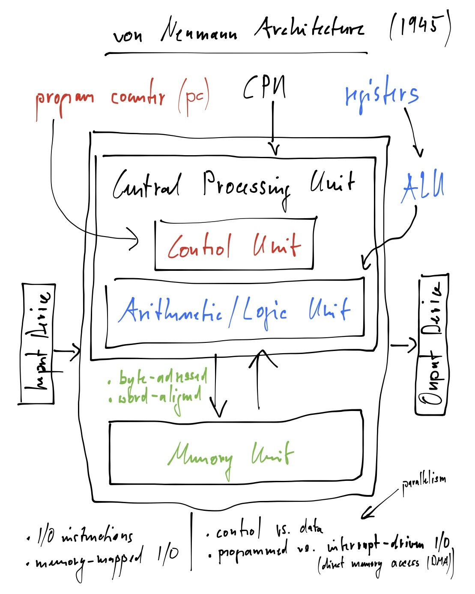

# 3. Architecture and Language

Imagine you are taking a class to learn a foreign language. One particularly interesting type of class is when the language is taught by speaking in that language without using any other language. This means that as soon as the class starts the teacher exclusively speaks in the language that everyone would like to learn but does not understand. This approach anyway works because the teacher may use means of communication other than spoken language such as gestures, facial expressions, and even body language. Questions may be asked in a language that everyone understands but answers are always given in the foreign language. Students are anyway encouraged to use the foreign language as soon as possible and eventually even ask questions in that language.

We do something similar here. We explain how a computer works using examples written in the language that the computer speaks but we do not yet understand. That language is called machine code. However, we use elementary and Boolean algebra that everyone is familiar with as body language to clarify the meaning of machine code. Hard to believe but machine code is so simple that elementary and Boolean algebra is enough. The only problem is that machine code is not really a language that anyone but a few computer engineers enjoy. Most code these days is actually written in higher-level programming languages. We therefore introduce in a number of examples a simple high-level programming language called C\*, pronounced *see star*. The meaning of C\* is explained using machine code as another type of body language. Interestingly, our understanding of machine code and how a computer works will also improve as a result.

Before we continue note that all these analogies are helpful and entertaining but in the end the term programming language is anyway an unfortunate misnomer. Its origin goes back to a time when scientists believed that the structure of natural languages can be formalized mathematically. The outcome of that belief was not that but something unforeseen, namely, the notion of formal languages and their structural properties. That research became part of the foundation for describing programming languages and machine code which are formal languages or rather formalisms for describing computation. They are not really languages in the sense of natural languages. This is a beautiful example of scientific exploration not producing the desired result but something completely different yet incredibly important.

Q> What is the difference between natural languages and programming languages?
Q>
Q> Programming languages are formalisms, not languages!

Another potentially misleading term is architecture which in computer science circles refers to the architecture of digital processors, not buildings. The title of this chapter is obviously meant in the sense of computer science, that is, architecture means computers and language means programming languages which are not really languages. How confusing is that?

## Von Neumann Architecture

{line-numbers=on, lang=c}
<<[A Simple C* Program](code/iteration.c)

{line-numbers=on, lang=c}
<<[Informal Semantics of the Simple C* Program](code/iteration-low.c)

{line-numbers=on, lang=c}
<<[Language Elements of the Simple C* Program](code/iteration-high.c)

{line-numbers=off, lang=asm}
<<[Formal Semantics of the Simple C* Program in MIPS Assembly with Approximate Line Numbers](code/iteration.s)

{line-numbers=off, lang=asm}
<<[Execution of the MIPS Assembly for the Simple C* Program with Approximate Line Numbers and Profile](code/iteration.d)

{line-numbers=on, lang=c}
<<[A C* Program Equivalent to the Simple C* Program](code/procedure.c)

{line-numbers=off, lang=asm}
<<[Formal Semantics of the Equivalent C* Program](code/procedure.s)

{line-numbers=on, lang=c}
<<[A C* Program Equivalent to the Simple C* Program Using a Function](code/function.c)

{line-numbers=off, lang=asm}
<<[Formal Semantics of the Equivalent C* Program Using a Function](code/function.s)

{line-numbers=on, lang=c}
<<[A C* Program Equivalent to the Simple C* Program Using Just Functions](code/local.c)

{line-numbers=off, lang=asm}
<<[Formal Semantics of the Equivalent C* Program Using Just Functions](code/local.s)

{line-numbers=on, lang=c}
<<[A C* Program with Iteration and Equivalent Recursions from Basics Chapter](code/recursion.c)

{line-numbers=on, lang=c}
<<[A C* Program with Pointers](code/pointer.c)

{line-numbers=off, lang=asm}
<<[Formal Semantics of the C* Program with Pointers](code/pointer.s)