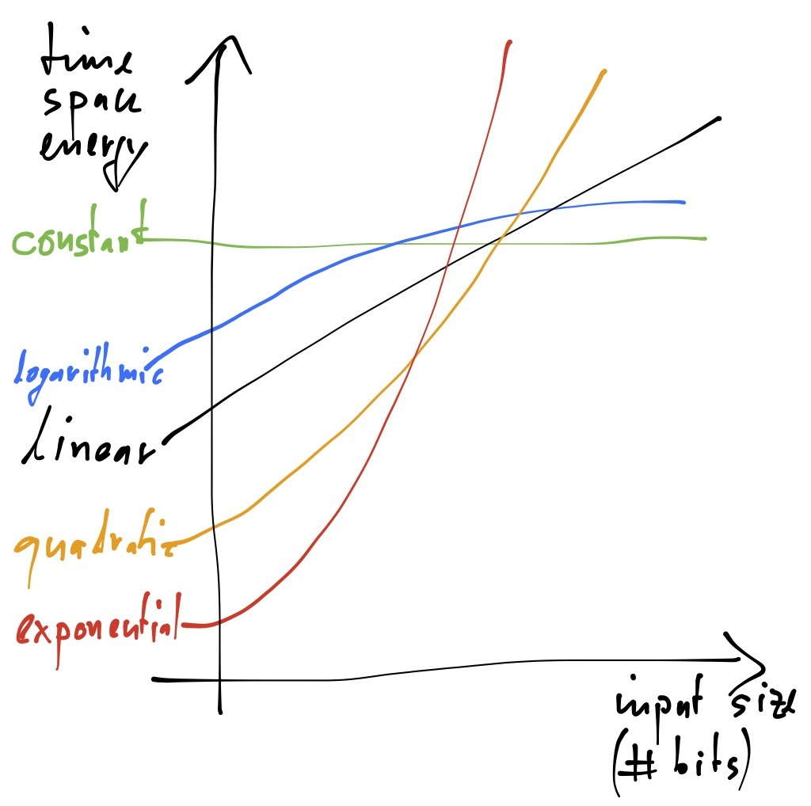

# 2. Basics

There are a few things to clarify before going into more detail. Digital computers encode everything, data as well as code, in bits. A key insight to understanding how they work is that all the bits stored in a computer's memory and on a computer's storage device and even all the bits communicated across a network of computers have no a-priori meaning whatsoever. They are just bits. It is only the operations with and on them that give them meaning. We even need to tell a computer which bits are actually meant to be treated as code rather than data and should thus be loaded into its processor and be executed. That code directs the processor to manipulate the remaining bits (and sometimes even the code bits themselves if they represent so-called self-modifying code) to perform a computation. The behavior of the code is ultimately determined by the construction of the processor and the system in which it is embedded. However, in the end a computer does nothing but manipulating impressive amounts of bits.

Since everything is encoded in bits, computer science is on a very abstract level all about *strings*, sequences of characters, which may be sequences of bits but also, for convenience and performance, but not necessity, sequences of any kind of symbols. The text you are reading here is just that, a sequence of so-called *ASCII* characters. ASCII is a standard that maps 7-bit sequences to characters so that computers, which store the text you are reading here in such 7-bit sequences, can be programmed to map them to human readable characters for showing them on a screen. Conversely, when pressing a key on a keyboard the 7-bit sequence for the character represented by that key is generated for further processing. By the way, 7 bits can encode 128 different sequences enabling 128 different ASCII characters. This used to be enough but has long been advanced to many other standards with UTF-8 the most popular right now. Newer standards support more characters (emojis!) yet without changing the principle. In particular, any such standard is unnecessary for the machine. It is just for our convenience and performance. If we could read bit strings naturally these standards would be unnecessary and our keyboards only had two keys. The same is also true for other human-machine interfaces such as touch screens and audio speakers. They dramatically increase the performance of human-machine interaction but ultimately do not change what can in principle be computed.

Sure, you may say that for proper interaction we still need to agree on what those bit strings mean but that problem also exists with ASCII strings and in general with any kind of signal. Computers really create meaning by how they manipulate bits. Computer science and thus this book is about giving these purely syntactic, meaningless bit strings a *semantics*, that is, a meaning that we can all agree on. Fortunately, there are certain kinds of objects that have well-understood and widely agreed upon semantics, for example: natural numbers! The semantics of natural numbers, like all semantics, is given by operations on them, so in this case by *arithmetics*. The importance of natural numbers and the fortunate fact that many operations on them can be approximated *effectively* and then performed *efficiently*, if represented as bit strings in a certain way, has made them an integral part of any modern processor. We will therefore look at how this is done to the extent necessary. Other important objects that enjoy formal semantics and effective and efficient implementations such as real numbers, for example, are not covered in this book since they do not add anything beyond what the treatment of natural numbers can do for us here.

Being able to add, subtract, multiply, and divide numbers represented by bit strings is great and processors do that very fast. But what else do we need to compute, well, everything? Another look at mathematics helps. We are interested in a machine that can compute any function from bit strings to bit strings. That would be fantastic since bit strings can in principle represent everything. Reality, however, is a bit more humbling. All existing formalisms for describing code are known to capture the same set of functions, also called the *computable functions*. In other words, most programming and machine languages are equally expressive. Whatever I can express in one language, in terms of functions from bit strings to bit strings, I can express in another. However, the set of computable functions is a strict subset of all functions, that is, there are functions that existing machines cannot compute. This does not mean though that there will never be a machine that can compute more. Most computer scientists, however, believe that this is unlikely.

What matters to us is to understand what makes all these languages equally expressive. Intuitively, we must be able to describe potentially never ending processes of computation that manipulate bits. The most common constructs to do that are *iteration* and *recursion* which are equally expressive. An iteration describes a repetitive process that assembles the overall solution step by step from bigger and bigger intermediate results whereas a recursion describes a repetitive process that breaks the problem step by step into smaller and smaller subproblems until a one-step solution is known. Important for *computability* is only the ability to make *termination* part of the computation. Some functions can only be computed if one risks that the code that computes the function does not terminate for (the a-priori unknown) inputs for which the function is not defined. In other words, there are questions where the answer *is* the never ending process of computation rather than some bit string. Important, for now, is to understand iteration and recursion. Computability is covered later.

In sum, the fundamental question is: how do we represent data, ultimately in terms of bit strings, and how do we manipulate that data, ultimately using machine code, in a meaningful way? For example, suppose that we are interested in collecting data in a *set*, in a mathematical sense, that is, we would like to be able to avoid collecting duplicates of data but otherwise do not care about the order of data. Here, another key difference between computer science and mathematics appears. Mathematics, and in this example, set theory is concerned with the properties of (possibly infinite) sets whereas computer science, in this context, is concerned with the effective and efficient implementation of (approximations of) sets. However, best practice in computer science is still to reason like a mathematician, and like an expert in your field, because this is where meaning comes from, but pretend to be like a machine, because this is where computation comes from. The key to understanding computer science is to understand the *connection* between mathematics (and whatever your field is about) and computers. Since we cannot talk about all possible application areas we use basic mathematics as sufficiently representative example that everyone can understand. In other words, you can acquire the necessary computer science skills to solve any problem you like with a machine as long as you really understand the problem you are trying to solve and how it relates to computers.

So far we have only worried about what can in principle be computed. However, another key problem in computer science is performance. Approaches that require more time, space, or energy than we have are non-solutions in practice. Typical performance metrics are the time to perform an operation, called *execution time* (or *latency* if the operation is delaying something else more important), the number of operations per unit of time that can be performed, called *throughput*, and the amount of *memory* consumed in bits or bytes, and even the amount of *power* consumed in Watt. Performance of code may be measured experimentally. However, performance may also be studied mathematically by looking at the behavior of an *algorithm*, that is, machine-independent code, in relation to the size of its input. A typical question in so-called *algorithmic complexity* is what the relation between input size and execution time of an algorithm is, independent of any particular machine. For example, does the execution time of a sorting algorithm grow logarithmically, polynomially, or even exponentially in the number of items that need to be sorted? Amazingly, we can even go beyond such questions and ask what the so-called *computational complexity* of a *problem* such as sorting, rather than of a concrete algorithm for sorting, is. An answer tells us how difficult it is in *principle* to solve such a problem with *any* algorithm. Relevant to us, for now, are performance metrics and a bit about growth rates. The rest is done later.

To facilitate subsequent discussions, we are now going, in a bit more detail, over the basics of (1) strings, as universal representation of information, (2) positive and (3) negative numbers, as effective and efficient example of using bit strings for representation, (4) functions, as fundamental constructs of computation, and (5) performance metrics and growth rates of computation.

## Strings

Q> What is the difference between mathematics and computer science?
Q>
Q> Mathematics is about numbers (among other things), computer science is about strings!

*Strings*, in contrast to numbers, are the fundamental object of discourse in computer science. Anything can be seen as and represented by a string. Digital computers happen to represent everything in *bit strings*, sequences of bits where each *bit* may either be 0 or 1. Thus the *alphabet* of digital computers only consists of 0 and 1, also called the *Boolean values*.

X> We will use the following 8-bit bit string as running example: 01010101

[String][]
: A finite sequence of characters taken from some finite alphabet.

[Bit][]
: The basic unit of information in computing and digital communications. A bit can have only one of two values which are most commonly represented as either a 0 or 1. The term bit is a portmanteau of binary digit.

In principle, a computer could operate on the level of individual bits. However, processing information in larger chunks in parallel generally increases performance. For example, some early computers were able to operate on the level of *bytes*, eight bits, at once. Nowadays computers process information on the level of *words*, that is, two (16 bits), four (32 bits), eight (64 bits), or even sixteen bytes (128 bits), at once. Unless stated otherwise, we use the term word, in the context of machine models, to denote four bytes (32 bits).

X> Since 01010101 contains 8 bits it is also an example of a byte.

[Byte][]
: A unit of digital information in computing and telecommunications that most commonly consists of eight bits.

[Word][]
: A term for the natural unit of data used by a particular processor design. A word is basically a fixed-sized group of digits that are handled as a unit by the instruction set or the hardware of the processor. The number of digits in a word (the word size, word width, or word length) is an important characteristic of any specific processor design or computer architecture.

Now, how do we actually encode *characters* other than 0 and 1 using, well, 0s and 1s? Easy. We only need to write down the characters we would like to encode and then define a (surjective) mapping from bit strings to characters. The first such definition was ASCII which is actually bijective for 7-bit strings. Since bytes became later the norm as the unit of data in many computers ASCII was extended to eight bits. For example, the most recent extension is the UTF-8 standard, which is the most popular such standard today.

X> According to the ASCII and UTF-8 standards 01010101 stands for the uppercase letter U.

T> The first lesson to learn here is that for a computer 01010101 is still just 01010101 and not the letter U.
T>
T> The only thing we did is that we wrote down a mapping from bit strings to characters, something a computer is not aware of. Only if we program the computer to, say, draw the shape of the letter U on a screen that mapping also exists for the computer. However, even then there is no semantics yet. Read on for that.

[Character][]
: A unit of information that roughly corresponds to a grapheme, grapheme-like unit, or symbol, such as in an alphabet or syllabary in the written form of a natural language. Examples of characters include *letters*, numerical *digits*, common *punctuation marks* (such as "." or "-"), and *whitespace*. The concept also includes *control characters*, which do not correspond to symbols in a particular natural language, but rather to other bits of information used to process text in one or more languages. Examples of control characters include *carriage return* or *tab*, as well as instructions to printers or other devices that display or otherwise process text.

American Standard Code for Information Interchange ([ASCII][])
: 7-bit encoding scheme for 128 characters: numbers 0 to 9, lowercase letters a to z, uppercase letters A to Z, basic punctuation symbols, control codes that originated with Teletype machines, and a space.

[UTF-8][]
: (Universal Character Set Transformation Format - 8-bit) A character encoding capable of encoding all possible characters (called code points) in Unicode. The encoding is variable-length and uses 8-bit code units. It is designed for backward compatibility with ASCII.

## Numbers

Let us now focus on *numbers*. Arithmetics defines the semantics of natural numbers. Since virtually all modern processors feature arithmetic instructions for, say, the elementary operations addition, subtraction, multiplication, and division of (bounded versions of) natural numbers computers can be thought of "knowing" what numbers are, even if they have no code to run. The semantics is already implemented by the silicon of the processor. Important for us is to understand how numbers are represented by bit strings and other notational systems.

[Number][]
: A mathematical object used to count, measure, and label. The original examples are the *natural numbers* 1, 2, 3, and so forth.

Before worrying about how to represent numbers using bit strings we step back for a moment and look at the arguably most naive way of representing numbers. Say, we would like to represent the (decimal) number 10. We could just write ten 1s, that is, 1111111111. This scheme has actually been around for a long time and is called *unary* code. It only uses a single digit hence the name.

Using one more digit, say, 0 takes us to *binary* code. The (decimal) number 10 in binary is 1010 because the value of a digit in binary is computed with *base* or *radix* 2, rather than base 10 in, well, decimal code. So, 1010 in binary is equal to 1\*2^3^+0\*2^2^+1\*2^1^+0\*2^0^=8+0+2+0=10 in decimal. Other popular notations are *octal* code with base 8 and *hexadecimal* code with base 16. The (decimal) number 10 in octal is 12 (1\*8^1^+2\*8^0^=8+2=10) and in hexadecimal the letter A (10\*16^0^=10 since A stands for the value ten; the letters B, C, D, E, and F stand for the values eleven, twelve, thirteen, fourteen, and fifteen, respectively). The reason both notations are popular is because a digit in octal and hexadecimal represents three and four bits, respectively, making them convenient for representing binary code. Since a byte consists of two four bit strings, also called *nibbles*, hexadecimal code is particularly convenient for representing byte-aligned binary code. It takes exactly two hexadecimal digits to denote a byte.

Q> Have you noticed the enormous difference in length between unary and binary numbers?
Q>
Q> For example, 85 in unary obviously requires more than ten times more digits than the 8 bits of 01010101.
Q>
Q> In fact, the situation is worse since 7 bits are actually enough to represent 85. Even worse, 7 bits can represent up to 128 different values, that is, in the representation chosen here, all decimal numbers between 0 and 127 inclusive. Thus unary requires up to eighteen times more digits than a 7-bit binary number. One more bit almost doubles the difference. Then, unary needs up to 32 times more digits than an 8-bit binary number.

The fundamental reason for the difference in size between different notations is that any code with a base greater than one is *exponentially* more succinct than unary code. However, codes with base greater than one are only different in size by a *constant factor*. For example, octal and hexadecimal code is only three and four times, respectively, more succinct than binary code. A larger alphabet makes even less of a difference, that is, *logarithmically* less in the size of the alphabet. ASCII, for example, is only seven times more succinct than binary code although there are 128 ASCII characters.

| Encoding | Alphabet | Base (Radix, Size of Alphabet) | # Digits in Values {$$}n>1{/$$} | # Values in Digits {$$}n>0{/$$} |
| - | - | -: | -: | -: |
| [Unary][] | {1} | 1 | {$$}n{/$$} | {$$}n{/$$} |
| [Binary][] | {0,1} | 2 | {$$}\lceil\frac{log(n)}{log(2)}\rceil{/$$} | {$$}2^n{/$$} |
| [Octal][] | {0,1,2,3,4,5,6,7} | 8 | {$$}\lceil\frac{log(n)}{log(8)}\rceil{/$$} | {$$}8^n{/$$} |
| [Decimal][] | {0,1,2,3,4,5,6,7,8,9} | 10 | {$$}\lceil\frac{log(n)}{log(10)}\rceil{/$$} | {$$}10^n{/$$} |
| [Hexadecimal][] | {0,1,2,3,4,5,6,7,8,9, | 16 | {$$}\lceil\frac{log(n)}{log(16)}\rceil{/$$} | {$$}16^n{/$$} |
| | A,B,C,D,E,F} | | | |

Once again note that 01010101 may stand for the (decimal) number 85 or the letter U or any other object. It is only the operations on 01010101 that define its semantics. 

T> Some programming languages feature certain prefixes that determine if a number is meant to be interpreted as binary, octal, decimal, or hexadecimal.
T>
T> Standard prefixes are "0b" for binary, "0" for octal, nothing for decimal, and "0x" for hexadecimal, that is, our example may be written 0b01010101 = 0125 = 85 = 0x55.

Fortunately, elementary arithmetics works for binary numbers just like it does for decimal numbers or any other code with base greater than one. For example, adding two numbers in any such code works as usual by adding their digits from right to left while carrying any *overflow* to the left. Only unary code is different! Elementary arithmetics with unary code is done by, imagine, *string concatenation*.

X> Let us add 85 and, say, 170.
X>
X> Remember from school? Starting from the right we find that 5+0=5. Thus the rightmost digit of the result is 5. Then, with 8+7=15 the second rightmost digit is 5. Since 15>9 there is an overflow that needs to be considered next. With 1+1=2 we obtain the leftmost digit and the final result of 255.
X>
X> Let us now add both numbers in binary, that is, 01010101 for 85 and 10101010, which is binary for 170. It works in just the same way.
X>
X> Since 1+0=1 there is no overflow here. Thus the result of 11111111, which is binary for 255, can easily be obtained by just adding the individual digits. In general though, one adds two binary numbers just like decimal numbers, digit by digit from right to left, while carrying any overflow to the left.
X>
X> Adding both numbers in hexadecimal, that is, 0x55 and 0xAA, works similarly, in this case also without overflow. With 5+A=F the result is 0xFF, which is hexadecimal for 255.

In binary numbers the leftmost and rightmost bits have a meaning similar to the leftmost and rightmost digits in decimal numbers. The rightmost bit, also called *least significant bit*, determines if the number is even or odd. For example, 01010101 represents an odd number whereas 10101010 an even number. The leftmost bit, also called *most significant bit*, represents the greatest value. Thus 10101010 stands for a number larger than 01010101.

Least Significant Bit ([LSB][])
: The bit in a binary number that appears rightmost and determines if the number is even (0) or odd (1).

Most Significant Bit ([MSB][])
: The bit in a binary number that appears leftmost and has the greatest value.

Now, what happens if we try to add two numbers where the result exceeds the number of digits necessary to represent them individually? For example, what if we compute 255+1=256 in binary? In this case, that is, 11111111+00000001, the result is 100000000, a binary number with 9 bits rather than the 8 bits representing 255. This is not a problem if we have more than 8 bits. However, with computers everything is finite, in particular memory. Moreover, arithmetic operations are on most machines implemented for bit strings with a fixed size such as 8 bits. On such machines adding 11111111 and 00000001 results in what is called *arithmetic overflow*. 

[Arithmetic Overflow][]
: Occurs when an arithmetic operation attempts to create a numeric value that is too large to be represented within the available storage space.

How can we deal with arithmetic overflow? There are two approaches that can be combined: detection and semantics. If the occurrence of an arithmetic overflow can be detected one can discard the computation and do something else. For this purpose most processors feature a so-called *carry bit* or *carry flag* which is set if an arithmetic operation causes an overflow indicated by a *carry out of the most significant bits*. In our example, the 9-th bit in 100000000 is that carry bit.

In terms of semantics, if the result of an arithmetic overflow has a defined value, one may be able to use that value in a meaningful way. For example, a common semantics for n-bit arithmetics is to compute everything modulo 2^n^, also referred to as *wrap-around semantics* or just *wrap around*. For example, 255+1=256 modulo 2^8^=256 modulo 256=0, which is exactly what 100000000 in an 8-bit system stands for. There are applications that are correct even when such wrap-arounds occur.

[Modulo]
: The remainder after division of one number by another, also called modulus.

Arithmetic overflow nevertheless is the cause of numerous software bugs and even costly accidents. Restricting the space available for representing something that can be arbitrarily large such as numbers has serious consequences. Computer arithmetics are always an approximation of real arithmetics. For correctness, computer applications need to be properly adapted to work for computer arithmetics, not real arithmetics. This is the reason why we keep emphasizing that computer science and mathematics are closely related but still quite different.

## Integers

Now, what about subtraction and negative numbers? Ideally, we would like our bit strings to represent not just *positive* but also *negative* numbers, also called *integers*, with elementary arithmetics on them still intact. Obviously, one bit, or more generally one digit, is enough to encode the *sign* of a number, that is, distinguish positive from negative numbers. Fortunately, however, there is an overall encoding scheme that works without changing elementary arithmetics such as addition. In fact, subtraction will work by using addition, as previously discussed, with negative numbers.

[Integer][]
: A number that can be written without a fractional component. For example, 21, 4, 0, and −2048 are integers, while 9.75 and 5.5 are not. The set of integers consists of zero (0), the natural numbers (1, 2, 3, ...), also called whole, counting, or positive numbers, and their additive inverses (the negative numbers, that is −1, −2, −3, ...). 

T> In computer science integers are sometimes specifically qualified to be *unsigned*. In this case, they are meant to represent zero and positive numbers but no negative numbers. Integers may explicitly be called *signed* to emphasize that they are also meant to represent negative numbers.

So, how can we represent -85 and compute something like, say, 127-85? Again, fortunately, there is a representation of negative numbers that works for any code with base greater than one and makes addition work like subtraction. We simply take the so-called *radix complement* to encode a negative number which only requires us to fix the number of digits that we intend to support. Subtracting a number then works by adding its complement and ignoring the overflow beyond the supported number of digits.

X> Let us compute 127-85 in the decimal system.
X>
X> The radix (ten's) complement of 85 for, say, 3-digit numbers is 10^3^-85=1000-85=915.
X>
X> Then, we exploit that 127-85 can be written as (127+(10^3^-85))-10^3^ which simplifies to (127+915)-1000=1042-1000=42 (what a coincidence). Subtracting 1000 is easily done by just ignoring the overflow of 127+915 into the fourth digit.
X>
X> So, supporting, say, 4-digit numbers works in just the same way, that is, by ignoring the fifth rather than the fourth digit: 127-85=(127+(10^4^-85))-10^4^=(127+(10000-85))-10000=(127+9915)-10000=10042-10000=42.

You may still ask how computing 1000-85 is any easier than computing 127-85 directly. Well, it is not but the radix complement of a number happens to be equal to the so-called *diminished radix complement* of that number plus one, which is in fact easier to compute than the radix complement. 

X> The diminished radix (nines') complement of 85 for, say, again 3-digit numbers is (10^3^-1)-85=(1000-1)-85=999-85=914.
X>
X> The term 999-85 can easily be computed by complementing each digit of 85, again for 3-digit numbers, with respect to the diminished base 10-1=9, that is, by subtracting each digit of 85 from 9.
X>
X> So, 914 is obtained by computing: 9-0=9 (since the leftmost digit of 85 in a 3-digit system is 0), 9-8=1, and 9-5=4.
X>
X> Finally, we have that 127-85=(127+(((1000-1)-85)+1))-1000=(127+((999-85)+1))-1000=(127+(914+1))-1000=(127+915)-1000=1042-1000=42.

T> By the way, the position of the apostrophe in nines' complement is not by chance. It indicates that we mean the *diminished* radix complement with radix ten. The term nine's complement refers to the (undiminished) radix complement with radix nine. Hence the term ten's complement refers to the radix complement with radix ten.

Back to our example. What happens if we actually try to compute 85-127 instead? Let us go through that computation as well.

X> Assuming again a 3-digit system we have that: 85-127=(85+(((1000-1)-127)+1))-1000=(85+((999-127)+1))-1000=(85+(872+1))-1000=(85+873)-1000=958-1000=-42.
X>
X> Seems to work fine. However, in this case there is no overflow since 85+873=958<1000. The trick to solve this problem is simple. We just do not subtract 1000. That's it. In fact, 958 is the ten's complement of 42 in a 3-digit system and thus the correct representation of -42.

Using the ten's complement for representing negative numbers really means that the leftmost digit represents the sign. In the decimal system, an even leftmost digit indicates that we are dealing with a positive number. Conversely, an odd leftmost digit such as the 9 in 958 means that the number is actually meant to be negative. This implies that with n digits and the ten's complement for negative numbers we can represent signed integers i with -10^n^/2-1 < i < 10^n^/2. For example, in a 3-digit system we can represent signed integers i with -501 < i < 500. In other words, we can still represent 1000 numbers with 3 digits but offset by 500 into the negative numbers.

Now back to bit strings. How does a computer represent negative numbers? The short answer: the exact same way as in the decimal system, just in binary. In other words, a negative number may be represented in binary by its two's complement (remember binary has base 2). Just like before, the two's complement of a number is computed by taking the ones' complement of that number and adding one to it. This time, however, computing the diminished radix complement, that is, the ones' complement is particularly easy. It is done by simply inverting the bits.

X> Let us assume that we are still dealing with bytes, that is, 8 bits for each number. We are interested in computing 127-85 where both numbers are represented in binary.
X>
X> The ones' complement of 01010101, which is again binary for 85, is 10101010.
X>
X> The two's complement of 01010101 is therefore 10101010+1=10101011 and thus stands for -85.
X>
X> Computing 127-85 in binary is done by just adding 01111111, which is again binary for 127, and 10101011, and finally subtracting 100000000 which is actually done by simply ignoring the carry bit. The result is thus 01111111+10101011=100101010-100000000=00101010, which is binary for 42.
X>
X> Conversely, computing 85-127 in binary works as follows.
X>
X> The ones' complement of 01111111 is 10000000.
X>
X> The two's complement of 01111111 is therefore 10000000+1=10000001.
X>
X> To compute 85-127 we compute 01010101+10000001=11010110, which is binary for the two's complement of 42. This time we do not subtract 100000000, again by ignoring the carry bit which is not set anyway.

Using two's complement for representing negative numbers a byte can in total represent signed integers i from -128 to 127, that is, with -2^8^/2-1 = -2^7^-1 = -129 < i < 128 = 2^7^ = 2^8^/2. Our running example fits these constraints. Moreover, the most significant bit has taken over a different role than before. It indicates if a number is positive or negative. For example, 01111111 represents a positive number whereas 10000000 stands for a negative number.

[Ones' Complement][]
: All bits of the number inverted, that is, 0s swapped for 1s and vice versa.

[Two's Complement][]
: Given an n-bit number i with -2^n^/2-1 = -2^n-1^-1 < i < 2^n-1^ = 2^n^/2, the complement of i with respect to 2^n^, that is, 2^n^-i which is equal to the ones' complement of i plus one.

Most Significant Bit ([MSB][])
: The bit in a binary number that appears leftmost and has the greatest value or, if the number represents a signed integer in two's complement, determines if the integer is positive (0) or negative (1).

T> In sum, subtraction of signed integers that are represented in binary code using two's complement for negative numbers works as follows:
T>
T> Given two signed integers x and y, x-y=x+y'+1 where y' is the ones' complement of y, ignoring the carry bit of the sum x+y'+1.
T>
T> Step by step, we compute:
T>
T> 1. the ones' complement y' of y by inverting all bits of y.
T> 2. the two's complement of y by computing y'+1.
T> 3. the sum x+y'+1 by adding x to y'+1 ignoring the carry bit of the sum.

Finally, what happened to the problem of arithmetic overflow? It is still there. Only the carry bit is now insufficient to detect it. When can an overflow actually occur? Simple. Only when adding two numbers with the same sign! The result of an overflow is a number with the opposite sign. Thus we need to distinguish two cases: adding two positive numbers resulting in a negative number and adding two negative numbers resulting in a positive number. Both cases follow wrap-around semantics similar to unsigned integers.

X> With 8 bits and two's complement the result of 01111111+00000001 which represents 127+1 is 10000000 which stands for -128.
X>
X> Similarly, the result of 10000000-00000001 which represents -128-1 is 10000000+11111111=01111111 which stands for 127.

In the first case, the MSBs of the two numbers are zero, since both represent positive numbers, and the MSB of the result is one. The second case is the exact opposite. How can we detect this? Easy. There is an overflow either if there is a carry *into* the MSB of the result but not *out* into the carry bit (wrapping two positive numbers into a negative number), or else if there is no carry *into* the MSB but *out* into the carry bit (wrapping two negative numbers into a positive number). Most processors feature an *overflow bit* or *overflow flag* that is set accordingly, that is, by a so-called *exclusive or* between the carry into and out of the MSB. An exclusive or of two bits is true if and only if the bits are different. Note, however, that just like the carry bit has no meaning when adding signed integers, the overflow bit has no meaning when adding unsigned integers.

T> There are many other ways to do elementary arithmetics on computers including the handling of overflows! What you have seen here is just the arguably most prevalent choice.
T>
T> Most important for you is to be aware of the issue and know what your choice of system actually does when it comes to numbers.

## Computation

From a purely computational point of view, a computer just computes functions from bit strings to bit strings. The original definition of a *function* is nevertheless mathematical and thus neither concerned with how to represent input and output, ultimately in terms of bit strings, nor how to compute the output from the input.

[Function][]
: A relation between a set of inputs and a set of permissible outputs with the property that each input is related to exactly one output.

However, many applications can in fact be written down using mathematical functions. In fact, many application areas have their own way of writing which may be mathematical or not but is typically different from how computer scientists express themselves. We try to close that gap here.

X> As running example we use a function f from natural numbers to natural numbers such that f(x,y)=x+y where + denotes addition of natural numbers.
X>
X> Note that we use addition because it is simple and sufficient for our purpose here. It can always be replaced by something arbitrarily complex.

How do we make a computer actually compute f(x,y)? The first thing we need to be clear about is that whatever we do the result will always be an approximation of f and not really f. This is because everything with a computer is finite whereas many things in mathematics, in particular many functions like f are not. With computers there is always a limit on what can be done, with respect to time, space, and even energy. In case of f the limit will be a (spatial) bound on the numeric values represented by x and y for which the computer will still be able to compute f(x,y). An important question is thus if that bound is too limiting for our purposes. If not, we have a solution.

Now, what do we actually need to compute, well, anything computable? There are two universal categories of instructions, one for manipulating *data* and the other for *controlling* what to do next:

1. *Data* instructions that read data (bit strings) from memory, modify the data, and write the modified data back to memory, and:

2. *Control* instructions that may or may not read data (bit strings) to determine what to do next.

Can you imagine that this is enough? Well, it is and one of the goals of this book is to find out why and what the implications are.

X> For the sake of simplicity, let us assume that our computer is not capable of adding two numbers directly but can instead *increment* and *decrement* an 8-bit unsigned integer with wrap-around semantics (so two data instructions).
X>
X> We also assume that the computer can check if an integer is zero and, if yes, return an integer, or, if not, go to the next instruction. There is also an instruction to go back to an earlier instruction (so two control instructions).
X>
X> With such a system, f(x,y) can be computed by incrementing x exactly y times, that is, we have the computer:
X>
X> 1. Check if y is 0, and, if yes, return x, or, if not,
X> 2. increment x,
X> 3. decrement y, and
X> 4. go back to 1.

This is our first *program*, a sequence of four instructions, which, as we mentioned before, could even be represented by bit strings (rather than a sentence in English). The process of incrementing x and decrementing y until y is 0 is an instance of what is called an *iteration*.

[Program][]
: A sequence of instructions, written to perform a specified task with a computer.

[Iteration][]
: The act of repeating a process with the aim of approaching a desired goal, target or result. Each repetition of the process is also called an "iteration", and the results of one iteration are used as the starting point for the next iteration.

Since we are using 8 bits for x and y the program produces the correct result as long as the sum of x and y is less than 2^8^=256. This is interesting because the computer may only find out if it can produce the correct result by trying to compute it and see if there is an overflow or not. However, there are always two sides to correctness: there is the program that should be correct but also a *specification* that states what is actually correct. In other words, a program, just like any other artifact, can only be correct with respect to a specification that states what is required to be correct.

X> The above program is correct if we only require it to produce the sum of x and y for any x and y whose sum is less than 2^8^=256.
X>
X> We can nevertheless always *weaken* the requirements!
X>
X> For example, we may only require that the program produces the sum of x and y for x and y less than 2^7^=128. This specification excludes perfectly fine inputs such as 254 for x and 1 for y. However, we could then modify the program to reject any other inputs before even attempting to compute the sum.
X>
X> Then we can of course also *strengthen* the requirements!
X>
X> For example, we may require that the program produces the sum of x and y for x and y less than 2^8^=256. Meeting that specification requires modifying the program where the carry bit is somehow returned along with the result.

The lesson to learn here is that programming is much more than just developing code.

T> There are three quite different activities involved in creating computation:
T>
T> 1. Developing a program (this is what most people have in mind).
T> 2. Developing a specification (this is what many people forget).
T> 3. Showing that the program is correct with respect to the specification (this is the most difficult to do).
T>
T> Developing programs requires primarily a background in computer science. Developing specifications requires first and foremost application domain expertise. Both activities are important. However, making sure that a program does what it is intended to do is the actual problem!

Suppose we could actually write down our intentions in a way that would be natural to us (for example, mathematical) but also computable by a machine (that is, executable). In this case, the problem of matching specification and program would disappear. Well, there are ways to do that, at least to some extent. An important example is *recursion* which is a technique to define a function using the same function but repeatedly applied to smaller and smaller versions of its original inputs until a solution is known.

[Recursion][]
: A method where the solution to a problem depends on solutions to smaller instances of the same problem (as opposed to iteration).

X> Consider the example of a recursive function g defined as follows:
X>
X> (1) g(x,y)=g(x,y-1)+1 for all y>0, and
X> (2) g(x,0)=x
X>
X> Part (1) of the definition breaks the problem into a smaller problem, that is, x+y-1 rather than x+y, by decrementing y. It then assembles the result, that is, x+y, by incrementing the solution to x+y-1.
X>
X> Part (2) of the definition is a known solution to the problem based on the fact that x+0=x. Part (2) is also called the *termination condition* which must be present in any well-defined recursion.

Mathematically speaking f=g since g is in fact a proper definition of addition. Thus if we can make g execute on a computer we are done. How do we do that, at least in principle? Before looking at an example remember though that whatever we do, executing g on a computer will be done using finite representations of all data such as 8-bit unsigned integers, just like before. So, even when using recursion to express computation, the result will only be an approximation of f. Also, many applications are difficult to express using recursion. So, recursion is not a magic solution to all problems but it is still a very important technique.

X> Let us consider the execution of g(1,2):
X>
X> g(1,2)=g(1,2-1)+1=g(1,1)+1=(g(1,1-1)+1)+1=(g(1,0)+1)+1=(1+1)+1=2+1=3.
X>
X> Step by step, we replace g(1,2) by its definition, that is, by g(1,2-1)+1. We then simplify that term as much as possible, in this case, in one step to g(1,1)+1, by decrementing 2 to 1. Now, we replace g(1,1) again by its definition which is g(1,1-1)+1 resulting in the overall term (g(1,1-1)+1)+1. Similarly, we simplify g(1,1-1) to g(1,0) resulting in the overall term (g(1,0)+1)+1. We now replace g(1,0) by its definition, that is, by 1, resulting in the overall term (1+1)+1. Then, it is time to simplify (1+1)+1 to 2+1, by incrementing 1 to 2, and finally, 2+1 to 3.

The term (1+1)+1 of the example is interesting. It represents all the work that is still left to do to complete the computation after satisfying the termination condition. Understanding how to remember that work and later complete it is the key to understanding recursion. Intuitively, the work that still needs to be done must be completed in the *reverse* order in which it was remembered. One way to remember that is to organize the information in a so-called *stack*. We will show in detail how this is done in later chapters.

[Stack][]
: A collection of elements, with two principal operations: *push* adds an element to the collection and *pop* removes the last element that was added.

X> In our example, the term (1+1)+1 represents the work that is still to be done. In particular, the left + needs to be done first because it was remembered last, followed by the right +.
X>
X> Here, the order is actually irrelevant but this is only because + is associative. In general, the order does matter!

It may be hard to believe but recursion is exactly as expressive as iteration!

T> Any program using an iteration may be rewritten into an equivalent program that uses recursion instead, and vice versa.

However, recursion often allows to focus on *what* to compute (for example, addition) rather than *how* to compute it because the underlying stack hides *how* the individual steps of the computation are done. Recursion is a good example of how to abstract from iterative computation to something that is closer to a mathematical specification.

There are many other ways to express computation on higher levels of abstraction. Important for us here is to be aware that there is always the *logic* of computation and, distinct from that, its *implementation*. We need to be able to reason on both levels and know how to connect them. Let us have a look at another example but this time on the *logic* of data and its *representation* rather than on describing computation.

Suppose we would like to collect objects without duplicates and do not care about any object ordering. The natural representation of such a collection is a *set*. Similar to other representations, the operations on a set such as membership, union, intersection, and so on define the semantics of a set. In particular, an object is either an element of a set or not and there is no ordering of elements of a set.

[Set][set in mathematics] (in Mathematics)
: A collection of distinct objects, considered as an object in its own right.

Similar to integers, a computer representation of a set may only approximate the original. Moreover, in contrast to the semantics or *logic* of a set in the mathematical sense, temporal and spatial performance of the *implementation* of a set plays an important role. For example, how long does it take to find out if an object is an element of a set and how much memory do we need to store a set?

[Set][set in computer science] (in Computer Science)
: A collection that can store certain values, without any particular order, and no repeated values. It is a computer implementation of the mathematical concept of a finite set.

No matter the actual application, being able to distinguish between logic and implementation and reason on both levels is key to understanding computer science. Many students are good at only one of the two. The best know both. In class we usually ask students to describe the *logic* of a computational artifact first and only then go into the details of its *implementation*. Most students have a hard time doing that. For most it appears to be much simpler to reason on lower, more mechanical levels of abstraction. Others prefer to stay away from those. The truth, however, is in the relation between logic and implementation. Does the implementation really implement the logic or specification we have in mind? And, just as important, is the implementation sufficiently efficient for our purposes? Let us now have a closer look at performance.

## Performance

Computational performance is typically measured in terms of time and space and, more recently, even in terms of energy. How much time does a computation take, how much memory does it need, and how much energy does it consume? Before looking at the most common metrics, we emphasize that in computer science the notion of order of magnitude may be used with its standard meaning as it is common in other disciplines or with a meaning rather unique to the field. Traditionally, something is an order of magnitude bigger or smaller if it is bigger or smaller by a factor of ten. However, in computer science, because of the widespread use of binary codes, an order of magnitude may also refer to a factor of two.

[Order of Magnitude][]
: A factor with base 10 (decimal) or with base 2 (binary).

As a consequence and even more confusing is the fact that commonly used prefixes such as kilo, mega, giga, and tera may either refer to factors of 10^3^=1000 or 2^10^=1024 depending on context and metric. Only recently new binary prefixes for kilo, mega, giga, tera, and so on, called kibi, mebi, gibi, tebi, respectively, have been introduced. Adoption is nevertheless slow. We try our best to use the new prefixes properly.

| [Decimal Prefix][] | Value           | [Binary Prefix][] | Value           |
| ------------------ | --------------- | ----------------- | --------------- |
| nano (n)           | 10^-9^=1000^-3^ |
| micro (u)          | 10^-6^=1000^-2^ |
| milli (m)          | 10^-3^=1000^-1^ |
| kilo (k)           | 10^3^=1000^1^   | kilo (K,Ki,kibi)  | 2^10^ = 1024^1^ |
| mega (M)           | 10^6^=1000^2^   | mega (M,Mi,mebi)  | 2^20^ = 1024^2^ |
| giga (G)           | 10^9^=1000^3^   | giga (G,Gi,gibi)  | 2^30^ = 1024^3^ |
| tera (T)           | 10^12^=1000^4^  | tera (T,Ti,tebi)  | 2^40^ = 1024^4^ |

Memory storage is typically quantified in bytes with base 2, for example, in gigabytes or, more recently and unambiguously in gibibytes. Processor speed, however, may be represented in instructions per second with base 10, for example, in million instructions per second (MIPS). Similarly, special-purpose metrics such as FLOPS, floating-point operations per second, are prefixed with base 10. Also, data rates are often represented in bits per second with base 10, for example, in gigabits per second (gbps), that is, 10^9^ bits per second.

Speed is generally characterized in terms of throughput, the amount of work done per unit of time, and latency, the amount of time to do some work, in particular before some other work can be done. The difference is usually explained with a simple example. Imagine a fiber optic cable connecting, say, New York City and San Francisco and a truck loaded with DVDs driving from New York City to San Francisco. Which one provides higher throughput and which one lower latency? Surprisingly, it may very well be possible that the truck provides higher throughput. However, delivering just a single bit by truck may take days. Thus the truck clearly provides terrible latency not suitable to host, say, a skype call. Got it?

[Throughput][]
: Amount of work performed per unit of time.

[Latency][]
: Amount of time (or delay) to perform work.

Energy is quantified in Joule and power consumption in Watt, that is, the amount of energy consumed per second. Interestingly, we can also quantify the efficiency of, say, computation, for example, in number of operations performed by that computation per Joule, or even in MIPS or FLOPS per Watt. Energy efficiency plays an increasingly important role, not just in mobile computing but also in large-scale data center computing.

| Performance | Unit |
| ----------- | ---- |
| memory      | bit (b), [kilobit][] (kb), megabit (mb), gigabit (gb), terabit (tb) with decimal prefix |
|             | byte (B), [kilobyte][] (kB), megabyte (MB), gigabyte (GB), terabyte (TB) with decimal prefix |
|             | byte (B), [kibibyte][] (KB,KiB), mebibyte (MB,MiB), gibibyte (GB,GiB), tebibyte (TiB) with binary prefix |
| latency     | nanoseconds (ns), microseconds (us), milliseconds (ms), seconds (s), minutes (m), hours (h) |
| throughput  | million instructions per second ([MIPS][]) |
|             | floating point operations per second ([FLOPS][]) |
|             | bytes/second, [kB/s][data rate units], MB/s, GB/s, TB/s |
|             | bits/second, [kbps][data rate units], mbps, gbps, tbps |
| energy      | [joule][] |
| power       | joule/second ([watt][]) |
| efficiency  | operations/joule |
|             | MIPS/watt |
|             | FLOPS/watt |

Measuring computational performance in terms of time, space, and energy allows comparing different solutions of a given problem but only on a finite set of instances of the problem. Consider, for example, the problem of sorting numbers. We may directly compare the performance of different sorting algorithms by running them one after another on a given instance of the problem, for example, on a set of ten numbers. However, the relative performance of the algorithms may be very different when they are applied to, say, a set of a thousand numbers. This is because the relation between the size of a problem instance and the performance of an algorithm for solving the problem may not be linear. Beyond measuring performance we are therefore also interested in studying what is called algorithmic complexity, that is, how performance of an algorithm relates to the size of its input. Typical examples relevant in practice are constant, logarithmic, linear, quadratic, cubic, and exponential complexity. 

| Growth Rate     | Function        | Comment                         |
| --------------- | --------------- | ------------------------------- |
| constant        | {$$}c{/$$}      | no growth                       |
| [logarithmic][] | {$$}log(n){/$$} | {$$}log_b(n)=log(n)/log(b){/$$} |
| [linear][]      | {$$}n{/$$}      | polynomial                      |
| [quadratic][]   | {$$}n^2{/$$}    | polynomial                      |
| cubic           | {$$}n^3{/$$}    | polynomial                      |
| [exponential][] | {$$}2^n{/$$}    | {$$}b^n=10^(n*log(b)){/$$}      |

Constant complexity means that the performance of an algorithm remains the same for any input. Non-constant complexity means that performance is a non-constant function of the input size. Determining that function requires, as prerequisite, defining a performance metric and a metric on input size. For example, we could define the number of steps taken in the computation of the addition function f(x,y) that we introduced earlier. In fact, this is usually done for studying temporal performance formally since the time to execute an algorithm is a linear function of the number of steps taken by that algorithm as long as each step can be performed by a constant number of machine instructions and the execution time of each machine instruction is indeed constant or at least bounded by a constant. The former can be ensured by properly defining, as in our example, what a step of a computation is. The latter is anyway true on most modern hardware.

As metric on input size, we could take the numeric value of x and y. In this case, since f takes y iterations, f's algorithmic complexity is linear in the numeric value of y, independent of the numeric value of x. If the numeric value of y was fixed, the complexity would thus even come down to constant. However, assuming the value of y is represented in binary, if we take the size of that representation, that is, the number of bits necessary to represent y's value, then the complexity is in fact exponential. If we were to represent the value of y in unary the complexity would again come down to linear complexity. If complexity is polynomial in numeric value but exponential in size of value representation one also speaks of pseudo-polynomial complexity.

The recursive function g(x,y) that we introduced along with f has the same complexity characteristics as f. However, depending on what we define to be a step in a computation there may be a difference between the two but only by a constant factor. For example, the recursive invocation of g could be counted as an extra step making g more expensive than f. Their growth rate would nevertheless remain the same. In theory, constant factors are typically ignored including different bases of logarithmic and exponential functions. Only the difference in growth rate matters if input can be arbitrarily large. We also speak of asymptotic complexity in this case. Here, constant is better than logarithmic which is better than linear which is better than quadratic which is better than cubic which is better than exponential. Still, constant factors can be important in practice. It may very well happen that there is an algorithm with exponential complexity that anyway runs faster than an algorithm with, say, linear complexity that solves the same problem, as long as the input size is below some threshold. In this case, the exponential algorithm is in fact the better choice.

In general, algorithmic complexity only provides bounds rather than exact performance numbers. For example, the fact that an algorithm has linear complexity only means that there is a linear function from input size to number of steps such that the actual number of steps taken by the algorithm  never exceeds the value of that function. The linear function is thus an upper bound on actual performance. Conversely, we may also define a function that is a lower bound on actual performance. For f(x,y) and g(x,y), the lower bound is the same linear function that is also the upper bound since both functions take y iterations or recursions no matter what. There are, however, many algorithms with upper and lower bounds on performance that are not the same. In other words, algorithmic complexity remains in general an approximation of actual performance. For example, there are algorithms that are only known to have, say, cubic complexity although in practice they run with quadratic complexity. Yet showing formally that they always do may be difficult.

Before we finish this chapter let us point out that algorithmic complexity may also refer to space and energy consumption given appropriate performance metrics. In fact, many algorithms may have great time complexity at the expense of space complexity and vice versa. Most relevant for you is to keep in mind that properly judging an algorithm's performance usually involves a complete analysis from performance experiments to complexity analysis in all relevant performance dimensions. In short, an algorithm is not better than another just because it runs faster. It should also not use more memory and even energy before making any such claims. When it comes to performance a differentiating approach is the way to go.

[string]: http://en.wikipedia.org/wiki/String_(computer_science) "String"

[bit]: http://en.wikipedia.org/wiki/Bit "Bit"
[byte]: http://en.wikipedia.org/wiki/Byte "Byte"
[word]: http://en.wikipedia.org/wiki/Word_(computer_architecture) "Word"

[character]: http://en.wikipedia.org/wiki/Character_(computing) "Character"

[ASCII]: http://en.wikipedia.org/wiki/ASCII "ASCII"
[UTF-8]: http://en.wikipedia.org/wiki/UTF-8 "UTF-8"

[number]: http://en.wikipedia.org/wiki/Number "Number"

[unary]: http://en.wikipedia.org/wiki/Unary_numeral_system "Unary"
[binary]: http://en.wikipedia.org/wiki/Binary_number "Binary"
[octal]: http://en.wikipedia.org/wiki/Octal "Octal"
[decimal]: http://en.wikipedia.org/wiki/Decimal "Decimal"
[hexadecimal]: http://en.wikipedia.org/wiki/Hexadecimal "Hexadecimal"

[lsb]: http://en.wikipedia.org/wiki/Least_significant_bit "LSB"
[msb]: http://en.wikipedia.org/wiki/Most_significant_bit "MSB"

[arithmetic overflow]: http://en.wikipedia.org/wiki/Arithmetic_overflow "Arithmetic Overflow"

[modulo]: http://en.wikipedia.org/wiki/Modulo_operation "Modulo"

[integer]: http://en.wikipedia.org/wiki/Integer "Integer"

[ones' complement]: http://en.wikipedia.org/wiki/Ones%27_complement "One's Complement"
[two's complement]: http://en.wikipedia.org/wiki/Two%27s_complement "Two's Complement"

[function]: http://en.wikipedia.org/wiki/Function_(mathematics) "Function"
[program]: http://en.wikipedia.org/wiki/Computer_program "Computer Program"
[iteration]: http://en.wikipedia.org/wiki/Iteration "Iteration"
[recursion]: http://en.wikipedia.org/wiki/Recursion_(computer_science) "Recursion"
[stack]: http://en.wikipedia.org/wiki/Stack_(abstract_data_type) "Stack"
[set in mathematics]: http://en.wikipedia.org/wiki/Set_(mathematics) "Set"
[set in computer science]: http://en.wikipedia.org/wiki/Set_(abstract_data_type) "Set"

[order of magnitude]: http://en.wikipedia.org/wiki/Orders_of_magnitude_(data) "Order of Magnitude"

[kilobit]: http://en.wikipedia.org/wiki/Kilobit "Kilobit"
[kilobyte]: http://en.wikipedia.org/wiki/Kilobyte "Kilobyte"
[kibibyte]: http://en.wikipedia.org/wiki/Kibibyte "Kibibyte"
[decimal prefix]: http://en.wikipedia.org/wiki/Metric_prefix "Decimal Prefix"
[binary prefix]: http://en.wikipedia.org/wiki/Binary_prefix "Binary Prefix"

[throughput]: http://en.wikipedia.org/wiki/Throughput "Throughput"
[latency]: http://en.wikipedia.org/wiki/Latency "Latency"

[MIPS]: http://en.wikipedia.org/wiki/Instructions_per_second "MIPS"
[FLOPS]: http://en.wikipedia.org/wiki/FLOPS "FLOPS"
[data rate units]: http://en.wikipedia.org/wiki/Data_rate_units "Data Rate Units"
[joule]: http://en.wikipedia.org/wiki/Joule "Joule"
[watt]: http://en.wikipedia.org/wiki/Watt "Watt"

[logarithmic]: http://en.wikipedia.org/wiki/Logarithmic_growth "Logarithmic Growth"
[linear]: http://en.wikipedia.org/wiki/Linear_function "Linear Growth"
[quadratic]: http://en.wikipedia.org/wiki/Quadratic_growth "Quadratic Growth"
[exponential]: http://en.wikipedia.org/wiki/Exponential_growth "Exponential Growth"