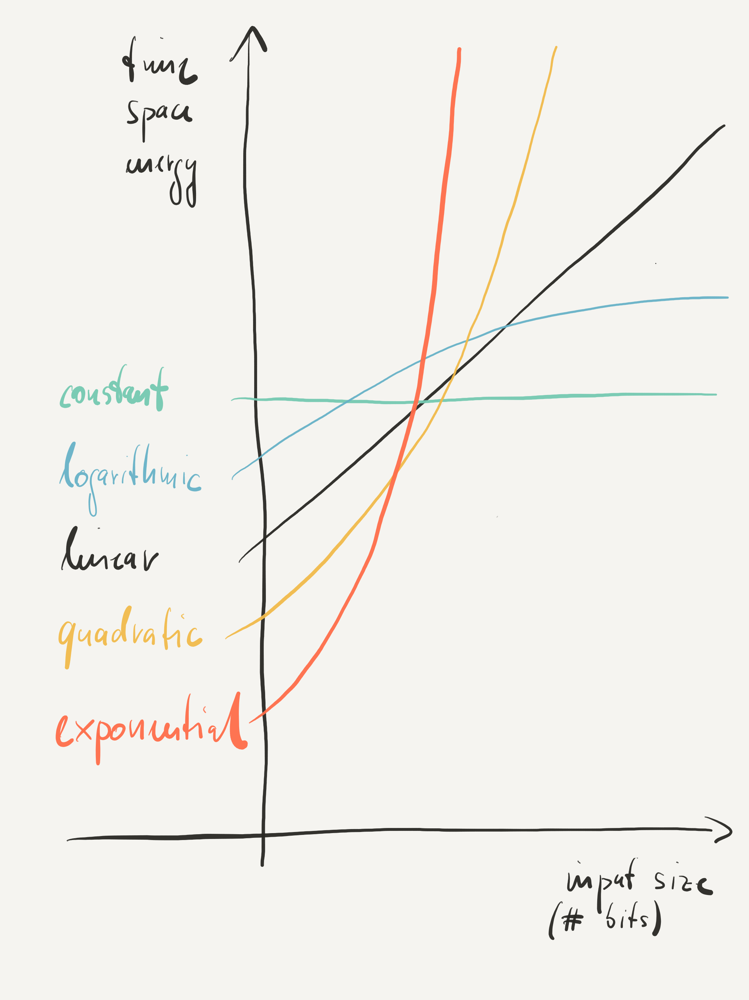

# 3. Computation and Performance

{#computation}

Being able to add, subtract, multiply, and divide numbers represented by bit strings is obviously important and processors do that very fast. But what else do we need to compute, well, everything? Another look at mathematics helps. We are interested in a machine that can compute any function from bit strings to bit strings. That would be fantastic since bit strings can in principle represent everything. Reality, however, is a bit more humbling. All existing formalisms for describing code are known to capture the same set of functions, also called the *computable functions*. In other words, most programming and machine languages are equally expressive. Whatever I can express in one language, in terms of functions from bit strings to bit strings, I can express in another. However, the set of computable functions is a strict subset of all functions, that is, there are functions that existing machines cannot compute. This does not mean though that there will never be a machine that can compute more. Most computer scientists, however, believe that this is unlikely.

What matters to us is to understand what makes all these languages equally expressive. Intuitively, we must be able to describe potentially never ending processes of computation that manipulate bits. The most common constructs to do that are *iteration* and *recursion* which are equally expressive. An iteration describes a repetitive process that assembles the overall solution step by step from bigger and bigger intermediate results whereas a recursion describes a repetitive process that breaks the problem step by step into smaller and smaller subproblems until a one-step solution is known. Important for *computability* is only the ability to make *termination* part of the computation. Some functions can only be computed if one risks that the code that computes the function does not terminate for (the a-priori unknown) inputs for which the function is not defined. In other words, there are questions where the answer *is* the never ending process of computation rather than some bit string. Important, for now, is to understand iteration and recursion. Computability is covered later.

In sum, the fundamental question is: how do we represent data, ultimately in terms of bit strings, and how do we manipulate that data, ultimately using machine code, in a meaningful way? For example, suppose that we are interested in collecting data in a *set*, in a mathematical sense, that is, we would like to be able to avoid collecting duplicates of data but otherwise do not care about the order of data. Here, another key difference between computer science and mathematics appears. Mathematics, and in this example, set theory is concerned with the properties of (possibly infinite) sets whereas computer science, in this context, is concerned with the effective and efficient implementation of (approximations of) sets. However, best practice in computer science is still to reason like a mathematician, and like an expert in your field, because this is where meaning comes from, but pretend to be like a machine, because this is where computation comes from. The key to understanding computer science is to understand the *connection* between mathematics (and whatever your own field is about) and computers. Since we cannot talk about all possible application areas we use basic mathematics as sufficiently representative example that everyone can understand. In other words, you can acquire the necessary computer science skills to solve any problem you like with a machine as long as you really understand the problem you are trying to solve and how it relates to computers.

So far we have only worried about what can in principle be computed. However, another key problem in computer science is performance. Approaches that require more time, space, or energy than we have are non-solutions in practice. Typical performance metrics are the time to perform an operation, called *execution time* (or *latency* if the operation is delaying something else more important), the number of operations per unit of time that can be performed, called *throughput*, and the amount of *memory* consumed in bits or bytes, and even the amount of *power* consumed in Watt. Performance of code may be measured experimentally. However, performance may also be studied mathematically by looking at the behavior of an *algorithm*, that is, machine-independent code, in relation to the size of its input. A typical question in so-called *algorithmic complexity* is what the relation between input size and execution time of an algorithm is, independent of any particular machine. For example, does the execution time of a sorting algorithm grow logarithmically, polynomially, or even exponentially in the number of items that need to be sorted? Amazingly, we can even go beyond such questions and ask what the so-called *computational complexity* of a *problem* such as sorting, rather than of a concrete algorithm for sorting, is. An answer tells us how difficult it is in *principle* to solve such a problem with *any* algorithm. Relevant to us, for now, are performance metrics and a bit about growth rates. The rest is done later.

We are now going, in a bit more detail, over the basics of (1) functions, as fundamental constructs of computation, and (2) performance metrics and growth rates of computation.

## Computation

From a purely computational point of view, a computer just computes functions from bit strings to bit strings. The original definition of a *function* is nevertheless mathematical and thus neither concerned with how to represent input and output, ultimately in terms of bit strings, nor how to compute the output from the input.

[Function](https://en.wikipedia.org/wiki/Function_(mathematics) "Function")
: A relation between a set of inputs and a set of permissible outputs with the property that each input is related to exactly one output.

However, many applications can in fact be written down using mathematical functions. In fact, many application areas have their own way of writing which may be mathematical or not but is typically different from how computer scientists express themselves. We try to close that gap here.

X> As running example we use a function f from natural numbers to natural numbers such that f(x,y)=x+y where + denotes addition of natural numbers.
X>
X> Note that we use addition because it is simple and sufficient for our purpose here. It can always be replaced by something arbitrarily complex.

How do we make a computer actually compute f(x,y)? The first thing we need to be clear about is that whatever we do the result will always be an approximation of f and not really f. This is because everything with a computer is finite whereas many things in mathematics, in particular many functions like f are not. With computers there is always a limit on what can be done, with respect to time, space, and even energy. In case of f the limit will be a (spatial) bound on the numeric values represented by x and y for which the computer will still be able to compute f(x,y). An important question is thus if that bound is too limiting for our purposes. If not, we have a solution.

Now, what do we actually need to compute, well, anything computable? There are two universal categories of instructions, one for manipulating *data* and the other for *controlling* what to do next:

1. *Data* instructions that read data (bit strings) from memory, modify the data, and write the modified data back to memory, and:

2. *Control* instructions that may or may not read data (bit strings) to determine what to do next.

Can you imagine that this is enough? Well, it is and one of the goals of this book is to find out why and what the implications are.

X> For the sake of simplicity, let us assume that our computer is not capable of adding two numbers directly but can instead *increment* and *decrement* an 8-bit unsigned integer with wrap-around semantics (so two data instructions).
X>
X> We also assume that the computer can check if an integer is zero and, if yes, return an integer, or, if not, go to the next instruction. There is also an instruction to go back to an earlier instruction (so two control instructions).
X>
X> With such a system, f(x,y) can be computed by incrementing x exactly y times, that is, we have the computer:
X>
X> 1. Check if y is 0, and, if yes, return x, or, if not,
X> 2. increment x,
X> 3. decrement y, and
X> 4. go back to 1.

This is our first *program*, a sequence of four instructions, which, as we mentioned before, could even be represented by bit strings (rather than a sentence in English). The process of incrementing x and decrementing y until y is 0 is an instance of what is called an *iteration*.

[Program](https://en.wikipedia.org/wiki/Computer_program "Program")
: A sequence of instructions, written to perform a specified task with a computer.

[Iteration](https://en.wikipedia.org/wiki/Iteration "Iteration")
: The act of repeating a process with the aim of approaching a desired goal, target or result. Each repetition of the process is also called an "iteration", and the results of one iteration are used as the starting point for the next iteration.

Since we are using 8 bits for x and y the program produces the correct result as long as the sum of x and y is less than 2^8^=256. This is interesting because the computer may only find out if it can produce the correct result by trying to compute it and see if there is an overflow or not. However, there are always two sides to correctness: there is the program that should be correct but also a *specification* that states what is actually correct. In other words, a program, just like any other artifact, can only be correct with respect to a specification that states what is required to be correct.

X> The above program is correct if we only require it to produce the sum of x and y for any x and y whose sum is less than 2^8^=256.
X>
X> We can nevertheless always *weaken* the requirements!
X>
X> For example, we may only require that the program produces the sum of x and y for x and y less than 2^7^=128. This specification excludes perfectly fine inputs such as 254 for x and 1 for y. However, we could then modify the program to reject any other inputs before even attempting to compute the sum.
X>
X> Then we can of course also *strengthen* the requirements!
X>
X> For example, we may require that the program produces the sum of x and y for x and y less than 2^8^=256. Meeting that specification requires modifying the program where the carry bit is somehow returned along with the result.

The lesson to learn here is that programming is much more than just developing code.

T> There are three quite different activities involved in creating computation:
T>
T> 1. Developing a program (this is what most people have in mind).
T> 2. Developing a specification (this is what many people forget).
T> 3. Showing that the program is correct with respect to the specification (this is the most difficult to do).
T>
T> Developing programs requires primarily a background in computer science. Developing specifications requires first and foremost application domain expertise. Both activities are important. However, making sure that a program does what it is intended to do is the actual problem!

Suppose we could actually write down our intentions in a way that would be natural to us (for example, mathematical) but also computable by a machine (that is, executable). In this case, the problem of matching specification and program would disappear. Well, there are ways to do that, at least to some extent. An important example is *recursion* which is a technique to define a function using the same function but repeatedly applied to smaller and smaller versions of its original inputs until a solution is known.

[Recursion](https://en.wikipedia.org/wiki/Recursion_(computer_science) "Recursion")
: A method where the solution to a problem depends on solutions to smaller instances of the same problem (as opposed to iteration).

X> Consider the example of a recursive function g defined as follows:
X>
X> (1) g(x,y)=g(x,y-1)+1 for all y>0, and
X> (2) g(x,0)=x
X>
X> Part (1) of the definition breaks the problem into a smaller problem, that is, x+y-1 rather than x+y, by decrementing y. It then assembles the result, that is, x+y, by incrementing the solution to x+y-1.
X>
X> Part (2) of the definition is a known solution to the problem based on the fact that x+0=x. Part (2) is also called the *termination condition* which must be present in any well-defined recursion.

Mathematically speaking f=g since g is in fact a proper definition of addition. Thus if we can make g execute on a computer we are done. How do we do that, at least in principle? Before looking at an example remember though that whatever we do, executing g on a computer will be done using finite representations of all data such as 8-bit unsigned integers, just like before. So, even when using recursion to express computation, the result will only be an approximation of f. Also, many applications are difficult to express using recursion. So, recursion is not a magic solution to all problems but it is still a very important technique.

X> Let us consider the execution of g(1,2):
X>
X> g(1,2)=g(1,2-1)+1=g(1,1)+1=(g(1,1-1)+1)+1=(g(1,0)+1)+1=(1+1)+1=2+1=3.
X>
X> Step by step, we replace g(1,2) by its definition, that is, by g(1,2-1)+1. We then simplify that term as much as possible, in this case, in one step to g(1,1)+1, by decrementing 2 to 1. Now, we replace g(1,1) again by its definition which is g(1,1-1)+1 resulting in the overall term (g(1,1-1)+1)+1. Similarly, we simplify g(1,1-1) to g(1,0) resulting in the overall term (g(1,0)+1)+1. We now replace g(1,0) by its definition, that is, by 1, resulting in the overall term (1+1)+1. Then, it is time to simplify (1+1)+1 to 2+1, by incrementing 1 to 2, and finally, 2+1 to 3.

The term (1+1)+1 of the example is interesting. It represents all the work that is still left to do to complete the computation after satisfying the termination condition. Understanding how to remember that work and later complete it is the key to understanding recursion. Intuitively, the work that still needs to be done must be completed in the *reverse* order in which it was remembered. One way to remember that is to organize the information in a so-called *stack*. We will show in detail how this is done in later chapters.

[Stack](https://en.wikipedia.org/wiki/Stack_(abstract_data_type) "Stack")
: A collection of elements, with two principal operations: *push* adds an element to the collection and *pop* removes the last element that was added.

X> In our example, the term (1+1)+1 represents the work that is still to be done. In particular, the left + needs to be done first because it was remembered last, followed by the right +.
X>
X> Here, the order is actually irrelevant but this is only because + is associative. In general, the order does matter!

It may be hard to believe but recursion is exactly as expressive as iteration!

T> Any program using an iteration may be rewritten into an equivalent program that uses recursion instead, and vice versa.

However, recursion often allows to focus on *what* to compute (for example, addition) rather than *how* to compute it because the underlying stack hides *how* the individual steps of the computation are done. Recursion is a good example of how to abstract from iterative computation to something that is closer to a mathematical specification.

There are many other ways to express computation on higher levels of abstraction. Important for us here is to be aware that there is always the *logic* of computation and, distinct from that, its *implementation*. We need to be able to reason on both levels and know how to connect them. Let us have a look at another example but this time on the *logic* of data and its *representation* rather than on describing computation.

Suppose we would like to collect objects without duplicates and do not care about any object ordering. The natural representation of such a collection is a *set*. Similar to other representations, the operations on a set such as membership, union, intersection, and so on define the semantics of a set. In particular, an object is either an element of a set or not and there is no ordering of elements of a set.

[Set (in Mathematics)](https://en.wikipedia.org/wiki/Set_(mathematics) "Set (in Mathematics)")
: A collection of distinct objects, considered as an object in its own right.

Similar to integers, a computer representation of a set may only approximate the original. Moreover, in contrast to the semantics or *logic* of a set in the mathematical sense, temporal and spatial performance of the *implementation* of a set plays an important role. For example, how long does it take to find out if an object is an element of a set and how much memory do we need to store a set?

[Set (in Computer Science)](https://en.wikipedia.org/wiki/Set_(abstract_data_type) "Set (in Computer Science)")
: A collection that can store certain values, without any particular order, and no repeated values. It is a computer implementation of the mathematical concept of a finite set.

No matter the actual application, being able to distinguish between logic and implementation and reason on both levels is key to understanding computer science. Many students are good at only one of the two. The best know both. In class we usually ask students to describe the *logic* of a computational artifact first and only then go into the details of its *implementation*. Most students have a hard time doing that. For most it appears to be much simpler to reason on lower, more mechanical levels of abstraction. Others prefer to stay away from those. The truth, however, is in the relation between logic and implementation. Does the implementation really implement the logic or specification we have in mind? And, just as important, is the implementation sufficiently efficient for our purposes? Let us now have a closer look at performance.

## Performance

Computational performance is typically measured in terms of time and space and, more recently, even in terms of energy. How much time does a computation take, how much memory does it need, and how much energy does it consume? Before looking at the most common metrics, we emphasize that in computer science the notion of order of magnitude may be used with its standard meaning as it is common in other disciplines or with a meaning rather unique to the field. Traditionally, something is an order of magnitude bigger or smaller if it is bigger or smaller by a factor of ten. However, in computer science, because of the widespread use of binary codes, an order of magnitude may also refer to a factor of two.

[Order of Magnitude](https://en.wikipedia.org/wiki/Orders_of_magnitude_(data) "Order of Magnitude")
: A factor with base 10 (decimal) or with base 2 (binary).

As a consequence and even more confusing is the fact that commonly used prefixes such as kilo, mega, giga, and tera may either refer to factors of 10^3^=1000 or 2^10^=1024 depending on context and metric. Only recently new binary prefixes for kilo, mega, giga, tera, and so on, called kibi, mebi, gibi, tebi, respectively, have been introduced. Adoption is nevertheless slow. We try our best to use the new prefixes properly.

| [Decimal Prefix](https://en.wikipedia.org/wiki/Metric_prefix "Decimal Prefix") | Value | [Binary Prefix](https://en.wikipedia.org/wiki/Binary_prefix "Binary Prefix") | Value |
| ------------------ | --------------- | ----------------- | --------------- |
| nano (n)           | 10^-9^=1000^-3^ |
| micro (u)          | 10^-6^=1000^-2^ |
| milli (m)          | 10^-3^=1000^-1^ |
| kilo (k)           | 10^3^=1000^1^   | kilo (K,Ki,kibi)  | 2^10^ = 1024^1^ |
| mega (M)           | 10^6^=1000^2^   | mega (M,Mi,mebi)  | 2^20^ = 1024^2^ |
| giga (G)           | 10^9^=1000^3^   | giga (G,Gi,gibi)  | 2^30^ = 1024^3^ |
| tera (T)           | 10^12^=1000^4^  | tera (T,Ti,tebi)  | 2^40^ = 1024^4^ |

Memory storage is typically quantified in bytes with base 2, for example, in gigabytes or, more recently and unambiguously in gibibytes. Processor speed, however, may be represented in instructions per second with base 10, for example, in million instructions per second (MIPS). Similarly, special-purpose metrics such as FLOPS, floating-point operations per second, are prefixed with base 10. Also, data rates are often represented in bits per second with base 10, for example, in gigabits per second (gbps), that is, 10^9^ bits per second.

Speed is generally characterized in terms of throughput, the amount of work done per unit of time, and latency, the amount of time to do some work, in particular before some other work can be done. The difference is usually explained with a simple example. Imagine a fiber optic cable connecting, say, New York City and San Francisco and a truck loaded with DVDs driving from New York City to San Francisco. Which one provides higher throughput and which one lower latency? Surprisingly, it may very well be possible that the truck provides higher throughput. However, delivering just a single bit by truck may take days. Thus the truck clearly provides terrible latency not suitable to host, say, a skype call. Got it?

[Throughput](https://en.wikipedia.org/wiki/Throughput "Throughput")
: Amount of work performed per unit of time.

[Latency](https://en.wikipedia.org/wiki/Latency "Latency")
: Amount of time (or delay) to perform work.

Energy is quantified in Joule and power consumption in Watt, that is, the amount of energy consumed per second. Interestingly, we can also quantify the efficiency of, say, computation, for example, in number of operations performed by that computation per Joule, or even in MIPS or FLOPS per Watt. Energy efficiency plays an increasingly important role, not just in mobile computing but also in large-scale data center computing.

| Performance | Unit |
| ----------- | ---- |
| memory      | bit (b), [kilobit](https://en.wikipedia.org/wiki/Kilobit "Kilobit") (kb), megabit (mb), gigabit (gb), terabit (tb) with decimal prefix |
|             | byte (B), [kilobyte](https://en.wikipedia.org/wiki/Kilobyte "Kilobyte") (kB), megabyte (MB), gigabyte (GB), terabyte (TB) with decimal prefix |
|             | byte (B), [kibibyte](https://en.wikipedia.org/wiki/Kibibyte "Kibibyte") (KB,KiB), mebibyte (MB,MiB), gibibyte (GB,GiB), tebibyte (TiB) with binary prefix |
| latency     | nanoseconds (ns), microseconds (us), milliseconds (ms), seconds (s), minutes (m), hours (h) |
| throughput  | million instructions per second ([MIPS](https://en.wikipedia.org/wiki/Instructions_per_second "MIPS")) |
|             | floating point operations per second ([FLOPS](https://en.wikipedia.org/wiki/FLOPS "FLOPS")) |
|             | bytes/second, [kB/s](https://en.wikipedia.org/wiki/Data_rate_units "Data Rate Units"), MB/s, GB/s, TB/s |
|             | bits/second, [kbps](https://en.wikipedia.org/wiki/Data_rate_units "Data Rate Units"), mbps, gbps, tbps |
| energy      | [joule](https://en.wikipedia.org/wiki/Joule "Joule") |
| power       | joule/second ([watt](https://en.wikipedia.org/wiki/Watt "Watt")) |
| efficiency  | operations/joule |
|             | MIPS/watt |
|             | FLOPS/watt |

Measuring computational performance in terms of time, space, and energy allows comparing different solutions of a given problem but only on a finite set of instances of the problem. Consider, for example, the problem of sorting numbers. We may directly compare the performance of different sorting algorithms by running them one after another on a given instance of the problem, for example, on a set of ten numbers. However, the relative performance of the algorithms may be very different when they are applied to, say, a set of a thousand numbers. This is because the relation between the size of a problem instance and the performance of an algorithm for solving the problem may not be linear. Beyond measuring performance we are therefore also interested in studying what is called algorithmic complexity, that is, how performance of an algorithm relates to the size of its input. Typical examples relevant in practice are constant, logarithmic, linear, quadratic, cubic, and exponential complexity.

| Growth Rate     | Function        | Comment                         |
| --------------- | --------------- | ------------------------------- |
| constant        | {$$}c{/$$}      | no growth                       |
| [logarithmic](https://en.wikipedia.org/wiki/Logarithmic_growth "Logarithmic Growth") | {$$}log(n){/$$} | {$$}log_b(n)=log(n)/log(b){/$$} |
| [linear](https://en.wikipedia.org/wiki/Linear_function "Linear Growth") | {$$}n{/$$} | polynomial |
| [quadratic](https://en.wikipedia.org/wiki/Quadratic_growth "Quadratic Growth")   | {$$}n^2{/$$} | polynomial |
| cubic           | {$$}n^3{/$$}    | polynomial                      |
| [exponential](https://en.wikipedia.org/wiki/Exponential_growth "Exponential Growth") | {$$}2^n{/$$} | {$$}b^n=10^(n*log(b)){/$$} |

Constant complexity means that the performance of an algorithm remains the same for any input. Non-constant complexity means that performance is a non-constant function of the input size. Determining that function requires, as prerequisite, defining a performance metric and a metric on input size. For example, we could define the number of steps taken in the computation of the addition function f(x,y) that we introduced earlier. In fact, this is usually done for studying temporal performance formally since the time to execute an algorithm is a linear function of the number of steps taken by that algorithm as long as each step can be performed by a constant number of machine instructions and the execution time of each machine instruction is indeed constant or at least bounded by a constant. The former can be ensured by properly defining, as in our example, what a step of a computation is. The latter is anyway true on most modern hardware.

As metric on input size, we could take the numeric value of x and y. In this case, since f takes y iterations, f's algorithmic complexity is linear in the numeric value of y, independent of the numeric value of x. If the numeric value of y was fixed, the complexity would thus even come down to constant. However, assuming the value of y is represented in binary, if we take the size of that representation, that is, the number of bits necessary to represent y's value, then the complexity is in fact exponential. If we were to represent the value of y in unary the complexity would again come down to linear complexity. If complexity is polynomial in numeric value but exponential in size of value representation one also speaks of pseudo-polynomial complexity.

The recursive function g(x,y) that we introduced along with f has the same complexity characteristics as f. However, depending on what we define to be a step in a computation there may be a difference between the two but only by a constant factor. For example, the recursive invocation of g could be counted as an extra step making g more expensive than f. Their growth rate would nevertheless remain the same. In theory, constant factors are typically ignored including different bases of logarithmic and exponential functions. Only the difference in growth rate matters if input can be arbitrarily large. We also speak of asymptotic complexity in this case. Here, constant is better than logarithmic which is better than linear which is better than quadratic which is better than cubic which is better than exponential. Still, constant factors can be important in practice. It may very well happen that there is an algorithm with exponential complexity that anyway runs faster than an algorithm with, say, linear complexity that solves the same problem, as long as the input size is below some threshold. In this case, the exponential algorithm is in fact the better choice.

In general, algorithmic complexity only provides bounds rather than exact performance numbers. For example, the fact that an algorithm has linear complexity only means that there is a linear function from input size to number of steps such that the actual number of steps taken by the algorithm  never exceeds the value of that function. The linear function is thus an upper bound on actual performance. Conversely, we may also define a function that is a lower bound on actual performance. For f(x,y) and g(x,y), the lower bound is the same linear function that is also the upper bound since both functions take y iterations or recursions no matter what. There are, however, many algorithms with upper and lower bounds on performance that are not the same. In other words, algorithmic complexity remains in general an approximation of actual performance. For example, there are algorithms that are only known to have, say, cubic complexity although in practice they run with quadratic complexity. Yet showing formally that they always do may be difficult.

Before we finish this chapter let us point out that algorithmic complexity may also refer to space and energy consumption given appropriate performance metrics. In fact, many algorithms may have great time complexity at the expense of space complexity and vice versa. Most relevant for you is to keep in mind that properly judging an algorithm's performance usually involves a complete analysis from performance experiments to complexity analysis in all relevant performance dimensions. In short, an algorithm is not better than another just because it runs faster. It should also not use more memory and even energy before making any such claims. When it comes to performance a differentiating approach is the way to go.