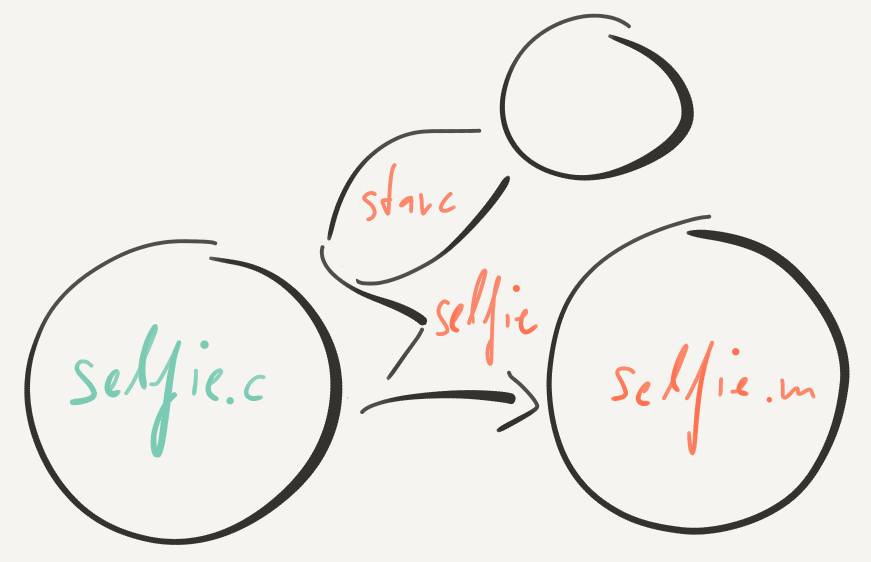
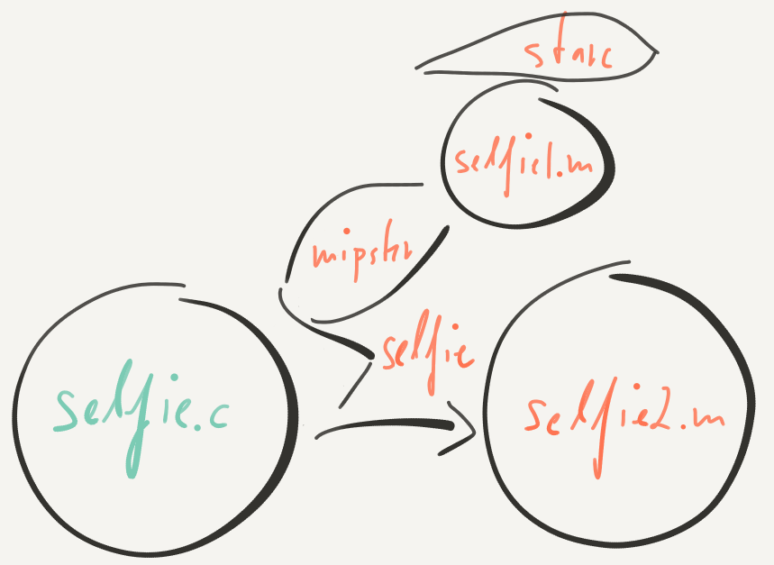

# 2. Semantics {#semantics}

When it comes to computers a *bit* is the first thing we may want to know about and understand. The only thing that computers really do on the level of the machine is handle enormous amounts of bits, nothing else.

[Bit](https://en.wikipedia.org/wiki/Bit "Bit")
: The basic unit of information in computing and digital communications. A bit can have only one of two values which are most commonly represented as either a 0 or 1. The term bit is a portmanteau of binary digit.

There are two fundamental reasons why computers use bits and nothing else. The first reason is that the two values of a bit can readily be distinguished by electronic circuits using different levels of voltage, say, low voltage for 0 and high voltage for 1. Distinguishing more values is possible and would be exciting to see but has largely not yet happened for technological reasons. The second reason is that whatever you can say using any number of values per digit or character greater than two you can also say using two values with only an insignificant difference in the number of digits or characters you need to say the same thing. More on that in the [next chapter](#encoding).

Selfie is a computer program that is fully contained in a single file called [`selfie.c`](https://github.com/cksystemsteaching/selfie/blob/master/selfie.c) which consists of around two hundred and eighty-eight thousand characters that are encoded in bits.

[Character](https://en.wikipedia.org/wiki/Character_(computing) "Character")
: A unit of information that roughly corresponds to a grapheme, grapheme-like unit, or symbol, such as in an alphabet or syllabary in the written form of a natural language. Examples of characters include *letters*, numerical *digits*, common *punctuation marks* (such as "." or "-"), and *whitespace*. The concept also includes *control characters*, which do not correspond to symbols in a particular natural language, but rather to other bits of information used to process text in one or more languages. Examples of control characters include *carriage return*, *line feed*, and *tab*, as well as instructions to printers or other devices that display or otherwise process text.

You may also see for yourself by downloading [selfie](https://github.com/cksystemsteaching/selfie "selfie") and then using the `less` command in your terminal (use the `cd` command first to go into the top folder of selfie which is where you unzipped it on your machine):

{line-numbers=off}
```
> less selfie.c
```

For example, the first few lines of `selfie.c` are:

{line-numbers=off}
```
/*
Copyright (c) 2015-2018, the Selfie Project authors. All rights reserved.
Please see the AUTHORS file for details. Use of this source code is
governed by a BSD license that can be found in the LICENSE file.

Selfie is a project of the Computational Systems Group at the
Department of Computer Sciences of the University of Salzburg
in Austria. For further information and code please refer to:

http://selfie.cs.uni-salzburg.at
```

What you see here is called source code where the first few lines are in fact comments that will be ignored by the machine.

[Source Code](https://en.wikipedia.org/wiki/Source_code "Source Code")
: Any collection of computer instructions (possibly with comments) written using some human-readable computer language, usually as text.

The characters of source code like `selfie.c` are usually encoded in bits according to the ASCII standard. Remember, since computers can only handle bits everything needs to be encoded in bits.

[American Standard Code for Information Interchange (ASCII)](https://en.wikipedia.org/wiki/ASCII "American Standard Code for Information Interchange (ASCII)")
: 7-bit encoding scheme for 128 characters: numbers 0 to 9, lowercase letters a to z, uppercase letters A to Z, basic punctuation symbols, control codes that originated with Teletype machines, and a space.

On machine level, each character is thus represented by seven bits. What we see when we invoke `less` is merely a human-readable version of these bits. To get a better feel of the size of `selfie.c` run the command `wc -m selfie.c` which counts the characters in `selfie.c`:

{line-numbers=off}
```
> wc -m selfie.c
290907 selfie.c
```

The output means that `selfie.c` at the time of invoking the command consisted of 290,907 characters. Your output may not be exactly the same number of characters depending on which version of selfie you have. The same is true for other statistical data shown below. However, the order of magnitude of that data is likely to be the same here and in your version.

The `-m` part of the command is called an option that directs, in this case, `wc` to output the number of characters. However, we should mention that the characters in `selfie.c` are actually encoded according to the newer UTF-8 standard which uses eight rather than seven bits per character.

[UTF-8](https://en.wikipedia.org/wiki/UTF-8 "UTF-8")
: (Universal Character Set Transformation Format - 8-bit) A character encoding capable of encoding all possible characters (called code points) in Unicode. The encoding is variable-length and uses 8-bit code units. It is designed for backward compatibility with ASCII.

When it comes to selfie we nevertheless speak of ASCII characters because of that backward compatibility. Here this means that the UTF-8 encoding of a given character is exactly the ASCII encoding of that character when simply ignoring the eighth bit. More on encoding characters can be found in the [next chapter](#encoding).

Since a unit of eight bits is very common in computer systems there is a well-known term for that unit called a byte.

[Byte](https://en.wikipedia.org/wiki/Byte "Byte")
: A unit of digital information in computing and telecommunications that most commonly consists of eight bits.

We can easily verify that `selfie.c` consists of the same number of bytes than characters by using the command `wc -c selfie.c` with the `-c` option which directs `wc` to report the number of bytes in `selfie.c`:

{line-numbers=off}
```
> wc -c selfie.c
290907 selfie.c
```

In other words, for a computer `selfie.c` is in fact a sequence of eight times 290,907 bits, that is, 2,327,256 bits. The key question addressed by this book is where the meaning of these bits comes from.

Q> Where does semantics come from and how do we create it on a machine?

The source code of selfie is ultimately a sequence of bits. How do they get their meaning? Bits, as is, have no meaning, they are just bits. Characters, by the way, are no different. Characters, as is, have no meaning either, they are just symbols, and can anyway be encoded in bits. When it comes to a machine the meaning of bits and thus characters or any kind of symbol has to be created mechanically. The key insight is that the meaning of bits is in the process of changing bits, not in the bits themselves.

X> Let us take two numbers, say 7 and [42](https://en.wikipedia.org/wiki/Phrases_from_The_Hitchhiker%27s_Guide_to_the_Galaxy "42"), and then add 7 to 42. What we obviously get is 49 transforming 7 and 42 into 49.

The process of adding 7 to 42, according to the rules of elementary arithmetic, makes 7, 42, and 49 represent numbers rather than something else. But if we just look at 7, 42, and 49 they could mean anything. In this example, elementary arithmetic provides meaning, namely the semantics of natural numbers. This is why it is so important to learn elementary arithmetic in school. It tells us what numbers are, not just how to add, subtract, multiply, and divide them!

[Elementary Arithmetic](https://en.wikipedia.org/wiki/Elementary_arithmetic "Elementary Arithmetic")
: The simplified portion of arithmetic that includes the operations of addition, subtraction, multiplication, and division.

Virtually all modern computers include circuitry for performing elementary arithmetic but they do so with binary rather than decimal numbers since computers only handle bits. Our example of 7, 42, and 49 in binary is just as simple.

X> The number 7 in binary is 111. The number 42 in binary is 101010. Adding 111 to 101010 works in exactly the same way than adding 7 to 42. The result is 110001 which is binary for 49.

Again, adding 111 to 101010 makes 111, 101010, and 110001 represent numbers while they could otherwise represent anything. More on encoding numbers in binary can be found in the [next chapter](#encoding).

[Binary Number](https://en.wikipedia.org/wiki/Binary_number "Binary Number")
: A number expressed in the binary numeral system or base-2 numeral system which represents numeric values using two different symbols: typically 0 (zero) and 1 (one).

It may be hard to believe but determination and knowing elementary arithmetic is enough to understand this book. The source code of selfie, that is, the around two hundred and seventy thousand characters of `selfie.c` represented by around two million bits get their meaning in pretty much the same way than having bits represent numbers: by changing them. The only difference is that the process of change is a *bit* more involved than elementary arithmetic.

T> The semantics of bits on a machine is created by changing these bits!

## The Compiler

Let us have a closer look at how this works with selfie. Try the `make` command:

{line-numbers=off}
```
> make
cc -w -O3 -m64 -D'main(a,b)=main(int argc, char** argv)' -Duint64_t='unsigned long long' selfie.c -o selfie
```

The `make` command invokes the `cc` command which *compiles* the file `selfie.c` into a file called `selfie` (without the `.c` extension) as directed by the `-o` option, ignoring the other options for clarity. In other words, the sequence of bits representing `selfie.c` is changed into another sequence of bits representing `selfie`. The difference between the two sequences is that the former represents source code whereas the latter represents machine code.


[Machine Code](https://en.wikipedia.org/wiki/Machine_code "Machine Code")
: A sequence of instructions executed directly by a computer's central processing unit (CPU).

The key idea is that both sequences are supposed to have the same semantics. However, `selfie` is *executable* by a computer whereas `selfie.c` is not, at least not purposefully, yet `selfie.c` is human-readable and writable in particular. The process of changing `selfie.c` into `selfie` is called *compilation* which is done by a compiler such as the above cc compiler.

[Compiler](https://en.wikipedia.org/wiki/Compiler "Compiler")
: A computer program that transforms source code written in a programming language (the source language) into another computer language (the target language), with the latter often having a binary form known as object or machine code. The most common reason for converting source code is to create an executable program.

This means that we now have a version of selfie that we can run on our machine! Let us try and run selfie using the command `./selfie`:

{line-numbers=off}
```
> ./selfie
./selfie: usage: selfie { -c { source } | -o binary | [ -s | -S ] assembly | -l binary | -sat dimacs } [ ( -m | -d | -r | -n | -y | -min | -mob ) 0-64 ... ]
```

Selfie requires using at least one option to do anything useful and therefore responds with its usage pattern and then terminates without doing anything else. To do something useful, let us try the first `-c` option on, well, `selfie.c` itself:

{line-numbers=off}
```
> ./selfie -c selfie.c
./selfie: selfie compiling selfie.c with starc
./selfie: 290907 characters read in 10091 lines and 1341 comments
./selfie: with 171876(59.08%) characters in 44090 actual symbols
./selfie: 344 global variables, 442 procedures, 416 string literals
./selfie: 2535 calls, 1145 assignments, 86 while, 879 if, 394 return
./selfie: symbol table search time was 2 iterations on average and 49185 in total
./selfie: 171792 bytes generated with 39800 instructions and 12592 bytes of data
./selfie: init:    lui: 2334(5.86%), addi: 13671(34.35%)
./selfie: memory:  ld: 7146(17.95%), sd: 5926(14.88%)
./selfie: compute: add: 3462(8.69%), sub: 708(1.77%), mul: 812(2.04%), divu: 82(0.20%), remu: 35(0.08%)
./selfie: control: sltu: 626(1.57%), beq: 969(2.43%), jal: 3579(8.99%), jalr: 442(1.11%), ecall: 8(0.02%)
```

Now, things are taking off. Selfie includes a compiler, just like the cc compiler, that we call starc and invoke with the `-c` option. The statistics in the output of starc may safely be ignored here. This will become clear later. The starc compiler is capable of compiling all of selfie including itself. By now we all know why selfie is called selfie but the story continues.

After compiling `selfie.c` starc only stores the machine code internally but does not write it to a file. To do that we need to use the `-o` option:

{line-numbers=off}
```
> ./selfie -c selfie.c -o selfie.m
./selfie: selfie compiling selfie.c with starc
...
./selfie: 171920 bytes with 39800 instructions and 12592 bytes of data written into selfie.m
```

The three dots `...` indicate that we omitted some output that is either identical to or insignificantly different from the previous output. The command produces a file called `selfie.m` that contains machine code compiled from `selfie.c` using the starc compiler in `selfie` rather than the cc compiler. The process is called self-compilation.



By now we have three different sequences of bits in `selfie.c`, `selfie`, and `selfie.m` that are all supposed to have the same semantics. The only difference between `selfie` and `selfie.m` is that `selfie` is executable on our computer whereas `selfie.m` is executable on a computer that we do not have. This is not the end of the story though.

## The Emulator

The reason why starc targets a different machine than cc is because it makes starc a lot simpler. But how do we execute `selfie.m`? Well, selfie not only includes the starc compiler, it also includes mipster, which is an emulator of the computer that can execute `selfie.m` and any other machine code generated by starc. That computer is so simple that everyone can understand it in a reasonable amount of time even though it corresponds to parts of a real machine.

[Emulator](https://en.wikipedia.org/wiki/Emulator "Emulator")
: Software that enables one computer system (called the host) to behave like another computer system (called the guest).

We execute `selfie.m` by first loading it using the `-l` option and then running it by invoking mipster using the `-m` option:

{line-numbers=off}
```
> ./selfie -l selfie.m -m 1
./selfie: 171920 bytes with 39800 instructions and 12592 bytes of data loaded from selfie.m
./selfie: selfie executing selfie.m with 1MB physical memory on mipster
selfie.m: usage: selfie { -c { source } | -o binary | [ -s | -S ] assembly | -l binary | -sat dimacs } [ ( -m | -d | -r | -n | -y | -min | -mob ) 0-64 ... ]
./selfie: selfie.m exiting with exit code 0 and 0.00MB mallocated memory
./selfie: selfie terminating selfie.m with exit code 0
./selfie: summary: 70757 executed instructions and 0.17MB(17.18%) mapped memory
./selfie: init:    lui: 17(0.02%), addi: 29790(42.10%)
./selfie: memory:  ld: 15599(22.04%), sd: 10085(14.25%)
./selfie: compute: add: 1691(2.38%), sub: 1562(2.20%), mul: 1859(2.62%), divu: 657(0.92%), remu: 408(0.57%)
./selfie: control: sltu: 947(1.33%), beq: 957(1.35%), jal: 4706(6.65%), jalr: 2314(3.27%), ecall: 165(0.23%)
./selfie: profile: total,max(ratio%)@addr,2max,3max
./selfie: calls:   2314,658(28.43%)@0x284C,353(15.25%)@0x29E4,353(15.25%)@0x30BC
./selfie: loops:   220,131(59.54%)@0x40C8,63(28.63%)@0x184,23(10.45%)@0x47E4
./selfie: loads:   15599,658(4.21%)@0x2860,658(4.21%)@0x2864,658(4.21%)@0x2874
./selfie: stores:  10085,658(6.52%)@0x2850,658(6.52%)@0x2858,353(3.50%)@0x29E8
```

After loading `selfie.m` the `-m 1` option directs mipster to *emulate* a computer with 1 megabyte of memory (abbreviated 1MB, explained below) for executing `selfie.m`. Since `selfie.m` is invoked without any options, which could appear after the `-m 1` option, it responds, just like `selfie` without options before, with its usage pattern and then terminates. After that mipster terminates and outputs a summary of its builtin performance profiler.

[Profiling](https://en.wikipedia.org/wiki/Profiling_(computer_programming) "Profiling")
: A form of dynamic program analysis that measures, for example, the space (memory) or time complexity of a program, the usage of particular instructions, or the frequency and duration of function calls. Most commonly, profiling information serves to aid program optimization.

We later use profiling to explain performance-related issues of selfie. But now, let us try something cool. Since mipster is part of selfie we can even have mipster execute machine code for selfie generated by starc without writing the code into a file:

{line-numbers=off}
```
> ./selfie -c selfie.c -m 1
./selfie: selfie compiling selfie.c with starc
...
./selfie: selfie executing selfie.c with 1MB physical memory on mipster
...
./selfie: summary: 70757 executed instructions and 0.17MB(17.18%) mapped memory
./selfie: init:    lui: 17(0.02%), addi: 29790(42.10%)
./selfie: memory:  ld: 15599(22.04%), sd: 10085(14.25%)
./selfie: compute: add: 1691(2.38%), sub: 1562(2.20%), mul: 1859(2.62%), divu: 657(0.92%), remu: 408(0.57%)
./selfie: control: sltu: 947(1.33%), beq: 957(1.35%), jal: 4706(6.65%), jalr: 2314(3.27%), ecall: 165(0.23%)
./selfie: profile: total,max(ratio%)@addr(line#),2max,3max
./selfie: calls:   2314,658(28.43%)@0x284C(~1679),353(15.25%)@0x29E4(~1703),353(15.25%)@0x30BC(~1791)
./selfie: loops:   220,131(59.54%)@0x40C8(~2086),63(28.63%)@0x184(~254),23(10.45%)@0x47E4(~2185)
./selfie: loads:   15599,658(4.21%)@0x2860(~1679),658(4.21%)@0x2864(~1679),658(4.21%)@0x2874(~1679)
./selfie: stores:  10085,658(6.52%)@0x2850(~1679),658(6.52%)@0x2858(~1679),353(3.50%)@0x29E8(~1703)
```

The output is just like before except for the approximate source code line numbers in the profile. Those are only available if executing machine code generated in the same run rather than loading machine code. Never mind if you do not understand what this means. It will become clear later.

Let us maintain our momentum and do something even cooler than before. We now compile `selfie.c` with starc and then execute the generated machine code on mipster only to have that code compile `selfie.c` again, all in the same run. This requires 2 to 3MB rather than 1MB for mipster and will take starc a few minutes to complete depending on the type and speed of our computer because executing starc on mipster is slower than executing starc directly on our computer. However, it does work and this is what counts here:

{line-numbers=off}
```
> ./selfie -c selfie.c -m 3 -c selfie.c
./selfie: selfie compiling selfie.c with starc
...
./selfie: selfie executing selfie.c with 3MB physical memory on mipster
selfie.c: selfie compiling selfie.c with starc
...
./selfie: selfie.c exiting with exit code 0 and 2.11MB mallocated memory
./selfie: selfie terminating selfie.c with exit code 0
./selfie: summary: 287651036 executed instructions and 2.03MB(67.84%) mapped memory
...
```

We can even verify that starc generates the same machine code independently of whether it runs directly on our machine or on mipster. We simply have starc generate machine code into two different files called `selfie1.m` and `selfie2.m`:

{line-numbers=off}
```
> ./selfie -c selfie.c -o selfie1.m -m 3 -c selfie.c -o selfie2.m
./selfie: selfie compiling selfie.c with starc
...
./selfie: 171920 bytes with 39800 instructions and 12592 bytes of data written into selfie1.m
./selfie: selfie executing selfie1.m with 3MB physical memory on mipster
selfie1.m: selfie compiling selfie.c with starc
...
selfie1.m: 171920 bytes with 39800 instructions and 12592 bytes of data written into selfie2.m
./selfie: selfie1.m exiting with exit code 0 and 2.11MB mallocated memory
./selfie: selfie terminating selfie1.m with exit code 0
./selfie: summary: 287727856 executed instructions and 2.03MB(67.84%) mapped memory
...
```



Both files generated by starc are indeed identical. To verify that try the `diff` command as follows:

{line-numbers=off}
```
> diff -s selfie1.m selfie2.m
Files selfie1.m and selfie2.m are identical
```

We call this phenomenon the *fixed point* of a self-compiling compiler. If we continue generating machine code for starc using starc the machine code will remain the same. So, we still have only three different sequences of bits in `selfie.c`, `selfie`, and `selfie.m` that are supposed to have the same semantics. In particular, if we run `selfie.m` on mipster to compile `selfie.c` the result will again be an exact copy of `selfie.m`. However, there is a fourth sequence with the same semantics that we can generate with selfie. It represents a human-readable version of the machine code in `selfie.m` written in what is called assembly.

[Assembly](https://en.wikipedia.org/wiki/Assembly_language "Assembly Language")
: A low-level programming language for a computer, or other programmable device, in which there is a very strong (generally one-to-one) correspondence between the language and the architecture's machine code instructions.

Try the `-S` option to have selfie generate assembly as follows:

{line-numbers=off}
```
> ./selfie -c selfie.c -S selfie.s
./selfie: selfie compiling selfie.c with starc
...
./selfie: 1843603 characters of assembly with 39800 instructions and 12592 bytes of data written into selfie.s
```

The part of selfie that generates assembly is called a *disassembler*.

[Disassembler](https://en.wikipedia.org/wiki/Disassembler)
: A computer program that translates machine language into assembly language - the inverse operation to that of an assembler.

Selfie does not implement an assembler though. The starc compiler simply generates machine code right away without going through assembly first (which would then require an assembler to generate machine code from that assembly).

Since assembly is human-readable let us check it out:

{line-numbers=off}
```
> less selfie.s
```

For example, the first few lines of `selfie.s` are:

{line-numbers=off}
```
0x0(~1): 0x0003A2B7: lui $t0,0x3A
0x4(~1): 0xF1028293: addi $t0,$t0,-240
0x8(~1): 0x00028193: addi $gp,$t0,0
0xC(~1): 0x00000513: addi $a0,$zero,0
0x10(~1): 0x0D600893: addi $a7,$zero,214
0x14(~1): 0x00000073: ecall
0x18(~1): 0x00750513: addi $a0,$a0,7
0x1C(~1): 0x00800293: addi $t0,$zero,8
0x20(~1): 0x025572B3: remu $t0,$a0,$t0
0x24(~1): 0x40550533: sub $a0,$a0,$t0
0x28(~1): 0x0D600893: addi $a7,$zero,214
0x2C(~1): 0x00000073: ecall
0x30(~1): 0xFEA1BC23: sd $a0,-8($gp)
0x34(~1): 0x00000513: addi $a0,$zero,0
0x38(~1): 0x00810293: addi $t0,$sp,8
0x3C(~1): 0xFF810113: addi $sp,$sp,-8
0x40(~1): 0x00513023: sd $t0,0($sp)
0x44(~1): 0x531260EF: jal $ra,39756[0x26D74]
```

What you see is a human-readable version of the machine code in `selfie.m`. The purpose of `selfie.s` is here to study `selfie.m` and eventually understand its semantics. Selfie can even show the assembly code as it is being executed by mipster which helps debugging the machine code.

[Debugging](https://en.wikipedia.org/wiki/Debugging "Debugging")
: The process of finding and resolving of defects that prevent correct operation of computer software or a system.

Let us try that using the `-d` option which invokes mipster in debugging mode. Careful though, there will be a lot of assembly code racing down your screen. We omit most of that here:

{line-numbers=off}
```
> ./selfie -c selfie.c -d 1
./selfie: selfie compiling selfie.c with starc
...
./selfie: selfie executing selfie.c with 1MB physical memory on mipster
$pc=0x10000(~1): lui $t0,0x3A: |- $t0=0x0 -> $t0=0x3A000
$pc=0x10004(~1): addi $t0,$t0,-240: $t0=237568(0x3A000) |- $t0=237568(0x3A000) -> $t0=237328(0x39F10)
$pc=0x10008(~1): addi $gp,$t0,0: $t0=237328(0x39F10) |- $gp=0x0 -> $gp=0x39F10
$pc=0x1000C(~1): addi $a0,$zero,0: $zero=0(0x0) |- $a0=0(0x0) -> $a0=0(0x0)
$pc=0x10010(~1): addi $a7,$zero,214: $zero=0(0x0) |- $a7=0(0x0) -> $a7=214(0xD6)
$pc=0x10014(~1): ecall(brk): $a0=0x0 |- $a0=0x0 -> $a0=0x39F10
$pc=0x10018(~1): addi $a0,$a0,7: $a0=237328(0x39F10) |- $a0=237328(0x39F10) -> $a0=237335(0x39F17)
$pc=0x1001C(~1): addi $t0,$zero,8: $zero=0(0x0) |- $t0=237328(0x39F10) -> $t0=8(0x8)
$pc=0x10020(~1): remu $t0,$a0,$t0: $a0=237335(0x39F17),$t0=8(0x8) |- $t0=8(0x8) -> $t0=7(0x7)
$pc=0x10024(~1): sub $a0,$a0,$t0: $a0=237335(0x39F17),$t0=7(0x7) |- $a0=237335(0x39F17) -> $a0=237328(0x39F10)
$pc=0x10028(~1): addi $a7,$zero,214: $zero=0(0x0) |- $a7=214(0xD6) -> $a7=214(0xD6)
$pc=0x1002C(~1): ecall(brk): $a0=0x39F10 |- ->
$pc=0x10030(~1): sd $a0,-8($gp): $gp=0x39F10,$a0=237328(0x39F10) |- mem[0x39F08]=0 -> mem[0x39F08]=$a0=237328(0x39F10)
$pc=0x10034(~1): addi $a0,$zero,0: $zero=0(0x0) |- $a0=237328(0x39F10) -> $a0=0(0x0)
$pc=0x10038(~1): addi $t0,$sp,8: $sp=0xFFFFFFD0 |- $t0=7(0x7) -> $t0=4294967256(0xFFFFFFD8)
$pc=0x1003C(~1): addi $sp,$sp,-8: $sp=0xFFFFFFD0 |- $sp=0xFFFFFFD0 -> $sp=0xFFFFFFC8
$pc=0x10040(~1): sd $t0,0($sp): $sp=0xFFFFFFC8,$t0=4294967256(0xFFFFFFD8) |- mem[0xFFFFFFC8]=0 -> mem[0xFFFFFFC8]=$t0=4294967256(0xFFFFFFD8)
$pc=0x10044(~1): jal $ra,39756[0x36D74]: |- $ra=0x0,$pc=0x10044 -> $pc=0x36D74,$ra=0x10048
          |
          |
          |
$pc=0x36DD8(~10091): jalr $zero,0($ra): $ra=0x10048 |- $pc=0x36DD8 -> $pc=0x10048
$pc=0x10048(~1): addi $sp,$sp,-8: $sp=0xFFFFFFD8 |- $sp=0xFFFFFFD8 -> $sp=0xFFFFFFD0
$pc=0x1004C(~1): sd $a0,0($sp): $sp=0xFFFFFFD0,$a0=0(0x0) |- mem[0xFFFFFFD0]=1 -> mem[0xFFFFFFD0]=$a0=0(0x0)
$pc=0x10050(~1): ld $a0,0($sp): $sp=0xFFFFFFD0,mem[0xFFFFFFD0]=0 |- $a0=0(0x0) -> $a0=0(0x0)=mem[0xFFFFFFD0]
$pc=0x10054(~1): addi $sp,$sp,8: $sp=0xFFFFFFD0 |- $sp=0xFFFFFFD0 -> $sp=0xFFFFFFD8
$pc=0x10058(~1): addi $a7,$zero,93: $zero=0(0x0) |- $a7=64(0x40) -> $a7=93(0x5D)
$pc=0x1005C(~1): ecall(exit): $a0=0x0 |- ->
./selfie: selfie.c exiting with exit code 0 and 0.00MB mallocated memory
./selfie: selfie terminating selfie.c with exit code 0
./selfie: summary: 70757 executed instructions and 0.17MB(17.18%) mapped memory
...
```

What is interesting about that output is the fact that each line on the screen shows a tiny bit of progress the machine is making during the run. In fact, all lines taken together make up what the semantics of `selfie.c` is during that run. Even though, in this case, it is only the response with its usage pattern there is quite a bit happening as you can see.

By the way, we can also slow down the machine to see what happens in slow motion by leveraging the fact that mipster can execute any machine code generated by starc. In particular, mipster can not only run starc but all of selfie including itself. Let us try that and see what happens if we load `selfie.m` into mipster and then run mipster on top of mipster to run selfie without any options. We call that self-execution of mipster:

{line-numbers=off}
```
> ./selfie -c selfie.c -o selfie.m -m 2 -l selfie.m -m 1
./selfie: selfie compiling selfie.c with starc
...
./selfie: 171920 bytes with 39800 instructions and 12592 bytes of data written into selfie.m
./selfie: selfie executing selfie.m with 2MB physical memory on mipster
selfie.m: 171920 bytes with 39800 instructions and 12592 bytes of data loaded from selfie.m
selfie.m: selfie executing selfie.m with 1MB physical memory on mipster
selfie.m: usage: selfie { -c { source } | -o binary | [ -s | -S ] assembly | -l binary | -sat dimacs } [ ( -m | -d | -r | -n | -y | -min | -mob ) 0-64 ... ]
selfie.m: selfie.m exiting with exit code 0 and 0.00MB mallocated memory
selfie.m: selfie terminating selfie.m with exit code 0
selfie.m: summary: 70757 executed instructions and 0.17MB(17.57%) mapped memory
...
./selfie: selfie.m exiting with exit code 0 and 11.12MB mallocated memory
./selfie: selfie terminating selfie.m with exit code 0
./selfie: summary: 119582959 executed instructions and 1.83MB(91.80%) mapped memory
...
```

Now, we could have starc compile `selfie.c` while running on top of two mipsters but this would take several hours depending on the speed of our computer. We could even do that on top of three or in fact any number of mipsters but the time for starc to complete would increase *exponentially* with the number of mipsters running on top of each other. This means three mipsters take days, four take months, and five take years!

## The Hypervisor

A way to avoid the slowdown of running emulators is virtualization.

[Virtualization](https://en.wikipedia.org/wiki/Virtualization "Virtualization")
: The act of creating a virtual (rather than actual) version of something, including virtual computer hardware platforms, operating systems, storage devices, and computer network resources.

With selfie, instead of having mipster execute mipster to execute starc, we can also have mipster execute hypster to *host* starc rather than to execute starc. Hypster is a hypervisor that mimics mipster without executing any machine code itself but instead asks the mipster on which it runs to execute the machine code on its behalf. For the machine code there is no difference except that it runs much faster.

[Hypervisor](https://en.wikipedia.org/wiki/Hypervisor "Hypervisor")
: A piece of computer software, firmware or hardware that creates and runs virtual machines. A computer on which a hypervisor runs one or more virtual machines is called a host machine, and each virtual machine is called a guest machine.

Let us try using the same command as above for running starc on mipster but this time running starc on hypster, using the `-y` option, running on top of mipster:

{line-numbers=off}
```
> ./selfie -c selfie.c -o selfie3.m -m 3 -l selfie3.m -y 3 -c selfie.c -o selfie4.m
./selfie: selfie compiling selfie.c with starc
...
./selfie: 171920 bytes with 39800 instructions and 12592 bytes of data written into selfie3.m
./selfie: selfie executing selfie3.m with 3MB physical memory on mipster
selfie3.m: 171920 bytes with 39800 instructions and 12592 bytes of data loaded from selfie3.m
selfie3.m: selfie executing selfie3.m with 3MB physical memory on hypster
selfie3.m: selfie compiling selfie.c with starc
...
selfie3.m: 171920 bytes with 39800 instructions and 12592 bytes of data written into selfie4.m
selfie3.m: selfie3.m exiting with exit code 0 and 2.11MB mallocated memory
selfie3.m: selfie terminating selfie3.m with exit code 0
selfie3.m: summary: 0 executed instructions and 2.04MB(68.23%) mapped memory
./selfie: selfie3.m exiting with exit code 0 and 13.12MB mallocated memory
./selfie: selfie terminating selfie3.m with exit code 0
./selfie: summary: 559998931 executed instructions and 2.47MB(82.42%) mapped memory
...
```


Again, `selfie3.m` and `selfie4.m` are identical and equal to `selfie.m`, `selfie1.m`, and `selfie2.m`. Since hypster can run on top of hypster, which is why we call hypster self-hosting, we could now run starc on two or in fact any number of hypsters and mipsters on at least one mipster and get the same result. Try four hypsters on one mipster and see for yourself that it will not take years but in fact just a few minutes, not much longer than using just one mipster:

{line-numbers=off}
```
> ./selfie -c selfie.c -o selfie5.m -m 4 -l selfie5.m -y 4 -l selfie5.m -y 3 -l selfie5.m -y 3 -l selfie5.m -y 3 -c selfie.c -o selfie6.m
./selfie: selfie compiling selfie.c with starc
...
./selfie: 171920 bytes with 39800 instructions and 12592 bytes of data written into selfie5.m
./selfie: selfie executing selfie5.m with 4MB physical memory on mipster
selfie5.m: 171920 bytes with 39800 instructions and 12592 bytes of data loaded from selfie5.m
selfie5.m: selfie executing selfie5.m with 4MB physical memory on hypster
selfie5.m: 171920 bytes with 39800 instructions and 12592 bytes of data loaded from selfie5.m
selfie5.m: selfie executing selfie5.m with 3MB physical memory on hypster
selfie5.m: 171920 bytes with 39800 instructions and 12592 bytes of data loaded from selfie5.m
selfie5.m: selfie executing selfie5.m with 3MB physical memory on hypster
selfie5.m: 171920 bytes with 39800 instructions and 12592 bytes of data loaded from selfie5.m
selfie5.m: selfie executing selfie5.m with 3MB physical memory on hypster
selfie5.m: selfie compiling selfie.c with starc
...
selfie5.m: 171920 bytes with 39800 instructions and 12592 bytes of data written into selfie6.m
selfie5.m: selfie5.m exiting with exit code 0 and 2.11MB mallocated memory
selfie5.m: selfie terminating selfie5.m with exit code 0
selfie5.m: summary: 0 executed instructions and 2.04MB(68.23%) mapped memory
selfie5.m: selfie5.m exiting with exit code 0 and 13.12MB mallocated memory
selfie5.m: selfie terminating selfie5.m with exit code 0
selfie5.m: summary: 0 executed instructions and 2.48MB(82.81%) mapped memory
selfie5.m: selfie5.m exiting with exit code 0 and 13.12MB mallocated memory
selfie5.m: selfie terminating selfie5.m with exit code 0
selfie5.m: summary: 0 executed instructions and 2.92MB(97.65%) mapped memory
selfie5.m: selfie5.m exiting with exit code 0 and 13.12MB mallocated memory
selfie5.m: selfie terminating selfie5.m with exit code 0
selfie5.m: summary: 0 executed instructions and 3.37MB(84.47%) mapped memory
./selfie: selfie5.m exiting with exit code 0 and 14.12MB mallocated memory
./selfie: selfie terminating selfie5.m with exit code 0
./selfie: summary: 1460798393 executed instructions and 3.81MB(95.31%) mapped memory
...
```

## Performance

A significant part of computer science is about computational performance. How much time does a computation take, how much memory does it need, and, increasingly important, how much energy does it consume? We introduce the standard units for quantifying computational performance in terms of time and space, and even in terms of energy.

Before doing so, we should nevertheless point out that in computer science the notion of *order of magnitude* may be used with its standard meaning as it is common in other disciplines or with a meaning rather unique to the field. Traditionally, something is an order of magnitude bigger or smaller if it is bigger or smaller by a factor of ten. However, in computer science, because of the widespread use of binary codes, an order of magnitude may also refer to a factor of two.

[Order of Magnitude](https://en.wikipedia.org/wiki/Orders_of_magnitude_(data) "Order of Magnitude")
: A factor with base 10 (decimal) or with base 2 (binary).

As a consequence and even more confusing is the fact that commonly used prefixes such as kilo, mega, giga, and tera may either refer to factors of 10^3^=1000 or 2^10^=1024 depending on context and unit. Only recently new binary prefixes for kilo, mega, giga, tera, and so on, called kibi, mebi, gibi, tebi, respectively, have been introduced. Adoption is nevertheless slow.

| [Decimal Prefix](https://en.wikipedia.org/wiki/Metric_prefix "Decimal Prefix") | Value | [Binary Prefix](https://en.wikipedia.org/wiki/Binary_prefix "Binary Prefix") | Value |
| ------------------ | --------------- | ----------------- | --------------- |
| nano (n)           | 10^-9^=1000^-3^ |
| micro (u)          | 10^-6^=1000^-2^ |
| milli (m)          | 10^-3^=1000^-1^ |
| kilo (k)           | 10^3^=1000^1^   | kilo (K,Ki,kibi)  | 2^10^ = 1024^1^ |
| mega (M)           | 10^6^=1000^2^   | mega (M,Mi,mebi)  | 2^20^ = 1024^2^ |
| giga (G)           | 10^9^=1000^3^   | giga (G,Gi,gibi)  | 2^30^ = 1024^3^ |
| tera (T)           | 10^12^=1000^4^  | tera (T,Ti,tebi)  | 2^40^ = 1024^4^ |

Memory storage is typically quantified in bytes with base 2, for example, in gigabytes or, more recently and unambiguously in gibibytes. Processor speed, however, may be represented in instructions per second with base 10, for example, in million instructions per second (MIPS). Similarly, special-purpose metrics such as FLOPS, floating-point operations per second, are prefixed with base 10. Also, data rates are often represented in bits per second with base 10, for example, in gigabits per second (gbps), that is, 10^9^ bits per second.

Speed is generally characterized in terms of throughput, the amount of work done per unit of time, and latency, the amount of time to do some work, in particular before some other work can be done. The difference is usually explained with a simple example. Imagine a fiber optic cable connecting, say, New York City and San Francisco and a truck loaded with DVDs driving from New York City to San Francisco. Which one provides higher throughput and which one lower latency? Surprisingly, it may very well be possible that the truck provides higher throughput. However, delivering just a single bit by truck may take days. Thus the truck clearly provides terrible latency not suitable to host, say, a skype call. Got it?

[Throughput](https://en.wikipedia.org/wiki/Throughput "Throughput")
: Amount of work performed per unit of time.

[Latency](https://en.wikipedia.org/wiki/Latency "Latency")
: Amount of time (or delay) to perform work.

For completeness and because of the increasing importance of energy efficiency in computing, in particular in mobile computing and large-scale data center computing, we also list standard units for quantifying energy here even though there is no further discussion of that topic.

Energy is quantified in Joule and power consumption in Watt, that is, the amount of energy consumed per second. Interestingly, we can quantify the efficiency of computation in number of operations performed by that computation per Joule, or even in MIPS or FLOPS per Watt.

| Performance | Unit |
| ----------- | ---- |
| memory      | bit (b), [kilobit](https://en.wikipedia.org/wiki/Kilobit "Kilobit") (kb), megabit (mb), gigabit (gb), terabit (tb) with decimal prefix |
|             | byte (B), [kilobyte](https://en.wikipedia.org/wiki/Kilobyte "Kilobyte") (kB), megabyte (MB), gigabyte (GB), terabyte (TB) with decimal prefix |
|             | byte (B), [kibibyte](https://en.wikipedia.org/wiki/Kibibyte "Kibibyte") (KB,KiB), mebibyte (MB,MiB), gibibyte (GB,GiB), tebibyte (TiB) with binary prefix |
| latency     | nanoseconds (ns), microseconds (us), milliseconds (ms), seconds (s), minutes (m), hours (h) |
| throughput  | million instructions per second ([MIPS](https://en.wikipedia.org/wiki/Instructions_per_second "MIPS")) |
|             | floating point operations per second ([FLOPS](https://en.wikipedia.org/wiki/FLOPS "FLOPS")) |
|             | bytes/second, [kB/s](https://en.wikipedia.org/wiki/Data_rate_units "Data Rate Units"), MB/s, GB/s, TB/s |
|             | bits/second, [kbps](https://en.wikipedia.org/wiki/Data_rate_units "Data Rate Units"), mbps, gbps, tbps |
| energy      | [joule](https://en.wikipedia.org/wiki/Joule "Joule") |
| power       | joule/second ([watt](https://en.wikipedia.org/wiki/Watt "Watt")) |
| efficiency  | operations/joule |
|             | MIPS/watt |
|             | FLOPS/watt |

## Summary

Let us summarize what we have seen so far and prepare for the next chapter. This chapter is the first step towards understanding selfie by observing that:

T> Change determines semantics!

In particular, the meaning of bits or characters or any symbols comes from change over time, by being changed (making them data) and by changing others (making them code). Let us have another look at our earlier example of adding 7 to 42.

X> The sum of 7 and 42 is usually denoted by 7 + 42 and evaluates to 49 making 7, 42, and 49 actually represent numbers.
X>
X> However, the + sign or in fact the bits encoding the + sign represent the operation of adding one number to another. Thus + has meaning as well when directing a machine to add one of its operands to the other.
X>
X> In other words, during the process of addition, 7, 42, and 49 are being changed and therefore considered data while + changes them and is therefore considered code.

Bits represent data such as an integer value at the time when they are used as operand of an integer operation. Bits represent code such as an integer operation at the time when they direct a machine to perform an integer operation. At all other times, their meaning could be anything. This also means that bits can sometimes be data and sometimes be code. Selfie is a non-trivial example of that phenomenon.

X> When compiling `selfie.c` into `selfie` using the cc compiler `selfie.c` and `selfie` are data while the cc compiler is code.
X>
X> However, self-compiling `selfie.c` into `selfie.m` using the starc compiler of `selfie` suddenly makes `selfie` be code.
X>
X> Moreover, executing or hosting `selfie.m` on mipster or hypster suddenly makes `selfie.m` be code.

For now it is important to remember that semantics comes from change and that bits can be data, when changed, and code, when changing others. Selfie shows that through its self-referential nature. Selfie in source code can be data when being compiled and selfie in machine code can be code when being executed or hosted.

Furthermore, the source code of self-compiling compilers such as the starc compiler is written in the programming language that they compile. For example, `selfie.c` is written in C\* which is a tiny subset of the widely used programming language C hence the extension `.c` in the name of the file.

[C](https://en.wikipedia.org/wiki/C_(programming_language) "C")
: A general-purpose, imperative computer programming language, supporting structured programming, lexical variable scope and recursion, while a static type system prevents many unintended operations.

C\* is much easier to learn than all of C. We designed C\* to make everything as simple as possible but still realistic. This is similar to using only a tiny but useful subset of the full vocabulary of a foreign language. It also means that all C\* programs are C programs but not the other way around.

The starc compiler is part of selfie and thus written in C\* but starc not only compiles selfie and in particular itself but all C\* programs hence the name starc. In other words, starc is a C\* compiler written in C\*. We do not need to know in which programming language the cc compiler is written (likely C) but we do know that it compiles all C programs hence the name cc. Since C\* is a subset of C the cc compiler also compiles selfie.

We conclude this chapter by pointing out that there was a time when there was no compiler for C and in fact no compiler for any programming language. The [first compilers](https://en.wikipedia.org/wiki/History_of_compiler_construction) were therefore written in machine code or in some programming language and then compiled into machine code by hand. Thus even selfie's origins go back to that time!