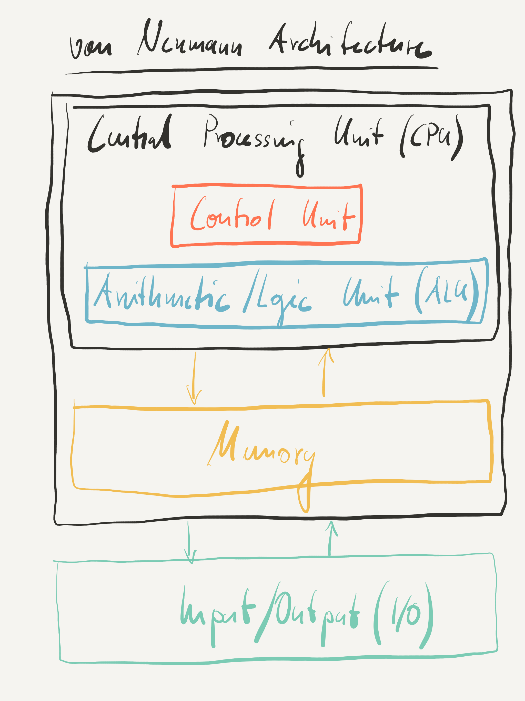
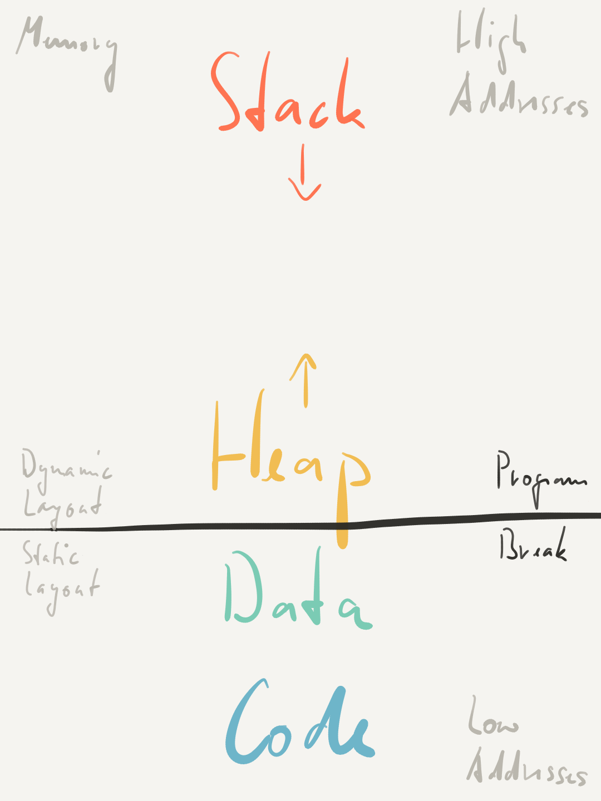

# 4. State {#state}

Computation is the evolution of state. At any given time, a computer stores a very large but still finite amount of bits in memory and registers. The values of all these bits together is what we call the state of the machine. Then the processor executes one instruction which directs it to change the values of a very small number of bits creating a new state. That process of change from one state to the next continues until the machine is turned off.

[State](https://en.wikipedia.org/wiki/State_(computer_science))
: The state of a digital logic circuit or computer program is a technical term for all the stored information, at a given instant in time, to which the circuit or program has access. The output of a digital circuit or computer program at any time is completely determined by its current inputs and its state.

Software on source and machine code level specifies for each state what the next state is. There are the data bits that are being changed and the code bits that determine that change. Input is typically modeled by data bits that are changed by something other than the processor such as a keyboard, for example.

In this chapter, we explain how on machine level memory and registers represent state and how machine code describes change of that state. We also show how source code provides a high-level view of program state and how that translates down to machine code level. Seeing both levels and how they connect is an important step towards learning how to code.

## Von Neumann Machine

Most general-purpose computers today are based on what is known as the *von Neumann model* or *von Neumann architecture*.

[Von Neumann Architecture](https://en.wikipedia.org/wiki/Von_Neumann_architecture)
: A computer architecture, described in 1945 by the mathematician and physicist John von Neumann and others, for an electronic digital computer with parts consisting of a processing unit containing an arithmetic logic unit and processor registers; a control unit containing an instruction register and program counter; a memory to store both data and instructions; external mass storage; and input and output mechanisms.



The CPU and main memory in a typical computer correspond to the processing unit and memory of a von Neumann architecture, respectively. The mipster emulator is no exception. It emulates a *von Neumann machine*.

The key idea is very simple. A von Neumann machine is a [stored-program computer](https://en.wikipedia.org/wiki/Stored-program_computer) which stores both code and data in the same memory. In fact, in memory there is really no distinction between code and data. A von Neumann machine fetches code from memory and executes it. The code will in turn instruct the machine to load data from memory into registers, perform some computation on registers, and finally store the results back in memory. We explain the details of how this works below. For now it is only important to understand that bits fetched from memory and executed happen to represent code in that moment while bits loaded from memory into registers, then modified, and finally stored back in memory represent data in that moment. At all other times, they are just bits.

## State Space

A von Neumann machine that can store n bits in memory and registers can distinguish 2^n^ states.

X> The mipster emulator implements a von Neumann machine with 4GB of memory, and [32 general-purpose 64-bit registers](https://github.com/cksystemsteaching/selfie/blob/b59e59e44c84fa54c480020c35c40c5633660476/selfie.c#L646-L721) and [1 special-purpose 64-bit register](https://github.com/cksystemsteaching/selfie/blob/b59e59e44c84fa54c480020c35c40c5633660476/selfie.c#L1303), explained below.
X>
X> Therefore, a mipster machine can store 2^32^\*8+32\*64+64 bits which is equal to 4,294,969,408 bits. Thus the machine can be in [2^4294969408^](http://www.wolframalpha.com/input/?source=nav&i=2%5E4294969408) different states, a number with 1,292,914,623 decimal digits. Imagine what a machine with terabytes of memory can do.

Interestingly, we can always, at least in principle, partition that enormously large state space into a set of good states and a set of bad states. Software without bugs would always keep the machine in good states, or conversely, prevent the machine from ever going to a bad state. However, what is a good state?

The answer to that question depends on what we would like the machine to do, it depends on the application. But most applications have nothing to do with individual bits. We therefore need formalisms that allow us to formalize what we want the machine to do on the level of the applications we are interested in. This is the reason why high-level programming languages were invented.

Since there are new applications or at least application characteristics appearing all the time new programming languages are also invented all the time. The key to being able to follow that trend is to understand the principles of programming languages and how they translate to machine level.

The programming language C of which we use a tiny subset here was originally designed for programming systems software such as operating systems and compilers. However, C has become very popular in many other application domains as well. Programming in C is called *imperative programming* which closely matches the imperative nature of most computers. It is therefore relatively straightforward to compile C code to machine code and manipulate machine states in C code even at the level of individual bits.

[Imperative Programming](https://en.wikipedia.org/wiki/Imperative_programming)
: A programming paradigm that uses statements that change program's state. In much the same way that the imperative mood in natural languages expresses commands, an imperative program consists of commands for the computer to perform. Imperative programming focuses on describing how a program operates.

Imperative programming is supported by many programming languages but it is not the only programming paradigm. *Declarative programming* is an important alternative that is also supported by many programming languages but handles program state differently.

[Declarative Programming](https://en.wikipedia.org/wiki/Declarative_programming)
: A programming paradigm - a style of building the structure and elements of computer programs - that expresses the logic of a computation without describing its control flow.

Intuitively, rather than saying imperatively how to change state, declarative programming focuses on declaring what needs to change. While spelling out how to change state can become tedious with imperative programming spelling out what to change can become burdensome with declarative programming. Yet both paradigms have their important use cases and a port of selfie to a declarative programming language would be very nice to have but remains future work for now.

Before explaining how C\* code works, we introduce C\* language elements that allow us to describe program state as a high-level abstraction of machine state. Code written in C\* then operates on that program state. Let us have a look at the following C\* program which we call the countdown program or just countdown:

{line-numbers=on, lang=c}
<<[The Countdown Program](code/countdown.c)

The program takes the decimal value 10 (Line 3) and decrements it (Line 13) until it reaches the decimal value 0 (Line 11) which is then returned (Line 19) as so-called *exit code*. To see for yourself run the [code](https://github.com/cksystemsteaching/selfie/blob/b59e59e44c84fa54c480020c35c40c5633660476/manuscript/code/countdown.c) as follows:

{line-numbers=on}
```
> ./selfie -c manuscript/code/countdown.c -o countdown.m -s countdown.s -m 1
./selfie: selfie compiling manuscript/code/countdown.c with starc
./selfie: 645 characters read in 20 lines and 9 comments
./selfie: with 65(10.70%) characters in 28 actual symbols
./selfie: 1 global variables, 1 procedures, 0 string literals
./selfie: 1 calls, 1 assignments, 1 while, 0 if, 1 return
./selfie: symbol table search time was 1 iterations on average and 22 in total
./selfie: 416 bytes generated with 100 instructions and 16 bytes of data
./selfie: init:    lui: 1(0.83%), addi: 62(51.66%)
./selfie: memory:  ld: 19(15.83%), sd: 7(5.83%)
./selfie: compute: add: 3(2.50%), sub: 3(2.50%), mul: 0(0.00%), divu: 0(0.00%), remu: 2(1.66%)
./selfie: control: sltu: 1(0.83%), beq: 5(4.16%), jal: 3(2.50%), jalr: 6(5.00%), ecall: 8(6.66%)
./selfie: 544 bytes with 100 instructions and 16 bytes of data written into countdown.m
./selfie: 3803 characters of assembly with 100 instructions written into countdown.s
./selfie: selfie executing countdown.m with 1MB physical memory on mipster
./selfie: countdown.m exiting with exit code 0 and 0.00MB mallocated memory
./selfie: selfie terminating countdown.m with exit code 0
./selfie: summary: 132 executed instructions and 0.00MB mapped memory
./selfie: init:    lui: 1(0.75%), addi: 40(30.30%)
./selfie: memory:  ld: 25(18.93%), sd: 15(11.36%)
./selfie: compute: add: 1(0.75%), sub: 11(8.33%), mul: 0(0.00%), divu: 0(0.00%), remu: 1(0.75%)
./selfie: control: sltu: 11(8.33%), beq: 11(8.33%), jal: 12(9.90%), jalr: 1(0.75%), ecall: 3(2.27%)
./selfie: profile: total,max(ratio%)@addr(line#),2max,3max
./selfie: calls:   1,1(100.00%)@0x134(~11),0(0.00%),0(0.00%)
./selfie: loops:   10,10(100.00%)@0x148(~11),0(0.00%),0(0.00%)
./selfie: loads:   25,11(44.00%)@0x148(~11),10(40.00%)@0x158(~13),1(4.00%)@0x50(~1)
./selfie: stores:  15,10(66.66%)@0x164(~13),1(6.66%)@0x30(~1),1(6.66%)@0x40(~1)
```

## [Global Variable](https://github.com/cksystemsteaching/selfie/blob/2560aa4acb58dad6b6a6c877794616949936d318/selfie.c#L4532-L4557)

For the countdown program to be able to operate on a number there needs to be memory to store that number. For this purpose, Line 3 in the source code *declares* a so-called *global variable* called `bar`. The starc compiler even reports that it found exactly that one global variable, see Line 5 in the above output.

[Global Variable](https://en.wikipedia.org/wiki/Global_variable)
: A variable with global scope, meaning that it is visible (hence accessible) throughout the program, unless shadowed. The set of all global variables is known as the global environment or global state.

So global really just means here that `bar` can be used throughout the program. Line 3 is thus a *declaration* that specifies that the identifier `bar` refers to the same variable in the whole program.

[Declaration](https://en.wikipedia.org/wiki/Declaration_(computer_programming) "Declaration")
: Specifies properties of an identifier: it declares what an identifier means. Declarations are most commonly used for functions, variables, constants, and classes. Beyond the name (the identifier itself) and the kind of entity (function, variable, etc.), declarations typically specify the data type (for variables and constants), or the type signature (for functions). The term "declaration" is frequently contrasted with the term "definition", but meaning and usage varies significantly between languages.

Line 3 not only declares `bar` but also *defines* the initial value of `bar` as the decimal value 10 represented by the integer literal `10`. The initial value of a global variable is nevertheless optional. Line 3 could be rewritten to `uint64_t bar;` in which case the value of `bar` would be initially undefined meaning it could initially be any value. Undefined values are a common source of errors, if programs depend on them. Modern compilers usually warn programmers about that (not starc though since we need to keep things simple). A simple way to avoid depending on undefined values is to either provide an initial value for a variable or to assign a value to a variable before using the variable in any computation, see below for more about how to do that. A program that does not depend on undefined values has a single initial state from which it begins all computations. This is what we want!

Note that the equality sign `=` in Line 3 is merely [syntactic sugar](https://en.wikipedia.org/wiki/Syntactic_sugar) making the code more readable while the [semicolon](https://en.wikipedia.org/wiki/Semicolon) `;` is a so-called *terminator* which indicates the end of a statement. After the semicolon we could insert more global variable declarations as long as they all were to introduce unique identifiers and were properly terminated with semicolons. Programming languages newer than C often make such terminators optional or omit them altogether since they are, similar to syntactic sugar, not necessary for the compiler to work and, unlike syntactic sugar, sometimes considered a burden.

#### [Data Type](https://github.com/cksystemsteaching/selfie/blob/13f79712cfc2ee9963225d71b8d91329d3ee11fe/selfie.c#L4241-L4258)

Line 3 also specifies that the *data type* of `bar` is `uint64_t` which, according to the C standard, means that `bar` represents an unsigned 64-bit integer, that is, 64 bits encoding a whole number. It also means that arithmetic operations involving `bar` will be done with unsigned 64-bit wrap-around semantics.

[Data Type](https://en.wikipedia.org/wiki/Data_type)
: A classification of data which tells the compiler or interpreter how the programmer intends to use the data. Most programming languages support various types of data, for example: real, integer, or Boolean. A data type provides a set of values from which an expression (i.e. variable, function ...) may take its values. The type defines the operations that can be done on the data, the meaning of the data, and the way values of that type can be stored.

So, this is important! A data type tells us and the compiler what the intended meaning of the bits are that encode the data. Remember, bits can encode anything and have no meaning unless they are involved in an operation. Data types therefore help with identifying meaning even without performing any operations.

A global variable of type `uint64_t` such as `bar` provides storage for 64 bits which happens to match the size of a word on a mipster machine. In fact, the value of `bar` will be stored in exactly one word somewhere in memory. First of all, this means that `bar` provides storage that is identified by the identifier `bar` and not by some memory address. But it also means that the program as is cannot access any other bits in memory than the 64 bits identified by `bar` which obviously reduces the size of the state space dramatically! So the program state space is much smaller than the machine state space and therefore much easier to reason about. However, there is also code in countdown that operates on `bar`. Let us have a closer look at how that is introduced in C\*.

## [Procedure](https://github.com/cksystemsteaching/selfie/blob/0d42a4ce21cee6903f0c9e937109a21fa07c63bd/selfie.c#L4336-L4486)

The source code of the countdown program declares a so-called *procedure* called `main` in Line 6. The broader term for procedures is *subroutines* defined as follows.

[Subroutine](https://en.wikipedia.org/wiki/Subroutine)
: A sequence of program instructions that perform a specific task, packaged as a unit. This unit can then be used in programs wherever that particular task should be performed. Subprograms may be defined within programs, or separately in libraries that can be used by multiple programs. In different programming languages, a subroutine may be called a procedure, a function, a routine, a method, or a subprogram.

In C subroutines are called procedures. Line 6 specifies that `main` refers to a procedure rather than a global variable simply by using `()` after the identifier. In fact, it would be perfectly fine to just say `uint64_t main();`. However, the code enclosed in `{}`, called the *body* of the procedure, also *defines* the implementation of the procedure. It describes what the procedure does. We get to that further below. The `uint64_t` keyword before `main` specifies that the so-called [return type](https://en.wikipedia.org/wiki/Return_type) of the procedure is an unsigned 64-bit integer. This means that the procedure returns an unsigned 64-bit integer value when done.

Global variable and procedure declarations, as in Lines 3 and 6, may use any identifier not used anywhere else in the program. In other words, identifiers used in declarations must be unique. The `main` procedure name, however, is even more special because the `main` procedure is the one that is invoked when a C program starts executing. Thus a valid C program needs to contain exactly one declaration and definition of a procedure called `main`. Otherwise, the system would not "know" what to execute. See for yourself by renaming `main` in `countdown.c` to something else. When `main` returns the program stops executing and the system outputs the value returned by `main`, which is 0, as the previously mentioned exit code, see Lines 16 and 17 in the above output.

There can be any number of global variable and procedure declarations in a C program. The starc compiler reports in Line 5 in the above output that there is exactly one procedure declared in `countdown.c` which is in fact the `main` procedure.

Line 8 in the above output mentions that starc generated exactly 416 bytes for `countdown.c` representing 100 instructions and 16 bytes of data (416=100\*4+16). The 100 instructions are encoded in 400 bytes (remember each instruction takes 4 bytes). They represent the machine code generated by starc for initializing and controlling the machine and in particular for implementing the `main` procedure, that is, the C\* code in Lines 11-19 in `countdown.c`. Out of the 16 bytes of data, 8 bytes represent the initial value of `bar` which is 10. The other 8 bytes represent a hidden global variable called `_bump` used for memory management.

Selfie can [write](https://github.com/cksystemsteaching/selfie/blob/0d42a4ce21cee6903f0c9e937109a21fa07c63bd/selfie.c#L5509-L5563) the generated bytes into a *binary file* or just *binary* (using the `-o` option) that can later be [loaded](https://github.com/cksystemsteaching/selfie/blob/0d42a4ce21cee6903f0c9e937109a21fa07c63bd/selfie.c#L5597-L5662) again (using the `-l` option) and [executed](https://github.com/cksystemsteaching/selfie/blob/0d42a4ce21cee6903f0c9e937109a21fa07c63bd/selfie.c#L9361-L9444) (using the `-m` option, for example).

[Binary File](https://en.wikipedia.org/wiki/Binary_file)
: A computer file that is not a text file. The term "binary file" is often used as a term meaning "non-text file". Binary files are usually thought of as being a sequence of bytes, which means the binary digits (bits) are grouped in eights. Binary files typically contain bytes that are intended to be interpreted as something other than text characters. Compiled computer programs are typical examples; indeed, compiled applications are sometimes referred to, particularly by programmers, as binaries.

In our example, selfie is instructed to write the generated bytes into a binary file called `countdown.m` that actually contains a total of 544 bytes for the 416 bytes of code and data plus 128 bytes of additional information (544=416+128), as reported in Line 8 in the above output. Out of the the 128 bytes of additional information 120 bytes encode meta data according to the [ELF standard](https://en.wikipedia.org/wiki/Executable_and_Linkable_Format). The remaining 8 bytes encode the amount of bytes needed to represent the instructions, that is, the 400 bytes of code, as opposed to the 16 bytes of data. This information is necessary to determine which bytes are code and which are data. The `countdown.m` binary is what is known as an *executable* which selfie outputs as proper ELF file making it compatible with a large number of existing tools.

[Executable](https://en.wikipedia.org/wiki/Executable)
: Causes a computer "to perform indicated tasks according to encoded instructions," as opposed to a data file that must be parsed by a program to be meaningful. These instructions are traditionally machine code instructions for a physical CPU.

We may use the terms binary and executable interchangeably even though, strictly speaking, there are binary files such as image files, for example, that are obviously not executable. However, executables are usually binaries.

The format of the `countdown.m` executable is very simple. It begins with [the 120 bytes of ELF meta data](https://github.com/cksystemsteaching/selfie/blob/0d42a4ce21cee6903f0c9e937109a21fa07c63bd/selfie.c#L5533) followed by [the 8 bytes encoding the number of bytes of code](https://github.com/cksystemsteaching/selfie/blob/0d42a4ce21cee6903f0c9e937109a21fa07c63bd/selfie.c#L5542) (which is 400 here) followed by [the 400 bytes of code and the 16 bytes of data](https://github.com/cksystemsteaching/selfie/blob/0d42a4ce21cee6903f0c9e937109a21fa07c63bd/selfie.c#L5551). That's it.

When invoking selfie on the countdown program, we also instructed selfie to [produce](https://github.com/cksystemsteaching/selfie/blob/0d42a4ce21cee6903f0c9e937109a21fa07c63bd/selfie.c#L8474-L8519) an assembly file `countdown.s` for the countdown program (using the `-s` option) that represents a human-readable version of the binary file `countdown.m`. Selfie reports on that in Line 14 in the above output. Note that `countdown.s` only contains code but not any data such as the initial value of `bar`.

Here is `countdown.s` but only showing the instructions that will actually be executed when running the program. The instructions that will not be executed, shown as `...`, are generated by starc because they may be needed by some programs, just not the countdown program. The comments are inserted manually and explained below.

{line-numbers=off}
```
// machine initialization code

// initialize global pointer $gp
// to program break at 0x101A0
0x0(~1): 0x000102B7: lui $t0,0x10     // load 0x10000 into $t0
0x4(~1): 0x1A028293: addi $t0,$t0,416 // add 416 (0x1A0) to $t0
0x8(~1): 0x00028193: addi $gp,$t0,0   // copy $t0 to $gp

// initialize bump pointer, explained later
0xC(~1): 0x00000513: addi $a0,$zero,0
0x10(~1): 0x0D600893: addi $a7,$zero,214
0x14(~1): 0x00000073: ecall
0x18(~1): 0x00750513: addi $a0,$a0,7
0x1C(~1): 0x00800293: addi $t0,$zero,8
0x20(~1): 0x025572B3: remu $t0,$a0,$t0
0x24(~1): 0x40550533: sub $a0,$a0,$t0
0x28(~1): 0x0D600893: addi $a7,$zero,214
0x2C(~1): 0x00000073: ecall
0x30(~1): 0xFEA1BC23: sd $a0,-8($gp)
0x34(~1): 0x00000513: addi $a0,$zero,0

// initialize argv, explained later
0x38(~1): 0x00810293: addi $t0,$sp,8
0x3C(~1): 0xFF810113: addi $sp,$sp,-8
0x40(~1): 0x00513023: sd $t0,0($sp)

// call main procedure
0x44(~1): 0x0F0000EF: jal $ra,60[0x134] // jump and link to main procedure code

// prepare return value of main procedure
// as exit code for exit environment call
0x48(~1): 0xFF810113: addi $sp,$sp,-8   // allocate space on the stack
0x4C(~1): 0x00A13023: sd $a0,0($sp)     // push return value onto stack

// wrapper code for exit environment call
0x50(~1): 0x00013503: ld $a0,0($sp)     // load exit code from stack into $a0
0x54(~1): 0x00810113: addi $sp,$sp,8    // pop exit code off the stack
0x58(~1): 0x05D00893: addi $a7,$zero,93 // load exit environment call ID 93 into $a7
0x5C(~1): 0x00000073: ecall             // exit here

// wrapper code for unused environment calls removed
...
// prologue of main procedure, explained later
0x134(~11): 0xFF810113: addi $sp,$sp,-8
0x138(~11): 0x00113023: sd $ra,0($sp)
0x13C(~11): 0xFF810113: addi $sp,$sp,-8
0x140(~11): 0x00813023: sd $fp,0($sp)
0x144(~11): 0x00010413: addi $fp,$sp,0

// body of main procedure
0x148(~11): 0xFF01B283: ld $t0,-16($gp)
0x14C(~11): 0x00000313: addi $t1,$zero,0
0x150(~11): 0x005332B3: sltu $t0,$t1,$t0
0x154(~11): 0x00028C63: beq $t0,$zero,6[0x16C]
0x158(~13): 0xFF01B283: ld $t0,-16($gp)
0x15C(~13): 0x00100313: addi $t1,$zero,1
0x160(~13): 0x406282B3: sub $t0,$t0,$t1
0x164(~13): 0xFE51B823: sd $t0,-16($gp)
0x168(~19): 0xFE1FF06F: jal $zero,-8[0x148]
0x16C(~19): 0xFF01B283: ld $t0,-16($gp)
0x170(~19): 0x00500533: add $a0,$zero,$t0
0x174(~19): 0x0040006F: jal $zero,1[0x178]

// epilogue of main procedure, explained later
0x178(~20): 0x00040113: addi $sp,$fp,0
0x17C(~20): 0x00013403: ld $fp,0($sp)
0x180(~20): 0x00810113: addi $sp,$sp,8
0x184(~20): 0x00013083: ld $ra,0($sp)
0x188(~20): 0x00810113: addi $sp,$sp,8
0x18C(~20): 0x00008067: jalr $zero,0($ra)
```

Each line in `countdown.s` represents one instruction. The first line, for example, is the instruction `lui $gp,0x10`, which is encoded in the 32-bit word `0x000101B7`. The instruction will be loaded into memory at some fixed address plus the offset `0x0`, as indicated by `0x0(~1)`. The number `~1` in parentheses is the approximate line number in `countdown.c` for which starc generated the instruction. Even though there is a comment at Line 1 in `countdown.c` this still makes sense because starc always generates some instructions before compiling any actual source code. Try to find the four instructions that starc actually generated for `bar = bar - 1` in Line 13 of `countdown.c`! They, along with the others, are explained below.

Ok, but what happens now when selfie is instructed by the final `-m 1` option to execute the generated code? Doing that involves solving a problem that appears to have no solution. How does a computer load an executable into memory without an executable in memory that instructs the processor how to do this? The process that solves that problem is called *bootstrapping*.

[Bootstrapping](https://en.wikipedia.org/wiki/Bootstrapping)
: A self-starting process that is supposed to proceed without external input. In computer technology the term (usually shortened to [booting](https://en.wikipedia.org/wiki/Booting)) usually refers to the process of loading the basic software into the memory of a computer after power-on or general reset, especially the operating system which will then take care of loading other software as needed.

A computer typically bootstraps itself by having the processor initially fetch, decode, and execute machine code from some non-volatile memory rather than volatile main memory. That machine code implements a so-called *boot loader* which instructs the processor to load the code that the processor is actually supposed to execute from some external source and store it in main memory. When done, the boot loader instructs the processor to start fetching, decoding, and executing the code stored in main memory.

## [Program Break](https://github.com/cksystemsteaching/selfie/blob/0d42a4ce21cee6903f0c9e937109a21fa07c63bd/selfie.c#L1388-L1389)

Before launching the mipster emulator, selfie [bootstraps](https://github.com/cksystemsteaching/selfie/blob/0d42a4ce21cee6903f0c9e937109a21fa07c63bd/selfie.c#L9361-L9444) mipster exactly like a computer bootstraps itself. First of all, the emulated memory and registers are *zeroed*, that is, set to `0x0`. The machine code and data generated by starc (or loaded from a binary file) is then [copied](https://github.com/cksystemsteaching/selfie/blob/0d42a4ce21cee6903f0c9e937109a21fa07c63bd/selfie.c#L8855-L8889) into the emulated memory starting at some low address. The portions of memory where code and data are located are also called the *code segment* and the *data segment*, respectively. Then, any optional input parameters to the program are stored at some high address in a memory region called the *stack*. The details of that are explained in the stack chapter. At this point, we have the following memory layout.



With code, data, and input copied to memory the machine is essentially ready to go. The rest of the memory layout will be explained in later chapters. For now we only need to know that the border between code and data and the rest of memory is the [program break](https://en.wikipedia.org/wiki/Sbrk) which divides memory into *statically* and *dynamically* allocated storage. The addresses of the code and data stored in memory below the program break will not change while the storage above the program break may be used for different purposes during execution. Keep in mind though that the memory layout we describe here is only one choice out of many possible choices. However, that layout is probably the most widely adopted choice today.

Going back to C\* in general and the countdown program in particular, global variable and procedure declarations specify exactly what is below the program break, what is code and data, and what the code does with the data, as we see next. Most important here is to understand that the state of memory is fully determined after copying the code for procedures and the data for global variables into memory. While countdown is a simple program think of the code and data for selfie. There are hundreds of global variable and procedure declarations in `selfie.c` but it is still the same thing. The fact that C\* allows us to talk about variables and procedures without worrying about memory layout is a key ingredient for managing the enormously large state space. The only missing piece now for a complete picture is the state of the registers. Let us take a look at that next!

## [Program Counter](https://github.com/cksystemsteaching/selfie/blob/0d42a4ce21cee6903f0c9e937109a21fa07c63bd/selfie.c#L1303)

How does a computer "know" what to execute? After all the bits in memory could mean anything. They could be code, they could be data, anything. But the answer to that question can anyway not be any simpler.

Processors based on the von Neumann model feature a special-purpose register as part of their control unit called the *program counter* (PC). The PC of the machine emulated by mipster is, unsurprisingly, yet another 64-bit register.

[Program Counter (PC)](https://en.wikipedia.org/wiki/Program_counter "Program Counter (PC)")
: A processor register that indicates where a computer is in its program sequence. In most processors, the PC is incremented after fetching an instruction, and holds the memory address of ("points to") the next instruction that would be executed. Instructions are usually fetched sequentially from memory, but control transfer instructions change the sequence by placing a new value in the PC. These include branches (sometimes called jumps), subroutine calls, and returns. A transfer that is conditional on the truth of some assertion lets the computer follow a different sequence under different conditions. A branch provides that the next instruction is fetched from somewhere else in memory. A subroutine call not only branches but saves the preceding contents of the PC somewhere. A return retrieves the saved contents of the PC and places it back in the PC, resuming sequential execution with the instruction following the subroutine call.

At boot time, selfie first makes sure that all emulated memory and registers are zeroed, just like real hardware. Then, code and data is loaded into memory starting, by convention, at address `0x10000`. Finally, the program counter is set to exactly that address `0x10000`. Now, mipster is ready to start code execution. From then on mipster [fetches the word in memory where the PC points to, decodes that word, and executes the resulting instruction](https://github.com/cksystemsteaching/selfie/blob/0d42a4ce21cee6903f0c9e937109a21fa07c63bd/selfie.c#L8383-L8384). Each instruction not only instructs the processor to perform some computation but also determines the next value of the PC so that the processor "knows" where in memory the next instruction is stored. That sequence of PC values is called *control flow*.

[Control Flow](https://en.wikipedia.org/wiki/Control_flow "Control Flow")
: The order in which individual statements, instructions or function calls of an imperative program are executed or evaluated. The emphasis on explicit control flow distinguishes an imperative programming language from a declarative programming language.

Let us take a look at how the first few and last few instructions for the countdown program execute. You will need to scroll back to the beginning after the following command though since selfie will output the whole sequence of executed instructions. Most of the output is skipped and just shown as `...` here.

{line-numbers=off}
```
> ./selfie -c manuscript/code/countdown.c -d 1
./selfie: selfie compiling manuscript/code/countdown.c with starc
./selfie: 645 characters read in 20 lines and 9 comments
./selfie: with 65(10.70%) characters in 28 actual symbols
./selfie: 1 global variables, 1 procedures, 0 string literals
./selfie: 1 calls, 1 assignments, 1 while, 0 if, 1 return
./selfie: symbol table search time was 1 iterations on average and 22 in total
./selfie: 416 bytes generated with 100 instructions and 16 bytes of data
./selfie: init:    lui: 1(0.83%), addi: 62(51.66%)
./selfie: memory:  ld: 19(15.83%), sd: 7(5.83%)
./selfie: compute: add: 3(2.50%), sub: 3(2.50%), mul: 0(0.00%), divu: 0(0.00%), remu: 2(1.66%)
./selfie: control: sltu: 1(0.83%), beq: 5(4.16%), jal: 3(2.50%), jalr: 6(5.00%), ecall: 8(6.66%)
./selfie: selfie executing manuscript/code/countdown.c with 1MB physical memory on mipster
$pc=0x10000(~1): lui $t0,0x10: |- $t0=0x0 -> $t0=0x10000
$pc=0x10004(~1): addi $t0,$t0,416: $t0=65536(0x10000) |- $t0=65536(0x10000) -> $t0=65952(0x101A0)
$pc=0x10008(~1): addi $gp,$t0,0: $t0=65952(0x101A0) |- $gp=0x0 -> $gp=0x101A0
---
$pc=0x1000C(~1): addi $a0,$zero,0: $zero=0(0x0) |- $a0=0(0x0) -> $a0=0(0x0)
$pc=0x10010(~1): addi $a7,$zero,214: $zero=0(0x0) |- $a7=0(0x0) -> $a7=214(0xD6)
$pc=0x10014(~1): ecall(brk): $a0=0x0 |- $a0=0x0 -> $a0=0x101A0
$pc=0x10018(~1): addi $a0,$a0,7: $a0=65952(0x101A0) |- $a0=65952(0x101A0) -> $a0=65959(0x101A7)
$pc=0x1001C(~1): addi $t0,$zero,8: $zero=0(0x0) |- $t0=65952(0x101A0) -> $t0=8(0x8)
$pc=0x10020(~1): remu $t0,$a0,$t0: $a0=65959(0x101A7),$t0=8(0x8) |- $t0=8(0x8) -> $t0=7(0x7)
$pc=0x10024(~1): sub $a0,$a0,$t0: $a0=65959(0x101A7),$t0=7(0x7) |- $a0=65959(0x101A7) -> $a0=65952(0x101A0)
$pc=0x10028(~1): addi $a7,$zero,214: $zero=0(0x0) |- $a7=214(0xD6) -> $a7=214(0xD6)
$pc=0x1002C(~1): ecall(brk): $a0=0x101A0 |- ->
$pc=0x10030(~1): sd $a0,-8($gp): $gp=0x101A0,$a0=65952(0x101A0) |- mem[0x10198]=0 -> mem[0x10198]=$a0=65952(0x101A0)
$pc=0x10034(~1): addi $a0,$zero,0: $zero=0(0x0) |- $a0=65952(0x101A0) -> $a0=0(0x0)
---
$pc=0x10038(~1): addi $t0,$sp,8: $sp=0xFFFFFFC0 |- $t0=7(0x7) -> $t0=4294967240(0xFFFFFFC8)
$pc=0x1003C(~1): addi $sp,$sp,-8: $sp=0xFFFFFFC0 |- $sp=0xFFFFFFC0 -> $sp=0xFFFFFFB8
$pc=0x10040(~1): sd $t0,0($sp): $sp=0xFFFFFFB8,$t0=4294967240(0xFFFFFFC8) |- mem[0xFFFFFFB8]=0 -> mem[0xFFFFFFB8]=$t0=4294967240(0xFFFFFFC8)
---
$pc=0x10044(~1): jal $ra,60[0x10134]: |- $ra=0x0,$pc=0x10044 -> $pc=0x10134,$ra=0x10048
...
$pc=0x1018C(~20): jalr $zero,0($ra): $ra=0x10048 |- $pc=0x1018C -> $pc=0x10048
---
$pc=0x10048(~1): addi $sp,$sp,-8: $sp=0xFFFFFFB8 |- $sp=0xFFFFFFB8 -> $sp=0xFFFFFFB0
$pc=0x1004C(~1): sd $a0,0($sp): $sp=0xFFFFFFB0,$a0=0(0x0) |- mem[0xFFFFFFB0]=65608 -> mem[0xFFFFFFB0]=$a0=0(0x0)
---
$pc=0x10050(~1): ld $a0,0($sp): $sp=0xFFFFFFB0,mem[0xFFFFFFB0]=0 |- $a0=0(0x0) -> $a0=0(0x0)=mem[0xFFFFFFB0]
$pc=0x10054(~1): addi $sp,$sp,8: $sp=0xFFFFFFB0 |- $sp=0xFFFFFFB0 -> $sp=0xFFFFFFB8
$pc=0x10058(~1): addi $a7,$zero,93: $zero=0(0x0) |- $a7=214(0xD6) -> $a7=93(0x5D)
$pc=0x1005C(~1): ecall(exit): $a0=0x0 |- ->
./selfie: manuscript/code/countdown.c exiting with exit code 0 and 0.00MB mallocated memory
./selfie: selfie terminating manuscript/code/countdown.c with exit code 0
./selfie: summary: 132 executed instructions and 0.00MB mapped memory
./selfie: init:    lui: 1(0.75%), addi: 40(30.30%)
./selfie: memory:  ld: 25(18.93%), sd: 15(11.36%)
./selfie: compute: add: 1(0.75%), sub: 11(8.33%), mul: 0(0.00%), divu: 0(0.00%), remu: 1(0.75%)
./selfie: control: sltu: 11(8.33%), beq: 11(8.33%), jal: 12(9.90%), jalr: 1(0.75%), ecall: 3(2.27%)
./selfie: profile: total,max(ratio%)@addr(line#),2max,3max
./selfie: calls:   1,1(100.00%)@0x134(~11),0(0.00%),0(0.00%)
./selfie: loops:   10,10(100.00%)@0x148(~11),0(0.00%),0(0.00%)
./selfie: loads:   25,11(44.00%)@0x148(~11),10(40.00%)@0x158(~13),1(4.00%)@0x50(~1)
./selfie: stores:  15,10(66.66%)@0x164(~13),1(6.66%)@0x30(~1),1(6.66%)@0x40(~1)
```

## Initialization

The purpose of the first eighteen instructions executed by mipster is to initialize the machine and get it ready for executing the code that implements the `main` procedure.

#### [lui](https://github.com/cksystemsteaching/selfie/blob/d7c69631a5e2cf71097a5a0bf9cf21af1a6eb8a4/selfie.c#L6435-L6445)

Initially, the PC denoted by `$pc` points to address `0x10000` in memory. The instruction at this address is thus the first instruction that will be executed by the machine. The instruction is encoded in the word `0x000101B7` (omitted here but mentioned before) which stands for `lui $gp,0x10`.

In our discussion we provide for each new instruction a link to the source code of mipster that implements the instruction (see, for example, the above [liu](https://github.com/cksystemsteaching/selfie/blob/d7c69631a5e2cf71097a5a0bf9cf21af1a6eb8a4/selfie.c#L6435-L6445)) and for each concrete instruction in the example a link to the source code of starc that generated the instruction (see, for example, the above [`lui $gp,0x10`](https://github.com/cksystemsteaching/selfie/blob/d7c69631a5e2cf71097a5a0bf9cf21af1a6eb8a4/selfie.c#L3333)).

Now, here is the interesting part. The output `|- $t0=0x0 -> $t0=0x10000` next to the instruction tells us which part of the state space (memory and registers) the instruction depends on (indicated here by the empty space to the left of the implication `|-`), what the affected state actually is right before executing the instruction (`$t0=0x0` between `|-` and the arrow `->`), and how the state space changes after executing the instruction (`$t0=0x10000` to the right of `->`). In other words, the execution of `lui $gp,0x10` does not depend on any values in memory or registers but it does affect the value in `$t0` by setting it from `0x0` to `0x10000`.

This is because `lui $gp,0x10` instructs the processor to *load* the value 0x10, shifted by 12 bits to the left, into the register `$t0`. Its purpose is to initialize the *upper* bits of `$t0` (above the 12 LSBs) with the *immediate* value 0x10. The mnemonic `lui` stands for *load upper immediate*. The `liu` instruction may involve any of the 32 general-purpose registers, not just `$t0`, which happens to be [register 5](https://github.com/cksystemsteaching/selfie/blob/9a626152180726744b9b913c9d084671ff848080/selfie.c#L654) among the 32 general-purpose registers. However, there is a convention of using registers for a certain purpose as reflected in the names of registers. For example, the `t` in `$t0` stands for *temporary*. Registers with `t` are meant to store temporary results during computation.

Also, very important and not to forget, `lui $gp,0x10` makes the processor increment the `$pc` register from `0x10000` to `0x10004` so that the next instruction executed by the processor is the instruction at address `0x10004` that immediately follows the current instruction in memory. Incrementing the PC like that creates so-called *sequential* control flow. Most instructions actually do that, not just `liu`. There are, however, also instructions that can alter the control flow by setting the `$pc` register depending on the values in registers other than `$pc`. We explain that below.

#### [addi](https://github.com/cksystemsteaching/selfie/blob/d7c69631a5e2cf71097a5a0bf9cf21af1a6eb8a4/selfie.c#L6490-L6500)

This takes us to the next instruction [`addi $t0,$t0,416`](https://github.com/cksystemsteaching/selfie/blob/9a626152180726744b9b913c9d084671ff848080/selfie.c#L3335) at address `0x10004`. Its effect on the machine state is that the value in the `$t0` register is set to 0x101A0. This is because `addi $t0,$t0,416` instructs the processor to *add* the *immediate* value 416, which is 0x1A0 in hexadecimal, to the value in `$t0` (second occurrence of `$t0` in `addi $t0,$t0,416`), which is currently 0x10000, and store the result in `$t0` (first occurrence of `$t0`). The mnemonic `addi` stands for *add immediate*. The output `$t0=65536(0x10000) |- $t0=65536(0x10000) -> $t0=65952(0x101A0)` next to the instruction confirms that that the execution of the instruction depends on the value currently in `$t0`, as indicated by `$t0=65536(0x10000)` before the implication `|-`. Also, the value of the `$pc` register is incremented to `0x10008`.

The effect of the instruction [`addi $gp,$t0,0`](https://github.com/cksystemsteaching/selfie/blob/9a626152180726744b9b913c9d084671ff848080/selfie.c#L4655) at address `0x10008` on the machine state is that the value in the `$gp` register is set to 0x101A0 because it instructs the processor to add 0 to the value in register `$t0` which is currently 0x101A0 and store the result in `$gp`. The output `$t0=65952(0x101A0) |- $gp=0x0 -> $gp=0x101A0` next to the instruction confirms that. In other words, `addi $gp,$t0,0` does effectively *copy* the value in `$t0` to `$gp`, which happens to be [register 3](https://github.com/cksystemsteaching/selfie/blob/9a626152180726744b9b913c9d084671ff848080/selfie.c#L652) among the 32 general-purpose registers.

What is the purpose of the first three instructions? Simple. They are meant to [initialize](https://github.com/cksystemsteaching/selfie/blob/9a626152180726744b9b913c9d084671ff848080/selfie.c#L4655) the `$gp` register which stands for *global pointer*. Why do we use three instructions instead of two? Good question. Just using `lui $gp,0x10` followed by `addi $gp,$gp,416` without referring to `$t0` at all would do the trick as well. The reason why we are not doing that is because it makes the compiler simpler, and better performance through using fewer instructions and fewer registers is not our focus here. It is, however, of major concern in state-of-the-art compilers.

More important here is the question as to why `$gp` is initialized to 0x101A0? This is because 0x101A0 is the address of the first word after the code and data segments in memory which together occupy exactly, well, 416 bytes starting from address `0x10000`. But wait, 0x101A0 is in this case the program break, right? Yes, that is exactly right!

The purpose of the global pointer is to provide a fixed point of reference for referring to memory words that store the values of global variables. To find out where the word storing the value of a global variable is in memory, we only need to know the offset in bytes of how far below the address to which `$gp` *points* to the word is located. By the way, the value in `$gp` never changes during the execution of the program. So, relative to the value of `$gp`, what is the offset of the word in memory that stores the value of the global variable `bar`? This is clarified and explained in more detail below.

Let us take a quick look at the next eleven instructions in the above output. Their purpose is to [initialize](https://github.com/cksystemsteaching/selfie/blob/4d578929fd332d1a4bffe53bde462393bd16a4bb/selfie.c#L4659-L4679) a hidden global variable called `_bump` which is used for memory management. The first instruction [`addi $a0,$zero,0`](https://github.com/cksystemsteaching/selfie/blob/95e3b9292726f4b9da05b090b049a0f507e509cc/selfie.c#L4659) at address `0x1000C` demonstrates another use of the `addi` instruction, namely, it instructs the processor to *add* the *immediate* value 0 to the value in register `$zero` which is always 0 and store the result in register `$a0`. In other words, `addi $a0,$zero,0` does effectively *load* the immediate value 0 into `$a0`, enabled by the fact that `$zero` always contains 0. Immediate values other than 0 are of course possible. By the way, the `a` in `$a0` stands for *argument*, explained further below, and `$a0` happens to be [register 10](https://github.com/cksystemsteaching/selfie/blob/4d578929fd332d1a4bffe53bde462393bd16a4bb/selfie.c#L659) among the 32 general-purpose registers.

#### [sd](https://github.com/cksystemsteaching/selfie/blob/95e3b9292726f4b9da05b090b049a0f507e509cc/selfie.c#L7314-L7341)

The following ten instructions perform further computations to determine the correct initial value for `_bump`. The last instruction at address `0x10034` is again [`addi $a0,$zero,0`](https://github.com/cksystemsteaching/selfie/blob/95e3b9292726f4b9da05b090b049a0f507e509cc/selfie.c#L4678) to clean up `$a0`. More interesting here is the instruction [`sd $a0,-8($gp)`](https://github.com/cksystemsteaching/selfie/blob/95e3b9292726f4b9da05b090b049a0f507e509cc/selfie.c#L4675) right before that at address `0x10030`. This instruction *stores* the (*double*) word in `$a0` in the memory word at the address derived from the value in `$gp` plus the offset `-8`, as indicated by the notation `-8($gp)`. The `sd` stands for *store double* word. The RISC-V ISA refers to a double word rather than just a word to emphasize that the involved word is 64-bit rather than 32-bit. We ignore the distinction between double word and word because everything other than machine instructions in selfie is 64-bit.

More important here is that the value in `$gp` is interpreted as memory address plus the constant offset `-8`. This behavior is another addressing mode which is called *register-relative* addressing. We hear more about that below. The output `$gp=0x101A0,$a0=65952(0x101A0) |- mem[0x10198]=0 -> mem[0x10198]=$a0=65952(0x101A0)` next to the instruction shows exactly what is happening. The value in `$a0`, which is 0x101A0 (the program break, remember?), is stored in the memory word at address 0x10198, which is the value in `$gp`, that is, 0x101A0, plus `-8`. In other words, the program break is stored 8 bytes below the program break in memory. This is where the hidden `_bump` variable that we mentioned before is stored. Its purpose is to maintain a so-called *bump pointer* to a memory region called the *heap* where unused memory in the dynamically allocated part of memory is available. The details of that are explained in the name chapter.

Interestingly, the store operation is actually mentioned by the profiler in the above output, that is, in `stores:  15,...,1(6.66%)@0x30(~1),...` as one of the second most executed operations among a total of 15 store operations even though it is only executed once which corresponds to 6.66% of all store operations.

The next [three instructions](https://github.com/cksystemsteaching/selfie/blob/fe7e3b21967b5f46b3b870b5d35ab6cd6140ffaf/selfie.c#L4680-L4704) at addresses `0x10038` to `0x10040` involve the `$sp` register which stands for *stack pointer* and is [register 2](https://github.com/cksystemsteaching/selfie/blob/fe7e3b21967b5f46b3b870b5d35ab6cd6140ffaf/selfie.c#L651) among the 32 general-purpose registers. The purpose of the stack pointer is to manage the previously mentioned stack which facilitates fast dynamic allocation of memory for procedures. At all times during code execution, the value of the stack pointer is an address that *points* to memory below which data can be stored temporarily. The details are explained in the stack chapter.

What is interesting here is that `$sp` is already set to the non-zero value `0xFFFFFFC0` as reported by the output `$sp=0xFFFFFFC0 |- $t0=7(0x7) -> $t0=4294967240(0xFFFFFFC8)` next to the instruction at address `0x10038`. This happened after loading code, data, and input. Selfie set the stack pointer such that it points to the input of the program in memory. The three instructions here involving `$sp` are meant to complete stack initialization. However, don't worry about the details for now. So, imagine, it took us seventeen instructions to initialize the global, bump, and stack pointers. We definitely need a higher-level programming language to raise the level of abstraction. However, as tedious as the machine level might be, it is completely deterministic and rather easy to understand.

For now, the important take-away message here is that we can reconstruct the full state of the machine at any instruction in the above output just by following the arrows `->` line by line until that instruction. If you still cannot believe that a computer really is so simple and does work in these tiny steps and does so completely deterministically it is time to reflect about that here again. The machine starts in some given state and proceeds from there by changing very few bits in each step instructed by other bits that are identified by the program counter. That's it. The only reason why computers appear to be so powerful is because they are so fast and can store enormous amounts of bits. This even applies to computers appearing to do many things at the same time. They don't. When looking close enough things happen step by step.

## Execution

Let us now look at the next instruction which makes the machine execute the code that actually implements the `main` procedure.

#### [jal](https://github.com/cksystemsteaching/selfie/blob/fe7e3b21967b5f46b3b870b5d35ab6cd6140ffaf/selfie.c#L7466-L7503)

That instruction is the [`jal $ra,60[0x10134]`](https://github.com/cksystemsteaching/selfie/blob/fe7e3b21967b5f46b3b870b5d35ab6cd6140ffaf/selfie.c#L4712) instruction where `jal` stands for *jump and link*. Its purpose is to *call* the code that implements the `main` procedure by setting the PC to the address `0x10134` which is where the first instruction of that code is located in memory. The profiler even mentions that first instruction in the above output, that is, in `calls:   1,1(100.00%)@0x134(~11),...,...` as the most called procedure code even though it is only called once (since there is no other). The `jal` instruction instructs the processor to *jump* to an address in memory relative to where the `jal` instruction is stored and continue code execution there. The addressing mode is called *pc-relative* addressing. The actual binary encoding of the address in the instruction contains the pc-relative offset in number of 32-bit words, that is, number of instructions, here `60`, meaning jump forward by 60 instructions. The target address in bytes is only provided as `[0x10134]` for better readability.

However, most importantly, before setting the PC and performing the actual jump, the `jal` instruction sets the `$ra` register which stands for *return address* to the value of the `$pc` register plus 4 bytes, which amounts to `0x10048` in the example here, that is, the address of the next instruction. The output `|- $ra=0x0,$pc=0x10044 -> $pc=0x10134,$ra=0x10048` next to the `jal`instruction confirms that. The `$ra` register is [register 1](https://github.com/cksystemsteaching/selfie/blob/fe7e3b21967b5f46b3b870b5d35ab6cd6140ffaf/selfie.c#L650) among the 32 general-purpose registers. Its purpose is to remember or *link to* where code execution should resume when done with the code to which the machine is going to jump.

#### [jalr](https://github.com/cksystemsteaching/selfie/blob/fe7e3b21967b5f46b3b870b5d35ab6cd6140ffaf/selfie.c#L7528-L7550)

In the above output we are not showing the instructions implementing the `main` procedure except for the very last one which is the natural counterpart to the `jal` instruction. Let us first focus on that instruction and then see how the machine shuts down before explaining how the `main` procedure is implemented.

The [`jalr $zero,0($ra)`](https://github.com/cksystemsteaching/selfie/blob/fe7e3b21967b5f46b3b870b5d35ab6cd6140ffaf/selfie.c#L3452) instruction sets the PC to the value of the `$ra` register where `jalr` stands for *jump and link register*. The addressing mode is called *register* addressing. Here, the value of `$ra` is `0x10048` which is the address of the instruction that follows the `jal` instruction that took us here. The output `$ra=0x10048 |- $pc=0x1018C -> $pc=0x10048` next to the `jalr` instruction confirms that behavior. In other words, `jal` and `jalr` work together by instructing the machine to jump to some code, execute it, and eventually come back to resume code execution right after the jump. Note that using the `$ra` register for this purpose is a software convention. In principle, other unused general-purpose registers could be used as well.

## Termination

So, with the PC now pointing to the address `0x10048` in memory, the next four instructions to be executed prepare program termination. They actually copy the value returned by the `main` procedure, which is 0, into the `$a0` register. This is something we could have done with zero instructions since `$a0` already contained 0 before but never mind.

#### [ld](https://github.com/cksystemsteaching/selfie/blob/e3480a3f97859fb806d4ac67f48a2e49372732fd/selfie.c#L7191-L7221)

Among these four instructions the instruction we have not seen yet is the [`ld $a0,0($sp)`](https://github.com/cksystemsteaching/selfie/blob/e3480a3f97859fb806d4ac67f48a2e49372732fd/selfie.c#L5710) instruction at address `0x10050` where `ld` stands for *load double* word. This instruction *loads*, into the `$a0` register, the (*double*) word from memory stored at the address derived from the value of `$sp` plus the offset `0`, again as indicated by the notation `0($sp)`. Similar to the `sd` instruction, the `ld` instruction uses register-relative addressing and is thus the natural counterpart to the `sd` instruction. The effect of the four instructions is that the value in `$a0` is copied to `$a0` via the memory word at address `$sp` (after decrementing `$sp` by 8 bytes and before incrementing `$sp`, again by 8 bytes, back to its original value). The reasoning behind that behavior is explained in the stack chapter.

Interestingly again, this load instruction is also mentioned by the profiler in the above output, that is, in `loads:   25,...,...,1(4.00%)@0x50(~1)` as one of the third most executed load operations among a total of 25 load operations even though it is only executed once which corresponds to 4% of all load operations.

#### [ecall](https://github.com/cksystemsteaching/selfie/blob/e3480a3f97859fb806d4ac67f48a2e49372732fd/selfie.c#L7562-L7587)

The next instruction [`addi $a7,$zero,93`](https://github.com/cksystemsteaching/selfie/blob/e3480a3f97859fb806d4ac67f48a2e49372732fd/selfie.c#L5716) loads the value 93 into the `$a7` register which is [register 17](https://github.com/cksystemsteaching/selfie/blob/e3480a3f97859fb806d4ac67f48a2e49372732fd/selfie.c#L666) among the 32 general-purpose registers. Upon executing the following [`ecall`](https://github.com/cksystemsteaching/selfie/blob/e3480a3f97859fb806d4ac67f48a2e49372732fd/selfie.c#L5718) instruction, that value in `$a7` instructs the machine to output the value in `$a0` as exit code, which is 0, and then to shut down. That's it.

Again, the exact reasoning why things are done this way and what other behavior is supported by mipster is explained in later chapters. Here, we only point out that the `ecall` instruction, which stands for *environment call*, does not have any explicit arguments. However, mipster does expect implicit arguments for environment calls provided in at least the `$a7` register which identifies among a finite set of choices the functionality that the emulator is supposed to perform. The `$a0` register can then be used as argument of an environment call to pass additional information such as an exit code. The term environment call is a generalization of the much older term *system call*. Since environment calls in selfie are implemented in two ways, that is, by emulated hardware (mipster) and by system software (hypster), we generally refer to them as environment calls but also as system calls, in particular when emphasizing the latter.

## [Statement](http://github.com/cksystemsteaching/selfie/blob/0645b3bf1c59a21298a4402b8eb36ff4319ff2a5/selfie.c#L3376-L3536)

So, how does the `main` procedure of countdown actually work? A procedure in C\* consists of a sequence of *statements* which are the C\* counterpart to RISC-U machine instructions. In fact, each statement translates to a sequence of machine instructions generated automatically by starc during compilation.

[Statement](https://en.wikipedia.org/wiki/Statement_(computer_science))
: The smallest standalone element of an imperative programming language that expresses some action to be carried out. It is an instruction written in a high-level language that commands the computer to perform a specified action. A program written in such a language is formed by a sequence of one or more statements. A statement may have internal components (e.g., expressions).

C\* features only five different kinds of statements: assignment, `while`, `if`, procedure call, and `return`. We discuss assignment, `while`, and `return` here and explain `if` and procedure call in subsequent chapters. The default control flow in C\*, just like in RISC-U, is sequential from one statement to the next. However, while only 3 out of the 14 RISC-U machine instructions are control flow instructions, all statements but assignment are control flow statements in C\*.

Here is the output of mipster when executing the instructions that implement the `main` procedure. The `...` part in the middle of the output is repetitive and skipped for brevity but explained below. The first five and the last six instructions, including the `jalr` instruction, correspond to the so-called [*prologue*](https://github.com/cksystemsteaching/selfie/blob/bf66b7935afa629dbf1bfc7f3d102cdae8a4f23a/selfie.c#L3405-L3433) and [*epilogue*](https://github.com/cksystemsteaching/selfie/blob/bf66b7935afa629dbf1bfc7f3d102cdae8a4f23a/selfie.c#L3435-L3453) of the procedure and can safely be ignored for now. They are generated by starc for all procedures. An important property is that the last five instructions before the `jalr` instruction undo exactly what the first five instructions did to the involved registers. The `$fp` register is explained in the next two chapters. Look at the register values before and after executing these instructions to see for yourself!

{line-numbers=off}
```
> ./selfie -c manuscript/code/countdown.c -d 1
...
$pc=0x10134(~11): addi $sp,$sp,-8: $sp=0xFFFFFFB8 |- $sp=0xFFFFFFB8 -> $sp=0xFFFFFFB0
$pc=0x10138(~11): sd $ra,0($sp): $sp=0xFFFFFFB0,$ra=0x10048 |- mem[0xFFFFFFB0]=0 -> mem[0xFFFFFFB0]=$ra=0x10048
$pc=0x1013C(~11): addi $sp,$sp,-8: $sp=0xFFFFFFB0 |- $sp=0xFFFFFFB0 -> $sp=0xFFFFFFA8
$pc=0x10140(~11): sd $fp,0($sp): $sp=0xFFFFFFA8,$fp=0x0 |- mem[0xFFFFFFA8]=0 -> mem[0xFFFFFFA8]=$fp=0x0
$pc=0x10144(~11): addi $fp,$sp,0: $sp=0xFFFFFFA8 |- $fp=0x0 -> $fp=0xFFFFFFA8
---
$pc=0x10148(~11): ld $t0,-16($gp): $gp=0x101A0,mem[0x10190]=10 |- $t0=4294967240(0xFFFFFFC8) -> $t0=10(0xA)=mem[0x10190]
$pc=0x1014C(~11): addi $t1,$zero,0: $zero=0(0x0) |- $t1=0(0x0) -> $t1=0(0x0)
$pc=0x10150(~11): sltu $t0,$t1,$t0: $t1=0(0x0),$t0=10(0xA) |- $t0=10(0xA) -> $t0=1(0x1)
$pc=0x10154(~11): beq $t0,$zero,6[0x1016C]: $t0=1(0x1),$zero=0(0x0) |- $pc=0x10154 -> $pc=0x10158
$pc=0x10158(~13): ld $t0,-16($gp): $gp=0x101A0,mem[0x10190]=10 |- $t0=1(0x1) -> $t0=10(0xA)=mem[0x10190]
$pc=0x1015C(~13): addi $t1,$zero,1: $zero=0(0x0) |- $t1=0(0x0) -> $t1=1(0x1)
$pc=0x10160(~13): sub $t0,$t0,$t1: $t0=10(0xA),$t1=1(0x1) |- $t0=10(0xA) -> $t0=9(0x9)
$pc=0x10164(~13): sd $t0,-16($gp): $gp=0x101A0,$t0=9(0x9) |- mem[0x10190]=10 -> mem[0x10190]=$t0=9(0x9)
$pc=0x10168(~19): jal $zero,-8[0x10148]: |- $pc=0x10168 -> $pc=0x10148
---
$pc=0x10148(~11): ld $t0,-16($gp): $gp=0x101A0,mem[0x10190]=9 |- $t0=9(0x9) -> $t0=9(0x9)=mem[0x10190]
$pc=0x1014C(~11): addi $t1,$zero,0: $zero=0(0x0) |- $t1=1(0x1) -> $t1=0(0x0)
$pc=0x10150(~11): sltu $t0,$t1,$t0: $t1=0(0x0),$t0=9(0x9) |- $t0=9(0x9) -> $t0=1(0x1)
$pc=0x10154(~11): beq $t0,$zero,6[0x1016C]: $t0=1(0x1),$zero=0(0x0) |- $pc=0x10154 -> $pc=0x10158
$pc=0x10158(~13): ld $t0,-16($gp): $gp=0x101A0,mem[0x10190]=9 |- $t0=1(0x1) -> $t0=9(0x9)=mem[0x10190]
$pc=0x1015C(~13): addi $t1,$zero,1: $zero=0(0x0) |- $t1=0(0x0) -> $t1=1(0x1)
$pc=0x10160(~13): sub $t0,$t0,$t1: $t0=9(0x9),$t1=1(0x1) |- $t0=9(0x9) -> $t0=8(0x8)
$pc=0x10164(~13): sd $t0,-16($gp): $gp=0x101A0,$t0=8(0x8) |- mem[0x10190]=9 -> mem[0x10190]=$t0=8(0x8)
$pc=0x10168(~19): jal $zero,-8[0x10148]: |- $pc=0x10168 -> $pc=0x10148
...
$pc=0x10148(~11): ld $t0,-16($gp): $gp=0x101A0,mem[0x10190]=1 |- $t0=1(0x1) -> $t0=1(0x1)=mem[0x10190]
$pc=0x1014C(~11): addi $t1,$zero,0: $zero=0(0x0) |- $t1=1(0x1) -> $t1=0(0x0)
$pc=0x10150(~11): sltu $t0,$t1,$t0: $t1=0(0x0),$t0=1(0x1) |- $t0=1(0x1) -> $t0=1(0x1)
$pc=0x10154(~11): beq $t0,$zero,6[0x1016C]: $t0=1(0x1),$zero=0(0x0) |- $pc=0x10154 -> $pc=0x10158
$pc=0x10158(~13): ld $t0,-16($gp): $gp=0x101A0,mem[0x10190]=1 |- $t0=1(0x1) -> $t0=1(0x1)=mem[0x10190]
$pc=0x1015C(~13): addi $t1,$zero,1: $zero=0(0x0) |- $t1=0(0x0) -> $t1=1(0x1)
$pc=0x10160(~13): sub $t0,$t0,$t1: $t0=1(0x1),$t1=1(0x1) |- $t0=1(0x1) -> $t0=0(0x0)
$pc=0x10164(~13): sd $t0,-16($gp): $gp=0x101A0,$t0=0(0x0) |- mem[0x10190]=1 -> mem[0x10190]=$t0=0(0x0)
$pc=0x10168(~19): jal $zero,-8[0x10148]: |- $pc=0x10168 -> $pc=0x10148
---
$pc=0x10148(~11): ld $t0,-16($gp): $gp=0x101A0,mem[0x10190]=0 |- $t0=0(0x0) -> $t0=0(0x0)=mem[0x10190]
$pc=0x1014C(~11): addi $t1,$zero,0: $zero=0(0x0) |- $t1=1(0x1) -> $t1=0(0x0)
$pc=0x10150(~11): sltu $t0,$t1,$t0: $t1=0(0x0),$t0=0(0x0) |- $t0=0(0x0) -> $t0=0(0x0)
$pc=0x10154(~11): beq $t0,$zero,6[0x1016C]: $t0=0(0x0),$zero=0(0x0) |- $pc=0x10154 -> $pc=0x1016C
---
$pc=0x1016C(~19): ld $t0,-16($gp): $gp=0x101A0,mem[0x10190]=0 |- $t0=0(0x0) -> $t0=0(0x0)=mem[0x10190]
$pc=0x10170(~19): add $a0,$zero,$t0: $zero=0(0x0),$t0=0(0x0) |- $a0=0(0x0) -> $a0=0(0x0)
$pc=0x10174(~19): jal $zero,1[0x10178]: |- $pc=0x10174 -> $pc=0x10178
---
$pc=0x10178(~20): addi $sp,$fp,0: $fp=0xFFFFFFA8 |- $sp=0xFFFFFFA8 -> $sp=0xFFFFFFA8
$pc=0x1017C(~20): ld $fp,0($sp): $sp=0xFFFFFFA8,mem[0xFFFFFFA8]=0x0 |- $fp=0xFFFFFFA8 -> $fp=0x0=mem[0xFFFFFFA8]
$pc=0x10180(~20): addi $sp,$sp,8: $sp=0xFFFFFFA8 |- $sp=0xFFFFFFA8 -> $sp=0xFFFFFFB0
$pc=0x10184(~20): ld $ra,0($sp): $sp=0xFFFFFFB0,mem[0xFFFFFFB0]=0x10048 |- $ra=0x10048 -> $ra=0x10048=mem[0xFFFFFFB0]
$pc=0x10188(~20): addi $sp,$sp,8: $sp=0xFFFFFFB0 |- $sp=0xFFFFFFB0 -> $sp=0xFFFFFFB8
$pc=0x1018C(~20): jalr $zero,0($ra): $ra=0x10048 |- $pc=0x1018C -> $pc=0x10048
...
```

## [While Statement](http://github.com/cksystemsteaching/selfie/blob/0645b3bf1c59a21298a4402b8eb36ff4319ff2a5/selfie.c#L3181-L3246)

The execution of a procedure like `main` always begins with the first statement of the procedure which is here the `while` statement, also called *while loop*, in Line 11 in `countdown.c`. The meaning of that statement is to check if the value of the global variable `bar` is greater than 0 and, if yes, to execute the sequence of statements, called the *body* of the while loop, enclosed in the curly braces `{}` right after `while (bar > 0)`. Here, there is only one statement which is the assignment `bar = bar - 1`. When the body of the while loop is finished executing, control flows back to `while (bar > 0)` for checking the value of `bar` again. If the value is still greater than 0 the body of the while loop is executed again in another iteration of the loop and so on. Only if the value of `bar` is not greater than 0 the body is not executed. In this case, the while loop is terminated and control flows to the statement that follows the `while` statement, which is here the `return bar` statement.

[While Loop](https://en.wikipedia.org/wiki/While_loop)
: A control flow statement that allows code to be executed repeatedly based on a given [Boolean](https://en.wikipedia.org/wiki/Boolean) condition.

Here, `bar > 0` is that Boolean condition, also called *loop condition*, which evaluates to the Boolean values true or false. A possibly confusing convention in C is that the Boolean value false is represented by the integer value 0 while true is represented by the integer value 1 or in fact any integer value other than 0. Many other programming languages avoid that ambiguity by providing Boolean literals such as `true` and `false`.

The execution of a while loop always results in checking the loop condition at least once. However, the body of the while loop may be executed any number of times, including zero times, depending on the Boolean condition and the statements in the body. For example, `while (0) { ... }` would find its loop condition to evaluate to false and therefore proceed to the next statement, skipping any statements in its body, whereas `while (1) { ... }` would always find its loop condition to evaluate to true and therefore never proceed to the next statement. Try that yourself by modifying the countdown program accordingly!

You may also ask yourself if there can be *nested* while loops, that is, while statements in the body of a while loop. The answer is yes, of course, any finite number of times in fact. Imagine what this can do, a loop inside of a loop inside of a loop. This is very powerful and can get quite tricky so we stay away from that for now.

Let us now take a look at the machine code generated by starc for the while loop and see how it executes. The instructions implement exactly what we just described informally.

The first instruction of the while loop is [`lw $t0,-4($gp)`](http://github.com/cksystemsteaching/selfie/blob/37f109104bce441cb94b5a7fa9361389bebd47d5/selfie.c#L2612) at address `0x190`. Its purpose is to load from memory the value of the global variable `bar` occurring in `while (bar > 0)` into register `$t0` for comparison with `0`. The value of `bar` is stored in memory in the word at the address derived from `$gp` plus the offset `-4` (bytes). Remember, `$gp` points to the first word in memory above the data segment. Since the value of `$gp` is 492, or 0x1EC in hexadecimal, the actual address of the value of `bar` in memory is 488, or 0x1E8 in hexadecimal. If there was a second global variable its value would be stored at the address derived from `$gp` plus the offset `-8` (bytes) and so on. The output `$t0=67108860,$gp=0x1EC -> $t0=10=memory[0x1E8]` next to the instruction shows that the value stored at `0x1E8` is in fact 10 which is the initial value of `bar`. How did that value get there? The boot loader put it there! So 10 was there after loading the code and data generated by starc even before mipster started executing any code.

The next instruction of the while loop is [`addiu $t1,$zero,0`](http://github.com/cksystemsteaching/selfie/blob/d149a48a35817ccb6093f8bdd30fc7637f334a78/selfie.c#L2625) which loads the value of `0` occurring in `while (bar > 0)` into register `$t1` for comparison with `$t0`.

#### [slt](http://github.com/cksystemsteaching/selfie/blob/d149a48a35817ccb6093f8bdd30fc7637f334a78/selfie.c#L6047-L6086)

The actual comparison is performed by the [`slt $t0,$t1,$t0`](http://github.com/cksystemsteaching/selfie/blob/d149a48a35817ccb6093f8bdd30fc7637f334a78/selfie.c#L3148) instruction where `slt` stands for *set on less than*. It *sets* the value of `$t0` to 1 if the value of `$t1`, which is here 0, is *less than* the value of `$t0`, which is here 10. The output `$t1=0,$t0=10 -> $t0=1` confirms that. If the value of `$t1` was not less than the value of `$t0` it would set `$t0` to 0, which is exactly what happens when the value of `bar` stored at address `0x1E8` eventually becomes 0, see the last occurrence of `slt $t0,$t1,$t0` in the above output.

#### [beq](http://github.com/cksystemsteaching/selfie/blob/d149a48a35817ccb6093f8bdd30fc7637f334a78/selfie.c#L5605-L5653)

The next instruction is the [`beq $zero,$t0,7[0x1BC]`](http://github.com/cksystemsteaching/selfie/blob/d149a48a35817ccb6093f8bdd30fc7637f334a78/selfie.c#L3203) instruction where `beq` stands for *branch on equal*. Its purpose is to check the result of the previous `slt` instruction stored in `$t0` and see if it is 0 or 1 by comparing it with the value of `$zero` which is still just 0. If the result is 1, which effectively means that the value of `bar` is greater than 0, nothing happens other than an increment of the PC by 4 bytes from 0x19C to 0x1A0 which is where the next instruction is located. Since `beq` instructions also have a delay slot, starc generated a `nop` instruction for the next instruction. The `lw` instruction after that is the first instruction implementing the body of the while loop.

Now, what would happen if the result of the previous `slt` instruction was 0, meaning that the value of `bar` was not greater than 0? This does in fact happen exactly once in our example, see the last occurrence of `beq $zero,$t0,7[0x1BC]` in the above output. In that case, the instruction *branches forward* to the first instruction after the (5 plus 2 `nop`) instructions that implement the body of the while loop, effectively terminating the while loop. In particular, `beq $zero,$t0,7[0x1BC]` increments in that case the PC by 4 bytes plus the offset `7` times 4 bytes from 0x19C to 0x1BC. The addressing mode is called *PC-relative* addressing. The address in absolute terms is only provided as `0x1BC` for better readability. Branching, as opposed to jumping, typically uses PC-relative addressing, rather than absolute addressing. The way we use the `beq` instruction here is called *conditional branching*.

[Branch](https://en.wikipedia.org/wiki/Branch_(computer_science))
: An instruction in a computer program that can cause a computer to begin executing a different instruction sequence and thus deviate from its default behavior of executing instructions in order. A branch instruction can be either an unconditional branch, which always results in branching, or a conditional branch, which may or may not cause branching, depending on some condition. Branch instructions are used to implement control flow in program loops and conditionals (i.e., executing a particular sequence of instructions only if certain conditions are satisfied).

Before explaining the instructions that implement the body of the while loop we focus on the last instruction that implements the while statement (disregarding the `nop` instruction in its delay slot). It is the [`beq $zero,$zero,-10[0x190]`](http://github.com/cksystemsteaching/selfie/blob/d149a48a35817ccb6093f8bdd30fc7637f334a78/selfie.c#L3235-L3236) instruction at address `0x1B4` which is in fact used here for *unconditional branching*. Since the value of `$zero` is always equal to itself, the instruction unconditionally *branches backwards* by 10 instructions (due to the negative offset `-10`) to the first instruction that implements the while statement at address `0x190`. In other words, the unconditional branch completes the loop.

For brevity we are only showing in the above output the first two iterations and the last, in fact, tenth iteration of the loop. The profiler even mentions in `loops: 10,10(100.00%)@0x190(~11),...,...` the total number of loop iterations taken during program execution. It also reports that they were all done by the same while loop with its first instruction at address `0x190`.

Also, note that the only relevant thing that changes in the machine's state from one loop iteration to the next is the value of `bar` in memory. The values of `$t0` and `$t1` also change but are always overwritten in the next iteration and therefore never used beyond one iteration.

Moreover, the control structure of a while statement is only implemented by the two `beq` instructions we just explained, that is, a conditional forward branch and an unconditional backward branch. The instructions before the forward branch that belong to the while statement implement the loop condition and the instructions between the forward and backward branch implement the body of the while loop. Let us now have a look at the body of the while loop in our example.

## [Assignment](http://github.com/cksystemsteaching/selfie/blob/0645b3bf1c59a21298a4402b8eb36ff4319ff2a5/selfie.c#L3494-L3517)

The *assignment* `bar = bar - 1` in Line 13 in `countdown.c` constitutes the body of the previously discussed while loop. The assignment decrements the value of `bar` by 1, that is, it loads the value of `bar` (right hand side of `=`) from memory, subtracts 1 from that value, and stores the resulting value in the memory for `bar` (left hand side of `=`), overwriting the previous value of `bar` in memory.

[Assignment](https://en.wikipedia.org/wiki/Assignment_(computer_science))
: Sets and/or re-sets the value stored in the storage location(s) denoted by a variable name; in other words, it copies a value into the variable. In most imperative programming languages, the assignment statement (or expression) is a fundamental construct.

What does fundamental construct mean? In imperative programming languages assignments are the only way to change state other than control state which is the portion of state that represents the current state of control flow, that is, the currently executed statement. In the countdown program the only non-control-state information is thus the value of `bar` in memory. That's it! On source code level, the values of all other memory and all registers is therefore not relevant for the correctness of countdown.

#### [Expression](http://github.com/cksystemsteaching/selfie/blob/0645b3bf1c59a21298a4402b8eb36ff4319ff2a5/selfie.c#L3094-L3179)

The right hand side of an assignment provides a so-called *expression* for computing non-control-state information, that is, the next value of the variable on the left hand side of the assignment. In `bar = bar - 1` that expression is obviously `bar - 1`.

[Expression](https://en.wikipedia.org/wiki/Expression_(computer_science))
: A combination of one or more explicit values, constants, variables, operators, and functions that the programming language interprets (according to its particular rules of precedence and of association) and computes to produce ("to return", in a stateful environment) another value. This process, as for mathematical expressions, is called evaluation.

In other words, the expression `bar - 1` could be more complex and involve other variables, constants, operators, and even functions. C\*, for example, supports integer, character, and string literals as constants as well as operators for addition, subtraction, multiplication, division, and even remainder. It also supports procedure calls in expressions as functions.

A Boolean condition such as `bar > 0` is actually also an example of an expression involving the comparison operator `>`. This means that a loop condition could be more complex and involve other comparison operators supported by C\* as well.

Let us now again take a look at the machine code generated by starc for the assignment and see how it executes. Just like before, the instructions implement exactly what we described above informally.

The first two instructions of the assignment [`lw $t0,-4($gp)`](http://github.com/cksystemsteaching/selfie/blob/81b2205060c7244ff2f6ce86e444d8dec9a50215/selfie.c#L2612) at address `0x1A4` and [`addiu $t1,$zero,1`](http://github.com/cksystemsteaching/selfie/blob/81b2205060c7244ff2f6ce86e444d8dec9a50215/selfie.c#L2625) at address `0x1A8` load the values of `bar` and `1` into `$t0` and `$t1`, respectively, to prepare for the evaluation of the expression `bar - 1`.

#### [subu](http://github.com/cksystemsteaching/selfie/blob/81b2205060c7244ff2f6ce86e444d8dec9a50215/selfie.c#L5947-L5987)

The next instruction is [`subu $t0,$t0,$t1`](http://github.com/cksystemsteaching/selfie/blob/81b2205060c7244ff2f6ce86e444d8dec9a50215/selfie.c#L3083) which actually implements the subtraction in `bar - 1`, that is, the `-` operator, by subtracting the value of `$t1` from the value of `$t0` and store the result in `$t0`. Unsurprisingly, `subu` stands for *subtract unsigned*, analogous to `addiu`. However, the term unsigned is again misleading. Its meaning is as usual that arithmetic overflows with `subu` are ignored while wrap-around semantics apply. Unlike `addiu`, however, `subu` uses register addressing, as opposed to immediate addressing. In other words, its third argument is a register, not an integer value.

At this point the evaluation of the expression and thus the right hand side of the `=` operator is complete. The only remaining thing to do is to perform the actual assignment. This is done by [`sw $t0,-4($gp)`](http://github.com/cksystemsteaching/selfie/blob/81b2205060c7244ff2f6ce86e444d8dec9a50215/selfie.c#L3506) which is the last instruction generated by starc for the assignment, that is, for the left hand side of the `=` operator. Analogous to `lw $t0,-4($gp)`, which loads the memory word that represents the value of `bar` into `$t0`, `sw $t0,-4($gp)` stores the result of the evaluation in `$t0` in that memory word. That's it! Interestingly, an assignment is actually implemented by only one instruction, namely that `sw` instruction. The other instructions are there for evaluating the expression in the right hand side of the assignment.

## [Return Statement](http://github.com/cksystemsteaching/selfie/blob/0645b3bf1c59a21298a4402b8eb36ff4319ff2a5/selfie.c#L3339-L3374)

Once the while statement and the assignment in `countdown.c` has been executed ten times, control reaches the *return statement* `return bar` in Line 19. That statement does two things. It provides the value of `bar` as return value of the `main` procedure, and it terminates the execution of the body of `main`, even if there were more statements after `return bar`, and returns to the code that invoked `main`.

[Return Statement](https://en.wikipedia.org/wiki/Return_statement)
: Causes execution to leave the current subroutine and resume at the point in the code immediately after where the subroutine was called, known as its return address. The return address is saved, usually on the process's call stack, as part of the operation of making the subroutine call. Return statements in many languages allow a function to specify a return value to be passed back to the code that called the function.

We mentioned the return address for the invocation of the `main` procedure before, which is `0x48`. However, we did not mention that it is actually saved in memory where the stack pointer refers to by the `sw $ra,0($sp)` instruction at `0x180` in the prologue of the procedure. There is also the `lw $ra,0($sp)` instruction at `0x1D8` in the epilogue of the procedure that matches the `sw` instruction. The details of why this is done are explained in the stack chapter. Also, the terms *procedure* and *function* are used synonymously here. We prefer to just use procedure to avoid confusion with functions in a mathematical sense.

Recall that the `main` procedure in our example has a return type `int` declared in Line 6 in `countdown.c`. The data type of any value returned by a return statement in the body of `main` needs to match that return type. In our example, `return bar` is fine because the data type of `bar` is also `int`. Also, any expressions more complex than just `bar` are possible as long as they evaluate to a value of the return type. Try `return bar + 7`, for example.

Again, let us now take a look at the machine code generated by starc for the return statement and see how it executes. Just like before, the instructions implement exactly what we described above informally.

Upon terminating the execution of the instructions that implement the while loop in `countdown.c`, the machine takes the forward branch of the `beq $zero,$t0,7[0x1BC]` instruction at address `0x19C` to proceed to the [`lw $t0,-4($gp)`](http://github.com/cksystemsteaching/selfie/blob/f2fa9497129391e22be52a0acc0b2ac4830643cc/selfie.c#L2612) instruction at address `0x1BC`. This instruction is generated by starc for loading the value of `bar` occurring in `return bar` from memory into `$t0`.

#### [addu](http://github.com/cksystemsteaching/selfie/blob/f2fa9497129391e22be52a0acc0b2ac4830643cc/selfie.c#L5905-L5945)

The next instruction is [`addu $v0,$zero,$t0`](http://github.com/cksystemsteaching/selfie/blob/f2fa9497129391e22be52a0acc0b2ac4830643cc/selfie.c#L3357). Its purpose is to copy the value of `$t0` to `$v0` by adding the value of `$t0` to the value of `$zero`, which is still 0, and storing the result in `$v0`. Again, sounds awkward but does the job and also, unsurprisingly, `addu` stands for *add unsigned* and features wrap-around semantics, analogous to `addiu` and `subu`. Just like `subu`, it uses register addressing.

So, now the value of `bar` is in register `$v0`. Why? Because starc generates code such that return values of procedures are always stored in `$v0`. It is another software convention. Recall that the four instructions starting at address `0x48` to which we eventually return do something with `$v0`. In fact, they copy the value of `$v0` to `$a0`. The following `syscall` instruction takes the value of `$a0` and outputs it as exit code. Voila.

#### [j](http://github.com/cksystemsteaching/selfie/blob/f2fa9497129391e22be52a0acc0b2ac4830643cc/selfie.c#L5580-L5603)

The last instruction implementing the return statement is
[`j 0x73[0x1CC]`](http://github.com/cksystemsteaching/selfie/blob/f2fa9497129391e22be52a0acc0b2ac4830643cc/selfie.c#L3365) where `j` stands for *jump*. Its purpose is to jump to the epilogue of the procedure using absolute addressing similar to the `jal` instruction. Here, it does so by merely jumping over the `nop` instruction in its delay slot since the epilogue appears right after that instruction. In other words, the jump is actually not necessary here. However, this is not true in general, namely whenever the return statement is not the last statement in the body of a procedure. To keep things simple we nevertheless have starc generate the `j` instruction anyway.

Hard to believe but this concludes the discussion of the countdown program. We have seen all there is to say about it. However, there are three more MIPSter instructions that we have not seen yet since they are not needed to implement `countdown.c`.

#### [divu](http://github.com/cksystemsteaching/selfie/blob/fa68fdc57bc1548e252a5551cba8ec9ceaccd241/selfie.c#L5864-L5903)

The `divu` instruction *divides* the value of one general-purpose register by the value of another general-purpose register and stores the 32-bit integer result in the `$lo` register and the remainder in the `$hi` register. Obviously, `divu` stands for *divide unsigned* with the usual meaning.

#### [mfhi](http://github.com/cksystemsteaching/selfie/blob/fa68fdc57bc1548e252a5551cba8ec9ceaccd241/selfie.c#L5763-L5793)

The `mfhi` instruction complements the `mflo` instruction where `mfhi` obviously stands for *move from high*. Unsurprisingly, it copies the value of `$hi` to a general-purpose register and thus provides access to the remainder of an integer division by the `divu` instruction.

#### [bne](http://github.com/cksystemsteaching/selfie/blob/fa68fdc57bc1548e252a5551cba8ec9ceaccd241/selfie.c#L5655-L5696)

The `bne` instruction branches exactly when the `beq` instruction does not, that is, `bne` stands for *branch on not equal*. The starc compiler generates `bne` instructions for some comparison operators.

## Pointer

Before concluding this chapter we go back to the ["Hello World!" program](http://github.com/cksystemsteaching/selfie/blob/a7fcb70c1683802c644f0cd1af3892696f68f4bd/manuscript/code/hello-world.c) presented in the previous chapter:

{line-numbers=on, lang=c}
<<[A "Hello World!" Program](code/hello-world.c)

Here, we are interested in how the `"Hello World!"` string is actually handled in machine code. Consider the global variable declaration in Line 2. It declares a global variable `foo`. However, its data type is not `int`, it is `int*`. So, what is the difference? Values of both types are represented by 32 bits. So, that is not the difference. The only difference is the intention of what to do with them. Values of type `int` are obviously meant to be signed 32-bit integers which is reflected in the semantics of the operations on them which is of course integer arithmetics. Values of type `int*`, however, are meant to be *pointers* to values of type `int` stored in memory and identified by their memory addresses.

[Pointer](https://en.wikipedia.org/wiki/Pointer_(computer_programming))
: A programming language object, whose value refers to (or "points to") another value stored elsewhere in the computer memory using its memory address. A pointer references a location in memory, and obtaining the value stored at that location is known as dereferencing the pointer.

Line 7 in the `"Hello World!"` program provides an example. In the previous chapter, we already explained that the string `"Hello World!"` is stored contiguously in memory in four words encoding `"Hell"`, `"o Wo"`, `"rld!"`, and 0 to terminate the string. The assignment in Line 7 takes the address of the first word in memory encoding `"Hell"` and assigns that address as value to `foo`. In other words, after the assignment `foo` *points* to the beginning of the `"Hello World!"` string in memory.

So, how do we now get access to the string, or in fact any data in memory to which a pointer points to? The programming language C and C\* as well provide a unary operator for this purpose called the dereference operator denoted by [`*`](https://en.wikipedia.org/wiki/Dereference_operator). Even though this operator is denoted by the same symbol it has nothing to do with the binary operator for multiplication. The dereference operator takes as argument a pointer for which it returns the value stored at the address in memory where the pointer points to. It is in fact the only way in C\* to access data anywhere in memory hence the name C\*.

Line 14 is an example of how to use the dereference operator. The expression `*foo` in `while (*foo != 0)` returns as integer value the word that encodes `"Hell"` stored at the address in memory to which `foo` points to. Since that value is *not equal* to 0 (the `!=` comparison operator checks for inequality) the body of the while loop is executed. The statement in Line 18 calls the `write` procedure to output the 4 characters encoded by that value to the console. The details of how this is done are explained in a later chapter.

The following assignment in Line 21 is interesting. It takes the value of `foo` and increments it by 4 (!), not 1, as the expression `foo + 1` may suggest. The reason is that the `+` operator implements addition according to *pointer arithmetics* rather than *integer arithmetics* if the first operand is a pointer to an integer value (`foo`) and the second operand is just an integer value (`1`). In this case, `+` works by first multiplying the second operand `1` with the size of the data type in bytes to which the first operand `foo` points to. Only then the result of that multiplication, which is 4 because the size of an integer value is 4 bytes, is added to the value of `foo`. After the assignment, `foo` thus points to the word that encodes `"o Wo"`.

After two more iterations of the while loop, the `"Hello World!"` string is output to the console and `foo` points to the word that terminates the string by encoding 0 effectively terminating the loop as well. The purpose of pointer arithmetics is to provide a convenient way to move a pointer across memory at the granularity of the size of the data type to which the pointer points to.

Let us now again take a look at the relevant machine code generated by starc for Lines 7, 14, and 21 in the `"Hello World!"` program and see how it executes. Just like before, the instructions implement exactly what we described above informally.

{line-numbers=off}
```
> ./selfie -c manuscript/code/hello-world.c -d 1
./selfie: this is selfie's starc compiling manuscript/code/hello-world.c
...
./selfie: this is selfie's mipster executing manuscript/code/hello-world.c with 1MB of physical memory
...
$pc=0x190(~7): 0x2788FFEC: addiu $t0,$gp,-20: $t0=67108860,$gp=596 -> $t0=576
$pc=0x194(~7): 0xAF88FFFC: sw $t0,-4($gp): $t0=576,$gp=0x254 -> memory[0x250]=576=$t0
$pc=0x198(~14): 0x8F88FFFC: lw $t0,-4($gp): $t0=576,$gp=0x254 -> $t0=576=memory[0x250]
$pc=0x19C(~14): 0x8D080000: lw $t0,0($t0): $t0=576,$t0=0x240 -> $t0=1819043144=memory[0x240]
...
$pc=0x1F8(~21): 0x8F88FFFC: lw $t0,-4($gp): $t0=4,$gp=0x254 -> $t0=576=memory[0x250]
$pc=0x1FC(~21): 0x24090001: addiu $t1,$zero,1: $t1=0,$zero=0 -> $t1=1
$pc=0x200(~21): 0x240A0004: addiu $t2,$zero,4: $t2=0,$zero=0 -> $t2=4
$pc=0x204(~21): 0x012A0019: multu $t1,$t2: $t1=1,$t2=4,$lo=67092480 -> $lo=4
$pc=0x208(~21): 0x00004812: mflo $t1: $t1=1,$lo=4 -> $t1=4
$pc=0x20C(~21): 0x00000000: nop
$pc=0x210(~21): 0x00000000: nop
$pc=0x214(~21): 0x01094021: addu $t0,$t0,$t1: $t0=576,$t0=576,$t1=4 -> $t0=580
$pc=0x218(~21): 0xAF88FFFC: sw $t0,-4($gp): $t0=580,$gp=0x254 -> memory[0x250]=580=$t0
...
exiting with exit code 0 and 0.00MB of mallocated memory
./selfie: this is selfie's mipster terminating manuscript/code/hello-world.c with exit code 0 and 0.00MB of mapped memory
...
```

The first relevant instruction is the `addiu $t0,$gp,-20` instruction at memory address `0x190` which starc generated for Line 7 to compute the address of the first word of the `"Hello World!"` string in memory. Why is it 20 bytes below the word in memory to which `$gp` points to? Simple. String literals, just like the values of global variables, are stored in the data segment in memory. Whenever starc encounters a string literal such as `"Hello World!"` it counts the number of words necessary to encode and store the string. The compiler then allocates the required space in the data segment and computes the address of that space relative to the global pointer.

Similar to the value of `bar` in the countdown program, the value of `foo` is stored 4 bytes below the word to which `$gp` points to. Since we need 4 words or 16 bytes to store the `"Hello World!"` string the closest address that still provides enough space is 20 bytes below the word to which `$gp` points to. With that address in `$t0`, the following `sw $t0,-4($gp)` instruction performs the actual assignment into `foo` by storing the value of `$t0` in memory where the value of `foo` is located.

So, `"Hell"`, `"o Wo"`, `"rld!"`, and 0 are stored contiguously 20, 16, 12, and 8 bytes, respectively, below the word to which `$gp` points to. How did they get there? Similar to the initial values of global variables, the boot loader copied them from the binary to memory, even before code execution started. In other words, string literals are stored in binaries as data, just like initial values of global variables.

The next interesting instruction is the `lw $t0,0($t0)` instruction at address `0x19C` which starc generated for the occurrence of the dereference operator in `while (*foo != 0)`. Before that instruction, the `lw $t0,-4($gp)` instruction at address `0x198` loads the value of `foo` into `$t0`. The `lw $t0,0($t0)` instruction *dereferences* the pointer `foo` by loading the word into `$t0` from memory where `$t0` points to. After executing the instruction, `$t0` thus contains the value that encodes `"Hell"`. Really? Check the mipster output `$t0=576,$t0=0x240 -> $t0=1819043144=memory[0x240]` for that instruction. The decimal number `1819043144` loaded into `$t0` is equal to `0x6C6C6548` in hexadecimal notation. The hexadecimal number `0x48` is the ASCII code for the uppercase letter `H`. Moreover, the hexadecimal numbers `0x65` and `0x6C` are the ASCII codes for the lowercase letters `e` and `l`, respectively. Very nice!

Before concluding this chapter, let us have a quick look at the code generated for the assignment `foo = foo + 1` in Line 21. With the values of `foo` and `1` loaded into `$t0` and `$t1`, respectively, the `addiu $t2,$zero,4` instruction at address `0x200` loads 4, the size of an integer value in bytes, into register `$t2` which is another register for temporary results. It is register 10 among the 32 general-purpose registers.

The following two instructions compute the increment 4 by multiplying the values of `$t1` and `$t2` and store the result in `$t1`. The `addu $t0,$t0,$t1` instruction increments the value of `$t0` by 4. The final `sw $t0,-4($gp)` instruction performs the actual assignment of the value of `foo + 1` according to pointer arithmetics stored in `$t0` into the word that stores the value of `foo`. That's all.

## Summary

Computation is a sequence of states. The execution of a program written in a high-level programming language like C\* as well as the execution of machine code implementing that program evolves from one program or machine state to another. A key challenge is to make sure that bad states are never reached during any execution. This is difficult because there are usually very large amounts of possible states, good and bad. Programming correct code in a high-level language rather than a machine language feels easier because there is generally way fewer high-level program states than low-level machine states.

The `"Hello World!"` program, for example, only has one global variable `foo`. Its program state consists of the value of `foo` and the currently executed statement in the body of the `main` procedure. The same is true for the countdown program with its global variable `bar`. The machine code for both programs, however, is a lot more complicated because of its size and its state which involves a number of registers and memory locations.

The following table summarizes in which way the high-level programming artifacts we have seen so far relate to the low-level machine artifacts that implement them.

| High-Level Programming Artifact | Low-Level Machine Artifact |
| ------------------------------- | -------------------------- |
| Global Variable Declaration     | Word in Memory |
| Global Variable Definition      | Initial Value in Memory Word |
| Integer Literal in Definition   | Value in Memory Word |
| Character Literal in Definition | Character in Memory Word |
| Data Type                       | Intended Meaning of Bits |
| Procedure Declaration           | Address of Code in Memory |
| Procedure Definition            | Actual Code in Memory |
| Procedure Call                  | Jumping and Linking to Prologue |
| Statement                       | Machine Instructions |
| Current Statement               | Program Counter |
| While Statement                 | Forward and Backward Branching |
| Assignment                      | Storing Register into Memory Word |
| Return Statement                | Forward Jumping to Epilogue |
| Variable in Expression          | Loading Memory Word into Register |
| Integer Literal in Expression   | Value in Instruction Argument |
| Character Literal in Expression | Character in Instruction Argument |
| String Literal in Expression    | Characters in Memory Words |
|                                 | Offset in Instruction Argument |
| Pointer                         | Address in Memory |
| Arithmetic/Comparison Operator  | Computing with Registers |

The next chapter introduces the arguably simplest way to control the state space of programs that still allows to implement a large set of interesting applications. We show which parts of selfie are using that technique and how.