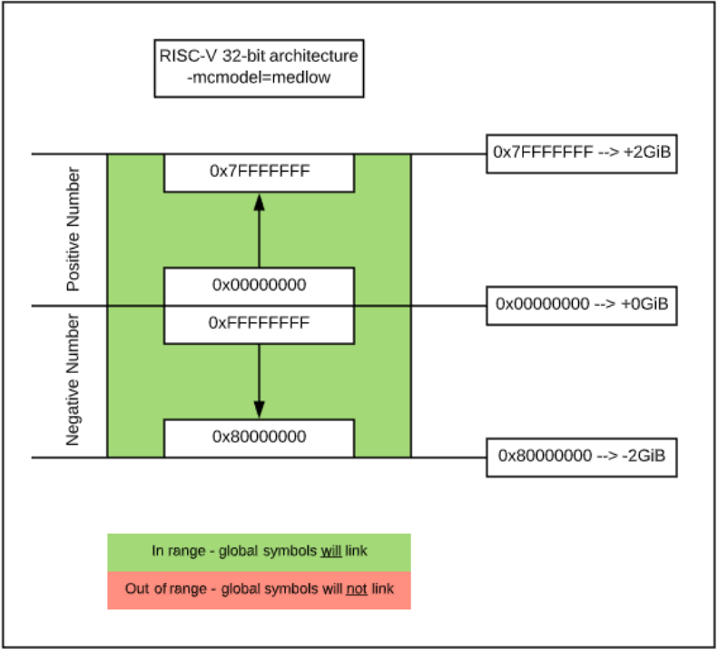
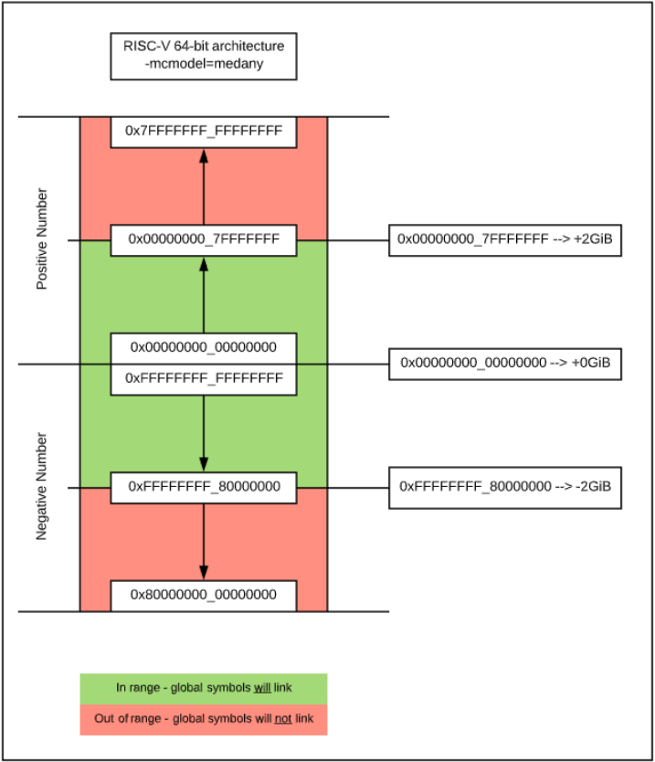

# The problem
* linking process led to errors such as  
```test.o: in function `search_for_word_in_memory':
/media/Shared/Martin/Documents/Uni/20SS/PR_Bachelor_Projekt/Software/selfie_bare_metal/wrapper/k210/hello-world.c:89:(.text+0x300): relocation truncated to fit: R_RISCV_HI20 against symbol `foo' defined in COMMON section in test.o```
* it turns out that this is fixed by the compile flag `-mcmodel=medany`


# Relocation
* assembler emits relocation symbols (e.g. `R_RISCV_HI20`) which are replaced with actual values by the linker
* error is caused by an unreachable address (i.e. not reachable with 32 bit absolute addresses) due to the default `medlow` code model
    * that's because our `.text` section starts at `FW_TEXT_START` which equals to `0x8000_0000` for qemu, the FU540 and the k210


# The code models
* 32-bit signed offsets for symbol references
* determins how code is generated **within** a function
## `medlow` (medium-low code model)
* default code model
* uses `lui`/`ld` pairs to refer to global symbols
    * intended for 32 bit architecture
    * code must reside within the first +/- 2 GiB of memory, thus covering the whole address space in 32 Bit (wrap-around). This is due to `lui`/`ld` being able to cover only a range of absolute addresses of -2^(31)..2^(31)-1
        * since immediate values from U-type instructions are sign-extended, this allows us to address the 2GiB at the top of the address space (the "negative" addresses)
    * assembler emits `R_RISCV_HI20`/`R_RISCV_LO12_I` relocation sequences
* program and statically defined symbols both must lie within a single 2GiB address range and must lie between absolute addresses -2GiB and +2GiB
* programs can be statically or dynamically linked




## `medany` (medium-any code model)
* uses `auipc`/`ld` pairs to refer to global symbols
    * code can be linked at any address, as auipc is used to calculate the symbol's address relative to the PC
    * assembler emits `R_RISCV_PCREL_HI20`/`R_RISCV_PCREL_LO12_I` relocation sequences
* program and statically defined symbols must be within any single 2GiB address range
* programs can be statically or dynamically linked




# Sources
* https://www.sifive.com/blog/all-aboard-part-2-relocations
* https://www.sifive.com/blog/all-aboard-part-4-risc-v-code-models
* https://github.com/riscv/riscv-gcc/commit/95d1d5e9aa8fbc019680ba9e5818084c35e5841d
* https://sifive.cdn.prismic.io/sifive%2F15d1d90e-f60e-42a2-b6bf-c805c6c73b0d_riscv-large-code-model-workaround.pdf

**See also:**
* https://github.com/riscv/riscv-elf-psabi-doc/blob/master/riscv-elf.md#relocations
